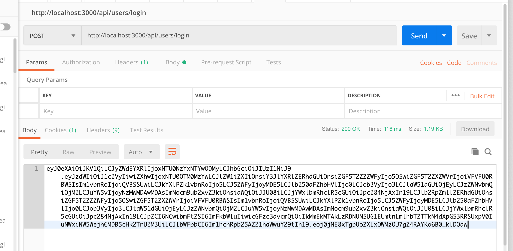
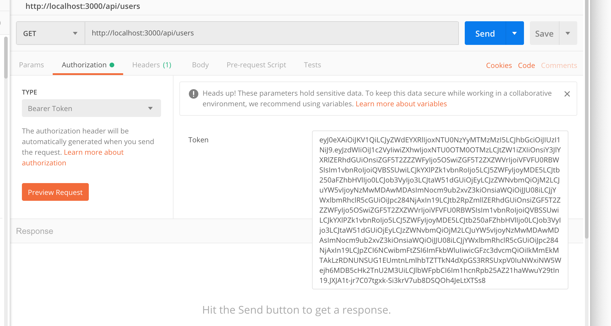
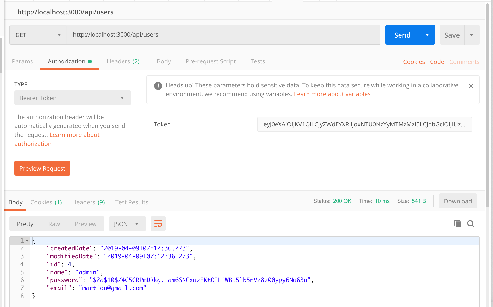

## 개발환경

- Spring Boot Version : 2.0.5.RELEASE
- Build Tool : Gradle
- JDK Version : 1.8
- Vuejs Version : 2.5.2
- IDE : VSCode

## 무엇을 해볼까?

최근 프론트엔드 프레임워크들이 급성장하면서 Restful API + 프론트엔드 프레임워크 조합으로 개발하는 서비스들이 점점 늘고 있습니다. 오늘은 Spring Boot + Vue.js 으로 개발하는 도중에 제가 애를 많이 먹었던 로그인 기능을 구현해 보려고 해요.

## 구성

로그인 기능이라고 하면 어떤 것이 생각나시나요? JSP를 사용해보신 분이라면 폼에 토큰을 직접 삽입하는 식의 코드들이 쉽게 생각나실지도 모릅니다. 백엔드와 프론트엔드가 완전히 분리되어 있지 않은 프로젝트에서는 서버가 계속해서 세션을 유지하면서 세션 쿠키에 로그인 정보를 들고 있기도 합니다. 저는 이전에 RubyOnRails에서 devise gem을 사용해 로그인과 권한을 어마어마하게 쉽게 구현해 본 적이 있는데요, Spring Boot를 맞닥뜨리니 이거 참 하나부터 열까지 다 만들어 줘야 되는 것이었습니다.

거칠게 생각해 봅시다. 서버와 프론트가 완전히 분리된 구조에서 서버는 클라이언트가 정상적인 사용자인지, 어떤 사용자인지 알 수 있는 방법은 무엇이 있을까요? 식당에서 대기표를 받아서 기다렸다가 나중에 입장하듯이 클라이언트가 무언가 인식표 같은 걸 발급받아서 자신이라는 걸 인증해야겠죠? 우리는 그것을 '토큰'이라고 부르고 이 토큰은 클라이언트의 로컬 쿠키에 저장합니다.

아마 [꼭 쿠키를 저장하는 수 밖에 없어?][cookie-1] 뭔가 해킹당할 것 같고 불안한데? 라고 생각이 들 수도 있는데요, 물론 준비가 필요합니다.

```
안전한 HttpOnly 쿠키에 저장해야 합니다. 이렇게 해야 Cross-Site Scripting(XSS) 공격을 방지할 수 있습니다.
쿠키를 사용해서 JWT를 전송한다면, CSRF 방어가 무엇보다 중요합니다. 악의적인 다른 도메인에 의해서 사용자가 인식하지 못 하는 사이에 우리가 구축한 웹 서버로 요청이 발생할 수 있기 때문입니다. 토큰의 전송 방식으로 쿠키를 사용한다면 CSRF에 대한 대비책을 반드시 준비 해야 합니다.
....
```

[JWT 자바 가이드][jwt-2] 게시글의 '토큰은 안전한가?' 항목을 참조하시면 더 자세한 내용을 알 수 있습니다.
(아쉽게도 참조한 예제는 Spring Security가 아닌 다른 라이브러리를 사용합니다.)

## 흐름 생각해 보기

1. 사용자가 회원가입을 합니다. (아무런 권한 필요 없음)
2. 서버에서 사용자의 비밀번호는 암호화해서 DB에 저장합니다.
3. 클라이언트가 회원가입한 아이디/비밀번호로 로그인 요청을 보냅니다.
4. 서버는 사용자가 전송한 아이디/비밀번호를 DB에서 가져와 복호화 한 뒤에 유저의 비밀번호와 같은 지 확인합니다.
5. 맞다면, 클라이언트에게 토큰을 전달해 줍니다.
6. 클라이언트는 전송된 토큰을 로컬 쿠키에 저장합니다.
7. 클라이언트는 서버에 요청할 때 항상 헤더에 토큰을 포함합니다.
8. 서버는 요청을 받을 때 토큰이 유효한 지 검사합니다.

## 핵심 클래스, 메소드

1. `Webconfig` : Spring Security의 @Configuration 입니다. addInterceptors를 Override해서 리퀘스트가 왔을 때 먼저 가로채서 사용자를 인증합니다.
2. `addInterceptor` : `registry.addInterceptor(jwtInterceptor)`를 호출해 인증 로직을 등록합니다.
3. `preHandle(request, response, handler)` : jwtInterceptor는 스프링의 HandlerInterceptor를 Override합니다. preHandle 메소드을 Override해서 토큰을 확인합니다.
4. `jwtService.isUsuable(token)` : token이 유효한지 아닌지 검사합니다.
5. `UserController` : 마침내 컨트롤러에 들어섰습니다. token이 유효하다는 뜻입니다.
6. `@GetMapping public Users getUser("/") { ... }` : 유저의 url에 맞는 api가 실행됩니다.

## 참조한 사이트

[AlwaysPr 님의 Spring boot환경에서 JWT 사용하기][jwt-1] 라는 글입니다. 대부분의 코드를 이 글에서 참조하였습니다.

[제 프로젝트 저장소][github-1]에서 전체 코드를 확인하실 수 있습니다.

## 코드

### build.gradle

```
buildscript {
    repositories {
        mavenCentral()
    }
    dependencies {
        classpath("org.springframework.boot:spring-boot-gradle-plugin:2.0.5.RELEASE")
    }
}

apply plugin: 'java'
apply plugin: 'eclipse'
apply plugin: 'idea'
apply plugin: 'org.springframework.boot'
apply plugin: 'io.spring.dependency-management'

bootJar {
    baseName = 'gs-spring-boot'
    version =  '0.1.0'
}

repositories {
    mavenCentral()
}

sourceCompatibility = 1.8
targetCompatibility = 1.8

dependencies {
	implementation 'org.springframework.boot:spring-boot-starter-thymeleaf'
	implementation 'org.springframework.boot:spring-boot-starter-web'
	implementation('org.springframework.boot:spring-boot-starter-actuator')
    implementation('org.springframework.boot:spring-boot-starter-data-jpa')
	compile('org.springframework.boot:spring-boot-starter-security')
    compile group: 'io.jsonwebtoken', name: 'jjwt', version: '0.7.0'
    compile('org.springframework.security.oauth:spring-security-oauth2')
	compileOnly 'org.projectlombok:lombok'
	runtime('com.h2database:h2')
	annotationProcessor 'org.projectlombok:lombok'
	testCompile("junit:junit")
	testImplementation 'org.springframework.boot:spring-boot-starter-test'
}

```

기존에 build.gradle이 있다면 `compile group: 'io.jsonwebtoken', name: 'jjwt', version: '0.7.0' ` 만 추가해주셔도 될 것 같습니다. jjwt 버젼은 사용하시는 SpringBoot 버젼에 따라서 조정해 주시면 됩니다.

### security/Webconfig.java

```
package com.greenhair.template.security;

import org.springframework.beans.factory.annotation.Autowired;
import org.springframework.context.annotation.Configuration;
import org.springframework.web.servlet.config.annotation.InterceptorRegistry;
import org.springframework.web.servlet.config.annotation.WebMvcConfigurer;

@Configuration
public class WebConfig implements WebMvcConfigurer {
    private static final String[] EXCLUDE_PATHS = {
        "/api/users/create",
        "/api/users/login",
        "/member/**",
        "/error/**"
    };

    @Autowired
    private JwtInterceptor jwtInterceptor;

    @Override
    public void addInterceptors(InterceptorRegistry registry) {
        registry.addInterceptor(jwtInterceptor)
                        .addPathPatterns("/**")
                        .excludePathPatterns(EXCLUDE_PATHS);
    }
}
```

### service/JwtService.java

```
package com.greenhair.template.service;

import java.util.Map;

public interface JwtService {
	<T> String create(String key, T data, String subject);
	Map<String, Object> get(String key);
	long getMemberId();
	boolean isUsable(String jwt);

}
```

### service/JwtServieImpl.java

```
@Slf4j
@Service("jwtService")
public class JwtServiceImpl implements JwtService{

    ....(중략)

    @Override
	public boolean isUsable(String jwt) {
		try{
			Jws<Claims> claims = Jwts.parser()
					  .setSigningKey(this.generateKey())
					  .parseClaimsJws(jwt);
			return true;

		}catch (Exception e) {

			if(log.isInfoEnabled()){
				e.printStackTrace();
			}else{
				log.error(e.getMessage());
			}
			throw new UnauthorizedException();

		}
	}
}
```

### Token 확인해 보기

PostMan을 활용해서 로그인을 해 보았습니다. response 형태는 제일 단순하게 token만 보내게 만들어 보았습니다.

토큰을 잘 반환되는 것을 확인할 수 있습니다.


반환된 토큰을 (클라이언트에서는 쿠키에 저장해서 보낸다고 생각하고) Autorization의 Bearer Token을 선택하고 입력해 줍니다.


에러 없이 사용자 정보가 반환되는 것을 확인할 수 있습니다.

- 만약 405 에러가 발생하는 경우에는 1. 토큰이 만료되었거나 2. 인증 과정에서 문제가 생겼을 수도 있고 3. 컨트롤러에 적절한 api를 만들지 않았을 수도 있으니 에러 로그를 잘 확인해서 에러를 해결하시면 됩니다.

## 결론

처음에 저도 막연히 로그인 기능을 만들어야지 라고 생각했습니다. 레일즈로 개발할 때는 gem 하나만 추가하면 되었기에 Spring Boot로 개발하려다 보니 이게 스프링 시큐리티, JWT, OAUTH2 까지 여러 기술로 이루어져 있다는 것을 깨달았습니다. 완전히 동작하는 예를 찾지 못해서 한참 헤메다가 겨우 완성했는데요, 다음에 로그인 기능을 처음부터 만드시는 분께 도움이 되기를 바라며 정리해 보았습니다.

## 다음 할 일

1. 테스트를 만듭니다 : 스프링의 MVC Test를 활용해서 API에 입력해서 회원가입/로그인이 제대로 작동하는 지 확인합니다.
2. Spring Seurity를 사용해 같은 기능을 만들어 봅니다.

[tutorial]: https://jojoldu.tistory.com/251?category=635883
[error-1]: https://github.com/spring-projects/spring-ide/issues/273
[cookie-1]: https://github.com/spring-projects/spring-ide/issues/273
[jwt-1]: https://alwayspr.tistory.com/8
[jwt-2]: https://medium.com/@OutOfBedlam/jwt-자바-가이드-53ccd7b2ba10
[github-1]: https://github.com/MartianLee/vue-springboot-service
