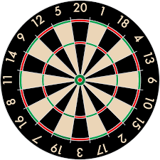

## 문제 요약

예시로 다트 판이 주어집니다. 실제 다트 판과 같이 가운데 BULL, 트리플, 더블로 구성되어 있습니다. 놀랍게도 다트 판과 (각 구간의 반지름과 다트판의 중심을 0,0이라고 했을 때) 다트핀의 위치가 주어졌을 때, 다트의 총 점수를 구하는 문제입니다.

처음에 잘못 읽었나 눈을 의심했지만 정말 다트판을 구현하는 문제였습니다. ㅋㅋㅋㅋ 실제 이 다트판 맞습니다.


자세한 문제는 [코드그라운드의 연습문제][codeground]에서 다트 게임을 찾으시면 됩니다.

## 풀이

간단한 수학 두 가지를 사용합니다. `피타고라스 정리`와 `아크탄젠트` 입니다. 피타고라스 정리야 쉽게 쓴다지만 삼각함수 이야길 들으니까 머리가 갑자기 지끈지끈 하시는 분들 계시죠? ㅋㅋ 아크탄젠트는 탄젠트의 역함수입니다.

### 풀이 순서

1. 모든 다트의 원점에서의 거리를 구합니다.
2. 구한 거리로 BULL에 포함되었는지 트리플인지 더블인지, 아웃인지 검사합니다.
3. 다트가 원점에서 몇 도로 기울어져 있는 지 구합니다.
4. 어떤 점수 구간에 속하는 지 확인합니다.
5. 최종 점수에 더해줍니다.

### 피타고라스 정리

모두가 알다시피 `a^2 + b^2 = c^2` 입니다.

다트판의 중심에서 다트핀까지 거리를 구하는 데 사용합니다.

### 아크탄젠트

```
#include <math.h>

double getDegree(double x, double y) {
	double result = atan2(y, x) * 180 / 3.141592;
	if (result < 0)
		return 360 + result;
	return result;
}
```

getDegree는 다트핀이 원점에서 얼마나 기울어져 있는 지 확인하기 위한 함수입니다. 여기서 math.h 헤더에 포함되어 있는 atan2() 함수를 사용합니다. 결과는 라디안으로 제공되기 때문에 180 / π 를 곱해주어야 합니다. 파이값은 머릿속에 있는 3.141592를 사용했습니다. 다행히 다트 위치가 -30000 ~ 30000 사이라서 정확도는 문제가 없을 것 같습니다!

## 전체 소스

```
#include <iostream>
#define _USE_MATH_DEFINES
#include <math.h>

using namespace std;

int Answer;
int val[22] = { 6, 13, 4, 18, 1, 20, 5, 12, 9, 14, 11, 8, 16, 7, 19, 3, 17, 2, 15, 10, 6 };

double getDegree(double x, double y) {
	double result = atan2(y, x) * 180 / 3.141592;
	if (result < 0)
		return 360 + result;
	return result;
}

int main(int argc, char** argv)
{
	int T, test_case;

	cin >> T;
	for (test_case = 0; test_case < T; test_case++)
	{

		Answer = 0;

		int a, b, c, d, e;
		cin >> a >> b >> c >> d >> e;
		int n;
		cin >> n;
		double x, y;
		for (int i = 1; i <= n; i++) {
			cin >> x >> y;
			double degree = getDegree(x, y);
			double eval = -9;
			int lengthSquare = x * x + y * y;
			for (int j = 0; j <= 20; j++) {
				if (eval <= degree && degree < eval + 18) {
					if (lengthSquare <= a * a) {
						Answer += 50;
					}
					else if (lengthSquare <=  b *b) {
						Answer += val[j];
					}
					else if (lengthSquare <= c * c) {
						Answer += val[j] * 3;
					}
					else if (lengthSquare <= d * d) {
						Answer += val[j];
					}
					else if (lengthSquare <= e * e) {
						Answer += val[j] * 2;
					}
					break;
				}
				eval += 18;
			}
		}

		cout << "Case #" << test_case + 1 << endl;
		cout << Answer << endl;
	}

	return 0;
}
```

- 편의를 위해 다트판 처음과 끝의 6을 val 배열에 모두 넣어주었습니다.
- 피타고라스 정리에서 제곱한 값을 그대로 사용했습니다. 루트를 취해주지 않아도 비교에는 문제가 없기 때문입니다.

## 결론

잊고 지냈던 아크탄젠트 함수와 구간 체크와 같이 코딩 집중력을 요구하는 문제입니다. 중간에 잠깐 손이 미끄러지면 틀리기 쉽습니다. atan2 함수를 사용해 볼 수 있었습니다. 막상 다 만들고 보니 정말 다트 게임을 만든 것 같아 의외로 뿌듯하군요 !!

[codeground]: https://www.codeground.org/practice
