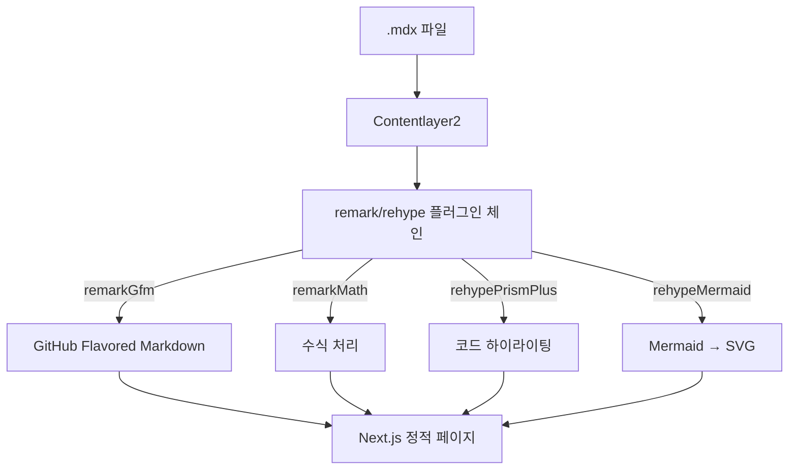
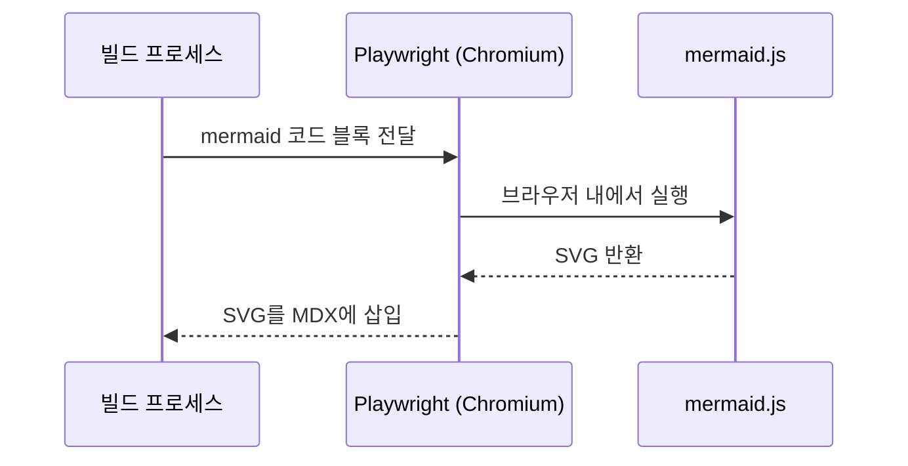
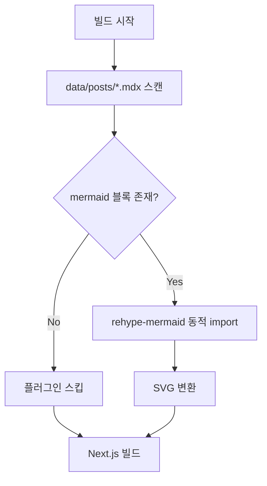

_This article is mostly written by Claude Code_

## Background

Diagrams are essential for explaining architectures and flows in a technical blog. Rather than opening an image editor every time, I wanted to write diagrams as text directly inside Markdown.


## Tech Stack

The content pipeline for this blog looks like this:



## Why rehype-mermaid?

There are two main approaches to rendering Mermaid diagrams:

| Approach                                  | Pros                                    | Cons                           |
| ----------------------------------------- | --------------------------------------- | ------------------------------ |
| **Client-side rendering** (mermaid.js)    | No Playwright required                  | ~800 KB increase in JS bundle  |
| **Build-time rendering** (rehype-mermaid) | No client-side JS, SVG inlined directly | Requires Playwright + Chromium |

Since this blog already uses a rehype plugin chain, `rehype-mermaid` is a natural fit.

## Installation

```bash
yarn add rehype-mermaid playwright
npx playwright install chromium
```

`rehype-mermaid` uses `mermaid-isomorphic` under the hood, which runs mermaid.js inside a headless browser to produce SVG output. This is necessary because mermaid.js itself depends on browser DOM APIs.



## The Key: Conditional Loading

The challenge lies in CI environments. Installing Playwright Chromium on every build — even when no post contains a Mermaid diagram — wastes build time unnecessarily.

**Solution:** Scan the post files at build time and load the plugin only when a ` ```mermaid ` block is actually found.



### Core Code in contentlayer.config.ts

````typescript
import { readFileSync, readdirSync } from 'fs'

function hasMermaidBlocks(): boolean {
  const postsDir = path.join(root, 'data', 'posts')
  try {
    return readdirSync(postsDir).some((file) => {
      if (!file.endsWith('.mdx')) return false
      return readFileSync(path.join(postsDir, file), 'utf-8').includes('```mermaid')
    })
  } catch {
    return false
  }
}

// Lazy-load: contentlayer's esbuild targets es2020,
// which doesn't support top-level await, so we wrap it in a function
function lazyRehypeMermaid() {
  let plugin: any = null
  return () => {
    return async (tree: any, file: any) => {
      if (!plugin) {
        const mod = await import('rehype-mermaid')
        plugin = mod.default({ strategy: 'inline-svg' })
      }
      return plugin(tree, file)
    }
  }
}

const useMermaid = hasMermaidBlocks()

// Conditionally append to the rehypePlugins array
rehypePlugins: [
  // ... existing plugins
  ...(useMermaid ? [lazyRehypeMermaid()] : []),
  [rehypePrismPlus, { defaultLanguage: 'js', ignoreMissing: true }],
]
````

### GitHub Actions CI

````yaml
- name: Check for mermaid diagrams
  id: check-mermaid
  run: |
    if grep -r '```mermaid' data/posts/ >/dev/null 2>&1; then
      echo "found=true" >> $GITHUB_OUTPUT
    else
      echo "found=false" >> $GITHUB_OUTPUT
    fi
- name: Get Playwright version
  if: steps.check-mermaid.outputs.found == 'true'
  id: playwright-version
  run: echo "version=$(npx playwright --version | awk '{print $2}')" >> $GITHUB_OUTPUT
- name: Cache Playwright browsers
  if: steps.check-mermaid.outputs.found == 'true'
  uses: actions/cache@v4
  id: playwright-cache
  with:
    path: ~/.cache/ms-playwright
    key: ${{ runner.os }}-playwright-${{ steps.playwright-version.outputs.version }}
- name: Install Playwright Chromium (for mermaid rendering)
  if: steps.check-mermaid.outputs.found == 'true' && steps.playwright-cache.outputs.cache-hit != 'true'
  run: npx playwright install --with-deps chromium
- name: Install Playwright deps only (cached browsers)
  if: steps.check-mermaid.outputs.found == 'true' && steps.playwright-cache.outputs.cache-hit == 'true'
  run: npx playwright install-deps chromium
````

## Results

| Scenario                                | CI Behavior                                                             |
| --------------------------------------- | ----------------------------------------------------------------------- |
| **No** mermaid blocks                   | Playwright skipped — no change in build time                            |
| mermaid blocks **present** (cache miss) | Full Playwright + Chromium install (+30–40 seconds)                     |
| mermaid blocks **present** (cache hit)  | Browser binary (112 MB) served from cache, only OS deps installed (~5s) |

With this setup, simply writing a ` ```mermaid ` code block in any post is enough — SVG diagrams are generated automatically at build time.
