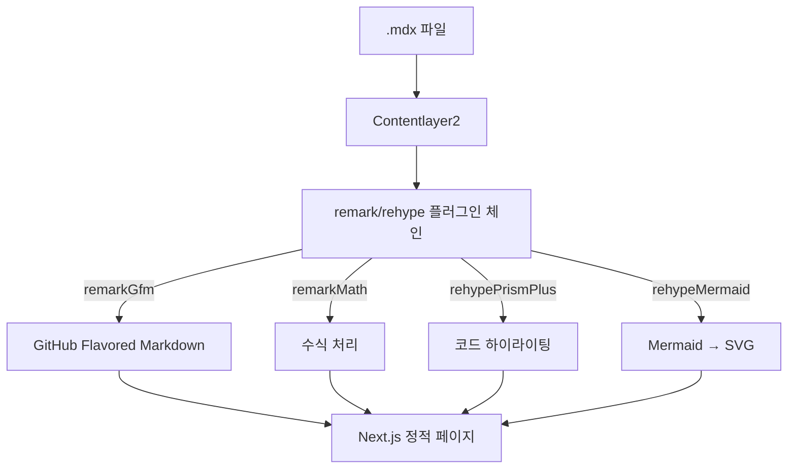
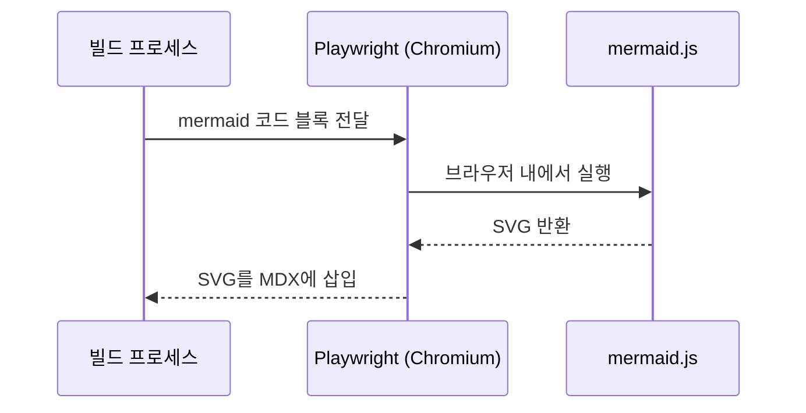
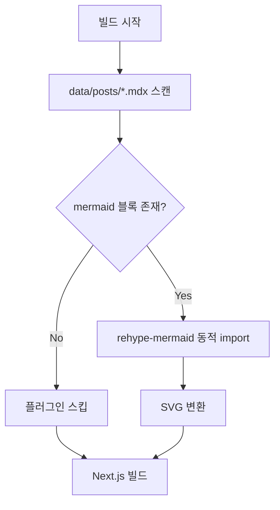

_This article is mostly written by Claude Code_

## 배경

기술 블로그에서 아키텍처나 플로우를 설명할 때 다이어그램은 필수입니다. 매번 이미지 툴을 열어 그리는 대신, 마크다운 안에서 텍스트로 다이어그램을 작성하고 싶었습니다.


## 기술 스택

이 블로그의 콘텐츠 파이프라인은 다음과 같습니다:



## 왜 rehype-mermaid인가?

Mermaid를 렌더링하는 방법은 크게 두 가지입니다:

| 방식                                  | 장점                              | 단점                       |
| ------------------------------------- | --------------------------------- | -------------------------- |
| **클라이언트 렌더링** (mermaid.js)    | playwright 불필요                 | JS 번들 ~800KB 증가        |
| **빌드 타임 렌더링** (rehype-mermaid) | 클라이언트 JS 없음, SVG 직접 삽입 | playwright + chromium 필요 |

이 블로그는 이미 rehype 플러그인 체인을 사용하고 있으므로, `rehype-mermaid`가 자연스럽게 맞습니다.

## 설치

```bash
yarn add rehype-mermaid playwright
npx playwright install chromium
```

`rehype-mermaid`는 내부적으로 `mermaid-isomorphic`을 사용하는데, 이 라이브러리가 headless 브라우저에서 mermaid.js를 실행해 SVG를 생성합니다. mermaid.js 자체가 브라우저 DOM API에 의존하기 때문입니다.



## 핵심: 조건부 로딩

문제는 CI 환경입니다. mermaid 다이어그램이 없는 포스트만 있을 때도 playwright chromium을 설치하면 빌드 시간이 낭비됩니다.

**해결:** 포스트 파일을 스캔해서 ` ```mermaid ` 블록이 있을 때만 플러그인을 로딩합니다.



### contentlayer.config.ts 핵심 코드

~~~typescript
import { readFileSync, readdirSync } from 'fs'

function hasMermaidBlocks(): boolean {
  const postsDir = path.join(root, 'data', 'posts')
  try {
    return readdirSync(postsDir).some((file) => {
      if (!file.endsWith('.mdx')) return false
      return readFileSync(path.join(postsDir, file), 'utf-8').includes('```mermaid')
    })
  } catch {
    return false
  }
}

// Lazy-load: contentlayer의 esbuild가 es2020 타겟이라
// top-level await를 사용할 수 없어서 함수로 감쌉니다
function lazyRehypeMermaid() {
  let plugin: any = null
  return () => {
    return async (tree: any, file: any) => {
      if (!plugin) {
        const mod = await import('rehype-mermaid')
        plugin = mod.default({ strategy: 'inline-svg' })
      }
      return plugin(tree, file)
    }
  }
}

const useMermaid = hasMermaidBlocks()

// rehypePlugins 배열에 조건부 추가
rehypePlugins: [
  // ... 기존 플러그인들
  ...(useMermaid ? [lazyRehypeMermaid()] : []),
  [rehypePrismPlus, { defaultLanguage: 'js', ignoreMissing: true }],
]
~~~

### GitHub Actions CI

~~~yaml
- name: Check for mermaid diagrams
  id: check-mermaid
  run: |
    if grep -r '```mermaid' data/posts/ >/dev/null 2>&1; then
      echo "found=true" >> $GITHUB_OUTPUT
    else
      echo "found=false" >> $GITHUB_OUTPUT
    fi
- name: Install Playwright Chromium (for mermaid rendering)
  if: steps.check-mermaid.outputs.found == 'true'
  run: npx playwright install --with-deps chromium
~~~

## 결과

| 상황                  | CI 동작                                          |
| --------------------- | ------------------------------------------------ |
| mermaid 블록 **없음** | playwright 스킵 → 빌드 시간 변화 없음            |
| mermaid 블록 **있음** | playwright 설치 (+30~40초 첫 빌드, 캐시 후 ~5초) |

이제 포스트에서 ` ```mermaid ` 코드 블록만 쓰면 빌드 타임에 자동으로 SVG 다이어그램이 생성됩니다.
