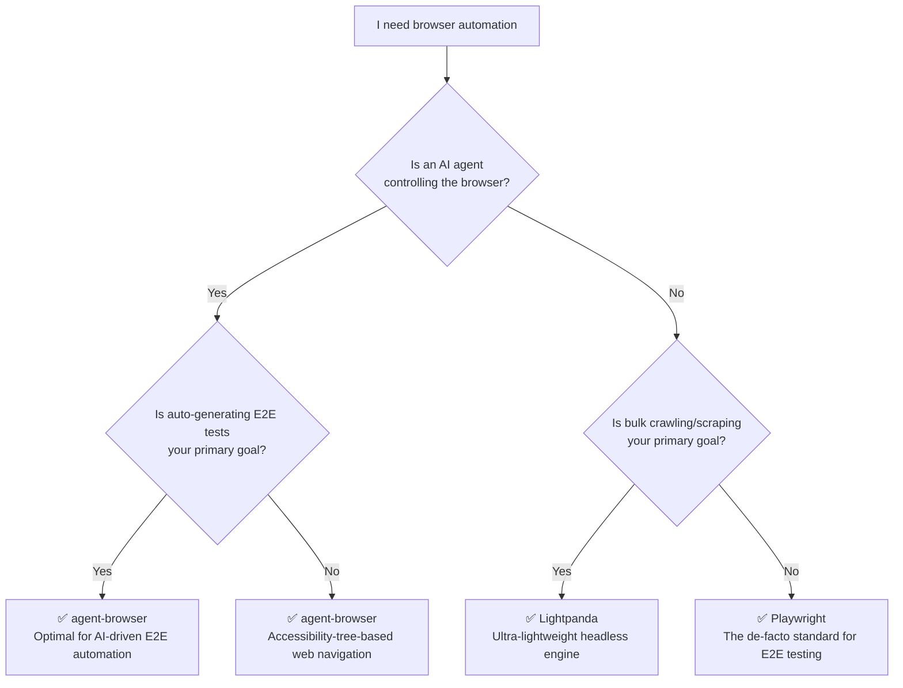

_This article is mostly written by Claude Code with [superpowers](https://github.com/obra/superpowers) skill_

When you need to choose a browser automation tool, the sheer number of options can be overwhelming. This post compares three tools that operate at different layers of the stack — **Playwright**, **agent-browser**, and **Lightpanda** — covering when to reach for each one and how the same task looks when implemented with each.

## Which Tool Should You Choose?

Follow the decision tree below to quickly find the right tool for your situation.



## Key Differences at a Glance

| Dimension           | Playwright                          | agent-browser                   | Lightpanda                    |
| ------------------- | ----------------------------------- | ------------------------------- | ----------------------------- |
| **Layer**           | Test framework (High-level)         | AI agent middleware (Mid-level) | Browser engine (Low-level)    |
| **Primary purpose** | E2E testing / general automation    | AI agent web navigation         | Bulk crawling / scraping      |
| **Language**        | TypeScript / Python / Java / C#     | Rust                            | Zig                           |
| **Browser**         | Bundled Chromium / Firefox / WebKit | Chrome / Lightpanda / Cloud     | Own engine (independent impl) |
| **Protocol**        | CDP + proprietary protocol          | CDP                             | CDP / MCP                     |
| **AI-friendliness** | Low (manual selectors)              | High (accessibility tree Refs)  | Medium (MCP support)          |
| **Resource usage**  | High (full browser)                 | Medium (daemon + browser)       | Low (9× less than Chrome)     |
| **JS execution**    | Full support                        | Delegated to browser            | Embedded V8 (partial support) |

## Tool Positioning

<strong>[Playwright](https://github.com/microsoft/playwright)</strong> is the most mature browser
automation framework and the de-facto standard for cross-browser E2E testing. Maintained by
Microsoft, it offers bindings for multiple languages and powerful debugging tooling. For an in-depth
look at its internals, see the [Playwright Architecture Analysis
Report](/kb/2026-04-17-playwright-architecture).

<strong>[agent-browser](https://github.com/vercel-labs/agent-browser)</strong> is middleware that
lets AI agents "see and interact with" the web. Developed by Vercel Labs, its
accessibility-tree-based Ref system allows LLMs to reference web elements naturally. For the
detailed architecture, see the [agent-browser Architecture
Analysis](/kb/2026-04-09-agent-browser-architecture).

<strong>[Lightpanda](https://github.com/lightpanda-io/browser)</strong> is an ultra-lightweight
headless engine redesigned from the ground up for AI and scraping workloads. It claims 9× lower
memory and 11× faster execution compared to Chrome. For the detailed architecture, see the
[Lightpanda Architecture Analysis](/kb/2026-03-13-lightpanda-architecture).

## Same Task, Different Approaches — Extracting the Top 5 Posts from Hacker News

To make the differences concrete, let's implement the same task with each tool.

**Task:** Extract the titles and URLs of the top 5 posts on the Hacker News front page.

### Playwright (TypeScript)

The traditional approach: target DOM elements directly with CSS selectors.

```typescript
import { chromium } from 'playwright'

const browser = await chromium.launch()
const page = await browser.newPage()
await page.goto('https://news.ycombinator.com')

const items = await page.locator('.titleline > a').evaluateAll((links) =>
  links.slice(0, 5).map((a) => ({
    title: a.textContent,
    url: a.href,
  }))
)

console.log(items)
await browser.close()
```

The developer must understand the page structure and write the CSS selectors manually. When the selectors are accurate, this approach is fast and reliable.

### agent-browser (CLI)

The AI agent "reads" the page through the accessibility tree and extracts data from it.

```bash
# Open the browser and navigate to the page
ab navigate https://news.ycombinator.com

# Inspect the accessibility tree snapshot of the current page
ab snapshot

# AI interprets the snapshot and extracts data (JSON output)
ab execute --js "
  const rows = document.querySelectorAll('.titleline > a');
  JSON.stringify([...rows].slice(0, 5).map(a => ({
    title: a.textContent,
    url: a.href
  })));
"
```

Even without knowing the CSS selectors, `ab snapshot` lets you understand the page structure. This workflow is optimized for AI agents that decide their next action based on a snapshot of the current page.

### Lightpanda (Direct CDP calls)

Lightpanda can be used in Playwright-compatible mode, but to take full advantage of its lightweight nature, you talk to CDP directly.

```python
import json
import websocket

# Connect to the Lightpanda CDP server (default port 9222)
ws = websocket.create_connection("ws://127.0.0.1:9222")

# Navigate to the page
ws.send(json.dumps({
    "id": 1,
    "method": "Page.navigate",
    "params": {"url": "https://news.ycombinator.com"}
}))
ws.recv()

# Extract data with JavaScript
ws.send(json.dumps({
    "id": 2,
    "method": "Runtime.evaluate",
    "params": {
        "expression": """
            JSON.stringify(
                [...document.querySelectorAll('.titleline > a')]
                    .slice(0, 5)
                    .map(a => ({ title: a.textContent, url: a.href }))
            )
        """
    }
}))
result = json.loads(ws.recv())
print(result["result"]["result"]["value"])
ws.close()
```

Driving CDP directly means the code sits at the lowest level, but in return it runs without Chrome and delivers overwhelming resource efficiency under large-scale parallel workloads.

## Conclusion

These three tools are not competing with each other — they occupy different layers of the browser automation stack. In summary:

- **E2E testing / general automation** → Playwright
- **AI agent web navigation** → agent-browser
- **Bulk crawling / scraping** → Lightpanda

They can also be combined. In fact, agent-browser already supports Lightpanda as a browser provider.

At work I use agent-browser to automate E2E test authoring, and I have been happy with it — it consumes fewer tokens and runs faster than writing tests manually with Playwright. If you are considering AI-driven test automation, I recommend giving agent-browser a try. For any browser-based task driven by an AI tool like Claude, it just seems like the right choice across the board. Playwright is noticeably slow and less stable, so I would reserve it as a last resort.

---

### Related Posts

- [Using Superpowers: Changing How I Work with Agents!](/kb/2026-04-18-superpowers-architecture)
- [agent-browser Architecture Analysis Report](/kb/2026-04-09-agent-browser-architecture)
- [Lightpanda Browser Architecture Analysis Report](/kb/2026-03-13-lightpanda-architecture)
- Playwright Architecture Analysis — coming soon
