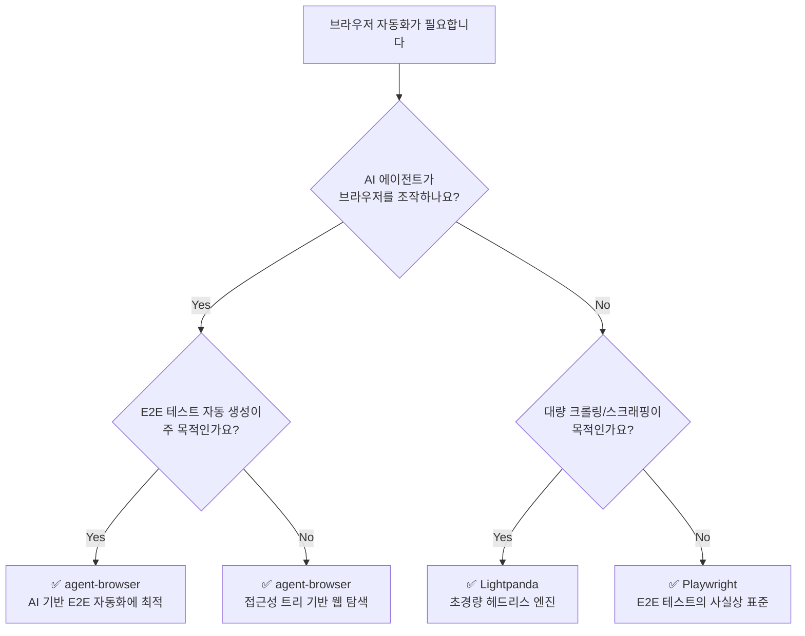

_This article is mostly written by Claude Code with [superpowers](https://github.com/anthropics/claude-code-plugins/tree/main/superpowers) skill_

브라우저 자동화 도구를 선택해야 할 때, 선택지가 너무 많아서 혼란스러울 수 있습니다. 이 글에서는 서로 다른 레이어에서 동작하는 세 가지 도구 — **Playwright**, **agent-browser**, **Lightpanda** — 를 비교합니다. 어떤 상황에서 어떤 도구를 선택해야 하는지, 같은 태스크를 각각 어떻게 구현하는지를 직접 보여드리겠습니다.

## 어떤 도구를 선택해야 할까?

아래 의사결정 트리를 따라가면 상황에 맞는 도구를 빠르게 찾을 수 있습니다.

