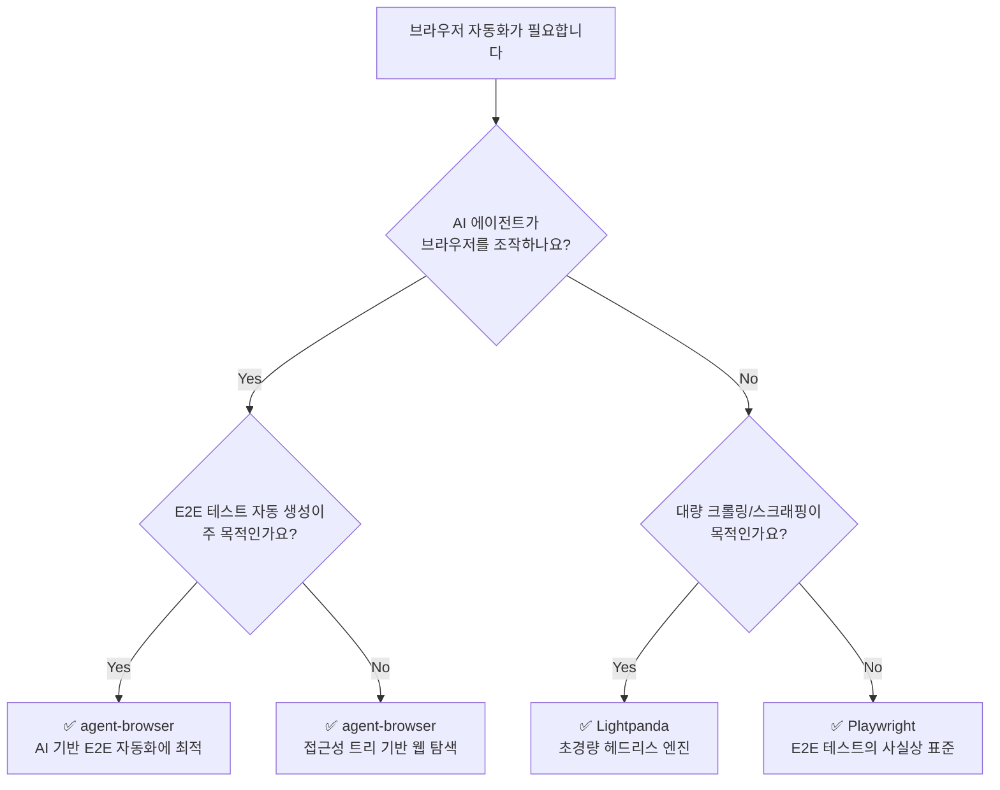

_This article is mostly written by Claude Code with [superpowers](https://github.com/obra/superpowers) skill_

브라우저 자동화 도구를 선택해야 할 때, 선택지가 너무 많아서 혼란스러울 수 있습니다. 이 글에서는 서로 다른 레이어에서 동작하는 세 가지 도구 — **Playwright**, **agent-browser**, **Lightpanda** — 를 비교합니다. 어떤 상황에서 어떤 도구를 선택해야 하는지, 같은 태스크를 각각 어떻게 구현하는지를 직접 보여드리겠습니다.

## 어떤 도구를 선택해야 할까?

아래 의사결정 트리를 따라가면 상황에 맞는 도구를 빠르게 찾을 수 있습니다.



## 핵심 차이 비교

| 비교 항목       | Playwright                       | agent-browser                    | Lightpanda                |
| --------------- | -------------------------------- | -------------------------------- | ------------------------- |
| **레이어**      | 테스트 프레임워크 (High-level)   | AI 에이전트 미들웨어 (Mid-level) | 브라우저 엔진 (Low-level) |
| **주요 목적**   | E2E 테스트 / 범용 자동화         | AI 에이전트 웹 탐색              | 대량 크롤링 / 스크래핑    |
| **언어**        | TypeScript / Python / Java / C#  | Rust                             | Zig                       |
| **브라우저**    | Chromium / Firefox / WebKit 번들 | Chrome / Lightpanda / Cloud      | 자체 엔진 (독립 구현)     |
| **프로토콜**    | CDP + 자체 프로토콜              | CDP                              | CDP / MCP                 |
| **AI 친화성**   | 낮음 (수동 셀렉터)               | 높음 (접근성 트리 Ref)           | 중간 (MCP 지원)           |
| **리소스 사용** | 높음 (실제 브라우저)             | 중간 (데몬 + 브라우저)           | 낮음 (Chrome 대비 9배)    |
| **JS 실행**     | 완전 지원                        | 브라우저 위임                    | V8 내장 (부분 지원)       |

## 도구별 포지셔닝

<strong>[Playwright](https://github.com/microsoft/playwright)</strong>는 가장 성숙한 브라우저 자동화
프레임워크로, 크로스 브라우저 E2E 테스트의 사실상 표준입니다. Microsoft가 관리하며, 다양한 언어
바인딩과 강력한 디버깅 도구를 제공합니다. 자세한 구조는 [Playwright 아키텍처 분석
보고서](/kb/2026-04-17-playwright-architecture)를 참고하세요.

<strong>[agent-browser](https://github.com/vercel-labs/agent-browser)</strong>는 AI 에이전트가 웹을
"눈으로 보고 손으로 조작"할 수 있게 해주는 미들웨어입니다. Vercel Labs에서 개발했으며, 접근성 트리
기반의 Ref 시스템으로 LLM이 웹 요소를 자연스럽게 참조할 수 있습니다. 상세 아키텍처는 [agent-browser
아키텍처 분석](/kb/2026-04-09-agent-browser-architecture)을 참고하세요.

<strong>[Lightpanda](https://github.com/lightpanda-io/browser)</strong>는 브라우저 자체를
AI/스크래핑 용도로 처음부터 재설계한 초경량 헤드리스 엔진입니다. Chrome 대비 9배 낮은 메모리, 11배
빠른 속도를 자랑합니다. 상세 아키텍처는 [Lightpanda 아키텍처
분석](/kb/2026-03-13-lightpanda-architecture)을 참고하세요.

## 같은 태스크, 다른 접근 — Hacker News 상위 5개 글 추출

세 도구의 차이를 체감하기 위해, 동일한 태스크를 각각 구현해 보겠습니다.

**태스크:** Hacker News 첫 페이지에서 상위 5개 글의 제목과 URL을 추출합니다.

### Playwright (TypeScript)

CSS 셀렉터로 DOM 요소를 직접 지정하는 전통적인 방식입니다.

```typescript
import { chromium } from 'playwright'

const browser = await chromium.launch()
const page = await browser.newPage()
await page.goto('https://news.ycombinator.com')

const items = await page.locator('.titleline > a').evaluateAll((links) =>
  links.slice(0, 5).map((a) => ({
    title: a.textContent,
    url: a.href,
  }))
)

console.log(items)
await browser.close()
```

개발자가 페이지 구조를 파악하고 CSS 셀렉터를 직접 작성해야 합니다. 셀렉터가 정확하면 빠르고 안정적입니다.

### agent-browser (CLI)

AI 에이전트가 접근성 트리를 통해 페이지를 "읽고" 데이터를 추출합니다.

```bash
# 브라우저를 열고 페이지 이동
ab navigate https://news.ycombinator.com

# 현재 페이지의 접근성 트리 스냅샷 확인
ab snapshot

# AI가 스냅샷을 해석하여 데이터 추출 (JSON 출력)
ab execute --js "
  const rows = document.querySelectorAll('.titleline > a');
  JSON.stringify([...rows].slice(0, 5).map(a => ({
    title: a.textContent,
    url: a.href
  })));
"
```

CSS 셀렉터를 몰라도 `ab snapshot`으로 페이지 구조를 파악할 수 있습니다. AI 에이전트가 스냅샷을 보고 다음 액션을 결정하는 워크플로우에 최적화되어 있습니다.

### Lightpanda (CDP 직접 호출)

Playwright 호환 모드로도 사용할 수 있지만, 핵심 가치인 경량성을 살리려면 CDP를 직접 호출합니다.

```python
import json
import websocket

# Lightpanda CDP 서버에 연결 (기본 포트 9222)
ws = websocket.create_connection("ws://127.0.0.1:9222")

# 페이지 이동
ws.send(json.dumps({
    "id": 1,
    "method": "Page.navigate",
    "params": {"url": "https://news.ycombinator.com"}
}))
ws.recv()

# JavaScript로 데이터 추출
ws.send(json.dumps({
    "id": 2,
    "method": "Runtime.evaluate",
    "params": {
        "expression": """
            JSON.stringify(
                [...document.querySelectorAll('.titleline > a')]
                    .slice(0, 5)
                    .map(a => ({ title: a.textContent, url: a.href }))
            )
        """
    }
}))
result = json.loads(ws.recv())
print(result["result"]["result"]["value"])
ws.close()
```

CDP를 직접 다루므로 코드가 가장 저수준입니다. 대신 Chrome 없이 동작하며, 대량 병렬 실행 시 리소스 효율이 압도적입니다.

## 결론

세 도구는 경쟁 관계가 아니라, 브라우저 자동화 스택의 서로 다른 레이어에 위치합니다. 정리하면:

- **E2E 테스트 / 범용 자동화** → Playwright
- **AI 에이전트의 웹 탐색** → agent-browser
- **대량 크롤링 / 스크래핑** → Lightpanda

그리고 이들은 조합해서 사용할 수 있습니다. 실제로 agent-browser는 Lightpanda를 브라우저 프로바이더로 지원합니다.

저는 회사에서 agent-browser를 활용해 E2E 테스트 작성을 자동화하고 있는데, Playwright로 수동 작성하는 것 대비 토큰 소모도 적고 속도도 빨라서 만족하고 있습니다. AI 기반 테스트 자동화를 고려하고 있다면 agent-browser를 추천합니다. 사실 claude 같은 AI 기반 도구로 브라우징 시키는 데에는 무조건 좋은 것 같습니다. Playwright는 상당히 느리고 안정성도 떨어져 최후의 경우에만 사용하는 것을 추천합니다.

---

### 관련 글

- [agent-browser 아키텍처 분석 보고서](/kb/2026-04-09-agent-browser-architecture)
- [Lightpanda 브라우저 아키텍처 분석 보고서](/kb/2026-03-13-lightpanda-architecture)
- Playwright 아키텍처 분석 — 추후 작성 예정
