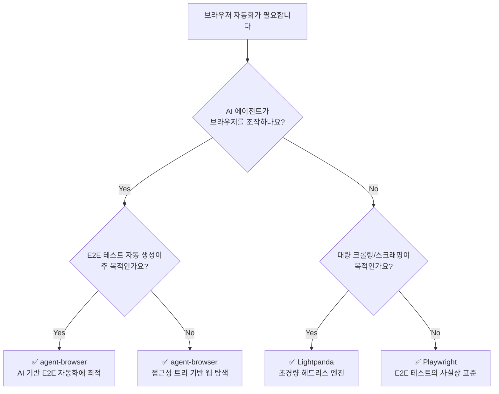

_This article is mostly written by Claude Code with [superpowers](https://github.com/anthropics/claude-code-plugins/tree/main/superpowers) skill_

브라우저 자동화 도구를 선택해야 할 때, 선택지가 너무 많아서 혼란스러울 수 있습니다. 이 글에서는 서로 다른 레이어에서 동작하는 세 가지 도구 — **Playwright**, **agent-browser**, **Lightpanda** — 를 비교합니다. 어떤 상황에서 어떤 도구를 선택해야 하는지, 같은 태스크를 각각 어떻게 구현하는지를 직접 보여드리겠습니다.

## 어떤 도구를 선택해야 할까?

아래 의사결정 트리를 따라가면 상황에 맞는 도구를 빠르게 찾을 수 있습니다.

## 핵심 차이 비교

| 비교 항목       | Playwright                       | agent-browser                    | Lightpanda                |
| --------------- | -------------------------------- | -------------------------------- | ------------------------- |
| **레이어**      | 테스트 프레임워크 (High-level)   | AI 에이전트 미들웨어 (Mid-level) | 브라우저 엔진 (Low-level) |
| **주요 목적**   | E2E 테스트 / 범용 자동화         | AI 에이전트 웹 탐색              | 대량 크롤링 / 스크래핑    |
| **언어**        | TypeScript / Python / Java / C#  | Rust                             | Zig                       |
| **브라우저**    | Chromium / Firefox / WebKit 번들 | Chrome / Lightpanda / Cloud      | 자체 엔진 (독립 구현)     |
| **프로토콜**    | CDP + 자체 프로토콜              | CDP                              | CDP / MCP                 |
| **AI 친화성**   | 낮음 (수동 셀렉터)               | 높음 (접근성 트리 Ref)           | 중간 (MCP 지원)           |
| **리소스 사용** | 높음 (실제 브라우저)             | 중간 (데몬 + 브라우저)           | 낮음 (Chrome 대비 9배)    |
| **JS 실행**     | 완전 지원                        | 브라우저 위임                    | V8 내장 (부분 지원)       |

## 도구별 포지셔닝

**Playwright**는 가장 성숙한 브라우저 자동화 프레임워크로, 크로스 브라우저 E2E 테스트의 사실상 표준입니다. Microsoft가 관리하며, 다양한 언어 바인딩과 강력한 디버깅 도구를 제공합니다. (Playwright 아키텍처 분석은 추후 작성 예정입니다.)

**agent-browser**는 AI 에이전트가 웹을 "눈으로 보고 손으로 조작"할 수 있게 해주는 미들웨어입니다. Vercel Labs에서 개발했으며, 접근성 트리 기반의 Ref 시스템으로 LLM이 웹 요소를 자연스럽게 참조할 수 있습니다. 상세 아키텍처는 [[2026-04-09-agent-browser-architecture|agent-browser 아키텍처 분석]]을 참고하세요.

**Lightpanda**는 브라우저 자체를 AI/스크래핑 용도로 처음부터 재설계한 초경량 헤드리스 엔진입니다. Chrome 대비 9배 낮은 메모리, 11배 빠른 속도를 자랑합니다. 상세 아키텍처는 [[2026-03-13-lightpanda-architecture|Lightpanda 아키텍처 분석]]을 참고하세요.
