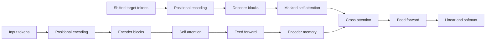
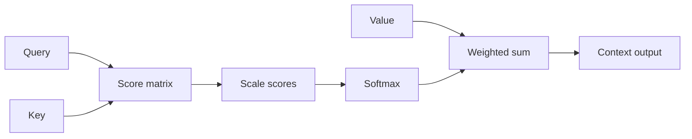
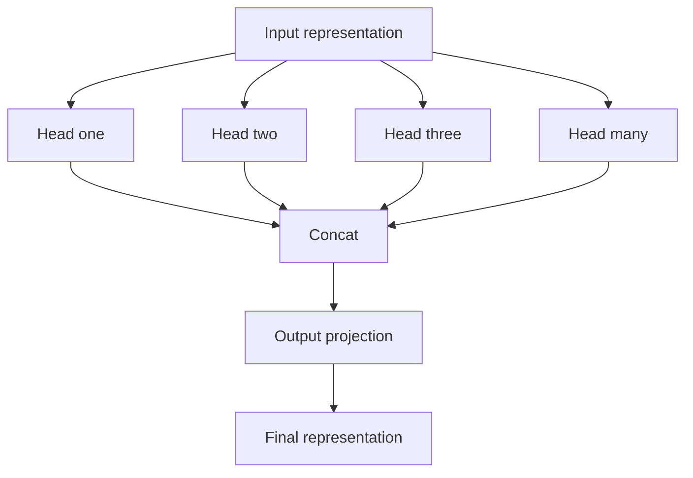
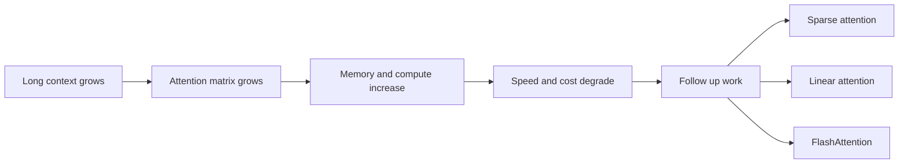

## Paper Info

- Title: Attention Is All You Need
- Authors: Ashish Vaswani et al.
- Venue: NeurIPS 2017
- URL: https://arxiv.org/abs/1706.03762

## One-Line Summary

A paper that builds a sequence-to-sequence model using **Self-Attention alone** — without any [RNN (recurrent neural network)](/kb/2026-04-18-llm-basics-rnn-sequential-processing) or CNN — and achieves both higher quality (BLEU) and faster parallel training at the same time.

## A Quick Orientation for First-Time Readers

This paper looks intimidating, but the core question is straightforward.

- "Do we have to read a sentence one word at a time, strictly in order?"
- "Wouldn't it be faster and more accurate to directly pick out the important words all at once?"

The Transformer takes the second approach: when processing a sentence, it compares every word against every other word simultaneously to find the important relationships directly.
If you want to understand why RNNs had to process tokens sequentially before diving in, read [RNN and Sequential Processing](/kb/2026-04-18-llm-basics-rnn-sequential-processing) first and then come back.

## Recommended Reading Order

1. Problem Definition
2. Scaled Dot-Product Attention
3. Multi-Head Attention
4. Experimental Results
5. Limitations and Future Work

Even if you cannot follow every formula, reading in this order is enough to grasp "why this paper matters."

## Common Stumbling Blocks

The first place readers typically get stuck is the attention formula.
If you are not sure what `Q`, `K`, and `V` each represent, `softmax(QK^T / sqrt(d_k))V` looks like a single block of cipher text.
At that point it helps to step away from the Scaled Dot-Product Attention section and briefly visit the [Q, K, V Intuition](/kb/2026-04-17-transformer-basics-qkv-intuition) note before continuing.

The second common sticking point is `softmax` and the dot product.
Attention first uses a [vector dot product](/kb/2026-04-17-llm-math-basics-vector-dot-product) to produce relevance scores, then converts those scores into reference weights via [softmax](/kb/2026-04-17-llm-math-basics-softmax).
You do not need to memorize the formula, but keeping the flow — "build a score table, then convert it to a proportion table" — in mind makes the reading much smoother.

## Problem Definition

[RNN-based seq2seq](/kb/2026-04-18-llm-basics-rnn-sequential-processing), which dominated machine translation at the time, suffered from several limitations.

- Sequential token processing makes training parallelization difficult.
- Long-range dependencies between distant tokens are hard to capture.
- As sequence length grows, the path length increases and training becomes increasingly inefficient.

The paper addressed these problems head-on with the question: "**Is attention all we need?**"

## Model Architecture

The original Transformer is an [encoder-decoder](/kb/2026-04-18-transformer-basics-encoder-decoder) architecture designed for translation.
The Encoder reads the input sentence and produces a representation; the Decoder references that representation to generate the output sentence.



### 1) Encoder-Decoder Skeleton

- Encoder: a stack of N identical blocks (N=6 in the base configuration).
- Decoder: likewise a stack of N blocks, with masked self-attention to prevent attending to future tokens.
- Each block includes a Residual Connection and LayerNorm.

If the difference in role between the Encoder and Decoder is unclear, see [Transformer Basics: Encoder and Decoder](/kb/2026-04-18-transformer-basics-encoder-decoder) first.
Why Residual connections, LayerNorm, and the FFN are needed inside each block is covered separately in the [Residual, LayerNorm, FFN](/kb/2026-04-17-transformer-basics-residual-layernorm-ffn) note.

### 2) Scaled Dot-Product Attention

The core operation:

```txt
Attention(Q, K, V) = softmax(QK^T / sqrt(d_k)) V
```

- `QK^T` computes the relevance between every pair of tokens.
- Dividing by `sqrt(d_k)` scales the scores to alleviate softmax saturation.
- The result is a weighted sum of `V` that produces a context vector.

`QK^T` computes all [dot products](/kb/2026-04-17-llm-math-basics-vector-dot-product) between Queries and Keys in one step, building a relevance score table.
`softmax` converts that score table into proportions — "how much to attend to each token."
If the roles of Q, K, and V are still unclear, it is worth visiting [Q, K, V Intuition](/kb/2026-04-17-transformer-basics-qkv-intuition) before proceeding.



### 3) Multi-Head Attention

Instead of a single attention computation, the input is split into multiple heads so that different relationships can be learned in parallel.
Rather than comparing Q/K/V through a single lens, the model simultaneously performs comparisons from multiple perspectives.

- The base model uses `d_model=512` and `h=8`.
- Each head runs attention in a lower-dimensional subspace, and the results are concatenated before a final projection.
- This allows the model to capture diverse patterns simultaneously — syntax, distance, alignment, and more.



### 4) Position-wise Feed-Forward Network

The same MLP is applied independently to each token position.

- Architecture: `512 -> 2048 -> 512` with ReLU.
- Attention handles inter-token interaction; the FFN handles non-linear transformation.

The division of responsibility between the FFN and attention is explained more clearly in the FFN section of the [Residual, LayerNorm, FFN](/kb/2026-04-17-transformer-basics-residual-layernorm-ffn) note.

### 5) Positional Encoding

Because attention has no inherent notion of order, positional information is injected explicitly.

- Fixed sinusoidal positional encoding based on sine and cosine functions.
- Order information can be represented without any learnable position embeddings.

## Experimental Results (Paper Highlights)

- WMT 2014 En-De: BLEU 28.4 (state of the art at the time).
- WMT 2014 En-Fr: BLEU 41.8 (best reported result at the time).
- Training time was dramatically reduced compared to the previously best models.

The key takeaway: better quality AND faster training.

## Why It Still Matters Today

- The Transformer is the shared foundational building block of modern LLMs — GPT, BERT, T5, and beyond.
- Its "parallelism-friendly architecture" aligned perfectly with the era of large-scale pre-training.
- It became the starting point for subsequent research into long-context modeling, efficient attention, and improved positional encodings.

BERT, the natural next paper to read, takes the encoder side of this Transformer and extends it into a sentence-understanding model.
To get a head start on that distinction, [Encoder-only vs. Decoder-only](/kb/2026-04-18-llm-architecture-basics-encoder-only-decoder-only) is a useful companion read.

## Limitations and Future Work

- The memory and compute cost of Self-Attention grows as `O(n^2)` with sequence length.
- The cost explodes for very long contexts.
- This motivated the development of Sparse, Linear, and FlashAttention-family approaches.



## Notes to Keep

- This paper demonstrates how powerfully "eliminating the core bottleneck" can outperform "adding more complex tricks."
- The decision to abandon RNN entirely reshaped the direction of research for the following seven to eight years.
- It makes a great reference point for reading LLM papers, precisely because its architecture, formulas, and experimental design are all clearly laid out.

## Papers to Read Next

- [BERT (2018)](/kb/2026-04-18-bert-paper-note)
- GPT-2 / GPT-3
- RoPE (Rotary Positional Embedding)
- FlashAttention
