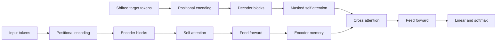
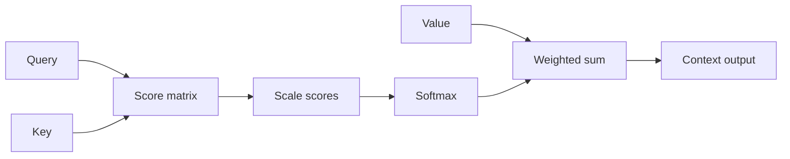
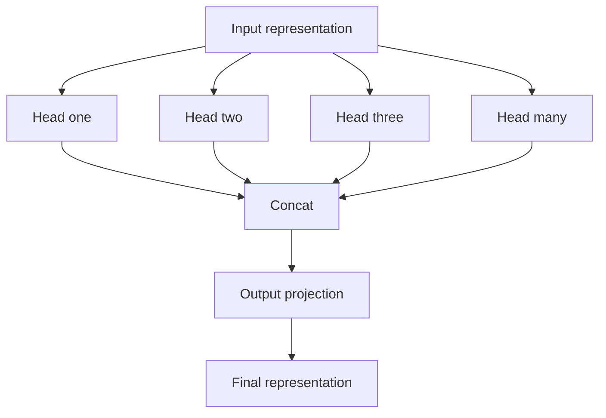
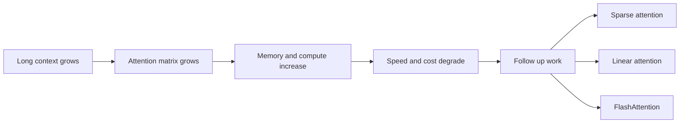

## Paper Info

- Title: Attention Is All You Need
- Authors: Ashish Vaswani et al.
- Venue: NeurIPS 2017
- URL: https://arxiv.org/abs/1706.03762

## 한 줄 요약

[순환 신경망(RNN)](/kb/2026-04-18-llm-basics-rnn-sequential-processing)/CNN 없이 **Self-Attention만으로** 시퀀스 변환 모델을 구성해,
더 높은 품질(BLEU)과 더 빠른 병렬 학습을 동시에 달성한 논문입니다.

## 처음 읽는 사람을 위한 빠른 해설

이 논문은 어렵게 보이지만 핵심 질문은 단순합니다.

- "문장을 읽을 때 단어를 순서대로만 봐야 하는가?"
- "중요한 단어를 한 번에 골라서 보면 더 빠르고 정확하지 않은가?"

Transformer는 두 번째 접근을 선택한 구조입니다.  
즉, 문장을 읽을 때 모든 단어를 서로 비교해서 중요한 관계를 바로 찾는 방식입니다.
기존 RNN이 왜 순서대로 처리해야 했는지 먼저 잡고 싶다면 [RNN과 순차 처리](/kb/2026-04-18-llm-basics-rnn-sequential-processing)를 읽고 돌아오면 됩니다.

## 이 페이지를 읽는 추천 순서

1. 문제 정의
2. Scaled Dot-Product Attention
3. Multi-Head Attention
4. 실험 결과
5. 한계와 후속 과제

수식을 완전히 이해하지 못해도 위 순서로 읽으면 "왜 이 논문이 중요한지"는 충분히 잡을 수 있습니다.

## 읽다가 막히기 쉬운 지점

이 논문에서 가장 먼저 막히는 지점은 attention 수식입니다.
`Q`, `K`, `V`가 각각 무엇인지 모르면 `softmax(QK^T / sqrt(d_k))V`가 한 덩어리 암호처럼 보입니다.
이때는 Scaled Dot-Product Attention 섹션을 읽다가 [Q, K, V 직관](/kb/2026-04-17-transformer-basics-qkv-intuition) 노트로 잠깐 빠지는 편이 좋습니다.

두 번째로 막히는 지점은 `softmax`와 내적입니다.
Attention은 먼저 [벡터 내적](/kb/2026-04-17-llm-math-basics-vector-dot-product)으로 관련도 점수를 만들고, 그 점수를 [softmax](/kb/2026-04-17-llm-math-basics-softmax)로 참고 비율로 바꿉니다.
수식을 다 외울 필요는 없지만, "점수표를 만들고 비율표로 바꾼다"는 흐름은 잡고 읽는 것이 좋습니다.

## 문제 정의

당시 기계번역의 주류였던 [RNN 기반 seq2seq](/kb/2026-04-18-llm-basics-rnn-sequential-processing)는 다음 한계가 있었습니다.

- 토큰을 순차 처리해서 학습 병렬화가 어렵습니다.
- 멀리 떨어진 토큰 간 의존성을 잡기 어렵습니다.
- 시퀀스 길이가 길수록 경로 길이(path length)가 늘어나 학습이 비효율적입니다.

논문은 이 문제를 "**어텐션만으로 충분한가?**"라는 질문으로 정면 돌파했습니다.

## 모델 구조

원래 Transformer는 번역을 위한 [encoder-decoder](/kb/2026-04-18-transformer-basics-encoder-decoder) 구조입니다.
Encoder는 입력 문장을 읽어 표현을 만들고, Decoder는 그 표현을 참고해 출력 문장을 생성합니다.



### 1) Encoder-Decoder 기본 골격

- Encoder: 동일한 블록 N개(논문 기본 N=6) 스택입니다.
- Decoder: 마찬가지로 N개 스택이며 미래 토큰 마스킹(masked self-attention)을 포함합니다.
- 각 블록은 Residual Connection + LayerNorm을 포함합니다.

Encoder와 Decoder의 역할 차이가 헷갈린다면 [Transformer 기초: Encoder와 Decoder](/kb/2026-04-18-transformer-basics-encoder-decoder)를 먼저 보면 됩니다.
각 블록 안에서 Residual, LayerNorm, FFN이 왜 필요한지는 [Residual, LayerNorm, FFN](/kb/2026-04-17-transformer-basics-residual-layernorm-ffn) 노트에서 따로 설명합니다.

### 2) Scaled Dot-Product Attention

핵심 연산:

```txt
Attention(Q, K, V) = softmax(QK^T / sqrt(d_k)) V
```

- `QK^T`로 토큰 간 관련성을 계산합니다.
- `sqrt(d_k)`로 스케일링해 softmax 포화를 완화합니다.
- `V`를 가중합해 문맥 벡터를 생성합니다.

여기서 `QK^T`는 Query와 Key의 [내적](/kb/2026-04-17-llm-math-basics-vector-dot-product)을 한꺼번에 계산해 관련도 점수표를 만드는 부분입니다.
`softmax`는 그 점수표를 "어떤 토큰을 얼마나 참고할지"의 비율로 바꿉니다.
Q, K, V의 역할이 아직 흐릿하다면 [Q, K, V 직관](/kb/2026-04-17-transformer-basics-qkv-intuition)을 먼저 보고 오는 편이 좋습니다.



### 3) Multi-Head Attention

단일 attention 대신 여러 head로 쪼개 서로 다른 관계를 병렬로 학습합니다.
즉, 같은 문장을 한 가지 기준으로만 보는 것이 아니라 여러 관점의 Q/K/V 비교를 동시에 수행합니다.

- Base 모델 기준은 `d_model=512`, `h=8`입니다.
- 각 head는 더 작은 차원에서 attention을 수행한 뒤 concat + projection을 적용합니다.
- 문법/거리/정렬 등 다양한 패턴을 동시에 포착합니다.



### 4) Position-wise Feed-Forward Network

각 토큰 위치별로 동일한 MLP를 적용합니다.

- `512 -> 2048 -> 512` (ReLU) 구조입니다.
- attention이 토큰 간 상호작용을 맡고, FFN이 비선형 변환을 맡습니다.

FFN이 attention과 어떻게 역할을 나누는지는 [Residual, LayerNorm, FFN](/kb/2026-04-17-transformer-basics-residual-layernorm-ffn) 노트의 FFN 섹션을 보면 더 명확합니다.

### 5) Positional Encoding

Attention은 순서 개념이 없기 때문에 위치 정보를 추가합니다.

- 사인/코사인 기반의 고정 positional encoding을 사용합니다.
- 학습 가능한 embedding 없이도 순서 정보를 표현할 수 있습니다.

## 실험 결과(논문 핵심)

- WMT 2014 En-De: BLEU 28.4 (당시 SOTA)입니다.
- WMT 2014 En-Fr: BLEU 41.8 (당시 최고 수준)입니다.
- 학습 시간도 기존 최고 모델 대비 크게 단축되었습니다.

핵심은 "성능이 좋은데 더 빠르게 학습된다"는 점입니다.

## 왜 지금도 중요한가

- GPT, BERT, T5 등 현대 LLM의 공통 기반 블록이 Transformer입니다.
- "병렬 친화적 구조"가 대규모 사전학습 시대와 정확히 맞물렸습니다.
- 이후 연구(긴 문맥, 효율 attention, 위치 인코딩 개선)의 출발점이 되었습니다.

다음으로 읽는 BERT는 이 Transformer의 encoder 쪽을 가져와 문장 이해 모델로 확장합니다.
그 차이를 미리 잡고 싶다면 [Encoder-only와 Decoder-only](/kb/2026-04-18-llm-architecture-basics-encoder-only-decoder-only)를 같이 보면 됩니다.

## 한계와 후속 과제

- Self-Attention의 메모리/연산량은 시퀀스 길이에 대해 `O(n^2)`로 증가합니다.
- 매우 긴 컨텍스트에서 비용이 급격히 커집니다.
- 이를 줄이기 위해 Sparse/Linear/FlashAttention 계열이 발전했습니다.



## 읽고 남길 메모

- 이 논문은 "더 복잡한 트릭"보다 "핵심 병목 제거"가 얼마나 강력한지 보여줍니다.
- RNN을 완전히 버린 결정이 이후 7~8년 연구 방향을 크게 바꿨습니다.
- LLM 논문 읽기의 기준점으로 삼기 좋은 이유는 구조, 수식, 실험 설계가 명확하기 때문입니다.

## 다음에 읽을 논문

- [BERT (2018)](/kb/2026-04-18-bert-paper-note)
- GPT-2 / GPT-3
- RoPE (Rotary Positional Embedding)
- FlashAttention
