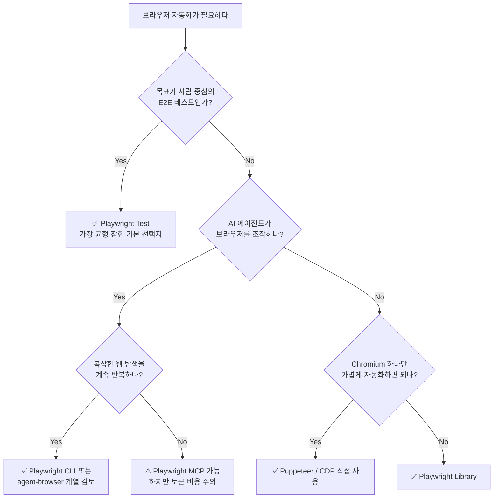
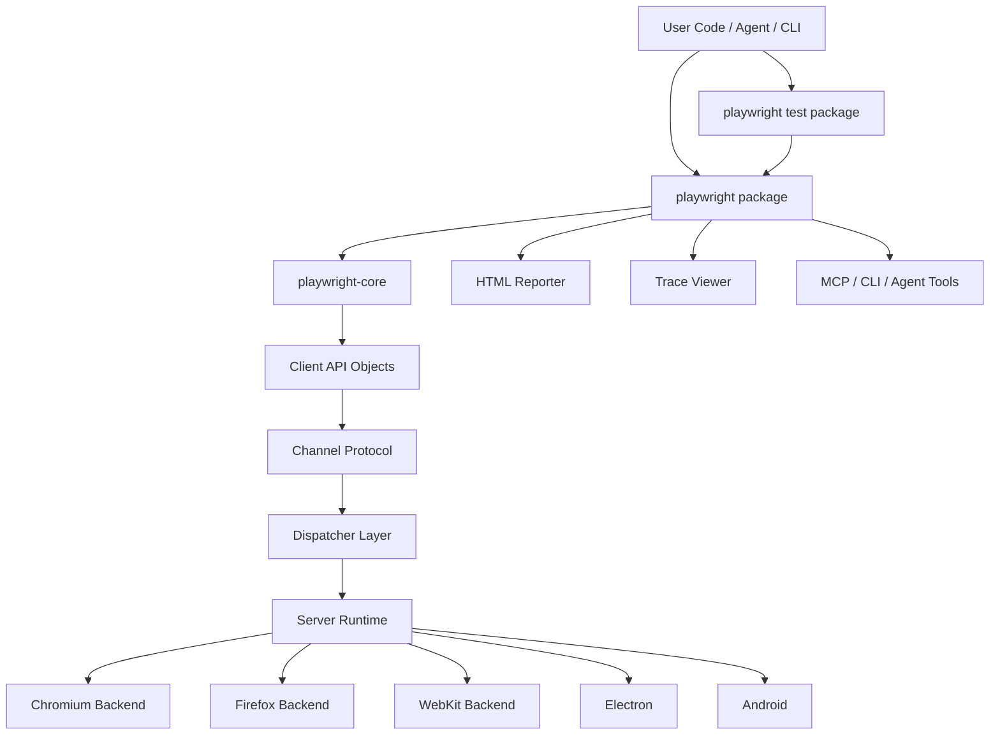
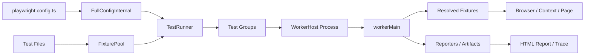
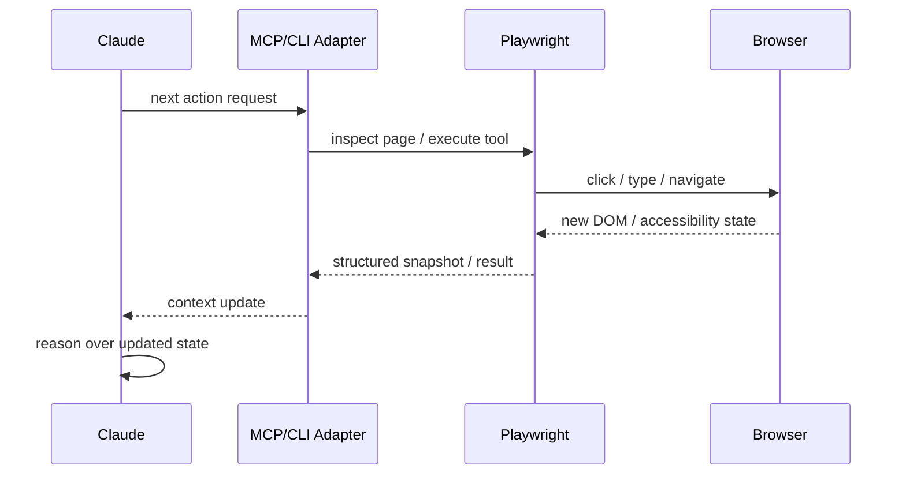

_This article is mostly written by Codex with local repository analysis_

Every conversation about browser automation eventually circles back to Playwright. It is the de facto standard for E2E testing, and lately it has been appearing as a browser backend for AI agents as well.

But once you actually dig into the repository, Playwright is not a simple test runner. It is closer to a **platform** — a browser automation engine with a test runner, reporter, Trace Viewer, CLI, and MCP stacked on top. This post walks through the internal structure of a locally checked-out Playwright repository, unpacking why the project is so widely adopted and where the performance bottlenecks come from.

## Bottom Line First

One-sentence summary of Playwright:

> **Playwright is the product that most evenly integrates a browser automation engine with test-operations tooling.**

That balance is why it is so popular. More modern than Selenium, more general-purpose than Cypress, more complete as a product than Puppeteer. The slowness and token cost that appear when you attach an LLM via MCP are a separate concern and should be evaluated on their own terms.

## When Should You Use Playwright?



## What Exactly Is Playwright?

The Playwright repository is a monorepo, not a single package. Simplified, it has three layers.

`playwright-core` is the browser-control engine. `playwright` is the user-facing package (including the test runner, CLI, and reporters). `@playwright/test` is a thin distribution package that sits on top of `playwright`.

In practice, most developers install `@playwright/test`, but the vast majority of the actual implementation lives in `playwright` and `playwright-core`.

## Core Architecture

Playwright's essence is captured by the diagram below.



This structure matters because Playwright is not a simple API wrapper — it is a **remote-friendly browser runtime**.

### What the Server Runtime Does

The server-side root `Playwright` object assembles Chromium, Firefox, WebKit, Electron, and Android together. It is the runtime root where per-browser implementations converge.

### How the Client Object Graph Works

User code does not touch browser processes directly. Instead, it works with client objects connected through a channel. `chromium.launch()`, `browser.newContext()`, and `page.goto()` all operate on top of this object graph.

### Why the Channel / Dispatcher Layer Matters

Because there is a `channel` and `dispatcher` layer in between, Playwright can reuse the same engine for local browser execution, remote connections, CLI usage, MCP, and browser-reuse modes alike.

This is one of the clearest ways Playwright feels more modern than Selenium-family tools. The architecture was designed for extensibility from the start.

## Why Playwright Test Is So Powerful

Many teams love Playwright not so much for `playwright-core` as for the `@playwright/test` experience. The heart of it is the **fixture-based test runner**.



### Fixtures Are More Than Dependency Injection

Playwright's fixture system is not just a convenience feature. `browser`, `context`, `page`, `storageState`, `baseURL`, `viewport`, tracing/artifact setup, and worker/test scope separation are all managed through the fixture graph. `FixturePool` validates dependencies, scope, overrides, and cycles, so Playwright treats fixtures as an **execution plan**.

This structure yields tangible benefits:

- Sharing common authentication state across tests is straightforward.
- Test isolation and worker reuse coexist without trade-offs.
- Teams can build custom fixture DSLs at scale.
- Configuration flows naturally through `test.use()` and the config-level `use` block.

### Parallel Execution Is Multi-Process

Playwright's parallel execution is not simply async concurrency. Test groups are dispatched to worker processes, and each worker independently manages its own browser, context, and artifacts. The result is a well-balanced combination of parallelism, isolation, and result collection.

In practice this makes a significant difference in CI operations.

## Why Playwright Has Become So Widely Adopted

Playwright's popularity does not come from any single killer feature; it comes from providing consistent coverage of everything practitioners need. First, `auto-wait`, locators, and web-first assertions make it easy to reduce flakiness. Traditional E2E tools tended toward `sleep` calls, arbitrary timeouts, and brittle selectors, whereas Playwright waits until elements are genuinely interactive before acting.

Second, controlling Chromium, Firefox, and WebKit through a single API makes cross-browser testing manageable. Third, the product bundles the automation engine together with the test runner, HTML report, Trace Viewer, screenshot/video/trace artifacts, project matrix, and fixture system — which lowers the cost of assembling your own operations tooling.

Fourth, failure analysis is well-supported. Debugging a failing E2E test is more expensive than writing it in the first place, and Playwright's Trace Viewer and HTML report cut the time needed to reconstruct what went wrong. Finally, the product strategy is forward-looking: the team is actively expanding Playwright Test, Playwright CLI, Playwright MCP, and Playwright Library simultaneously, pushing toward a full browser-automation platform.

## What a Typical Usage Pattern Looks Like

The most common usage pattern is still `@playwright/test`.

```typescript
import { test, expect } from '@playwright/test'

test('has title', async ({ page }) => {
  await page.goto('https://playwright.dev/')
  await expect(page).toHaveTitle(/Playwright/)
})
```

Behind this simple code, quite a bit is happening: a worker spins up a browser, the test fixture prepares the context and page, tracing/screenshot/video options are applied, assertion retry and auto-wait kick in, and the result is collected by the reporter.

A production config file follows a similar pattern: use `projects` for the browser matrix, gather shared context options in `use`, include `trace: 'on-first-retry'` and `reporter: [['html'], ['list']]`, and optionally attach `webServer` so the test runner also manages the application startup.

The real strength of Playwright for human developers is not "a reasonably good API" — it is **the entire development experience, operations included**.

## Why Does It Feel Slow When Paired with Claude?

This is the friction point that people who have actually used Playwright for agent workflows notice most acutely: it is slow and it consumes a lot of tokens. That experience is not a misperception.

The root cause is less about Playwright itself and more about **the structural requirement to continuously serialize browser state into a form the model can interpret**.



### Why Tokens Accumulate

An MCP-based workflow typically loops through these steps:

1. Open a page
2. Collect the accessibility tree or structured state
3. Model reads the state and decides the next action
4. Click / type / navigate
5. Collect state again

This loop is inherently token-expensive. Even without sending the full DOM, you still have to keep describing enough UI state for the model to act on.

### Why It Is Slow

What looks like a single click is actually multiple steps:

- Model reads state
- Model generates a tool call
- Tool manipulates the browser
- Result re-enters the model context
- Model reasons again

Mix in screenshots, vision, trace, and video and latency climbs further.

### Why the CLI Matters Here

This is precisely why the Playwright team emphasizes the CLI alongside MCP. The CLI uses the same engine but is more token-efficient for exactly this reason: MCP offers greater generality, but it carries more browser state into the model context as a consequence.

## Are There Alternatives?

The right answer depends on the use case, so it helps to separate them.

## If a Human Developer Is Running E2E Tests

In this scenario Playwright is still the most balanced choice.

### Selenium

Its strength is compatibility with legacy assets, but for productivity and debugging experience on modern web, Playwright is substantially better.

### Cypress

Developer experience for front-end engineers is excellent and in-app debugging is strong. However, Playwright is more flexible for general-purpose browser automation, multi-tab scenarios, and control outside the browser.

### Puppeteer

Great for fast Chromium-only automation, but it is not the integrated product that Playwright is — no bundled test runner, fixtures, reporter, or trace viewer.

In short:

- More modern than Selenium
- More general-purpose than Cypress
- More operationally complete than Puppeteer

## If an AI Agent Is Driving the Browser

The calculus shifts here.

### Playwright MCP

Highly flexible as a general-purpose protocol, but state-serialization costs tend to grow.

### Playwright CLI

Uses the same engine while being more token-efficient to operate, though it may not be as broadly general as MCP.

### agent-browser Family

Accessibility-tree and Ref-system design fits agent workflows well and can feel more LLM-friendly than Playwright. That said, it is not as general-purpose a platform as Playwright for human-authored E2E tests.

In practice the most realistic framing is: **Playwright Test is the default for human-driven E2E testing; Playwright CLI or the agent-browser family is the better default for agent-driven browser navigation**.

## What If Browser Automation Is Overkill?

Perhaps the best alternative is to remove the browser entirely.

Push anything that can be covered by API tests down to API tests. Anything that does not require a real browser should not spin one up. Reserve Playwright for the small set of user paths where it is genuinely necessary.

This is the most effective strategy for simultaneously improving both speed and cost.

## Final Verdict

Playwright remains a very strong choice — particularly as the most well-rounded tool available for human-written and human-operated E2E tests.

But this sentence belongs next to that assessment:

> **Playwright Test is excellent. Running Playwright MCP in a long loop with an LLM is an entirely different problem.**

The former excels at stability, debugging, and operational experience. The latter requires continuously pushing browser state into the model context, which makes it slow and expensive.

My preferred breakdown:

- **E2E tests written by human developers** → Playwright Test
- **Lightweight Chromium-only automation** → Puppeteer / direct CDP
- **AI agent browser navigation** → Playwright CLI or agent-browser family first
- **Speed / cost optimization as the top priority** → Push as much as possible to API tests

Playwright's prominence is not a product of hype cycles. It earns it through the balance of its browser automation engine, test runner, debugging tooling, and product strategy. The right evaluation of Playwright, however, depends entirely on what you are using it for.

---

### Related Posts

- [Playwright vs agent-browser vs Lightpanda — Which Browser Automation Tool Should You Use?](/kb/2026-04-16-browser-automation-comparison)
- [agent-browser Architecture Analysis Report](/kb/2026-04-09-agent-browser-architecture)
