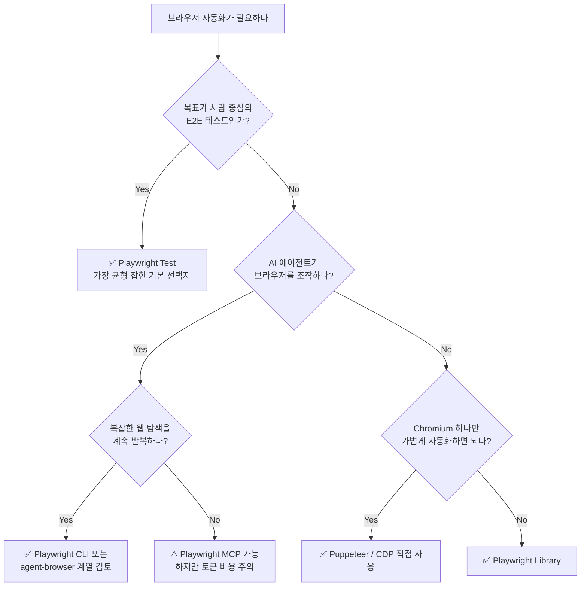
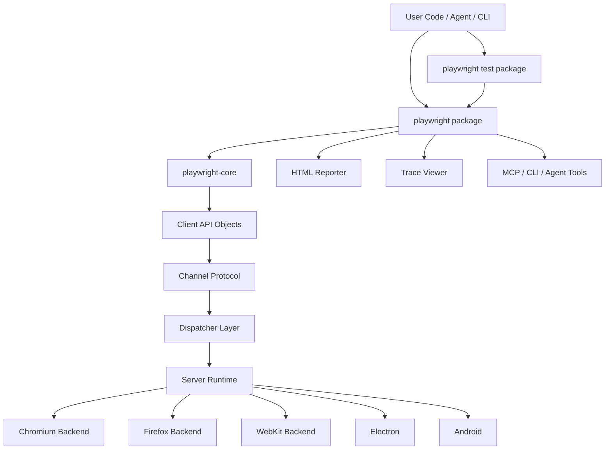
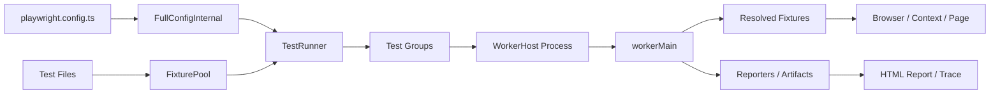
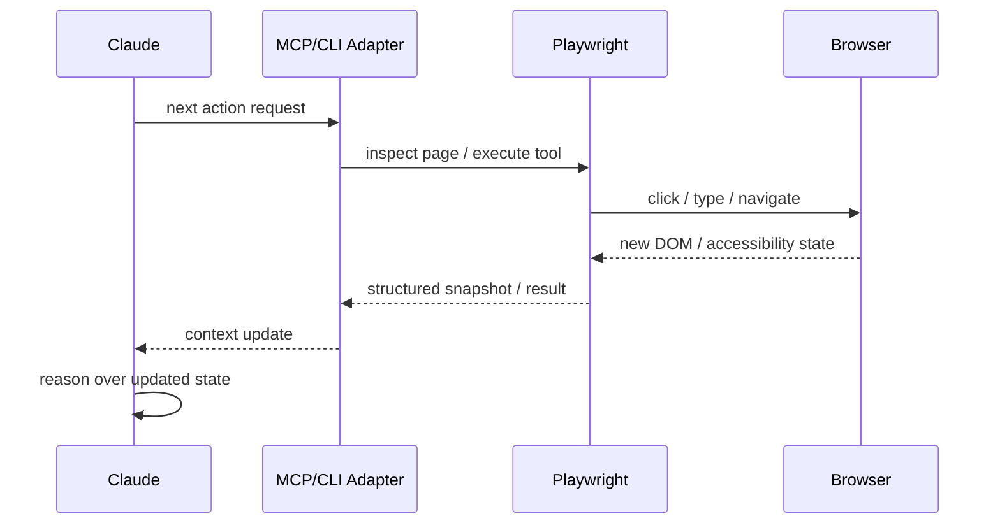

_This article is mostly written by Codex with local repository analysis_

브라우저 자동화 이야기를 하면 결국 다시 Playwright로 돌아오게 됩니다. E2E 테스트의 사실상 표준이고, 최근에는 테스트 도구를 넘어 AI 에이전트와 함께 쓰는 브라우저 백엔드로도 자주 언급됩니다.

그런데 실제 저장소를 뜯어보면, Playwright는 단순한 테스트 러너가 아닙니다. **브라우저 자동화 엔진 위에 테스트 러너, 리포터, Trace Viewer, CLI, MCP까지 얹은 플랫폼**에 가깝습니다. 이번 글에서는 로컬에 checkout한 Playwright 저장소를 기준으로 내부 구조를 직접 읽어보고, 왜 이렇게 널리 쓰이는지와 어디서 느려지는지까지 같이 정리합니다.

## 먼저 결론

Playwright를 한 줄로 요약하면 이렇습니다.

> **Playwright는 브라우저 자동화 엔진과 테스트 운영 도구가 가장 균형 있게 통합된 제품이다.**

그래서 각광받습니다. Selenium보다 현대적이고, Cypress보다 범용적이며, Puppeteer보다 제품 완성도가 높습니다. 다만 LLM과 MCP로 길게 붙이면 느리고 토큰 비용이 커지는 건 별개의 문제로 봐야 합니다.

## 언제 Playwright를 써야 할까?



## Playwright는 정확히 무엇인가?

Playwright 저장소는 단일 패키지가 아니라 모노레포입니다. 구조를 단순화하면 세 층으로 볼 수 있습니다.

`playwright-core`는 브라우저 제어 엔진이고, `playwright`는 사용자용 패키지(테스트 러너, CLI, reporter 포함)이며, `@playwright/test`는 실제로 `playwright` 위에 올라가는 얇은 배포 패키지입니다.

즉 많은 개발자가 `@playwright/test`를 쓰고 있지만, 내부 구현의 상당수는 `playwright`와 `playwright-core`에 있습니다.

## 핵심 아키텍처

Playwright의 본질은 아래 다이어그램으로 거의 설명됩니다.



이 구조가 중요한 이유는 Playwright가 단순 API wrapper가 아니라 **remote-friendly browser runtime**이기 때문입니다.

### 서버 런타임은 무엇을 하나

서버 쪽 루트 `Playwright` 객체는 Chromium, Firefox, WebKit, Electron, Android를 조립합니다. 즉 브라우저별 구현이 한데 모인 runtime root입니다.

### 클라이언트 객체 그래프는 어떻게 보나

사용자 코드가 직접 브라우저 프로세스를 만지는 것이 아니라, 채널을 통해 연결된 클라이언트 객체를 다룹니다. `chromium.launch()`, `browser.newContext()`, `page.goto()`는 모두 이 객체 그래프 위에서 움직입니다.

### channel / dispatcher가 왜 중요한가

중간에 `channel`과 `dispatcher`가 있기 때문에 Playwright는 로컬 브라우저 실행, 원격 연결, CLI, MCP, browser reuse 같은 모드를 같은 엔진 위에서 재사용할 수 있습니다.

이 점이 Selenium 계열과 비교할 때 특히 현대적으로 느껴지는 부분입니다. Playwright는 처음부터 제품 확장을 염두에 둔 구조를 갖고 있습니다.

## 왜 Playwright Test가 강한가?

많은 팀이 Playwright를 좋아하는 이유는 `playwright-core`보다 사실 `@playwright/test` 경험에 있습니다. 핵심은 **fixture 기반 테스트 러너**입니다.



### fixture가 단순 DI가 아니다

Playwright의 fixture는 단순 편의 기능이 아닙니다. `browser`, `context`, `page`, `storageState`, `baseURL`, `viewport`, tracing/artifact setup, worker/test scope 분리까지 모두 fixture graph로 관리됩니다. `FixturePool`은 의존성, scope, override, cycle까지 검증하므로 Playwright는 fixture를 “실행 계획”으로 다룹니다.

이 구조 덕분에 얻는 장점은 분명합니다.

- 공통 인증 상태 재사용이 쉽습니다.
- 테스트 격리와 worker 재사용을 동시에 가져갑니다.
- 팀 차원의 custom fixture DSL을 만들기 좋습니다.
- 설정이 `test.use()`와 config `use`로 자연스럽게 연결됩니다.

### 병렬 실행도 멀티프로세스 기반이다

Playwright의 병렬 실행은 단순 async 병렬이 아닙니다. test group을 worker 프로세스로 보내고, 각 worker가 독립적으로 브라우저/컨텍스트/아티팩트를 다룹니다. 그래서 병렬성, 격리, 결과 수집의 균형이 좋습니다.

이 점은 실제 CI 운영에서 꽤 큰 차이를 만듭니다.

## 왜 그렇게 각광받는가?

Playwright가 각광받는 이유는 기능 하나가 압도적이라기보다, 실무에서 필요한 요소를 고르게 제공하기 때문입니다. 첫째, `auto-wait`, locator, web-first assertion 덕분에 flaky를 줄이기 쉽습니다. 전통적인 E2E 도구가 `sleep`, 임의 timeout, brittle selector로 흐르기 쉬웠던 것과 달리, Playwright는 요소가 실제로 상호작용 가능한 상태가 될 때까지 기다리는 쪽에 가깝습니다.

둘째, Chromium/Firefox/WebKit을 하나의 API로 다루는 경험이 좋아서 크로스브라우저 운영이 수월합니다. 셋째, 브라우저 자동화 엔진만 제공하는 게 아니라 test runner, HTML report, Trace Viewer, screenshot/video/trace artifact, project matrix, fixture system까지 한 제품군으로 묶여 있어 운영 도구를 따로 조합하는 비용이 작습니다.

넷째, 실패 분석 경험이 좋습니다. E2E 테스트는 작성보다 실패 분석이 더 비싼데, Playwright는 Trace Viewer와 HTML report로 “왜 실패했는지 재구성하는 시간”을 줄여줍니다. 마지막으로 제품 전략도 현대적입니다. Playwright Test, Playwright CLI, Playwright MCP, Playwright Library를 동시에 밀면서 browser automation platform 쪽으로 확장하고 있습니다.

## 실제로는 어떻게 쓰나?

가장 일반적인 사용 패턴은 여전히 `@playwright/test`입니다.

```typescript
import { test, expect } from '@playwright/test'

test('has title', async ({ page }) => {
  await page.goto('https://playwright.dev/')
  await expect(page).toHaveTitle(/Playwright/)
})
```

이 단순한 코드 뒤에서 실제로는 다음이 돌아갑니다.

worker가 browser를 띄우고, test fixture가 context/page를 준비하며, tracing/screenshot/video 설정이 붙고, assertion retry와 auto-wait가 적용된 뒤 결과가 reporter로 수집됩니다.

실전 설정 파일도 패턴이 비슷합니다.

`projects`로 브라우저 매트릭스를 구성하고, `use`에 공통 context 옵션을 모으고, `trace: 'on-first-retry'`와 `reporter: [['html'], ['list']]`를 두는 형태가 흔합니다. 필요하면 `webServer`를 붙여서 앱 부팅까지 테스트 러너가 관리하게 합니다.

즉 사람 개발자가 쓰는 Playwright의 강점은 “적당히 좋은 API”가 아니라 “운영까지 포함한 전체 개발 경험”에 있습니다.

## 그런데 Claude와 붙이면 왜 느릴까?

이건 Playwright를 실제로 agent 용도로 써본 분들이 가장 체감하는 부분입니다. 느리고, 토큰도 많이 먹습니다. 이 체감은 정상에 가깝습니다.

핵심 원인은 Playwright 자체보다 **브라우저 상태를 모델이 이해 가능한 형태로 계속 직렬화해야 하는 구조**에 있습니다.



### 왜 토큰이 커지나?

MCP 기반 워크플로는 보통 이 루프를 반복합니다.

1. 페이지 열기
2. accessibility tree 또는 구조화된 상태 수집
3. 모델이 읽고 다음 액션 결정
4. 클릭/입력/이동
5. 다시 상태 수집

이 구조는 본질적으로 토큰 비용이 큽니다. DOM 전체를 안 보내더라도, 모델이 행동할 수 있을 정도의 UI 상태를 계속 설명해야 하기 때문입니다.

### 왜 느리나?

겉으로는 클릭 한 번 같아도 실제로는 여러 단계입니다.

- 모델이 상태를 읽음
- 모델이 툴 호출을 생성
- 툴이 브라우저를 조작
- 결과가 다시 모델 컨텍스트로 들어감
- 모델이 다시 판단함

여기에 screenshot, vision, trace, video까지 섞이면 더 느려집니다.

### 그래서 CLI가 중요하다

이 지점 때문에 Playwright 팀도 MCP와 별개로 Playwright CLI를 강조합니다. CLI 쪽이 MCP보다 token-efficient한 이유가 정확히 여기 있습니다. MCP는 범용성이 크지만, 브라우저 상태를 모델 컨텍스트에 더 많이 실어 나르게 됩니다.

## 그렇다면 대체할 수 있는 다른 기술은?

이 질문은 목적을 나눠서 봐야 합니다.

## 사람 개발자가 E2E를 운영한다면

이 경우엔 여전히 Playwright가 가장 균형 잡힌 선택지에 가깝습니다.

### Selenium

장점은 레거시 자산과 호환성입니다. 하지만 modern web 테스트의 생산성과 디버깅 경험에선 Playwright가 훨씬 낫습니다.

### Cypress

프론트엔드 개발자 경험은 좋고 앱 내부 디버깅도 강합니다. 다만 범용 브라우저 자동화, 멀티탭, 브라우저 외부 제어 측면에서는 Playwright 쪽이 더 유연합니다.

### Puppeteer

Chromium만 빠르게 자동화하기엔 좋습니다. 하지만 Playwright처럼 테스트 러너, fixture, reporter, trace까지 통합된 제품은 아닙니다.

짧게 정리하면 이렇습니다.

- Selenium보다 현대적
- Cypress보다 범용적
- Puppeteer보다 운영 완성도 높음

## AI 에이전트가 웹을 조작한다면

이 경우엔 판단이 달라집니다.

### Playwright MCP

범용 프로토콜이라 유연성은 높지만, 상태 직렬화 비용이 커지기 쉽습니다.

### Playwright CLI

같은 엔진을 쓰면서 더 token-efficient하게 운영하기 좋지만, MCP만큼 범용적이지는 않을 수 있습니다.

### agent-browser 계열

접근성 트리와 Ref 시스템 덕분에 agent workflow에는 잘 맞고, Playwright보다 LLM 친화적으로 체감될 수 있습니다. 다만 사람이 직접 작성하는 E2E 테스트 플랫폼 관점에서는 Playwright만큼 범용적이지 않을 수 있습니다.

즉 **사람 중심 E2E 테스트의 기본값은 Playwright**, **에이전트 중심 브라우저 탐색의 기본값은 Playwright CLI 또는 agent-browser 계열**이라고 보는 편이 현실적입니다.

## 브라우저 자동화 자체가 과하다면

의외로 가장 좋은 대안은 브라우저를 없애는 것입니다.

API 테스트로 내릴 수 있는 것은 API 테스트로 내리고, 컴포넌트 테스트로 충분한 것은 브라우저를 띄우지 않고, 꼭 필요한 사용자 경로만 Playwright에 남기는 편이 좋습니다.

속도와 비용을 동시에 잡으려면 이 전략이 가장 효과적입니다.

## 최종 판단

Playwright는 여전히 매우 강한 선택지입니다. 특히 사람이 작성하고 운영하는 E2E 테스트 기준으로는 가장 균형 잡힌 도구 중 하나입니다.

다만 이 문장을 같이 붙여야 정확합니다.

> **Playwright Test는 훌륭하지만, Playwright MCP를 LLM과 길게 돌리는 경험은 전혀 다른 문제다.**

전자는 안정성, 디버깅, 운영 경험이 강점입니다. 후자는 브라우저 상태를 모델 컨텍스트로 계속 올려야 해서 느리고 비싸질 수 있습니다.

그래서 저는 이렇게 정리하는 편이 맞다고 봅니다.

- **사람 개발자의 E2E 테스트** → Playwright Test
- **Chromium 중심의 얇은 자동화** → Puppeteer / CDP 직접 사용
- **AI 에이전트의 브라우저 탐색** → Playwright CLI 또는 agent-browser 계열 우선 검토
- **속도/비용 최적화가 최우선** → 가능한 한 API 테스트로 내리기

Playwright가 각광받는 이유는 기술 유행이 아니라, 브라우저 자동화 엔진, 테스트 러너, 디버깅 도구, 제품 전략의 균형이 좋기 때문입니다. 다만 어디까지나 “무엇을 위해 쓰는가”에 따라 평가를 나눠야 합니다.

---

### 관련 글

- [Playwright vs agent-browser vs Lightpanda — 브라우저 자동화 도구, 어떤 걸 써야 할까?](/kb/2026-04-16-browser-automation-comparison)
- [agent-browser 아키텍처 분석 보고서](/kb/2026-04-09-agent-browser-architecture)
