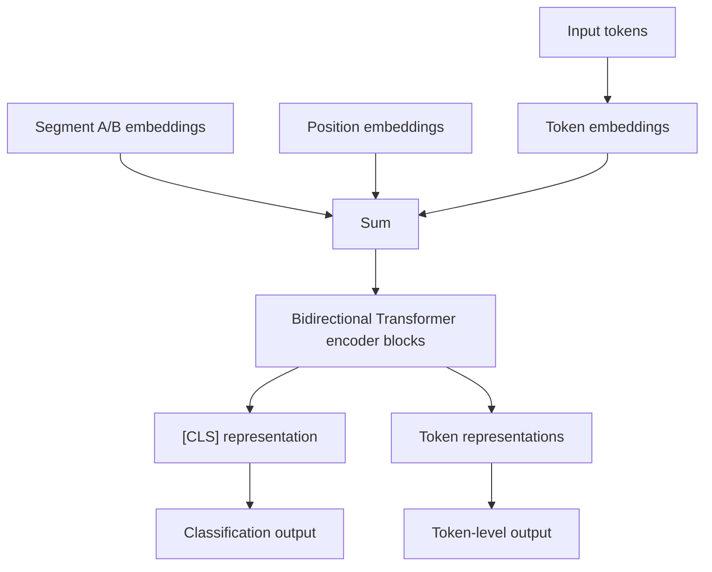
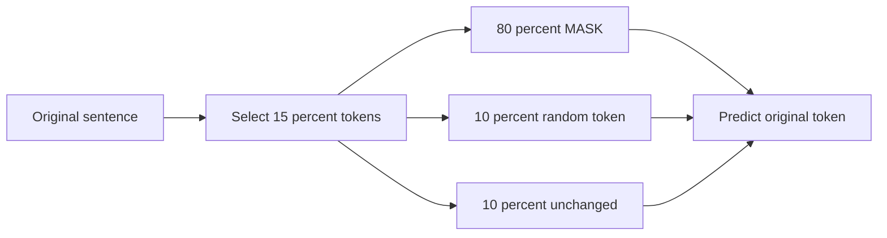
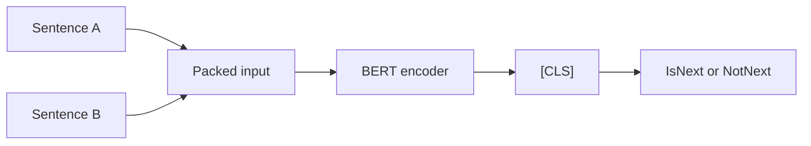
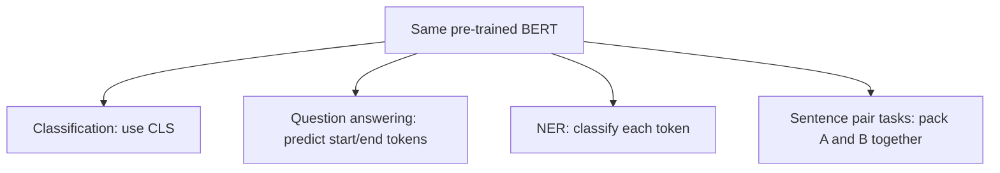
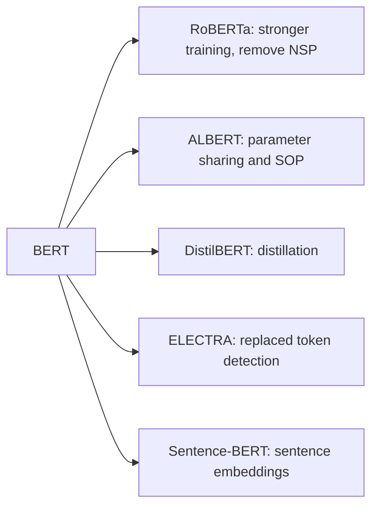

## Paper Info

- Title: BERT: Pre-training of Deep Bidirectional Transformers for Language Understanding
- Authors: Jacob Devlin, Ming-Wei Chang, Kenton Lee, Kristina Toutanova
- arXiv: Submitted October 11, 2018; revised v2 May 24, 2019
- Venue: NAACL 2019, Best Long Paper
- URL: https://arxiv.org/abs/1810.04805
- ACL Anthology: https://aclanthology.org/N19-1423/

## One-Line Summary

BERT first pretrains a Transformer **encoder** on large-scale unsupervised text, then fine-tunes the entire model for each NLP task by attaching a small output layer on top — establishing the standard recipe for sentence understanding tasks.

## A Quick Primer for First-Time Readers

If the [Transformer paper](/kb/2026-04-17-attention-is-all-you-need-paper-note) showed that "sentences can be processed with attention alone, without [RNNs](/kb/2026-04-18-llm-basics-rnn-sequential-processing)," then the BERT paper posed the following questions:

- "Do we have to read sentences strictly left-to-right?"
- "Would learning word representations by looking at both sides of context simultaneously — like filling in a blank — yield better results?"
- "Can a single large pretrained model be reused across many NLP tasks with minimal modification?"

BERT's answer is clear.  
If the goal is **understanding** rather than generating sentences, a deep bidirectional representation that attends to both left and right context at every layer is far more powerful.  
For intuition on why sentence understanding and sentence generation call for different architectures, see [Encoder and Decoder](/kb/2026-04-18-transformer-basics-encoder-decoder) first.

## Recommended Reading Order

1. Problem definition
2. How BERT modifies the Transformer
3. Masked Language Model
4. Next Sentence Prediction
5. Fine-tuning approach
6. Experimental results and ablations
7. Limitations and follow-up work

## Common Sticking Points

The most common difficulty when reading BERT notes is not the terminology itself, but how the terms connect to one another.  
`pre-training` and `fine-tuning` describe a two-stage learning pipeline: first acquire general language knowledge from a large corpus, then adapt to a specific task.  
If this pipeline feels unfamiliar, jump to the [Pre-training and Fine-tuning](/kb/2026-04-18-llm-learning-basics-pretraining-finetuning) note from the Fine-tuning section and return.

Another common point of confusion is why BERT looks so different from GPT.  
BERT is an encoder-only model that reads the entire input bidirectionally, whereas GPT-family models are decoder-only and generate the next token while masking future positions.  
This distinction is covered in the model architecture section alongside [Encoder-only vs. Decoder-only](/kb/2026-04-18-llm-architecture-basics-encoder-only-decoder-only).

## Problem Definition

Even before BERT, approaches like ELMo and OpenAI GPT used [pretrained language representations](/kb/2026-04-18-llm-learning-basics-pretraining-finetuning) for downstream tasks. However, those approaches had important limitations.

- ELMo trained separate left-to-right and right-to-left language models, then combined them shallowly.
- OpenAI GPT used a Transformer decoder with a left-to-right language modeling objective. The structural difference between BERT and GPT is most clearly seen through the lens of [encoder-only vs. decoder-only](/kb/2026-04-18-llm-architecture-basics-encoder-only-decoder-only) architectures.
- Left-to-right models cannot see right-context for each token, putting them at a disadvantage on token-level tasks such as question answering, where the model must locate an answer span.
- Having to engineer task-specific architectures for each downstream task undermines the benefits of a general-purpose pretrained model.

The paper frames this as the question: "**How can we pretrain deep bidirectional Transformer representations?**"

## Model Architecture



### 1) Encoder only

BERT uses the [encoder stack](/kb/2026-04-18-transformer-basics-encoder-decoder) of the Transformer.  
This is distinct from the decoder-only architecture of GPT, which masks future tokens.  
Knowing that the original Transformer was a seq-to-seq translation model with both encoder and decoder makes the significance of BERT's encoder-only choice more apparent.

- BERT BASE: `L=12`, `H=768`, `A=12`, approximately 110M parameters.
- BERT LARGE: `L=24`, `H=1024`, `A=16`, approximately 340M parameters.
- Every self-attention layer has access to both left and right context.
- The architecture is therefore better suited to understanding tasks — sentence classification, sentence-pair inference, question answering, token classification — than to generation.

For details on what stabilization components accompany each attention layer (residuals, layer norm, FFN), see [Residual, LayerNorm, FFN](/kb/2026-04-17-transformer-basics-residual-layernorm-ffn).

### 2) Input representation is the sum of three embeddings

BERT constructs its input by summing the following three vectors:

```txt
input embedding = token embedding + segment embedding + position embedding
```

- Token embedding: semantic representation of a WordPiece token. Vocabulary size is 30,000.
- Segment embedding: indicates whether the token belongs to sentence A or sentence B.
- Position embedding: encodes the token's position in the sequence.

Sentence-pair inputs follow this template:

```txt
[CLS] sentence A [SEP] sentence B [SEP]
```

The final hidden state of `[CLS]` serves as the aggregate sentence representation for classification, while per-token hidden states are used for span prediction in question answering and for sequence tagging.

## Core Idea 1: Masked Language Model

A standard language model predicts the next token, so it can only condition on left-side context.  
BERT, however, needs a representation that attends to both sides at every layer.  
The mechanism that makes this possible is the [Masked Language Model](/kb/2026-04-18-llm-learning-basics-masked-language-model), or `MLM`.

The training procedure is as follows:

1. Randomly select 15% of the WordPiece tokens as prediction targets.
2. Replace 80% of selected tokens with `[MASK]`.
3. Replace 10% of selected tokens with a random other token.
4. Leave the remaining 10% unchanged.
5. The model predicts the original token from its final hidden state. A low predicted probability for the correct token increases the [cross-entropy loss](/kb/2026-04-17-llm-learning-basics-cross-entropy-perplexity).



The 80/10/10 rule is designed to reduce the mismatch between the `[MASK]` tokens seen only during pre-training and the real input seen during fine-tuning.  
Because the model cannot know with certainty which tokens are masked, it is forced to maintain contextually meaningful representations for every input token.  
For a worked example and a formal derivation of MLM, see [Masked Language Model basics](/kb/2026-04-18-llm-learning-basics-masked-language-model).

## Core Idea 2: Next Sentence Prediction

BERT targets not only single-sentence tasks but also tasks that require understanding the relationship between two sentences — natural language inference (NLI), paraphrase detection, and question answering all depend on the relationship between two text spans.

NSP is the pre-training objective designed to address this:

- 50% of the time, sentence B is the actual sentence that follows sentence A in the corpus. Label: `IsNext`.
- 50% of the time, sentence B is a randomly sampled sentence. Label: `NotNext`.
- Binary classification is performed using the `[CLS]` representation.



The paper reports that NSP is particularly beneficial for sentence-pair and QA tasks such as QNLI, MNLI, and SQuAD.  
However, subsequent work (notably RoBERTa) demonstrated that removing NSP can yield equal or better performance, so it is safer to read NSP as an early attempt to align pre-training objectives with downstream tasks rather than as a definitive ingredient.

## Fine-tuning Approach

One of BERT's key advantages is that the same pretrained model can be adapted to downstream tasks with minimal architectural changes.  
Because this is central to the BERT paper, if the distinction between `pre-training` and `fine-tuning` is unclear, review [Pre-training and Fine-tuning](/kb/2026-04-18-llm-learning-basics-pretraining-finetuning) first.

- Sentence classification: attach a classification layer on top of the `[CLS]` representation.
- Sentence-pair classification: feed `[CLS] sentence A [SEP] sentence B [SEP]` and classify via `[CLS]`.
- Question answering: pack the question and passage into one sequence; predict start and end positions of the answer span for each token.
- Token classification (e.g., NER): attach a label classifier on top of each token's hidden state.



The essential insight is "share the vast majority of parameters and add only a thin task-specific output head."  
This pattern became the standard `pre-train then fine-tune` workflow in NLP.

## Pre-training Data and Training Setup

The paper pretrains BERT on the following corpora.  
Pre-training here refers to the stage of learning language patterns from large-scale plain text before any labeled task data is involved.

- BooksCorpus: approximately 800M words
- English Wikipedia: approximately 2,500M words
- Combined total: approximately 3.3B words

Key hyperparameters:

- Maximum sequence length: 512 tokens.
- Batch size: 256 sequences (i.e., 128,000 tokens/batch at length 512).
- Total training: 1,000,000 steps.
- Both BERT BASE and BERT LARGE took approximately 4 days to pretrain.
- To reduce the quadratic attention cost of long sequences, most steps use sequence length 128; length 512 is used only for the final portion of training.

## Experimental Results (Paper Highlights)

BERT set new state-of-the-art results on 11 NLP tasks. Key figures reported in the paper:

| Task       | Result                                    |
| ---------- | ----------------------------------------- |
| GLUE       | 80.5 points, +7.7 over previous SOTA      |
| MultiNLI   | 86.7% accuracy, +4.6pp over previous SOTA |
| SQuAD v1.1 | Test F1 93.2, +1.5 over previous SOTA     |
| SQuAD v2.0 | Test F1 83.1, +5.1 over previous SOTA     |
| SWAG       | Test accuracy 86.3                        |

The important point is not simply that specific benchmark scores improved.  
What matters is that the same pretrained model, applied with essentially the same procedure across many different NLP task types, was consistently strong.

## Ablation Study: Key Takeaways

The paper uses ablations to answer: "Does bidirectionality actually matter?", "Does NSP help?", and "Does a larger model benefit even small datasets?"

### 1) Bidirectional training via MLM matters

Compared to `BERT BASE`, switching to a left-to-right LM causes a large drop on SQuAD in particular.  
SQuAD Dev F1 from Table 5 of the paper:

- BERT BASE: 88.5
- No NSP: 87.9
- LTR & No NSP: 77.8
- LTR & No NSP + BiLSTM: 84.9

These results support the claim that right-side context is critical for token-level prediction tasks such as question answering.

### 2) NSP helps under the original training setup

Removing NSP degrades performance on QNLI, MNLI, and SQuAD.  
The paper presents this as evidence that explicitly training on sentence-relationship objectives is beneficial for sentence-pair tasks.

This conclusion should be read with some caution in the modern context.  
Follow-up work has shown that with different data, batch sizes, training steps, and objective designs, NSP can be dropped without loss.  
These notes therefore interpret NSP as "an early design attempt to align pre-training objectives with sentence-pair understanding," not as a permanent best practice.

### 3) Larger models help even on small downstream datasets

The paper reports consistent performance gains as model size increases across MNLI, MRPC, SST-2, and others.  
Notably, even on label-scarce tasks like MRPC, fine-tuning a sufficiently large pretrained model provides meaningful gains.

This became an important guiding intuition for subsequent large-model research: even when the downstream dataset is small, a larger model may outperform a smaller one if pre-training was thorough enough.

## Why This Paper Still Matters

- BERT established the `pre-train + fine-tune` paradigm as the default workflow in NLP.
- It demonstrated that [encoder-only Transformers](/kb/2026-04-18-llm-architecture-basics-encoder-only-decoder-only) are highly effective for sentence understanding tasks.
- The `[CLS]`, `[SEP]`, segment embedding, and WordPiece-based input format became the reference design for countless subsequent models and libraries.
- Unlike generative LLMs, BERT-family architectures remain an important baseline for understanding-centric tasks such as classification, retrieval reranking, NER, and QA span extraction.
- Follow-up models — RoBERTa, ALBERT, DistilBERT, ELECTRA — mostly evolved by preserving or critically revising BERT's design choices.

## Limitations and Open Questions

- Because MLM predicts only a fraction of tokens, it may be less sample-efficient than a left-to-right LM.
- The `[MASK]` token appears only during pre-training and not during fine-tuning or inference, causing a pre-training/fine-tuning mismatch.
- The effectiveness of NSP is contested in subsequent literature.
- A maximum length of 512 tokens combined with the `O(n^2)` cost of self-attention limits applicability to long documents.
- The encoder-only architecture is not well suited for natural long-form text generation.



## Key Takeaways

- BERT's core contribution is not inventing a new architecture, but designing **how to pretrain** the Transformer encoder.
- While GPT-family models evolved around "generating the next token," BERT-family models evolved around "bidirectional representations for text understanding."
- When reading the paper, it helps to treat `MLM`, `NSP`, `fine-tuning`, and `encoder-only` as separate, independently assessable design decisions.
- When reading follow-up papers, a useful frame is: "Which of BERT's assumptions were preserved, and which were challenged?"

## Papers to Read Next

- GPT-2 (2019)
- RoBERTa (2019)
- ALBERT (2019)
- ELECTRA (2020)
- T5 (2020)
