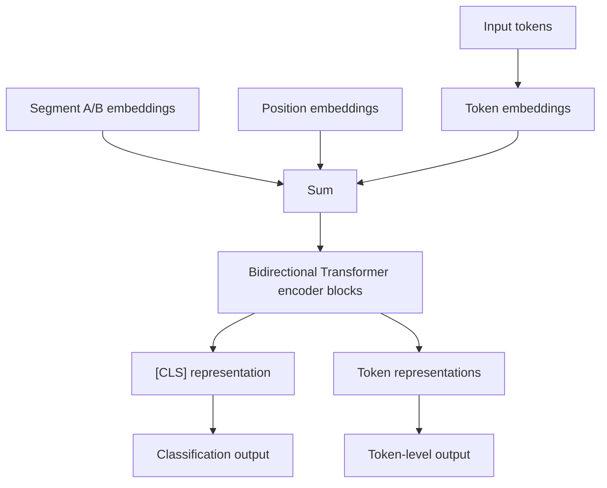
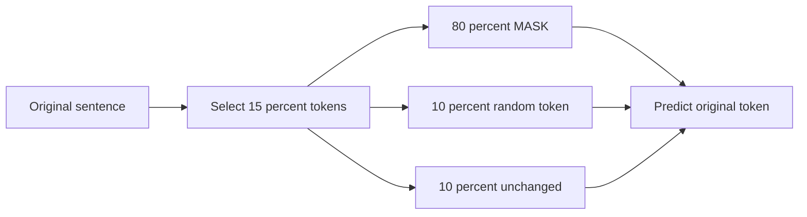
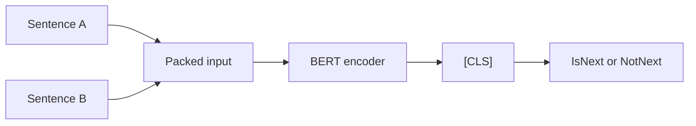
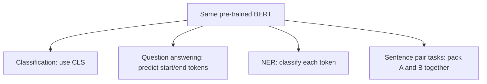
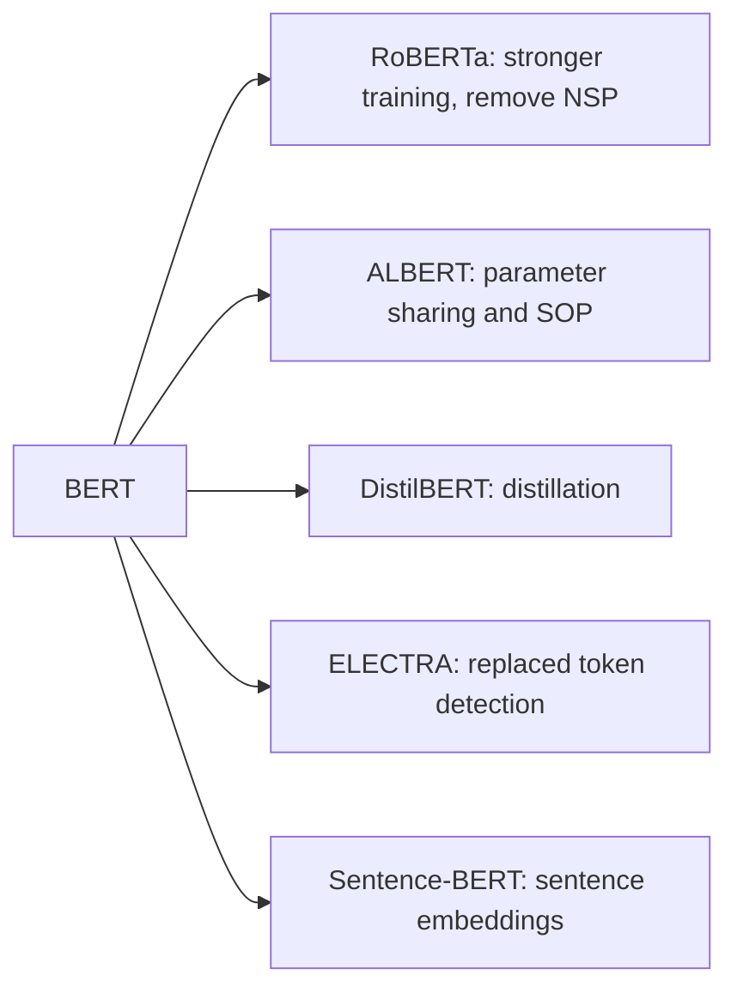

## Paper Info

- Title: BERT: Pre-training of Deep Bidirectional Transformers for Language Understanding
- Authors: Jacob Devlin, Ming-Wei Chang, Kenton Lee, Kristina Toutanova
- arXiv: 2018년 10월 11일 제출, 2019년 5월 24일 v2 개정
- Venue: NAACL 2019, Best Long Paper
- URL: https://arxiv.org/abs/1810.04805
- ACL Anthology: https://aclanthology.org/N19-1423/

## 한 줄 요약

BERT는 Transformer **encoder**를 대규모 비지도 텍스트로 먼저 학습한 뒤,
각 NLP 태스크에서는 작은 출력층만 붙여 전체 모델을 fine-tuning하는 방식으로
문장 이해 태스크의 표준 레시피를 만든 논문입니다.

## 처음 읽는 사람을 위한 빠른 해설

[Transformer 논문](/kb/2026-04-17-attention-is-all-you-need-paper-note)이 "[RNN](/kb/2026-04-18-llm-basics-rnn-sequential-processing) 없이 attention만으로 문장을 처리할 수 있다"를 보였다면,
BERT 논문은 다음 질문을 던졌습니다.

- "문장을 왼쪽에서 오른쪽으로만 읽어야 하는가?"
- "빈칸 맞히기처럼 양쪽 문맥을 동시에 보고 단어 표현을 학습하면 더 좋은가?"
- "한 번 크게 사전학습한 모델을 여러 NLP 태스크에 거의 그대로 재사용할 수 있는가?"

BERT의 답은 명확합니다.  
문장 생성이 아니라 문장 **이해**가 목표라면, 왼쪽과 오른쪽 문맥을 모든 층에서 함께 보는 깊은 양방향 표현이 강력하다는 것입니다.
여기서 "문장 이해"와 "문장 생성"이 왜 다른 구조로 이어지는지는 [Encoder와 Decoder](/kb/2026-04-18-transformer-basics-encoder-decoder)를 먼저 보면 흐름이 잡힙니다.

## 이 페이지를 읽는 추천 순서

1. 문제 정의
2. BERT가 Transformer를 어떻게 바꾸었는지
3. Masked Language Model
4. Next Sentence Prediction
5. Fine-tuning 방식
6. 실험 결과와 ablation
7. 한계와 후속 연구

## 읽다가 막히기 쉬운 지점

BERT 노트에서 가장 자주 막히는 지점은 용어 자체보다 용어들이 서로 연결되는 방식입니다.
`pre-training`과 `fine-tuning`은 "먼저 큰 텍스트로 일반 언어 지식을 배우고, 나중에 특정 태스크에 맞춘다"는 학습 흐름입니다.
이 흐름이 낯설다면 본문 Fine-tuning 섹션에서 [Pre-training과 Fine-tuning](/kb/2026-04-18-llm-learning-basics-pretraining-finetuning) 노트로 잠깐 빠졌다가 돌아오면 됩니다.

또 하나는 BERT가 왜 GPT와 다르게 보이는지입니다.
BERT는 입력 전체를 양방향으로 읽는 encoder-only 모델이고, GPT 계열은 미래 토큰을 가린 채 다음 토큰을 생성하는 decoder-only 모델입니다.
이 차이는 모델 구조 섹션에서 [Encoder-only와 Decoder-only](/kb/2026-04-18-llm-architecture-basics-encoder-only-decoder-only)와 연결해 설명합니다.

## 문제 정의

BERT 이전에도 ELMo, OpenAI GPT처럼 [사전학습된 언어 표현](/kb/2026-04-18-llm-learning-basics-pretraining-finetuning)을 downstream task에 활용하는 흐름이 있었습니다.
하지만 당시 접근에는 중요한 제약이 있었습니다.

- ELMo는 왼쪽→오른쪽 LM과 오른쪽→왼쪽 LM을 따로 학습한 뒤 얕게 결합했습니다.
- OpenAI GPT는 Transformer decoder 기반의 left-to-right 언어 모델이었습니다. BERT와 GPT의 구조적 차이는 [Encoder-only와 Decoder-only](/kb/2026-04-18-llm-architecture-basics-encoder-only-decoder-only)를 기준으로 보면 명확합니다.
- left-to-right 구조는 각 토큰이 오른쪽 문맥을 볼 수 없기 때문에, 질의응답처럼 정답 span을 찾아야 하는 token-level 태스크에서 불리했습니다.
- 태스크별로 별도 구조를 많이 설계해야 하면 범용 사전학습 모델의 장점이 약해집니다.

논문은 이 문제를 "**깊은 양방향 Transformer 표현을 어떻게 사전학습할 것인가?**"라는 질문으로 정리합니다.

## 모델 구조



### 1) Transformer encoder만 사용합니다

BERT는 Transformer의 [encoder 스택](/kb/2026-04-18-transformer-basics-encoder-decoder)을 사용합니다.
이는 GPT처럼 미래 토큰을 가리는 decoder-only 구조와 다릅니다.
원래 Transformer가 encoder와 decoder를 모두 가진 번역 모델이었다는 배경을 알고 보면, BERT가 encoder만 남긴 결정의 의미가 더 잘 보입니다.

- BERT BASE: `L=12`, `H=768`, `A=12`, 약 110M parameters입니다.
- BERT LARGE: `L=24`, `H=1024`, `A=16`, 약 340M parameters입니다.
- 모든 self-attention 층에서 양쪽 문맥을 볼 수 있습니다.
- 따라서 문장 생성보다 문장 분류, 문장쌍 판단, 질의응답, 토큰 분류 같은 이해 태스크에 맞춰진 구조입니다.

기본 Transformer 블록 안에서 attention 이후 어떤 안정화 장치가 붙는지는 [Residual, LayerNorm, FFN](/kb/2026-04-17-transformer-basics-residual-layernorm-ffn) 노트에서 따로 볼 수 있습니다.

### 2) 입력 표현은 세 embedding의 합입니다

BERT 입력은 다음 세 벡터를 더해서 만듭니다.

```txt
input embedding = token embedding + segment embedding + position embedding
```

- Token embedding: WordPiece 토큰의 의미 표현입니다. 어휘 크기는 30,000입니다.
- Segment embedding: 토큰이 문장 A에 속하는지 문장 B에 속하는지 표시합니다.
- Position embedding: 토큰 위치 정보를 넣습니다.

문장쌍 입력은 보통 아래 형태를 따릅니다.

```txt
[CLS] sentence A [SEP] sentence B [SEP]
```

`[CLS]`의 최종 hidden state는 문장 전체를 대표하는 분류 표현으로 사용하고,
각 토큰의 hidden state는 질의응답 span 예측이나 sequence tagging에 사용합니다.

## 핵심 아이디어 1: Masked Language Model

일반적인 language model은 다음 토큰을 예측하기 때문에 왼쪽 문맥만 사용할 수 있습니다.
그런데 BERT가 원하는 것은 모든 층에서 양쪽 문맥을 함께 보는 표현입니다.
이를 가능하게 한 장치가 [Masked Language Model](/kb/2026-04-18-llm-learning-basics-masked-language-model), 즉 `MLM`입니다.

학습 절차는 다음과 같습니다.

1. WordPiece 토큰 중 15%를 예측 대상으로 고릅니다.
2. 선택된 토큰의 80%는 `[MASK]`로 바꿉니다.
3. 선택된 토큰의 10%는 임의의 다른 토큰으로 바꿉니다.
4. 선택된 토큰의 10%는 그대로 둡니다.
5. 모델은 최종 hidden state로 원래 토큰을 맞힙니다. 이때 정답 토큰에 낮은 확률을 주면 [cross-entropy loss](/kb/2026-04-17-llm-learning-basics-cross-entropy-perplexity)가 커집니다.



이 80/10/10 규칙은 pre-training 때만 등장하는 `[MASK]`와 fine-tuning 때의 실제 입력 사이 불일치를 줄이려는 장치입니다.
모델 입장에서는 어떤 토큰이 예측 대상인지 확실히 알 수 없으므로, 모든 입력 토큰에 대해 문맥적인 표현을 유지해야 합니다.
MLM을 빈칸 맞히기 예시와 수식으로 다시 보고 싶다면 [Masked Language Model 기초 노트](/kb/2026-04-18-llm-learning-basics-masked-language-model)를 참고하면 됩니다.

## 핵심 아이디어 2: Next Sentence Prediction

BERT는 문장 하나만 보는 태스크가 아니라, 두 문장의 관계를 판단하는 태스크도 겨냥합니다.
예를 들어 자연어 추론(NLI), paraphrase 판별, 질의응답은 두 텍스트 조각 사이의 관계가 중요합니다.

NSP는 이를 위해 만든 사전학습 목표입니다.

- 50%는 문장 B가 실제로 문장 A 다음에 온 경우입니다. 라벨은 `IsNext`입니다.
- 50%는 말뭉치에서 무작위로 뽑은 문장입니다. 라벨은 `NotNext`입니다.
- `[CLS]` 표현으로 이진 분류를 수행합니다.



논문에서는 NSP가 특히 QNLI, MNLI, SQuAD 같은 문장쌍/질의응답 태스크에 도움이 된다고 보고합니다.
다만 이후 RoBERTa는 NSP를 제거해도 더 좋은 성능을 낼 수 있음을 보여주었기 때문에,
현대 관점에서는 `NSP 자체`보다 `사전학습 목표를 downstream task와 맞추려는 시도`로 읽는 편이 안전합니다.

## Fine-tuning 방식

BERT의 중요한 장점은 downstream task마다 구조를 크게 바꾸지 않아도 된다는 점입니다.
이 부분은 BERT 논문의 핵심이므로, `pre-training`과 `fine-tuning`의 차이가 흐릿하다면 [Pre-training과 Fine-tuning](/kb/2026-04-18-llm-learning-basics-pretraining-finetuning)을 먼저 확인하는 편이 좋습니다.

- 문장 분류: `[CLS]` 표현 위에 classification layer를 붙입니다.
- 문장쌍 분류: `[CLS] sentence A [SEP] sentence B [SEP]`를 넣고 `[CLS]`로 분류합니다.
- 질의응답: question과 passage를 한 시퀀스로 넣고, 각 토큰에 대해 answer span의 시작/끝 위치를 예측합니다.
- 토큰 분류: 각 토큰 hidden state 위에 label classifier를 붙입니다.



핵심은 "대부분의 파라미터를 공유한 뒤, 태스크별 출력층만 얇게 추가한다"는 점입니다.
이 패턴은 이후 NLP에서 `pre-train then fine-tune`의 기본 형식이 되었습니다.

## 사전학습 데이터와 학습 설정

논문은 다음 말뭉치로 BERT를 사전학습했습니다.
여기서 사전학습은 정답 라벨이 붙은 작은 데이터셋이 아니라, 대규모 일반 텍스트로 언어 패턴을 먼저 배우는 단계입니다.

- BooksCorpus: 약 800M words
- English Wikipedia: 약 2,500M words
- 합산 약 3.3B words입니다.

주요 설정:

- 최대 길이 512 tokens입니다.
- batch size는 256 sequences, 즉 512 tokens 기준 128,000 tokens/batch입니다.
- 1,000,000 steps를 학습했습니다.
- 논문 기준 BERT BASE와 BERT LARGE 모두 사전학습에 약 4일이 걸렸습니다.
- 긴 시퀀스의 attention 비용을 줄이기 위해 대부분의 step은 sequence length 128로 학습하고, 마지막 일부 step에서 length 512를 사용했습니다.

## 실험 결과(논문 핵심)

BERT는 11개 NLP 태스크에서 당시 SOTA를 갱신했습니다.
논문에서 강조한 대표 수치는 다음과 같습니다.

| 태스크     | 결과                             |
| ---------- | -------------------------------- |
| GLUE       | 80.5점, 기존 대비 +7.7점         |
| MultiNLI   | 86.7% accuracy, 기존 대비 +4.6%p |
| SQuAD v1.1 | Test F1 93.2, 기존 대비 +1.5     |
| SQuAD v2.0 | Test F1 83.1, 기존 대비 +5.1     |
| SWAG       | Test accuracy 86.3               |

중요한 포인트는 단순히 특정 벤치마크 점수가 높았다는 점이 아닙니다.
동일한 사전학습 모델을 여러 종류의 NLP 태스크에 거의 같은 방식으로 적용해도 강력했다는 점입니다.

## Ablation에서 확인할 점

논문은 "정말 양방향성이 중요한가?", "NSP가 도움이 되는가?", "모델이 커지면 작은 데이터셋에서도 좋은가?"를 ablation으로 확인합니다.

### 1) MLM 기반 양방향 학습이 중요합니다

`BERT BASE`와 비교했을 때, left-to-right LM으로 바꾼 모델은 특히 SQuAD에서 크게 떨어집니다.
논문 표 5 기준 SQuAD Dev F1은 다음 흐름을 보입니다.

- BERT BASE: 88.5
- No NSP: 87.9
- LTR & No NSP: 77.8
- LTR & No NSP + BiLSTM: 84.9

이 결과는 질의응답처럼 token-level 출력을 요구하는 태스크에서 오른쪽 문맥이 중요하다는 주장을 뒷받침합니다.

### 2) NSP는 당시 설정에서는 도움이 됩니다

NSP를 제거하면 QNLI, MNLI, SQuAD에서 성능이 하락합니다.
논문은 이를 문장 관계를 직접 학습하는 목표가 문장쌍 태스크에 유리하다는 근거로 제시합니다.

현대 관점에서는 이 결론을 조금 조심해서 읽어야 합니다.
후속 연구들은 데이터, batch, 학습 step, objective 설계가 달라지면 NSP 없이도 더 좋은 결과를 낼 수 있음을 보였습니다.
따라서 이 노트에서는 "NSP가 영구적인 정답"이라기보다 "문장쌍 이해를 사전학습 목표에 넣으려는 초기 설계"로 해석합니다.

### 3) 모델 크기가 작은 downstream dataset에도 도움이 됩니다

논문은 모델을 키울수록 MNLI, MRPC, SST-2 등에서 일관되게 성능이 오른다고 보고합니다.
특히 MRPC처럼 라벨 데이터가 작은 태스크에서도, 충분히 사전학습된 큰 모델을 fine-tuning하면 이득이 있다는 점을 보여줍니다.

이는 이후 대규모 모델 연구의 중요한 직관으로 이어집니다.
즉, downstream dataset이 작더라도 pre-training이 충분하면 큰 모델이 작은 태스크에서도 유리할 수 있습니다.

## 왜 지금도 중요한가

- BERT는 `pre-train + fine-tune` 패러다임을 NLP의 기본 워크플로로 만들었습니다.
- [encoder-only Transformer](/kb/2026-04-18-llm-architecture-basics-encoder-only-decoder-only)가 문장 이해 태스크에서 강력하다는 점을 입증했습니다.
- `[CLS]`, `[SEP]`, segment embedding, WordPiece 기반 입력 형식이 이후 수많은 모델과 라이브러리의 기준점이 되었습니다.
- 생성형 LLM과 달리, classification, retrieval reranking, NER, QA span extraction 같은 이해 중심 태스크에서는 여전히 BERT 계열 구조가 중요한 베이스라인입니다.
- RoBERTa, ALBERT, DistilBERT, ELECTRA 같은 후속 모델은 대부분 BERT의 설계를 유지하거나 비판적으로 수정하면서 발전했습니다.

## 한계와 후속 과제

- MLM은 전체 토큰 중 일부만 예측하므로 left-to-right LM보다 학습 효율이 낮을 수 있습니다.
- `[MASK]` 토큰은 fine-tuning과 실제 추론 입력에는 보통 등장하지 않아 pre-training/fine-tuning mismatch가 생깁니다.
- NSP의 효과는 후속 연구에서 논쟁적입니다.
- 최대 길이 512 tokens와 self-attention의 `O(n^2)` 비용 때문에 긴 문서 처리에는 한계가 있습니다.
- encoder-only 구조라 자연스러운 긴 텍스트 생성 모델로 쓰기에는 적합하지 않습니다.



## 읽고 남길 메모

- BERT의 핵심은 Transformer 자체를 새로 만든 것이 아니라, Transformer encoder를 **어떻게 사전학습할지**를 설계한 데 있습니다.
- GPT 계열이 "다음 토큰 생성"을 중심으로 발전했다면, BERT 계열은 "텍스트 이해를 위한 양방향 표현"을 중심으로 발전했습니다.
- 논문을 읽을 때는 `MLM`, `NSP`, `fine-tuning`, `encoder-only`를 분리해서 보는 것이 좋습니다.
- 후속 연구를 읽을 때는 "BERT의 어떤 가정이 유지되었고, 어떤 가정이 제거되었는가?"를 기준으로 보면 연결이 잘 됩니다.

## 다음에 읽을 논문

- GPT-2 (2019)
- RoBERTa (2019)
- ALBERT (2019)
- ELECTRA (2020)
- T5 (2020)
