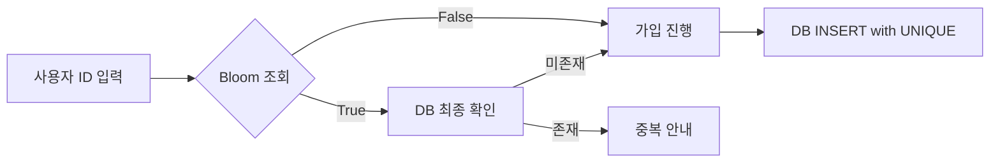

트위터에서 자주 보이는 말이 있습니다.
"구글 같은 서비스에서 회원가입할 때 기존 ID 조회? 블룸 필터 쓰면 됨."

결론부터 말하면 둘 다 맞습니다.

- 맞는 부분: 블룸 필터는 대규모 중복 체크의 성능 문제를 크게 줄여줍니다.
- 틀린 부분: 블룸 필터만으로 최종 판정을 하면 안 됩니다.

블룸 필터는 "정답기"가 아니라 고속 예선 필터입니다.

## 3분 요약

- 블룸 필터는 "없음"은 확실하게, "있음"은 확률적으로 알려줍니다.
- 회원가입 중복 체크에서는 DB 앞단 1차 필터로 쓰면 비용을 크게 줄일 수 있습니다.
- 최종 판정은 항상 DB `UNIQUE` 제약이 담당해야 안전합니다.



## 블룸 필터(Bloom Filter)란?

블룸 필터는 집합에 원소가 있는지 빠르게 확인하는 확률적 자료구조입니다.

- `False`: 확실히 없음
- `True`: 있을 수도 있음(오탐 가능)

즉, "없다"는 믿어도 되지만 "있다"는 한 번 더 확인해야 합니다.

## 왜 대규모 서비스에서 쓰나?

회원가입 ID 중복 체크를 매번 DB에 직접 조회하면 트래픽이 커질수록 비용이 커집니다.
블룸 필터를 앞단에 두면 "없는 ID"를 매우 빠르게 걸러 DB 부하를 줄일 수 있습니다.

대표 사용처:

- 회원가입 ID/닉네임 중복 1차 체크
- 캐시 미스 방지
- 중복 이벤트/요청 필터링
- 크롤링 URL 방문 여부 검사

## 동작 원리

1. 큰 비트 배열을 준비합니다.
2. 원소를 넣을 때 `k`개의 해시 함수 결과 위치를 1로 설정합니다.
3. 조회할 때 같은 `k`개 위치를 확인합니다.
4. 하나라도 0이면 "확실히 없음", 전부 1이면 "있을 수도 있음"입니다.

## 회원가입에 적용할 때의 정석

1. 사용자가 ID를 입력합니다.
2. 블룸 필터를 조회합니다.
3. `False`면 빠르게 가입 절차를 계속합니다.
4. `True`면 DB/인덱스로 최종 조회합니다.
5. 최종 저장은 DB `UNIQUE` 제약으로 확정합니다.

핵심은 하나입니다. 최종 진실은 DB 유니크 인덱스입니다.

## 감 잡는 용량 계산

필요 비트 수 공식:

\[
m = -\frac{n \ln p}{(\ln 2)^2}
\]

- `n`: 저장할 원소 수
- `p`: 허용 오탐률
- `m`: 비트 배열 크기

예를 들어 `n = 10억`, `p = 1%`이면 대략:

- `m ≈ 9.6e9 bits` (약 1.2GB)
- 최적 해시 수 `k ≈ 7`

## 아주 간단한 구현체 (Python)

```python
import hashlib
import math

class BloomFilter:
    def __init__(self, capacity: int, error_rate: float = 0.01):
        self.m = int(-capacity * math.log(error_rate) / (math.log(2) ** 2))
        self.k = max(1, int((self.m / capacity) * math.log(2)))
        self.bits = bytearray((self.m + 7) // 8)

    def _hashes(self, item: str):
        b = item.encode("utf-8")
        for i in range(self.k):
            h = hashlib.sha256(i.to_bytes(2, "big") + b).digest()
            yield int.from_bytes(h[:8], "big") % self.m

    def add(self, item: str):
        for idx in self._hashes(item):
            self.bits[idx // 8] |= (1 << (idx % 8))

    def might_contain(self, item: str) -> bool:
        for idx in self._hashes(item):
            if not (self.bits[idx // 8] & (1 << (idx % 8))):
                return False
        return True
```

## 30초 미니 실험: 왜 "있을 수도 있음"인가?

작은 장난감 예시를 보면 오탐이 왜 생기는지 감이 빨리 옵니다.

- 비트 배열 크기 `m=8`
- 해시 함수 2개 `h1`, `h2`
- `alice`를 넣었더니 비트 `1`, `5`가 1이 됨
- `carl`을 넣었더니 비트 `3`, `5`가 1이 됨

이제 `bob`을 조회했는데 우연히 `h1(bob)=1`, `h2(bob)=3`이라면,
`1`과 `3`이 이미 1이라서 필터는 `True`를 돌려줍니다.
하지만 실제로 `bob`은 넣은 적이 없습니다. 이것이 오탐(false positive)입니다.

요점은 단순합니다.
블룸 필터는 비트만 보관하기 때문에 "누가 그 비트를 켰는지"는 잃어버립니다.
그래서 존재 판단은 빠르지만 확률적입니다.

## 실무에서 자주 놓치는 포인트

- 블룸 필터는 일반적으로 삭제가 어렵습니다.
- 데이터가 증가하면 오탐률이 올라갑니다.
- 정합성 보장은 DB `UNIQUE` 제약이 담당해야 합니다.

## 마무리

블룸 필터는 "이미 존재하는 ID를 전체 DB에서 매번 찾는 비용"을 줄이는 데 매우 유용합니다.
하지만 정답은 블룸 필터 단독이 아니라, 블룸 필터 + DB 유니크 제약의 조합입니다.
