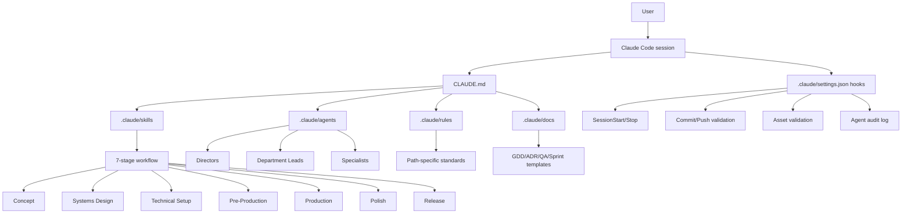

> Analyzed: 2026-04-18
> Package: `v1.0.0-beta-2-g666e0fc` / Commit `666e0fcb5ad3f5f0f56e1219e8cf03d44e62a49a`
> Repository: https://github.com/Donchitos/Claude-Code-Game-Studios
> Local path: `/Users/dede/workspace/opensources/Claude-Code-Game-Studios`

---

_This article is partially written by Codex_

---

## 1. Project Overview

**Claude Code Game Studios** is a template that embeds the organizational structure of a game development studio inside a Claude Code project. Rather than a game engine or library, it is an operational framework that collects the **roles, procedures, deliverables, and validation rules** that Claude Code should follow when working on a game project.

The README describes the project as follows:

- Use a single Claude Code session as a fully-fledged game development studio.
- 49 agents divide responsibilities across design, programming, art, audio, narrative, QA, and production.
- 72 skills are provided as workflow commands like `/start`, `/brainstorm`, `/create-architecture`, `/dev-story`, and `/team-combat`.
- 12 hooks monitor session start, commits, pushes, asset modifications, context compaction, and subagent execution.
- 11 rules provide path-specific quality standards for directories like `src/gameplay/**`, `src/ui/**`, `assets/data/**`, and `tests/**`.

One important point: this project is not an automated generator that creates a game for you. As the project documentation repeatedly emphasizes, the goal is **user-led collaboration**, not autonomous execution. The user remains the final decision-maker; agents act as consultants that ask questions, present options, produce drafts, and then wait for approval.

In other words, Claude Code Game Studios is less "a tool for delegating game creation to Claude" and more "a tool for installing a game development org chart inside Claude Code."

## 2. Structure at a Glance

The essence of this project can be summarized in one sentence:

> Place agents, skills, hooks, rules, and templates in the `.claude/` directory so that Claude Code follows the correct roles and procedures at each stage of game development.

Based on the local checkout, the main components are:

| Component | Count | Role                                                             |
| --------- | ----: | ---------------------------------------------------------------- |
| Agents    |    49 | Game studio role definitions                                     |
| Skills    |    72 | Slash-command-based workflows                                    |
| Hooks     |    12 | Monitor session, commit, push, asset, and subagent events        |
| Rules     |    11 | Coding and documentation standards per file path                 |
| Templates |    38 | Document templates for GDD, ADR, sprint plan, UX spec, test plan |

The README states 39 templates, but the local checkout examined here had 38 files under `.claude/docs/templates`. `docs/WORKFLOW-GUIDE.md` also retains an older reference to 48 agents and 68 slash commands. Based on the actual current files, the README figures of 49 agents and 72 skills are more accurate.

## 3. Tech Stack

| Area               | Technology                                         |
| ------------------ | -------------------------------------------------- |
| Target platform    | Claude Code                                        |
| Primary config     | Markdown, YAML frontmatter, JSON config, Bash hook |
| Agent definitions  | `.claude/agents/*.md`                              |
| Skill definitions  | `.claude/skills/*/SKILL.md`                        |
| Hook configuration | `.claude/settings.json` + `.claude/hooks/*.sh`     |
| Project docs       | `.claude/docs`, `docs`, `design`, `production`     |
| Supported engines  | Godot 4, Unity, Unreal Engine 5                    |
| Verification tools | Git, optional jq, optional Python, optional pytest |
| License            | MIT                                                |

There is almost no application runtime code. `src/` contains only a `.gitkeep`, and most behavior lives in the Markdown instructions and hook scripts that Claude Code reads.

In this sense, Claude Code Game Studios is a **project template for Claude Code** rather than an npm package or CLI app. It does not provide code that runs on top of a game engine — it provides the decision-making structure needed before and during game development.

## 4. Overall Architecture

The overall structure can be visualized as follows:



The flow is straightforward:

1. Claude Code reads `CLAUDE.md` at the project root.
2. `CLAUDE.md` references `.claude/docs/`, `.claude/rules/`, engine references, and collaboration protocols.
3. The user runs skills like `/start`, `/brainstorm`, or `/dev-story`.
4. Skills read the required documents and state, delegating work to the appropriate agents as needed.
5. Hooks provide supplementary monitoring of session state, commits, pushes, asset changes, and subagent execution.
6. Deliverables accumulate in `design/`, `docs/architecture/`, `production/`, `src/`, `tests/`, and `assets/`.

The key design principle is "don't rely on a single agent to remember everything." Roles live in agent files, procedures in skill files, quality standards in rule files, and output formats in template files.

## 5. Directory Structure

The project root structure looks like this:

```text
Claude-Code-Game-Studios/
├── CLAUDE.md
├── README.md
├── UPGRADING.md
├── LICENSE
├── .claude/
│   ├── settings.json
│   ├── agents/
│   ├── skills/
│   ├── hooks/
│   ├── rules/
│   ├── docs/
│   ├── agent-memory/
│   └── statusline.sh
├── design/
│   └── registry/
├── docs/
│   ├── architecture/
│   ├── engine-reference/
│   ├── examples/
│   └── registry/
├── production/
│   └── session-state/
├── src/
│   └── .gitkeep
└── CCGS Skill Testing Framework/
    ├── agents/
    ├── skills/
    ├── templates/
    └── catalog.yaml
```

As an actual game project progresses, the following directories are filled in according to the README and workflow guide:

```text
src/                  # Game source code
assets/               # Art, audio, VFX, shaders, data
design/               # GDD, narrative, level, balance, UX documents
docs/architecture/    # Architecture documents and ADRs
tests/                # Unit, integration, performance, and playtest-related tests
prototypes/           # Throwaway prototypes
production/           # Sprints, milestones, releases, epics, stories, session state
```

`.claude/` functions like an operating system layer, while `design/`, `docs/`, `production/`, `src/`, `assets/`, and `tests/` are the workspace where project deliverables accumulate.

## 6. Agent Hierarchy

Agents are organized into three tiers, mirroring a real game studio org chart.

### Tier 1 - Directors

| Agent                | Role                                                                 |
| -------------------- | -------------------------------------------------------------------- |
| `creative-director`  | Defines the game's core vision, tone, and direction                  |
| `technical-director` | Defines technical vision, architecture, and performance strategy     |
| `producer`           | Manages sprints, milestones, risk, and cross-department coordination |

### Tier 2 - Department Leads

| Agent                | Role                                                       |
| -------------------- | ---------------------------------------------------------- |
| `game-designer`      | Mechanics, systems, progression, economy, and balance      |
| `lead-programmer`    | Code architecture, API design, refactoring, and review     |
| `art-director`       | Visual direction, art bible, UI/UX direction               |
| `audio-director`     | Music, sound palette, and audio implementation strategy    |
| `narrative-director` | Story, world-building, characters, and dialogue strategy   |
| `qa-lead`            | QA strategy, bug triage, and release readiness             |
| `release-manager`    | Builds, versioning, changelog, deployment, and rollback    |
| `localization-lead`  | Internationalization, translation pipeline, locale testing |

### Tier 3 - Specialists

The specialist tier includes roles in gameplay, engine, AI, network, tools, UI, systems, level, economy, technical art, sound, writing, QA, performance, DevOps, analytics, security, accessibility, live ops, and community.

There are also engine-specific specialists:

| Engine          | Lead                | Sub-specialists                                                                                            |
| --------------- | ------------------- | ---------------------------------------------------------------------------------------------------------- |
| Godot 4         | `godot-specialist`  | `godot-gdscript-specialist`, `godot-shader-specialist`, `godot-gdextension-specialist`                     |
| Unity           | `unity-specialist`  | `unity-dots-specialist`, `unity-shader-specialist`, `unity-addressables-specialist`, `unity-ui-specialist` |
| Unreal Engine 5 | `unreal-specialist` | `ue-gas-specialist`, `ue-blueprint-specialist`, `ue-replication-specialist`, `ue-umg-specialist`           |

This hierarchy is not just a labeling system. `.claude/docs/coordination-rules.md` specifies explicit delegation rules:

- Complex decisions flow down from directors to leads, and from leads to specialists.
- Agents at the same tier may consult each other but cannot force decisions outside their domain.
- Conflicts are escalated to the nearest common parent agent.
- Changes affecting multiple departments are coordinated by the `producer`.
- Agents do not modify files outside their domain without explicit delegation.

These rules are designed to prevent the "any agent touches any file" problem that can arise when working with multiple subagents.

## 7. The Skill System

Skills are defined as `.claude/skills/*/SKILL.md` files. Each skill has a YAML frontmatter and a body containing instructions.

For example, `/dev-story` has the following characteristics:

```yaml
name: dev-story
description: 'Read a story file and implement it...'
argument-hint: '[story-path]'
user-invocable: true
allowed-tools: Read, Glob, Grep, Write, Bash, Task, AskUserQuestion
```

Skills are used like slash commands, but they are small business processes rather than simple commands.

Key skills by category:

| Category           | Example Skills                                                                                       | Role                                                     |
| ------------------ | ---------------------------------------------------------------------------------------------------- | -------------------------------------------------------- |
| Onboarding         | `/start`, `/help`, `/project-stage-detect`, `/adopt`                                                 | Assess the current project state and guide the next step |
| Concept/Design     | `/brainstorm`, `/map-systems`, `/design-system`, `/art-bible`                                        | Develop game concepts and write the GDD                  |
| Architecture       | `/create-architecture`, `/architecture-decision`, `/architecture-review`, `/create-control-manifest` | Technical design and ADR authoring                       |
| Pre-Production     | `/ux-design`, `/prototype`, `/create-epics`, `/create-stories`, `/sprint-plan`                       | Prepare deliverables before implementation               |
| Production         | `/story-readiness`, `/dev-story`, `/code-review`, `/story-done`                                      | Story-by-story implementation and closure                |
| QA                 | `/qa-plan`, `/smoke-check`, `/regression-suite`, `/team-qa`                                          | Test planning, smoke gate, QA sign-off                   |
| Release            | `/release-checklist`, `/launch-checklist`, `/changelog`, `/patch-notes`, `/hotfix`                   | Launch preparation and patch process                     |
| Team Orchestration | `/team-combat`, `/team-ui`, `/team-audio`, `/team-release`, etc.                                     | Group multiple agents to handle a feature end-to-end     |

A distinctive characteristic of these skills is that they combine "document generation" with "blocking the next step." For example, `/dev-story` does not jump straight to writing code after reading the story file. It first checks the TR registry, ADRs, control manifest, engine preferences, and dependency status. If required files are missing, it blocks implementation rather than proceeding.

## 8. The 7-Stage Workflow

`.claude/docs/workflow-catalog.yaml` divides the entire game development process into seven stages:


Each stage has required deliverables and entry conditions for the next stage.

### 1. Concept

Structure and validate the game idea.

Key skills:

- `/brainstorm` — Explore the concept using MDA, player psychology, and verb-first design.
- `/setup-engine` — Lock in the engine (Godot, Unity, or Unreal) and version.
- `/art-bible` — Define the visual identity.
- `/map-systems` — Break down the required systems and clarify their dependencies.

Key deliverables: `design/gdd/game-concept.md`, `.claude/docs/technical-preferences.md`, `design/art/art-bible.md`, `design/gdd/systems-index.md`.

### 2. Systems Design

Write per-system GDD documents.

- `/design-system` — Write a GDD for each system.
- `/design-review` — Review individual GDDs.
- `/review-all-gdds` — Read multiple GDDs simultaneously and identify contradictions, gaps, and design theory issues.
- `/consistency-check` — Find inconsistencies between the entity registry and GDDs.

### 3. Technical Setup

Lock in the technical design.

- `/create-architecture` — Create the master architecture document.
- `/architecture-decision` — Record major technical decisions as ADRs.
- `/architecture-review` — Verify traceability between GDD requirements and ADRs.
- `/create-control-manifest` — Create a flat rule sheet that programmers must follow.

### 4. Pre-Production

Prepare UX, prototype, epic, story, and sprint plans.

- `/ux-design` — Create UX specs for key screens and interactions.
- `/prototype` — Validate core mechanics with a throwaway prototype.
- `/playtest-report` — Document vertical slice playtest results.
- `/create-epics` — Convert GDDs and ADRs into epics.
- `/create-stories` — Break epics down into implementable story files.
- `/sprint-plan` — Plan the first sprint.

### 5. Production

Carry out actual implementation story by story.

- `/story-readiness` — Verify that a story is ready to implement.
- `/dev-story` — Read the story, GDD requirements, ADR, and control manifest, then implement.
- `/code-review` — Review the implementation.
- `/story-done` — Verify acceptance criteria and close the story.
- `/team-qa` — Run the full QA cycle for a sprint.

### 6. Polish

Address performance, balance, bugs, regression tests, and long play sessions.

- `/perf-profile`
- `/balance-check`
- `/bug-triage`
- `/regression-suite`
- `/soak-test`
- `/team-polish`

### 7. Release

Build a release candidate and prepare checklists, patch notes, and a hotfix workflow.

- `/release-checklist`
- `/launch-checklist`
- `/changelog`
- `/patch-notes`
- `/hotfix`
- `/team-release`

This overall flow enforces a strong structure: "don't write code first — follow the order: concept, systems, architecture, stories, implementation, QA, release."

## 9. Hooks and Automated Safeguards

`.claude/settings.json` configures Claude Code hooks. The main events are:

| Hook                       | Trigger                | Role                                                                          |
| -------------------------- | ---------------------- | ----------------------------------------------------------------------------- |
| `session-start.sh`         | SessionStart           | Displays current branch, recent commits, sprint, milestone, bugs, code health |
| `detect-gaps.sh`           | SessionStart           | Detects fresh project, missing design docs, missing prototype documentation   |
| `validate-commit.sh`       | PreToolUse Bash        | Validates staged files on `git commit`                                        |
| `validate-push.sh`         | PreToolUse Bash        | Warns about pushes to protected branches                                      |
| `validate-assets.sh`       | PostToolUse Write/Edit | Validates `assets/` filenames and JSON validity                               |
| `validate-skill-change.sh` | PostToolUse Write/Edit | Recommends running `/skill-test` when a skill is modified                     |
| `pre-compact.sh`           | PreCompact             | Outputs session state before context compaction                               |
| `post-compact.sh`          | PostCompact            | Guides session state recovery after compaction                                |
| `session-stop.sh`          | Stop                   | Records recent git activity and session state on session end                  |
| `log-agent.sh`             | SubagentStart          | Writes an audit log entry when a subagent starts                              |
| `log-agent-stop.sh`        | SubagentStop           | Writes an audit log entry when a subagent stops                               |
| `notify.sh`                | Notification           | Outputs notification messages; supports Windows toast notifications           |

One notable point is that most hooks act more as "safeguards that detect and report risky behavior" than as "strong gates that block all operations." For example, `validate-assets.sh` reports filename convention violations as advisory warnings, reserving blocking errors only for build-breaking problems like JSON parse failures in `assets/data/*.json`.

## 10. Rules and Path-Based Quality Control

`.claude/rules/` provides rules organized by file path:

| Rule                | Path                  | Key Standards                                              |
| ------------------- | --------------------- | ---------------------------------------------------------- |
| `gameplay-code.md`  | `src/gameplay/**`     | Data-driven values, delta time, no UI references           |
| `engine-code.md`    | `src/core/**`         | Minimize hot-path allocation, thread safety, API stability |
| `ai-code.md`        | `src/ai/**`           | Performance budget, debuggability, data-driven params      |
| `network-code.md`   | `src/networking/**`   | Server-authoritative, versioned messages, security         |
| `ui-code.md`        | `src/ui/**`           | No game-state ownership, localization-ready, accessibility |
| `design-docs.md`    | `design/gdd/**`       | Required GDD sections, formula format, edge cases          |
| `narrative.md`      | `design/narrative/**` | Lore consistency, character voice, canon levels            |
| `data-files.md`     | `assets/data/**`      | JSON validity, naming convention, schema rules             |
| `test-standards.md` | `tests/**`            | Test naming, coverage requirements, fixture patterns       |
| `prototype-code.md` | `prototypes/**`       | Relaxed standards; README and hypothesis required          |
| `shader-code.md`    | `assets/shaders/**`   | Shader naming, performance targets, cross-platform rules   |

The benefit of this structure is that context is derived directly from the file path. Editing a file under `src/gameplay/` surfaces the gameplay rules; editing a file under `assets/data/` surfaces the data file rules. This is more practically actionable than a generic "write good code" guideline.

## 11. How to Use It

The basic usage from the README is as follows:

### 1. Clone the template

```bash
git clone https://github.com/Donchitos/Claude-Code-Game-Studios.git my-game
cd my-game
```

### 2. Launch Claude Code

```bash
claude
```

### 3. Start with `/start`

```text
/start
```

`/start` begins by asking where you currently are:

- No game idea at all
- A vague theme or genre
- A clear concept, but not yet documented
- A brownfield project with existing code, design documents, or a prototype

Your answer determines which path comes next:

| State         | Recommended Starting Point                 |
| ------------- | ------------------------------------------ |
| No idea       | `/brainstorm open`                         |
| Vague idea    | `/brainstorm [hint]`                       |
| Clear concept | `/brainstorm [concept]` or `/setup-engine` |
| Existing work | `/project-stage-detect` then `/adopt`      |

### 4. Set up the engine

```text
/setup-engine godot 4.6
```

Or choose Unity or Unreal. The engine setup populates `.claude/docs/technical-preferences.md` and `docs/engine-reference/`, establishing which engine specialists will be called later.

### 5. Document the concept and systems

```text
/brainstorm open
/art-bible
/map-systems
/design-system
/review-all-gdds
```

### 6. Create the architecture and ADRs

```text
/create-architecture
/architecture-decision
/create-control-manifest
/architecture-review
```

### 7. Break work down into implementation units

```text
/create-epics
/create-stories
/sprint-plan
```

### 8. Implement stories

```text
/story-readiness production/epics/combat/STORY-001.md
/dev-story production/epics/combat/STORY-001.md
/code-review src/gameplay/combat/damage_calculator.gd
/story-done production/epics/combat/STORY-001.md
```

### 9. Validate the sprint and release

```text
/team-qa sprint
/smoke-check
/release-checklist
/launch-checklist
```

The key thing to notice in this flow is how late `/dev-story` appears. From the Claude Code Game Studios perspective, "jump straight to implementation" is not the default. The concept, systems, architecture, ADRs, control manifest, stories, and test evidence paths all need to be in place before implementation begins.

## 12. A Real-World Usage Example

Say you are building a small action game with Godot 4. The flow would look like this:

```text
/start
```

First, you choose your current state. If you have no idea yet, you move to `/brainstorm open`.

```text
/brainstorm top-down action roguelite
```

Here you establish the game's core fantasy, target audience, core loop, pillars, and anti-pillars.

```text
/setup-engine godot 4.6
/art-bible
/map-systems
```

Lock in the engine, define the visual direction, and build the systems list. Systems like movement, combat, enemy AI, progression, HUD, and save system all go into the systems index.

```text
/design-system combat
/design-review design/gdd/combat-system.md
/review-all-gdds
```

Write the combat system GDD and check it for contradictions with other GDDs.

```text
/create-architecture
/architecture-decision combat-event-bus
/create-control-manifest
/architecture-review
```

Record as ADRs how the combat system will use Godot signals, where damage events will be owned, and how to separate UI from gameplay.

```text
/create-epics layer: core
/create-stories combat
/sprint-plan
```

Break implementation into stories.

```text
/story-readiness production/epics/combat/STORY-001-damage-calculation.md
/dev-story production/epics/combat/STORY-001-damage-calculation.md
/code-review src/gameplay/combat/damage_calculator.gd
/story-done production/epics/combat/STORY-001-damage-calculation.md
```

At this point, `/dev-story` does not read just the story file. It also reads the TR registry, governing ADR, control manifest, engine preferences, dependency status, acceptance criteria, and test evidence paths. The result is implementation that is bound to the previously approved design deliverables — not just "code that looks plausible."

## 13. Comparison with Superpowers

Compared to Superpowers, which was analyzed on this blog previously, the differences are clear:

| Aspect          | Superpowers                                                                  | Claude Code Game Studios                                 |
| --------------- | ---------------------------------------------------------------------------- | -------------------------------------------------------- |
| Scope           | General-purpose software development workflow                                | Game development-specific workflow                       |
| Core unit       | Skills-centric                                                               | Agents + skills + hooks + rules + templates              |
| Target audience | Broad agent environments: Codex, Claude Code, Cursor, Gemini CLI, etc.       | Primarily Claude Code                                    |
| Core philosophy | Enforcing development procedures like TDD, debugging, planning, verification | Reproducing game studio organization and phase gates     |
| Deliverables    | Spec, plan, test, review                                                     | GDD, art bible, ADR, epics, stories, sprint, QA, release |
| Multi-agent     | Subagent-driven development                                                  | Director/lead/specialist hierarchy with team skills      |

If Superpowers is "a tool that enforces on the agent the procedures a developer should follow," then Claude Code Game Studios is closer to "a template that implements the roles and deliverable system of a game development organization inside Claude Code."

Claude Code Game Studios in particular handles challenges unique to game development better:

- It blocks implementation before fun is validated.
- It separates GDD from ADR.
- It provides domain-specific agents for combat, levels, narrative, UI, audio, and live ops.
- It turns game development deliverables like art bible, UX spec, playtest report, and release checklist into templates.
- It provides engine-specific specialists for Godot, Unity, and Unreal.

Conversely, for general web app or library development, the scope is excessive. This is a structure strongly optimized for the game development domain.

## 14. Design Philosophy

The project's design philosophy is most clearly expressed in `docs/COLLABORATIVE-DESIGN-PRINCIPLE.md`.

The core pattern is:

```text
Question -> Options -> Decision -> Draft -> Approval
```

Agents ask first. Then they present two to four options with pros and cons. Once the user decides, they produce a draft, wait for approval again, and only then write to files.

This approach is slow. But in game development, that slowness can be an advantage. Games encounter directional problems far more often than implementation problems. Core fun, inter-system dependencies, balance, UI feedback, art direction, sound feedback, accessibility, and release readiness are all deeply intertwined.

This project therefore sacrifices rapid code generation in order to achieve:

- Preserving the user's creative intent.
- Maintaining traceability between documents and implementation.
- Making the propagation of changes across multiple domains explicit.
- Locking in design, architecture, and QA criteria before implementation begins.
- Preserving role boundaries even as the number of subagents grows.

The "Collaborative, Not Autonomous" principle is especially important. The term "AI game studio" can easily be read as "AI that builds a game on its own." But looking at the actual documents and skills, this project is designed not to remove the user from the loop, but to place the user in the **creative director** seat.

## 15. Limitations and Caveats

This is a solid structure, but it is not the right fit for every project.

### 1. It can be heavy for small game jams

A flow that requires a GDD, ADR, control manifest, stories, QA, and a release checklist may be excessive for a 48-hour game jam. In that case, focusing on `/prototype`, `/quick-design`, and `Solo` review mode is more practical.

### 2. There is some drift between documentation and actual file counts

In the analyzed checkout, there were minor discrepancies between the agent/skill/template counts in the README and the workflow guide. This is not a functional issue, but it is a sign that the project itself is still evolving.

### 3. It is tightly coupled to Claude Code

The structure presupposes `.claude/settings.json`, Claude Code hooks, and the Claude Code subagent concept. Using it as-is in a different agent environment is difficult.

### 4. Actual implementation quality still depends on project context

Having an agent hierarchy and skills does not automatically produce good game code. In particular, engine-version-specific APIs, plugins, build environments, and platform constraints still need to be continuously verified by the user.

### 5. The approval-heavy flow can be fatiguing

The Question -> Options -> Decision -> Draft -> Approval flow is good for maintaining direction, but repeated over and over it can slow things down. Adjusting between `Full`, `Lean`, and `Solo` review modes depending on the project stage is important.

## 16. Conclusion

Claude Code Game Studios is less a "collection of AI agents for game development" and more a **game development operating system** installed inside Claude Code.

Its core value propositions are:

- Expressing game development's division of responsibilities as an agent hierarchy.
- Providing phase gates from concept to release as skills.
- Controlling implementation through deliverables like GDD, ADR, stories, and QA evidence.
- Using hooks and rules to monitor risky changes, missing documentation, and path-specific quality issues.
- Keeping the user as the final decision-maker.

What I find personally interesting is that this project is designed not in the direction of "getting AI to write more code," but in the direction of "getting AI to act less hastily." The truly hard parts of game development are not just writing code — they are deciding what to build, why to build it, in what order to validate it, and what to cut.

Claude Code Game Studios structures exactly that decision-making process. It may be too heavy for small experiments, but if you are running a long-term game project solo or with a small team, it can serve as a genuinely useful operational framework.
