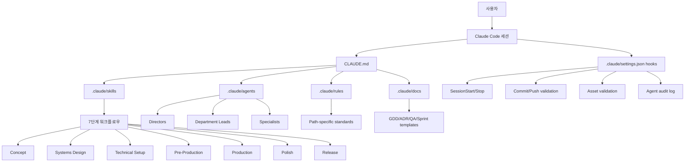
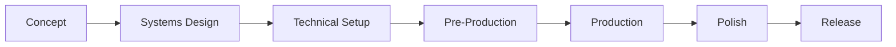

> 분석 일자: 2026-04-18
> 대상 버전: `v1.0.0-beta-2-g666e0fc` / commit `666e0fcb5ad3f5f0f56e1219e8cf03d44e62a49a`
> 저장소: https://github.com/Donchitos/Claude-Code-Game-Studios
> 분석 경로: `/Users/dede/workspace/opensources/Claude-Code-Game-Studios`

---

_This article is partially written by Codex_

---

## 1. 프로젝트 개요

**Claude Code Game Studios**는 Claude Code 프로젝트 안에 게임 개발 스튜디오의 조직 구조를 심어 두는 템플릿입니다. 일반적인 게임 엔진 코드나 라이브러리라기보다는, Claude Code가 게임 프로젝트를 진행할 때 따라야 할 **역할, 절차, 산출물, 검증 규칙**을 모아 둔 운영 프레임워크입니다.

README는 이 프로젝트를 다음처럼 설명합니다.

- 단일 Claude Code 세션을 완전한 게임 개발 스튜디오처럼 사용합니다.
- 49개 에이전트가 디자인, 프로그래밍, 아트, 오디오, 내러티브, QA, 프로덕션 역할을 나눕니다.
- 72개 스킬이 `/start`, `/brainstorm`, `/create-architecture`, `/dev-story`, `/team-combat` 같은 워크플로우 명령으로 제공됩니다.
- 12개 훅이 세션 시작, 커밋, 푸시, 에셋 수정, 컨텍스트 압축, 서브에이전트 실행 등을 감시합니다.
- 11개 룰이 `src/gameplay/**`, `src/ui/**`, `assets/data/**`, `tests/**` 같은 경로별 품질 기준을 제공합니다.

중요한 점은 이 프로젝트가 게임을 대신 만들어 주는 자동 생성기가 아니라는 것입니다. 프로젝트 문서에서도 반복해서 강조하듯이, 목표는 **자율 실행**이 아니라 **사용자 주도 협업**입니다. 사용자는 최종 의사결정자이고, 에이전트는 질문하고, 선택지를 제시하고, 초안을 만든 뒤 승인을 기다리는 컨설턴트 역할을 맡습니다.

즉, Claude Code Game Studios는 “Claude에게 게임을 만들어 달라고 맡기는 도구”가 아니라 “Claude Code 안에 게임 개발 조직도를 설치하는 도구”에 가깝습니다.

## 2. 한 줄로 보는 구조

이 프로젝트의 핵심은 다음 한 줄로 요약할 수 있습니다.

> `.claude/` 디렉토리에 에이전트, 스킬, 훅, 룰, 템플릿을 넣고, Claude Code가 게임 개발의 각 단계에서 올바른 역할과 절차를 따르게 만드는 구조입니다.

로컬 체크아웃 기준 주요 구성은 다음과 같습니다.

| 구성요소  | 수량 | 역할                                                     |
| --------- | ---: | -------------------------------------------------------- |
| Agents    |   49 | 게임 스튜디오 역할 정의                                  |
| Skills    |   72 | slash command 기반 워크플로우                            |
| Hooks     |   12 | 세션, 커밋, 푸시, 에셋, 서브에이전트 이벤트 감시         |
| Rules     |   11 | 경로별 코딩/문서 작성 기준                               |
| Templates |   38 | GDD, ADR, sprint plan, UX spec, test plan 등 산출물 양식 |

README에는 템플릿 수가 39개로 적혀 있지만, 분석한 로컬 체크아웃에서는 `.claude/docs/templates` 아래 파일이 38개였습니다. `docs/WORKFLOW-GUIDE.md`에도 48 agents, 68 slash commands라고 적힌 오래된 표현이 남아 있습니다. 실제 현재 파일 기준으로는 README의 49 agents, 72 skills가 더 정확합니다.

## 3. 기술 스택

| 영역          | 기술                                             |
| ------------- | ------------------------------------------------ |
| 대상 플랫폼   | Claude Code                                      |
| 주 구성 방식  | Markdown, YAML frontmatter, JSON 설정, Bash hook |
| 에이전트 정의 | `.claude/agents/*.md`                            |
| 스킬 정의     | `.claude/skills/*/SKILL.md`                      |
| 훅 설정       | `.claude/settings.json` + `.claude/hooks/*.sh`   |
| 프로젝트 문서 | `.claude/docs`, `docs`, `design`, `production`   |
| 지원 엔진     | Godot 4, Unity, Unreal Engine 5                  |
| 검증 도구     | Git, jq 선택, Python 선택, pytest 선택           |
| 라이선스      | MIT                                              |

애플리케이션 런타임 코드는 거의 없습니다. `src/`에는 `.gitkeep`만 있고, 대부분의 동작은 Claude Code가 읽는 Markdown 지시문과 hook 스크립트에 들어 있습니다.

이런 면에서 Claude Code Game Studios는 npm 패키지나 CLI 앱이라기보다 **Claude Code용 프로젝트 템플릿**입니다. 게임 엔진 위에 올라가는 코드가 아니라, 게임을 만들기 전과 만드는 중에 필요한 의사결정 구조를 제공합니다.

## 4. 전체 아키텍처

전체 구조는 다음처럼 볼 수 있습니다.



흐름은 단순합니다.

1. Claude Code가 프로젝트 루트의 `CLAUDE.md`를 읽습니다.
2. `CLAUDE.md`는 `.claude/docs/`, `.claude/rules/`, 엔진 레퍼런스, 협업 프로토콜을 참조합니다.
3. 사용자가 `/start`, `/brainstorm`, `/dev-story` 같은 스킬을 실행합니다.
4. 스킬은 필요한 문서와 상태를 읽고, 필요하면 적절한 에이전트에게 작업을 위임합니다.
5. 훅은 세션 상태, 커밋, 푸시, 에셋 변경, 서브에이전트 실행을 보조적으로 감시합니다.
6. 산출물은 `design/`, `docs/architecture/`, `production/`, `src/`, `tests/`, `assets/`로 쌓입니다.

핵심 설계 포인트는 “모든 것을 한 에이전트가 기억하게 하지 않는다”는 점입니다. 역할은 agent 파일로, 절차는 skill 파일로, 품질 기준은 rule 파일로, 산출물 형식은 template 파일로 분리되어 있습니다.

## 5. 디렉토리 구조

프로젝트 루트 구조는 다음과 같습니다.

```text
Claude-Code-Game-Studios/
├── CLAUDE.md
├── README.md
├── UPGRADING.md
├── LICENSE
├── .claude/
│   ├── settings.json
│   ├── agents/
│   ├── skills/
│   ├── hooks/
│   ├── rules/
│   ├── docs/
│   ├── agent-memory/
│   └── statusline.sh
├── design/
│   └── registry/
├── docs/
│   ├── architecture/
│   ├── engine-reference/
│   ├── examples/
│   └── registry/
├── production/
│   └── session-state/
├── src/
│   └── .gitkeep
└── CCGS Skill Testing Framework/
    ├── agents/
    ├── skills/
    ├── templates/
    └── catalog.yaml
```

실제 게임 프로젝트가 진행되면 README와 workflow guide 기준으로 다음 디렉토리들이 채워지는 구조입니다.

```text
src/                  # 게임 소스 코드
assets/               # 아트, 오디오, VFX, 셰이더, 데이터
design/               # GDD, 내러티브, 레벨, 밸런스, UX 문서
docs/architecture/    # 아키텍처 문서와 ADR
tests/                # 단위, 통합, 성능, 플레이테스트 관련 테스트
prototypes/           # 버리는 프로토타입
production/           # 스프린트, 마일스톤, 릴리즈, 에픽, 스토리, 세션 상태
```

`.claude/`는 운영체제에 가깝고, `design/`, `docs/`, `production/`, `src/`, `assets/`, `tests/`는 프로젝트 산출물이 쌓이는 작업 공간입니다.

## 6. 에이전트 계층 구조

에이전트는 실제 게임 스튜디오 조직처럼 3계층으로 나뉩니다.

### Tier 1 - Directors

| Agent                | 역할                                     |
| -------------------- | ---------------------------------------- |
| `creative-director`  | 게임의 핵심 비전, 톤, 방향성 결정        |
| `technical-director` | 기술 비전, 아키텍처, 성능 전략 결정      |
| `producer`           | 스프린트, 마일스톤, 리스크, 부서 간 조율 |

### Tier 2 - Department Leads

| Agent                | 역할                                    |
| -------------------- | --------------------------------------- |
| `game-designer`      | 메커닉, 시스템, 진행, 경제, 밸런스      |
| `lead-programmer`    | 코드 아키텍처, API 설계, 리팩터링, 리뷰 |
| `art-director`       | 비주얼 방향, 아트 바이블, UI/UX 방향    |
| `audio-director`     | 음악, 사운드 팔레트, 오디오 구현 전략   |
| `narrative-director` | 스토리, 세계관, 캐릭터, 대사 전략       |
| `qa-lead`            | QA 전략, 버그 triage, 릴리즈 준비도     |
| `release-manager`    | 빌드, 버전, changelog, 배포, 롤백       |
| `localization-lead`  | 국제화, 번역 파이프라인, locale 테스트  |

### Tier 3 - Specialists

전문가 계층에는 gameplay, engine, AI, network, tools, UI, systems, level, economy, technical art, sound, writing, QA, performance, DevOps, analytics, security, accessibility, live ops, community 등의 역할이 있습니다.

엔진별 specialist도 따로 있습니다.

| Engine          | Lead                | Sub-specialists                                                                                            |
| --------------- | ------------------- | ---------------------------------------------------------------------------------------------------------- |
| Godot 4         | `godot-specialist`  | `godot-gdscript-specialist`, `godot-shader-specialist`, `godot-gdextension-specialist`                     |
| Unity           | `unity-specialist`  | `unity-dots-specialist`, `unity-shader-specialist`, `unity-addressables-specialist`, `unity-ui-specialist` |
| Unreal Engine 5 | `unreal-specialist` | `ue-gas-specialist`, `ue-blueprint-specialist`, `ue-replication-specialist`, `ue-umg-specialist`           |

이 계층 구조는 단순한 이름표가 아닙니다. `.claude/docs/coordination-rules.md`는 delegation 규칙을 명시합니다.

- 복잡한 결정은 director에서 lead, lead에서 specialist로 내려갑니다.
- 같은 계층의 agent는 서로 자문할 수 있지만, 자기 도메인 밖의 결정을 강제할 수 없습니다.
- 의견 충돌은 공통 상위 agent에게 escalate합니다.
- 여러 부서에 영향을 주는 변경은 `producer`가 조율합니다.
- agent는 명시적 위임 없이 자기 도메인 밖 파일을 수정하지 않습니다.

이 규칙 덕분에 여러 subagent를 쓰더라도 “아무 agent나 아무 파일을 고치는” 상황을 줄이려는 의도가 보입니다.

## 7. 스킬 시스템

스킬은 `.claude/skills/*/SKILL.md` 파일로 정의됩니다. 각 스킬은 YAML frontmatter와 본문 지시문을 가집니다.

예를 들어 `/dev-story`는 다음 성격을 가집니다.

```yaml
name: dev-story
description: 'Read a story file and implement it...'
argument-hint: '[story-path]'
user-invocable: true
allowed-tools: Read, Glob, Grep, Write, Bash, Task, AskUserQuestion
```

스킬은 slash command처럼 사용되며, 단순 명령이 아니라 작은 업무 프로세스입니다.

대표 스킬은 다음과 같습니다.

| 구분              | 스킬 예시                                                                                            | 역할                                           |
| ----------------- | ---------------------------------------------------------------------------------------------------- | ---------------------------------------------- |
| 온보딩            | `/start`, `/help`, `/project-stage-detect`, `/adopt`                                                 | 현재 프로젝트 상태를 판단하고 다음 단계를 안내 |
| 컨셉/디자인       | `/brainstorm`, `/map-systems`, `/design-system`, `/art-bible`                                        | 게임 컨셉과 GDD 작성                           |
| 아키텍처          | `/create-architecture`, `/architecture-decision`, `/architecture-review`, `/create-control-manifest` | 기술 설계와 ADR 작성                           |
| 프리프로덕션      | `/ux-design`, `/prototype`, `/create-epics`, `/create-stories`, `/sprint-plan`                       | 구현 전 산출물 준비                            |
| 프로덕션          | `/story-readiness`, `/dev-story`, `/code-review`, `/story-done`                                      | 스토리 단위 구현과 종료                        |
| QA                | `/qa-plan`, `/smoke-check`, `/regression-suite`, `/team-qa`                                          | 테스트 계획, smoke gate, QA sign-off           |
| 릴리즈            | `/release-checklist`, `/launch-checklist`, `/changelog`, `/patch-notes`, `/hotfix`                   | 출시 준비와 패치 프로세스                      |
| 팀 오케스트레이션 | `/team-combat`, `/team-ui`, `/team-audio`, `/team-release` 등                                        | 여러 agent를 묶어 한 기능을 end-to-end 처리    |

스킬의 특징은 “문서 생성”과 “다음 단계 제한”을 함께 한다는 점입니다. 예를 들어 `/dev-story`는 story 파일만 보고 바로 코드를 쓰지 않습니다. 먼저 TR registry, ADR, control manifest, engine preferences, dependency status를 확인합니다. 필요한 파일이 없으면 구현을 시작하지 않고 막습니다.

## 8. 7단계 워크플로우

`.claude/docs/workflow-catalog.yaml`은 전체 게임 개발을 7단계로 나눕니다.



각 단계는 필요한 산출물과 다음 단계 조건을 가집니다.

### 1. Concept

게임 아이디어를 구조화합니다.

주요 스킬은 다음과 같습니다.

- `/brainstorm` - MDA, player psychology, verb-first design을 사용해 컨셉을 탐색합니다.
- `/setup-engine` - Godot, Unity, Unreal 중 엔진과 버전을 고정합니다.
- `/art-bible` - visual identity를 정합니다.
- `/map-systems` - 필요한 시스템을 분해하고 의존성을 정리합니다.

주요 산출물은 `design/gdd/game-concept.md`, `.claude/docs/technical-preferences.md`, `design/art/art-bible.md`, `design/gdd/systems-index.md`입니다.

### 2. Systems Design

각 시스템별 GDD를 작성합니다.

- `/design-system` - 시스템별 GDD를 작성합니다.
- `/design-review` - 개별 GDD를 검토합니다.
- `/review-all-gdds` - 여러 GDD를 동시에 읽고 모순, 누락, 설계 이론 문제를 찾습니다.
- `/consistency-check` - entity registry와 GDD 간 불일치를 찾습니다.

### 3. Technical Setup

기술 설계를 고정합니다.

- `/create-architecture` - master architecture 문서를 만듭니다.
- `/architecture-decision` - 주요 기술 결정을 ADR로 기록합니다.
- `/architecture-review` - GDD 요구사항과 ADR 사이의 traceability를 확인합니다.
- `/create-control-manifest` - programmer가 따라야 할 flat rule sheet를 만듭니다.

### 4. Pre-Production

UX, prototype, epic, story, sprint 계획을 준비합니다.

- `/ux-design` - 주요 화면과 상호작용 UX spec을 만듭니다.
- `/prototype` - 핵심 메커닉을 throwaway prototype으로 검증합니다.
- `/playtest-report` - vertical slice playtest를 기록합니다.
- `/create-epics` - GDD와 ADR을 epic으로 바꿉니다.
- `/create-stories` - epic을 구현 가능한 story 파일로 나눕니다.
- `/sprint-plan` - 첫 스프린트를 계획합니다.

### 5. Production

스토리 단위로 실제 구현을 진행합니다.

- `/story-readiness` - story가 구현 가능한지 확인합니다.
- `/dev-story` - story, GDD requirement, ADR, control manifest를 읽고 구현합니다.
- `/code-review` - 구현 결과를 리뷰합니다.
- `/story-done` - acceptance criteria를 확인하고 story를 닫습니다.
- `/team-qa` - sprint 전체 QA cycle을 수행합니다.

### 6. Polish

성능, 밸런스, 버그, 회귀 테스트, 긴 플레이 세션을 다룹니다.

- `/perf-profile`
- `/balance-check`
- `/bug-triage`
- `/regression-suite`
- `/soak-test`
- `/team-polish`

### 7. Release

릴리즈 후보를 만들고, 체크리스트와 patch note, hotfix workflow를 준비합니다.

- `/release-checklist`
- `/launch-checklist`
- `/changelog`
- `/patch-notes`
- `/hotfix`
- `/team-release`

이 전체 흐름은 “코드부터 쓰지 말고, 컨셉 - 시스템 - 아키텍처 - 스토리 - 구현 - QA - 릴리즈 순서를 지키라”는 강한 구조를 제공합니다.

## 9. 훅과 자동 안전장치

`.claude/settings.json`은 Claude Code hook을 설정합니다. 주요 이벤트는 다음과 같습니다.

| Hook                       | Trigger                | 역할                                                                 |
| -------------------------- | ---------------------- | -------------------------------------------------------------------- |
| `session-start.sh`         | SessionStart           | 현재 branch, 최근 commit, sprint, milestone, bug, code health를 표시 |
| `detect-gaps.sh`           | SessionStart           | fresh project, design doc 부족, prototype 문서 누락 감지             |
| `validate-commit.sh`       | PreToolUse Bash        | `git commit` 시 staged file 검증                                     |
| `validate-push.sh`         | PreToolUse Bash        | protected branch push 경고                                           |
| `validate-assets.sh`       | PostToolUse Write/Edit | `assets/` 파일명, JSON validity 검증                                 |
| `validate-skill-change.sh` | PostToolUse Write/Edit | skill 수정 시 `/skill-test` 실행 권고                                |
| `pre-compact.sh`           | PreCompact             | 컨텍스트 압축 전 세션 상태 출력                                      |
| `post-compact.sh`          | PostCompact            | 압축 후 session state 복구 안내                                      |
| `session-stop.sh`          | Stop                   | 세션 종료 시 최근 git activity와 session state 기록                  |
| `log-agent.sh`             | SubagentStart          | subagent 실행 audit log 기록                                         |
| `log-agent-stop.sh`        | SubagentStop           | subagent 종료 audit log 기록                                         |
| `notify.sh`                | Notification           | 알림 메시지 출력, Windows toast 지원                                 |

흥미로운 점은 hook들이 대부분 “모든 작업을 막는 강한 gate”라기보다는 “위험한 행동을 발견하고 알려주는 안전장치”라는 점입니다. 예를 들어 `validate-assets.sh`는 파일명 규칙 위반은 advisory warning으로 보고, `assets/data/*.json`의 JSON parse 실패 같은 build-breaking 문제만 blocking error로 취급합니다.

## 10. 룰과 경로 기반 품질 관리

`.claude/rules/`는 파일 경로별 규칙을 제공합니다.

| Rule                | Path                  | 핵심 기준                                               |
| ------------------- | --------------------- | ------------------------------------------------------- |
| `gameplay-code.md`  | `src/gameplay/**`     | data-driven 값, delta time, UI 참조 금지                |
| `engine-code.md`    | `src/core/**`         | hot path allocation 최소화, thread safety, API 안정성   |
| `ai-code.md`        | `src/ai/**`           | 성능 budget, debuggability, data-driven params          |
| `network-code.md`   | `src/networking/**`   | server-authoritative, versioned messages, security      |
| `ui-code.md`        | `src/ui/**`           | game state 소유 금지, localization-ready, accessibility |
| `design-docs.md`    | `design/gdd/**`       | GDD 필수 섹션, formula format, edge cases               |
| `narrative.md`      | `design/narrative/**` | lore consistency, character voice, canon levels         |
| `data-files.md`     | `assets/data/**`      | JSON validity, naming convention, schema rule           |
| `test-standards.md` | `tests/**`            | test naming, coverage requirement, fixture pattern      |
| `prototype-code.md` | `prototypes/**`       | 완화된 기준, README와 hypothesis 필요                   |
| `shader-code.md`    | `assets/shaders/**`   | shader naming, performance target, cross-platform rule  |

이 구조의 장점은 문맥을 파일 경로에서 바로 얻는다는 것입니다. `src/gameplay/` 파일을 수정하면 gameplay 규칙을 보고, `assets/data/` 파일을 수정하면 data file 규칙을 봅니다. 범용 “좋은 코드 작성”보다 실무적으로 더 작동하기 쉬운 방식입니다.

## 11. 사용 방법

README 기준 기본 사용법은 다음과 같습니다.

### 1. 템플릿을 가져옵니다

```bash
git clone https://github.com/Donchitos/Claude-Code-Game-Studios.git my-game
cd my-game
```

### 2. Claude Code를 실행합니다

```bash
claude
```

### 3. `/start`로 시작합니다

```text
/start
```

`/start`는 사용자가 현재 어디에 있는지 먼저 묻습니다.

- 게임 아이디어가 전혀 없는 상태인지
- 흐릿한 테마나 장르만 있는지
- 명확한 컨셉은 있지만 문서화하지 않았는지
- 이미 코드, 디자인 문서, 프로토타입이 있는 brownfield 프로젝트인지

선택에 따라 다음 경로가 달라집니다.

| 상태                 | 추천 시작점                                  |
| -------------------- | -------------------------------------------- |
| 아이디어 없음        | `/brainstorm open`                           |
| 흐릿한 아이디어 있음 | `/brainstorm [hint]`                         |
| 명확한 컨셉 있음     | `/brainstorm [concept]` 또는 `/setup-engine` |
| 기존 작업 있음       | `/project-stage-detect` 후 `/adopt`          |

### 4. 엔진을 설정합니다

```text
/setup-engine godot 4.6
```

또는 Unity, Unreal을 선택할 수 있습니다. 엔진 설정은 `.claude/docs/technical-preferences.md`와 `docs/engine-reference/`를 채우며, 이후 어떤 engine specialist를 호출할지 결정하는 기준이 됩니다.

### 5. 컨셉과 시스템을 문서화합니다

```text
/brainstorm open
/art-bible
/map-systems
/design-system
/review-all-gdds
```

### 6. 아키텍처와 ADR을 만듭니다

```text
/create-architecture
/architecture-decision
/create-control-manifest
/architecture-review
```

### 7. 구현 단위로 쪼갭니다

```text
/create-epics
/create-stories
/sprint-plan
```

### 8. story를 구현합니다

```text
/story-readiness production/epics/combat/STORY-001.md
/dev-story production/epics/combat/STORY-001.md
/code-review src/gameplay/combat/damage_calculator.gd
/story-done production/epics/combat/STORY-001.md
```

### 9. sprint와 release를 검증합니다

```text
/team-qa sprint
/smoke-check
/release-checklist
/launch-checklist
```

이 사용 흐름에서 중요한 점은 `/dev-story`가 꽤 뒤에 나온다는 것입니다. Claude Code Game Studios의 관점에서는 “바로 구현”이 기본값이 아닙니다. 먼저 컨셉, 시스템, 아키텍처, ADR, control manifest, story, test evidence 경로가 준비되어야 구현에 들어갑니다.

## 12. 실전 사용 흐름 예시

예를 들어 Godot 4로 작은 액션 게임을 만든다고 가정하면 흐름은 다음처럼 됩니다.

```text
/start
```

처음에는 현재 상태를 고릅니다. 아이디어가 없다면 `/brainstorm open`으로 이동합니다.

```text
/brainstorm top-down action roguelite
```

여기서 게임의 core fantasy, target audience, core loop, pillar, anti-pillar를 정리합니다.

```text
/setup-engine godot 4.6
/art-bible
/map-systems
```

엔진을 고정하고, 비주얼 방향과 시스템 목록을 만듭니다. 예를 들어 movement, combat, enemy AI, progression, HUD, save system 등이 systems index에 들어갑니다.

```text
/design-system combat
/design-review design/gdd/combat-system.md
/review-all-gdds
```

전투 시스템 GDD를 작성하고, 다른 GDD와 모순이 없는지 검토합니다.

```text
/create-architecture
/architecture-decision combat-event-bus
/create-control-manifest
/architecture-review
```

전투 시스템이 Godot signal을 어떻게 쓸지, damage event를 어디서 소유할지, UI와 gameplay를 어떻게 분리할지 ADR로 남깁니다.

```text
/create-epics layer: core
/create-stories combat
/sprint-plan
```

구현 단위를 story로 쪼갭니다.

```text
/story-readiness production/epics/combat/STORY-001-damage-calculation.md
/dev-story production/epics/combat/STORY-001-damage-calculation.md
/code-review src/gameplay/combat/damage_calculator.gd
/story-done production/epics/combat/STORY-001-damage-calculation.md
```

이때 `/dev-story`는 story 파일만 읽지 않습니다. TR registry, governing ADR, control manifest, engine preference, dependency status, acceptance criteria, test evidence 경로를 함께 읽습니다. 그래서 구현 결과가 “그럴듯한 코드”에서 끝나는 것이 아니라, 앞서 승인한 설계 산출물에 묶입니다.

## 13. Superpowers와의 차이

이 블로그에서 이전에 분석한 Superpowers와 비교하면 차이가 분명합니다.

| 항목         | Superpowers                                                 | Claude Code Game Studios                                      |
| ------------ | ----------------------------------------------------------- | ------------------------------------------------------------- |
| 범위         | 범용 소프트웨어 개발 workflow                               | 게임 개발 전용 workflow                                       |
| 핵심 단위    | skills 중심                                                 | agents + skills + hooks + rules + templates                   |
| 사용 대상    | Codex, Claude Code, Cursor, Gemini CLI 등 폭넓은 agent 환경 | Claude Code 중심                                              |
| 주요 철학    | TDD, 디버깅, 계획, 검증 같은 개발 절차 강제                 | 게임 스튜디오 조직과 phase gate 재현                          |
| 산출물       | spec, plan, test, review 중심                               | GDD, art bible, ADR, epics, stories, sprint, QA, release 중심 |
| 멀티에이전트 | subagent-driven development 중심                            | director, lead, specialist 계층과 team skill 중심             |

Superpowers가 “개발자가 해야 할 절차를 agent에게 강제하는 도구”라면, Claude Code Game Studios는 “게임 개발 조직의 역할과 산출물 체계를 Claude Code 안에 구현한 템플릿”에 가깝습니다.

특히 Claude Code Game Studios는 게임 개발 특유의 문제를 더 잘 다룹니다.

- 재미 검증 전 구현을 막습니다.
- GDD와 ADR을 분리합니다.
- 전투, 레벨, 내러티브, UI, 오디오, live ops 같은 게임 도메인 agent를 제공합니다.
- Art bible, UX spec, playtest report, release checklist 같은 게임 개발 산출물을 템플릿화합니다.
- Godot, Unity, Unreal 엔진별 specialist를 제공합니다.

반대로 범용 웹 앱이나 라이브러리 개발에는 범위가 과합니다. 게임 개발이라는 도메인에 강하게 최적화된 구조입니다.

## 14. 설계 철학

이 프로젝트의 설계 철학은 `docs/COLLABORATIVE-DESIGN-PRINCIPLE.md`에 가장 잘 드러납니다.

핵심은 다음 패턴입니다.

```text
Question -> Options -> Decision -> Draft -> Approval
```

에이전트는 먼저 질문합니다. 그다음 2개에서 4개 정도의 선택지를 장단점과 함께 제시합니다. 사용자가 결정하면 초안을 만들고, 다시 승인을 받은 뒤 파일에 씁니다.

이 방식은 느립니다. 하지만 게임 개발에서는 이 느림이 장점이 될 수 있습니다. 게임은 구현보다 방향성이 더 자주 문제를 일으킵니다. 핵심 재미, 시스템 간 의존성, 밸런스, UI feedback, 아트 방향, 사운드 피드백, 접근성, 릴리즈 준비도 같은 것들이 서로 얽혀 있습니다.

그래서 이 프로젝트는 빠른 코드 생성을 희생하고 다음을 얻으려 합니다.

- 사용자의 창작 의도를 보존합니다.
- 문서와 구현의 traceability를 유지합니다.
- 여러 도메인의 변경 전파를 명시합니다.
- 구현 전에 디자인, 아키텍처, QA 기준을 고정합니다.
- 서브에이전트가 많아져도 역할 경계를 유지합니다.

특히 “Collaborative, Not Autonomous”라는 원칙은 중요합니다. AI game studio라는 표현은 자칫 “AI가 알아서 게임을 만들어 준다”로 읽히기 쉽습니다. 하지만 실제 문서와 스킬을 보면, 이 프로젝트는 사용자를 빼는 방향이 아니라 사용자를 **creative director** 위치에 두는 방향으로 설계되어 있습니다.

## 15. 한계와 주의점

좋은 구조이지만 모든 프로젝트에 맞지는 않습니다.

### 1. 작은 게임잼에는 무거울 수 있습니다

GDD, ADR, control manifest, story, QA, release checklist까지 요구하는 흐름은 48시간 게임잼에는 과할 수 있습니다. 이 경우 `/prototype`, `/quick-design`, `Solo` review mode 위주로 가볍게 쓰는 편이 현실적입니다.

### 2. 문서와 실제 파일 수 사이에 일부 drift가 있습니다

분석한 checkout에서는 README와 workflow guide 사이에 agent/skill/template 수 표기가 일부 달랐습니다. 기능적으로 큰 문제는 아니지만, 프로젝트 자체도 계속 발전 중이라는 신호입니다.

### 3. Claude Code에 강하게 묶여 있습니다

구조상 `.claude/settings.json`, Claude Code hooks, Claude Code subagent 개념을 전제로 합니다. 다른 agent 환경에서 그대로 쓰기는 어렵습니다.

### 4. 실제 구현 품질은 여전히 프로젝트 문맥에 의존합니다

에이전트 계층과 스킬이 있다고 해서 자동으로 좋은 게임 코드가 나오는 것은 아닙니다. 특히 엔진 버전별 API, 플러그인, 빌드 환경, 플랫폼 제약은 사용자가 계속 확인해야 합니다.

### 5. 승인을 많이 요구하는 구조는 피로할 수 있습니다

Question -> Options -> Decision -> Draft -> Approval 흐름은 방향성을 지키는 데 좋지만, 반복되면 속도가 떨어질 수 있습니다. 프로젝트 단계에 따라 `Full`, `Lean`, `Solo` review mode를 조절하는 것이 중요합니다.

## 16. 결론

Claude Code Game Studios는 게임 개발을 위한 “AI agent 모음”이라기보다, Claude Code 안에 설치하는 **게임 개발 운영 체계**입니다.

핵심 가치는 다음입니다.

- 게임 개발의 역할 분리를 agent 계층으로 표현합니다.
- 컨셉에서 릴리즈까지의 phase gate를 skill로 제공합니다.
- GDD, ADR, story, QA evidence 같은 산출물을 중심으로 구현을 통제합니다.
- hook과 rule로 위험한 변경, 문서 누락, 경로별 품질 문제를 감시합니다.
- 사용자를 최종 의사결정자로 남겨 둡니다.

개인적으로 흥미로운 부분은 이 프로젝트가 “AI가 더 많은 코드를 쓰게 하는 방향”이 아니라 “AI가 덜 성급하게 행동하게 하는 방향”으로 설계되어 있다는 점입니다. 게임 개발에서 정말 어려운 부분은 코드 작성만이 아니라, 무엇을 만들지, 왜 만들지, 어떤 순서로 검증할지, 무엇을 포기할지 결정하는 일입니다.

Claude Code Game Studios는 바로 그 결정 과정을 구조화합니다. 그래서 작은 실험에는 무거울 수 있지만, 혼자 또는 소규모 팀으로 장기 게임 프로젝트를 진행한다면 꽤 유용한 작업 프레임워크가 될 수 있습니다.
