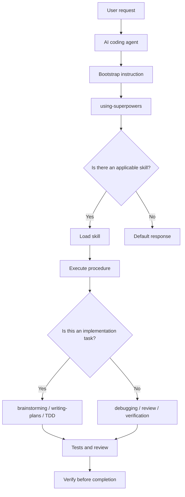
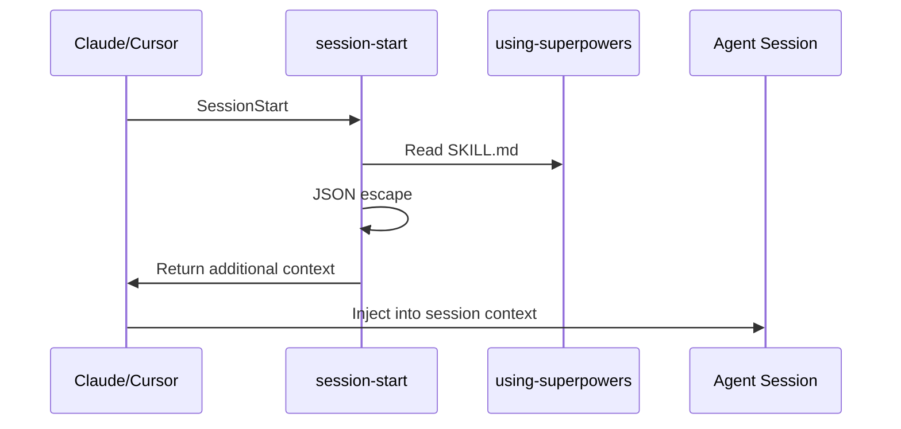
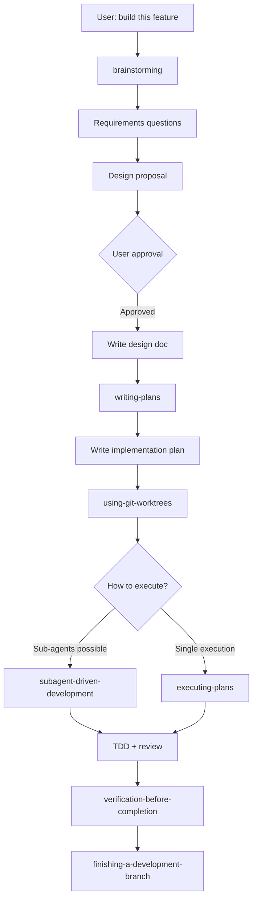
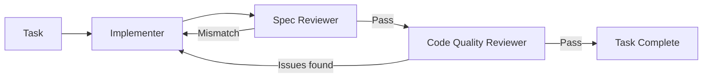

> Analyzed: 2026-04-18
> Version: v5.0.7 / commit `c4bbe651cb1bc5e7bec6f7effae2b946571f3258`
> Repository: https://github.com/obra/superpowers

---

_This article is partially written by Codex_

---

## 1. Project Overview

**Superpowers** is a skill library designed to enforce proper development processes on AI coding agents. Rather than a simple collection of prompts, it is closer to **an operating-system-like ruleset** that defines the procedures an agent must follow at each stage of a task.

I have been deeply engaged with Superpowers over the past two or three weeks. Whenever I start building something new with Claude, Superpowers naturally steps in and begins guiding the project with Socratic questions. The knowledgebase feature I recently added to this blog started with Superpowers, and I also used it to brainstorm a different game concept for a Godot project I am currently working on.

Using it feels noticeably different. Instead of tossing a request at an agent and letting it run, it is more like having an experienced person beside you constantly asking: "Is this really what you want to build?", "Which of these two approaches is better?", "What risks should you validate first?"

The core goals are straightforward:

- Stop the agent from writing code immediately.
- Make it clarify requirements first.
- Break the implementation plan into small pieces.
- Write tests before writing code.
- Run actual verification before declaring completion.
- Handle complex tasks through sub-agents and review loops.

The README describes Superpowers as "a complete software development workflow for your coding agents." Looking at the actual codebase, that description is quite accurate. The runtime logic is thin; most of the value lives in the process documentation inside each `skills/*/SKILL.md` file.

At the time of this analysis, the repository contains 14 skills and 47 test files. The version is `5.0.7`.

## 2. Technology Stack

| Area                | Technology                                                    |
| ------------------- | ------------------------------------------------------------- |
| Primary languages   | Markdown, Bash, JavaScript                                    |
| Package type        | Node.js ESM                                                   |
| Package version     | `superpowers@5.0.7`                                           |
| Runtime code        | JavaScript for the OpenCode plugin                            |
| Hooks               | Bash, Windows CMD wrappers                                    |
| Skill format        | `SKILL.md` + YAML frontmatter                                 |
| Tests               | Shell scripts, Node.js test server                            |
| Supported platforms | Claude Code, Cursor, Codex, OpenCode, Gemini CLI, Copilot CLI |
| License             | MIT                                                           |

The `package.json` is remarkably lean:

```json
{
  "name": "superpowers",
  "version": "5.0.7",
  "type": "module",
  "main": ".opencode/plugins/superpowers.js"
}
```

Notably, there are virtually no dependencies. Superpowers is not a complex npm package — it is a bundle of documents that agents read and follow, together with per-platform integration shims.

## 3. Overall Architecture

The structure of Superpowers can be visualized as follows:



Platform integrations differ, but the central concept is the same:

1. At session start, inject the contents of `using-superpowers` into the agent's context.
2. `using-superpowers` provides the meta-rule: "If any skill is even 1% applicable, you MUST use it."
3. In actual work, each skill's `description` and body define when it triggers and what procedure to follow.
4. Separate skills constrain agent behavior at each stage — implementation, debugging, review, and wrap-up.

In essence, Superpowers is not about executing code — it is about **shaping behavior**. It suppresses an agent's natural tendencies to answer quickly, implement immediately, and declare completion without verification, replacing them with document-based protocols.

## 4. Directory Structure

The core file structure looks like this:

```text
superpowers/
├── README.md
├── CLAUDE.md
├── GEMINI.md
├── package.json
├── skills/
│   ├── using-superpowers/
│   ├── brainstorming/
│   ├── writing-plans/
│   ├── executing-plans/
│   ├── subagent-driven-development/
│   ├── test-driven-development/
│   ├── systematic-debugging/
│   ├── verification-before-completion/
│   ├── requesting-code-review/
│   ├── receiving-code-review/
│   ├── using-git-worktrees/
│   ├── finishing-a-development-branch/
│   ├── dispatching-parallel-agents/
│   └── writing-skills/
├── agents/
│   └── code-reviewer.md
├── commands/
│   ├── brainstorm.md
│   ├── write-plan.md
│   └── execute-plan.md
├── hooks/
│   ├── hooks.json
│   ├── hooks-cursor.json
│   ├── run-hook.cmd
│   └── session-start
├── .opencode/
│   ├── INSTALL.md
│   └── plugins/superpowers.js
├── .codex/
│   └── INSTALL.md
├── .claude-plugin/
│   └── plugin.json
├── .cursor-plugin/
│   └── plugin.json
└── tests/
    ├── claude-code/
    ├── opencode/
    ├── skill-triggering/
    ├── explicit-skill-requests/
    ├── brainstorm-server/
    └── subagent-driven-dev/
```

Unlike a typical application where domain logic accumulates under `src/`, here `skills/` effectively is the source code. Each skill is treated as executable documentation that changes how an agent behaves.

## 5. The Skill System

Each skill is organized around a single `SKILL.md` file:

```markdown
---
name: test-driven-development
description: Use when implementing any feature or bugfix, before writing implementation code
---

# Test-Driven Development

...
```

The `name` and `description` fields in the frontmatter are consumed by each platform's skill discovery system. The body contains the actual procedure the agent is expected to follow.

### Key Skill List

| Skill                            | Role                                                                  |
| -------------------------------- | --------------------------------------------------------------------- |
| `using-superpowers`              | Entry point for every session. Enforces the skill usage rules         |
| `brainstorming`                  | Clarifies requirements and design before any implementation           |
| `writing-plans`                  | Breaks an approved design into small, actionable implementation tasks |
| `executing-plans`                | Executes a written plan step by step                                  |
| `subagent-driven-development`    | Per-task sub-agents with a two-stage review loop                      |
| `test-driven-development`        | Enforces RED-GREEN-REFACTOR                                           |
| `systematic-debugging`           | No fixes without root-cause analysis                                  |
| `verification-before-completion` | Runs verification commands before declaring completion                |
| `requesting-code-review`         | Requests a code review after implementation                           |
| `receiving-code-review`          | Validates review feedback critically rather than accepting it blindly |
| `using-git-worktrees`            | Creates isolated workspaces                                           |
| `finishing-a-development-branch` | Chooses merge, PR, archive, or discard after confirming tests pass    |
| `dispatching-parallel-agents`    | Distributes independent problems to parallel agents                   |
| `writing-skills`                 | Writes new skills using a TDD approach                                |

Of these, `using-superpowers` is the most critical — it is the meta-skill. It recalibrates the agent's judgment so that "if any skill has even a 1% chance of being applicable, it must be invoked."

To put it plainly, `using-superpowers` is Superpowers' front desk. If a user says "fix this bug," an agent's natural instinct is to read the code and start making changes. This skill intervenes first: "Is this a debugging task that requires `systematic-debugging`?", "Is this a new feature that should start with `brainstorming`?", "Will `verification-before-completion` be needed before declaring done?"

Without `using-superpowers`, the other skills easily remain good documentation and nothing more. With it, Superpowers operates as a single cohesive workflow. It relieves the human of having to remember which individual skill to invoke — instead, the agent develops the habit of looking up the right skill for each situation.

Superpowers does not treat skills as simple reference documents. `writing-skills` describes skills as "TDD applied to process documentation" — meaning skill documents are treated as testable, behavior-changing units.

## 6. The brainstorming Skill: My Most-Used Feature

The skill I have found most valuable in Superpowers is `brainstorming`. It prevents the agent from jumping straight into implementation and instead forces it to first narrow down intent and requirements.

The full text is fairly long, so rather than reproducing it verbatim, I will pull out a few lines that capture its character and summarize the overall flow. The original lives at `skills/brainstorming/SKILL.md`.

> **name:** `brainstorming`
>
> **description:** "You MUST use this before any creative work"
>
> **goal:** "Help turn ideas into fully formed designs"
>
> **hard gate:** "Do NOT invoke any implementation skill"
>
> **principle:** "One question at a time"

Even these few lines make the skill's direction clear. For any work involving creative judgment — new features, new components, behavior changes — stop, do not implement yet, and move into questions and design. The goal is to take a vague idea and guide it through conversation all the way to a concrete design.

The checklist in the original flows roughly like this: first, read the project context and offer a visual companion if useful. Then ask one question at a time to narrow down goals and constraints, and compare two or three approaches. Once a direction is clear, present a design proposal; when the user approves it, write a design doc, run a spec self-review, and only then hand off to the implementation plan.

This structure makes a significant difference in practice. A typical AI coding agent, upon hearing "build this," immediately starts reading files and modifying code. `brainstorming` stops that, reads the current project context first, asks one question at a time, and surfaces two or three alternative approaches.

What I especially appreciate is how it frames choices. Hearing "Option A is fast but has poor scalability, Option B is heavier but better long-term, Option C is overkill right now" lets me make decisions much faster than working through vague intuition alone. This is different from simply asking many questions — it uses those questions to organize thinking and then translates that thinking into actionable design choices.

Whether I was building the knowledgebase or planning the Godot game, this skill played the biggest role in setting the initial direction. If Superpowers' other skills are safeguards for implementation quality, `brainstorming` is the mechanism that ensures you are building the right thing in the first place.

## 7. Bootstrap and Platform Integration

Superpowers supports multiple agent platforms. Because each platform loads skills differently, the integration approach varies accordingly.

### Claude Code / Cursor

Claude Code and Cursor use plugin metadata and hooks:

```json
{
  "hooks": {
    "SessionStart": [
      {
        "matcher": "startup|clear|compact",
        "hooks": [
          {
            "type": "command",
            "command": "\"${CLAUDE_PLUGIN_ROOT}/hooks/run-hook.cmd\" session-start",
            "async": false
          }
        ]
      }
    ]
  }
}
```

At session start, `hooks/session-start` runs; this script reads the contents of `skills/using-superpowers/SKILL.md` and injects them into the session context.

The core flow is as follows:



`session-start` also branches on the output format by platform. Cursor uses `additional_context`, Claude Code uses `hookSpecificOutput.additionalContext`, and Copilot CLI variants use top-level `additionalContext`. The context injection serves the same purpose everywhere, but the script absorbs the per-platform API differences.

### Codex

Codex relies on native skill discovery rather than a separate plugin runtime.

Installation is simple:

```bash
git clone https://github.com/obra/superpowers.git ~/.codex/superpowers
mkdir -p ~/.agents/skills
ln -s ~/.codex/superpowers/skills ~/.agents/skills/superpowers
```

This exposes Superpowers' `skills/` directory to Codex by symlinking it under `~/.agents/skills/`, where Codex scans for skills.

### OpenCode

For OpenCode, `.opencode/plugins/superpowers.js` is the actual runtime plugin. It does two things:

1. Adds the Superpowers `skills/` path to the `skills.paths` entry in the OpenCode config.
2. Injects the `using-superpowers` content into the first user message.

The OpenCode plugin inserts the bootstrap into the first user message rather than expanding the top-level system message. Code comments reveal the intent: avoid token bloat and sidestep issues some models have with multiple system messages.

## 8. Core Workflow

The development flow Superpowers intends looks like this:



A typical AI coding tool operates roughly as "request → code change → test." Superpowers adds strong gates before and after this flow.

### The Brainstorming Gate

`brainstorming` forces requirements exploration before implementation. It explicitly flags "this is simple enough to skip design" as an anti-pattern.

This matters in practice. The smaller the request, the more likely an agent is to over-infer the user's intent and jump straight to file edits. Superpowers deliberately slows things down at that point.

### The Planning Gate

`writing-plans` breaks a design into small, implementable tasks. Each task must include file paths, tests, and verification steps. The documentation demands plans written clearly enough that "an enthusiastic junior engineer with poor taste, no judgement, no project context" could follow them.

The phrasing is blunt, but the purpose is clear: leave no implicit knowledge in the plan.

### The TDD Gate

`test-driven-development` is one of the most assertive skills in Superpowers. A failing test must be written before any implementation code; if you wrote the implementation first, you must delete it and start over.

The reason for this level of firmness is that agents tend to reduce TDD to "I also added tests." Superpowers makes the failing test itself a required verification artifact.

### The Completion Verification Gate

`verification-before-completion` requires actually running commands before claiming done:

```text
NO COMPLETION CLAIMS WITHOUT FRESH VERIFICATION EVIDENCE
```

This skill directly targets one of the most common agent failure modes: saying "done" after a code change without running tests, or saying "no issues" after checking only some of the tests.

## 9. Testing and Quality

Superpowers is a documentation-centric project, but it has a substantial test suite:

| Test area                        | Content                                                   |
| -------------------------------- | --------------------------------------------------------- |
| `tests/claude-code/`             | Claude Code skill behavior and integration tests          |
| `tests/opencode/`                | OpenCode plugin loading, priority, and tool-mapping tests |
| `tests/skill-triggering/`        | Skill trigger condition validation                        |
| `tests/explicit-skill-requests/` | Explicit skill request scenarios                          |
| `tests/brainstorm-server/`       | Brainstorming visual companion server tests               |
| `tests/subagent-driven-dev/`     | Sub-agent development workflow tests                      |

Notably, `writing-skills` treats skill authoring itself as TDD: "First create a stress scenario in which the agent fails without the skill; write the skill; then verify that agent behavior changes in that same scenario."

This perspective is characteristic of Superpowers. It treats documentation not as a passive reference, but as **code that changes agent behavior**.

## 10. Design Philosophy

Superpowers has a very clear philosophical stance.

### 1. Agents are impatient by default

Superpowers starts from a position of distrust — in a constructive sense. It assumes agents tend to skip adequate requirements gathering, omit tests, overstate completion, and agree too readily with review feedback.

As a result, each skill leans more toward "prohibitions" and "gates" than "recommendations."

### 2. Process must be stronger than memory

A long `AGENTS.md` or system prompt tends to be forgotten as it grows. Superpowers addresses this by splitting process into individual skills — only the procedure relevant to the current moment is loaded.

This design is advantageous both in terms of token efficiency and behavioral clarity.

### 3. Good agent work requires review loops

`subagent-driven-development` separates the implementer, the spec reviewer, and the code quality reviewer:



When a single agent both implements and verifies, it easily falls into self-confirmation bias. Superpowers addresses this by having "an agent in a different context" perform the review.

### 4. Contribution policy is calibrated for the agent era

`CLAUDE.md` carries a much stronger tone than a typical contribution guide. The repository has a high PR rejection rate, and it requires template verification, searching for existing PRs, confirming the actual problem, and human review — all to guard against low-quality agent-generated PRs.

The core principle here is the same: verified, problem-driven changes are preferred over plausible-looking changes produced by an agent.

## 11. How Superpowers Differs from a Typical Agent Prompt

| Comparison point    | Typical AGENTS.md / CLAUDE.md     | Superpowers                               |
| ------------------- | --------------------------------- | ----------------------------------------- |
| Structure           | Single long instruction file      | Independent skill collection              |
| Loading             | Always present throughout session | Load skill on demand                      |
| Focus               | Project rules                     | Development process itself                |
| Enforcement         | Generally advisory language       | Gates, prohibitions, checklists           |
| Scalability         | Weakens as the file grows longer  | Skills can be added individually          |
| Testing perspective | Usually absent                    | Skill behavior tests are emphasized       |
| Platform support    | Typically one tool                | Claude, Cursor, Codex, OpenCode, and more |

Superpowers is less a "good prompt" and more a "software development methodology package for agents." Its particular strength is the separation of recurring engineering disciplines — TDD, debugging, code review, completion verification — into individual skills.

## 12. Limitations and Caveats

Superpowers is powerful, but it is not the right fit for every situation.

### It can slow things down

Running through brainstorming, design approval, plan writing, TDD, and review for every change can feel heavy even for small edits. For trivial changes in a personal project, this level of process may be overkill.

### It can consume tokens at a frightening rate

If you are on the Claude Code Pro plan, take care. Directing Superpowers through a complex task burns tokens at a startling pace. I have exhausted most of a 5-hour session limit in under 20 minutes.

Superpowers frequently recommends sub-agent-based workflows like `subagent-driven-development`. Implementation speed increases, but pressing `yes` on every suggestion can drain your token budget almost instantly. For large tasks, it is worth deciding upfront: "How many sub-agents will I allow this time?" and "Up to which step do I want automation?"

### Lower-tier models tend to skip steps

Even when Superpowers decomposes a task into small pieces, lower-tier models frequently skip individual steps. The plan document may have a checklist, but the model may jump over intermediate steps or handle verification superficially.

For this reason, I find combining Superpowers' task decomposition with [Beads](/kb/2026-04-13-beads-architecture) to be quite effective. Superpowers handles design and task breakdown; Beads tracks the state and dependencies of each individual task, making it easier to catch what the agent missed. For work that spans multiple sessions, this combination is notably more reliable.

### Support level varies by platform

Claude Code, Cursor, Codex, and OpenCode differ in how they handle skills and hooks. Sub-agent-based workflows in particular depend on the platform's multi-agent capabilities. Codex documentation notes that `subagent-driven-development` and `dispatching-parallel-agents` require the multi-agent feature to be enabled.

### The forceful tone of skills can create friction

Superpowers uses expressions like "MUST," "STOP," and "NO FIXES WITHOUT..." extensively. These strong directives are effective at suppressing bad agent habits, but they can cause fatigue when they conflict with what the user is asking for right now.

Fortunately, `using-superpowers` makes priorities explicit: user instructions come first; Superpowers skills come second.

### Documentation is the execution logic

The core logic of this project is Markdown. A minor change in wording can literally change how an agent behaves. This is why the contribution guide emphasizes that "changes to skills require evaluation."

## 13. Conclusion

Superpowers is less a tool that makes AI coding agents smarter, and more one that **makes them less hasty**.

Rather than expanding an LLM's underlying capabilities, it channels what the agent can already do into a more reliable sequence. Ask about requirements. Write the design. Break the plan apart. Write tests first. Get a review. Declare completion only after verification.

In my view, the core value of this project lies not in the "skill" format itself, but in the sentences that target agent failure patterns with remarkable precision. Instead of "add tests," it says "if you haven't seen a failing test first, you don't know whether your tests are correct." Instead of "do debugging," it says "do not fix anything before you have identified the root cause."

When running AI coding tools on extended autonomous tasks, process matters as much as model capability. Superpowers is the project that has packaged that process as a reusable collection of skills. If you are using Claude Code, Codex, or an agent with its own skill and tool runtime like [Hermes](/kb/2026-05-13-hermes-agent-architecture), and you find the agent modifying code too quickly and declaring completion too readily, this architecture is well worth studying.

That said, by my own standards, this is a genuinely remarkable tool. It feels like having a seasoned expert beside me — someone who has shipped far more of these products than I have — giving advice one step at a time. The way it structures choices into clear options (A, B, C) is especially helpful for organizing my thinking.

I recently wrote the [Playwright vs agent-browser vs Lightpanda comparison post](/kb/2026-04-16-browser-automation-comparison) entirely with Superpowers. This tool has a lot of room to grow even stronger, and I am a complete convert. If you have not tried it yet, I highly recommend giving it a shot.

---

### Related posts

- [Beads (bd) Project Analysis Report / A Distributed Graph Issue Tracker for AI Agents](/kb/2026-04-13-beads-architecture)
- [Playwright vs agent-browser vs Lightpanda — Which Browser Automation Tool Should You Use?](/kb/2026-04-16-browser-automation-comparison)
- [OpenClaw Architecture Analysis Report / Real-World Scenario Q&A](/kb/2026-03-11-openclaw-architecture)
- [Paperclip Architecture Analysis — AI Agent Virtual Company Orchestration](/kb/2026-04-15-paperclip-architecture)
