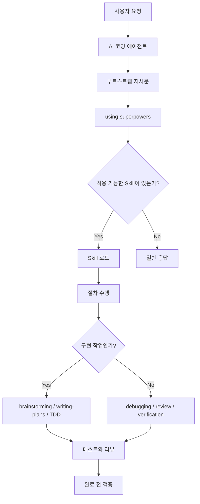
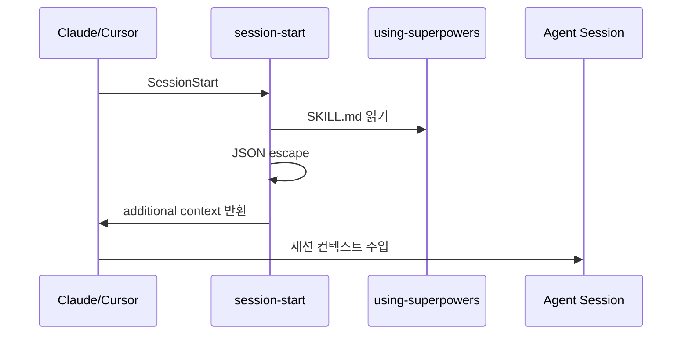
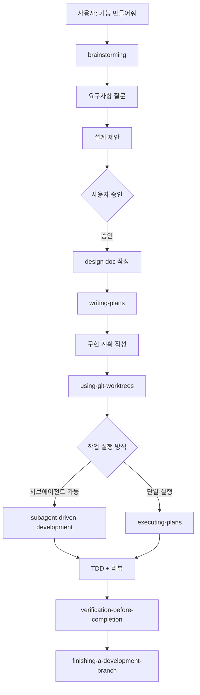
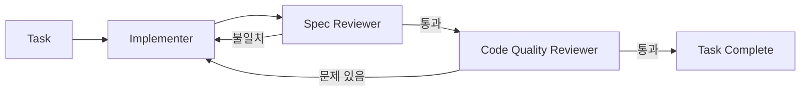

> 분석 일자: 2026-04-18
> 대상 버전: v5.0.7 / commit `c4bbe651cb1bc5e7bec6f7effae2b946571f3258`
> 저장소: https://github.com/obra/superpowers

---

_This article is partially written by Codex_

## 목차

1. [프로젝트 개요](#1-프로젝트-개요)
2. [기술 스택](#2-기술-스택)
3. [전체 아키텍처](#3-전체-아키텍처)
4. [디렉토리 구조](#4-디렉토리-구조)
5. [Skill 시스템](#5-skill-시스템)
6. [내가 가장 유용하게 느낀 brainstorming skill](#6-내가-가장-유용하게-느낀-brainstorming-skill)
7. [부트스트랩과 플랫폼 통합](#7-부트스트랩과-플랫폼-통합)
8. [핵심 워크플로우](#8-핵심-워크플로우)
9. [테스트와 품질 관리](#9-테스트와-품질-관리)
10. [설계 철학](#10-설계-철학)
11. [일반 에이전트 프롬프트와의 차별점](#11-일반-에이전트-프롬프트와의-차별점)
12. [한계와 주의점](#12-한계와-주의점)
13. [결론](#13-결론)

---

## 1. 프로젝트 개요

**Superpowers**는 AI 코딩 에이전트에게 개발 프로세스를 강제하기 위한 스킬 라이브러리입니다. 일반적인 프롬프트 모음이라기보다는, 에이전트가 작업 단계마다 어떤 절차를 따라야 하는지 정의한 **운영체제에 가까운 규칙 세트**입니다.

저는 최근 2, 3주간 Superpowers에 꽤 푹 빠져 있습니다. Claude에서 새로운 무언가를 만들려고 하면 Superpowers가 자연스럽게 나타나고, 바로 소크라테스식 질문을 던지면서 프로젝트 구상을 도와줍니다. 최근 블로그에 새로 추가한 knowledgebase 작업도 Superpowers와 함께 시작했고, 현재 개발 중인 Godot 프로젝트의 다른 게임 기획도 같이 구상했습니다.

써보면 느낌이 조금 다릅니다. 에이전트에게 "이거 만들어줘"라고 던지는 것이 아니라, 경험 많은 사람이 옆에서 "정말 만들고 싶은 게 이거 맞나요?", "이 접근과 저 접근 중 무엇이 나은가요?", "먼저 검증해야 할 위험은 무엇인가요?"라고 계속 물어보는 쪽에 가깝습니다.

핵심 목표는 단순합니다.

- 에이전트가 바로 코드를 쓰지 않게 한다.
- 요구사항을 먼저 정리하게 한다.
- 구현 계획을 작게 쪼개게 한다.
- 테스트를 먼저 쓰게 한다.
- 완료 선언 전에 실제 검증을 하게 한다.
- 복잡한 작업은 서브에이전트와 리뷰 루프로 처리하게 한다.

README에서는 Superpowers를 "complete software development workflow for your coding agents"라고 설명합니다. 실제 코드베이스를 보면 이 표현이 꽤 정확합니다. 런타임 로직은 얇고, 대부분의 가치는 `skills/*/SKILL.md`에 들어 있는 프로세스 문서에서 나옵니다.

현재 저장소 기준으로 스킬은 14개이며, 테스트 파일은 47개입니다. 버전은 `5.0.7`입니다.

## 2. 기술 스택

| 영역        | 기술                                                          |
| ----------- | ------------------------------------------------------------- |
| 주 언어     | Markdown, Bash, JavaScript                                    |
| 패키지 타입 | Node.js ESM                                                   |
| 패키지 버전 | `superpowers@5.0.7`                                           |
| 런타임 코드 | OpenCode 플러그인용 JavaScript                                |
| 훅          | Bash, Windows CMD 래퍼                                        |
| 스킬 포맷   | `SKILL.md` + YAML frontmatter                                 |
| 테스트      | Shell script, Node.js test server                             |
| 지원 플랫폼 | Claude Code, Cursor, Codex, OpenCode, Gemini CLI, Copilot CLI |
| 라이선스    | MIT                                                           |

`package.json`은 매우 작습니다.

```json
{
  "name": "superpowers",
  "version": "5.0.7",
  "type": "module",
  "main": ".opencode/plugins/superpowers.js"
}
```

흥미로운 점은 의존성이 사실상 없다는 것입니다. Superpowers는 복잡한 npm 패키지가 아니라, 에이전트가 읽고 따라야 하는 문서와 플랫폼별 연결 장치의 묶음입니다.

## 3. 전체 아키텍처

Superpowers의 구조는 아래처럼 볼 수 있습니다.



플랫폼별 통합은 다르지만 중심 개념은 같습니다.

1. 에이전트 세션 시작 시 `using-superpowers` 내용을 주입한다.
2. `using-superpowers`가 "적용 가능한 스킬이 있으면 반드시 사용하라"는 메타 규칙을 제공한다.
3. 실제 작업에서는 각 스킬의 `description`과 본문이 트리거 조건과 절차가 된다.
4. 구현, 디버깅, 리뷰, 종료 같은 단계마다 별도 스킬이 에이전트의 행동을 제한한다.

즉, Superpowers의 핵심은 코드 실행이 아니라 **행동 유도**입니다. 에이전트의 기본 성향인 "빨리 답하기", "바로 구현하기", "확인 없이 완료 선언하기"를 문서 기반 프로토콜로 억제합니다.

## 4. 디렉토리 구조

핵심 파일 구조는 다음과 같습니다.

```text
superpowers/
├── README.md
├── CLAUDE.md
├── GEMINI.md
├── package.json
├── skills/
│   ├── using-superpowers/
│   ├── brainstorming/
│   ├── writing-plans/
│   ├── executing-plans/
│   ├── subagent-driven-development/
│   ├── test-driven-development/
│   ├── systematic-debugging/
│   ├── verification-before-completion/
│   ├── requesting-code-review/
│   ├── receiving-code-review/
│   ├── using-git-worktrees/
│   ├── finishing-a-development-branch/
│   ├── dispatching-parallel-agents/
│   └── writing-skills/
├── agents/
│   └── code-reviewer.md
├── commands/
│   ├── brainstorm.md
│   ├── write-plan.md
│   └── execute-plan.md
├── hooks/
│   ├── hooks.json
│   ├── hooks-cursor.json
│   ├── run-hook.cmd
│   └── session-start
├── .opencode/
│   ├── INSTALL.md
│   └── plugins/superpowers.js
├── .codex/
│   └── INSTALL.md
├── .claude-plugin/
│   └── plugin.json
├── .cursor-plugin/
│   └── plugin.json
└── tests/
    ├── claude-code/
    ├── opencode/
    ├── skill-triggering/
    ├── explicit-skill-requests/
    ├── brainstorm-server/
    └── subagent-driven-dev/
```

일반적인 애플리케이션처럼 `src/` 아래에 도메인 로직이 쌓여 있지는 않습니다. 대신 `skills/`가 사실상의 소스 코드입니다. 각 스킬은 에이전트 행동을 바꾸는 실행 가능한 문서로 취급됩니다.

## 5. Skill 시스템

각 스킬은 `SKILL.md` 파일 하나를 중심으로 구성됩니다.

```markdown
---
name: test-driven-development
description: Use when implementing any feature or bugfix, before writing implementation code
---

# Test-Driven Development

...
```

frontmatter의 `name`과 `description`은 플랫폼의 스킬 발견 시스템에서 사용됩니다. 본문은 에이전트가 실제로 따라야 하는 작업 절차입니다.

### 핵심 스킬 목록

| Skill                            | 역할                                        |
| -------------------------------- | ------------------------------------------- |
| `using-superpowers`              | 모든 세션의 시작점. 스킬 사용 규칙을 강제   |
| `brainstorming`                  | 구현 전에 요구사항과 설계를 정리            |
| `writing-plans`                  | 승인된 설계를 작은 구현 작업으로 분해       |
| `executing-plans`                | 작성된 계획을 순서대로 실행                 |
| `subagent-driven-development`    | 작업별 서브에이전트 + 2단계 리뷰 루프       |
| `test-driven-development`        | RED-GREEN-REFACTOR 강제                     |
| `systematic-debugging`           | 원인 분석 없는 수정 금지                    |
| `verification-before-completion` | 완료 선언 전 검증 명령 실행                 |
| `requesting-code-review`         | 구현 후 코드 리뷰 요청                      |
| `receiving-code-review`          | 리뷰 피드백을 맹목적으로 수용하지 않고 검증 |
| `using-git-worktrees`            | 격리된 작업 공간 생성                       |
| `finishing-a-development-branch` | 테스트 확인 후 merge/PR/보관/폐기 선택      |
| `dispatching-parallel-agents`    | 독립 문제를 병렬 에이전트로 분배            |
| `writing-skills`                 | 새 스킬을 TDD 방식으로 작성                 |

이 중 가장 중요한 것은 `using-superpowers`입니다. 이 스킬은 메타 스킬입니다. "어떤 스킬이 1%라도 적용될 가능성이 있으면 반드시 호출하라"는 식으로 에이전트의 판단 기준을 바꿉니다.

조금 쉽게 말하면, `using-superpowers`는 Superpowers의 안내 데스크입니다. 사용자가 "버그 고쳐줘"라고 말하면 에이전트는 보통 바로 코드를 읽고 수정하려고 합니다. 그런데 이 스킬이 먼저 끼어들어 "이건 디버깅이니 `systematic-debugging`을 써야 하는가?", "새 기능이니 `brainstorming`부터 해야 하는가?", "완료 선언 전에는 `verification-before-completion`이 필요한가?"를 확인하게 만듭니다.

그래서 `using-superpowers`가 없으면 나머지 스킬은 좋은 문서로만 남기 쉽습니다. 반대로 이 스킬이 있으면 Superpowers 전체가 하나의 워크플로우처럼 동작합니다. 개별 스킬을 기억하는 책임을 사람이 지는 것이 아니라, 에이전트가 매번 상황에 맞는 스킬을 찾아보도록 습관을 바꾸는 장치입니다.

Superpowers는 스킬을 단순 참고 문서로 보지 않습니다. `writing-skills`에서는 스킬을 "process documentation에 적용한 TDD"로 설명합니다. 즉, 스킬 문서도 테스트 가능한 행동 변경 단위로 취급합니다.

## 6. 내가 가장 유용하게 느낀 brainstorming skill

제가 Superpowers에서 가장 유용하게 느낀 것은 `brainstorming` skill입니다. 이 스킬은 에이전트가 바로 구현으로 뛰어들지 못하게 막고, 먼저 의도와 요구사항을 좁히게 만듭니다.

전문은 꽤 길어서 그대로 싣기보다는, 원문에서 성격이 잘 드러나는 문장만 짧게 가져오고 전체 흐름은 요약해 보겠습니다. 원문은 `skills/brainstorming/SKILL.md`에 있습니다.

> **name:** `brainstorming`
>
> **description:** "You MUST use this before any creative work"
>
> **goal:** "Help turn ideas into fully formed designs"
>
> **hard gate:** "Do NOT invoke any implementation skill"
>
> **principle:** "One question at a time"

이 몇 줄만 봐도 이 skill의 방향이 꽤 분명합니다. 새로운 기능, 컴포넌트, 동작 변경처럼 창의적인 판단이 들어가는 작업에서는 먼저 멈추고, 바로 구현하지 말고, 질문과 설계로 들어가라는 뜻입니다. 사용자의 막연한 아이디어를 대화로 구체적인 설계까지 끌고 가는 것이 목적입니다.

원문 체크리스트의 흐름은 대략 이렇습니다. 먼저 프로젝트 맥락을 읽고, 필요하면 visual companion을 제안합니다. 그 다음 한 번에 하나씩 질문하면서 목적과 제약을 좁히고, 2-3개의 접근법을 비교합니다. 어느 정도 방향이 잡히면 설계를 제시하고, 사용자가 승인하면 design doc을 쓰고, spec self-review를 거친 뒤에야 implementation plan으로 넘어갑니다.

이 구조가 실제 사용감에 큰 차이를 만듭니다. 보통 AI 코딩 에이전트는 "만들어줘"라는 말을 들으면 바로 파일을 읽고 코드를 수정하려고 합니다. 그런데 `brainstorming`은 그 전에 멈추고, 현재 프로젝트 맥락을 읽고, 하나씩 질문하고, 2-3개의 접근법을 제시하게 합니다.

제가 특히 좋았던 부분은 선택지를 만들어주는 방식입니다. "A안은 빠르지만 확장성이 낮고, B안은 조금 무겁지만 장기적으로 낫고, C안은 지금은 과하다"처럼 정리해주면 제가 막연히 생각하던 것을 훨씬 빨리 판단할 수 있습니다. 이게 단순히 질문을 많이 하는 것과 다릅니다. 질문을 통해 생각을 정리하고, 선택 가능한 설계로 바꿔주는 느낌입니다.

knowledgebase를 만들 때도 그랬고, Godot 게임을 구상할 때도 이 skill이 초반 방향을 잡는 데 가장 큰 역할을 했습니다. Superpowers의 다른 skill들이 구현 품질을 지키는 장치라면, `brainstorming`은 애초에 무엇을 만들지 잘 정하는 장치에 가깝습니다.

## 7. 부트스트랩과 플랫폼 통합

Superpowers는 여러 에이전트 플랫폼을 지원합니다. 하지만 각 플랫폼의 스킬 로딩 방식이 다르기 때문에 통합 방식도 다릅니다.

### Claude Code / Cursor

Claude Code와 Cursor는 플러그인 메타데이터와 훅을 사용합니다.

```json
{
  "hooks": {
    "SessionStart": [
      {
        "matcher": "startup|clear|compact",
        "hooks": [
          {
            "type": "command",
            "command": "\"${CLAUDE_PLUGIN_ROOT}/hooks/run-hook.cmd\" session-start",
            "async": false
          }
        ]
      }
    ]
  }
}
```

세션 시작 시 `hooks/session-start`가 실행되고, 이 스크립트가 `skills/using-superpowers/SKILL.md` 내용을 읽어 세션 컨텍스트에 주입합니다.

핵심 흐름은 다음과 같습니다.



`session-start`는 플랫폼별 출력 포맷도 분기합니다. Cursor는 `additional_context`, Claude Code는 `hookSpecificOutput.additionalContext`, Copilot CLI 계열은 top-level `additionalContext`를 사용합니다. 같은 목적의 컨텍스트 주입이지만 플랫폼별 API 차이를 흡수하고 있습니다.

### Codex

Codex는 별도 플러그인 런타임보다 native skill discovery에 의존합니다.

설치 방식은 단순합니다.

```bash
git clone https://github.com/obra/superpowers.git ~/.codex/superpowers
mkdir -p ~/.agents/skills
ln -s ~/.codex/superpowers/skills ~/.agents/skills/superpowers
```

즉, Superpowers의 `skills/` 디렉토리를 Codex가 스캔하는 `~/.agents/skills/` 아래에 심볼릭 링크로 노출합니다.

### OpenCode

OpenCode는 `.opencode/plugins/superpowers.js`가 실제 런타임 플러그인입니다. 여기서는 두 가지 일을 합니다.

1. OpenCode 설정의 `skills.paths`에 Superpowers의 `skills/` 경로를 추가한다.
2. 첫 사용자 메시지에 `using-superpowers` 내용을 주입한다.

OpenCode 플러그인은 top-level system message를 늘리지 않고 첫 user message에 bootstrap을 삽입합니다. 코드 주석을 보면 토큰 증가와 일부 모델의 다중 system message 문제를 피하려는 의도가 드러납니다.

## 8. 핵심 워크플로우

Superpowers가 의도하는 개발 흐름은 아래와 같습니다.



일반적인 AI 코딩 도구는 "요청 → 코드 수정 → 테스트"에 가깝습니다. Superpowers는 이 흐름 앞뒤에 강한 게이트를 추가합니다.

### 브레인스토밍 게이트

`brainstorming`은 구현 전에 요구사항을 탐색하도록 강제합니다. 특히 "너무 간단해서 설계가 필요 없다"는 생각을 안티패턴으로 명시합니다.

이건 실제로 중요합니다. 에이전트는 작은 요청일수록 사용자의 의도를 과하게 추측하고 바로 파일을 수정하는 경향이 있습니다. Superpowers는 이 지점에서 속도를 늦춥니다.

### 계획 작성 게이트

`writing-plans`는 설계를 구현 가능한 작은 작업으로 쪼갭니다. 각 작업은 파일 경로, 테스트, 검증 방법까지 포함해야 합니다. 문서 안에서는 "enthusiastic junior engineer with poor taste, no judgement, no project context"도 따라할 수 있을 정도로 쓰라고 요구합니다.

표현은 거칠지만 목적은 명확합니다. 에이전트에게 암묵지를 남기지 말라는 것입니다.

### TDD 게이트

`test-driven-development`는 Superpowers에서 가장 강한 어조의 스킬 중 하나입니다. 구현 코드보다 실패하는 테스트를 먼저 작성해야 하며, 구현을 먼저 썼다면 삭제하고 다시 시작하라고 요구합니다.

이 정도로 강하게 말하는 이유는 에이전트가 TDD를 쉽게 "테스트도 같이 추가했다" 수준으로 축소하기 때문입니다. Superpowers는 테스트가 먼저 실패하는 장면을 검증 대상으로 둡니다.

### 완료 검증 게이트

`verification-before-completion`은 완료 선언 전에 실제 명령을 실행하게 합니다.

```text
NO COMPLETION CLAIMS WITHOUT FRESH VERIFICATION EVIDENCE
```

이 스킬은 에이전트의 가장 흔한 문제를 직접 겨냥합니다. 코드 변경 후 테스트를 안 돌리고 "완료했습니다", 일부 테스트만 보고 "문제없습니다"라고 말하는 행동을 금지합니다.

## 9. 테스트와 품질 관리

Superpowers는 문서 중심 프로젝트이지만 테스트가 꽤 많이 있습니다.

| 테스트 영역                      | 내용                                               |
| -------------------------------- | -------------------------------------------------- |
| `tests/claude-code/`             | Claude Code 스킬 동작과 통합 테스트                |
| `tests/opencode/`                | OpenCode 플러그인 로딩, 우선순위, 도구 매핑 테스트 |
| `tests/skill-triggering/`        | 스킬 트리거 조건 검증                              |
| `tests/explicit-skill-requests/` | 명시적 스킬 요청 시나리오                          |
| `tests/brainstorm-server/`       | 브레인스토밍 visual companion 서버 테스트          |
| `tests/subagent-driven-dev/`     | 서브에이전트 개발 워크플로우 테스트                |

특히 `writing-skills`는 스킬 작성 자체를 TDD로 다룹니다. "스킬이 없을 때 에이전트가 실패하는 압박 시나리오를 먼저 만든 뒤, 스킬을 작성하고, 같은 시나리오에서 행동이 바뀌는지 검증하라"는 접근입니다.

이 관점이 Superpowers의 특징입니다. 문서를 단순 문서가 아니라 **에이전트 행동을 변경하는 코드**처럼 봅니다.

## 10. 설계 철학

Superpowers의 철학은 매우 선명합니다.

### 1. 에이전트는 기본적으로 서두른다

Superpowers는 에이전트를 신뢰하지 않는 쪽에서 출발합니다. 좋은 의미에서 불신합니다. 에이전트는 요구사항을 충분히 확인하지 않고, 테스트를 생략하고, 완료를 과장하고, 리뷰 피드백에 과하게 동의하는 경향이 있다고 봅니다.

그래서 각 스킬은 "권장"보다 "금지"와 "게이트"가 많습니다.

### 2. 프로세스는 기억보다 강해야 한다

일반적인 `AGENTS.md`나 시스템 프롬프트는 길어질수록 잘 잊힙니다. Superpowers는 이를 스킬 단위로 쪼갭니다. 필요한 시점에 필요한 절차만 로드하도록 설계되어 있습니다.

이 구조는 토큰 면에서도 유리하고, 행동 유도 면에서도 더 명확합니다.

### 3. 좋은 에이전트 작업은 리뷰 루프가 필요하다

`subagent-driven-development`는 구현 에이전트, spec reviewer, code quality reviewer를 분리합니다.



한 에이전트가 구현과 검증을 모두 하면 자기 확증에 빠지기 쉽습니다. Superpowers는 이 문제를 "다른 컨텍스트의 에이전트가 검토한다"는 방식으로 풀려고 합니다.

### 4. 기여 정책도 에이전트 시대에 맞춰져 있다

`CLAUDE.md`는 일반적인 기여 가이드보다 훨씬 강한 톤입니다. 이 저장소는 PR rejection rate가 높고, 에이전트가 만든 낮은 품질의 PR을 막기 위해 PR 템플릿 확인, 기존 PR 검색, 실제 문제 검증, human review를 요구합니다.

여기서도 핵심은 같습니다. 에이전트가 만든 그럴듯한 변경보다, 실제 문제와 검증된 변경을 우선합니다.

## 11. 일반 에이전트 프롬프트와의 차별점

| 비교 항목   | 일반 AGENTS.md / CLAUDE.md | Superpowers                                    |
| ----------- | -------------------------- | ---------------------------------------------- |
| 구조        | 단일 긴 지침 파일          | 독립 스킬 모음                                 |
| 로딩 방식   | 세션 전체에 상시 포함      | 필요 시 스킬 로드                              |
| 초점        | 프로젝트 규칙              | 개발 프로세스 자체                             |
| 강제력      | 대체로 권장 문장           | 게이트, 금지, 체크리스트                       |
| 확장성      | 파일이 길어질수록 약해짐   | 스킬 단위 추가 가능                            |
| 테스트 관점 | 보통 없음                  | 스킬 행동 테스트를 강조                        |
| 플랫폼 지원 | 특정 도구 중심             | Claude, Cursor, Codex, OpenCode 등 다중 플랫폼 |

Superpowers는 "좋은 프롬프트"라기보다는 "에이전트용 개발 방법론 패키지"에 가깝습니다. 특히 TDD, 디버깅, 코드 리뷰, 완료 검증 같은 반복적인 엔지니어링 규율을 스킬로 분리했다는 점이 좋습니다.

## 12. 한계와 주의점

Superpowers는 강력하지만 모든 상황에 맞지는 않습니다.

### 속도가 느려질 수 있다

브레인스토밍, 설계 승인, 계획 작성, TDD, 리뷰를 모두 거치면 작은 수정도 무겁게 느껴질 수 있습니다. 개인 프로젝트의 사소한 변경에는 과한 절차일 수 있습니다.

### 토큰을 매우 빠르게 쓸 수 있다

Claude Code Pro 요금제로 사용할 경우에는 정말 조심해야 합니다. Superpowers로 복잡한 작업을 지시하면 엄청난 속도로 토큰을 사용합니다. 저는 5시간짜리 세션 한도 중 20분 만에 거의 다 써버린 적도 있습니다.

특히 Superpowers는 `subagent-driven-development` 같은 서브에이전트 기반 작업을 자주 추천합니다. 구현 속도는 빨라지지만, 모든 제안에 `yes`를 누르다 보면 토큰이 순식간에 사라질 수 있습니다. 큰 작업에서는 "이번에는 subagent를 몇 개까지 쓸 것인지", "어느 단계까지만 자동화할 것인지"를 먼저 정해두는 편이 좋습니다.

### 낮은 레벨 모델은 작업을 빼먹기 쉽다

Superpowers가 작업을 잘게 쪼개주더라도, 낮은 레벨의 모델로 실행하면 세부 작업을 빼먹는 일이 꽤 자주 있습니다. 계획 문서에는 체크리스트가 있어도, 모델이 중간 단계를 건너뛰거나 검증을 대충 처리하는 경우가 생깁니다.

그래서 저는 Superpowers의 task 쪼개기와 [Beads](/kb/2026-04-13-beads-architecture)를 결합해서 쓰는 방식이 꽤 강력하다고 봅니다. Superpowers가 설계와 작업 분해를 맡고, Beads가 개별 작업의 상태와 의존성을 추적하면 에이전트가 놓친 일을 다시 잡아내기 쉽습니다. 특히 여러 세션에 걸쳐 이어지는 작업에서는 이 조합이 훨씬 안정적입니다.

### 플랫폼별 지원 수준이 다르다

Claude Code, Cursor, Codex, OpenCode는 스킬과 훅 지원 방식이 다릅니다. 특히 서브에이전트 기반 워크플로우는 플랫폼의 multi-agent 기능에 의존합니다. Codex 문서에서도 `subagent-driven-development`와 `dispatching-parallel-agents`는 multi-agent 기능을 켜야 한다고 설명합니다.

### 스킬의 강한 어조가 충돌할 수 있다

Superpowers는 "MUST", "STOP", "NO FIXES WITHOUT..." 같은 표현을 많이 씁니다. 이런 강한 규칙은 에이전트의 나쁜 습관을 막는 데 유용하지만, 사용자의 현재 지시와 충돌하면 피로감을 줄 수 있습니다.

다행히 `using-superpowers`는 우선순위를 명시합니다. 사용자 지시가 가장 높고, Superpowers 스킬은 그 다음입니다.

### 문서가 곧 실행 로직이다

이 프로젝트의 핵심 로직은 Markdown입니다. 따라서 문장을 조금 바꾸는 것도 실제 에이전트 행동을 바꿀 수 있습니다. 이 때문에 기여 가이드에서 "스킬 변경에는 평가가 필요하다"고 강조합니다.

## 13. 결론

Superpowers는 AI 코딩 에이전트를 더 똑똑하게 만드는 도구라기보다, **덜 성급하게 만드는 도구**입니다.

LLM의 기본 능력을 확장한다기보다는, 이미 할 수 있는 일을 더 안정적인 순서로 하게 만듭니다. 요구사항을 묻고, 설계를 쓰고, 계획을 나누고, 테스트를 먼저 만들고, 리뷰를 받고, 검증 후에만 완료를 선언하게 합니다.

개인적으로는 이 프로젝트의 핵심 가치가 "스킬"이라는 포맷 자체보다, 에이전트의 실패 패턴을 매우 구체적으로 겨냥한 문장들에 있다고 봅니다. "테스트를 추가하세요"가 아니라 "실패하는 테스트를 먼저 보지 않았다면 테스트가 맞는지 모른다"라고 말하고, "디버깅을 하세요"가 아니라 "원인 분석 전에는 수정하지 말라"라고 말합니다.

AI 코딩 도구를 장시간 자율 작업에 쓰려면, 모델 성능만큼이나 프로세스가 중요합니다. Superpowers는 그 프로세스를 재사용 가능한 스킬 묶음으로 만든 프로젝트입니다. Claude Code나 Codex를 쓰면서 에이전트가 너무 빨리 코드를 고치고 너무 빨리 완료 선언을 한다고 느낀다면, 충분히 살펴볼 만한 구조입니다.

그럼에도 불구하고, 제 기준에서는 정말 말도 안 되는 도구입니다. 저보다 비슷한 제품을 훨씬 더 많이 만들어본 전문가가 옆에서 하나씩 조언해주는 느낌이 듭니다. 특히 A, B, C처럼 선택지를 나눠 제시해주는 점이 생각을 정리하는 데 큰 도움이 됩니다.

최근에는 [Playwright vs agent-browser vs Lightpanda 비교 글](/kb/2026-04-16-browser-automation-comparison)도 아예 Superpowers와 함께 작성했습니다. 앞으로 더 강력해질 여지가 많은 도구이고, 저는 완전 팬입니다. 아직 안 써보신 분이 있다면 한 번쯤 꼭 써보시길 추천드립니다.

---

### 관련 글

- [Beads (bd) 프로젝트 분석 리포트 / AI 에이전트를 위한 분산 그래프 이슈 트래커](/kb/2026-04-13-beads-architecture)
- [Playwright vs agent-browser vs Lightpanda — 브라우저 자동화 도구, 어떤 걸 써야 할까?](/kb/2026-04-16-browser-automation-comparison)
- [OpenClaw 아키텍처 분석 보고서 / 실사용 시나리오 Q&A](/kb/2026-03-11-openclaw-architecture)
- [Paperclip 아키텍처 분석 - AI 에이전트 가상 회사 오케스트레이션](/kb/2026-04-15-paperclip-architecture)
