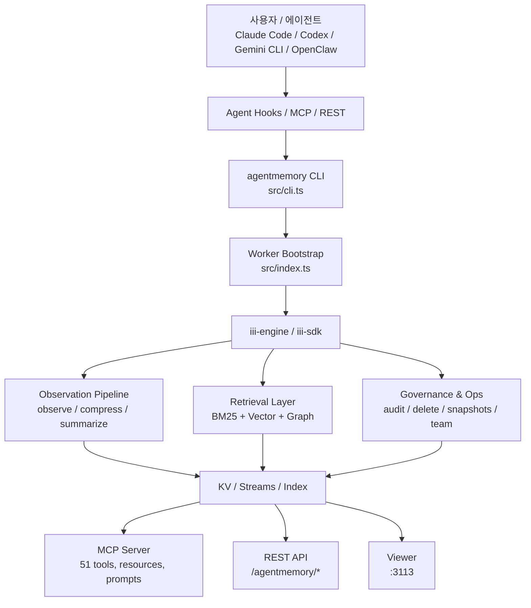
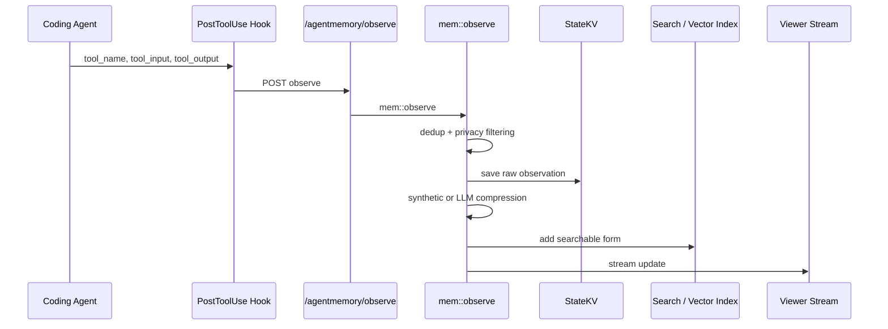

> Analyzed: 2026-05-13
> Package: `main` (`package.json` version `0.9.10`)
> Commit: `292e9f6af1df6eb691c7f8d746c7058e2e740709`
> Repository: https://github.com/rohitg00/agentmemory
> Local path: `~/workspace/opensources/agentmemory`

---

_This article is partially written by Codex_

---

## 1. Why agentmemory, Why Now

In conversations about AI coding agents these days, **how to maintain memory across sessions** comes up more often than raw model performance. The situation becomes even sharper once you start mixing tools like Claude Code, Codex CLI, Gemini CLI, and OpenClaw.

- Each tool keeps its own `CLAUDE.md`, rules files, session history, and MCP configuration.
- Decisions made inside one agent vanish the moment you switch to another.
- Even as context windows grow larger, safely handling last month's decisions alongside today's work remains genuinely difficult.

`agentmemory` attracts attention because it tackles this problem not with **"make the model remember things longer"** but with **"put a separate memory layer outside the agent entirely."**

From its very first README line, the project positions itself aggressively: persistent memory that works with any MCP client — Claude Code, Cursor, Gemini CLI, Codex CLI, OpenClaw, and more. Trendshift badges, LongMemEval-S retrieval figures, and agent logos are all front and center. In short, it positions itself less as a library and more as **a memory product riding the current agent wave**.

Yet once you read the code, it is more than marketing. This project genuinely attempts to tie together three things:

1. Automatically collect observations through hooks.
2. Compress them into searchable long-term memory.
3. Let multiple agents share that memory via MCP, REST, and a Viewer.

Having all three inside a single system is what makes `agentmemory` look like something beyond a plain RAG utility.

## 2. The Project in One Sentence

**agentmemory** is a **long-term memory layer for coding agents** built on top of `iii-engine`. It collects observations via hooks, runs them through summarization and indexing, then exposes that memory through MCP, REST, and a Viewer for multiple agents to share.

Breaking it down further, you can understand it as the answer to these questions:

| Question                       | agentmemory's Answer                                                                                                  |
| ------------------------------ | --------------------------------------------------------------------------------------------------------------------- |
| Where does memory come from?   | Automatically collected from hook events in Claude Code and similar tools.                                            |
| How is memory stored?          | In multiple layers: raw observation, compressed observation, summary, semantic memory, procedural memory, and more.   |
| How is it retrieved?           | Via hybrid search combining BM25, vector, and graph retrieval.                                                        |
| Who consumes the memory?       | Virtually any MCP/REST-capable agent: Claude Code, Cursor, Codex, Gemini CLI, OpenClaw, Hermes, and others.           |
| Can a human inspect the state? | Yes — in real time through the `:3113` viewer.                                                                        |
| Is it only recall?             | No. It also provides operational tooling: audit, governance delete, snapshots, team share, leases, signals, and more. |

A more precise framing for this project:

> Not a tool that tries to keep memory inside the LLM, but a project that places **an external memory operating system alongside your coding agents**.

## 3. Technology Stack

| Area             | Technology                                                           |
| ---------------- | -------------------------------------------------------------------- |
| Primary language | TypeScript (ESM)                                                     |
| Runtime          | Node.js 20+                                                          |
| Package          | `@agentmemory/agentmemory`                                           |
| Core engine      | `iii-sdk`, `iii-engine`                                              |
| LLM providers    | Anthropic, Gemini, OpenRouter, MiniMax, agent-sdk fallback           |
| Embeddings       | Local `all-MiniLM-L6-v2`, Gemini, OpenAI, Voyage, Cohere, OpenRouter |
| Protocols        | MCP, REST, WebSocket streams                                         |
| Viewer           | Node HTTP server + static HTML                                       |
| Tests            | Vitest                                                               |
| License          | Apache-2.0                                                           |

Rough size figures from the local checkout:

| Metric                         | Count |
| ------------------------------ | ----: |
| Tracked files                  |   423 |
| Files under `src/`             |   140 |
| Modules under `src/functions/` |    62 |
| Files under `src/hooks/`       |    13 |
| Test files                     |    84 |

These numbers alone make clear that this is no longer a small MCP example project. The combination of `src/index.ts`, `src/mcp/server.ts`, `src/triggers/api.ts`, and `src/functions/*` amounts to a full-fledged memory platform.

## 4. The Big Picture

The overall structure of the project looks like this:

What stands out here is that `agentmemory` does not push a single unified interface.

- For agents: `hooks` and `MCP`
- For external automation: `REST`
- For humans: the `viewer`
- For internal state: `iii-engine`'s worker/function/stream model

In other words, to serve a single feature called "memory," the project lays out a broad set of both input and output channels.

## 5. Memory Lifecycle

The core of this project is `src/functions/observe.ts` and its related hooks. Looking at `post-tool-use.ts` in particular, tool execution results are sent to the REST API, and `mem::observe` receives and processes them.

The key flow looks like this:

In more detail, `mem::observe` works through the following steps:

1. Validates required fields: `sessionId`, `hookType`, `timestamp`, and others.
2. Computes a dedup hash over a 5-minute window to discard duplicate observations.
3. Runs `stripPrivateData` to remove API keys and other sensitive values.
4. Saves the raw observation to a per-session KV store.
5. If images are present, writes them to separate files and records the references.
6. Fires the same event to the viewer stream.
7. Updates session metadata: observation count, first prompt, and so on.
8. If `AGENTMEMORY_AUTO_COMPRESS=true`, runs LLM compression; otherwise runs synthetic compression.

The important design point here is that **synthetic compression is the default**. A first glance at the README suggests the LLM summarizes everything, but the code and changelog tell a more conservative story.

- LLM compression consumes tokens and costs money.
- Uncontrolled LLM calls at hook time translate directly into real charges in subscription environments like Claude Pro.
- So the default path is zero-LLM synthetic compression; LLM compression is opt-in.

This decision also makes sense as a product choice. It prioritizes **not breaking the user's session** over maximizing recall quality.

## 6. Retrieval Strategy: BM25 + Vector + Graph

The retrieval side of `agentmemory` is centered on `src/state/hybrid-search.ts`. As the name implies, it is not a single retriever — it combines three signals:

| Stream | Role                                                          |
| ------ | ------------------------------------------------------------- |
| BM25   | Fast sparse retrieval based on keywords, filenames, concepts  |
| Vector | Similarity search using dense embeddings                      |
| Graph  | Graph retrieval that follows entities and their relationships |

The three result sets are merged using **RRF (Reciprocal Rank Fusion)**. The code sets `RRF_K = 60`, with default weights of BM25 0.4, Vector 0.6, Graph 0.3. When vector or graph retrieval is inactive at runtime, the weights are re-normalized accordingly.

The important point is that the retriever does not stop at a simple score merge:

- Query expansion is applied.
- Graph traversal expands not only from query entities but also from top vector results.
- Session diversification is enforced, capping results from any single session at three.
- A reranker performs a final re-sort when needed.

In short, "memory retrieval" is not treated as a simple vector DB lookup. The system approaches it as an information retrieval problem, then layers agent-specific use cases on top.

The `95.2% R@5` figure that the README highlights is built around this hybrid retrieval. However, looking at `benchmark/LONGMEMEVAL.md`, this number comes from a **LongMemEval-S retrieval-only evaluation** — it measures **how well the correct memory fragment is surfaced in the top-k results**, not end-to-end QA accuracy.

The fact that the README explicitly notes this caveat is a point in its favor.

## 7. Four-Tier Memory Consolidation

The README describes the project as a four-tier memory system: working, episodic, semantic, and procedural. This is not just a metaphor. Looking at `src/functions/consolidation-pipeline.ts`, the codebase actually tries to implement that flow:

| Tier       | Meaning                                    |
| ---------- | ------------------------------------------ |
| Working    | Raw / compressed observations              |
| Episodic   | Session summary                            |
| Semantic   | Facts extracted across multiple sessions   |
| Procedural | Workflows extracted from repeated patterns |

Semantic consolidation gathers session summaries and extracts facts from them; procedural consolidation extracts procedures from recurring pattern memory. Decay is also present: the code uses `strength`, `lastAccessedAt`, and `updatedAt` to gradually weaken memories over time.

What makes this structure interesting is that agentmemory does not stop at "accumulating memory" — it **reprocesses memory to distill higher-level knowledge**:

- Today's tool output → working memory
- Today's session summary → episodic memory
- Facts that span multiple sessions → semantic memory
- Task sequences that recur repeatedly → procedural memory

This distinction leans more toward research than polished product UX, but the direction is clear.

## 8. Worker Architecture on Top of iii-engine

What makes this project especially interesting is not the memory logic itself, but the fact that it runs on top of `iii-engine`.

Looking at `src/index.ts`, the project uses `registerWorker` to spin up a worker, then registers dozens of functions, triggers, MCP endpoints, and a viewer server on top of it. In other words, `agentmemory` is both a Node application and a **worker bundle assembled on the iii runtime**.

The advantages of this architecture are clear:

- State is unified under KV and streams, making it straightforward to handle.
- Domain logic is cleanly split into individual functions.
- REST, events, and MCP all attach to a single execution model.

But this dependency is also a vulnerability. There is a notably candid comment in `src/cli.ts`: the sandbox-everything worker model introduced in newer versions of `iii` conflicts with agentmemory's current architecture, so the default installation pins `iii` at `0.11.2`.

This is an important signal:

> If agentmemory's core value is its memory capability, how quickly it can adapt to changes in the underlying engine (`iii`) will matter significantly in the long run.

For now it works well, but architecturally this is **a project whose trajectory is influenced by the evolution pace of an external runtime**.

## 9. The Triangle: MCP, Hooks, and Viewer

The three most product-critical axes in this project form a triangle:

1. `Hooks` automatically capture memory.
2. `MCP` feeds that memory back to agents.
3. The `Viewer` lets humans observe the process.

Most memory projects do only one of these well:

- Great at capture, but a weak retrieval interface, or
- A solid API, but no automatic ingestion, or
- Internally functional, but no human-readable observation screen.

agentmemory tries to nail all three simultaneously.

### Hooks

Under `src/hooks/` there are 13 files: `session-start`, `post-tool-use`, `pre-compact`, `subagent-start`, `stop`, and others. Looking specifically at `session-start.ts`, session registration always runs, but context injection is disabled by default.

This is a recurring theme in the changelog:

- Enabling context injection incorrectly increases real token usage.
- Over-enriching at the pre-tool-use stage wastes resources.
- SDK child sessions inheriting hooks can trigger recursion.

In other words, **controlling the side effects of hooks** turned out to be a bigger design challenge than attaching the hooks in the first place, and this codebase shows clear evidence of having encountered these problems firsthand.

### MCP

According to the README, it provides `51 tools, 6 resources, 3 prompts, 4 skills`. The `src/mcp/server.ts` file is large enough to look like a standalone product. Beyond basic memory operations like recall, save, and smart search, it includes governance delete, snapshots, team share, frontier, leases, routines, and signals.

Because of this scope, agentmemory feels less like a simple recall tool and more like an **agent operations toolkit**.

### Viewer

`src/viewer/server.ts` runs a viewer on `127.0.0.1` and proxies the internal REST API. This viewer is not just a debug panel — it is an observability UI showing sessions, memories, replay, graph, and health.

This matters. A memory system is hard to trust when it is invisible. Having a viewer means **humans can inspect what the agent remembered**, which makes an enormous long-term difference.

## 10. Multi-Agent Integration Including OpenClaw

From this blog's perspective, `integrations/openclaw/` is a particularly welcome sight.

The README and integration documentation describe two levels of OpenClaw integration:

1. Connecting as a plain MCP server.
2. Attaching as an OpenClaw extension for deep integration, including memory slots.

In other words, agentmemory does not treat OpenClaw as merely a "compatible client" — it has a dedicated, deeper integration path ready for it.

This reflects the project's ambition well:

- Claude Code: hooks + MCP + skills
- OpenClaw: MCP + plugin
- Hermes: MCP + plugin
- Cursor / Gemini CLI / Codex: MCP server

The key point is that **all of them share the same memory backend**. Rather than each agent maintaining its own memory files, the model is closer to multiple clients sharing a single server.

The philosophy is explicit: this project wants to build not a memory extension for any one agent, but a **shared memory plane** across agents.

## 11. Tests and Benchmarks

By local checkout, there are 84 test files. They cover far more than basic CRUD, spanning these areas:

- context injection
- graph retrieval
- hybrid search
- governance
- viewer security
- retention
- replay
- slots
- team memory
- mcp standalone proxy

Another notable feature is the `benchmark/` directory:

| File             | Purpose                          |
| ---------------- | -------------------------------- |
| `LONGMEMEVAL.md` | Retrieval-only recall evaluation |
| `QUALITY.md`     | Quality evaluation               |
| `SCALE.md`       | Scale evaluation                 |
| `COMPARISON.md`  | Comparison with competing tools  |

This project does not use benchmarks purely as README decoration — it tries to document methodology and caveats alongside the numbers. In particular, `COMPARISON.md` separates LoCoMo and LongMemEval as distinct benchmarks rather than conflating them, which is worth noting.

That said, these benchmarks were not re-run as part of this analysis. Rather than taking the figures at face value, the appropriate read is: **"this project ships its benchmarks together with code and documentation."**

## 12. Noteworthy Design Decisions

### 12.1 Conservative Defaults

Auto-compress, context injection, and agent-sdk fallback can all cause token and stability issues. Reading the code and changelog, the project has moved its defaults in an increasingly conservative direction over time. Counterintuitively, this increases rather than decreases trust.

### 12.2 Memory Provenance Is Preserved End-to-End

The abundance of audit trail, source observation IDs, governance delete, replay, and verify-style features is not accidental. There is a clear intent to track not just "what was recalled" but **"why this memory came to exist."**

### 12.3 Memory System Extended Into an Operational System

Features like leases, routines, signals, checkpoints, snapshots, and team share are not obvious inclusions in a memory product. At this scope, the project looks less like a memory store and more like an attempt to build an **agent collaboration operations layer**.

### 12.4 Designed for Human Verification

The viewer, replay, status, and doctor commands show that this project is oriented toward **"make automation visible to humans"** rather than **"just trust the automation."**

## 13. Areas Worth Watching Carefully

Alongside its strengths, a few things deserve careful scrutiny.

### 13.1 Scope Is Expanding Rapidly

It started as a memory engine, but now encompasses hooks, MCP, REST, viewer, graph, team, governance, replay, snapshots, mesh, and filesystem watchers. Generously, that is extensibility; uncharitably, it risks diluting the product's core focus.

### 13.2 The iii-engine Dependency Is Both Strength and Risk

The worker/function/stream model makes the architecture clean, but if the underlying engine changes incompatibly, the installation experience can suffer. The `cli.ts` file documents the specific reasons for pinning the `iii` version in considerable detail.

There is also the question of resident-process cost. agentmemory is less a thin library inserted inside Claude Code or OpenClaw and more a memory server you typically run in a parallel terminal. The health threshold uses RSS `512MB` as its baseline, and large-scale benchmark runs show heap usage of `316MB`. From a local operations standpoint, **budgeting approximately 500MB of memory is the safe assumption**.

### 13.3 Benchmark Numbers Require Careful Reading

`95.2% R@5` is an impressive figure, but it is a retrieval-only evaluation. Translating that directly into "agents become smarter" is an overstatement. The real quality of a memory system requires looking beyond retrieval to answer synthesis, incorrect recall, and stale memory handling.

### 13.4 Hook-Based Systems Always Carry Side Effects

The changelog for this repository reads almost like a catalog of past incidents:

- Stop hook recursion
- Viewer XSS
- Context injection token waste
- State mismatch between standalone MCP and full server
- Blank viewer screen after import

These are not bad signals — they are evidence that **the project is being used in real, rough environments and hitting real problems**. They are also the cost of complexity.

## 14. Conclusion

`agentmemory` is a much larger project than its one-line description of "lets agents remember across sessions." In practice, it is closer to a **memory platform for agents**: hook-based observation collection, hybrid retrieval, hierarchical memory consolidation, MCP/REST interfaces, viewer observability, and governance and audit all bundled together.

Why it is gaining traction now is also understandable. As coding agents proliferate, what matters more than the model itself is **memory across sessions, memory across agents, and memory that humans can verify**.

The central question this project asks is:

> "Should long-term memory live inside the LLM — or should it live outside as an operable layer?"

agentmemory is firmly pushing the second direction. And the community's response to that direction looks entirely natural.
