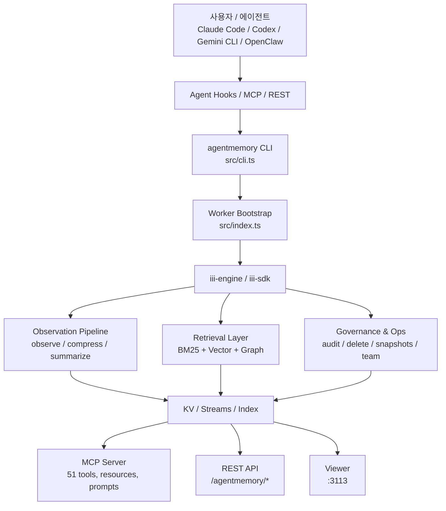
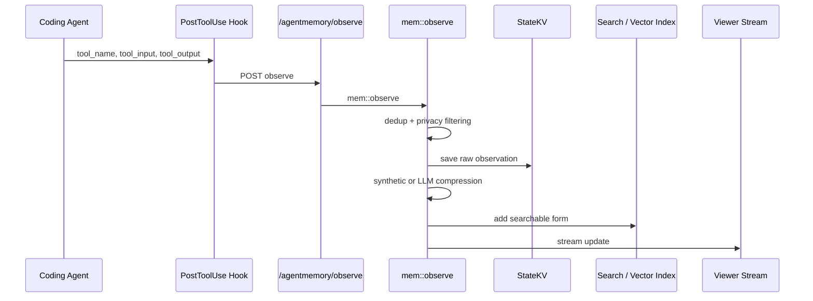

> 분석 일자: 2026-05-13
> 대상 버전: `main` (`package.json` version `0.9.10`)
> 대상 커밋: `292e9f6af1df6eb691c7f8d746c7058e2e740709`
> 저장소: https://github.com/rohitg00/agentmemory
> 로컬 분석 경로: `~/workspace/opensources/agentmemory`

---

_This article is partially written by Codex_

---

## 1. 왜 지금 agentmemory인가

요즘 AI 코딩 에이전트 얘기를 하면 모델 성능보다 **세션을 넘어 기억을 어떻게 유지하느냐**가 더 자주 문제로 나옵니다. Claude Code, Codex CLI, Gemini CLI, OpenClaw 같은 도구를 여러 개 섞어 쓰기 시작하면 상황은 더 뚜렷해집니다.

- 각 도구가 저마다 `CLAUDE.md`, rules 파일, 세션 히스토리, MCP 설정을 따로 가집니다.
- 어떤 결정은 한 에이전트 안에서는 남지만 다른 에이전트로 넘어가면 사라집니다.
- 긴 컨텍스트 창이 커졌다고 해도, 지난달의 결정과 오늘의 작업을 한 번에 안전하게 다루는 것은 여전히 어렵습니다.

`agentmemory`가 주목받는 이유는 이 문제를 **"모델 안에 오래 기억시키자"**가 아니라 **"에이전트 바깥에 별도 메모리 계층을 두자"**는 방향으로 풀기 때문입니다.

이 저장소는 README 첫 줄부터 꽤 공격적으로 자신을 정의합니다. Claude Code, Cursor, Gemini CLI, Codex CLI, OpenClaw 등 어떤 MCP 클라이언트와도 붙는 **persistent memory**라고 말합니다. README 안에는 Trendshift 배지, LongMemEval-S 기반 retrieval 수치, 그리고 여러 에이전트 로고가 전면에 배치되어 있습니다. 즉, 단순한 라이브러리보다 **"요즘 뜨는 에이전트 메모리 제품"**처럼 스스로를 포지셔닝하고 있습니다.

그런데 코드를 보면 단순 마케팅만은 아닙니다. 이 프로젝트는 실제로 다음 세 가지를 묶으려는 시도입니다.

1. 훅을 통해 관측을 자동 수집한다.
2. 검색 가능한 장기 기억으로 압축한다.
3. MCP, REST, Viewer를 통해 여러 에이전트가 그 기억을 같이 쓴다.

이 세 가지가 한 시스템 안에 묶여 있다는 점이 `agentmemory`를 그냥 "RAG 유틸" 이상으로 보이게 만듭니다.

## 2. 프로젝트를 한 문장으로 이해하기

**agentmemory**는 `iii-engine` 위에서 동작하는 **코딩 에이전트용 장기 기억 계층**입니다. 훅으로 관측을 수집하고, 요약과 인덱싱을 거쳐, MCP/REST/Viewer로 여러 에이전트가 함께 쓰도록 만든 구조입니다.

조금 더 풀어 쓰면 아래 질문에 대한 답으로 이해할 수 있습니다.

| 질문                        | agentmemory의 답                                                                                          |
| --------------------------- | --------------------------------------------------------------------------------------------------------- |
| 기억은 어디서 오나요?       | Claude Code 등의 hook 이벤트에서 자동 수집합니다.                                                         |
| 기억은 어떻게 저장하나요?   | raw observation, compressed observation, summary, semantic/procedural memory 등 여러 계층으로 저장합니다. |
| 어떻게 다시 찾나요?         | BM25, vector, graph retrieval을 합친 hybrid search로 찾습니다.                                            |
| 누가 그 기억을 쓰나요?      | Claude Code, Cursor, Codex, Gemini CLI, OpenClaw, Hermes 등 MCP/REST를 말하는 거의 모든 에이전트입니다.   |
| 사람이 상태를 볼 수 있나요? | `:3113` viewer에서 실시간으로 확인할 수 있습니다.                                                         |
| 단순 recall만 하나요?       | 아닙니다. audit, governance delete, snapshot, team share, leases, signals 같은 운영 도구까지 제공합니다.  |

이 프로젝트는 이렇게 요약하는 편이 더 정확합니다.

> "메모리를 LLM 내부에 남기려는 도구"가 아니라, **코딩 에이전트 주변에 외부 기억 운영체제를 하나 더 두는 프로젝트**

## 3. 기술 스택

| 영역         | 기술                                                                |
| ------------ | ------------------------------------------------------------------- |
| 주 언어      | TypeScript (ESM)                                                    |
| 런타임       | Node.js 20+                                                         |
| 패키지       | `@agentmemory/agentmemory`                                          |
| 핵심 엔진    | `iii-sdk`, `iii-engine`                                             |
| LLM Provider | Anthropic, Gemini, OpenRouter, MiniMax, agent-sdk fallback          |
| 임베딩       | 로컬 `all-MiniLM-L6-v2`, Gemini, OpenAI, Voyage, Cohere, OpenRouter |
| 프로토콜     | MCP, REST, WebSocket streams                                        |
| Viewer       | Node HTTP server + static HTML                                      |
| 테스트       | Vitest                                                              |
| 라이선스     | Apache-2.0                                                          |

로컬 체크아웃 기준의 대략적인 규모는 다음과 같습니다.

| 항목                     |  수치 |
| ------------------------ | ----: |
| 추적 파일 수             | 423개 |
| `src/` 아래 파일 수      | 140개 |
| `src/functions/` 모듈 수 |  62개 |
| `src/hooks/` 파일 수     |  13개 |
| 테스트 파일 수           |  84개 |

이 숫자만 봐도 이 저장소는 더 이상 작은 MCP 예제가 아닙니다. 특히 `src/index.ts`, `src/mcp/server.ts`, `src/triggers/api.ts`, `src/functions/*` 조합은 하나의 메모리 플랫폼에 가깝습니다.

## 4. 전체 그림

이 프로젝트의 큰 구조는 아래처럼 볼 수 있습니다.

여기서 눈에 띄는 점은 `agentmemory`가 자기 자신을 단일 인터페이스로 밀지 않는다는 것입니다.

- 에이전트에게는 `hooks`와 `MCP`
- 외부 자동화에는 `REST`
- 사람에게는 `viewer`
- 내부 상태에는 `iii-engine`의 worker/function/stream 모델

즉, "메모리"라는 기능 하나를 위해 입력 채널과 출력 채널을 꽤 넓게 깔아둔 구조입니다.

## 5. 메모리 lifecycle

이 프로젝트의 중심은 `src/functions/observe.ts`와 관련 훅들입니다. 특히 `post-tool-use.ts`를 보면 도구 실행 결과를 REST API로 보내고, `mem::observe`가 그것을 받아 처리합니다.

핵심 흐름은 다음과 같습니다.

구체적으로 보면 `mem::observe`는 다음 순서로 동작합니다.

1. `sessionId`, `hookType`, `timestamp` 같은 필수 필드를 검증합니다.
2. 5분 윈도우 기준의 dedup 해시를 계산해 중복 관측을 버립니다.
3. `stripPrivateData`로 API 키나 민감한 값을 제거합니다.
4. raw observation을 세션별 KV에 저장합니다.
5. 이미지가 있으면 별도 파일로 내리고 참조를 기록합니다.
6. viewer용 stream에도 같은 이벤트를 쏩니다.
7. 세션 메타데이터의 observation count, first prompt 등을 갱신합니다.
8. `AGENTMEMORY_AUTO_COMPRESS=true`면 LLM 압축을, 아니면 synthetic compression을 수행합니다.

여기서 중요한 설계 포인트는 **기본값이 synthetic compression**이라는 점입니다. README 첫인상만 보면 LLM이 다 요약해 주는 것 같지만, 실제 코드와 changelog를 보면 기본값은 훨씬 보수적입니다.

- LLM 압축은 토큰과 비용을 쓴다.
- 훅 단계에서 무분별한 LLM 호출은 Claude Pro 같은 구독형 환경에서 실제 비용으로 이어진다.
- 그래서 기본 경로는 zero-LLM synthetic compression이고, LLM 압축은 opt-in입니다.

이 결정은 제품적으로도 의미가 있습니다. "기억을 잘하는 것"보다 먼저 "기억 시스템이 사용자의 세션을 망치지 않는 것"을 우선한 셈이기 때문입니다.

## 6. 검색 전략: BM25 + Vector + Graph

`agentmemory`의 retrieval은 `src/state/hybrid-search.ts`가 핵심입니다. 이름 그대로 단일 검색기가 아니라 세 가지 신호를 합칩니다.

| 스트림 | 역할                                              |
| ------ | ------------------------------------------------- |
| BM25   | 키워드, 파일명, 개념 기반의 빠른 sparse retrieval |
| Vector | dense embedding 기반 유사도 검색                  |
| Graph  | 엔티티와 관계를 따라가는 graph retrieval          |

이 세 결과는 **RRF(Reciprocal Rank Fusion)** 로 합쳐집니다. 코드상 `RRF_K = 60`이고, 기본 가중치는 BM25 0.4, Vector 0.6, Graph 0.3입니다. 다만 실제 실행 시 벡터나 그래프가 비활성인 경우에는 가중치를 다시 정규화합니다.

중요한 점은 이 검색기가 단순 점수 합산으로 끝나지 않는다는 것입니다.

- query expansion이 들어갑니다.
- graph traversal은 질의 엔티티뿐 아니라 top vector 결과에서 다시 확장합니다.
- 세션 다변화가 들어가서 한 세션에서 최대 3개 결과만 뽑습니다.
- 필요하면 reranker가 마지막 정렬을 다시 합니다.

즉 "메모리 검색"을 단순 vector DB lookup으로 취급하지 않습니다. 검색을 정보 검색 문제로 다루고, 그 위에 에이전트 사용 시나리오를 얹고 있습니다.

README가 강조하는 `95.2% R@5`도 바로 이 hybrid retrieval을 중심으로 한 수치입니다. 다만 `benchmark/LONGMEMEVAL.md`를 보면 이 숫자는 **LongMemEval-S retrieval-only 평가**입니다. 즉, end-to-end QA 정확도가 아니라 **올바른 기억 조각을 top-k 안에 잘 끌어오느냐**를 본 것입니다.

README가 이 caveat를 명시하고 있다는 점은 긍정적입니다.

## 7. 4단계 메모리 통합

README는 이 프로젝트를 working, episodic, semantic, procedural의 4-tier memory로 설명합니다. 이 표현이 단순한 비유는 아닙니다. `src/functions/consolidation-pipeline.ts`를 보면 실제로 그 흐름을 구현하려고 합니다.

| 계층       | 의미                          |
| ---------- | ----------------------------- |
| Working    | raw / compressed observation  |
| Episodic   | session summary               |
| Semantic   | 여러 세션에서 추출된 fact     |
| Procedural | 반복 패턴에서 추출된 workflow |

semantic consolidation은 세션 summary를 모아 fact를 추출하고, procedural consolidation은 반복된 pattern memory에서 절차를 추출합니다. 여기에 decay도 들어갑니다. 코드에서는 `strength`, `lastAccessedAt`, `updatedAt`를 바탕으로 시간이 지나면 점차 약화시키는 방식을 사용합니다.

이 구조가 흥미로운 이유는 agentmemory가 "메모리를 쌓는다"에서 멈추지 않고, **메모리를 다시 가공해서 더 높은 수준의 지식으로 올리려 한다**는 점입니다.

쉽게 말하면:

- 오늘의 tool output은 working memory
- 오늘 세션의 요약은 episodic memory
- 여러 세션을 관통하는 사실은 semantic memory
- 반복해서 나타난 작업 순서는 procedural memory

이 구분은 아직 완전히 매끈한 제품 UX라기보다 연구 지향에 가깝지만, 방향은 분명합니다.

## 8. iii-engine 위에 올라간 worker 아키텍처

이 프로젝트를 더 흥미롭게 만드는 것은 메모리 로직 자체보다, 그것을 `iii-engine` 위에서 운영한다는 점입니다.

`src/index.ts`를 보면 `registerWorker`로 worker를 띄우고, 그 위에 수십 개의 function, trigger, MCP endpoint, viewer server를 등록합니다. 즉, `agentmemory`는 Node 앱이면서 동시에 **iii runtime 위에 조립된 worker bundle**입니다.

이 구조의 장점은 명확합니다.

- 상태를 KV와 stream으로 통일해 다루기 쉽습니다.
- function 단위로 도메인 기능을 잘게 나누기 쉽습니다.
- REST, event, MCP를 하나의 실행 모델에 붙이기 쉽습니다.

하지만 이 의존성은 약점이기도 합니다. `src/cli.ts`에 매우 솔직한 주석이 하나 있습니다. `iii` 최신 버전의 sandbox-everything worker 모델과 agentmemory의 현재 구조가 맞지 않아, 기본 설치는 `iii 0.11.2`에 고정되어 있습니다.

이 부분은 꽤 중요한 시그널입니다.

> agentmemory의 핵심 가치가 메모리 기능에 있다면, 그 가치가 올라타는 하부 엔진(`iii`)의 변화에 얼마나 빨리 적응할 수 있는가도 장기적으로 중요합니다.

즉, 지금은 잘 작동하지만, 아키텍처적으로는 **외부 런타임의 진화 속도에 영향을 받는 프로젝트**라고 볼 수 있습니다.

## 9. MCP, Hooks, Viewer의 삼각형

이 프로젝트에서 제품적으로 가장 중요한 축은 이 삼각형입니다.

1. `Hooks`가 기억을 자동 수집합니다.
2. `MCP`가 에이전트에게 그 기억을 다시 씁니다.
3. `Viewer`가 사람이 그 과정을 볼 수 있게 합니다.

보통 메모리 프로젝트는 이 셋 중 하나만 잘하는 경우가 많습니다.

- capture는 잘하지만 retrieval 인터페이스가 약하거나
- API는 좋은데 실제 자동 수집이 없거나
- 내부적으로는 동작해도 사람 눈에 보이는 관측 화면이 없거나

agentmemory는 세 개를 동시에 잡으려 합니다.

### Hooks

`src/hooks/` 아래에는 `session-start`, `post-tool-use`, `pre-compact`, `subagent-start`, `stop` 등 13개 파일이 있습니다. 특히 `session-start.ts`를 보면 세션 등록은 항상 수행하고, context injection은 기본적으로 꺼 둡니다.

이건 changelog에서 반복해서 등장하는 주제이기도 합니다.

- context injection을 잘못 켜면 실제 토큰이 늘어납니다.
- pre-tool-use에서 enrichment를 과하게 하면 리소스를 낭비합니다.
- SDK child session이 hooks를 상속하면 recursion이 날 수 있습니다.

즉, "hook를 붙인다" 자체보다 **hook의 부작용을 어떻게 제어하느냐**가 더 큰 설계 과제였고, 이 저장소는 그 문제를 실제로 많이 겪은 흔적이 보입니다.

### MCP

README 기준으로 `51 tools, 6 resources, 3 prompts, 4 skills`를 제공합니다. `src/mcp/server.ts`는 사실상 별도의 제품 하나처럼 보일 정도로 큽니다. recall, save, smart search 같은 기본 메모리 도구뿐 아니라 governance delete, snapshots, team share, frontier, leases, routines, signals까지 포함합니다.

이 때문에 agentmemory는 단순 회상 도구보다 **에이전트 운영 툴킷**처럼 보이기도 합니다.

### Viewer

`src/viewer/server.ts`는 `127.0.0.1`에 viewer를 띄우고, 내부 REST API를 프록시합니다. 이 viewer는 그저 디버그 패널이 아니라 세션, 메모리, replay, graph, health를 보여주는 관측 UI입니다.

이 부분은 중요합니다. 기억 시스템은 눈에 보이지 않으면 신뢰하기 어렵습니다. viewer가 있다는 것은 "에이전트가 무엇을 기억했는지 사람이 검사할 수 있다"는 뜻이고, 장기적으로 큰 차이를 만듭니다.

## 10. OpenClaw를 포함한 멀티 에이전트 연동

이 블로그 관점에서는 `integrations/openclaw/`가 특히 반갑습니다.

README와 integration 문서를 보면 OpenClaw에는 두 가지 층위가 있습니다.

1. 그냥 MCP 서버로 붙이는 방식
2. OpenClaw extension으로 붙여 memory slot까지 깊게 연동하는 방식

즉, agentmemory는 OpenClaw를 단순 "호환 대상"으로만 취급하지 않고, 더 깊은 통합 지점을 따로 준비하고 있습니다.

이건 프로젝트의 야심을 잘 보여줍니다.

- Claude Code: hooks + MCP + skills
- OpenClaw: MCP + plugin
- Hermes: MCP + plugin
- Cursor / Gemini CLI / Codex: MCP server

중요한 것은 **모두 같은 memory backend를 공유한다**는 점입니다. 에이전트별로 메모리 파일이 따로 있는 것이 아니라, 하나의 서버를 여러 클라이언트가 공유하는 쪽에 가깝습니다.

이 철학은 분명합니다. 이 프로젝트는 "특정 에이전트의 메모리 확장"보다 **에이전트 공통 메모리 평면(shared memory plane)** 을 만들고 싶어 합니다.

## 11. 테스트와 벤치마크

로컬 체크아웃 기준으로 테스트 파일은 84개입니다. 단순 CRUD 수준이 아니라 다음 영역 전반을 덮고 있습니다.

- context injection
- graph retrieval
- hybrid search
- governance
- viewer security
- retention
- replay
- slots
- team memory
- mcp standalone proxy

또 하나 눈에 띄는 것은 `benchmark/` 디렉터리입니다.

| 파일             | 의미                       |
| ---------------- | -------------------------- |
| `LONGMEMEVAL.md` | retrieval-only recall 평가 |
| `QUALITY.md`     | 품질 평가                  |
| `SCALE.md`       | 규모 확장 평가             |
| `COMPARISON.md`  | 경쟁 도구 비교             |

이 프로젝트는 벤치마크를 README 장식으로만 쓰지 않고, 방법론과 caveat를 같이 남기려 합니다. 특히 `COMPARISON.md`에서 LoCoMo와 LongMemEval이 같은 벤치마크가 아니라는 점을 분리해 적어 둔 부분은 평가할 만합니다.

다만 이 글에서는 해당 벤치마크를 직접 재실행하지 않았습니다. 따라서 수치 자체를 맹신하기보다는, **"이 프로젝트는 벤치마크를 코드와 문서로 함께 내놓는다"** 정도로 읽는 것이 더 적절합니다.

## 12. 인상적인 설계 포인트

### 12.1 기본값을 보수적으로 돌린다

auto-compress, context injection, agent-sdk fallback 등은 모두 토큰과 안정성 문제를 일으킬 수 있습니다. 코드와 changelog를 보면 이 프로젝트는 시간이 갈수록 기본값을 더 보수적으로 바꾸고 있습니다. 오히려 이 점이 신뢰를 높입니다.

### 12.2 기억의 provenance를 끝까지 남기려 한다

audit trail, source observation ids, governance delete, replay, verify 류 기능이 많은 것은 우연이 아닙니다. 단순히 "찾았다"가 아니라 "왜 이 기억이 생겼는가"를 추적하려는 의도가 분명합니다.

### 12.3 메모리 시스템을 운영 시스템으로 확장한다

leases, routines, signals, checkpoints, snapshots, team share 같은 기능은 원래 메모리 제품에서 당연한 범위는 아닙니다. 이쯤 되면 기억 저장소를 넘어 **에이전트 협업 운영 계층**으로 확장하려는 것으로 보입니다.

### 12.4 인간이 검증할 수 있게 만든다

viewer, replay, status, doctor 명령은 이 프로젝트가 "자동화만 믿어라"가 아니라 "자동화를 사람이 볼 수 있게 하자"는 방향이라는 것을 보여줍니다.

## 13. 주의해서 볼 지점

좋은 점과 별개로 몇 가지는 분명히 주의해서 봐야 합니다.

### 13.1 범위가 빠르게 커지고 있다

처음에는 memory engine으로 보이지만, 지금은 hooks, MCP, REST, viewer, graph, team, governance, replay, snapshots, mesh, filesystem watcher까지 들어와 있습니다. 이런 프로젝트는 좋게 보면 확장성이지만, 나쁘게 보면 제품의 중심이 흐려질 위험도 있습니다.

### 13.2 iii-engine 의존성은 장점이자 리스크다

worker/function/stream 모델 덕분에 구조는 예쁘지만, 하부 엔진 변화와 충돌하면 설치 경험이 흔들릴 수 있습니다. 실제로 `cli.ts`에는 `iii` 버전 pinning 이유가 아주 구체적으로 적혀 있습니다.

또 하나는 상주 프로세스 비용입니다. agentmemory는 Claude Code나 OpenClaw 안에 얇게 삽입되는 라이브러리라기보다, 보통 별도 터미널에서 병렬로 띄워 두는 메모리 서버에 가깝습니다. health threshold가 RSS `512MB`를 기준선으로 두고 있고, 대규모 벤치마크에서는 heap `316MB` 사례도 보입니다. 그래서 로컬 운영 관점에서는 **메모리 budget을 약 500MB 정도로 보는 편이 안전합니다.**

### 13.3 벤치마크 수치는 읽는 방식이 중요하다

`95.2% R@5`는 인상적인 숫자이지만, retrieval-only 평가입니다. 이 수치를 곧바로 "실제 에이전트가 더 똑똑하다"로 번역하면 과장입니다. 메모리 시스템의 품질은 retrieval 다음 단계인 answer synthesis, wrong recall, stale memory handling까지 봐야 합니다.

### 13.4 훅 기반 시스템은 부작용을 항상 동반한다

이 저장소의 changelog는 거의 역대 문제집처럼 읽힙니다.

- Stop hook recursion
- viewer XSS
- context injection 토큰 낭비
- standalone MCP와 full server 상태 불일치
- import 이후 viewer 빈 화

  면

이건 나쁜 신호라기보다, 이 프로젝트가 **실제로 거친 환경에서 쓰이며 부딪히고 있다는 흔적**에 가깝습니다. 동시에 복잡성의 대가이기도 합니다.

## 14. 결론

`agentmemory`는 "에이전트가 전 세션을 기억하게 해준다"는 한 줄 설명보다 훨씬 큰 프로젝트입니다. 실제로는 hook 기반 관측, hybrid retrieval, 계층형 메모리 통합, MCP/REST 인터페이스, viewer 관측성, governance와 audit까지 묶은 **에이전트용 메모리 플랫폼**에 가깝습니다.

왜 지금 뜨는지도 이해할 수 있습니다. 코딩 에이전트가 많아질수록 모델 그 자체보다 **세션 사이의 기억, 에이전트 사이의 기억, 사람이 검증할 수 있는 기억**이 더 중요해지기 때문입니다.

이 프로젝트의 핵심 질문은 이것입니다.

> "장기 기억을 LLM 안에 남길 것인가, 아니면 LLM 바깥에 운영 가능한 계층으로 둘 것인가?"

agentmemory는 두 번째 방향을 강하게 밀고 있습니다. 그리고 지금 커뮤니티가 그 방향에 반응하는 것도 꽤 자연스러워 보입니다.
