> Analyzed: 2026-05-13
> Version: `0.13.0` / `v2026.5.7-476-gdd0923bb8`
> Commit: `dd0923bb89ed2dd56f82cb63656a1323f6f42e6f`
> Repository: https://github.com/NousResearch/hermes-agent
> Local path: `~/workspace/opensources/hermes-agent`
>
> Update (2026-06-01): The main body covers `0.13.0`, but the major changes introduced in `0.14.0` (v2026.5.16), `0.15.0` (v2026.5.28), and `0.15.1` (v2026.5.29) are summarized in [18. Appendix: Changes from 0.13 to 0.15](#18-appendix-changes-from-013-to-015).

---

_This article is partially written by Codex_

---

## First: How Is This Different from OpenClaw?

When you first encounter Hermes, it's natural to wonder: "Isn't this just [OpenClaw](/kb/2026-03-11-openclaw-architecture) but in the style of Claude Code?" Both run persistently on a user's machine or server, receive messages from multiple channels, and hand tools to an LLM to perform real tasks.

That said, their core emphasis differs.

| Perspective       | OpenClaw                                                          | Hermes Agent                                                                |
| ----------------- | ----------------------------------------------------------------- | --------------------------------------------------------------------------- |
| Overall feel      | Personal AI assistant operating system                            | Python-based agent runtime + research/experimentation platform              |
| Implementation    | TypeScript / Node-centric                                         | Python-centric                                                              |
| Product focus     | Gateway, channels, apps, device nodes, personal assistant         | `AIAgent`, tool registry, provider transport, skills, RL environment        |
| Claude Code vibe  | Delegates to an external coding agent or steers via channel       | Hermes itself contains a Claude Code-style tool-calling loop                |
| Skills            | Strong community skill ecosystem with clear tool/skill separation | Agent reads, creates, and edits skills — closer to a self-improvement loop  |
| Research emphasis | Heavier on product/operations                                     | Large research surface: Atropos environment, trajectories, tool-call parser |

In one sentence:

> If OpenClaw is closer to "a personal AI assistant that lives across multiple channels and devices," then Hermes is closer to "an agent platform that extends a Claude Code-style task loop with a Python runtime, memory, skills, plugins, and a research environment."

If you already know OpenClaw, Hermes clicks much faster. Rather than treating Hermes as a clone, it's more accurate to see it as **a project that solves the same problem through a Python agent runtime and a research-friendly architecture**.

---

## 1. Understanding the Project in One Sentence

**Hermes Agent** is a **runnable AI agent platform** that executes the same AI agent core across terminal, messenger, editor, and server environments — allowing that agent to use tools, store memories, create skills, and delegate work to sub-agents.

Thinking of it as "just ChatGPT in a terminal" undersells it considerably. This project is better understood as an attempt to bundle the following into a single coherent whole:

| Question                               | Hermes's answer                                                                                                                    |
| -------------------------------------- | ---------------------------------------------------------------------------------------------------------------------------------- |
| Where can I have conversations?        | CLI, Telegram, Discord, Slack, WhatsApp, Signal, Email, ACP editor integration, and more                                           |
| Which models does it support?          | Nous Portal, OpenRouter, OpenAI, Anthropic, Bedrock, Gemini, Hugging Face, local/custom endpoints, and more                        |
| What can it actually do?               | Terminal execution, file editing, web search, browser automation, images/voice, MCP, cron, message sending, kanban tasks, and more |
| How does it handle long conversations? | Context compression, session DB, memory, and session search                                                                        |
| How does it handle complex tasks?      | Spins up sub-agents with independent contexts via `delegate_task`                                                                  |
| Does it retain what it learns?         | Via `MEMORY.md`, `USER.md`, the skill system, and external memory plugins                                                          |

Personally, I found this framing helpful:

> Not "a chatbot on my laptop," but **a system that routes requests arriving through multiple entry points into a single agent runtime, which then connects tools, memory, and external channels**.

---

## 2. Technology Stack

| Area                 | Technology                                                                        |
| -------------------- | --------------------------------------------------------------------------------- |
| Primary language     | Python 3.11+                                                                      |
| Package management   | `uv`, `setuptools`                                                                |
| CLI                  | `prompt_toolkit`, `rich`, `fire`                                                  |
| Configuration        | YAML, `.env`, profile-based `HERMES_HOME`                                         |
| LLM API              | OpenAI-compatible Chat Completions, Anthropic, Bedrock, Codex Responses, etc.     |
| Data storage         | SQLite session DB, file-based memory, JSON/YAML config                            |
| Tool system          | Custom `tools.registry` + JSON Schema function calling                            |
| Messenger gateway    | Telegram, Discord, Slack, WhatsApp, Signal, Matrix, Email, etc. (adapter pattern) |
| Plugins              | `plugin.yaml` + `register(ctx)`-based plugin system                               |
| Editor integration   | ACP, MCP                                                                          |
| Research environment | Atropos RL environment, tool-call parser, trajectory generation                   |
| Testing              | `pytest`, `pytest-xdist`, `pytest-asyncio`, `ruff`, `ty`                          |

Based on a local checkout, the approximate size of the codebase is:

| Item                                      | Count |
| ----------------------------------------- | ----: |
| Total tracked files                       | 3,252 |
| Python files                              | 1,598 |
| Total test files                          | 1,061 |
| `test_*.py` files                         | 1,026 |
| `SKILL.md` files under `skills/`          |    87 |
| `SKILL.md` files under `optional-skills/` |    79 |

By size alone, this is no longer a small side project. In particular, `run_agent.py`, `cli.py`, and `gateway/run.py` are "large core files." That said, tools, memory, providers, platforms, and plugins each live in their own directories, so once you have the big picture, the code is surprisingly readable.

---

## 3. The Big Picture

The overall architecture of Hermes looks like this:

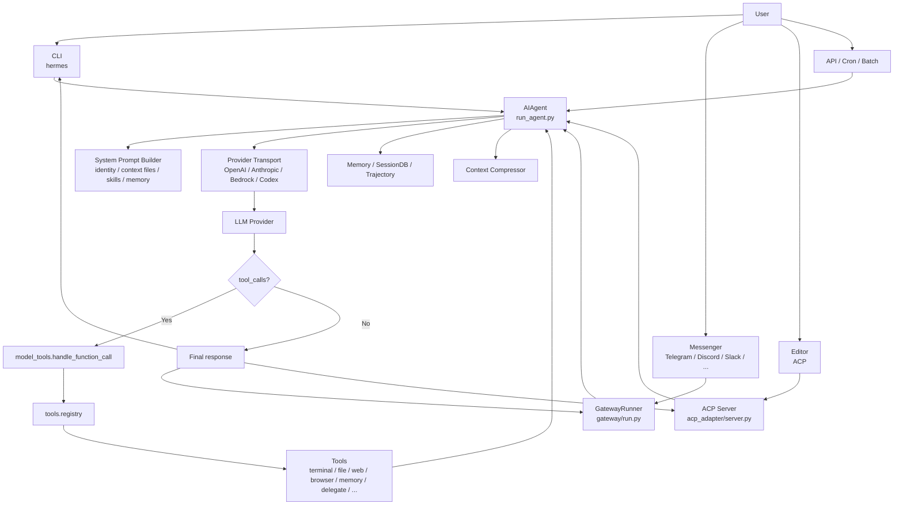

At the center is `AIAgent`. Whether the entry point is the CLI, Telegram, or ACP, all user messages ultimately flow into `AIAgent.run_conversation()`. `AIAgent` builds the system prompt, sends messages and tool schemas to the model, executes any tool calls the model makes, and feeds the results back.

In simplified terms, Hermes's core loop looks like this:

```text
User message
  -> Compose system prompt + conversation history + tool schemas
  -> Call LLM
  -> If tool_calls present, execute tools
  -> Append tool results to conversation
  -> Call LLM again
  -> If no tool_calls, return final answer
```

Wrapped around this simple loop is a dense set of mechanisms: context compression, prompt caching, session persistence, dangerous-command approval, sub-agents, memory sync, plugin hooks, streaming, and messenger delivery.

---

## 4. Directory Structure

Here is the core structure, condensed for understanding:

```text
hermes-agent/
├── hermes_cli/
│   ├── main.py                 # Main entry point for the `hermes` command
│   ├── commands.py             # Single registry for slash commands
│   ├── plugins.py              # Plugin discovery/loading/hook execution
│   ├── config.py               # config.yaml load/save
│   └── web_server.py           # Dashboard/API server
│
├── cli.py                      # Classic interactive CLI
├── run_agent.py                # AIAgent, main tool-calling loop
├── model_tools.py              # Provides tool schemas + dispatches tool calls
├── toolsets.py                 # Defines toolset groupings
├── hermes_state.py             # SQLite session DB
│
├── tools/
│   ├── registry.py             # Central registry for all tools
│   ├── terminal_tool.py        # Terminal execution
│   ├── file_tools.py           # read/write/patch/search
│   ├── web_tools.py            # web_search / web_extract
│   ├── browser_tool.py         # Browser automation
│   ├── delegate_tool.py        # Sub-agent execution
│   ├── memory_tool.py          # MEMORY.md / USER.md
│   ├── skills_tool.py          # Skill listing/viewing
│   ├── skill_manager_tool.py   # Skill creation/editing
│   ├── cronjob_tools.py        # Scheduled tasks
│   ├── mcp_tool.py             # MCP tool integration
│   └── environments/           # local/docker/ssh/modal/daytona/vercel/singularity
│
├── agent/
│   ├── context_compressor.py   # Compresses old conversation turns
│   ├── prompt_builder.py       # Builds the system prompt
│   ├── memory_manager.py       # External memory provider orchestration
│   ├── model_metadata.py       # Context length, token estimation
│   ├── transports/             # Per-provider message transformation/response normalization
│   └── ...
│
├── gateway/
│   ├── run.py                  # Runs the messenger gateway
│   ├── session.py              # Per-platform session/context
│   ├── platform_registry.py    # Platform adapter registry
│   └── platforms/              # telegram, discord, slack, whatsapp, ...
│
├── acp_adapter/
│   ├── server.py               # Agent Client Protocol server
│   ├── session.py              # Maps ACP sessions to AIAgent instances
│   └── permissions.py          # Editor permission bridge
│
├── providers/
│   ├── base.py                 # ProviderProfile
│   └── __init__.py             # Provider plugin discovery
│
├── plugins/
│   ├── model-providers/        # nous, openrouter, anthropic, bedrock, ...
│   ├── memory/                 # honcho, mem0, supermemory, ...
│   ├── image_gen/              # Image provider
│   ├── platforms/              # Plugin platform adapters
│   ├── context_engine/
│   ├── kanban/
│   └── hermes-achievements/
│
├── skills/                     # Default skill bundle
├── optional-skills/            # Optional skill bundle
├── environments/               # Atropos RL / benchmark environments
├── tests/                      # pytest tests
└── RELEASE_v0.13.0.md          # v2026.5.7 release notes
```

If you had to pick just five files, here they are:

| File                | Role                                                                                           |
| ------------------- | ---------------------------------------------------------------------------------------------- |
| `run_agent.py`      | The hub of the conversation loop, model calls, tool calls, compression, memory, and interrupts |
| `model_tools.py`    | Builds tool schemas for the model and dispatches actual tool calls                             |
| `tools/registry.py` | The central registry where tools register themselves                                           |
| `cli.py`            | Handles the terminal UI, slash commands, interrupts, streaming, TTS, and more                  |
| `gateway/run.py`    | Connects messages arriving from external channels like Telegram/Discord/Slack to AIAgent       |

---

## 5. Core Execution Flow

Suppose a user types "analyze this repository" in the CLI. Here is the rough internal flow:

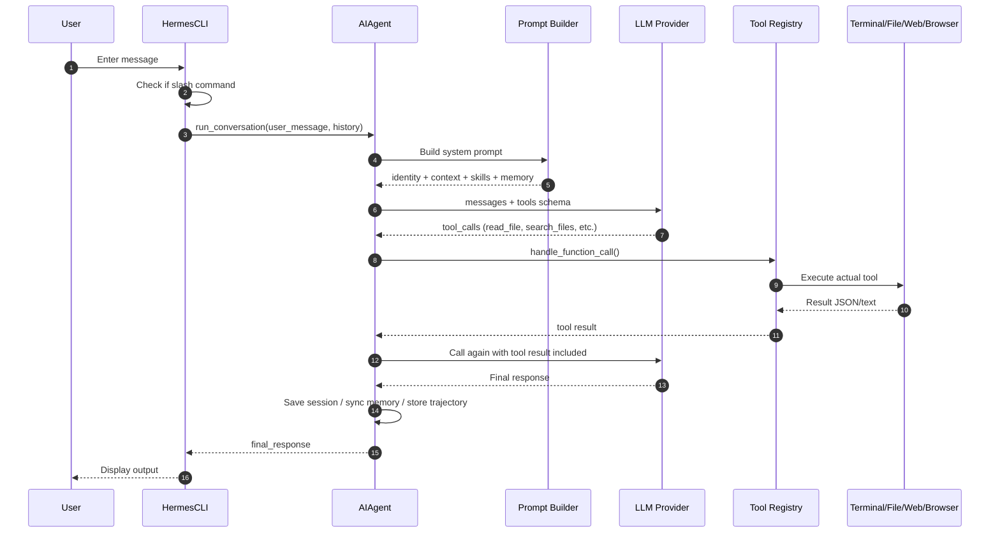

The key thing to notice here is that **tool calls are real system executions, not just words the model says**. The model emits a structured JSON saying it wants to call `read_file`. Hermes validates the name and arguments, looks up the handler in the registry, executes it, and feeds the result back to the model.

When reading Hermes, then, it's more useful to ask "What tool surface does the model see? How is a tool call validated? What context does the result carry back to the model?" than "Is the prompt elegant?"

---

## 6. AIAgent: The Heart of Hermes

`AIAgent` in `run_agent.py` is the center of the project. Its constructor accepts a large number of arguments — the model, provider, API mode, toolsets, callbacks, session ID, platform info, memory settings, context compressor, credential pool, checkpoint settings, and nearly every other piece of runtime state flows through here.

The execution loop, simplified, looks like this:

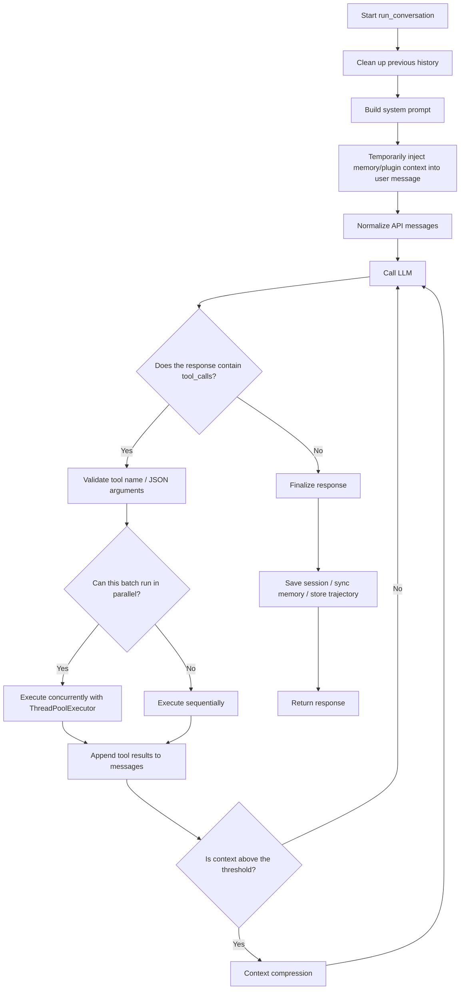

The actual code handles far more real-world edge cases. For example:

- If the model hallucinates a non-existent tool name, Hermes auto-corrects it or returns an error to prompt self-correction.
- If the tool argument JSON is malformed, it retries up to a fixed number of times; if still broken, it injects a `"JSON was invalid"` tool result back to the model.
- If the context grows too long, it compresses and retries.
- If the provider returns a 413, 429, context overflow, or long-context-tier error, it classifies the error and tries retry / compression / credential fallback.
- If the user sends a new message mid-run, `interrupt()` propagates to the parent agent, any running tools, and sub-agents.
- If the model emits a "final answer + housekeeping tool call like saving memory" simultaneously, and the follow-up response is empty, Hermes still preserves the earlier content as the final response.

These edge cases are why `run_agent.py` is long, but the intent is clear:

> Models frequently produce oddly-shaped responses. Hermes does not take them at face value — it recovers where possible, and where it cannot, it inserts a safe tool result so the conversation doesn't break.

---

## 7. The Tool System

Hermes's tool architecture follows a **self-registering registry** pattern. Each tool file calls `registry.register()` when imported, and `model_tools.py` queries this registry to build the JSON Schema list that gets sent to the model.

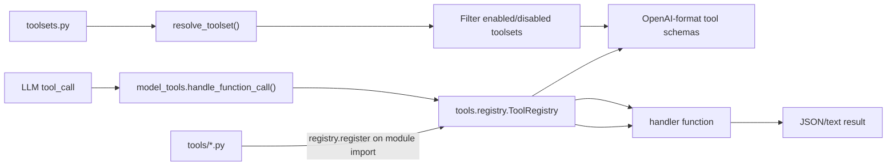

`toolsets.py` defines groups of tools:

| Toolset      | Example tools                                                 | What it does                           |
| ------------ | ------------------------------------------------------------- | -------------------------------------- |
| `file`       | `read_file`, `write_file`, `patch`, `search_files`            | Reading and editing code               |
| `terminal`   | `terminal`, `process`                                         | Command execution / process management |
| `web`        | `web_search`, `web_extract`                                   | Search and page extraction             |
| `browser`    | `browser_navigate`, `browser_click`, `browser_snapshot`, etc. | Browser automation                     |
| `skills`     | `skills_list`, `skill_view`, `skill_manage`                   | Reading/creating/managing skills       |
| `memory`     | `memory`                                                      | Managing `MEMORY.md` and `USER.md`     |
| `delegation` | `delegate_task`                                               | Spawning sub-agents                    |
| `cronjob`    | `cronjob`                                                     | Scheduled tasks                        |
| `messaging`  | `send_message`                                                | Sending messages to other platforms    |
| `rl`         | `rl_start_training`, `rl_check_status`, etc.                  | Research/training environment          |

What's interesting is that the "tool list" is not simply a static array:

- Default tools are registered by `tools/*.py`.
- MCP tools can be registered dynamically at runtime.
- Plugins can add tools via `ctx.register_tool()`.
- Memory providers and context engines can inject their own tool schemas.
- Tools like `delegate_task` dynamically update their description to reflect current configuration.

In short, the tool surface the model sees is the result of "installed capabilities + config + platform + plugins + current session state."

---

## 8. CLI, Gateway, and ACP — What's the Difference?

Hermes has multiple entry points. They differ only at the surface — under the hood, all of them call the same `AIAgent`.

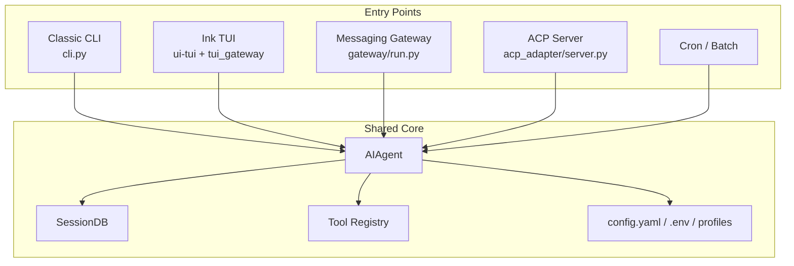

### CLI

`cli.py` is the interactive terminal interface. It uses `prompt_toolkit` to manage the input area, history, slash command autocomplete, and interrupt handling. When a user enters a message, it runs `AIAgent.run_conversation()` on a separate thread while the main thread watches for input and interrupts.

Key characteristics of the CLI:

- A rich set of commands: `/model`, `/tools`, `/skills`, `/compress`, `/background`, `/busy`, `/steer`, and more.
- Handles dangerous-command approval UI directly in the terminal.
- Many UX features: streaming, reasoning display, TTS, voice mode.
- Supports foreground conversations and background tasks concurrently.

### Gateway

`gateway/run.py` is the layer that connects Hermes to messengers. Platform adapters for Telegram, Discord, Slack, WhatsApp, Signal, and others normalize incoming messages into `MessageEvent` objects. The gateway then finds or creates a session and runs `AIAgent`.

The gateway's essential job is **turning a conversation channel into a session**:

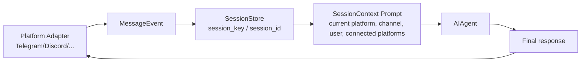

The gateway handles far more real-world concerns than the CLI:

- If the agent is already working in the same chat, new messages are handled as interrupt/queue/steer.
- It absorbs per-platform differences in message length limits, threading, reply, edit, and draft streaming.
- Dangerous-command approvals are sent as chat messages or buttons.
- On gateway restart, sessions are restored and any unfinished tool results are surfaced for re-processing.
- `send_message` and cron delivery reuse the platform adapters.

### ACP

`acp_adapter/` is a server that lets editors like VS Code, Zed, and JetBrains use Hermes via the Agent Client Protocol. Each ACP session gets its own `AIAgent`, and file/image resources sent from the editor are converted into content parts the model can read.

Key points of ACP:

- Maps editor sessions to Hermes sessions.
- Aligns the working directory and the terminal tool's `cwd` per session.
- Routes permission requests to the ACP client's permission UI.
- Persists sessions in SQLite so they survive editor reconnections.

---

## 9. Skills, Memory, and Context Compression

The skill and memory architecture is central to Hermes's claim of being a "self-improving agent."

### Skills

Skills are procedural documents in `SKILL.md` format. Hermes can read from `skills/`, `optional-skills/`, the user's `~/.hermes/skills/`, and external skill directories. The model can find, read, and create skills via the `skills_list`, `skill_view`, and `skill_manage` tools.

Skills are just documents, but from the agent's perspective they are **procedural memory** — instructions like "when doing this type of task, follow this sequence" stored as files and retrieved on demand.

This connects to [Superpowers](/kb/2026-04-18-superpowers-architecture) as well. If Superpowers is "a skill bundle that enforces a procedure to stop the agent from acting hastily," then Hermes's skill system is more about finding, reading, and managing that procedural memory within the Hermes runtime itself.

### Memory

The default memory is file-based:

```text
~/.hermes/
├── config.yaml
├── .env
├── state.db
├── logs/
├── skills/
├── plugins/
└── memories/
    ├── MEMORY.md
    └── USER.md
```

`MEMORY.md` stores what the agent has learned about the environment, projects, and work habits. `USER.md` stores user preferences and communication style. These files are snapshotted into the system prompt at session start. Even if the memory tool modifies these files mid-session, the current session's system prompt remains unchanged — this preserves the prefix cache.

External memory providers are also available. `plugins/memory/` contains providers like Honcho, Mem0, and Supermemory, and `agent/memory_manager.py` selects one provider and wires up prefetch, sync, and tool schema injection.

This shares the same concern as external long-term memory projects like agentmemory. Where Hermes provides file-based memory and a provider hook out of the box, dedicated long-term memory projects push harder on a shared memory plane for multiple agents.

### Context Compression

Long conversations are managed by `agent/context_compressor.py`. By default, when the conversation reaches a certain fraction of the model's context length, it summarizes older middle turns while protecting the head and the most recent tail.

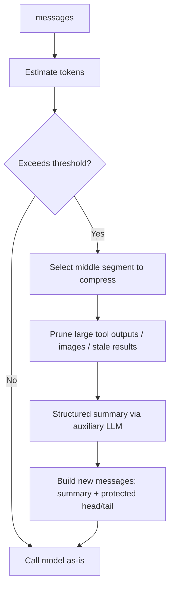

The summary is not a generic "here's what we talked about" — it's designed to preserve as much structured information as possible: active tasks, completed actions, unresolved questions, file paths, and command outputs. A strong warning is prepended to the summary stating that it is a reference handoff, not a new instruction. This reduces the risk of the model misreading the summary as a directive.

### Will it work reliably if I use a cheap LLM API to save costs?

The short answer is: **it will run, but "Hermes-quality stability" is strongly tied to model quality.**

Hermes can connect to multiple providers and can even use a separate auxiliary model for context compression — it doesn't demand a single expensive model. The comments in `agent/context_compressor.py` explicitly mention using a cheap/fast auxiliary model for summarization.

However, what Hermes asks of a model is far more demanding than ordinary chat. The model doesn't just need to give good answers — it needs to select the correct tool name, keep JSON arguments intact, maintain state across a long task, read back compressed summaries coherently, and distinguish dangerous from safe commands. If a cheap model stumbles on any of these regularly, the whole agent becomes unreliable.

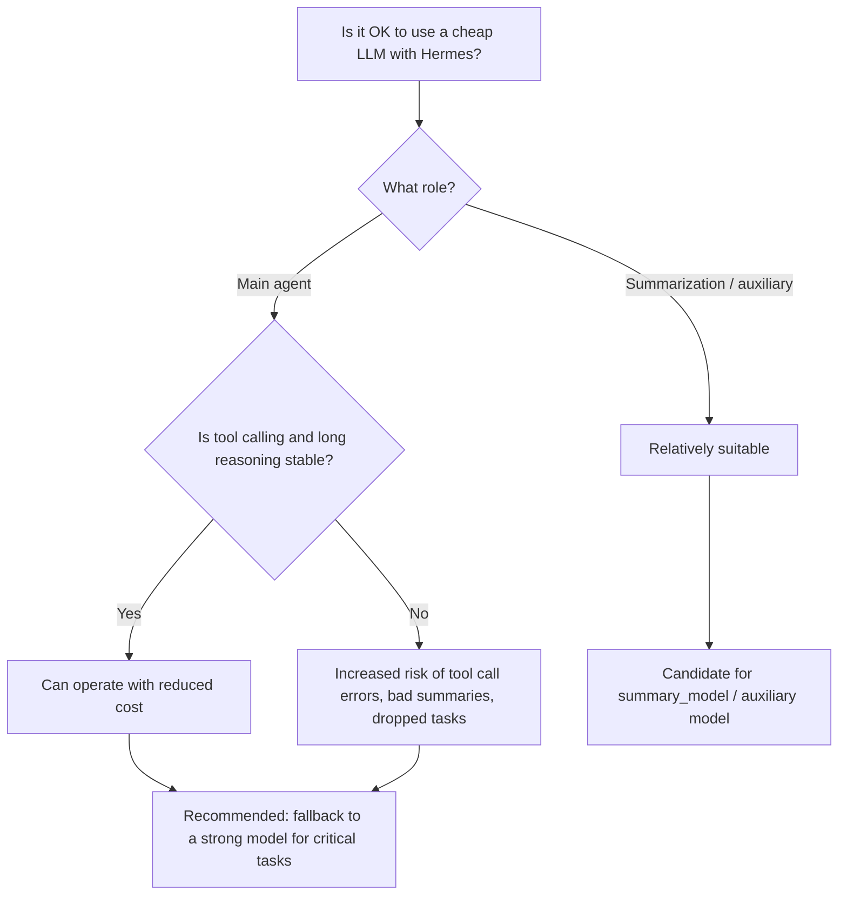

Here is my recommended operational approach:

| Use case                            | Recommended model choice                                                                |
| ----------------------------------- | --------------------------------------------------------------------------------------- |
| Main agent loop                     | A model proven on tool calling, JSON schema adherence, and long context                 |
| Context compression / summarization | A low-cost auxiliary model is viable, but fall back to main if summary quality degrades |
| Sub-agent research                  | Cheap models are viable for independent, low-stakes investigation tasks                 |
| File editing / terminal commands    | High failure cost — a strong model is recommended                                       |
| Long sessions / complex debugging   | A model that can reliably read and maintain compressed summaries                        |

Hermes itself acknowledges this reality to some degree. There is a fallback to the main model when the summary model fails, an anti-thrashing guard that stops compressing if the context doesn't shrink, and a flow that compresses and retries on provider context errors.

The bottom line is:

> Hermes lets you use cheaper models, but cheaper models won't compensate for weak tool calling and weak long-horizon reasoning.

If you want to reduce costs, **keeping a strong model in the main driver's seat and routing summarization, classification, and independent research to cheaper models** is safer than running everything on a budget model.

---

## 10. Sub-Agents and Parallel Work

`delegate_task` is one of Hermes's most important tools. It lets the parent agent say "go investigate this part in a separate context and report back."

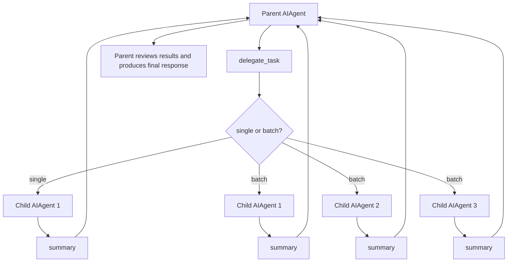

The key design decisions:

| Design                       | Description                                                                                            |
| ---------------------------- | ------------------------------------------------------------------------------------------------------ |
| Independent context          | Sub-agents do not see the parent's full conversation. Required information must be passed in `context` |
| Independent terminal session | Each sub-agent has its own task ID and isolated working state                                          |
| Batch parallel execution     | Multiple tasks can run concurrently via ThreadPoolExecutor                                             |
| Depth limit                  | Nested delegation is bounded by `max_spawn_depth`                                                      |
| Role distinction             | `leaf` agents cannot delegate further; `orchestrator` agents can re-delegate within their limit        |
| Self-report caveat           | Sub-agent results are reports — the parent must verify them                                            |

This pattern is well-suited to "parallel research to save tokens." For example, rather than having the parent agent read every file in a large repository directly, it can hand off independent sub-questions to sub-agents and receive only summaries.

That said, the tool's own documentation gives an explicit warning: a sub-agent saying "I succeeded" is not proof of success. Side effects like file creation, external uploads, and HTTP requests must be independently confirmed by the parent.

---

## 11. Plugins and Model Providers

Hermes has a broad plugin surface:

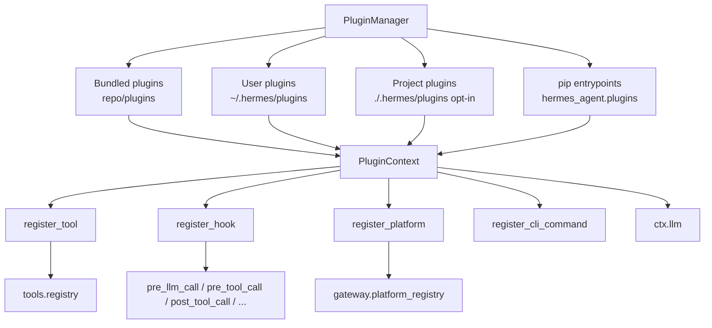

Plugins can:

- Add tools.
- Register lifecycle hooks.
- Register gateway platform adapters.
- Add CLI commands.
- Use the user's model and credentials via `ctx.llm`, a host-owned LLM facade.

One particularly notable aspect of the v0.13.0 release is that **model providers are also pluginized**. `ProviderProfile` in `providers/base.py` declaratively captures a provider's endpoint, auth, model list, and request-time quirks. Directories like `plugins/model-providers/nous/` register provider profiles.

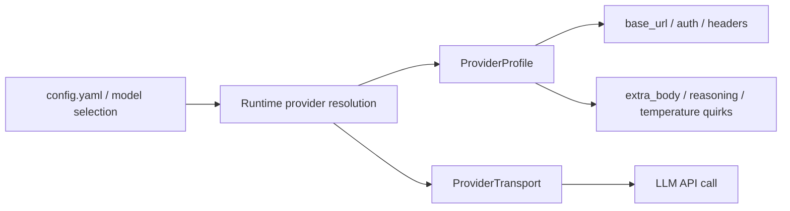

This approach avoids the problem of "having to keep adding if-statements to core code every time a new provider is supported." Per-provider quirks are handled by the profile and transport, and `AIAgent` stays on a shared common path as much as possible.

---

## 12. Research Environment and Data Generation

Hermes contains not just end-user features but also research-oriented code. The `environments/` directory hooks into the Atropos RL environment.

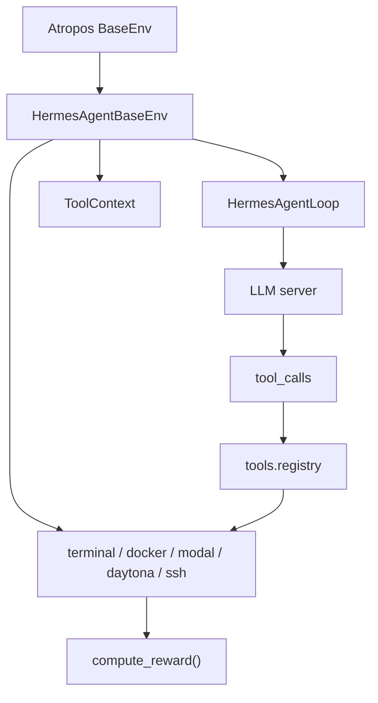

This area isn't something most users will touch directly, but it reveals the project's philosophy:

- The same Hermes tools are used identically inside RL rollouts.
- The model makes tool calls, the environment records results, and the reward function validates the same sandbox state.
- Per-model parsers are provided for cases like VLLM Phase 2, where tool calls must be parsed from raw text.

In short, Hermes is designed to serve not only as an application but also as **an experimental apparatus for training and evaluating tool-using agents**.

---

## 13. Testing and Quality

The test suite is substantial. Based on a local checkout, there are over 1,000 test files under `tests/`.

Key test areas:

| Area         | Examples                                                              |
| ------------ | --------------------------------------------------------------------- |
| Agent loop   | Context compression, provider fallback, tool call recovery, interrupt |
| Tools        | Terminal, file, browser, MCP, TTS, image generation, delegate, cron   |
| Gateway      | Session, platform adapter, interrupt, streaming, auth                 |
| ACP          | Session manager, permissions, protocol event                          |
| Plugins      | Memory provider, image provider, observability                        |
| Environments | Docker, SSH, modal, local, file sync                                  |
| Security     | Secret redaction, path traversal, SSRF, dangerous command approval    |

The standard way to run tests is `scripts/run_tests.sh`. This script:

- Searches for a venv in `.venv`, `venv`, and `~/.hermes/hermes-agent/venv`, in that order.
- Clears environment variables that look like credentials.
- Pins `TZ=UTC`, `LANG=C.UTF-8`, and `PYTHONHASHSEED=0`.
- Sets the `pytest-xdist` worker count to 4.
- Excludes integration/e2e tests by default.

CI runs a similar combination of `uv`, Python 3.11, and `pytest -n auto`. Having a hermetic test runner like this matters in a large agent project — AI agents are especially prone to test contamination from environment variables, real API keys, local daemons, and browser state.

---

## 14. Recommended Reading Order

Starting with all of `run_agent.py` from line one will exhaust you quickly. Here is the order I recommend.

### Step 1: README and AGENTS

- `README.md`: See what the project is trying to do.
- `AGENTS.md`: See which files the developers themselves consider important.

`AGENTS.md` is particularly useful. It's a guide for internal developers and will tell you "which entry points are load-bearing."

### Step 2: The Tool Surface

- `toolsets.py`
- `tools/registry.py`
- `model_tools.py`

After this, you'll understand what tools the model sees and how a tool call translates into an actual function invocation.

### Step 3: The AIAgent Loop

- `class AIAgent` in `run_agent.py`
- `run_conversation()`
- `_execute_tool_calls()`
- `_execute_tool_calls_concurrent()`
- `_execute_tool_calls_sequential()`

At this step, focus on the flow rather than the fine-grained error handling.

### Step 4: Per-Entry-Point Adapters

- CLI: `cli.py`, `hermes_cli/commands.py`
- Gateway: `gateway/run.py`, `gateway/session.py`, `gateway/platforms/base.py`
- ACP: `acp_adapter/server.py`, `acp_adapter/session.py`

Here, just trace "how does a user message reach `AIAgent`?"

### Step 5: Long-Term Memory and Extensibility

- `tools/memory_tool.py`
- `agent/memory_manager.py`
- `agent/context_compressor.py`
- `agent/skill_utils.py`
- `hermes_cli/plugins.py`
- `providers/base.py`

Reading this section gives you an intuition for why Hermes uses the word "self-improving."

---

## 15. Impressive Design Choices

### 15.1 The Same Agent Core Is Wired to Multiple Surfaces

The CLI, messengers, ACP, and cron look like completely separate applications, but they all share the same `AIAgent` core. This means tools, memory, compression, and provider fallback all work consistently across every entry point.

### 15.2 The Tool Registry Is Relatively Clean

Each tool registers its own schema and handler. `model_tools.py` goes through the registry for schema provision and dispatch. This matters more as the number of tools grows. If every tool schema and handler had to be added manually to a single central file, the complexity would balloon much faster.

### 15.3 There Is a Lot of Pragmatic Recovery Code

Models frequently produce invalid tool names, malformed JSON, empty responses, or trigger provider context errors. Hermes treats all of these not as impossible scenarios but as normal operating conditions.

### 15.4 Prompt Caching Is a First-Class Concern

The system prompt is divided into stable/context/volatile tiers, and memory provider context is injected temporarily into the user message rather than the system prompt. Placing frequently-changing content early in the system prompt breaks cache hits, so this structure is deliberate.

### 15.5 There Is Deep Messenger Product Detail

The gateway code is far more than "receive message / send message." Evidence of real long-term operation is visible throughout: message length limits, thread routing, typing indicators, approval UX, streaming edit, restart resume, busy session handling, and pending interrupt handling.

### 15.6 Research and Product Share the Same Tool Layer

The RL environment in `environments/` uses the same Hermes tool registry. The tools used in production and the tools used in research rollouts do not diverge — this is an interesting design choice.

---

## 16. Points to Watch Out For

### 16.1 Several Files Are Very Large

`run_agent.py`, `cli.py`, and `gateway/run.py` are enormous. Many edge cases are co-located in a single file, which is intimidating for first-time readers. The reason for the complexity, however, is clear — each of these files directly handles a complex boundary: the agent loop, an interactive CLI, and a multi-platform gateway.

### 16.2 There Are Many Sync/Async Boundaries

`AIAgent` is fundamentally a synchronous loop. The gateway and ACP run in async environments. This results in extensive use of thread pools, `asyncio.run_coroutine_threadsafe()`, `contextvars`, and thread-local callbacks — all areas prone to subtle bugs.

### 16.3 The Plugin Surface Is Powerful but Comes with Responsibility

Plugins can add tools, hooks, platforms, and CLI commands. The power comes with a significant trust boundary. The fact that project plugins are opt-in appears to reflect this concern.

### 16.4 Sub-Agent Results Require Verification

The `delegate_task` documentation itself warns that "subagent summaries are self-reports." The pattern of having the parent agent re-verify results is important.

### 16.5 Supply-Chain Security Is Taken Seriously

`pyproject.toml` includes a lengthy comment about pinning core dependencies to exact versions. Context from 2026-05-12 around a malicious PyPI release response is also present. This is a signal that the project takes deployment, installation, and supply-chain risk seriously — not just feature development.

---

## 17. Conclusion

Hermes Agent is less an "AI agent app" and more **a project that resembles an AI agent operating system**. From the outside, the user simply types in a CLI or Telegram. On the inside, a session DB, tool registry, provider transport, context compressor, memory provider, skill system, plugin hooks, and gateway adapters are all working in concert.

My three core takeaways:

1. **`AIAgent` is the center.** Every entry point ultimately feeds into the same tool-calling loop.
2. **Power comes from the tool surface.** Terminal, file, browser, web, memory, skills, delegate, and cron are all invoked structurally by the model.
3. **There is extensive machinery for long-term use.** Session persistence, context compression, memory, skills, gateway restart recovery, and sub-agents are all oriented toward an agent you run continuously — not one that answers once and stops.

At first glance, the sheer number of features can feel overwhelming. But if you keep this one line in mind, the structure snaps into focus:

> Hermes funnels user requests arriving from multiple channels into `AIAgent`, which presents the model with a list of tools and translates the model's tool calls into real-world actions.

With that lens, even a large repository becomes a bit more approachable. `run_agent.py` is the heart, `tools/registry.py` is the neural network connecting the hands and feet, `gateway/` is the ears and mouth to the outside world, and `memory/skills/plugins` are the habits and extensions that accumulate with long-term use.

---

## 18. Appendix: Changes from 0.13 to 0.15

The main body of this post was written against `0.13.0` (v2026.5.7). Since then, Hermes moved quickly, releasing `0.14.0`, `0.15.0`, and `0.15.1` in rapid succession. There is a significant volume of changes, but a one-line summary is:

> **0.14 laid the foundation for "install anywhere, run light," and 0.15 rewrote the core for "faster and cleaner structure."**

The architectural picture in the main body — the central `AIAgent`, the self-registering tool registry, provider plugins, and gateway adapters — remains valid. The big picture is unchanged; it has been fleshed out and the center of gravity has been tidied up.

| Version  | Codename               | Release date | One-line summary                                                                                   |
| -------- | ---------------------- | ------------ | -------------------------------------------------------------------------------------------------- |
| `0.13.0` | The Tenacity Release   | 2026-05-07   | (baseline for this post) An agent that finishes what it starts — Kanban, `/goal`, session recovery |
| `0.14.0` | The Foundation Release | 2026-05-16   | Install and run anywhere, lighter footprint, PyPI release, faster cold start                       |
| `0.15.0` | The Velocity Release   | 2026-05-28   | Major surgery on `run_agent.py` (-76%), Kanban becomes multi-agent platform, speed improvements    |
| `0.15.1` | The Patch Release      | 2026-05-29   | Same-day hotfix for 0.15.0 (dashboard infinite reload, etc.)                                       |

### 18.1 0.14.0 — "Install Anywhere, Run Light" Foundation

The theme of 0.14 is **installation, distribution, and lightness**. In section 16.5, I noted that "supply-chain security is taken seriously" — 0.14 extended that concern across the entire installation experience.

| Area            | Changes                                                                                                                             |
| --------------- | ----------------------------------------------------------------------------------------------------------------------------------- |
| Distribution    | `pip install hermes-agent && hermes` — now an official PyPI package (with bundled Ink TUI + shell launcher)                         |
| Lighter install | Heavy backends (messenger SDKs, image/voice providers, etc.) are **lazy-installed on first use**, with supply-chain advisory checks |
| Cold start      | Approximately **19 seconds shaved** from `hermes` startup; `hermes tools` screen drops from 14s to under 1.5s                       |
| Runtime speed   | `browser_console` evaluation becomes **~180× faster** via persistent CDP connection reuse                                           |
| Prompt caching  | Claude's prefix (system prompt, skills, memory) is cached **for 1 hour across sessions** (Anthropic/OpenRouter/Nous Portal)         |

The feature surface also expanded:

- **xAI Grok enters via SuperGrok OAuth**, with grok-4.3 extended to 1M context. You can use Grok with just a subscription login — no API key required.
- **`hermes proxy`** — exposes OAuth providers (Claude Pro, ChatGPT Pro, SuperGrok) as OpenAI-compatible local endpoints, letting tools like Codex/Aider/Cline use existing subscriptions directly.
- **`x_search`** — X (Twitter) search added as a first-class tool.
- **Microsoft Teams end-to-end** (Graph auth + webhooks + pipeline + outbound) and new messengers **LINE and SimpleX Chat** bring the total to 22 platforms.
- **`/handoff`** live-transfers an ongoing session (messages, tool calls, full context) to a different model or persona.
- **LSP semantic diagnostics** — `write_file`/`patch` now run a real language server to catch type errors, undefined symbols, and missing imports immediately. This is a step beyond the basic Python/JSON/YAML/TOML linting mentioned for 0.13.
- **Per-turn file-change verification footer**, **`computer_use` cua-driver backend** (supporting non-Anthropic providers), and **native Windows beta** also landed.

On the security side: `sudo -S` brute-force blocking, three fixes for dangerous-command detection bypasses, and **sanitizing tool error strings before re-injecting them into the model context** (blocking prompt injection from malicious files or remote services writing instructions into error output).

### 18.2 0.15.0 — Core Refactor and Speed

From the perspective of writing this post, 0.15 is the most welcome release. In section 16.1 I noted that "`run_agent.py`, `cli.py`, and `gateway/run.py` are very large" — and 0.15 addressed that point head-on.

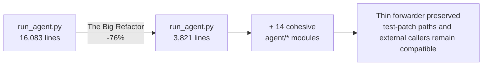

- **The Big Refactor** — `run_agent.py` shrinks from 16,083 lines to 3,821 (-76%), with the removed code redistributed into 14 cohesive modules under `agent/`. Behavior is preserved (a thin forwarder remains in `AIAgent` for test patch paths and external callers), but the "recommended reading order" in section 14 is now considerably more manageable — the edge cases that were crammed into one file are now spread across modules.

The other major changes:

| Area           | Changes                                                                                                                                                                                                                                                    |
| -------------- | ---------------------------------------------------------------------------------------------------------------------------------------------------------------------------------------------------------------------------------------------------------- |
| Kanban         | Grows into a multi-agent **platform** (104 PRs). Auto triage decomposition, `hermes kanban swarm` topology (root · parallel workers · gate verification/synthesis · shared blackboard), per-task model override, per-task worktree/branch, scheduled start |
| session_search | Rewritten without an auxiliary LLM — from ~$0.30 and ~30 seconds per call to **free and ~20ms** (~4,500× faster)                                                                                                                                           |
| Cold start     | Further optimization — per-turn function calls down **47%** (399k→213k) across a 31-turn conversation; `hermes --version` 63% faster                                                                                                                       |
| Security       | **Promptware defense** (Brainworm-class prompt injection) — shared threat patterns, scan on memory load, tool result delimiters                                                                                                                            |
| Secrets        | **Bitwarden Secrets Manager** — replace per-provider API keys with a single bootstrap token                                                                                                                                                                |
| Messengers     | **ntfy** added as the 23rd platform (push notifications with no account or key required)                                                                                                                                                                   |
| Skills         | **Skill bundles** — load multiple skills at once with a single `/<name>`. Added `openhands`/`code-wiki`/`web-pentest` skill bundles                                                                                                                        |
| Image/tools    | Krea 2 image provider, FAL backend pluginized, **Nous-curated MCP catalog** (`hermes mcp` interactive picker), mTLS MCP                                                                                                                                    |
| TUI            | **Session orchestrator** — switch and manage multiple live sessions in a single TUI window                                                                                                                                                                 |
| Provider       | OpenAI API becomes a first-class provider separate from the Codex runtime; Microsoft Entra ID (Azure Foundry); deeper xAI integration                                                                                                                      |

The supply-chain awareness highlighted in section 16.5 becomes more concrete in 0.15 with **`hermes audit`** (on-demand OSV.dev-based scanning) and `hermes update`'s post-pull syntax validation + automatic rollback.

### 18.3 0.15.1 — Same-Day Hotfix

A patch release issued the same day as 0.15.0 (21 PRs). The headline fix is the **401 reload loop** where the dashboard would infinite-reload in loopback mode (Docker, hosted, fresh installs). Other fixes include: separating Docker's `--insecure` from bind-host inference into an **explicit env opt-in** (`HERMES_DASHBOARD_INSECURE=1`), resolving the PATH for MCP bare commands (`npx`/`npm`/`node`) in Docker, kanban worker `SIGTERM` shutdown recovery, and exposing the full skills.sh catalog (858 → 19,932 entries).

### 18.4 Changes at a Glance

Mapping the 0.13 → 0.15 changes to sections in the main body:

| Reference in main body            | Changes through 0.15                                                                                 |
| --------------------------------- | ---------------------------------------------------------------------------------------------------- |
| 16.1 Several files are very large | `run_agent.py` 16k → 3.8k lines (-76%), split into 14 modules under `agent/`                         |
| 11. Plugins and model providers   | image_gen/browser/video/web backends aligned as plugins; OpenAI API promoted to first-class provider |
| 7. The tool system                | Tool surface expanded: `x_search`, `video_generate`, `computer_use` (non-Anthropic), etc.            |
| 9. Skills/memory/compression      | session_search rewritten without LLM, Skill bundles, promptware scanning on memory load              |
| 10. Sub-agents and parallel work  | Kanban grows into a full multi-agent platform with swarm topology, per-task models, and worktrees    |
| 16.5 Supply-chain security        | `hermes audit` (OSV.dev), update post-pull validation + rollback, Bitwarden secrets                  |

In summary: **the big picture drawn in the main body remains fully valid, but the "hard-to-read core" has been lightened and the "extension surfaces" have been pluginized more consistently**. If you understood the structure from 0.13, meeting 0.15 feels like encountering the same architecture rebuilt faster and cleaner.
