> 분석 일자: 2026-05-13
> 대상 버전: `0.13.0` / `v2026.5.7-476-gdd0923bb8`
> 대상 커밋: `dd0923bb89ed2dd56f82cb63656a1323f6f42e6f`
> 저장소: https://github.com/NousResearch/hermes-agent
> 로컬 분석 경로: `~/workspace/opensources/hermes-agent`

---

_This article is partially written by Codex_

## 목차

0. [먼저: OpenClaw와 무엇이 다른가요?](#먼저-openclaw와-무엇이-다른가요)
1. [프로젝트를 한 문장으로 이해하기](#1-프로젝트를-한-문장으로-이해하기)
2. [기술 스택](#2-기술-스택)
3. [전체 그림](#3-전체-그림)
4. [디렉토리 구조](#4-디렉토리-구조)
5. [핵심 실행 흐름](#5-핵심-실행-흐름)
6. [AIAgent: Hermes의 심장](#6-aiagent-hermes의-심장)
7. [도구 시스템](#7-도구-시스템)
8. [CLI, Gateway, ACP는 무엇이 다른가요?](#8-cli-gateway-acp는-무엇이-다른가요)
9. [스킬, 메모리, 컨텍스트 압축](#9-스킬-메모리-컨텍스트-압축)
10. [서브에이전트와 병렬 작업](#10-서브에이전트와-병렬-작업)
11. [플러그인과 모델 프로바이더](#11-플러그인과-모델-프로바이더)
12. [연구용 환경과 데이터 생성](#12-연구용-환경과-데이터-생성)
13. [테스트와 품질 관리](#13-테스트와-품질-관리)
14. [코드를 읽는 추천 순서](#14-코드를-읽는-추천-순서)
15. [인상적인 설계 포인트](#15-인상적인-설계-포인트)
16. [주의해서 볼 지점](#16-주의해서-볼-지점)
17. [결론](#17-결론)

---

## 먼저: OpenClaw와 무엇이 다른가요?

Hermes를 처음 보면 "[OpenClaw](/kb/2026-03-11-openclaw-architecture)의 Claude Code형 아닌가요?"라는 생각이 꽤 자연스럽습니다. 둘 다 사용자의 컴퓨터나 서버에서 오래 떠 있고, 여러 채널에서 메시지를 받고, LLM에게 도구를 쥐여 실제 작업을 하게 만드는 에이전트이기 때문입니다.

그래도 중심축은 조금 다릅니다.

| 관점          | OpenClaw                                           | Hermes Agent                                                        |
| ------------- | -------------------------------------------------- | ------------------------------------------------------------------- |
| 주된 느낌     | 개인용 AI 비서 운영체제                            | Python 기반 에이전트 런타임 + 연구/실험 플랫폼                      |
| 구현 스택     | TypeScript / Node 중심                             | Python 중심                                                         |
| 제품 중심     | Gateway, 채널, 앱, 디바이스 노드, 개인 비서 경험   | `AIAgent`, tool registry, provider transport, skills, RL 환경       |
| Claude Code감 | 외부 코딩 에이전트에 위임하거나 채널로 조종하는 쪽 | Hermes 자체가 Claude Code류의 tool-calling loop를 품고 있는 쪽      |
| 스킬          | 커뮤니티 skill 생태계와 tool/skill 분리가 강함     | 에이전트가 스킬을 읽고 만들고 고치며 자기 개선 루프에 더 가깝습니다 |
| 연구성        | 제품/운영 쪽 무게가 큼                             | Atropos 환경, trajectory, tool-call parser 등 연구용 표면이 큼      |

한 문장으로 정리하면 이렇습니다.

> OpenClaw가 "여러 채널과 기기에서 살아 있는 개인 AI 비서"에 가깝다면, Hermes는 "Claude Code류 작업 루프를 Python 런타임, 메모리, 스킬, 플러그인, 연구 환경으로 확장한 에이전트 플랫폼"에 가깝습니다.

그래서 OpenClaw를 이미 알고 있다면 Hermes는 훨씬 빨리 이해됩니다. 다만 Hermes를 OpenClaw의 복제판으로 보기보다는, **같은 문제를 Python 에이전트 런타임과 연구 친화적인 구조로 푼 프로젝트**로 보는 편이 더 정확합니다.

---

## 1. 프로젝트를 한 문장으로 이해하기

**Hermes Agent**는 터미널, 메신저, 에디터, 서버 환경에서 같은 AI 에이전트 코어를 실행하고, 그 에이전트가 도구를 쓰고, 기억을 남기고, 스킬을 만들고, 서브에이전트에게 일을 나눠 주도록 만든 **실행형 AI 에이전트 플랫폼**입니다.

단순히 "ChatGPT를 터미널에서 쓰는 앱" 정도로 보면 조금 작게 보는 셈입니다. 이 프로젝트는 다음을 한 덩어리로 묶으려는 시도에 가깝습니다.

| 질문                         | Hermes의 답                                                                                          |
| ---------------------------- | ---------------------------------------------------------------------------------------------------- |
| 어디서 대화하나요?           | CLI, Telegram, Discord, Slack, WhatsApp, Signal, Email, ACP 에디터 연동 등                           |
| 어떤 모델을 쓰나요?          | Nous Portal, OpenRouter, OpenAI, Anthropic, Bedrock, Gemini, Hugging Face, 로컬/커스텀 엔드포인트 등 |
| 무슨 일을 할 수 있나요?      | 터미널 실행, 파일 수정, 웹 검색, 브라우저 조작, 이미지/음성, MCP, 크론, 메시지 전송, 칸반 작업 등    |
| 오래 대화하면 어떻게 하나요? | 컨텍스트 압축, 세션 DB, 메모리, 세션 검색을 사용합니다                                               |
| 복잡한 작업은 어떻게 하나요? | `delegate_task`로 독립 컨텍스트를 가진 서브에이전트를 띄웁니다                                       |
| 배운 것은 남기나요?          | `MEMORY.md`, `USER.md`, 스킬 시스템, 외부 메모리 플러그인을 통해 남깁니다                            |

개인적으로는 Hermes를 이렇게 이해하면 편했습니다.

> "내 노트북 안의 챗봇"이 아니라, **여러 입구로 들어온 요청을 하나의 에이전트 런타임에 태우고, 그 런타임이 도구와 기억과 외부 채널을 연결하는 시스템**입니다.

---

## 2. 기술 스택

| 영역              | 기술                                                                      |
| ----------------- | ------------------------------------------------------------------------- |
| 주 언어           | Python 3.11+                                                              |
| 패키지 관리       | `uv`, `setuptools`                                                        |
| CLI               | `prompt_toolkit`, `rich`, `fire`                                          |
| 설정              | YAML, `.env`, profile 기반 `HERMES_HOME`                                  |
| LLM API           | OpenAI 호환 Chat Completions, Anthropic, Bedrock, Codex Responses 등      |
| 데이터 저장       | SQLite 세션 DB, 파일 기반 메모리, JSON/YAML 설정                          |
| 도구 시스템       | 자체 `tools.registry` + JSON Schema function calling                      |
| 메신저 게이트웨이 | Telegram, Discord, Slack, WhatsApp, Signal, Matrix, Email 등 adapter 구조 |
| 플러그인          | `plugin.yaml` + `register(ctx)` 기반 플러그인                             |
| 에디터 연동       | ACP, MCP                                                                  |
| 연구 환경         | Atropos RL 환경, tool-call parser, trajectory 생성                        |
| 테스트            | `pytest`, `pytest-xdist`, `pytest-asyncio`, `ruff`, `ty`                  |

로컬 체크아웃 기준으로 대략적인 규모는 다음과 같습니다.

| 항목                               |    수치 |
| ---------------------------------- | ------: |
| 전체 추적 파일                     | 3,252개 |
| Python 파일                        | 1,598개 |
| 테스트 파일 전체                   | 1,061개 |
| `test_*.py` 파일                   | 1,026개 |
| 기본 `skills/` 아래 `SKILL.md`     |    87개 |
| `optional-skills/` 아래 `SKILL.md` |    79개 |

규모만 보면 이미 작은 사이드 프로젝트가 아닙니다. 특히 `run_agent.py`, `cli.py`, `gateway/run.py`는 "큰 코어 파일"입니다. 대신 도구, 메모리, 프로바이더, 플랫폼, 플러그인은 별도 디렉토리로 나누어져 있어서 큰 그림을 잡으면 의외로 읽을 수 있습니다.

---

## 3. 전체 그림

Hermes의 큰 구조는 아래처럼 볼 수 있습니다.

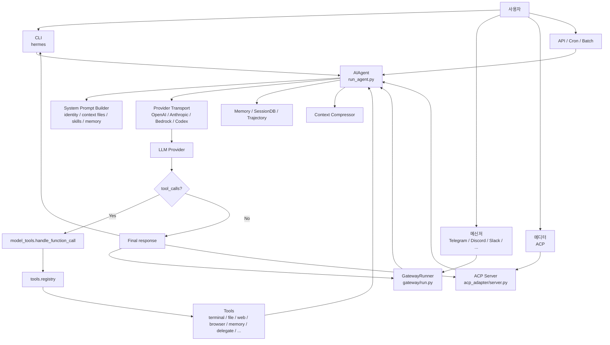

중심에는 `AIAgent`가 있습니다. CLI든 Telegram이든 ACP든 결국 사용자의 메시지는 `AIAgent.run_conversation()`으로 들어갑니다. `AIAgent`는 시스템 프롬프트를 만들고, 모델에게 메시지와 도구 스키마를 보내고, 모델이 도구를 호출하면 실행하고, 결과를 다시 모델에게 넣습니다.

즉, Hermes의 핵심 루프는 아주 단순하게 쓰면 이렇습니다.

```text
사용자 메시지
  -> 시스템 프롬프트 + 대화 히스토리 + 도구 스키마 구성
  -> LLM 호출
  -> tool_calls가 있으면 도구 실행
  -> 도구 결과를 대화에 추가
  -> 다시 LLM 호출
  -> tool_calls가 없으면 최종 답변
```

이 단순한 루프 주변에 컨텍스트 압축, 프롬프트 캐싱, 세션 저장, 위험 명령 승인, 서브에이전트, 메모리 동기화, 플러그인 훅, 스트리밍, 메신저 전송 같은 장치가 촘촘하게 붙어 있습니다.

---

## 4. 디렉토리 구조

핵심 구조를 이해용으로 줄이면 다음과 같습니다.

```text
hermes-agent/
├── hermes_cli/
│   ├── main.py                 # `hermes` 명령의 큰 엔트리포인트
│   ├── commands.py             # slash command 단일 레지스트리
│   ├── plugins.py              # 플러그인 발견/로드/훅 실행
│   ├── config.py               # config.yaml 로드/저장
│   └── web_server.py           # 대시보드/API 서버
│
├── cli.py                      # classic interactive CLI
├── run_agent.py                # AIAgent, 메인 tool-calling loop
├── model_tools.py              # tool schema 제공 + tool dispatch
├── toolsets.py                 # toolset 묶음 정의
├── hermes_state.py             # SQLite 세션 DB
│
├── tools/
│   ├── registry.py             # 모든 도구의 중앙 레지스트리
│   ├── terminal_tool.py        # 터미널 실행
│   ├── file_tools.py           # read/write/patch/search
│   ├── web_tools.py            # web_search / web_extract
│   ├── browser_tool.py         # 브라우저 자동화
│   ├── delegate_tool.py        # 서브에이전트 실행
│   ├── memory_tool.py          # MEMORY.md / USER.md
│   ├── skills_tool.py          # 스킬 목록/조회
│   ├── skill_manager_tool.py   # 스킬 생성/수정
│   ├── cronjob_tools.py        # 예약 작업
│   ├── mcp_tool.py             # MCP 도구 연동
│   └── environments/           # local/docker/ssh/modal/daytona/vercel/singularity
│
├── agent/
│   ├── context_compressor.py   # 오래된 대화 압축
│   ├── prompt_builder.py       # 시스템 프롬프트 구성
│   ├── memory_manager.py       # 외부 메모리 provider orchestration
│   ├── model_metadata.py       # 컨텍스트 길이, 토큰 추정
│   ├── transports/             # provider별 메시지 변환/응답 정규화
│   └── ...
│
├── gateway/
│   ├── run.py                  # 메신저 게이트웨이 실행
│   ├── session.py              # 플랫폼별 세션/컨텍스트
│   ├── platform_registry.py    # 플랫폼 adapter registry
│   └── platforms/              # telegram, discord, slack, whatsapp, ...
│
├── acp_adapter/
│   ├── server.py               # Agent Client Protocol 서버
│   ├── session.py              # ACP 세션과 AIAgent 매핑
│   └── permissions.py          # editor permission bridge
│
├── providers/
│   ├── base.py                 # ProviderProfile
│   └── __init__.py             # provider plugin discovery
│
├── plugins/
│   ├── model-providers/        # nous, openrouter, anthropic, bedrock, ...
│   ├── memory/                 # honcho, mem0, supermemory, ...
│   ├── image_gen/              # image provider
│   ├── platforms/              # plugin platform adapters
│   ├── context_engine/
│   ├── kanban/
│   └── hermes-achievements/
│
├── skills/                     # 기본 스킬 묶음
├── optional-skills/            # 선택형 스킬 묶음
├── environments/               # Atropos RL / benchmark 환경
├── tests/                      # pytest 테스트
└── RELEASE_v0.13.0.md          # v2026.5.7 릴리스 노트
```

여기서 가장 중요한 파일을 5개만 고르면 다음입니다.

| 파일                | 역할                                                                           |
| ------------------- | ------------------------------------------------------------------------------ |
| `run_agent.py`      | 대화 루프, 모델 호출, 도구 호출, 압축, 메모리, 인터럽트의 중심                 |
| `model_tools.py`    | 모델에게 줄 도구 스키마를 만들고 실제 도구 호출을 dispatch합니다               |
| `tools/registry.py` | 도구가 스스로 등록되는 중앙 레지스트리입니다                                   |
| `cli.py`            | 터미널 UI, slash command, interrupt, streaming, TTS 등을 다룹니다              |
| `gateway/run.py`    | Telegram/Discord/Slack 같은 외부 채널에서 들어온 메시지를 AIAgent에 연결합니다 |

---

## 5. 핵심 실행 흐름

사용자가 CLI에서 "이 저장소 분석해줘"라고 입력했다고 가정해 보겠습니다. 내부 흐름은 대략 이렇습니다.

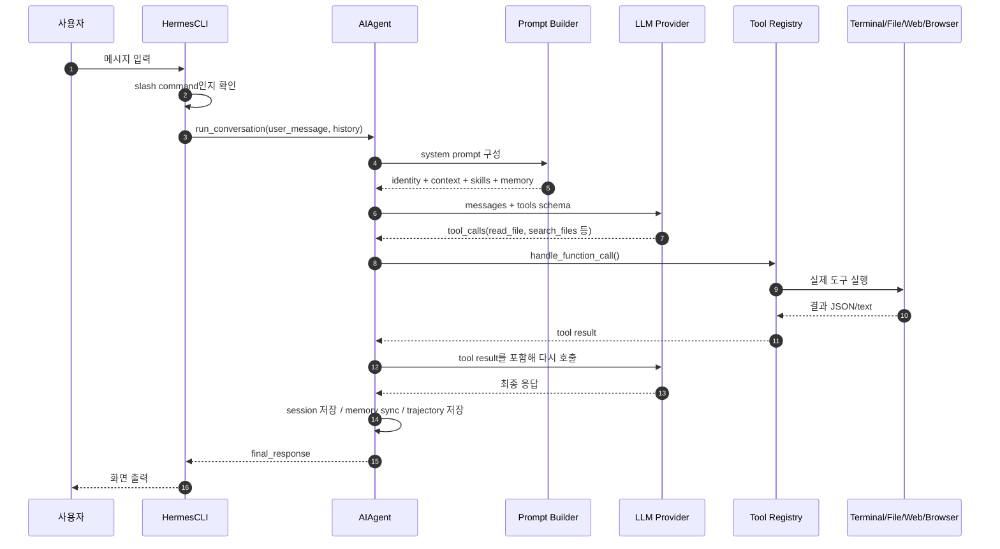

이 흐름에서 중요한 점은 **도구 호출이 모델의 "말"이 아니라 시스템의 실제 실행**이라는 것입니다. 모델은 `read_file`을 호출하겠다고 구조화된 JSON을 냅니다. Hermes는 그 이름과 인자를 검증하고, 레지스트리에서 handler를 찾아 실행하고, 결과를 다시 모델에게 줍니다.

그래서 Hermes를 읽을 때는 "프롬프트가 멋진가요?"보다 "모델이 어떤 도구 표면을 보고, 그 도구 호출이 어떻게 검증되고, 어떤 컨텍스트로 다시 모델에게 돌아가나요?"를 보는 편이 좋습니다.

---

## 6. AIAgent: Hermes의 심장

`run_agent.py`의 `AIAgent`는 프로젝트의 중심입니다. 생성자 인자가 매우 많습니다. 모델, provider, API mode, toolsets, callbacks, session_id, platform 정보, memory 설정, context compressor, credential pool, checkpoint 설정까지 거의 모든 실행 상태가 여기로 들어옵니다.

실행 루프를 단순화하면 다음과 같습니다.

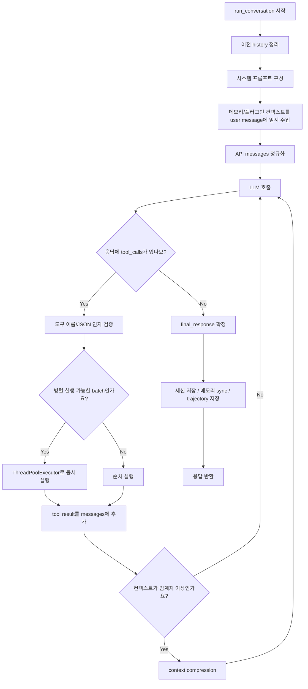

실제 코드는 훨씬 더 현실적입니다. 예를 들어 다음 같은 경우를 모두 다룹니다.

- 모델이 존재하지 않는 도구 이름을 만든 경우 자동 보정 또는 에러를 되돌려 self-correction을 유도합니다.
- 도구 인자 JSON이 깨진 경우 최대 몇 번 재시도하고, 그래도 안 되면 모델에게 "JSON이 잘못되었습니다"라는 tool result를 넣습니다.
- 컨텍스트가 너무 길면 압축하고 다시 시도합니다.
- provider가 413, 429, context overflow, long-context tier 오류를 내면 에러 분류 후 재시도/압축/credential fallback을 시도합니다.
- 사용자가 중간에 새 메시지를 보내면 `interrupt()`가 부모 에이전트, 실행 중인 도구, 서브에이전트까지 전파됩니다.
- 모델이 "답변 + memory 저장 같은 housekeeping tool"을 동시에 한 경우, 후속 응답이 비어도 앞선 내용을 final response로 살립니다.

이런 부분 때문에 `run_agent.py`는 길지만, 의도는 분명합니다.

> 모델은 자주 이상한 모양의 응답을 냅니다. Hermes는 그 응답을 그대로 믿지 않고, 가능한 한 복구하고, 그래도 안 되면 대화가 망가지지 않도록 안전한 tool result를 넣습니다.

---

## 7. 도구 시스템

Hermes의 도구 구조는 **self-registering registry** 패턴입니다. 각 도구 파일이 import될 때 `registry.register()`를 호출하고, `model_tools.py`가 이 레지스트리를 조회해서 모델에게 줄 JSON Schema 목록을 만듭니다.

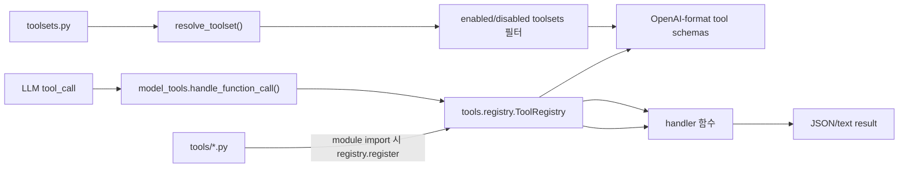

`toolsets.py`에는 도구 묶음이 정의되어 있습니다.

| toolset      | 예시 도구                                                  | 느낌                        |
| ------------ | ---------------------------------------------------------- | --------------------------- |
| `file`       | `read_file`, `write_file`, `patch`, `search_files`         | 코드 읽기/수정              |
| `terminal`   | `terminal`, `process`                                      | 명령 실행/프로세스 관리     |
| `web`        | `web_search`, `web_extract`                                | 검색과 페이지 추출          |
| `browser`    | `browser_navigate`, `browser_click`, `browser_snapshot` 등 | 브라우저 자동화             |
| `skills`     | `skills_list`, `skill_view`, `skill_manage`                | 스킬 읽기/생성/관리         |
| `memory`     | `memory`                                                   | `MEMORY.md`, `USER.md` 관리 |
| `delegation` | `delegate_task`                                            | 서브에이전트 실행           |
| `cronjob`    | `cronjob`                                                  | 예약 작업                   |
| `messaging`  | `send_message`                                             | 다른 플랫폼으로 메시지 전송 |
| `rl`         | `rl_start_training`, `rl_check_status` 등                  | 연구/훈련 환경              |

흥미로운 점은 "도구 목록"이 정적인 배열 하나로 끝나지 않는다는 것입니다.

- 기본 도구는 `tools/*.py`가 등록합니다.
- MCP 도구는 런타임에 동적으로 등록될 수 있습니다.
- 플러그인도 `ctx.register_tool()`로 도구를 추가할 수 있습니다.
- 메모리 provider와 context engine도 자신만의 tool schema를 주입할 수 있습니다.
- `delegate_task` 같은 도구는 현재 설정값을 반영해 description을 동적으로 바꿉니다.

즉, 모델이 보는 도구 표면은 "설치된 기능 + 설정 + 플랫폼 + 플러그인 + 현재 세션 상태"의 결과입니다.

---

## 8. CLI, Gateway, ACP는 무엇이 다른가요?

Hermes에는 여러 입구가 있습니다. 하지만 입구만 다르고, 대부분은 같은 `AIAgent`를 호출합니다.

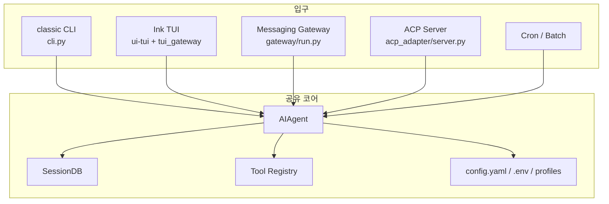

### CLI

`cli.py`는 터미널에서 직접 쓰는 인터랙티브 인터페이스입니다. `prompt_toolkit`으로 입력 영역, 히스토리, slash command autocomplete, interrupt를 다룹니다. 사용자가 메시지를 입력하면 별도 thread에서 `AIAgent.run_conversation()`을 실행하고, 메인 thread는 입력/interrupt를 감시합니다.

CLI의 특징은 다음입니다.

- `/model`, `/tools`, `/skills`, `/compress`, `/background`, `/busy`, `/steer` 같은 명령이 많습니다.
- dangerous command 승인 UI를 터미널에서 직접 처리합니다.
- streaming, reasoning 표시, TTS, voice mode 같은 사용자 경험 요소가 많습니다.
- foreground 대화와 background task를 같이 지원합니다.

### Gateway

`gateway/run.py`는 Hermes를 메신저에 붙이는 큰 레이어입니다. Telegram, Discord, Slack, WhatsApp, Signal 같은 플랫폼 adapter가 메시지를 받으면 `MessageEvent`로 정규화하고, Gateway가 session을 찾은 뒤 `AIAgent`를 실행합니다.

Gateway의 핵심은 **대화 채널을 session으로 바꾸는 일**입니다.

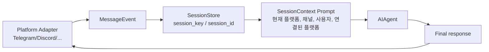

Gateway는 CLI보다 훨씬 많은 현실 문제를 처리합니다.

- 같은 채팅방에서 이미 에이전트가 작업 중이면 새 메시지를 interrupt/queue/steer로 처리합니다.
- 플랫폼별 메시지 길이 제한, threading, reply, edit, draft streaming 차이를 흡수합니다.
- dangerous command 승인을 채팅 메시지나 버튼으로 보냅니다.
- gateway가 재시작되어도 세션을 복원하고, unfinished tool result가 있으면 이어서 처리하도록 안내합니다.
- `send_message`와 cron delivery가 플랫폼 adapter를 재사용합니다.

### ACP

`acp_adapter/`는 VS Code, Zed, JetBrains 같은 에디터가 Agent Client Protocol로 Hermes를 사용할 수 있게 하는 서버입니다. ACP session마다 `AIAgent`를 하나 만들고, 에디터에서 보내는 파일/이미지 resource를 모델이 볼 수 있는 content part로 변환합니다.

ACP의 포인트는 다음입니다.

- 에디터 session과 Hermes session을 매핑합니다.
- 작업 디렉토리와 terminal tool의 cwd를 session별로 맞춥니다.
- permission request를 ACP client의 permission UI로 연결합니다.
- 세션을 SQLite에 저장해서 에디터 재연결 후에도 이어갈 수 있습니다.

---

## 9. 스킬, 메모리, 컨텍스트 압축

Hermes가 "self-improving agent"라고 주장하는 데에는 스킬과 메모리 구조가 중요합니다.

### 스킬

스킬은 `SKILL.md` 형식의 절차 문서입니다. Hermes는 `skills/`, `optional-skills/`, 사용자 `~/.hermes/skills/`, 외부 skill directory를 읽을 수 있습니다. 모델은 `skills_list`, `skill_view`, `skill_manage` 도구를 통해 스킬을 찾고 읽고 만들 수 있습니다.

스킬은 그냥 문서이지만, 에이전트 입장에서는 **절차적 기억**입니다. 예를 들어 "이런 종류의 작업을 할 때는 이 순서로 하라" 같은 지시를 파일로 저장해 두고, 다음에 다시 불러와 사용할 수 있습니다.

이 관점은 [Superpowers](/kb/2026-04-18-superpowers-architecture)와도 닿아 있습니다. Superpowers가 "에이전트가 성급하게 행동하지 않도록 절차를 강제하는 스킬 묶음"이라면, Hermes의 스킬은 그 절차적 기억을 Hermes 런타임 안에서 찾고, 읽고, 관리하는 쪽에 가깝습니다.

### 메모리

기본 메모리는 파일 기반입니다.

```text
~/.hermes/
├── config.yaml
├── .env
├── state.db
├── logs/
├── skills/
├── plugins/
└── memories/
    ├── MEMORY.md
    └── USER.md
```

`MEMORY.md`는 에이전트가 배운 환경/프로젝트/작업 습관을 담고, `USER.md`는 사용자에 대한 선호나 커뮤니케이션 스타일을 담습니다. 이 파일들은 세션 시작 시 시스템 프롬프트에 snapshot으로 들어갑니다. 중간에 memory tool이 파일을 수정해도 현재 세션의 시스템 프롬프트는 유지됩니다. 이렇게 하면 prefix cache가 깨지지 않습니다.

외부 메모리 provider도 있습니다. `plugins/memory/` 아래에 Honcho, Mem0, Supermemory 같은 provider가 있고, `agent/memory_manager.py`가 provider 하나를 선택해 prefetch/sync/tool schema를 연결합니다.

이 부분은 agentmemory 같은 외부 장기 기억 계층과 같은 문제의식을 공유합니다. Hermes가 기본적으로 파일 기반 메모리와 provider hook을 제공한다면, 별도 장기 기억 프로젝트들은 여러 에이전트가 공유하는 메모리 평면을 더 강하게 밀어붙이는 쪽입니다.

### 컨텍스트 압축

긴 대화는 `agent/context_compressor.py`가 관리합니다. 기본값은 모델 컨텍스트의 일정 비율에 도달하면 오래된 중간 turn을 요약하고, 앞부분과 최근 tail을 보호하는 방식입니다.

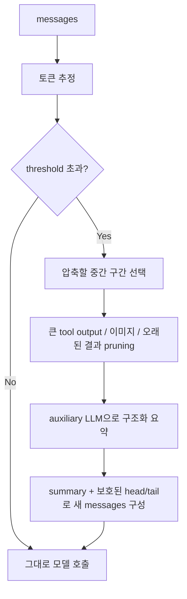

요약은 그냥 "예전 대화 요약"이 아니라, active task, completed actions, unresolved questions, file paths, command outputs 같은 정보를 최대한 보존하도록 설계되어 있습니다. 그리고 요약 앞에는 "이것은 현재 명령이 아니라 참고용 handoff"라는 강한 경고를 붙입니다. 요약 자체가 모델에게 새 작업 지시처럼 오해되는 것을 줄이기 위해서입니다.

### 비용 때문에 저렴한 LLM API를 자주 쓰면 제대로 작동할까요?

결론부터 말하면 **작동은 합니다. 다만 "Hermes다운 안정성"은 모델 품질에 꽤 크게 좌우됩니다.**

Hermes는 여러 provider를 붙일 수 있고, 컨텍스트 압축에도 별도 auxiliary model을 쓸 수 있게 설계되어 있습니다. 즉 비싼 모델 하나만 고집하는 구조는 아닙니다. 실제로 `agent/context_compressor.py`의 주석도 요약에는 cheap/fast auxiliary model을 쓴다고 설명합니다.

하지만 Hermes가 하는 일은 일반 채팅보다 훨씬 까다롭습니다. 모델은 답변만 잘하면 되는 것이 아니라, 도구 이름을 정확히 고르고, JSON 인자를 깨뜨리지 않고, 긴 작업 상태를 기억하고, 압축된 요약을 다시 읽고, 위험한 명령과 안전한 명령을 구분해야 합니다. 저렴한 모델이 이 중 하나를 자주 실수하면 에이전트 전체가 흔들립니다.

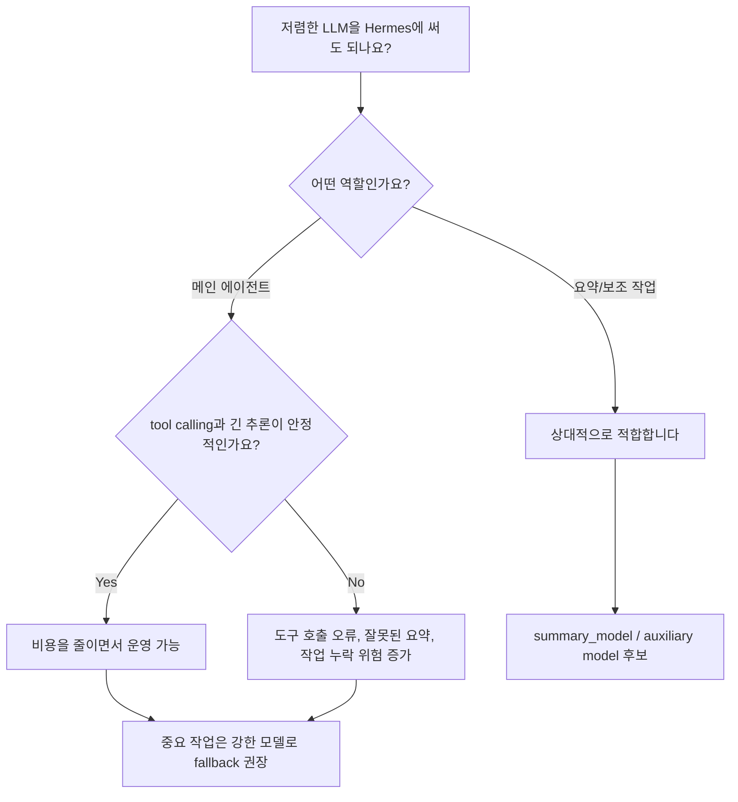

제가 권장하는 운영 방식은 다음입니다.

| 용도                    | 추천 모델 선택                                                             |
| ----------------------- | -------------------------------------------------------------------------- |
| 메인 에이전트 루프      | tool calling, JSON schema, 긴 컨텍스트가 검증된 모델                       |
| 컨텍스트 압축/요약      | 비용이 낮은 auxiliary model 가능. 단, 요약 품질이 낮으면 main으로 fallback |
| 서브에이전트 리서치     | 독립 조사처럼 실패 비용이 낮은 작업은 저렴한 모델 가능                     |
| 파일 수정/터미널 작업   | 실수 비용이 높으므로 강한 모델 권장                                        |
| 장기 세션/복잡한 디버깅 | 압축 요약을 잘 읽고 유지할 수 있는 모델 권장                               |

Hermes 자체도 이런 현실을 어느 정도 받아들이고 있습니다. 요약 모델이 실패하면 main model로 돌아가는 fallback, 너무 많이 압축해도 줄지 않으면 멈추는 anti-thrashing, provider context error가 나면 압축 후 재시도하는 흐름이 있습니다.

그래도 핵심은 이겁니다.

> Hermes는 저렴한 모델을 쓸 수 있게 해주지만, 저렴한 모델이 약한 tool calling과 약한 장기 추론까지 보상해 주지는 않습니다.

따라서 비용을 줄이고 싶다면 "모든 것을 싼 모델로 돌리기"보다, **강한 모델을 메인 운전석에 두고, 싼 모델을 요약/분류/독립 리서치에 배치하는 방식**이 더 안전합니다.

---

## 10. 서브에이전트와 병렬 작업

Hermes의 `delegate_task`는 아주 중요한 도구입니다. 부모 에이전트가 "이 부분은 별도 컨텍스트에서 조사해 와"라고 시킬 수 있습니다.

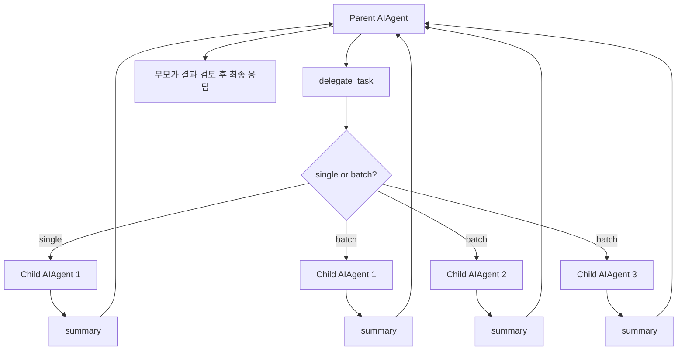

이 도구의 핵심 설계는 다음입니다.

| 설계                  | 설명                                                                              |
| --------------------- | --------------------------------------------------------------------------------- |
| 독립 컨텍스트         | 서브에이전트는 부모 대화 전체를 모릅니다. 필요한 정보는 `context`에 넣어야 합니다 |
| 독립 terminal session | 서브에이전트마다 task id를 갖고 작업 상태를 분리합니다                            |
| batch 병렬 실행       | 여러 task를 ThreadPoolExecutor로 동시에 실행할 수 있습니다                        |
| depth 제한            | `max_spawn_depth`로 nested delegation을 제한합니다                                |
| role 구분             | `leaf`는 더 위임하지 못하고, `orchestrator`는 제한 내에서 다시 위임할 수 있습니다 |
| self-report 주의      | 서브에이전트 결과는 "보고"일 뿐이라 부모가 검증해야 합니다                        |

이 구조는 "토큰을 아끼기 위한 병렬 리서치"에 잘 맞습니다. 예를 들어 큰 저장소를 볼 때 부모가 모든 파일 내용을 직접 다 읽는 대신, 독립적인 하위 질문을 서브에이전트에게 맡기고 요약만 받을 수 있습니다.

다만 이 프로젝트의 자체 도구 설명도 분명히 경고합니다. 서브에이전트가 "성공했습니다"라고 했다고 해서 성공이 아닙니다. 파일 생성, 외부 업로드, HTTP 요청 같은 부작용은 부모가 다시 확인해야 합니다.

---

## 11. 플러그인과 모델 프로바이더

Hermes는 플러그인 표면이 꽤 넓습니다.

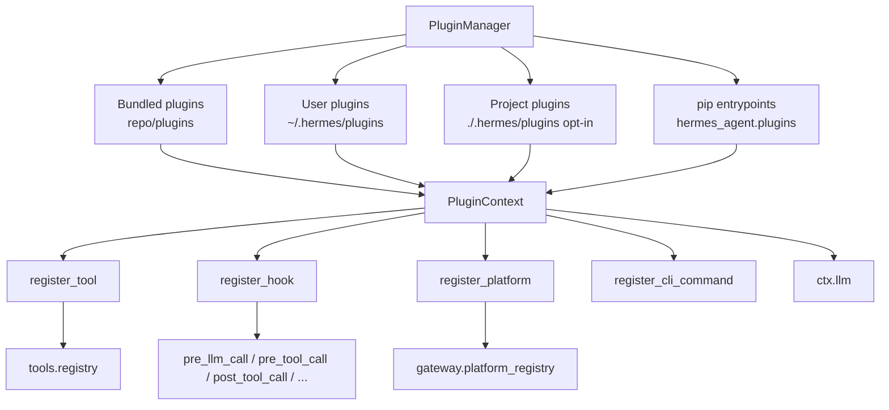

플러그인은 다음을 할 수 있습니다.

- 도구를 추가합니다.
- lifecycle hook을 등록합니다.
- gateway platform adapter를 등록합니다.
- CLI command를 추가합니다.
- host-owned LLM facade인 `ctx.llm`으로 사용자의 모델/인증을 활용합니다.

특히 v0.13.0 릴리스에서 눈에 띄는 부분은 **모델 프로바이더도 플러그인화**되었다는 점입니다. `providers/base.py`의 `ProviderProfile`은 provider의 endpoint, auth, 모델 목록, request-time quirk를 선언적으로 담습니다. `plugins/model-providers/nous/` 같은 디렉토리가 provider profile을 등록합니다.

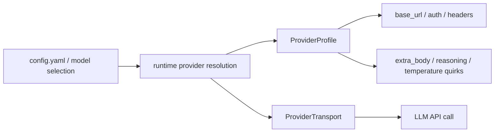

이렇게 하면 "새 provider를 지원하려면 core 코드에 if문을 계속 추가해야 하는 문제"를 줄일 수 있습니다. provider별 자잘한 차이는 profile과 transport가 맡고, `AIAgent`는 가능한 한 공통 흐름을 유지합니다.

---

## 12. 연구용 환경과 데이터 생성

Hermes에는 일반 사용자용 기능뿐 아니라 연구용 코드도 들어 있습니다. `environments/` 디렉토리는 Atropos RL 환경과 연결됩니다.

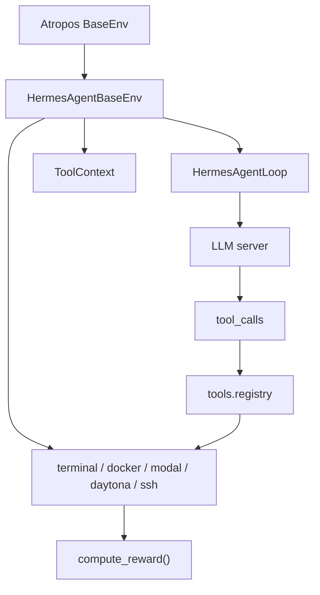

이 쪽은 일반 사용자가 바로 만질 부분은 아니지만, 프로젝트 철학을 잘 보여줍니다.

- 실제 Hermes 도구를 RL rollout 안에서도 그대로 씁니다.
- 모델이 tool call을 하고, 환경은 결과를 기록하고, reward function이 같은 sandbox 상태를 검증합니다.
- VLLM Phase 2처럼 raw text에서 tool call을 파싱해야 하는 경우를 위해 모델별 parser도 제공합니다.

즉, Hermes는 단순한 앱이 아니라 **도구 사용 에이전트를 훈련/평가하는 실험 장치**로도 쓰이도록 설계되어 있습니다.

---

## 13. 테스트와 품질 관리

테스트 구성도 꽤 방대합니다. 로컬 체크아웃 기준 `tests/` 아래에는 1,000개가 넘는 테스트 파일이 있습니다.

대표적인 테스트 영역은 다음입니다.

| 영역       | 예시                                                                |
| ---------- | ------------------------------------------------------------------- |
| agent loop | context 압축, provider fallback, tool call 복구, interrupt          |
| tools      | terminal, file, browser, MCP, TTS, image generation, delegate, cron |
| gateway    | session, 플랫폼 adapter, interrupt, streaming, auth                 |
| ACP        | session manager, permissions, protocol event                        |
| plugins    | memory provider, image provider, observability                      |
| 환경       | docker, ssh, modal, local, file sync                                |
| security   | secret redaction, path traversal, SSRF, dangerous command approval  |

테스트 실행은 `scripts/run_tests.sh`가 표준입니다. 이 스크립트는 다음을 맞춥니다.

- `.venv`, `venv`, `~/.hermes/hermes-agent/venv` 순서로 venv를 찾습니다.
- credential 형태의 환경 변수를 비웁니다.
- `TZ=UTC`, `LANG=C.UTF-8`, `PYTHONHASHSEED=0`으로 고정합니다.
- `pytest-xdist` worker 수를 4로 맞춥니다.
- integration/e2e 테스트를 기본 제외합니다.

CI도 비슷하게 `uv`, Python 3.11, `pytest -n auto` 조합으로 실행됩니다. 큰 에이전트 프로젝트에서 이런 hermetic test runner가 있는 것은 중요합니다. 특히 AI 에이전트는 환경 변수, 실제 API key, 로컬 daemon, 브라우저 상태 때문에 테스트가 쉽게 오염될 수 있기 때문입니다.

---

## 14. 코드를 읽는 추천 순서

처음부터 `run_agent.py` 전체를 읽으면 금방 지칩니다. 다음 순서를 추천합니다.

### 1단계: README와 AGENTS

- `README.md`: 제품이 무엇을 하려는지 봅니다.
- `AGENTS.md`: 개발자가 실제로 어떤 파일을 중요하게 여기는지 봅니다.

`AGENTS.md`는 특히 좋습니다. 내부 개발자를 위한 길잡이라서, "어디가 load-bearing entry point인지"를 알려줍니다.

### 2단계: 도구 표면

- `toolsets.py`
- `tools/registry.py`
- `model_tools.py`

여기까지 보면 모델이 어떤 도구를 볼 수 있고, tool call이 실제 함수 호출로 어떻게 이어지는지 이해됩니다.

### 3단계: AIAgent 루프

- `run_agent.py`의 `class AIAgent`
- `run_conversation()`
- `_execute_tool_calls()`
- `_execute_tool_calls_concurrent()`
- `_execute_tool_calls_sequential()`

이 단계에서는 세부 에러 처리보다 흐름만 보는 것이 좋습니다.

### 4단계: 입구별 adapter

- CLI: `cli.py`, `hermes_cli/commands.py`
- Gateway: `gateway/run.py`, `gateway/session.py`, `gateway/platforms/base.py`
- ACP: `acp_adapter/server.py`, `acp_adapter/session.py`

여기서는 "사용자 메시지가 어떻게 `AIAgent`까지 도착하는가"만 추적하면 됩니다.

### 5단계: 장기 기억과 확장성

- `tools/memory_tool.py`
- `agent/memory_manager.py`
- `agent/context_compressor.py`
- `agent/skill_utils.py`
- `hermes_cli/plugins.py`
- `providers/base.py`

이 부분을 보면 Hermes가 왜 "self-improving"이라는 표현을 쓰는지 감이 옵니다.

---

## 15. 인상적인 설계 포인트

### 15.1 동일한 에이전트 코어를 여러 표면에 붙입니다

CLI, 메신저, ACP, cron이 완전히 다른 앱처럼 보이지만, 실제로는 `AIAgent`라는 같은 코어를 공유합니다. 덕분에 도구, 메모리, 압축, provider fallback 같은 기능이 여러 입구에서 같이 동작합니다.

### 15.2 도구 registry가 비교적 깔끔합니다

각 도구가 스스로 schema와 handler를 등록하고, `model_tools.py`는 registry를 통해 schema 제공과 dispatch를 합니다. 도구가 많아질수록 이 방식이 중요합니다. 중앙 파일 하나에 모든 도구 스키마와 handler를 수동으로 추가하는 구조였다면 훨씬 빨리 복잡해졌을 것입니다.

### 15.3 현실적인 복구 코드가 많습니다

모델이 잘못된 tool name을 만들거나, JSON을 깨뜨리거나, empty response를 내거나, provider가 context 오류를 반환하는 경우가 많습니다. Hermes는 이런 상황을 "있을 수 없는 일"로 보지 않고, 정상적인 운영 조건으로 다룹니다.

### 15.4 프롬프트 캐싱을 매우 의식합니다

시스템 프롬프트를 stable/context/volatile tier로 나누고, memory provider context는 시스템 프롬프트가 아니라 user message에 임시 주입합니다. 변경이 잦은 내용이 시스템 프롬프트 앞부분을 깨뜨리면 캐시 hit가 줄어들기 때문입니다.

### 15.5 메신저 제품으로서의 디테일이 많습니다

Gateway 코드는 단순히 "메시지 받기/보내기"가 아닙니다. 메시지 길이 제한, thread routing, typing indicator, approval UX, streaming edit, restart resume, busy session 처리, pending interrupt 처리까지 실제로 오래 운영해 본 흔적이 많습니다.

### 15.6 연구와 제품이 같은 도구 레이어를 공유합니다

`environments/`의 RL 환경도 Hermes 도구 registry를 사용합니다. 제품에서 쓰는 도구와 연구용 rollout에서 쓰는 도구가 갈라지지 않는다는 점이 흥미롭습니다.

---

## 16. 주의해서 볼 지점

### 16.1 큰 파일이 많습니다

`run_agent.py`, `cli.py`, `gateway/run.py`는 매우 큽니다. 많은 edge case가 한 파일에 모여 있어서, 처음 읽는 사람에게는 부담스럽습니다. 다만 이 파일들이 "복잡한 이유"는 분명합니다. 각각 agent loop, interactive CLI, multi-platform gateway라는 복잡한 경계를 직접 다룹니다.

### 16.2 동기/비동기 경계가 많습니다

`AIAgent`는 기본적으로 동기식 루프입니다. Gateway와 ACP는 async 환경입니다. 그래서 thread pool, `asyncio.run_coroutine_threadsafe()`, contextvars, thread-local callback 같은 장치가 많이 나옵니다. 이 부분은 버그가 생기기 쉬운 영역입니다.

### 16.3 플러그인 표면은 강력하지만 책임도 큽니다

플러그인은 tool, hook, platform, CLI command를 추가할 수 있습니다. 강력한 만큼 신뢰 경계가 중요합니다. 프로젝트 플러그인이 opt-in인 것도 그 때문으로 보입니다.

### 16.4 서브에이전트 결과는 검증이 필요합니다

`delegate_task` 설명 자체가 "subagent summaries are self-reports"라고 경고합니다. 부모 에이전트가 결과를 다시 확인하는 흐름이 중요합니다.

### 16.5 공급망 보안을 강하게 의식합니다

`pyproject.toml`을 보면 core dependency를 exact pin으로 고정하는 설명이 길게 들어 있습니다. 2026-05-12 기준으로 malicious PyPI release 대응 문맥도 남아 있습니다. 이 프로젝트가 단순 기능 개발뿐 아니라 배포/설치/공급망 리스크를 꽤 진지하게 보고 있다는 신호입니다.

---

## 17. 결론

Hermes Agent는 "AI 에이전트 앱"이라기보다 **AI 에이전트 운영체제에 가까운 프로젝트**입니다. 사용자는 CLI나 Telegram에서 말할 뿐이지만, 내부에서는 세션 DB, 도구 registry, provider transport, context compressor, memory provider, skill system, plugin hook, gateway adapter가 함께 움직입니다.

제가 이해한 핵심은 세 가지입니다.

1. **중심은 `AIAgent`입니다.** 모든 입구가 결국 같은 tool-calling loop로 모입니다.
2. **힘은 도구 표면에서 나옵니다.** terminal, file, browser, web, memory, skills, delegate, cron 같은 도구를 모델이 구조적으로 호출합니다.
3. **오래 쓰기 위한 장치가 많습니다.** 세션 저장, 컨텍스트 압축, 기억, 스킬, 게이트웨이 재시작 복구, 서브에이전트가 모두 "한 번 답하고 끝"이 아니라 계속 쓰는 에이전트를 목표로 합니다.

처음 읽을 때는 기능이 너무 많아 보이지만, 아래 한 줄만 기억하면 구조가 잡힙니다.

> Hermes는 여러 채널에서 들어온 사용자 요청을 `AIAgent`로 모으고, `AIAgent`는 모델에게 도구 목록을 보여준 뒤, 모델의 tool call을 실제 세계의 작업으로 바꾸는 시스템입니다.

이 관점으로 보면 거대한 저장소도 조금 친근해집니다. `run_agent.py`는 심장, `tools/registry.py`는 손발의 신경망, `gateway/`는 외부 세계와의 귀와 입, `memory/skills/plugins`는 오래 쓰면서 쌓이는 습관과 확장 장치라고 볼 수 있습니다.
