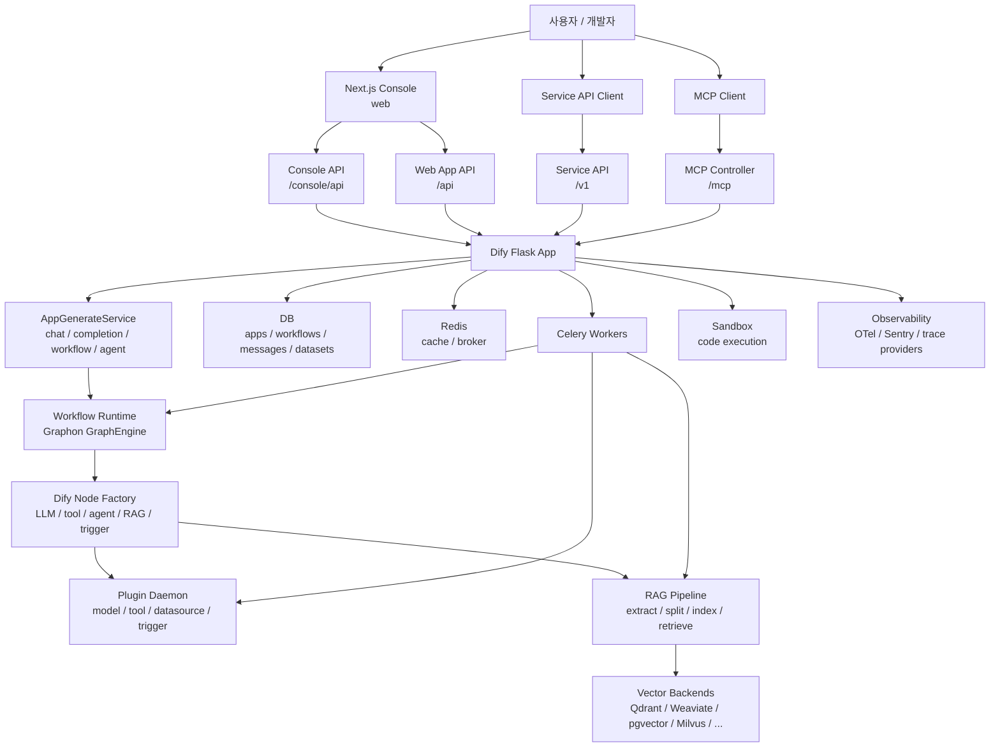
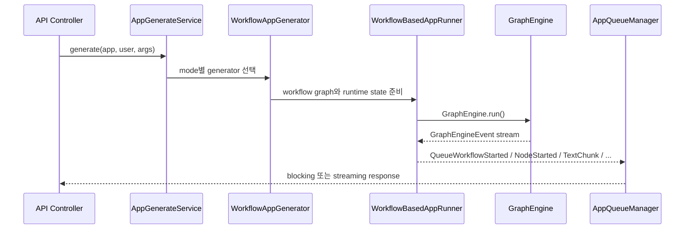

> Analyzed: 2026-05-17
> Package: `dify-api` `1.14.1` / `dify-web` `1.14.1`
> Commit: `cd4d6f8a228612ddb903c5d537add32e1466b5ee`
> Repository: https://github.com/langgenius/dify
> Local path: `~/workspace/opensources/dify`

---

_This article is partially written by Codex_

---

## 1. Why Dify?

Describing Dify simply as "an open-source tool for building LLM apps" undersells it. Opening the actual code reveals a more accurate description: **a productized platform for developing and operating LLM applications**.

The core capabilities listed in the README are workflow, RAG pipeline, agent capability, model management, observability, and Backend-as-a-Service. These are not marketing bullet points — they are boundaries reflected directly in the code.

| Feature                    | Code boundary                                                 |
| -------------------------- | ------------------------------------------------------------- |
| App creation and execution | `api/core/app/apps/*`, `api/services/app_generate_service.py` |
| Workflow runtime           | `api/core/workflow/*`, Graphon-based `GraphEngine`            |
| RAG pipeline               | `api/core/rag/*`, `api/tasks/rag_pipeline/*`                  |
| Models / tools / plugins   | `api/core/plugin/*`, `plugin_daemon` service                  |
| Console UI                 | `web/app/*`, `web/app/components/workflow/*`                  |
| Public API                 | `api/controllers/service_api/*`, `api/controllers/web/*`      |
| MCP                        | `api/controllers/mcp/*`, `api/core/mcp/*`                     |
| Async tasks                | `api/tasks/*`, `api/schedule/*`, Celery                       |

Dify therefore solves a much broader problem than a single agent loop. Rather than just running prompts, it is a system that stores and versions apps built by users, exposes them as APIs, executes them as workflows, builds RAG indexes, connects models and tools as plugins, and records operational logs.

## 2. Where Does It Fit Among Related Projects?

Comparing Dify to other projects analyzed recently makes its position clearer.

If [LangChain](/kb/2026-03-13-langchain-architecture) is a library where developers assemble LLM pipelines in code, Dify elevates that same problem to a product UI and an operations API. If [Ollama](/kb/2026-03-15-ollama-architecture) handles local model serving and model distribution formats, Dify abstracts those kinds of model providers and connects them inside an app builder.

[Ruflo](/kb/2026-05-17-ruflo-architecture) was a project that layers agent orchestration on top of Claude Code. Dify also deals with agents, tools, and MCP, but its center of gravity is **LLM app productization**, not coding-agent operations. Where [agentmemory](/kb/2026-05-13-agentmemory-architecture) digs narrow and deep into a long-term memory layer, Dify's memory and RAG are components embedded within app execution and dataset operations.

In short, Dify reads more naturally as an "LLM app platform" post than as an "agent runtime" post.

## 3. Understanding the Project in One Sentence

**Dify** is an open-source platform that productizes the end-to-end process of building and operating LLM applications by combining a Flask API, Celery workers, a Graphon workflow runtime, a RAG pipeline, a plugin daemon, a Next.js console, and a Docker Compose deployment configuration.

To unpack that further, here are the questions Dify answers:

| Question                             | Dify's answer                                                                                                         |
| ------------------------------------ | --------------------------------------------------------------------------------------------------------------------- |
| Where are apps created and managed?  | The Next.js console in `web` and the `api/controllers/console` API handle this.                                       |
| How do external users invoke an app? | The `service_api`, `web`, and `mcp` controllers provide the public execution surface.                                 |
| How does a workflow execute?         | A stored graph config is turned into a Graphon `Graph`, and `GraphEngine` events are translated to Dify queue events. |
| Where do long-running tasks go?      | Celery workers handle dataset indexing, workflow execution, triggers, mail, and plugin checks.                        |
| How do you swap out the RAG backend? | Backend factories are loaded via the `dify.vector_backends` entry point.                                              |
| Where do models and tools come from? | The plugin daemon exposes model, tool, datasource, trigger, and OAuth runtimes as an external service.                |
| How is the product deployed?         | Docker Compose ties together api, worker, web, redis, db, sandbox, plugin daemon, and nginx.                          |

## 4. Technology Stack

| Area               | Technology                                                                             |
| ------------------ | -------------------------------------------------------------------------------------- |
| Backend API        | Python 3.12, Flask 3, Flask-RESTX, gevent, Socket.IO                                   |
| Workflow runtime   | `graphon`, Dify node factory, GraphEngine layers                                       |
| Async tasks        | Celery, Redis broker/backend                                                           |
| Database           | PostgreSQL (default), MySQL / OceanBase / SeekDB (optional)                            |
| RAG / vector       | Weaviate, Qdrant, pgvector, Milvus, Chroma, Elasticsearch, and other provider packages |
| Plugin             | Separate `dify-plugin-daemon`, HTTP inner API, plugin marketplace                      |
| Frontend           | Next.js 16, React 19, React Flow, TanStack Query, Zustand / Jotai                      |
| Package management | `uv` Python workspace, `pnpm` workspace                                                |
| Observability      | OpenTelemetry, Sentry, trace provider packages                                         |
| Deployment         | Docker Compose, Nginx, SSRF proxy, sandbox service                                     |

Rough scale based on a local checkout:

| Item                                               |  Count |
| -------------------------------------------------- | -----: |
| Git-tracked files                                  | 11,621 |
| Python / TypeScript / JavaScript files             |  9,232 |
| Tracked files under `api`                          |  3,043 |
| Tracked files under `web`                          |  7,401 |
| Tracked files under `api/core`                     |    593 |
| Tracked files under `api/tasks` and `api/schedule` |     74 |

This is not a small web app repository. It is a large product monorepo containing `api`, `web`, `docker`, `providers`, `packages`, `dify-agent`, and `sdks` together.

## 5. The Big Picture

The high-level flow looks like this:



The key insight is that Dify is not structured as a single conversation loop. The console users see, the public API, the workflow engine, RAG indexing, the plugin daemon, the worker queue, and the sandbox are all separated — and that separation is precisely what gives Dify its product character.

## 6. Codebase Map

The essential directories are:

```text
dify/
├── api/
│   ├── app.py                         # Flask app entry point
│   ├── app_factory.py                 # extension bootstrap
│   ├── controllers/                   # console, web, service_api, mcp, trigger
│   ├── core/
│   │   ├── app/                       # per-mode app generator/runner
│   │   ├── workflow/                  # Dify workflow node/runtime adapter
│   │   ├── rag/                       # RAG extraction/index/retrieval
│   │   ├── plugin/                    # plugin daemon client layer
│   │   ├── mcp/                       # MCP server/client protocol
│   │   └── tools/                     # builtin/custom/plugin/MCP tools
│   ├── models/                        # SQLAlchemy models
│   ├── services/                      # application service layer
│   ├── tasks/                         # Celery tasks
│   ├── schedule/                      # periodic Celery tasks
│   └── providers/
│       ├── vdb/                       # vector backend packages
│       └── trace/                     # trace provider packages
├── web/
│   ├── app/                           # Next.js app routes and components
│   ├── app/components/workflow/       # workflow canvas
│   └── service/                       # API client and streaming parser
├── docker/
│   └── docker-compose.yaml            # product deployment topology
├── packages/
│   ├── contracts/                     # OpenAPI contract generation
│   ├── dify-ui/                       # shared UI package
│   └── dev-proxy/
├── dify-agent/                        # separate agent runtime experiment/package
└── sdks/
    ├── nodejs-client/
    └── php-client/
```

`api/core` is the most important area to analyze. It contains app execution, the workflow runtime, RAG, plugins, and MCP all in one place. `api/services`, by contrast, is the layer that wires product domain behavior between API controllers and the core runtime.

## 7. The Deployment Unit Is the Architecture

The fastest way to understand Dify's architecture is to read its Docker Compose file. The default deployment includes the following services:

| Service                     | Role                                                |
| --------------------------- | --------------------------------------------------- |
| `api`                       | Flask API server                                    |
| `api_websocket`             | API instance for Socket.IO / WebSocket              |
| `worker`                    | Celery worker                                       |
| `worker_beat`               | Celery beat scheduler                               |
| `web`                       | Next.js frontend                                    |
| `db_postgres` or `db_mysql` | Primary relational database                         |
| `redis`                     | Celery broker, cache, and lock                      |
| `sandbox`                   | Isolated code execution environment                 |
| `plugin_daemon`             | Model / tool / datasource / trigger plugin runtime  |
| `ssrf_proxy`                | Security boundary for outbound requests             |
| `nginx`                     | External routing                                    |
| Vector stores               | Weaviate, Qdrant, pgvector, Milvus, etc. (optional) |

This configuration matters because Dify does not handle everything in a single Python process. API requests are accepted quickly; long-running work is handed off to the worker queue; plugin execution is delegated to a separate daemon; and dangerous code execution is isolated in a sandbox.

The operational boundaries required by a production LLM platform are drawn here with reasonable honesty.

## 8. The Flask API Is Assembled via Extension Bootstrap

`api/app.py` is very thin. If the command is a DB migration, it creates a migration-only app; otherwise it calls `create_app()`.

The actual assembly happens in `initialize_extensions()` inside `api/app_factory.py`. Extensions are initialized in the following order:

```text
timezone -> logging -> warnings -> import_modules -> orjson
-> database -> metrics -> migrate -> redis -> storage
-> secret key -> logstore -> celery -> login -> mail
-> hosting provider -> sentry -> proxy fix -> blueprints
-> commands -> fastopenapi -> otel -> request logging
```

This is a common pattern in Flask projects, but it is especially significant in Dify because workflow execution, Celery tasks, plugin calls, and tracing are all tied to the Flask app context.

One interesting detail is the separate `create_migrations_app()`. It attaches only the database and migration extensions — so DB work can be performed without spinning up the full product application.

## 9. API Surface: console, web, service, inner, MCP, trigger

`api/extensions/ext_blueprints.py` gives the clearest view of Dify's API surface.

| Blueprint                 | Audience / purpose                              |
| ------------------------- | ----------------------------------------------- |
| `controllers/console`     | Admin console and app builder                   |
| `controllers/web`         | Deployed web app, chatbot, and completion UI    |
| `controllers/service_api` | App execution API called by external developers |
| `controllers/files`       | File upload and preview                         |
| `controllers/inner_api`   | Internal service and plugin daemon calls        |
| `controllers/mcp`         | MCP endpoint                                    |
| `controllers/trigger`     | Webhook, schedule, and plugin triggers          |

This surface separation is important for understanding Dify. Even for the same underlying "app execution," a console test, an end-user web app, a public service API call, and an MCP tool call each have different authentication and response behaviors.

For example, MCP in `api/core/mcp/server/streamable_http.py` exposes a single Dify app as a single MCP tool. `tools/list` returns the app name and input schema; `tools/call` invokes `AppGenerateService.generate()` and converts the result to text content. It is a thin adapter that connects Dify apps to external agent ecosystems.

## 10. Workflow Runtime: Graphon with Dify Context Layered On Top

Dify's workflow engine does not implement all graph primitives from scratch. It uses `graphon`'s `Graph`, `GraphEngine`, `GraphRuntimeState`, `VariablePool`, and `GraphEngineLayer`.

What Dify contributes on top:

| Dify layer               | Role                                                                                             |
| ------------------------ | ------------------------------------------------------------------------------------------------ |
| `WorkflowAppGenerator`   | Converts app, workflow, user, and inputs into execution entities.                                |
| `WorkflowBasedAppRunner` | Builds a `Graph` from the stored graph config and translates GraphEngine events to queue events. |
| `WorkflowEntry`          | Creates the GraphEngine and attaches quota, limits, and the observability layer.                 |
| `DifyNodeFactory`        | Injects Dify model access, memory, tools, files, and the code executor into Graphon nodes.       |
| Workflow nodes           | Adds agent, datasource, knowledge retrieval/index, and trigger node types.                       |

The flow looks roughly like this:



The advantage of this design is that the boundary where the workflow engine meets the product context is kept relatively clean. Graphon owns graph execution; Dify injects tenant, app, workflow, user, quota, file, plugin, and persistence concerns.

## 11. Async Execution: Celery Absorbs Long-Running Work

In Dify, Celery is not an add-on — it is a core execution path.

`api/extensions/ext_celery.py` defines a `FlaskTask` so that tasks run within a Flask app context. A variety of queues are then attached:

| Queue / task domain | Examples                                                  |
| ------------------- | --------------------------------------------------------- |
| Workflow execution  | `workflow_based_app_execution`, `resume_app_execution`    |
| Workflow storage    | Saving workflow / node execution records                  |
| Dataset indexing    | Document indexing, segment indexing, vector index updates |
| RAG pipeline        | `rag_pipeline_run_task`, `priority_rag_pipeline_run_task` |
| Trigger             | Trigger processing, subscription refresh                  |
| Schedule            | Workflow schedule polling                                 |
| Mail                | Invite, password reset, human input delivery              |
| Plugin              | Plugin upgrade checks                                     |
| Retention           | Message / workflow log cleanup                            |

LLM app platforms have a lot of slow work: reading PDFs, creating chunks, generating embeddings, writing to a vector DB, running long workflows, and waiting for human input. Dify keeps all of this off the API request thread and pushes it into queues.

## 12. RAG and the Vector Backend

`api/core/rag` is one of Dify's most important pillars. It is subdivided into file extraction, cleaning, splitting, indexing, retrieval, and reranking.

```text
api/core/rag/
├── extractor/          # pdf, docx, pptx, html, markdown, notion, website, etc.
├── splitter/           # fixed text splitter
├── index_processor/    # paragraph, parent-child, QA index
├── datasource/
│   ├── keyword/
│   └── vdb/            # vector backend factory
├── retrieval/          # dataset retrieval, routing, output parser
├── rerank/             # rerank factory/model
└── pipeline/           # queue and pipeline execution support
```

Vector backends are entry-point-based. `api/core/rag/datasource/vdb/vector_backend_registry.py` discovers backend factories from the `dify.vector_backends` entry point group. The actual backend packages are separated as `api/providers/vdb/vdb-qdrant`, `vdb-weaviate`, `vdb-pgvector`, `vdb-milvus`, and so on.

This design becomes increasingly important as the number of supported vector stores grows. Rather than pulling every vendor dependency directly into the core runtime, Dify extends via provider packages and dependency groups.

## 13. Plugin Daemon: Models, Tools, and Datasources Live Outside the API

The most important thing to understand about Dify's plugin architecture is that the plugin runtime does not run inside the API process. Docker Compose includes a `plugin_daemon` service, and the API calls it over HTTP via `BasePluginClient` in `api/core/plugin/impl/base.py`.

Requests use `PLUGIN_DAEMON_URL` and `PLUGIN_DAEMON_KEY`. The Dify API delegates the following concerns to the plugin daemon:

| Domain                        | Relevant files                                      |
| ----------------------------- | --------------------------------------------------- |
| Model providers and runtime   | `api/core/plugin/impl/model.py`, `model_runtime.py` |
| Tool providers                | `api/core/plugin/impl/tool.py`                      |
| Datasource providers          | `api/core/plugin/impl/datasource.py`                |
| Agent strategy                | `api/core/plugin/impl/agent.py`                     |
| Trigger providers             | `api/core/plugin/impl/trigger.py`                   |
| OAuth                         | `api/core/plugin/impl/oauth.py`                     |
| Marketplace / plugin metadata | `api/core/plugin/impl/plugin.py`                    |

This separation benefits both reliability and operability. The plugin ecosystem changes rapidly and communicates with external providers. Running every plugin in the same memory space as the core API amplifies failure propagation and dependency conflicts. By placing the plugin daemon in its own service, Dify draws a clean boundary.

## 14. Web Frontend: The Workflow Canvas Is the Heart of the Product

`web` is the Next.js-based console. It is far more than a simple admin UI — most of Dify's product experience lives here.

In particular, `web/app/components/workflow` is very large. The block selector, node/edge interaction, workflow run panel, undo/redo, comments, collaborative workflow editing, plugin dependency management, tracing panel, and workflow history are all in this area.

The frontend call layer lives in `web/service`. `web/service/base.ts` handles not only regular fetch calls but also streaming response parsing. It is densely populated with callback hooks for events like `workflow_started`, `node_started`, `text_chunk`, `agent_log`, `human_input_required`, and `workflow_paused`.

In other words, Dify's frontend is less "a screen that displays server data" and more **a layer that translates workflow runtime events into a real-time product experience**.

## 15. MCP and the Agent Layer

Dify exposes two directions of agent connectivity.

The first is exposing Dify apps as MCP tools. The `/mcp` controller converts an app's input schema into an MCP tool schema and maps a tool call to an `AppGenerateService` execution. This path makes Dify apps callable as tools by external agents.

The second is the `dify-agent` package. This package carries the character of a separate agent runtime, including `agenton`, `pydantic-ai-slim`, a FastAPI server, and a Redis run store. Rather than being the central path of the main API, it feels more like a space for experimenting with and refining Dify's agent layer as an independent package.

This is where the difference between Dify and Ruflo becomes clear. Ruflo is building an agent operating system around Claude Code; Dify is embedding agent capabilities and an MCP surface inside an app platform.

## 16. Security and Operational Boundaries

Notable operational boundaries in Dify:

| Boundary                    | Significance                                                                                        |
| --------------------------- | --------------------------------------------------------------------------------------------------- |
| SSRF proxy                  | Reduces the risk of workflow nodes, datasources, or external requests leaking to internal networks. |
| Sandbox                     | Isolates code and tool execution from the API server.                                               |
| Plugin daemon key           | Protects the plugin daemon inner API with a shared secret separate from the API server.             |
| Enterprise license hook     | Checks enterprise license status in `before_request`.                                               |
| CORS separation             | Console, web app, and service API each have distinct allowed headers and origins.                   |
| OpenTelemetry trace headers | Trace context is threaded through the API, plugin daemon, and response headers.                     |
| Celery queue separation     | Dataset, workflow, mail, trigger, and plugin tasks are assigned to separate queues.                 |

An LLM app platform accepts external inputs, external URLs, external files, external model providers, and external plugins. In Dify's architecture, **boundaries matter more than features**.

## 17. Recommended Reading Order for the Code

Diving straight into all of `api/core` leads to disorientation quickly. Here is the order I recommend:

1. Start with `README.md` and `docker/docker-compose.yaml` to understand the product and deployment units.
2. Read `api/app.py`, `api/app_factory.py`, and `api/extensions/ext_blueprints.py` to understand the Flask bootstrap and API surface.
3. Follow `api/services/app_generate_service.py` and `api/core/app/apps/*` to trace execution paths per app mode.
4. Walk through `api/core/app/apps/workflow/app_generator.py` and `api/core/app/apps/workflow_app_runner.py` to understand workflow execution.
5. Read `api/core/workflow/workflow_entry.py` and `api/core/workflow/node_factory.py` to see where Graphon and Dify meet.
6. Look at `api/core/rag/datasource/vdb/vector_backend_registry.py` and `api/providers/vdb/*` to understand RAG backend extensibility.
7. Examine `api/core/plugin/impl/base.py` and `api/core/plugin/impl/*` to understand the plugin daemon boundary.
8. Finish with `web/app/components/workflow` and `web/service/base.ts` to see how runtime events become UI.

## 18. Notable Design Points

The first is **the separation of Graphon and Dify context**. Rather than embedding the graph engine entirely within the product domain, Dify injects tenant, app, user, quota, and persistence concerns via a node factory and layers.

The second is **the plugin daemon as a separate service**. Model and tool providers are the highest-volatility area of the system. Keeping that area in its own service is a strategic advantage for growing Dify's marketplace and provider ecosystem.

The third is **the vector backend entry point structure**. There is a clear intent here: support many vector stores without turning the core package into a blob of vendor dependencies — instead, extend through provider packages and dependency groups.

The fourth is **the frontend's deep understanding of runtime events**. The workflow canvas is not a simple CRUD UI; it receives `GraphEngine` event streams and translates execution state, node results, human input, and tracing into a live interface.

## 19. Things to Watch Out For

The first is complexity. Dify's feature surface is broad, so even a small change can touch the API, workers, the plugin daemon, the frontend, and migrations together. Always ask: "which layer owns this responsibility?"

The second is the boundary between external packages and internal adapters. Graphon, the plugin daemon, vector providers, and trace providers all move on independent axes. Adapter layer compatibility becomes critical during version upgrades.

The third is the breadth of deployment options. Docker Compose accommodates many vector store and database options. In a production environment, only the backends actually in use should remain, and environment variables should be managed strictly.

The fourth is the position of agent functionality. Dify supports agents, but the center of gravity of the entire repository is the app platform, not an agent framework. Coming in looking only for an agent runtime risks missing the core structure entirely.

## 20. Conclusion

Dify is a much larger project than "a prompt app builder." By combining a Flask API, a Graphon workflow engine, Celery workers, a RAG pipeline, a plugin daemon, a Next.js workflow canvas, an MCP endpoint, a sandbox, and observability, it productizes the layers needed to run LLM applications as real services.

Personally, the most instructive aspect of Dify is **the way it draws product boundaries around LLM capabilities**. Model invocation, tool invocation, RAG indexing, workflow execution, the public API, and the UI event stream are each treated as separate responsibilities, connected by a service layer, a queue, and the plugin daemon.

If you want to understand what problems multiply when moving an LLM app from prototype to production, Dify is an excellent subject. It is not a simple agent loop — it is a very large answer to the question: "how much should an LLM app platform be responsible for?"
