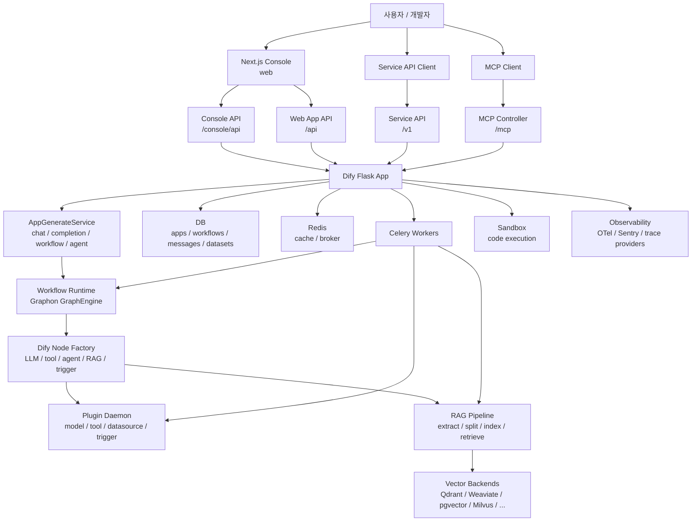
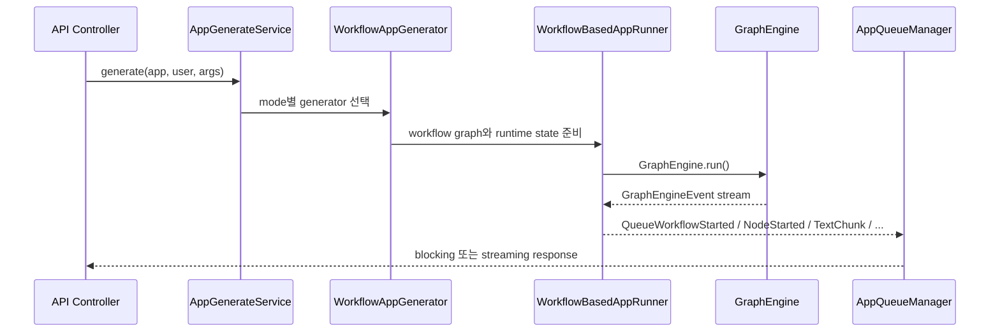

> 분석 일자: 2026-05-17
> 대상 버전: `dify-api` `1.14.1` / `dify-web` `1.14.1`
> 대상 커밋: `cd4d6f8a228612ddb903c5d537add32e1466b5ee`
> 저장소: https://github.com/langgenius/dify
> 로컬 분석 경로: `~/workspace/opensources/dify`

---

_This article is partially written by Codex_

## 목차

1. [왜 Dify인가요?](#1-왜-dify인가요)
2. [기존 글들과 어디에 연결되나요?](#2-기존-글들과-어디에-연결되나요)
3. [프로젝트를 한 문장으로 이해하기](#3-프로젝트를-한-문장으로-이해하기)
4. [기술 스택](#4-기술-스택)
5. [전체 그림](#5-전체-그림)
6. [코드베이스 지도](#6-코드베이스-지도)
7. [배포 단위가 곧 아키텍처입니다](#7-배포-단위가-곧-아키텍처입니다)
8. [Flask API는 extension bootstrap으로 조립됩니다](#8-flask-api는-extension-bootstrap으로-조립됩니다)
9. [API 표면: console, web, service, inner, MCP, trigger](#9-api-표면-console-web-service-inner-mcp-trigger)
10. [Workflow runtime: Graphon 위에 Dify 문맥을 얹습니다](#10-workflow-runtime-graphon-위에-dify-문맥을-얹습니다)
11. [비동기 실행: Celery가 긴 작업을 흡수합니다](#11-비동기-실행-celery가-긴-작업을-흡수합니다)
12. [RAG와 vector backend](#12-rag와-vector-backend)
13. [Plugin daemon: 모델, 도구, datasource를 밖으로 분리합니다](#13-plugin-daemon-모델-도구-datasource를-밖으로-분리합니다)
14. [Web frontend: workflow canvas가 제품의 중심입니다](#14-web-frontend-workflow-canvas가-제품의-중심입니다)
15. [MCP와 agent layer](#15-mcp와-agent-layer)
16. [보안과 운영 지점](#16-보안과-운영-지점)
17. [코드를 읽는 추천 순서](#17-코드를-읽는-추천-순서)
18. [인상적인 설계 포인트](#18-인상적인-설계-포인트)
19. [주의해서 볼 지점](#19-주의해서-볼-지점)
20. [결론](#20-결론)

---

## 1. 왜 Dify인가요?

Dify는 "LLM 앱을 만들 수 있는 오픈소스 툴"이라고만 보면 조금 작게 보입니다. 실제 코드를 열어 보면 더 정확한 표현은 **LLM 앱 개발과 운영을 위한 제품형 플랫폼**입니다.

README에서 말하는 핵심 기능은 workflow, RAG pipeline, agent capability, model management, observability, Backend-as-a-Service입니다. 이 기능들은 마케팅 문구가 아니라 실제 코드 경계로 나뉘어 있습니다.

| 기능               | 코드에서 보이는 경계                                          |
| ------------------ | ------------------------------------------------------------- |
| 앱 생성과 실행     | `api/core/app/apps/*`, `api/services/app_generate_service.py` |
| Workflow runtime   | `api/core/workflow/*`, `graphon` 기반 `GraphEngine`           |
| RAG pipeline       | `api/core/rag/*`, `api/tasks/rag_pipeline/*`                  |
| 모델/도구/플러그인 | `api/core/plugin/*`, `plugin_daemon` 서비스                   |
| 콘솔 UI            | `web/app/*`, `web/app/components/workflow/*`                  |
| 공개 API           | `api/controllers/service_api/*`, `api/controllers/web/*`      |
| MCP                | `api/controllers/mcp/*`, `api/core/mcp/*`                     |
| 비동기 작업        | `api/tasks/*`, `api/schedule/*`, Celery                       |

그래서 Dify는 단일 agent loop보다 훨씬 넓은 문제를 풉니다. 프롬프트를 실행하는 것이 아니라, 사용자가 만든 앱을 저장하고, 버전 관리하고, API로 노출하고, 워크플로로 실행하고, RAG 인덱스를 만들고, 모델과 도구를 플러그인으로 연결하고, 운영 로그까지 남기는 시스템입니다.

## 2. 기존 글들과 어디에 연결되나요?

최근에 분석한 프로젝트들과 비교하면 Dify의 위치가 더 선명합니다.

[LangChain](/kb/2026-03-13-langchain-architecture)이 개발자가 코드로 LLM pipeline을 조립하는 라이브러리라면, Dify는 같은 문제를 제품 UI와 운영 API로 끌어올립니다. [Ollama](/kb/2026-03-15-ollama-architecture)가 로컬 모델 실행 서버와 모델 배포 형식을 다룬다면, Dify는 그런 모델 제공자들을 추상화해서 앱 빌더 안에 연결합니다.

[Ruflo](/kb/2026-05-17-ruflo-architecture)는 Claude Code 주변에 agent orchestration 계층을 붙이는 프로젝트였습니다. Dify도 agent, tool, MCP를 다루지만 중심은 코딩 에이전트 운영이 아니라 **LLM 앱 제품화**입니다. [agentmemory](/kb/2026-05-13-agentmemory-architecture)가 장기 기억 계층을 좁고 깊게 파고들었다면, Dify의 memory와 RAG는 앱 실행과 dataset 운영 안에 들어간 부품으로 배치됩니다.

즉 Dify는 "agent runtime" 글보다는 "LLM app platform" 글로 읽는 편이 자연스럽습니다.

## 3. 프로젝트를 한 문장으로 이해하기

**Dify**는 Flask API, Celery worker, Graphon workflow runtime, RAG pipeline, plugin daemon, Next.js 콘솔, Docker Compose 배포 구성을 묶어서 **LLM 애플리케이션을 만들고 운영하는 과정을 제품화한 오픈소스 플랫폼**입니다.

조금 더 풀면 다음 질문들에 대한 답입니다.

| 질문                                  | Dify의 답                                                                                            |
| ------------------------------------- | ---------------------------------------------------------------------------------------------------- |
| 앱은 어디에서 만들고 관리하나요?      | `web`의 Next.js 콘솔과 `api/controllers/console` API가 담당합니다.                                   |
| 외부 사용자는 앱을 어떻게 호출하나요? | `service_api`, `web`, `mcp` controller가 공개 실행 표면을 제공합니다.                                |
| Workflow는 어떻게 실행되나요?         | 저장된 graph config를 Graphon `Graph`로 만들고 `GraphEngine` 이벤트를 Dify queue event로 변환합니다. |
| 긴 작업은 어디로 가나요?              | Celery worker가 dataset indexing, workflow execution, trigger, mail, plugin check를 처리합니다.      |
| RAG backend는 어떻게 갈아끼우나요?    | `dify.vector_backends` entry point로 vector backend factory를 로딩합니다.                            |
| 모델과 도구는 어디에서 오나요?        | plugin daemon이 model, tool, datasource, trigger, OAuth runtime을 외부 서비스로 제공합니다.          |
| 제품은 어떻게 배포하나요?             | Docker Compose가 api, worker, web, redis, db, sandbox, plugin daemon, nginx를 묶습니다.              |

## 4. 기술 스택

| 영역             | 기술                                                                          |
| ---------------- | ----------------------------------------------------------------------------- |
| Backend API      | Python 3.12, Flask 3, Flask-RESTX, gevent, Socket.IO                          |
| Workflow runtime | `graphon`, Dify node factory, GraphEngine layers                              |
| 비동기 작업      | Celery, Redis broker/backend                                                  |
| 데이터베이스     | PostgreSQL 기본, MySQL/OceanBase/SeekDB 옵션                                  |
| RAG/vector       | Weaviate, Qdrant, pgvector, Milvus, Chroma, Elasticsearch 등 provider package |
| Plugin           | 별도 `dify-plugin-daemon`, HTTP inner API, plugin marketplace                 |
| Frontend         | Next.js 16, React 19, React Flow, TanStack Query, Zustand/Jotai               |
| 패키지 관리      | `uv` Python workspace, `pnpm` workspace                                       |
| 관측성           | OpenTelemetry, Sentry, trace provider packages                                |
| 배포             | Docker Compose, Nginx, SSRF proxy, sandbox service                            |

로컬 체크아웃 기준의 대략적인 규모는 다음과 같습니다.

| 항목                                           |     수치 |
| ---------------------------------------------- | -------: |
| Git 추적 파일 수                               | 11,621개 |
| Python/TypeScript/JavaScript 계열 파일 수      |  9,232개 |
| `api` 아래 추적 파일 수                        |  3,043개 |
| `web` 아래 추적 파일 수                        |  7,401개 |
| `api/core` 아래 추적 파일 수                   |    593개 |
| `api/tasks`와 `api/schedule` 아래 추적 파일 수 |     74개 |

작은 웹앱 저장소가 아닙니다. `api`, `web`, `docker`, `providers`, `packages`, `dify-agent`, `sdks`가 함께 있는 대형 제품 monorepo입니다.

## 5. 전체 그림

큰 흐름은 아래처럼 볼 수 있습니다.



핵심은 Dify가 하나의 대화 loop로 구성되지 않는다는 점입니다. 사용자가 보는 콘솔, 공개 API, workflow engine, RAG indexing, plugin daemon, worker queue, sandbox가 분리되어 있고, 이 분리 자체가 Dify의 제품성을 만듭니다.

## 6. 코드베이스 지도

핵심 디렉터리는 다음과 같습니다.

```text
dify/
├── api/
│   ├── app.py                         # Flask 앱 진입점
│   ├── app_factory.py                 # extension bootstrap
│   ├── controllers/                   # console, web, service_api, mcp, trigger
│   ├── core/
│   │   ├── app/                       # 앱 모드별 generator/runner
│   │   ├── workflow/                  # Dify workflow node/runtime adapter
│   │   ├── rag/                       # RAG extraction/index/retrieval
│   │   ├── plugin/                    # plugin daemon client layer
│   │   ├── mcp/                       # MCP server/client protocol
│   │   └── tools/                     # builtin/custom/plugin/MCP tools
│   ├── models/                        # SQLAlchemy model
│   ├── services/                      # application service layer
│   ├── tasks/                         # Celery tasks
│   ├── schedule/                      # periodic Celery tasks
│   └── providers/
│       ├── vdb/                       # vector backend packages
│       └── trace/                     # trace provider packages
├── web/
│   ├── app/                           # Next.js app routes and components
│   ├── app/components/workflow/       # workflow canvas
│   └── service/                       # API client and streaming parser
├── docker/
│   └── docker-compose.yaml            # product deployment topology
├── packages/
│   ├── contracts/                     # OpenAPI contract generation
│   ├── dify-ui/                       # shared UI package
│   └── dev-proxy/
├── dify-agent/                        # separate agent runtime experiment/package
└── sdks/
    ├── nodejs-client/
    └── php-client/
```

`api/core`가 가장 중요한 분석 대상입니다. 여기에 앱 실행, workflow runtime, RAG, plugin, MCP가 모두 들어 있습니다. 반면 `api/services`는 제품 도메인 동작을 API controller와 core runtime 사이에서 엮는 계층입니다.

## 7. 배포 단위가 곧 아키텍처입니다

Dify는 Docker Compose를 보면 아키텍처가 빠르게 보입니다. 기본 배포에는 다음 서비스들이 등장합니다.

| 서비스                        | 역할                                                 |
| ----------------------------- | ---------------------------------------------------- |
| `api`                         | Flask API 서버                                       |
| `api_websocket`               | Socket.IO/WebSocket용 API 인스턴스                   |
| `worker`                      | Celery worker                                        |
| `worker_beat`                 | Celery beat scheduler                                |
| `web`                         | Next.js frontend                                     |
| `db_postgres` 또는 `db_mysql` | 주요 관계형 데이터베이스                             |
| `redis`                       | Celery broker, cache, lock                           |
| `sandbox`                     | 코드 실행 격리 환경                                  |
| `plugin_daemon`               | 모델/도구/datasource/trigger plugin runtime          |
| `ssrf_proxy`                  | 외부 요청 보안 경계                                  |
| `nginx`                       | 외부 라우팅                                          |
| vector store들                | Weaviate, Qdrant, pgvector, Milvus 등 선택형 backend |

이 구성이 중요한 이유는 Dify가 단순히 Python 프로세스 하나로 모든 일을 처리하지 않기 때문입니다. API 요청은 빠르게 받고, 오래 걸리는 작업은 worker queue로 넘기고, plugin 실행은 별도 daemon에 맡기며, 위험한 코드 실행은 sandbox로 격리합니다.

제품형 LLM 플랫폼에서 필요한 경계를 꽤 정직하게 나눴습니다.

## 8. Flask API는 extension bootstrap으로 조립됩니다

`api/app.py`는 매우 얇습니다. DB migration 명령이면 migration용 앱만 만들고, 일반 실행이면 `create_app()`을 호출합니다.

실제 조립은 `api/app_factory.py`의 `initialize_extensions()`에 있습니다. 여기에서 다음 extension들이 순서대로 초기화됩니다.

```text
timezone -> logging -> warnings -> import_modules -> orjson
-> database -> metrics -> migrate -> redis -> storage
-> secret key -> logstore -> celery -> login -> mail
-> hosting provider -> sentry -> proxy fix -> blueprints
-> commands -> fastopenapi -> otel -> request logging
```

이 방식은 Flask 프로젝트에서 흔히 보는 pattern이지만, Dify에서는 특히 중요합니다. workflow 실행, Celery task, plugin 호출, tracing이 모두 Flask app context와 연결되기 때문입니다.

흥미로운 점은 `create_migrations_app()`을 따로 둔 부분입니다. migration 명령에는 database와 migration extension만 붙입니다. 제품 앱 전체를 띄우지 않아도 DB 작업을 수행할 수 있게 만든 구조입니다.

## 9. API 표면: console, web, service, inner, MCP, trigger

`api/extensions/ext_blueprints.py`는 Dify의 API 표면을 가장 잘 보여 줍니다.

| Blueprint                 | 대상                                   |
| ------------------------- | -------------------------------------- |
| `controllers/console`     | 관리자 콘솔과 앱 빌더                  |
| `controllers/web`         | 배포된 web app, chatbot, completion UI |
| `controllers/service_api` | 외부 개발자가 호출하는 앱 실행 API     |
| `controllers/files`       | 파일 업로드와 preview                  |
| `controllers/inner_api`   | 내부 서비스와 plugin daemon 호출       |
| `controllers/mcp`         | MCP endpoint                           |
| `controllers/trigger`     | webhook, schedule, plugin trigger      |

이 표면 분리는 Dify를 이해할 때 중요합니다. 같은 "앱 실행"이라도 콘솔 테스트, end-user web app, public service API, MCP tool call은 인증 방식과 응답 방식이 다릅니다.

예를 들어 MCP는 `api/core/mcp/server/streamable_http.py`에서 Dify 앱 하나를 MCP tool 하나로 노출합니다. `tools/list`에서는 앱 이름과 input schema를 반환하고, `tools/call`에서는 `AppGenerateService.generate()`를 호출한 뒤 결과를 text content로 변환합니다. Dify 앱을 외부 agent ecosystem에 연결하는 얇은 adapter입니다.

## 10. Workflow runtime: Graphon 위에 Dify 문맥을 얹습니다

Dify의 workflow engine은 저장소 안에서 직접 모든 graph primitive를 구현하지 않습니다. `graphon` 패키지의 `Graph`, `GraphEngine`, `GraphRuntimeState`, `VariablePool`, `GraphEngineLayer`를 사용합니다.

Dify가 담당하는 부분은 다음과 같습니다.

| Dify 계층                | 역할                                                                              |
| ------------------------ | --------------------------------------------------------------------------------- |
| `WorkflowAppGenerator`   | app, workflow, user, inputs를 실행 entity로 변환합니다.                           |
| `WorkflowBasedAppRunner` | graph config를 `Graph`로 만들고 GraphEngine event를 queue event로 변환합니다.     |
| `WorkflowEntry`          | GraphEngine을 만들고 quota, limits, observability layer를 붙입니다.               |
| `DifyNodeFactory`        | Graphon node에 Dify model access, memory, tool, file, code executor를 주입합니다. |
| workflow nodes           | agent, datasource, knowledge retrieval/index, trigger 계열 node를 추가합니다.     |

흐름은 대략 다음과 같습니다.



이 구조의 장점은 workflow engine과 제품 문맥이 섞이는 지점을 비교적 명확하게 둔다는 점입니다. Graphon은 graph 실행을 담당하고, Dify는 tenant, app, workflow, user, quota, file, plugin, persistence를 주입합니다.

## 11. 비동기 실행: Celery가 긴 작업을 흡수합니다

Dify에서 Celery는 부가 기능이 아니라 핵심 실행 경로입니다.

`api/extensions/ext_celery.py`는 Flask app context 안에서 task가 실행되도록 `FlaskTask`를 정의합니다. 이후 다양한 queue가 붙습니다.

| Queue/Task 영역    | 예시                                                      |
| ------------------ | --------------------------------------------------------- |
| workflow execution | `workflow_based_app_execution`, `resume_app_execution`    |
| workflow storage   | workflow/node execution 저장                              |
| dataset indexing   | document indexing, segment indexing, vector index update  |
| rag pipeline       | `rag_pipeline_run_task`, `priority_rag_pipeline_run_task` |
| trigger            | trigger processing, subscription refresh                  |
| schedule           | workflow schedule polling                                 |
| mail               | invite, reset password, human input delivery              |
| plugin             | plugin upgrade check                                      |
| retention          | message/workflow log cleanup                              |

LLM 앱 플랫폼은 느린 작업이 많습니다. PDF를 읽고, chunk를 만들고, embedding을 생성하고, vector DB에 넣고, workflow를 오래 돌리고, 사람이 입력할 때까지 대기합니다. Dify는 이 작업들을 API request thread에 묶지 않고 queue로 밀어냅니다.

## 12. RAG와 vector backend

`api/core/rag`는 Dify의 중요한 축입니다. 파일 추출, 정제, splitting, indexing, retrieval, rerank가 하위 모듈로 나뉘어 있습니다.

```text
api/core/rag/
├── extractor/          # pdf, docx, pptx, html, markdown, notion, website 등
├── splitter/           # fixed text splitter
├── index_processor/    # paragraph, parent-child, QA index
├── datasource/
│   ├── keyword/
│   └── vdb/            # vector backend factory
├── retrieval/          # dataset retrieval, routing, output parser
├── rerank/             # rerank factory/model
└── pipeline/           # queue and pipeline execution support
```

vector backend는 entry point 기반입니다. `api/core/rag/datasource/vdb/vector_backend_registry.py`는 `dify.vector_backends` entry point group에서 backend factory를 찾습니다. 실제 backend package는 `api/providers/vdb/vdb-qdrant`, `vdb-weaviate`, `vdb-pgvector`, `vdb-milvus`처럼 분리되어 있습니다.

이 설계는 Dify가 지원하는 vector store 수가 많아질수록 중요합니다. core runtime이 모든 vendor dependency를 직접 품지 않고, provider package와 dependency group으로 확장하는 방식입니다.

## 13. Plugin daemon: 모델, 도구, datasource를 밖으로 분리합니다

Dify의 plugin 구조에서 가장 중요한 점은 plugin runtime이 API 프로세스 안에 직접 들어오지 않는다는 점입니다. Docker Compose에는 `plugin_daemon` 서비스가 있고, API는 `api/core/plugin/impl/base.py`의 `BasePluginClient`를 통해 HTTP로 호출합니다.

요청에는 `PLUGIN_DAEMON_URL`과 `PLUGIN_DAEMON_KEY`가 사용됩니다. Dify API는 다음 영역을 plugin daemon에 위임합니다.

| 영역                        | 관련 파일                                           |
| --------------------------- | --------------------------------------------------- |
| 모델 provider와 runtime     | `api/core/plugin/impl/model.py`, `model_runtime.py` |
| tool provider               | `api/core/plugin/impl/tool.py`                      |
| datasource provider         | `api/core/plugin/impl/datasource.py`                |
| agent strategy              | `api/core/plugin/impl/agent.py`                     |
| trigger provider            | `api/core/plugin/impl/trigger.py`                   |
| OAuth                       | `api/core/plugin/impl/oauth.py`                     |
| marketplace/plugin metadata | `api/core/plugin/impl/plugin.py`                    |

이 분리는 안전성과 운영성 모두에 도움이 됩니다. plugin ecosystem은 빠르게 변하고 외부 provider와 통신합니다. core API 프로세스와 같은 메모리 공간에서 모든 plugin을 실행하면 장애 전파와 dependency 충돌이 커집니다. Dify는 plugin daemon을 별도 서비스로 두어 그 경계를 분리했습니다.

## 14. Web frontend: workflow canvas가 제품의 중심입니다

`web`은 Next.js 기반 콘솔입니다. 단순 관리 UI가 아니라 Dify의 제품 경험 대부분이 들어 있습니다.

특히 `web/app/components/workflow`는 매우 큽니다. block selector, node/edge interaction, workflow run panel, undo/redo, comment, collaborative workflow, plugin dependency, tracing panel, workflow history가 모두 이 영역에 있습니다.

프론트엔드 호출 계층은 `web/service`에 있습니다. `web/service/base.ts`는 일반 fetch뿐 아니라 streaming response를 해석합니다. 여기에는 `workflow_started`, `node_started`, `text_chunk`, `agent_log`, `human_input_required`, `workflow_paused` 같은 callback hook이 빼곡히 정의되어 있습니다.

즉 Dify의 frontend는 "서버 데이터를 보여주는 화면"보다 **workflow runtime event를 실시간 제품 경험으로 바꾸는 계층**에 가깝습니다.

## 15. MCP와 agent layer

Dify에는 두 가지 방향의 agent 연결이 보입니다.

첫 번째는 Dify app을 MCP tool로 노출하는 경로입니다. `/mcp` controller는 app input schema를 MCP tool schema로 변환하고, tool call을 `AppGenerateService` 실행으로 바꿉니다. 이 경로는 Dify 앱을 외부 agent가 호출할 수 있는 도구로 만드는 데 유용합니다.

두 번째는 `dify-agent` 패키지입니다. 이 패키지는 `agenton`, `pydantic-ai-slim`, FastAPI server, Redis run store를 포함한 별도 agent runtime 성격을 띱니다. 현재 메인 API의 가장 중심 경로라기보다는 Dify agent layer를 독립 패키지로 실험하고 정리하는 공간에 가깝습니다.

여기서 Dify와 Ruflo의 차이가 드러납니다. Ruflo는 Claude Code 주변에 에이전트 운영체제를 세우려는 쪽이고, Dify는 앱 플랫폼 안에 agent 기능과 MCP surface를 넣는 쪽입니다.

## 16. 보안과 운영 지점

Dify에서 눈에 띄는 운영 경계는 다음과 같습니다.

| 지점                       | 의미                                                                      |
| -------------------------- | ------------------------------------------------------------------------- |
| SSRF proxy                 | workflow node, datasource, 외부 요청이 내부망으로 새는 문제를 줄입니다.   |
| sandbox                    | 코드 실행과 도구 실행을 API 서버에서 분리합니다.                          |
| plugin daemon key          | plugin daemon inner API를 API 서버와 분리된 shared secret으로 보호합니다. |
| enterprise license hook    | `before_request`에서 enterprise license 상태를 검사합니다.                |
| CORS 분리                  | console, web, service API별 허용 header/origin이 다릅니다.                |
| OpenTelemetry trace header | API, plugin daemon, response header까지 trace context를 이어 갑니다.      |
| Celery queue 분리          | dataset, workflow, mail, trigger, plugin 작업을 queue별로 나눕니다.       |

LLM 앱 플랫폼은 외부 입력, 외부 URL, 외부 파일, 외부 모델 provider, 외부 plugin을 모두 받습니다. 그래서 Dify의 아키텍처에서는 기능보다 경계가 더 중요합니다.

## 17. 코드를 읽는 추천 순서

처음부터 `api/core` 전체를 읽으면 금방 길을 잃습니다. 저는 다음 순서를 추천합니다.

1. `README.md`와 `docker/docker-compose.yaml`로 제품 단위와 배포 단위를 먼저 봅니다.
2. `api/app.py`, `api/app_factory.py`, `api/extensions/ext_blueprints.py`로 Flask bootstrap과 API 표면을 확인합니다.
3. `api/services/app_generate_service.py`와 `api/core/app/apps/*`로 app mode별 실행 경로를 봅니다.
4. `api/core/app/apps/workflow/app_generator.py`와 `api/core/app/apps/workflow_app_runner.py`로 workflow 실행을 따라갑니다.
5. `api/core/workflow/workflow_entry.py`, `api/core/workflow/node_factory.py`로 Graphon과 Dify가 만나는 지점을 봅니다.
6. `api/core/rag/datasource/vdb/vector_backend_registry.py`와 `api/providers/vdb/*`로 RAG backend 확장을 봅니다.
7. `api/core/plugin/impl/base.py`와 `api/core/plugin/impl/*`로 plugin daemon 경계를 봅니다.
8. `web/app/components/workflow`와 `web/service/base.ts`로 runtime event가 UI로 바뀌는 흐름을 봅니다.

## 18. 인상적인 설계 포인트

첫 번째는 **Graphon과 Dify 문맥의 분리**입니다. graph engine 자체를 제품 도메인에 완전히 묶지 않고, node factory와 layer로 Dify의 tenant/app/user/quota/persistence를 주입합니다.

두 번째는 **plugin daemon 분리**입니다. 모델과 도구 provider는 가장 변동성이 큰 영역입니다. 이 영역을 별도 서비스로 둔 선택은 Dify가 marketplace와 provider 생태계를 키우는 데 유리합니다.

세 번째는 **vector backend entry point 구조**입니다. 많은 vector store를 지원하면서 core package를 vendor dependency 덩어리로 만들지 않으려는 의도가 보입니다.

네 번째는 **frontend가 runtime event를 깊게 이해한다는 점**입니다. workflow canvas는 단순 CRUD UI가 아니라 GraphEngine event stream을 받아 실행 상태, node result, human input, tracing을 화면으로 변환합니다.

## 19. 주의해서 볼 지점

첫 번째는 복잡도입니다. Dify는 기능 폭이 넓어서 작은 변경도 API, worker, plugin daemon, frontend, migration을 함께 건드릴 수 있습니다. "어느 계층의 책임인가"를 계속 확인해야 합니다.

두 번째는 외부 패키지와 내부 adapter의 경계입니다. Graphon, plugin daemon, vector provider, trace provider가 모두 별도 축으로 움직입니다. 버전 upgrade 때 adapter 계층의 호환성이 중요합니다.

세 번째는 배포 옵션의 폭입니다. Docker Compose는 많은 vector store와 DB 옵션을 품고 있습니다. 운영 환경에서는 실제로 쓰는 backend만 남기고 환경 변수를 엄격하게 관리해야 합니다.

네 번째는 agent 기능의 위치입니다. Dify는 agent를 지원하지만, 저장소 전체의 중심은 agent framework가 아니라 app platform입니다. agent runtime만 보려고 들어오면 핵심 구조를 놓칠 수 있습니다.

## 20. 결론

Dify는 "프롬프트 앱 빌더"보다 훨씬 큰 프로젝트입니다. Flask API, Graphon workflow engine, Celery worker, RAG pipeline, plugin daemon, Next.js workflow canvas, MCP endpoint, sandbox, observability를 묶어 LLM 앱을 실제 서비스로 운영하는 데 필요한 계층을 제품화하고 있습니다.

개인적으로 Dify에서 가장 배울 만한 지점은 **LLM 기능을 제품 경계로 나누는 방식**입니다. 모델 호출, 도구 호출, RAG indexing, workflow execution, public API, UI event stream을 각각 별도 책임으로 나누고, 그 사이를 service layer와 queue, plugin daemon으로 연결합니다.

LLM 앱을 prototype에서 production으로 옮길 때 어떤 문제가 늘어나는지 보고 싶다면, Dify는 좋은 분석 대상입니다. 단순한 agent loop가 아니라 "LLM 앱 플랫폼은 어디까지 책임져야 하는가"라는 질문에 대한 매우 큰 답안입니다.
