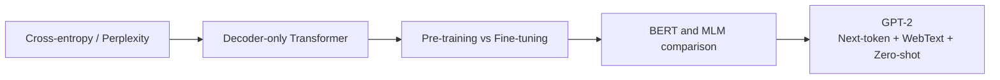
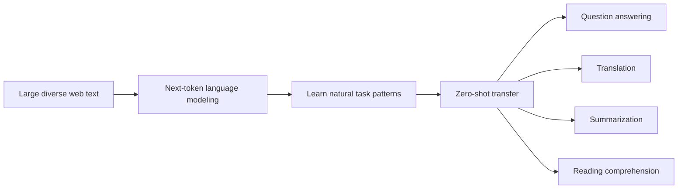
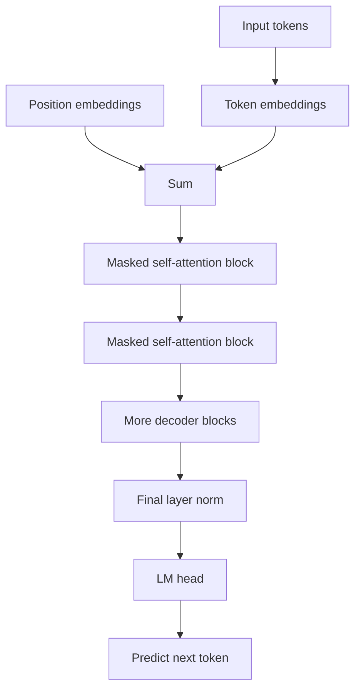
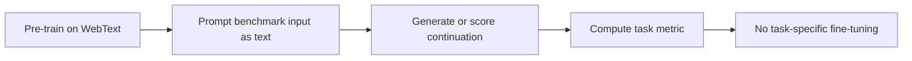
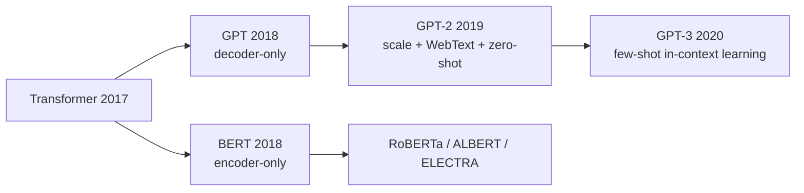

## Paper Info

- Title: Language Models are Unsupervised Multitask Learners
- Authors: Alec Radford, Jeffrey Wu, Rewon Child, David Luan, Dario Amodei, Ilya Sutskever
- Year: 2019
- URL: https://cdn.openai.com/better-language-models/language_models_are_unsupervised_multitask_learners.pdf
- OpenAI blog: https://openai.com/index/better-language-models/
- Code/model repo: https://github.com/openai/gpt-2
- 1.5B release note: https://openai.com/index/gpt-2-1-5b-release/

## One-Line Summary

GPT-2 demonstrates that a decoder-only Transformer trained solely on **next-token prediction** over large-scale web text can begin performing tasks like translation, question answering, reading comprehension, and summarization to a meaningful degree — without any task-specific fine-tuning.

## Background Knowledge for Reading GPT-2

You do not need to have mastered every background concept before reading GPT-2.
That said, having even a rough grasp of the concepts below will make the paper considerably easier to follow.

| Background concept            | Why it matters for GPT-2                                                                                        | Suggested note                                                                                                                        |
| ----------------------------- | --------------------------------------------------------------------------------------------------------------- | ------------------------------------------------------------------------------------------------------------------------------------- |
| Probability and softmax       | The model assigns a score to each candidate next token and interprets those scores as probabilities.            | [Softmax and probability interpretation](/kb/2026-04-17-llm-math-basics-softmax)                                                      |
| Cross-entropy and perplexity  | These are the key metrics for understanding GPT-2's training objective and language modeling benchmark results. | [Cross-entropy and perplexity](/kb/2026-04-17-llm-learning-basics-cross-entropy-perplexity)                                           |
| Self-Attention and Q, K, V    | Determines which preceding tokens in the context the decoder block should attend to.                            | [Q, K, V intuition](/kb/2026-04-17-transformer-basics-qkv-intuition)                                                                  |
| Transformer block             | GPT-2 is a stack of multiple Transformer decoder blocks.                                                        | [Residual, LayerNorm, FFN](/kb/2026-04-17-transformer-basics-residual-layernorm-ffn)                                                  |
| Encoder and Decoder           | Helps you understand why GPT-2 belongs to the decoder side of the original Transformer.                         | [Encoder and Decoder](/kb/2026-04-18-transformer-basics-encoder-decoder)                                                              |
| Encoder-only vs. Decoder-only | Essential for understanding the most fundamental architectural difference between BERT and GPT-2.               | [Encoder-only and Decoder-only](/kb/2026-04-18-llm-architecture-basics-encoder-only-decoder-only)                                     |
| Pre-training and Fine-tuning  | Lets you understand what it means that GPT-2 is evaluated zero-shot without task-specific fine-tuning.          | [Pre-training and Fine-tuning](/kb/2026-04-18-llm-learning-basics-pretraining-finetuning)                                             |
| BERT and MLM                  | Enables a comparison between GPT-2's next-token prediction and BERT's masked language model.                    | [BERT paper notes](/kb/2026-04-18-bert-paper-note), [Masked Language Model](/kb/2026-04-18-llm-learning-basics-masked-language-model) |

If you want the minimal reading path, this order works well:

1. [Cross-entropy and perplexity](/kb/2026-04-17-llm-learning-basics-cross-entropy-perplexity)
2. [Encoder-only and Decoder-only](/kb/2026-04-18-llm-architecture-basics-encoder-only-decoder-only)
3. [Pre-training and Fine-tuning](/kb/2026-04-18-llm-learning-basics-pretraining-finetuning)
4. The model architecture and MLM sections of the [BERT paper notes](/kb/2026-04-18-bert-paper-note)
5. These GPT-2 paper notes

Following just these five steps is enough to fully unpack GPT-2's core claim:
"A large-scale decoder-only language model exhibits zero-shot task transfer through next-token prediction alone."



Some concepts do not yet have dedicated background notes.
`tokenization`, `byte-level BPE`, `benchmark contamination`, and `staged release` are explained in context as they appear throughout this note.

## A Quick Primer for First-Time Readers

Where [BERT](/kb/2026-04-18-bert-paper-note) took the approach of "read a sentence bidirectionally to build a rich representation," GPT-2 pushes hard in the opposite direction: ["keep predicting the next token using only the left context](/kb/2026-04-18-llm-architecture-basics-encoder-only-decoder-only)."

At first glance, this approach seems straightforward.

- Read the input text from left to right.
- Predict the next token.
- If wrong, the [cross-entropy loss](/kb/2026-04-17-llm-learning-basics-cross-entropy-perplexity) grows.
- Repeat this process over an enormous amount of web text.

But the question the paper asks is far from simple.

**"Web text already contains natural examples of translation, summarization, question answering, and reading comprehension mixed in. So couldn't a sufficiently large language model learn to perform many tasks just by predicting the next token?"**

This question is the heart of GPT-2. The key insight is not a novel architecture, but the perspective that task knowledge can be absorbed from natural language through data and scale.

## Recommended Reading Order for This Page

1. Background knowledge check
2. Problem definition
3. Why WebText matters
4. Model architecture and changes from GPT-1
5. Zero-shot task transfer
6. Experimental results
7. Limitations and staged release
8. The bridge to GPT-3

## Common Stumbling Points

The most confusing phrase in GPT-2 is `unsupervised multitask learning`.

Here, "unsupervised" does not mean the model learns without any signal. There is a supervision signal — the next token. What it means is that the model does not use human-labeled input-output pairs for specific tasks like translation, summarization, or question answering.

The second tricky concept is `zero-shot`. When GPT-2 is evaluated zero-shot, it means no fine-tuning was performed on the benchmark's training set. The model is pre-trained only on general web text via next-token prediction, and at evaluation time the task is framed as a text prompt.

The third is the difference between BERT and GPT-2. BERT is encoder-only; GPT-2 is decoder-only. If you want to nail down the architectural distinction first, it's worth reading [Encoder-only and Decoder-only](/kb/2026-04-18-llm-architecture-basics-encoder-only-decoder-only) before continuing.

## Problem Definition

Before GPT-2, NLP was largely organized around task-specific supervised datasets.

- Translation models trained on parallel corpora.
- Question answering models trained on question-answer pairs.
- Summarization models trained on document-summary pairs.
- Reading comprehension models trained on passage, question, and answer span annotations.

This approach yields strong performance but requires labeled data and task-specific model adaptation for every task.

GPT-2 proposes a different hypothesis.

The web already contains an abundance of naturally occurring task demonstrations in human-written text — patterns like "Q: ... A: ...", "English: ... French: ...", and "TL;DR:" appear organically. The hypothesis is that training on sufficiently large and diverse text via next-token prediction allows a model to implicitly learn many tasks by following these patterns.



The key question is not about eliminating task-specific supervised training —
it is about whether **the pre-training objective itself can absorb natural-language demonstrations of many tasks**.

## WebText: Not Just Common Crawl

GPT-2's dataset is `WebText`. Rather than simply scraping all of Common Crawl, the authors collected outbound links from Reddit posts with at least 3 karma, using community upvotes as a quality filter.

The characteristics of WebText as reported in the paper are:

| Item         | Details                                                  |
| ------------ | -------------------------------------------------------- |
| source       | Reddit outbound links                                    |
| filtering    | Links with at least 3 karma                              |
| raw links    | ~45M links                                               |
| final corpus | 8M+ documents after deduplication and heuristic cleaning |
| size         | ~40GB of text                                            |
| cutoff       | Links after December 2017 excluded                       |
| Wikipedia    | Removed to reduce overlap with evaluation data           |

This design choice is significant. GPT-2's performance is not solely a product of its architecture — it reflects training on "diverse but partially human-curated web text" at scale.

The paper also includes a data overlap analysis, since overlap between WebText and evaluation benchmarks could inflate reported scores. For LAMBADA, the authors report that removing overlapping examples produces little change in perplexity or accuracy. However, they also acknowledge cases like CoQA where overlap may affect performance.

In other words, when reading GPT-2, the right takeaway is not "more web text is all you need," but rather that **data quality, deduplication, and benchmark contamination were already important issues at this stage**.

## Input Representation: Byte-Level BPE

GPT-2 uses byte-level BPE for tokenization.

Standard word-level vocabularies are vulnerable to unknown token problems. Byte-level approaches can assign probabilities to any Unicode string, but they can produce very long sequences by splitting text too finely.

GPT-2 uses byte-level BPE as a middle ground.

- Using bytes as the base unit eliminates unknown token issues.
- BPE merges group frequently co-occurring byte sequences.
- The vocabulary size is 50,257.
- Evaluation across different datasets is possible with fewer concerns about tokenization mismatches.

This choice carries significant weight for subsequent GPT-family models. The tokenizer selection has as much impact on LLM behavior as the model architecture itself.

## Model Architecture

GPT-2 is a substantially scaled-up version of GPT-1's Transformer language model.
Architecturally, it is a decoder-only autoregressive Transformer.



The model sizes from Table 2 in the paper are:

| Paper notation | Layers | `d_model` |
| -------------- | -----: | --------: |
| 117M           |     12 |       768 |
| 345M           |     24 |      1024 |
| 762M           |     36 |      1280 |
| 1542M          |     48 |      1600 |

Note that OpenAI's official GitHub README acknowledges that the original parameter counts were miscalculated. As a result, these models are often referred to by corrected counts — `124M`, `355M`, `774M`, `1558M`. In this note, paper notation is used when discussing results from the paper, and corrected notation is mentioned alongside it when discussing release history.

Key changes from GPT-1:

- The model is significantly larger.
- Context length increased from 512 to 1024 tokens.
- Batch size increased to 512.
- LayerNorm was moved to the input of each sub-block (pre-norm).
- An additional LayerNorm is placed after the final self-attention block.
- Initialization scaling accounts for residual path accumulation.

For why LayerNorm and residual connections matter here, see the [Residual, LayerNorm, FFN](/kb/2026-04-17-transformer-basics-residual-layernorm-ffn) note.

## Training Objective: One Signal, Pushed to Its Limits

GPT-2's training objective is straightforward.

```txt
maximize p(x_t | x_1, x_2, ..., x_{t-1})
```

That is, predict the next token given all preceding tokens.

Unlike BERT's [Masked Language Model](/kb/2026-04-18-llm-learning-basics-masked-language-model), GPT-2 has no access to future tokens. This makes it natural for generation but constrains tasks that benefit from bidirectional understanding of the full input.

What makes GPT-2 interesting regardless is that this single next-token objective encompasses a wide variety of natural language patterns.

| Natural language pattern | How it appears within the next-token objective                          |
| ------------------------ | ----------------------------------------------------------------------- |
| Translation              | Predicts the sentence following `English: ... French: ...`.             |
| Question answering       | Predicts the answer following `Q: ... A:`.                              |
| Summarization            | Predicts the summary following `TL;DR:` at the end of a long document.  |
| Reading comprehension    | Predicts the next response given a document and a conversation history. |

This is why GPT-2 is simultaneously a paper about model architecture and a paper that strongly demonstrates the concept of a **promptable language model**.

## Zero-Shot Task Transfer

GPT-2 is evaluated without fine-tuning on any benchmark-specific training data.
The paper refers to this as the zero-shot setting.



This approach directly anticipates GPT-3's few-shot prompting. In GPT-2, prompt engineering is still rudimentary and performance is highly uneven across tasks. Nevertheless, the direction is unmistakable: **express tasks as text prompts rather than through model architecture changes or fine-tuning code**.

## Experimental Results 1: Language Modeling Benchmarks

The paper compares zero-shot performance across multiple language modeling datasets. The 1542M model is reported to set a new state-of-the-art on 7 out of 8 language modeling benchmarks at the time.

Selected numbers:

| Dataset      | Metric     | Previous SOTA | GPT-2 1542M |
| ------------ | ---------- | ------------: | ----------: |
| LAMBADA      | PPL ↓      |          99.8 |        8.63 |
| LAMBADA      | Accuracy ↑ |         59.23 |       63.24 |
| CBT-CN       | Accuracy ↑ |          85.7 |       93.30 |
| CBT-NE       | Accuracy ↑ |          82.3 |       89.05 |
| WikiText-2   | PPL ↓      |         39.14 |       18.34 |
| PTB          | PPL ↓      |         46.54 |       35.76 |
| enwik8       | BPB ↓      |          0.99 |        0.93 |
| text8        | BPC ↓      |          1.08 |        0.98 |
| WikiText-103 | PPL ↓      |          18.3 |       17.48 |
| 1BW          | PPL ↓      |          21.8 |       42.16 |

Importantly, GPT-2 does not win everywhere. On the 1 Billion Word Benchmark it falls short of the previous SOTA. The paper itself notes that GPT-2 remains underfit on WebText, and that on out-of-distribution benchmarks the model is affected by tokenizer artifacts and distribution shift.

## Experimental Results 2: LAMBADA and Long-Range Dependency

LAMBADA is a benchmark that requires predicting the final word of a passage given a long context.
The paper reports that GPT-2 substantially reduces LAMBADA perplexity and significantly improves accuracy.

This result matters because it signals that GPT-2 is making use of long-range context.
A model attending only to the immediately preceding tokens would struggle to perform well on LAMBADA.

The paper also offers an interesting interpretation of GPT-2's errors. Many of the model's predictions are fluent continuations of the passage, but do not match the specific final word the benchmark requires. In other words, the model understands the context well enough to generate natural-sounding continuations, but does not fully conform to the constraints of the evaluation format.

This illustrates a persistent challenge in evaluating generative models: even if a model produces a linguistically plausible answer, a benchmark may accept only one exact target.

## Experimental Results 3: Reading Comprehension, Summarization, Translation

Beyond language modeling benchmarks, GPT-2 is also evaluated on several downstream tasks in a prompt-based zero-shot setting.

| Task                       | Setup                                                                               | Interpretation                                                                  |
| -------------------------- | ----------------------------------------------------------------------------------- | ------------------------------------------------------------------------------- |
| CoQA reading comprehension | Document, conversation history, and question provided as a prompt; answer generated | 55 F1 on the dev set — comparable to or better than 3 of the 4 baselines.       |
| Summarization              | `TL;DR:` appended to CNN/DailyMail articles                                         | Below SOTA on ROUGE metrics, but the model does produce recognizable summaries. |
| Translation                | Translation prompted via natural language                                           | Shows weak zero-shot translation ability on some language pairs.                |
| Question answering         | Factual QA prompt                                                                   | Performance begins to exceed trivial baselines as model capacity increases.     |

It is important to distinguish "can do this zero-shot" from "is practically sufficient." The paper's discussion is measured on this point. Reading comprehension shows a signal competitive with supervised baselines, but tasks like summarization remain at a rudimentary level by quantitative metrics.

## Why GPT-2 Still Matters

GPT-2's significance rests on three things.

First, it clearly established the **decoder-only scaling path**.
If BERT opened the era of encoder-only representation models, GPT-2 reinforced the direction that scaling up a decoder-only generative model produces general-purpose task behavior.

Second, it demonstrated the **early form of prompting**.
GPT-2 has no instruction tuning and no RLHF. Yet it attempts translation, summarization, and QA depending on how the prompt is framed. This logic flows directly into GPT-3's in-context learning.

Third, it **kicked off the debate over model release and misuse**.
OpenAI initially released only a small model and the paper in February 2019, then staged the release of the 345M, 774M, and 1.5B models over time. The full 1.5B model and weights were finally released on November 5, 2019. GPT-2 is both a technical paper and a landmark case in debates over AI publication norms.

## Reading GPT-2 Against BERT

| Dimension           | BERT                                                      | GPT-2                                               |
| ------------------- | --------------------------------------------------------- | --------------------------------------------------- |
| Architecture        | Encoder-only                                              | Decoder-only                                        |
| Attention           | Bidirectional self-attention                              | Causal masked self-attention                        |
| Training objective  | MLM + NSP                                                 | Next-token prediction                               |
| Primary use         | Understanding, classification, span QA, NER               | Generation, completion, prompt-based tasks          |
| Downstream approach | Fine-tuning oriented                                      | Zero-shot prompting emphasized                      |
| Central question    | "Can bidirectional context produce good representations?" | "Can next-token prediction alone learn many tasks?" |

Keeping this comparison in mind makes the arc of LLM research much cleaner.
The BERT family develops toward understanding representations and fine-tuning; the GPT family develops toward generation and prompting.



## Limitations and Caveats

The first limitation is performance. GPT-2 attempts many tasks zero-shot, but the paper itself acknowledges the gap from practical utility. Summarization, translation, and QA in particular often fall short of specialized supervised systems.

The second is data contamination. WebText may partially overlap with evaluation benchmarks. The paper includes an overlap analysis, but benchmark contamination from web-scale pre-training has remained a persistent concern in subsequent work.

The third is hallucination and factuality. GPT-2 is fluent at extending text, but it does not guarantee factual accuracy. The official GitHub README explicitly warns that GPT-2 can be biased and inaccurate because it was trained on data containing biases and factual errors.

The fourth is the staged release controversy. GPT-2 was not released in full from the start — the authors chose a staged release strategy. This decision generated considerable debate at the time and became an important precedent for discussions about publication policies around powerful generative models.

## Notes to Keep

- The core of GPT-2 is not "a novel complex training objective" — it is "what happens when a simple next-token objective is applied to a sufficiently large model and dataset."
- If BERT established fine-tuning as the standard recipe for NLP, GPT-2 opened the direction of expressing tasks through prompts.
- WebText is not just a dataset name — it is central to the ideas of web text quality filtering and absorbing task demonstrations from natural language.
- Zero-shot results should not be overstated. GPT-2 demonstrated a possibility; it did not solve all tasks.
- GPT-2's staged release is as significant for AI safety and publication policy discussions as it is for its technical performance.

## Papers to Read Next

- [GPT-3 (2020)](/kb/2026-06-21-gpt-3-paper-note): Language Models are Few-Shot Learners
- InstructGPT (2022): Training language models to follow instructions with human feedback
- LLaMA (2023): Open and Efficient Foundation Language Models
