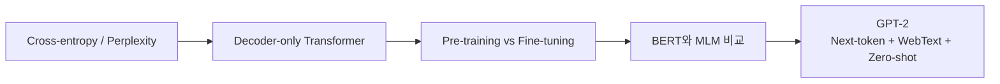
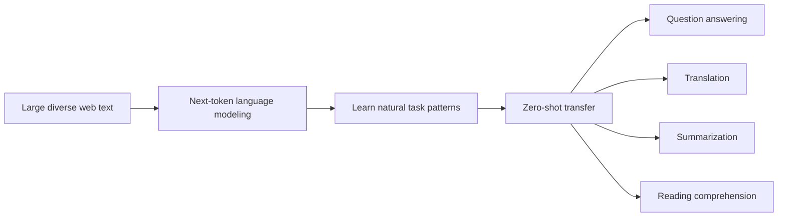
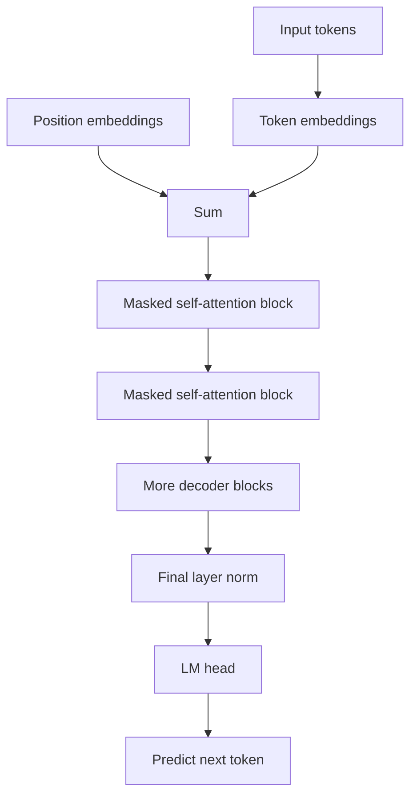
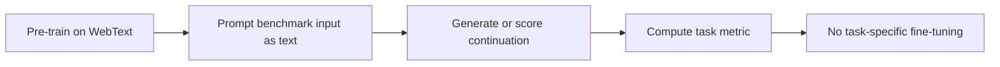
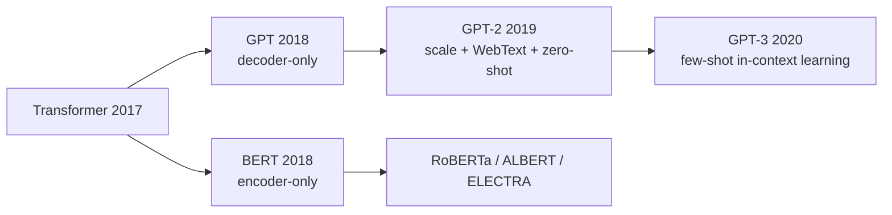

## Paper Info

- Title: Language Models are Unsupervised Multitask Learners
- Authors: Alec Radford, Jeffrey Wu, Rewon Child, David Luan, Dario Amodei, Ilya Sutskever
- Year: 2019
- URL: https://cdn.openai.com/better-language-models/language_models_are_unsupervised_multitask_learners.pdf
- OpenAI blog: https://openai.com/index/better-language-models/
- Code/model repo: https://github.com/openai/gpt-2
- 1.5B release note: https://openai.com/index/gpt-2-1-5b-release/

## 한 줄 요약

GPT-2는 대규모 웹 텍스트에서 **다음 토큰 예측**만으로 학습한 decoder-only Transformer가,
별도 fine-tuning 없이도 번역, 질의응답, 독해, 요약 같은 태스크를 어느 정도 수행하기 시작한다는 것을 보여준 논문입니다.

## GPT-2를 이해하기 위한 기반 지식

GPT-2를 읽을 때 모든 배경을 완벽히 알고 있을 필요는 없습니다.
다만 아래 개념은 흐릿하게라도 잡고 들어가면 논문이 훨씬 덜 어렵습니다.

| 기반 지식                   | GPT-2에서 필요한 이유                                                                            | 먼저 볼 노트                                                                                                                        |
| --------------------------- | ------------------------------------------------------------------------------------------------ | ----------------------------------------------------------------------------------------------------------------------------------- |
| 확률과 softmax              | 모델이 다음 토큰 후보마다 점수를 만들고, 이를 확률처럼 해석합니다.                               | [softmax와 확률 해석](/kb/2026-04-17-llm-math-basics-softmax)                                                                       |
| cross-entropy와 perplexity  | GPT-2의 학습 목표와 language modeling benchmark 결과를 이해하는 핵심 지표입니다.                 | [cross-entropy와 perplexity](/kb/2026-04-17-llm-learning-basics-cross-entropy-perplexity)                                           |
| Self-Attention과 Q, K, V    | decoder block 안에서 앞 문맥의 어떤 토큰을 참고할지 계산합니다.                                  | [Q, K, V 직관](/kb/2026-04-17-transformer-basics-qkv-intuition)                                                                     |
| Transformer block           | GPT-2는 Transformer decoder block을 여러 층 쌓은 모델입니다.                                     | [Residual, LayerNorm, FFN](/kb/2026-04-17-transformer-basics-residual-layernorm-ffn)                                                |
| Encoder와 Decoder           | GPT-2가 왜 원래 Transformer의 decoder 쪽 계열인지 이해할 수 있습니다.                            | [Encoder와 Decoder](/kb/2026-04-18-transformer-basics-encoder-decoder)                                                              |
| Encoder-only와 Decoder-only | BERT와 GPT-2의 가장 큰 구조 차이를 잡는 데 필요합니다.                                           | [Encoder-only와 Decoder-only](/kb/2026-04-18-llm-architecture-basics-encoder-only-decoder-only)                                     |
| Pre-training과 Fine-tuning  | GPT-2가 task별 fine-tuning 없이 zero-shot으로 평가된다는 말을 이해할 수 있습니다.                | [Pre-training과 Fine-tuning](/kb/2026-04-18-llm-learning-basics-pretraining-finetuning)                                             |
| BERT와 MLM                  | GPT-2의 next-token prediction이 BERT의 masked language model과 어떻게 다른지 비교할 수 있습니다. | [BERT 논문 노트](/kb/2026-04-18-bert-paper-note), [Masked Language Model](/kb/2026-04-18-llm-learning-basics-masked-language-model) |

최소 경로만 고르면 다음 순서가 좋습니다.

1. [cross-entropy와 perplexity](/kb/2026-04-17-llm-learning-basics-cross-entropy-perplexity)
2. [Encoder-only와 Decoder-only](/kb/2026-04-18-llm-architecture-basics-encoder-only-decoder-only)
3. [Pre-training과 Fine-tuning](/kb/2026-04-18-llm-learning-basics-pretraining-finetuning)
4. [BERT 논문 노트](/kb/2026-04-18-bert-paper-note)의 모델 구조와 MLM 섹션
5. 이 GPT-2 논문 노트

이 다섯 단계만 따라가도 GPT-2의 핵심 문장인
"대규모 decoder-only language model이 next-token prediction만으로 zero-shot task transfer를 보인다"는 말이 분해됩니다.



아직 별도 기초 노트가 없는 개념도 있습니다.
`tokenization`, `byte-level BPE`, `benchmark contamination`, `staged release`는 GPT-2 본문 안에서 필요한 만큼 바로 설명합니다.

## 처음 읽는 사람을 위한 빠른 해설

[BERT](/kb/2026-04-18-bert-paper-note)가 "문장을 양방향으로 읽어 이해 표현을 만들자"는 쪽이었다면,
GPT-2는 반대로 "[왼쪽 문맥만 보고 다음 토큰을 계속 예측하자](/kb/2026-04-18-llm-architecture-basics-encoder-only-decoder-only)"는 방향을 크게 밀어붙입니다.

처음에는 이 접근이 단순해 보입니다.

- 입력 텍스트를 앞에서부터 읽습니다.
- 다음에 올 토큰을 맞힙니다.
- 틀리면 [cross-entropy loss](/kb/2026-04-17-llm-learning-basics-cross-entropy-perplexity)가 커집니다.
- 엄청나게 많은 웹 텍스트에서 이 과정을 반복합니다.

그런데 논문이 던진 질문은 단순하지 않습니다.

**"웹 텍스트 안에는 이미 번역, 요약, 질의응답, 독해 예제가 자연스럽게 섞여 있으니, 충분히 큰 언어 모델은 다음 토큰을 맞히는 과정만으로 여러 태스크를 배울 수 있지 않을까요?"**

이 질문이 GPT-2의 핵심입니다. 모델 구조의 새로움보다, 데이터와 규모를 통해 태스크 지식을 자연어 안에서 흡수한다는 관점이 중요합니다.

## 이 페이지를 읽는 추천 순서

1. 기반 지식 체크
2. 문제 정의
3. WebText가 왜 중요한지
4. 모델 구조와 GPT-1 대비 변화
5. Zero-shot task transfer
6. 실험 결과
7. 한계와 staged release
8. GPT-3로 이어지는 지점

## 읽다가 막히기 쉬운 지점

GPT-2에서 가장 헷갈리는 표현은 `unsupervised multitask learning`입니다.

여기서 unsupervised는 "모델이 아무 신호도 없이 배운다"는 뜻이 아닙니다. 정답 신호는 있습니다. 바로 다음 토큰입니다. 다만 번역/요약/질의응답처럼 태스크별로 사람이 만든 입력-출력 라벨을 쓰지 않는다는 뜻입니다.

두 번째로 헷갈리는 지점은 `zero-shot`입니다. GPT-2가 zero-shot으로 평가된다는 말은, 해당 benchmark의 training set으로 fine-tuning하지 않았다는 뜻입니다. 모델은 일반 웹 텍스트로만 next-token pre-training을 하고, 평가 시에는 prompt 형태로 문제를 넣습니다.

세 번째는 BERT와 GPT-2의 차이입니다. BERT는 encoder-only, GPT-2는 decoder-only입니다. 구조 차이를 먼저 잡고 싶다면 [Encoder-only와 Decoder-only](/kb/2026-04-18-llm-architecture-basics-encoder-only-decoder-only)를 읽고 돌아오는 편이 좋습니다.

## 문제 정의

GPT-2 이전의 NLP는 보통 태스크별 supervised dataset을 중심으로 움직였습니다.

- 번역 모델은 번역 병렬 말뭉치로 학습합니다.
- 질의응답 모델은 질문-정답 pair로 학습합니다.
- 요약 모델은 문서-요약 pair로 학습합니다.
- 독해 모델은 passage, question, answer span을 따로 학습합니다.

이 방식은 성능이 좋지만, 태스크마다 라벨 데이터와 모델 adaptation이 필요합니다.

GPT-2 논문은 이 흐름에 다른 가설을 제시합니다.

웹에는 이미 사람이 쓴 자연어 형태의 task demonstration이 많이 있습니다. 예를 들어 "Q: ... A: ...", "English: ... French: ...", "TL;DR:" 같은 패턴이 자연스럽게 등장합니다. 충분히 크고 다양한 텍스트를 next-token prediction으로 학습하면, 모델은 이런 패턴을 따라 하면서 여러 태스크를 암묵적으로 배울 수 있다는 가설입니다.



핵심은 task-specific supervised training을 없애는 것이 아니라,
**pre-training objective 자체가 여러 태스크의 자연어 demonstration을 흡수할 수 있는가**를 보는 것입니다.

## WebText: Common Crawl을 그대로 쓰지 않습니다

GPT-2의 데이터셋은 `WebText`입니다. 논문은 단순히 Common Crawl 전체를 긁어온 것이 아니라, Reddit에서 3 karma 이상 받은 outbound link를 수집해 품질 필터로 사용했습니다.

공식 논문 기준 WebText의 특징은 다음과 같습니다.

| 항목        | 내용                                           |
| ----------- | ---------------------------------------------- |
| source      | Reddit outbound links                          |
| filtering   | 3 karma 이상 받은 link                         |
| raw links   | 약 45M links                                   |
| 최종 corpus | 중복 제거와 휴리스틱 cleaning 후 8M+ documents |
| 크기        | 약 40GB text                                   |
| cutoff      | 2017년 12월 이후 link 제외                     |
| Wikipedia   | 평가 데이터 중복을 줄이기 위해 제거            |

이 선택은 매우 중요합니다. GPT-2의 성능은 모델 구조만의 결과가 아니라, "다양하지만 어느 정도 인간이 선별한 웹 텍스트"를 대규모로 학습한 결과입니다.

논문은 data overlap도 따로 분석합니다. WebText가 평가 benchmark와 겹쳐서 성능이 과장될 수 있기 때문입니다. LAMBADA에서는 overlap을 제거해도 perplexity와 accuracy 변화가 작다고 보고하지만, CoQA처럼 일부 overlap이 성능에 영향을 주는 사례도 언급합니다.

즉 GPT-2를 읽을 때는 "웹 텍스트가 많으면 된다"가 아니라, **데이터 품질, 중복, benchmark contamination 문제가 이미 이때부터 중요했다**고 보는 편이 좋습니다.

## 입력 표현: byte-level BPE

GPT-2는 byte-level BPE를 사용합니다.

일반적인 word-level vocabulary는 unknown token 문제에 취약합니다. 반대로 byte-level 방식은 어떤 Unicode 문자열에도 확률을 줄 수 있지만, 너무 잘게 쪼개져 sequence가 길어질 수 있습니다.

GPT-2는 이 사이의 절충으로 byte-level BPE를 사용합니다.

- byte를 기본 단위로 두어 unknown token 문제를 줄입니다.
- BPE merge로 자주 나오는 byte sequence를 묶습니다.
- vocabulary size는 50,257입니다.
- 어떤 dataset이든 tokenization mismatch를 덜 걱정하고 평가할 수 있습니다.

이 점은 후속 GPT 계열에서도 매우 중요한 방향입니다. LLM은 모델 구조만큼 tokenizer 선택의 영향을 크게 받습니다.

## 모델 구조

GPT-2는 GPT-1을 크게 확장한 Transformer language model입니다.
구조적으로는 decoder-only autoregressive Transformer로 보면 됩니다.



논문 표 2의 model size는 다음과 같습니다.

| 논문 표기 | Layers | `d_model` |
| --------- | -----: | --------: |
| 117M      |     12 |       768 |
| 345M      |     24 |      1024 |
| 762M      |     36 |      1280 |
| 1542M     |     48 |      1600 |

다만 OpenAI의 공식 GitHub README는 원래 parameter count가 잘못되었다고 정정합니다. 그래서 이후에는 보통 `124M`, `355M`, `774M`, `1558M`처럼 부르는 경우가 많습니다. 이 글에서는 논문 수치를 설명할 때는 논문 표기를 쓰고, release history를 말할 때는 정정된 표기를 함께 언급하겠습니다.

GPT-1 대비 중요한 변화는 다음과 같습니다.

- 모델을 크게 키웠습니다.
- context size를 512에서 1024 tokens로 늘렸습니다.
- batch size를 512로 키웠습니다.
- LayerNorm을 각 sub-block 입력 쪽으로 옮겼습니다.
- 마지막 self-attention block 뒤에 추가 LayerNorm을 둡니다.
- residual path 누적을 고려한 initialization scaling을 사용합니다.

여기서 LayerNorm과 residual이 왜 중요한지는 [Residual, LayerNorm, FFN](/kb/2026-04-17-transformer-basics-residual-layernorm-ffn) 노트와 연결해 보면 됩니다.

## 학습 목표: 다음 토큰 예측 하나로 밀어붙입니다

GPT-2의 학습 목표는 단순합니다.

```txt
maximize p(x_t | x_1, x_2, ..., x_{t-1})
```

즉 이전 토큰들을 보고 다음 토큰을 맞힙니다.

BERT의 [Masked Language Model](/kb/2026-04-18-llm-learning-basics-masked-language-model)과 다르게, GPT-2는 미래 토큰을 볼 수 없습니다. 이는 생성에는 자연스럽지만, 입력 전체를 양방향으로 이해하는 태스크에는 제약이 있습니다.

그럼에도 GPT-2가 흥미로운 이유는 이 next-token objective 하나가 다양한 자연어 패턴을 모두 포괄하기 때문입니다.

| 자연어 패턴 | next-token objective 안에서 보이는 모습            |
| ----------- | -------------------------------------------------- |
| 번역        | `English: ... French: ...` 뒤의 문장을 예측합니다. |
| 질의응답    | `Q: ... A:` 뒤의 답을 예측합니다.                  |
| 요약        | 긴 문서 뒤의 `TL;DR:` 이후 요약을 예측합니다.      |
| 독해        | 문서와 대화 이력을 보고 다음 답변을 예측합니다.    |

그래서 GPT-2는 모델 architecture의 논문인 동시에, **promptable language model**이라는 관점을 강하게 보여주는 논문입니다.

## Zero-shot task transfer

GPT-2는 benchmark별 training data로 fine-tuning하지 않고 평가합니다.
논문은 이를 zero-shot setting이라고 부릅니다.



이 접근은 이후 GPT-3의 few-shot prompting으로 이어집니다. GPT-2에서는 아직 prompt engineering이 정교하지 않고, 성능도 task마다 들쭉날쭉합니다. 하지만 "태스크를 모델 구조나 fine-tuning code로 바꾸지 않고, 텍스트 prompt로 바꾼다"는 방향이 선명하게 드러납니다.

## 실험 결과 1: Language modeling benchmark

논문은 여러 language modeling dataset에서 zero-shot 성능을 비교합니다. 1542M 모델은 8개 중 7개 language modeling dataset에서 당시 SOTA를 갱신했다고 보고합니다.

대표 수치는 다음과 같습니다.

| Dataset      | Metric     | 기존 SOTA | GPT-2 1542M |
| ------------ | ---------- | --------: | ----------: |
| LAMBADA      | PPL ↓      |      99.8 |        8.63 |
| LAMBADA      | Accuracy ↑ |     59.23 |       63.24 |
| CBT-CN       | Accuracy ↑ |      85.7 |       93.30 |
| CBT-NE       | Accuracy ↑ |      82.3 |       89.05 |
| WikiText-2   | PPL ↓      |     39.14 |       18.34 |
| PTB          | PPL ↓      |     46.54 |       35.76 |
| enwik8       | BPB ↓      |      0.99 |        0.93 |
| text8        | BPC ↓      |      1.08 |        0.98 |
| WikiText-103 | PPL ↓      |      18.3 |       17.48 |
| 1BW          | PPL ↓      |      21.8 |       42.16 |

여기서 중요한 것은 GPT-2가 모든 곳에서 이긴 것이 아니라는 점입니다. 1 Billion Word Benchmark에서는 기존 SOTA보다 나쁩니다. 논문도 GPT-2가 여전히 WebText에 underfit되어 있고, out-of-distribution benchmark에서는 tokenizer artifact나 데이터 분포 차이를 겪는다고 설명합니다.

## 실험 결과 2: LAMBADA와 long-range dependency

LAMBADA는 긴 문맥을 보고 마지막 단어를 맞히는 benchmark입니다.
논문은 GPT-2가 LAMBADA perplexity를 크게 낮추고, accuracy도 크게 올렸다고 보고합니다.

이 결과가 중요한 이유는 GPT-2가 긴 문맥 정보를 활용한다는 신호이기 때문입니다.
단순히 직전 몇 단어만 보는 모델이라면 LAMBADA에서 좋은 성능을 내기 어렵습니다.

다만 논문은 GPT-2의 오류도 흥미롭게 해석합니다. 많은 예측이 문장 continuation으로는 자연스럽지만, benchmark가 요구하는 "정확한 마지막 단어"는 아닌 경우가 많았다고 합니다. 즉 모델은 문맥을 이해해 자연스러운 continuation을 만들지만, 평가 형식의 제약을 완전히 따르지는 못합니다.

이 지점은 생성 모델 평가의 어려움을 잘 보여줍니다. 모델이 언어적으로 그럴듯한 답을 내도, benchmark는 하나의 정답만 요구할 수 있습니다.

## 실험 결과 3: Reading comprehension, summarization, translation

GPT-2는 language modeling benchmark 외에도 여러 task를 prompt 형태로 평가합니다.

| Task                       | 방식                                            | 결과 해석                                                        |
| -------------------------- | ----------------------------------------------- | ---------------------------------------------------------------- |
| CoQA reading comprehension | 문서, 대화 이력, 질문을 prompt로 넣고 답변 생성 | dev set 55 F1로 4개 baseline 중 3개와 비슷하거나 높습니다.       |
| Summarization              | CNN/DailyMail 문서 뒤에 `TL;DR:`를 붙임         | ROUGE 기준으로는 SOTA보다 낮지만 요약 형식을 어느 정도 따릅니다. |
| Translation                | 자연어 prompt로 번역 유도                       | 일부 언어쌍에서 약한 zero-shot 번역 능력을 보입니다.             |
| Question answering         | factual QA prompt                               | capacity가 커질수록 trivial baseline을 넘기 시작합니다.          |

여기서 "zero-shot으로도 된다"와 "실용적으로 충분하다"는 다릅니다. 논문 discussion도 이 점을 조심스럽게 말합니다. 독해에서는 supervised baseline과 경쟁할 만한 신호가 있지만, 요약 같은 task는 정량 지표상 아직 초보적인 수준입니다.

## 왜 지금도 중요한가

GPT-2의 중요성은 세 가지입니다.

첫 번째, **decoder-only scaling path**를 분명히 보여줬습니다.
BERT가 encoder-only 이해 모델의 시대를 열었다면, GPT-2는 decoder-only 생성 모델을 크게 키우면 범용 task behavior가 나타난다는 방향을 강화했습니다.

두 번째, **prompting의 초기 형태**를 보여줬습니다.
GPT-2는 아직 instruction tuning도 없고, RLHF도 없습니다. 그런데도 prompt 형태에 따라 번역, 요약, QA를 시도합니다. 이는 GPT-3의 in-context learning 논리로 이어집니다.

세 번째, **모델 공개와 misuse 논쟁을 본격화했습니다**.
OpenAI는 2019년 2월 처음에는 작은 모델과 논문만 공개하고, 이후 345M, 774M, 1.5B 모델을 staged release로 순차 공개했습니다. 2019년 11월 5일에는 최종적으로 1.5B 모델과 weights를 공개했습니다. GPT-2는 기술 논문이면서 동시에 AI publication norm 논쟁의 중요한 사례입니다.

## BERT와 비교해서 읽기

| 축              | BERT                                         | GPT-2                                            |
| --------------- | -------------------------------------------- | ------------------------------------------------ |
| 구조            | Encoder-only                                 | Decoder-only                                     |
| attention       | 양방향 self-attention                        | causal masked self-attention                     |
| 학습 목표       | MLM + NSP                                    | next-token prediction                            |
| 주 용도         | 이해, 분류, span QA, NER                     | 생성, completion, prompt-based task              |
| downstream 방식 | fine-tuning 중심                             | zero-shot prompting 강조                         |
| 대표 질문       | "양쪽 문맥을 보고 좋은 표현을 만들 수 있나?" | "다음 토큰 예측만으로 여러 task를 배울 수 있나?" |

이 비교를 잡으면 LLM 논문 흐름이 깔끔해집니다.
BERT 계열은 이해 표현과 fine-tuning으로, GPT 계열은 생성과 prompting으로 발전합니다.



## 한계와 조심해서 읽을 지점

첫 번째 한계는 성능입니다. GPT-2는 여러 task를 zero-shot으로 시도하지만, 논문 자체도 실용적 성능과는 거리가 있다고 말합니다. 특히 summarization, translation, QA는 specialized supervised system보다 약한 경우가 많습니다.

두 번째는 data contamination입니다. WebText와 benchmark가 일부 겹칠 수 있습니다. 논문은 overlap 분석을 했지만, 웹 규모 pre-training에서는 이후에도 benchmark contamination 문제가 계속 중요해집니다.

세 번째는 hallucination과 factuality입니다. GPT-2는 그럴듯한 문장을 잘 이어 쓰지만, 사실을 보장하지 않습니다. 공식 GitHub README도 GPT-2 모델이 bias와 factual inaccuracies를 포함한 데이터로 학습되었기 때문에 편향되고 부정확할 수 있다고 경고합니다.

네 번째는 release strategy 논쟁입니다. GPT-2는 처음부터 전체 모델을 공개하지 않았고, staged release를 택했습니다. 이 선택은 당시 많은 논쟁을 낳았지만, 이후 강력한 생성 모델 공개 정책을 논의하는 중요한 선례가 되었습니다.

## 읽고 남길 메모

- GPT-2의 핵심은 "새로운 복잡한 학습 목표"가 아니라 "단순한 next-token objective를 충분히 큰 데이터와 모델에 적용하면 어떤 일이 생기는가"입니다.
- BERT가 fine-tuning 중심의 NLP 표준 레시피를 만들었다면, GPT-2는 prompt로 task를 표현하는 방향을 열었습니다.
- WebText는 단순한 데이터셋 이름이 아니라, 웹 텍스트 품질 필터링과 task demonstration 흡수라는 아이디어의 핵심입니다.
- Zero-shot 결과는 과장해서 읽으면 안 됩니다. GPT-2는 가능성을 보인 것이지, 모든 task를 잘 해결한 것은 아닙니다.
- GPT-2의 staged release는 기술 성능만큼이나 AI 안전/공개 정책 논의에서 중요합니다.

## 다음에 읽을 논문

- [GPT-3 (2020)](/kb/2026-06-21-gpt-3-paper-note): Language Models are Few-Shot Learners
- InstructGPT (2022): Training language models to follow instructions with human feedback
- LLaMA (2023): Open and Efficient Foundation Language Models
