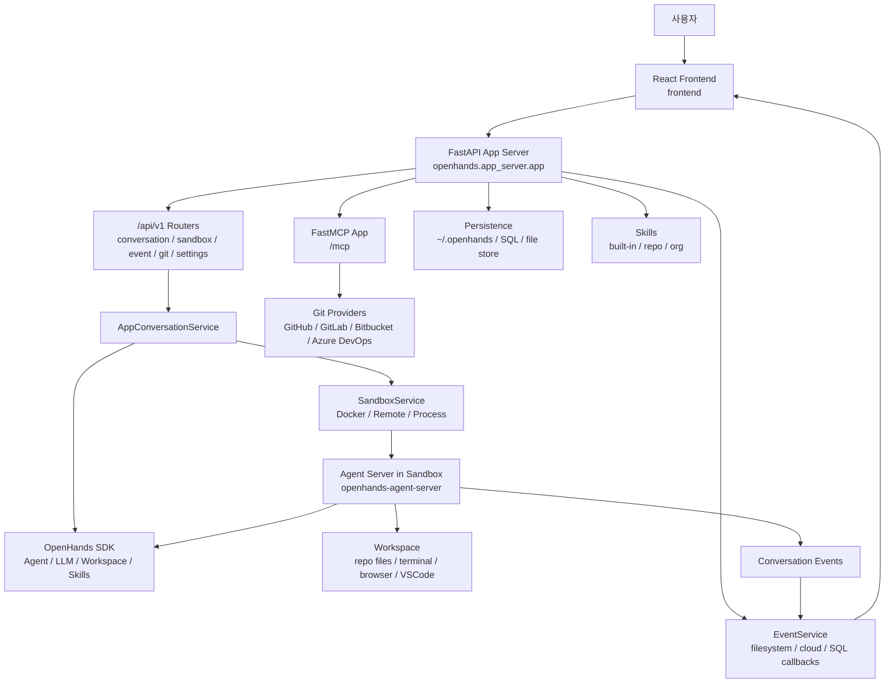
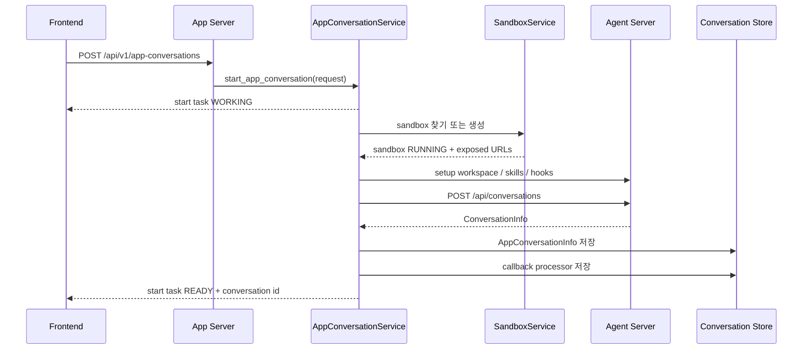

> Analyzed: 2026-05-17
> Package: `openhands-ai` `1.7.0` / `openhands-frontend` `1.7.0`
> Key SDK dependencies: `openhands-sdk` `1.22.1` / `openhands-agent-server` `1.22.1` / `openhands-tools` `1.22.1`
> Commit: `e3d9abfd014ffd4283d03071fdb88c1c8edc77f6`
> Repository: https://github.com/All-Hands-AI/OpenHands
> Local path: `~/workspace/opensources/OpenHands`

---

_This article is partially written by Codex_

---

## 1. Why OpenHands?

OpenHands is one of the most widely referenced open-source projects in the AI coding agent ecosystem. It used to carry a strong impression of being a "coding agent that runs in a browser," in the vein of Devin. Looking at the current repository, a more concrete direction emerges.

OpenHands is not a project that implements a single agent loop. It draws the boundaries necessary to operate a coding agent as a real product.

- Users interact through a React-based local GUI.
- A FastAPI app server provides APIs for conversations, sandboxes, settings, git, secrets, and events.
- The actual agent runtime is separated out into an agent-server inside a sandbox.
- The agent-server and app server communicate over HTTP using a session API key.
- Events are handled by the app server through search, storage, callbacks, and webhooks.
- GitHub/GitLab/Bitbucket/Azure DevOps integrations are handled by the app server together with user tokens.
- In V1, skills and plugin concepts are used to compose the agent context.

This architecture resembles [Ruflo](/kb/2026-05-17-ruflo-architecture) in structure but differs in intent. Where Ruflo attaches CLI/MCP/swarm/memory around Claude Code, OpenHands is closer to **operating the coding agent itself as a web product and sandbox runtime**.

## 2. Where Does This Fit Among Recent Posts?

OpenHands connects naturally to the recent series of AI agent posts on this blog.

| Post                                                     | Core Problem                                          | Relationship to OpenHands                                                                                                         |
| -------------------------------------------------------- | ----------------------------------------------------- | --------------------------------------------------------------------------------------------------------------------------------- |
| [Ruflo](/kb/2026-05-17-ruflo-architecture)               | Agent orchestration around Claude Code                | OpenHands targets an independent product-style coding agent UI/runtime rather than a Claude Code plugin.                          |
| [Superpowers](/kb/2026-04-18-superpowers-architecture)   | A document system for enforcing procedures and skills | OpenHands' `skills/` and repository `.openhands/skills` address a similar problem from within the product.                        |
| [Hermes Agent](/kb/2026-05-13-hermes-agent-architecture) | Python tool-calling agent runtime                     | Where Hermes focuses on the internal structure of a single runtime, OpenHands places the runtime behind a sandbox and app server. |
| [agentmemory](/kb/2026-05-13-agentmemory-architecture)   | Long-term memory and shared context                   | OpenHands establishes conversation/event/sandbox lifecycle as product boundaries before addressing memory.                        |

OpenHands is therefore better read as a post about "the product boundary for safely launching a coding agent, holding a conversation, editing files, and sending a PR" rather than a post about agent algorithms.

## 3. Understanding the Project in One Sentence

**OpenHands** bundles a React frontend, FastAPI app server, sandbox service, agent-server, Software Agent SDK, event store, MCP tools, and skills into a **platform for operating an AI coding agent as a local GUI and cloud product**.

Framed as questions:

| Question                                            | OpenHands' Answer                                                                                     |
| --------------------------------------------------- | ----------------------------------------------------------------------------------------------------- |
| Where does an agent conversation begin?             | `/api/v1/app-conversations` orchestrates sandbox provisioning and agent-server conversation creation. |
| Where does actual code execution happen?            | The agent-server runs inside one of Docker, remote, or process sandboxes.                             |
| How do the app server and agent-server communicate? | Over HTTP using an exposed URL and an `X-Session-API-Key` header.                                     |
| Where does the UI read state from?                  | It uses both the app server's conversation/event/sandbox APIs and the sandbox runtime URL.            |
| Who handles Git provider operations?                | The app server's MCP tool reads the user token and performs PR/MR operations on behalf of the agent.  |
| How is the agent context extended?                  | Via built-in skills, repository `.openhands/skills`, plugin specs, and SDK agent settings.            |

## 4. Technology Stack

| Area         | Technology                                                            |
| ------------ | --------------------------------------------------------------------- |
| Backend API  | Python 3.12/3.13, FastAPI, Uvicorn, Pydantic, SQLAlchemy async        |
| Agent engine | `openhands-sdk`, `openhands-agent-server`, `openhands-tools` packages |
| LLM support  | LiteLLM, OpenAI, Anthropic, Google GenAI, OpenHands provider          |
| Sandbox      | Docker SDK, remote sandbox, process sandbox, session API key          |
| MCP          | `fastmcp`, Tavily proxy, Git provider PR/MR tools                     |
| Frontend     | React 19, React Router 7, Vite, TypeScript, HeroUI, xterm, Monaco     |
| Events       | Filesystem event store, SQL callback store, webhook callback          |
| Auth/Config  | JWT, provider token, user settings, secrets API                       |
| Deployment   | Docker multi-stage image, app image with bundled frontend build       |
| Enterprise   | Source-available `enterprise/` directory, Slack/Jira/Linear/RBAC etc. |

Approximate scale based on a local checkout:

| Item                                       | Count |
| ------------------------------------------ | ----: |
| Git-tracked files                          | 2,322 |
| Python/TypeScript/JavaScript files         | 1,972 |
| Tracked files under `openhands` app server |   252 |
| Tracked files under `frontend`             | 1,274 |
| Tracked files under `enterprise`           |   496 |
| Tracked files under `skills`               |    27 |
| Test-related tracked files                 |   525 |

The important point here is that the current repository does not contain the entire agent engine. The core SDK and agent-server are pulled in as PyPI dependencies; this repository is organized around the app server, GUI, container, and enterprise product surface.

## 5. The Big Picture

The high-level flow looks like this.



The key insight in this diagram is that the app server does not run the agent loop directly. The app server creates a sandbox, locates the agent-server URL, assembles the start request, and manages conversation metadata and events/callbacks. Actual workspace manipulation and agent execution are delegated to the agent-server and SDK inside the sandbox.

## 6. Codebase Map

The key directories are as follows.

```text
OpenHands/
├── openhands/
│   ├── app_server/
│   │   ├── app.py                         # FastAPI app entry point
│   │   ├── v1_router.py                   # /api/v1 router assembly
│   │   ├── config.py                      # env-based service injector configuration
│   │   ├── app_conversation/              # conversation lifecycle
│   │   ├── sandbox/                       # Docker/remote/process sandbox
│   │   ├── event/                         # event store/search
│   │   ├── event_callback/                # webhook/callback processor
│   │   ├── integrations/                  # GitHub/GitLab/Bitbucket/Azure
│   │   ├── mcp/                           # FastMCP tools
│   │   ├── settings/                      # user/app settings
│   │   ├── secrets/                       # secret APIs
│   │   └── user_auth/                     # auth helpers
│   └── server/                            # deprecated compatibility wrapper
├── frontend/
│   ├── src/routes/                        # conversation, settings, tabs
│   ├── src/api/                           # typed API clients
│   ├── src/services/                      # chat, terminal, observations
│   └── src/components/                    # UI components
├── containers/
│   ├── app/Dockerfile                     # frontend + backend app image
│   └── dev/
├── skills/                                # shared OpenHands skills
└── enterprise/                            # source-available enterprise layer
```

`openhands/server/*` is a deprecated wrapper. The current center of gravity is `openhands/app_server/app.py`.

## 7. This Repository's Role: Closer to App Server than Engine

The README divides OpenHands into SDK, CLI, Local GUI, Cloud, and Enterprise. The primary responsibility of this repository is the Local GUI and app server.

Looking at `pyproject.toml`, the following dependencies are explicitly present.

```text
openhands-sdk==1.22.1
openhands-agent-server==1.22.1
openhands-tools==1.22.1
openhands-aci==0.3.3
```

In other words, most of the agent primitives, agent-server runtime, and tool presets live in separate packages. This repository provides the following layer for running those packages in a production environment:

- Sandbox creation and reuse policy
- Conversation metadata storage
- Agent-server start request assembly
- Frontend API and runtime URL bridge
- User settings, provider tokens, secrets, and Git integration
- Event store and callbacks
- Docker image and enterprise extensions

Missing this point can leave readers wondering "why is the agent loop body smaller than expected?" when reading the OpenHands code. The current repository is closer to an **agent product shell** than the agent engine itself.

## 8. FastAPI App Server: The Front Door for All Product Requests

`openhands/app_server/app.py` is the current FastAPI entry point.

What it does:

1. Initializes the Tavily MCP proxy.
2. Mounts `mcp_server.http_app(path='/mcp')` as a FastAPI route.
3. Merges the app lifespan with the MCP lifespan.
4. Attaches the `v1_router` and health router.
5. Mounts SPA static files if a frontend build is present.
6. Attaches CORS, cache control, and rate limit middleware.

`v1_router.py` assembles the following routers under `/api/v1`:

| Router                         | Role                                            |
| ------------------------------ | ----------------------------------------------- |
| `event_router`                 | Conversation event search and count             |
| `app_conversation_router`      | Conversation start, retrieval, messages, export |
| `pending_message_router`       | Message queue while a conversation is preparing |
| `sandbox_router`               | Sandbox pause/resume/batch retrieval            |
| `settings_router`              | LLM, agent, and user settings                   |
| `secrets_router`               | Secret management                               |
| `user_router`, `skills_router` | User and skill retrieval                        |
| `webhook_router`               | External callback/webhook                       |
| `web_client_router`            | Frontend configuration                          |
| `git_router`                   | Repository/provider integration                 |
| `config_router`                | App config and model list                       |

The OpenHands app server is both an API gateway and an orchestrator.

## 9. Conversation Startup Flow

The most important flow in OpenHands is conversation startup. The central file is `openhands/app_server/app_conversation/live_status_app_conversation_service.py`.

The high-level flow is as follows.



`AppConversationStartTask` is important here. Creating a conversation is not an instantaneous operation. The sandbox must come up, the repository must be prepared, and setup scripts and skill/hook installation must complete. The API therefore creates a start task first, and the client either polls or receives streaming updates until the status becomes `READY`.

The state transitions are clearly documented in code comments:

```text
WORKING -> WAITING_FOR_SANDBOX -> PREPARING_REPOSITORY
-> RUNNING_SETUP_SCRIPT -> SETTING_UP_GIT_HOOKS -> SETTING_UP_SKILLS
-> STARTING_CONVERSATION -> READY
```

This design matters in a real product. Starting a coding agent is not "a single LLM request" — it is a runtime preparation workflow.

## 10. Sandbox: The Execution Boundary for the Coding Agent

`openhands/app_server/sandbox` is OpenHands' safety boundary. The README states this clearly: because an agent can perform operations that may be harmful to the system, it runs inside a sandbox.

There are multiple implementations:

| Implementation  | File                         |
| --------------- | ---------------------------- |
| Docker sandbox  | `docker_sandbox_service.py`  |
| Remote sandbox  | `remote_sandbox_service.py`  |
| Process sandbox | `process_sandbox_service.py` |
| Sandbox spec    | `*_sandbox_spec_service.py`  |

Docker is the default. `config.py` branches on `RUNTIME=remote`, `RUNTIME=local/process`, and defaults to Docker otherwise.

The Docker sandbox translates container status into OpenHands' `SandboxStatus` and converts exposed ports into a list of `ExposedUrl` objects. The key URL names are `AGENT_SERVER`, `VSCODE`, `WORKER_1`, and `WORKER_2`.

The mechanism by which the app server locates the agent-server URL is also clear: it finds the `AGENT_SERVER` entry among the sandbox's exposed URLs, inserts it into the conversation context, and attaches `X-Session-API-Key` to all subsequent HTTP requests.

## 11. The Agent-Server Boundary: The Real Agent Loop Lives Inside the Sandbox

The OpenHands app server does not inject tokens into the agent or run the loop directly. When creating a conversation, it assembles a `StartConversationRequest` and sends it to the agent-server inside the sandbox.

`LiveStatusAppConversationService` collects the following before sending:

- User LLM settings
- Provider base URL
- Selected repository and branch
- Initial message
- Agent type and planning agent instructions
- Built-in tools or planning tools
- Plugin spec
- Skills and hooks
- Workspace path
- Secret lookup / static secret

All of this is passed to the agent-server's `/api/conversations`. Subsequent runtime-specific APIs — pause, resume, ask_agent, VSCode URL retrieval — are called by the frontend either directly against the agent-server endpoint via the conversation URL, or proxied through the app server.

This structure draws a clean line between the responsibilities of the app server and the agent-server.

| Layer        | Responsibility                                                                                          |
| ------------ | ------------------------------------------------------------------------------------------------------- |
| app server   | User identity, settings, sandbox lifecycle, conversation metadata, provider tokens, Git integration     |
| agent-server | Actual agent execution, workspace manipulation, terminal/browser/VSCode endpoints, conversation runtime |
| SDK/tools    | Agent, LLM, workspace, tool preset, skill loading primitives                                            |

## 12. Event Store and Callbacks

In OpenHands, events are the execution record of a conversation. `openhands/app_server/event` provides event storage, search, count, and pagination.

In the default OSS flow, `FilesystemEventService` reads and writes event JSON under a per-user persistence directory. Depending on the storage provider configuration, AWS/GCP event services can be selected instead.

`event_callback` is a separate layer. According to the README, it handles callback CRUD, webhook endpoints, event filtering, retry, and result tracking. One of the default callback processors is `SetTitleCallbackProcessor`, which is automatically registered after a conversation starts and updates the conversation title based on incoming events.

Treating events as a separate domain is a sound design choice. In a coding agent product, the trajectory often matters more than the final answer. Which commands were executed, which files were read, where confirmation was needed, which external callbacks were sent — all of this is product data.

## 13. MCP: The App Server Performs Git Provider Operations on the Agent's Behalf

`openhands/app_server/mcp/mcp_router.py` constructs the FastMCP server. The standout tool here is PR/MR creation.

For example, the `create_pr` tool follows this flow:

1. Reads the conversation id header from the HTTP request.
2. Retrieves the user's provider token and access token.
3. Instantiates `GithubServiceImpl`.
4. In SaaS mode, appends an OpenHands conversation link to the PR body.
5. Creates the PR via the GitHub API.
6. Saves the PR number to conversation metadata.

This is not a model where "the agent holds a GitHub token and opens a PR directly." The app server provides an MCP tool that already carries both authentication context and product context. GitLab MR, Bitbucket, and Azure DevOps follow the same pattern.

Another interesting detail is the Tavily proxy. When a Tavily API key is configured, the app server mounts a Tavily MCP proxy under its MCP server. This keeps the external search API key out of the sandbox, with the app server acting as an intermediary.

## 14. Frontend: The Conversation Workspace UI

The `frontend` is a React Router 7 SPA. The route list gives a clear picture of the product surface.

```text
conversation
browser-tab
changes-tab
planner-tab
task-list-tab
vscode-tab
terminal/service
agent-settings
llm-settings
mcp-settings
skills-settings
secrets-settings
git-settings
```

The frontend API clients are split by service under `frontend/src/api`. `conversation-service/v1-conversation-service.api.ts` handles conversation start, start task polling, VSCode URL retrieval, pause/resume, ask_agent, and profile switching.

A notable detail is that the frontend understands both the app server API and the agent-server runtime API. It receives conversation metadata from the app server, then also calls sandbox-internal agent-server endpoints using the conversation URL.

The UI surface for a coding agent is broader than a standard chat UI. Terminal, browser, VSCode, file changes, planner, task list, and settings all need to coexist in a single workspace. The structure of the OpenHands frontend reflects these requirements directly.

## 15. Skills and Microagents

`skills/README.md` explains the terminology shift between V0 and V1. V0 used the term "microagents"; V1 uses "skills."

There are two main skill sources:

| Source                                                     | Role                                 |
| ---------------------------------------------------------- | ------------------------------------ |
| `OpenHands/skills/`                                        | Shared skills available to all users |
| Repository `.openhands/skills` or `.openhands/microagents` | Per-repository private instructions  |

`openhands/app_server/app_conversation/skill_loader.py` makes it clear that the app server does not handle all skill loading directly. The app server constructs org and sandbox config objects and delegates source-specific loading to the agent-server.

This pattern resembles Superpowers. Where Superpowers enforced agent procedures through skill documents, OpenHands composes the agent context from repository, organization, and built-in skills within the product itself.

## 16. The Significance of the Enterprise Directory

The README notes that the `enterprise/` directory is source-available. Unlike the MIT-licensed core, it carries a separate enterprise license.

Looking at the code, the enterprise area contains:

- Slack, Jira, and Linear integration storage
- Organization, role, invitation, and RBAC models/stores
- Billing/Stripe services
- Offline tokens, API keys, and custom secrets
- SaaS server config and middleware
- Sync/maintenance tasks

This division shows that OpenHands is not simply an OSS local tool — it is structured to manage a Cloud/Enterprise product from the same repository as the OSS core.

## 17. Recommended Reading Order

When reading the codebase for the first time, following the app server flow is more productive than searching for the agent engine.

1. Start with `README.md` to understand the SDK, CLI, Local GUI, Cloud, and Enterprise distinctions.
2. Check `pyproject.toml` for the `openhands-sdk`, `openhands-agent-server`, and `openhands-tools` dependencies.
3. Read `openhands/app_server/app.py` and `v1_router.py` to understand the FastAPI surface.
4. Read `openhands/app_server/config.py` to understand the service injector and runtime selection.
5. Follow `openhands/app_server/app_conversation/live_status_app_conversation_service.py` to trace conversation startup.
6. Read `openhands/app_server/sandbox/docker_sandbox_service.py` to understand sandbox and exposed URL structure.
7. Read `openhands/app_server/event` and `event_callback` for event persistence and webhooks.
8. Read `openhands/app_server/mcp/mcp_router.py` for Git provider MCP tools.
9. Check `frontend/src/api/conversation-service/v1-conversation-service.api.ts` and `frontend/src/routes` to understand what APIs the UI expects.
10. Finish with `skills/README.md` and `skills/*.md` for agent context extension patterns.

## 18. Noteworthy Design Points

The first is the **separation of the app server and agent-server**. Product authentication, settings, and sandbox lifecycle belong to the app server, while actual workspace manipulation and the agent loop are pushed inside the sandbox. This is a deliberate design choice to push the dangerous parts of a coding agent behind a boundary.

The second is **modeling conversation start as a task**. Sandbox provisioning and repository setup can take significant time. Exposing this process as a start task with observable states maps well to real product UX.

The third is **explicit dependency injection**. `config.py` constructs `AppServerConfig` from environment variables and wires up event/sandbox/user/jwt/httpx/db_session/service injectors. The intent is clearly to fit OSS local, remote runtime, and SaaS/enterprise configurations into the same app server shape.

The fourth is **MCP tools that leverage product context**. The PR/MR creation tool is not a thin API wrapper — it handles conversation linking, provider token management, and metadata persistence together.

## 19. Points to Watch

The first is the boundary between the repository and its packages. OpenHands' actual agent primitives live in separate packages. Reading only this repository will leave gaps in understanding the agent algorithms.

The second is the traces of the V0/V1 transition. The README and skills documentation show V0 microagents, V1 skills, and the deprecated `openhands/server` wrapper side by side. When reading the code, it is worth continuously checking which path is currently canonical.

The third is the frontend calling both the app server and the runtime server. This structure is flexible, but mismatches in URL, auth headers, session API keys, or CORS configuration can make debugging difficult.

The fourth is the enterprise source-available area. Because MIT core code and enterprise-licensed code live in the same repository, license boundaries must be verified before reuse or redistribution.

## 20. Conclusion

OpenHands is a larger project than "a loop that makes an LLM fix code." It divides an app server, sandbox, agent-server, SDK, event store, MCP tools, frontend workspace, skills, and enterprise integration in order to ship a coding agent as a real product.

The most important design point is the **structure that pushes dangerous agent execution inside a sandbox and keeps product context in the app server**. This boundary is what allows OpenHands to address local GUI, cloud, and enterprise use cases within a single coherent model.

Where Ruflo is an agent orchestration layer that extends the Claude Code ecosystem, OpenHands sets out to build an independent coding agent product. If you want to understand what kind of architecture is needed when an AI coding agent moves from a terminal prompt to a product runtime, OpenHands is an excellent subject for analysis.
