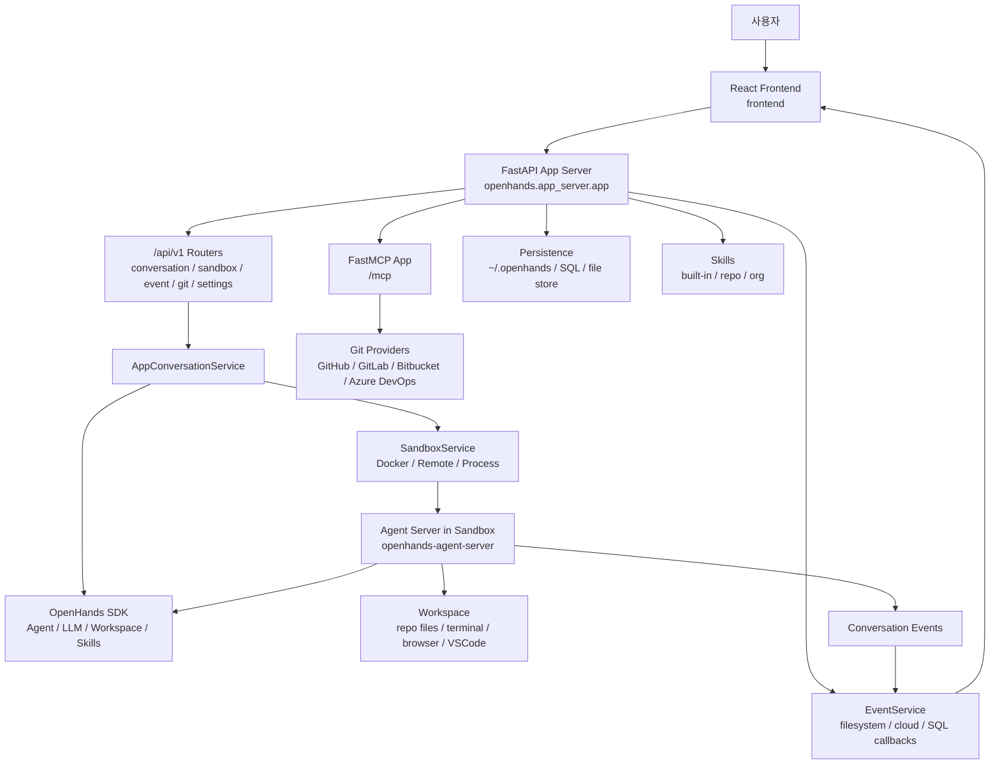
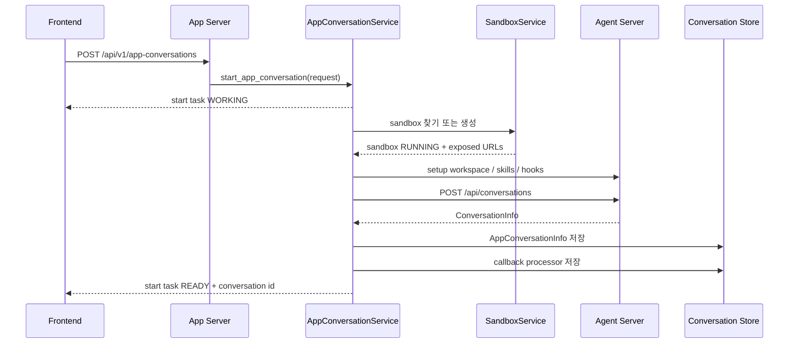

> 분석 일자: 2026-05-17
> 대상 버전: `openhands-ai` `1.7.0` / `openhands-frontend` `1.7.0`
> 주요 SDK 의존성: `openhands-sdk` `1.22.1` / `openhands-agent-server` `1.22.1` / `openhands-tools` `1.22.1`
> 대상 커밋: `e3d9abfd014ffd4283d03071fdb88c1c8edc77f6`
> 저장소: https://github.com/All-Hands-AI/OpenHands
> 로컬 분석 경로: `~/workspace/opensources/OpenHands`

---

_This article is partially written by Codex_

## 목차

1. [왜 OpenHands인가요?](#1-왜-openhands인가요)
2. [기존 글들과 어디에 놓이나요?](#2-기존-글들과-어디에-놓이나요)
3. [프로젝트를 한 문장으로 이해하기](#3-프로젝트를-한-문장으로-이해하기)
4. [기술 스택](#4-기술-스택)
5. [전체 그림](#5-전체-그림)
6. [코드베이스 지도](#6-코드베이스-지도)
7. [현재 저장소의 역할: engine보다 app server에 가깝습니다](#7-현재-저장소의-역할-engine보다-app-server에-가깝습니다)
8. [FastAPI app server: 모든 제품 요청의 앞문](#8-fastapi-app-server-모든-제품-요청의-앞문)
9. [Conversation startup flow](#9-conversation-startup-flow)
10. [Sandbox: 코딩 에이전트의 실행 경계](#10-sandbox-코딩-에이전트의-실행-경계)
11. [Agent-server 경계: 실제 에이전트 loop는 sandbox 안에 있습니다](#11-agent-server-경계-실제-에이전트-loop는-sandbox-안에-있습니다)
12. [Event store와 callback](#12-event-store와-callback)
13. [MCP: Git provider 작업을 app server가 대리합니다](#13-mcp-git-provider-작업을-app-server가-대리합니다)
14. [Frontend: conversation workspace UI](#14-frontend-conversation-workspace-ui)
15. [Skills와 microagents](#15-skills와-microagents)
16. [Enterprise 디렉터리의 의미](#16-enterprise-디렉터리의-의미)
17. [코드를 읽는 추천 순서](#17-코드를-읽는-추천-순서)
18. [인상적인 설계 포인트](#18-인상적인-설계-포인트)
19. [주의해서 볼 지점](#19-주의해서-볼-지점)
20. [결론](#20-결론)

---

## 1. 왜 OpenHands인가요?

OpenHands는 AI 코딩 에이전트 생태계에서 가장 많이 언급되는 오픈소스 프로젝트 중 하나입니다. 예전에는 Devin류의 "브라우저에서 실행되는 코딩 에이전트"라는 인상이 강했습니다. 현재 저장소를 보면 더 구체적인 방향이 보입니다.

OpenHands는 하나의 agent loop만 구현하는 프로젝트가 아니라, 코딩 에이전트를 제품으로 운영하기 위해 필요한 경계를 나눕니다.

- 사용자는 React 기반 로컬 GUI에서 대화합니다.
- FastAPI app server가 conversation, sandbox, settings, git, secrets, event API를 제공합니다.
- 실제 agent runtime은 sandbox 안의 agent-server로 분리됩니다.
- agent-server와 app server는 HTTP와 session API key로 통신합니다.
- event는 app server에서 검색, 저장, callback, webhook으로 다룹니다.
- GitHub/GitLab/Bitbucket/Azure DevOps 연동은 app server가 사용자 토큰과 함께 처리합니다.
- V1에서는 skills와 plugin 개념으로 agent context를 구성합니다.

이 구조는 [Ruflo](/kb/2026-05-17-ruflo-architecture)와도 닮았지만 방향이 다릅니다. Ruflo가 Claude Code 주변에 CLI/MCP/swarm/memory를 붙이는 쪽이라면, OpenHands는 **코딩 에이전트 자체를 웹 제품과 sandbox runtime으로 운영하는 쪽**에 가깝습니다.

## 2. 기존 글들과 어디에 놓이나요?

OpenHands는 이 블로그의 최근 AI agent 글들과 자연스럽게 이어집니다.

| 글                                                       | 중심 문제                                     | OpenHands와의 관계                                                                                        |
| -------------------------------------------------------- | --------------------------------------------- | --------------------------------------------------------------------------------------------------------- |
| [Ruflo](/kb/2026-05-17-ruflo-architecture)               | Claude Code 주변의 agent orchestration        | OpenHands는 Claude Code plugin보다 독립 제품형 coding agent UI/runtime을 지향합니다.                      |
| [Superpowers](/kb/2026-04-18-superpowers-architecture)   | agent에게 절차와 skill을 강제하는 문서 시스템 | OpenHands의 `skills/`와 repository `.openhands/skills`가 비슷한 문제를 제품 안에서 다룹니다.              |
| [Hermes Agent](/kb/2026-05-13-hermes-agent-architecture) | Python tool-calling agent runtime             | Hermes가 단일 runtime 내부 구조에 집중한다면, OpenHands는 runtime을 sandbox와 app server 뒤에 배치합니다. |
| [agentmemory](/kb/2026-05-13-agentmemory-architecture)   | 장기 memory와 shared context                  | OpenHands는 memory보다 conversation/event/sandbox lifecycle을 먼저 제품 경계로 세웁니다.                  |

그래서 OpenHands는 "agent 알고리즘" 글이라기보다 "코딩 에이전트를 안전하게 띄우고, 대화하고, 파일을 고치고, PR까지 보내는 제품 경계" 글로 읽는 편이 좋습니다.

## 3. 프로젝트를 한 문장으로 이해하기

**OpenHands**는 React frontend, FastAPI app server, sandbox service, agent-server, Software Agent SDK, event store, MCP tools, skills를 묶어서 **AI 코딩 에이전트를 로컬 GUI와 cloud product 형태로 운영하는 플랫폼**입니다.

질문으로 바꾸면 다음과 같습니다.

| 질문                                           | OpenHands의 답                                                                                 |
| ---------------------------------------------- | ---------------------------------------------------------------------------------------------- |
| 에이전트 대화는 어디에서 시작하나요?           | `/api/v1/app-conversations`가 sandbox 준비와 agent-server conversation 생성을 조율합니다.      |
| 실제 코드 실행은 어디에서 일어나나요?          | Docker, remote, process sandbox 중 하나에서 agent-server가 실행합니다.                         |
| app server와 agent-server는 어떻게 통신하나요? | 노출 URL과 `X-Session-API-Key` header를 사용해 HTTP로 통신합니다.                              |
| UI는 어디에서 상태를 읽나요?                   | app server의 conversation/event/sandbox API와 sandbox runtime URL을 함께 사용합니다.           |
| Git provider 작업은 누가 하나요?               | app server MCP tool이 사용자 토큰을 읽고 PR/MR 작업을 대리합니다.                              |
| agent context는 어떻게 확장하나요?             | built-in skills, repository `.openhands/skills`, plugin spec, SDK agent settings를 사용합니다. |

## 4. 기술 스택

| 영역         | 기술                                                                |
| ------------ | ------------------------------------------------------------------- |
| Backend API  | Python 3.12/3.13, FastAPI, Uvicorn, Pydantic, SQLAlchemy async      |
| Agent engine | `openhands-sdk`, `openhands-agent-server`, `openhands-tools` 패키지 |
| LLM 통합     | LiteLLM, OpenAI, Anthropic, Google GenAI, OpenHands provider        |
| Sandbox      | Docker SDK, remote sandbox, process sandbox, session API key        |
| MCP          | `fastmcp`, Tavily proxy, Git provider PR/MR tools                   |
| Frontend     | React 19, React Router 7, Vite, TypeScript, HeroUI, xterm, Monaco   |
| Event        | filesystem event store, SQL callback store, webhook callback        |
| 인증/설정    | JWT, provider token, user settings, secrets API                     |
| 배포         | Docker multi-stage image, frontend build 포함 app image             |
| Enterprise   | source-available `enterprise/` 디렉터리, Slack/Jira/Linear/RBAC 등  |

로컬 체크아웃 기준의 대략적인 규모는 다음과 같습니다.

| 항목                                      |    수치 |
| ----------------------------------------- | ------: |
| Git 추적 파일 수                          | 2,322개 |
| Python/TypeScript/JavaScript 계열 파일 수 | 1,972개 |
| `openhands` app server 아래 추적 파일 수  |   252개 |
| `frontend` 아래 추적 파일 수              | 1,274개 |
| `enterprise` 아래 추적 파일 수            |   496개 |
| `skills` 아래 추적 파일 수                |    27개 |
| 테스트 관련 추적 파일 수                  |   525개 |

여기서 중요한 점은 현재 저장소가 agent engine 전체를 다 품고 있지는 않다는 점입니다. 핵심 SDK와 agent-server는 PyPI dependency로 당겨오며, 이 저장소는 app server, GUI, container, enterprise product surface를 중심으로 구성되어 있습니다.

## 5. 전체 그림

큰 흐름은 아래처럼 볼 수 있습니다.



이 그림의 핵심은 app server가 agent loop를 직접 돌리는 것이 아니라는 점입니다. app server는 sandbox를 만들고, agent-server URL을 찾고, start request를 조립하고, conversation metadata와 event/callback을 관리합니다. 실제 workspace 조작과 agent 실행은 sandbox 안의 agent-server와 SDK 쪽으로 넘어갑니다.

## 6. 코드베이스 지도

핵심 디렉터리는 다음과 같습니다.

```text
OpenHands/
├── openhands/
│   ├── app_server/
│   │   ├── app.py                         # FastAPI 앱 진입점
│   │   ├── v1_router.py                   # /api/v1 router 조립
│   │   ├── config.py                      # env 기반 service injector 구성
│   │   ├── app_conversation/              # conversation lifecycle
│   │   ├── sandbox/                       # Docker/remote/process sandbox
│   │   ├── event/                         # event store/search
│   │   ├── event_callback/                # webhook/callback processor
│   │   ├── integrations/                  # GitHub/GitLab/Bitbucket/Azure
│   │   ├── mcp/                           # FastMCP tools
│   │   ├── settings/                      # user/app settings
│   │   ├── secrets/                       # secret APIs
│   │   └── user_auth/                     # auth helpers
│   └── server/                            # deprecated compatibility wrapper
├── frontend/
│   ├── src/routes/                        # conversation, settings, tabs
│   ├── src/api/                           # typed API clients
│   ├── src/services/                      # chat, terminal, observations
│   └── src/components/                    # UI components
├── containers/
│   ├── app/Dockerfile                     # frontend + backend app image
│   └── dev/
├── skills/                                # shared OpenHands skills
└── enterprise/                            # source-available enterprise layer
```

`openhands/server/*`는 deprecated wrapper입니다. 현재 중심은 `openhands/app_server/app.py`입니다.

## 7. 현재 저장소의 역할: engine보다 app server에 가깝습니다

README는 OpenHands를 SDK, CLI, Local GUI, Cloud, Enterprise로 나눕니다. 이 저장소가 직접 담당하는 중심은 Local GUI와 app server입니다.

`pyproject.toml`을 보면 다음 의존성이 명확히 들어 있습니다.

```text
openhands-sdk==1.22.1
openhands-agent-server==1.22.1
openhands-tools==1.22.1
openhands-aci==0.3.3
```

즉 agent primitive, agent-server runtime, tool preset의 상당 부분은 별도 package입니다. 이 저장소는 그 package들을 제품 환경에서 실행하기 위한 다음 계층을 제공합니다.

- sandbox 생성과 재사용 정책
- conversation metadata 저장
- agent-server start request 조립
- frontend API와 runtime URL bridge
- user setting, provider token, secret, Git integration
- event store와 callback
- Docker image와 enterprise extension

이 점을 놓치면 OpenHands 코드를 읽다가 "agent loop 본체가 왜 생각보다 적지?"라는 인상을 받을 수 있습니다. 현재 저장소는 agent engine 자체보다 **agent product shell**에 가깝습니다.

## 8. FastAPI app server: 모든 제품 요청의 앞문

`openhands/app_server/app.py`가 현재 FastAPI 진입점입니다.

여기에서 하는 일은 다음과 같습니다.

1. Tavily MCP proxy를 초기화합니다.
2. `mcp_server.http_app(path='/mcp')`를 FastAPI route로 mount합니다.
3. app lifespan과 MCP lifespan을 합칩니다.
4. `v1_router`와 health router를 붙입니다.
5. frontend build가 있으면 SPA static files를 mount합니다.
6. CORS, cache control, rate limit middleware를 붙입니다.

`v1_router.py`는 `/api/v1` 아래에 다음 router들을 묶습니다.

| Router                         | 역할                                    |
| ------------------------------ | --------------------------------------- |
| `event_router`                 | conversation event 검색과 count         |
| `app_conversation_router`      | conversation 시작, 조회, 메시지, export |
| `pending_message_router`       | conversation 준비 중 메시지 queue       |
| `sandbox_router`               | sandbox pause/resume/batch 조회         |
| `settings_router`              | LLM, agent, user settings               |
| `secrets_router`               | secret 관리                             |
| `user_router`, `skills_router` | user와 skill 조회                       |
| `webhook_router`               | external callback/webhook               |
| `web_client_router`            | frontend config                         |
| `git_router`                   | repository/provider 연동                |
| `config_router`                | app config와 model 목록                 |

OpenHands app server는 API gateway이면서 orchestrator입니다.

## 9. Conversation startup flow

OpenHands에서 가장 중요한 흐름은 conversation 시작입니다. 중심 파일은 `openhands/app_server/app_conversation/live_status_app_conversation_service.py`입니다.

대략적인 흐름은 다음과 같습니다.



여기서 `AppConversationStartTask`가 중요합니다. conversation 생성은 즉시 끝나는 작업이 아닙니다. sandbox가 떠야 하고, repository를 준비해야 하며, setup script와 skill/hook 설치가 필요합니다. 그래서 API는 start task를 먼저 만들고, 상태가 `READY`가 될 때까지 polling하거나 stream처럼 업데이트를 받는 구조입니다.

상태 전이는 코드 주석에 잘 드러납니다.

```text
WORKING -> WAITING_FOR_SANDBOX -> PREPARING_REPOSITORY
-> RUNNING_SETUP_SCRIPT -> SETTING_UP_GIT_HOOKS -> SETTING_UP_SKILLS
-> STARTING_CONVERSATION -> READY
```

이 설계는 실제 제품에서 중요합니다. 코딩 에이전트를 시작하는 일은 "LLM 요청 하나"가 아니라 runtime 준비 작업입니다.

## 10. Sandbox: 코딩 에이전트의 실행 경계

`openhands/app_server/sandbox`는 OpenHands의 안전 경계입니다. README도 명확히 말합니다. agent는 시스템에 해를 줄 수 있는 작업을 할 수 있으므로 sandbox 안에서 실행됩니다.

구현체는 여러 개입니다.

| 구현체          | 파일                         |
| --------------- | ---------------------------- |
| Docker sandbox  | `docker_sandbox_service.py`  |
| Remote sandbox  | `remote_sandbox_service.py`  |
| Process sandbox | `process_sandbox_service.py` |
| Sandbox spec    | `*_sandbox_spec_service.py`  |

기본 설정은 Docker입니다. `config.py`는 `RUNTIME=remote`, `RUNTIME=local/process`, 그 외 기본 Docker를 분기합니다.

Docker sandbox는 container status를 OpenHands의 `SandboxStatus`로 변환하고, 노출 port를 `ExposedUrl` 목록으로 바꿉니다. 중요한 URL 이름은 `AGENT_SERVER`, `VSCODE`, `WORKER_1`, `WORKER_2`입니다.

agent-server URL을 app server가 찾는 방식도 명확합니다. sandbox의 exposed URL 중 `AGENT_SERVER`를 찾아 conversation context에 넣고, 이후 HTTP 요청에는 `X-Session-API-Key`를 붙입니다.

## 11. Agent-server 경계: 실제 에이전트 loop는 sandbox 안에 있습니다

OpenHands app server는 agent에게 직접 토큰을 넣고 loop를 돌리지 않습니다. conversation 생성 시 `StartConversationRequest`를 조립해서 sandbox 안 agent-server로 보냅니다.

`LiveStatusAppConversationService`는 다음을 모읍니다.

- 사용자 LLM settings
- provider base URL
- selected repository와 branch
- initial message
- agent type, planning agent instruction
- built-in tools 또는 planning tools
- plugin spec
- skills와 hooks
- workspace path
- secret lookup/static secret

이 정보가 agent-server의 `/api/conversations`로 전달됩니다. 이후 pause, resume, ask_agent, VSCode URL 조회 같은 runtime-specific API는 frontend가 conversation URL을 기반으로 agent-server endpoint를 직접 호출하거나 app server proxy를 거칩니다.

이 구조는 app server와 agent-server의 책임을 잘 나눕니다.

| 계층         | 책임                                                                                    |
| ------------ | --------------------------------------------------------------------------------------- |
| app server   | 사용자, 설정, sandbox lifecycle, conversation metadata, provider token, Git integration |
| agent-server | 실제 agent 실행, workspace 조작, terminal/browser/VSCode endpoint, conversation runtime |
| SDK/tools    | Agent, LLM, workspace, tool preset, skill loading primitive                             |

## 12. Event store와 callback

OpenHands에서 event는 conversation의 실행 기록입니다. `openhands/app_server/event`는 event storage, search, count, pagination을 제공합니다.

기본 OSS 흐름에서는 `FilesystemEventService`가 사용자별 persistence directory 아래에서 event JSON을 읽고 씁니다. storage provider 설정에 따라 AWS/GCP event service도 선택됩니다.

`event_callback`은 별도 계층입니다. README에 따르면 callback CRUD, webhook endpoint, event filtering, retry, result tracking을 담당합니다. 기본 callback 중 하나가 `SetTitleCallbackProcessor`입니다. conversation 시작 후 자동으로 저장되어 이벤트를 보고 conversation title을 업데이트할 수 있습니다.

이벤트를 별도 도메인으로 둔 점이 좋습니다. 코딩 에이전트 제품에서는 최종 답변보다 trajectory가 중요할 때가 많습니다. 어떤 command를 실행했는지, 어떤 파일을 봤는지, 어디서 confirmation이 필요했는지, 어떤 external callback을 보냈는지가 모두 제품 데이터입니다.

## 13. MCP: Git provider 작업을 app server가 대리합니다

`openhands/app_server/mcp/mcp_router.py`는 FastMCP server를 만듭니다. 여기에서 눈에 띄는 tool은 PR/MR 생성입니다.

예를 들어 `create_pr` tool은 다음 흐름을 탑니다.

1. HTTP request에서 conversation id header를 읽습니다.
2. 사용자 provider token과 access token을 가져옵니다.
3. `GithubServiceImpl`을 만듭니다.
4. SaaS mode라면 PR body에 OpenHands conversation link를 붙입니다.
5. GitHub API로 PR을 만듭니다.
6. conversation metadata에 PR number를 저장합니다.

이 구조는 "agent가 직접 GitHub token을 들고 PR을 연다"가 아닙니다. app server가 인증 문맥과 제품 문맥을 가진 상태에서 MCP tool을 제공합니다. GitLab MR, Bitbucket, Azure DevOps도 같은 방향으로 확장됩니다.

또 하나 흥미로운 부분은 Tavily proxy입니다. Tavily API key가 설정되어 있으면 app server의 MCP server 아래에 Tavily MCP proxy를 mount합니다. 외부 검색 도구 key를 sandbox에 직접 노출하지 않고 app server가 중계하는 구조입니다.

## 14. Frontend: conversation workspace UI

`frontend`는 React Router 7 기반 SPA입니다. route 목록을 보면 제품 표면이 잘 보입니다.

```text
conversation
browser-tab
changes-tab
planner-tab
task-list-tab
vscode-tab
terminal/service
agent-settings
llm-settings
mcp-settings
skills-settings
secrets-settings
git-settings
```

프론트엔드 API client는 `frontend/src/api`에 서비스별로 나뉘어 있습니다. `conversation-service/v1-conversation-service.api.ts`는 conversation 시작, start task polling, VSCode URL, pause/resume, ask_agent, profile switch를 담당합니다.

흥미로운 점은 frontend가 app server API와 agent-server runtime API를 모두 이해한다는 점입니다. app server에서 conversation metadata를 받고, conversation URL을 통해 sandbox 내부 agent-server endpoint도 호출합니다.

코딩 에이전트 UI는 일반 채팅 UI보다 넓습니다. terminal, browser, VSCode, file changes, planner, task list, settings가 한 workspace에 같이 있어야 합니다. OpenHands frontend 구조는 그 요구사항을 그대로 반영합니다.

## 15. Skills와 microagents

`skills/README.md`는 V0와 V1 용어 변화를 설명합니다. V0에서는 microagents라는 용어를 쓰고, V1에서는 skills라는 용어를 씁니다.

skill source는 크게 두 가지입니다.

| Source                                                       | 역할                                |
| ------------------------------------------------------------ | ----------------------------------- |
| `OpenHands/skills/`                                          | 모든 사용자에게 제공되는 공유 skill |
| repository `.openhands/skills` 또는 `.openhands/microagents` | repository별 비공개 지침            |

`openhands/app_server/app_conversation/skill_loader.py`는 app server가 직접 모든 skill loading을 처리하지 않는다는 점을 강조합니다. app server는 org config와 sandbox config를 만들고, source-specific loading은 agent-server에 맡깁니다.

이 구조는 Superpowers와 닮았습니다. Superpowers가 skill 문서를 통해 agent 절차를 강제했다면, OpenHands는 제품 안에서 repository, organization, built-in skill을 합쳐 agent context를 구성합니다.

## 16. Enterprise 디렉터리의 의미

README는 `enterprise/` 디렉터리가 source-available이라고 설명합니다. MIT core와 달리 enterprise license가 따로 있습니다.

코드를 보면 enterprise 영역에는 다음이 들어 있습니다.

- Slack, Jira, Linear 연동 storage
- organization, role, invitation, RBAC 관련 model/store
- billing/Stripe 관련 service
- offline token, API key, custom secrets
- SaaS server config와 middleware
- sync/maintenance task

이 구분은 OpenHands가 단순한 OSS local tool이 아니라 Cloud/Enterprise 제품까지 같은 저장소에서 관리하려는 구조임을 보여 줍니다.

## 17. 코드를 읽는 추천 순서

처음 읽을 때는 agent engine을 찾기보다 app server 흐름을 따라가는 편이 좋습니다.

1. `README.md`에서 SDK, CLI, Local GUI, Cloud, Enterprise 구분을 먼저 봅니다.
2. `pyproject.toml`에서 `openhands-sdk`, `openhands-agent-server`, `openhands-tools` 의존성을 확인합니다.
3. `openhands/app_server/app.py`와 `v1_router.py`로 FastAPI 표면을 봅니다.
4. `openhands/app_server/config.py`로 service injector와 runtime 선택 방식을 봅니다.
5. `openhands/app_server/app_conversation/live_status_app_conversation_service.py`로 conversation startup을 따라갑니다.
6. `openhands/app_server/sandbox/docker_sandbox_service.py`로 sandbox와 exposed URL 구조를 봅니다.
7. `openhands/app_server/event`와 `event_callback`으로 event persistence와 webhook을 봅니다.
8. `openhands/app_server/mcp/mcp_router.py`로 Git provider MCP tool을 봅니다.
9. `frontend/src/api/conversation-service/v1-conversation-service.api.ts`와 `frontend/src/routes`로 UI가 어떤 API를 기대하는지 확인합니다.
10. 마지막으로 `skills/README.md`와 `skills/*.md`로 agent context 확장 방식을 봅니다.

## 18. 인상적인 설계 포인트

첫 번째는 **app server와 agent-server 분리**입니다. 제품 인증, 설정, sandbox lifecycle은 app server가 담당하고, 실제 workspace 조작과 agent loop는 sandbox 안으로 넘깁니다. 코딩 에이전트의 위험한 부분을 경계 밖으로 밀어내는 설계입니다.

두 번째는 **conversation start를 task로 모델링한 점**입니다. sandbox 준비와 repository setup은 오래 걸릴 수 있습니다. 이 과정을 start task 상태로 노출하는 것은 실제 제품 경험에 맞습니다.

세 번째는 **dependency injection이 명시적이라는 점**입니다. `config.py`는 env에서 `AppServerConfig`를 만들고, event/sandbox/user/jwt/httpx/db_session/service injector를 구성합니다. OSS local, remote runtime, SaaS/enterprise 설정을 같은 app server shape에 넣으려는 의도가 보입니다.

네 번째는 **MCP tool이 제품 문맥을 활용한다는 점**입니다. PR/MR 생성 tool은 단순 API wrapper가 아니라 conversation link, provider token, metadata 저장을 함께 처리합니다.

## 19. 주의해서 볼 지점

첫 번째는 저장소와 package 경계입니다. OpenHands의 실제 agent primitive는 별도 package로 빠져 있습니다. 이 저장소만 읽고 agent algorithm을 모두 이해하려 하면 빠지는 부분이 생깁니다.

두 번째는 V0/V1 전환 흔적입니다. README와 skills 문서에서 V0 microagents, V1 skills, deprecated `openhands/server` wrapper가 함께 보입니다. 코드를 읽을 때 현재 주 경로가 무엇인지 계속 확인해야 합니다.

세 번째는 frontend가 app server와 runtime server를 모두 호출한다는 점입니다. 이 구조는 유연하지만 URL, auth header, session API key, CORS 설정이 어긋나면 디버깅이 까다로울 수 있습니다.

네 번째는 enterprise source-available 영역입니다. core MIT 코드와 enterprise license 코드가 같은 저장소에 있으므로, 재사용하거나 배포할 때 license boundary를 확인해야 합니다.

## 20. 결론

OpenHands는 "LLM에게 코드를 고치게 하는 loop"보다 큰 프로젝트입니다. 코딩 에이전트를 실제 제품으로 만들기 위해 app server, sandbox, agent-server, SDK, event store, MCP, frontend workspace, skills, enterprise integration을 나눠서 운영합니다.

가장 중요한 설계 포인트는 **코딩 에이전트의 위험한 실행을 sandbox 안으로 밀어 넣고, 제품 문맥은 app server가 붙잡는 구조**입니다. 이 경계 덕분에 OpenHands는 local GUI, cloud, enterprise를 같은 큰 모델 안에서 다룰 수 있습니다.

Ruflo가 Claude Code 생태계를 확장하는 에이전트 운영 계층이라면, OpenHands는 독립적인 코딩 에이전트 제품을 세우는 쪽입니다. AI coding agent가 terminal prompt에서 product runtime으로 이동할 때 어떤 구조가 필요한지 보고 싶다면, OpenHands는 매우 좋은 분석 대상입니다.
