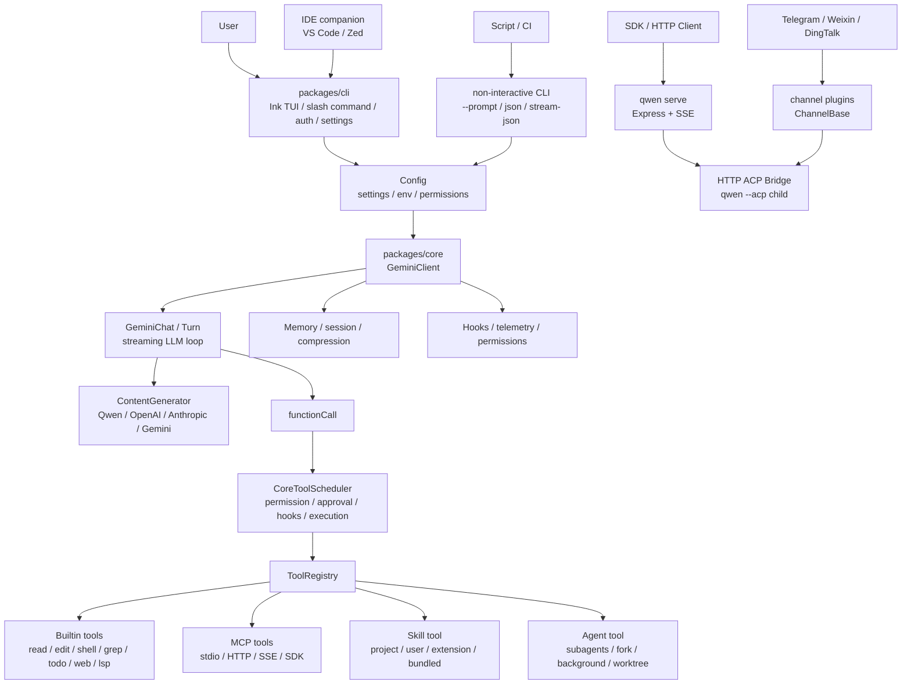
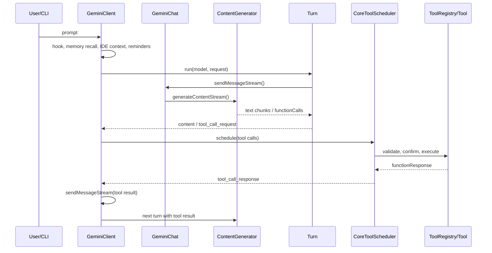
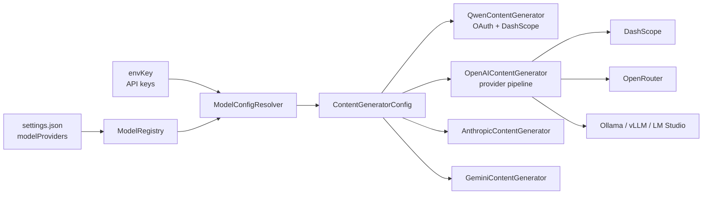
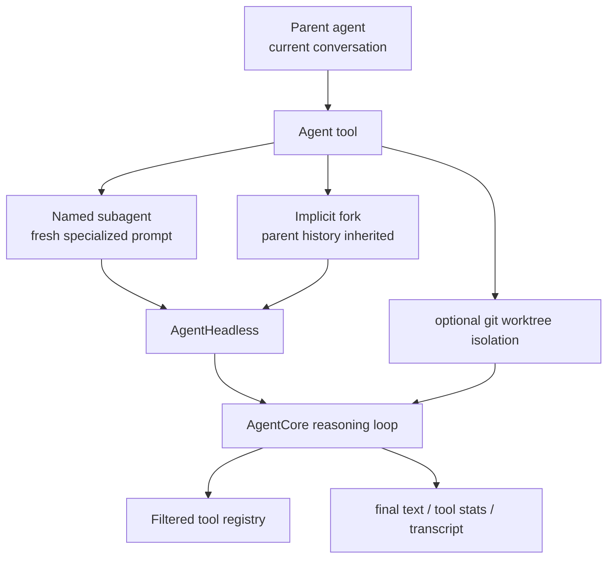
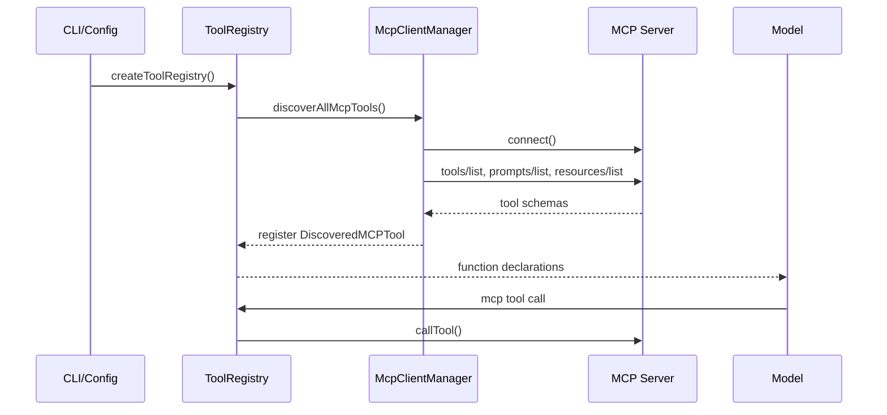
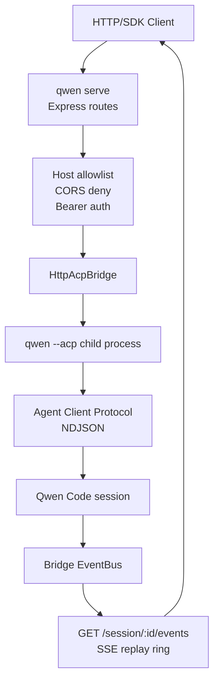

> Analysis date: 2026-05-17
> Target package: `@qwen-code/qwen-code` `0.15.11`
> Target commit: `672de88a4742364e5be047aa7bc3f4dc2cec2e21`
> Repository: https://github.com/QwenLM/qwen-code
> Local analysis path: `~/workspace/opensources/qwen-code`

---

_This article is partially written by Codex_

## Table of Contents

1. [Why Qwen Code?](#1-why-qwen-code)
2. [Where Does It Sit Among the Previous Articles?](#2-where-does-it-sit-among-the-previous-articles)
3. [Understanding the Project in One Sentence](#3-understanding-the-project-in-one-sentence)
4. [Tech Stack and Scale](#4-tech-stack-and-scale)
5. [The Big Picture](#5-the-big-picture)
6. [Codebase Map](#6-codebase-map)
7. [The CLI Is the Front Door to the Product Experience](#7-the-cli-is-the-front-door-to-the-product-experience)
8. [The Core Loop: Shuttling Between LLM Responses and Tool Calls](#8-the-core-loop-shuttling-between-llm-responses-and-tool-calls)
9. [Tool Registry and Scheduler: Handling Permissions, Parallelism, and Hooks in One Place](#9-tool-registry-and-scheduler-handling-permissions-parallelism-and-hooks-in-one-place)
10. [Model Providers: Not a Qwen-Only CLI but a Multi-Provider Runtime](#10-model-providers-not-a-qwen-only-cli-but-a-multi-provider-runtime)
11. [Skills: Not Prompt Snippets but Discoverable Capabilities](#11-skills-not-prompt-snippets-but-discoverable-capabilities)
12. [Subagents: Named Agents, Implicit Fork, Worktree Isolation](#12-subagents-named-agents-implicit-fork-worktree-isolation)
13. [MCP and External Tool Extension](#13-mcp-and-external-tool-extension)
14. [`qwen serve`: Exposing the CLI as a Daemon Protocol](#14-qwen-serve-exposing-the-cli-as-a-daemon-protocol)
15. [Channel Plugins: The Messaging Layer That Reaches Beyond the Terminal](#15-channel-plugins-the-messaging-layer-that-reaches-beyond-the-terminal)
16. [Headless, SDK, and IDE Integration](#16-headless-sdk-and-ide-integration)
17. [Security and Operational Points](#17-security-and-operational-points)
18. [A Recommended Reading Order](#18-a-recommended-reading-order)
19. [Notable Design Decisions](#19-notable-design-decisions)
20. [Things to Watch Out For](#20-things-to-watch-out-for)
21. [Conclusion](#21-conclusion)

---

## 1. Why Qwen Code?

Qwen Code describes itself in its README as an "open-source AI agent that lives in the terminal." On the surface it is a terminal coding agent much like Claude Code or Gemini CLI. But open the repository and it turns out to be far broader than a simple CLI wrapper.

There are three core points.

First, Qwen Code **separates the terminal UI from the agent runtime.** `packages/cli` handles input, slash commands, the Ink UI, settings, authentication, and the serve/channel entrypoints, while `packages/core` handles LLM calls, prompts, the tool registry, permissions, MCP, skills, subagents, and memory.

Second, Qwen Code is **not a Qwen-only client but a provider-agnostic coding agent.** Qwen OAuth and the Alibaba Cloud Coding Plan are front and center, but in code it also handles OpenAI-compatible, Anthropic, and Gemini providers. The documentation noting that the Qwen OAuth free tier was discontinued after 2026-04-15 makes this direction even clearer.

Third, Qwen Code is **a project that tries to put Claude Code-style features inside its own TypeScript runtime.** Skills, Subagents, hooks, MCP, approval mode, plan mode, headless mode, IDE diff, the daemon protocol, and channel plugins all live inside the same monorepo.

So if you see Qwen Code only as "a CLI that uses Qwen models," it looks small. More accurately, it is **an agent runtime monorepo that extends a coding agent to the terminal, a daemon, an SDK, and even messenger channels.**

## 2. Where Does It Sit Among the Previous Articles?

Comparing it with the projects I've analyzed recently makes Qwen Code's position fairly clear.

| Article                                                | Central problem                                       | Relationship to Qwen Code                                                                                                                                   |
| ------------------------------------------------------ | ----------------------------------------------------- | ----------------------------------------------------------------------------------------------------------------------------------------------------------- |
| [OpenHands](/kb/2026-05-17-openhands-architecture)     | Operating a coding agent as a web product and sandbox | Where OpenHands sets up app server/sandbox product boundaries, Qwen Code is closer to a terminal-first runtime and a daemon protocol.                       |
| [Dify](/kb/2026-05-17-dify-architecture)               | Productizing LLM app development and workflow/RAG     | Where Dify is an LLM app platform, Qwen Code is a coding agent runtime that directly performs the developer's local work.                                   |
| [Ruflo](/kb/2026-05-17-ruflo-architecture)             | An orchestration layer around Claude Code             | Where Ruflo bolts an operations layer onto the outside of Claude Code, Qwen Code embeds skills/subagents/hooks/tool loop inside the CLI itself.             |
| [Superpowers](/kb/2026-04-18-superpowers-architecture) | A doc system that forces process and skills on agents | Qwen Code's Skills lean toward handling Superpowers-style knowledge as discoverable capabilities inside the Qwen runtime.                                   |
| [agentmemory](/kb/2026-05-13-agentmemory-architecture) | Long-term memory and shared context                   | Qwen Code also has auto memory, skill review, and session recap, but they are auxiliary layers inside the agent loop rather than a separate memory product. |

This connection matters because Qwen Code is not explained by "swapping the model provider" alone. The core of Qwen Code is less about the provider than about **the operational domain of a coding agent.**

In the OpenHands article, the app server and the sandbox were the product boundaries. In the Dify article, the workflow canvas and the plugin daemon were the product boundaries. In Qwen Code, those boundaries are `ToolRegistry`, `CoreToolScheduler`, `AgentTool`, `SkillManager`, `qwen serve`, and channel plugins.

## 3. Understanding the Project in One Sentence

**Qwen Code** is a Node.js 22-based TypeScript monorepo that bundles an Ink terminal UI, an LLM provider abstraction, a tool-calling loop, a permission scheduler, MCP discovery, Skills, Subagents, headless/SDK mode, a daemon HTTP protocol, and channel plugins to become **an open-source agent runtime that runs a Claude Code-style coding-agent experience on top of Qwen/DashScope and multiple providers.**

Rephrased as questions:

| Question                                        | Qwen Code's answer                                                                                                      |
| ----------------------------------------------- | ----------------------------------------------------------------------------------------------------------------------- |
| Where do users talk to it?                      | The Ink-based terminal UI in `packages/cli`, the non-interactive CLI, and the ACP/serve/channel entrypoints.            |
| Where is the real agent loop?                   | `packages/core/src/core/client.ts`, `turn.ts`, and `geminiChat.ts` manage the LLM stream and the tool-call loop.        |
| How are tools registered?                       | `Config.createToolRegistry()` lazily registers the built-in tool factories and adds MCP/command-discovered tools.       |
| How does it handle dangerous tool calls?        | `CoreToolScheduler` integrates the permission manager, approval mode, hooks, IDE diff, and non-interactive deny.        |
| How do you switch model providers?              | The `modelProviders` setting together with `ModelRegistry`, `ModelConfigResolver`, and per-provider content generators. |
| Where do you put team knowledge and procedures? | `SkillManager` loads `.qwen/skills`, `~/.qwen/skills`, and extension/bundled skills.                                    |
| How do you delegate complex work?               | `AgentTool` runs named subagents, implicit forks, background runs, and optional worktree isolation.                     |
| Can you use it outside the terminal?            | It offers `qwen --prompt`, stream-json, an SDK, `qwen serve`, ACP, channel plugins, and an IDE companion.               |

## 4. Tech Stack and Scale

| Area               | Technology                                                           |
| ------------------ | -------------------------------------------------------------------- |
| Runtime            | Node.js `>=22`, TypeScript, ESM                                      |
| Package management | npm workspaces, root package `@qwen-code/qwen-code`                  |
| Terminal UI        | React, Ink                                                           |
| LLM provider       | OpenAI SDK, Anthropic SDK, Google GenAI SDK, DashScope/Qwen OAuth    |
| Tool protocol      | Google GenAI function declarations, OpenAI-compatible converter, MCP |
| Extension          | Skills, Subagents, MCP, hooks, channel plugins, extensions           |
| Daemon/API         | Express, SSE, ACP bridge                                             |
| Sandbox            | macOS Seatbelt, Docker/Podman sandbox image                          |
| IDE                | VS Code companion, Zed extension, IDE diff/context                   |
| Testing            | Vitest, integration/e2e scripts                                      |

The approximate scale of the local checkout:

| Item                                    | Count |
| --------------------------------------- | ----: |
| Git-tracked files                       | 2,789 |
| TypeScript/JavaScript-family files      | 2,207 |
| Tracked files under `packages/core/src` |   710 |
| Tracked files under `packages/cli/src`  | 1,031 |
| Tracked files under `packages/channels` |    56 |

By file count alone it's smaller than Dify or OpenHands, but its feature scope is quite broad. In particular, `packages/core/src` is densely packed with components that connect to tools, permissions, models, MCP, skills, subagents, memory, hooks, telemetry, and the serve bridge.

## 5. The Big Picture

The big structure can be seen like this.



Inside the code there are still many names like `GeminiClient` and `GeminiChat`. By name they look Gemini-only, but their actual role is Qwen Code's general agent client and chat loop. Provider selection branches on the `ContentGenerator` and model registry side.

## 6. Codebase Map

The core directories are as follows.

```text
qwen-code/
├── packages/
│   ├── cli/
│   │   ├── src/gemini.tsx                 # CLI main flow
│   │   ├── src/nonInteractiveCli.ts       # --prompt, json, stream-json
│   │   ├── src/config/                    # yargs, settings, auth, sandbox
│   │   ├── src/ui/                        # Ink UI, commands, dialogs
│   │   ├── src/serve/                     # qwen serve HTTP daemon
│   │   ├── src/acp-integration/           # ACP agent integration
│   │   └── src/commands/                  # auth, mcp, channel, extensions
│   ├── core/
│   │   ├── src/core/                      # GeminiClient, Turn, GeminiChat
│   │   ├── src/config/                    # runtime Config, tool registry assembly
│   │   ├── src/tools/                     # builtin tools, MCP tools, Agent tool
│   │   ├── src/permissions/               # permission rules and shell semantics
│   │   ├── src/models/                    # modelProviders registry/resolver
│   │   ├── src/skills/                    # skill discovery, activation, bundled skills
│   │   ├── src/subagents/                 # subagent config manager
│   │   ├── src/agents/runtime/            # AgentCore, AgentHeadless
│   │   ├── src/mcp/                       # OAuth/token storage for MCP
│   │   ├── src/memory/                    # auto memory, recall, extraction, dream
│   │   ├── src/hooks/                     # hook system
│   │   └── src/telemetry/                 # tracing, metrics, logging
│   ├── sdk-typescript/
│   ├── sdk-python/
│   ├── sdk-java/
│   ├── vscode-ide-companion/
│   ├── zed-extension/
│   ├── webui/
│   └── channels/
│       ├── base/                          # ChannelBase, SessionRouter, gates
│       ├── telegram/
│       ├── weixin/
│       ├── dingtalk/
│       └── plugin-example/
├── docs/
│   ├── developers/                        # architecture, qwen serve, tools, plugins
│   └── users/                             # features and configuration
└── package.json                           # bin: qwen, workspaces, scripts
```

When analyzing, the first place to look is `createToolRegistry()` in `packages/core/src/config/config.ts`. This function shows which tools Qwen Code provides by default, which tools it opens conditionally, and when it attaches MCP discovery.

Next is `packages/core/src/core/client.ts`. The entire loop through which a single user sentence flows into system reminders, memory recall, IDE context, model request, tool scheduling, stop hook, and next-speaker check is gathered here.

## 7. The CLI Is the Front Door to the Product Experience

Despite its name, `packages/cli/src/gemini.tsx` is the central entrypoint of the Qwen Code CLI. It assembles the following here:

- loading settings and printing warnings
- auth method validation
- sandbox relaunch
- starting the interactive Ink UI
- running the non-interactive `--prompt`
- stream-json I/O
- ACP agent mode
- auto-update and startup profiling
- terminal redraw / synchronized output optimization

In other words, the CLI is not a thin wrapper that merely calls `core.send(prompt)`. Most of the product experience users feel lives in the CLI.

| CLI area              | Role                                                                                          |
| --------------------- | --------------------------------------------------------------------------------------------- |
| Interactive UI        | Ink-based conversation, tool confirmation, stats, dialogs, model picker                       |
| Slash commands        | `/auth`, `/model`, `/mcp`, `/agents`, `/skills`, `/hooks`, `/resume`, etc.                    |
| Prompt processors     | `@file`, shell injection, markdown command, MCP prompt                                        |
| Non-interactive mode  | `qwen -p`, JSON output, stream-json output, structured output                                 |
| Serve/channel command | `qwen serve`, `qwen channel` — exposing the agent runtime to external processes or messengers |
| Settings/auth         | `.qwen/settings.json`, `~/.qwen/settings.json`, env, provider setup                           |

Where OpenHands puts a browser UI and a FastAPI app server at the front door, Qwen Code's default front door is the terminal. But because headless, ACP, an HTTP daemon, and the channel command are already inside the CLI, it doesn't end at the terminal alone.

## 8. The Core Loop: Shuttling Between LLM Responses and Tool Calls

Core's central flow can be seen in `GeminiClient.sendMessageStream()` and `Turn.run()`.



In this loop, `Turn` converts the model stream into events. Text chunks come out as `GeminiEventType.Content`, tool calls as `GeminiEventType.ToolCallRequest`, and the finish reason as `GeminiEventType.Finished`. `GeminiClient` receives these events and handles loop detection, the stop hook, tool scheduling, and continuation.

A lot of context is also added along the way.

| Added context         | Where                                                                              |
| --------------------- | ---------------------------------------------------------------------------------- |
| UserPromptSubmit hook | Applies blocking/additional context before the prompt goes to the model.           |
| Auto memory recall    | Fetches memory documents relevant to the user prompt within a 2.5-second deadline. |
| IDE context           | Injects the active file, cursor, selection, and open files as system reminders.    |
| Subagent reminder     | Injects the list of available subagents as a system reminder.                      |
| Plan mode reminder    | When approval mode is plan, injects a reminder blocking non-read-only tools.       |
| Arena reminder        | When there is an arena session, injects the config path as a reminder.             |
| Stop hook             | Can force additional validation or continuation after the model stops.             |

So a single Qwen Code turn is not "user prompt -> LLM." In practice it is an agent turn that combines **the user prompt, local context, memory, hooks, IDE state, permission mode, and available tools.**

## 9. Tool Registry and Scheduler: Handling Permissions, Parallelism, and Hooks in One Place

In Qwen Code, the tool layer is split into two parts.

First, `ToolRegistry` gathers tool definitions. Built-in tools are registered as lazy factories, while MCP tools and command-discovered tools are added after discovery. Tools marked with `shouldDefer` are dropped from the initial function declarations and surface via `tool_search` when needed. This structure reduces initial prompt tokens while still widening the tool surface.

Second, `CoreToolScheduler` actually executes tool calls. What matters here is less the "execution" than the "policy before and after execution."

| Stage           | Core handling                                                                         |
| --------------- | ------------------------------------------------------------------------------------- |
| Registry lookup | Filters out hallucinated tool names or denied tools first.                            |
| Parameter build | Builds the invocation via the tool schema and custom validation.                      |
| Permission flow | Combines the tool's intrinsic permission, PermissionManager rules, and approval mode. |
| Confirmation    | Sends edit/shell/MCP/plan confirmations to the UI or the IDE diff.                    |
| Hook            | Runs `PermissionRequest`, `PreToolUse`, `PostToolUse`, and failure hooks.             |
| Execution       | Runs safe read-only tools in parallel and unsafe tools sequentially.                  |
| Response        | Converts the functionResponse into a form that can be fed back to the model.          |

The default tool set is as follows.

```text
edit
write_file
read_file
grep_search
glob
list_directory
run_shell_command
todo_write
ask_user_question
agent
skill
tool_search
web_fetch
lsp
enter_worktree
exit_worktree
monitor
cron_create / cron_list / cron_delete
structured_output
```

This structure connects to the "procedures that keep the agent from acting recklessly" seen in the [Superpowers](/kb/2026-04-18-superpowers-architecture) article. The difference is that where Superpowers injects procedures via external skill docs, Qwen Code puts the permission manager and scheduler in as runtime policy.

## 10. Model Providers: Not a Qwen-Only CLI but a Multi-Provider Runtime

Qwen Code's name is Qwen, but its model layer is fairly generalized.

Per `docs/users/configuration/model-providers.md`, the supported auth types are as follows.

| Auth type    | Meaning                                                                     |
| ------------ | --------------------------------------------------------------------------- |
| `qwen-oauth` | Qwen OAuth. Per the docs, the free tier was discontinued on 2026-04-15.     |
| `openai`     | OpenAI-compatible API. OpenAI, Azure OpenAI, OpenRouter, Ollama, vLLM, etc. |
| `anthropic`  | Anthropic Claude API                                                        |
| `gemini`     | Google Gemini API                                                           |

In code, `ModelRegistry` and `ModelConfigResolver` read the `modelProviders` setting and resolve it into a `ContentGeneratorConfig`. OpenAI-compatible providers are further split into DashScope, DeepSeek, OpenRouter, ModelScope, MiniMax, Mistral, and a default provider.



This design also matters for the project's survivability. Even if provider policies change, like the Qwen OAuth free-tier change, the runtime itself can keep being used with API-key-based providers. Had Qwen Code been "a CLI you use only with a Qwen account," such a transition would have been far harder.

## 11. Skills: Not Prompt Snippets but Discoverable Capabilities

A Qwen Code Skill is a directory containing a `SKILL.md`. There are four storage levels.

| Level     | Path or source                      | Purpose                        |
| --------- | ----------------------------------- | ------------------------------ |
| project   | `.qwen/skills/`                     | Shared team/project procedures |
| user      | `~/.qwen/skills/`                   | Personal workflows             |
| extension | Skills provided by an extension     | Distributable extensions       |
| bundled   | `packages/core/src/skills/bundled/` | Default built-in skills        |

`SkillManager` reads these skills, caches them, and detects changes with a watcher. `SkillTool` provides the model with the list of available skills and their descriptions. A skill can be invoked explicitly by the user via `/skills <name>`, but the key point is that the model can look at the description and invoke it when needed.

An interesting part is path-gated skills. If you put a `paths` glob in a skill's frontmatter, that skill is not exposed to the model from the start. Instead, it activates when a tool invocation like `read_file`, `edit`, or `write_file` touches the matching path. In other words, Qwen Code treats a skill not as a simple prompt library but as **a capability that opens depending on the file-access context.**

This structure also resembles [Ruflo](/kb/2026-05-17-ruflo-architecture)'s plugin/skill area. The difference is that where Ruflo wraps skills around the Claude Code plugin ecosystem, Qwen Code puts them directly inside the agent loop with its own `SkillManager` and `SkillTool`.

## 12. Subagents: Named Agents, Implicit Fork, Worktree Isolation

The most interesting part of Qwen Code is `AgentTool`. This single tool contains several execution modes.

| Mode                  | Description                                                                                                        |
| --------------------- | ------------------------------------------------------------------------------------------------------------------ |
| Named subagent        | Loads agent configs from `.qwen/agents/`, `~/.qwen/agents/`, extensions, and built-ins.                            |
| Implicit fork         | If you omit `subagent_type`, it creates a fork agent that inherits the parent conversation context.                |
| Background run        | If `run_in_background: true` or the agent config's `background: true`, it runs asynchronously.                     |
| Worktree isolation    | If `isolation: "worktree"`, it creates a temporary git worktree and preserves it if there are changes.             |
| Tool control          | Applies per-agent `tools`, `disallowedTools`, and MCP tool allow/deny.                                             |
| Approval mode control | Determines the permission mode by combining the parent mode, agent frontmatter, and whether the folder is trusted. |

Named subagents are defined with Markdown frontmatter.

```yaml
---
name: test-runner
description: Runs tests after code changes
model: inherit
approvalMode: auto-edit
tools:
  - read_file
  - grep_search
  - run_shell_command
---
You are a test runner...
```

Implicit fork is even more unusual. It reuses the parent's system prompt, tool declarations, and conversation history as-is as much as possible. The goal is not just simple context inheritance but sharing the prompt cache. The documentation explains that a fork subagent can share the DashScope prompt cache prefix to reduce cost.



Here you can also see the difference from OpenHands. OpenHands isolates at the product level with an agent-server inside a sandbox. Qwen Code reconstructs the subagent context and tool registry within the same local runtime, and isolates file changes with a git worktree when needed. It's a choice closer to a terminal worker than to a web product.

## 13. MCP and External Tool Extension

Qwen Code sees MCP as a primary means of extension. Configuration goes into `mcpServers`, and it handles stdio, HTTP, and SSE transports. MCP discovery reads tools, prompts, and resources and attaches them to the `ToolRegistry` and `PromptRegistry`.

The important point is progressive discovery. Per the docs, in interactive mode the UI comes up first and MCP discovery proceeds in the background. Ready MCP tools are then reflected into the model's tool list. In non-interactive mode, it waits for discovery to settle before the first prompt.



MCP tool permissions are also handled separately. If a server config has `trust: true` and the workspace is a trusted folder, confirmation can be skipped. The `readOnlyHint` in an MCP tool annotation is also used in the allow decision. Other MCP tools are ask by default.

This structure connects to [agentmemory](/kb/2026-05-13-agentmemory-architecture) as well. Where agentmemory provided shared memory to multiple coding agents via MCP, Qwen Code pulls MCP into its own tool registry to call external data and business systems.

## 14. `qwen serve`: Exposing the CLI as a Daemon Protocol

`qwen serve` is a feature that runs Qwen Code as an HTTP daemon. The implementation lives in `packages/cli/src/serve/*`. An Express app provides routes like `/health`, `/capabilities`, `/session`, `/session/:id/prompt`, and `/session/:id/events`, and internally communicates with a `qwen --acp` child process over an ACP bridge.



The most striking part of the serve design is its security defaults.

- A non-loopback bind does not start without a bearer token.
- Turning on `--require-auth` requires a token even on loopback.
- It rejects browser requests that carry an `Origin` header.
- On a loopback bind, a Host allowlist blocks DNS rebinding.
- `/health` is open pre-auth only on the loopback default; on non-loopback or with `--require-auth`, it moves behind the bearer.
- The daemon binds to one workspace, and creating a session with a different cwd returns `workspace_mismatch`.

This is a more operational design than "wrapping a CLI in HTTP." The direction is to let session and event handling ride on the same daemon protocol even when an IDE, SDK, web UI, and remote automation attach later.

## 15. Channel Plugins: The Messaging Layer That Reaches Beyond the Terminal

Qwen Code has Telegram, Weixin, and DingTalk channel packages plus a plugin example. The common base is `packages/channels/base`.

The core structure of a channel plugin is simple.

```text
Platform Adapter
  -> create Envelope
  -> ChannelBase.handleInbound()
  -> GroupGate / SenderGate
  -> SessionRouter
  -> AcpBridge.prompt()
  -> sendMessage()
```

An `Envelope` is an object that converts a platform message into a standard form Qwen Code understands. It includes sender, chat, whether it's a group, whether it's a mention, whether it's a reply, and attachments. `ChannelBase` commonly handles access control, slash commands, session routing, attachment processing, and concurrent dispatch modes.

| Component       | Role                                                               |
| --------------- | ------------------------------------------------------------------ |
| `SenderGate`    | allowlist, pairing, open policy                                    |
| `GroupGate`     | group allowlist, mention/reply gating                              |
| `SessionRouter` | Maps an ACP session according to user/thread/single scope          |
| Dispatch mode   | Handles concurrent messages via `collect`, `steer`, and `followup` |
| `BlockStreamer` | Splits long responses into blocks for sending                      |

This layer touches on the "agents that live in a messenger" direction seen in the OpenClaw and Hermes Agent articles. But Qwen Code's channels are less about the messenger being central and more an adapter that pushes the terminal agent runtime out to external conversation channels.

## 16. Headless, SDK, and IDE Integration

Qwen Code's default experience is the interactive terminal, but its automation surface is also fairly broad.

| Area              | Description                                                                                      |
| ----------------- | ------------------------------------------------------------------------------------------------ |
| Headless          | `qwen --prompt`, stdin, `--output-format json`, `--output-format stream-json`                    |
| Session resume    | Continues a project-scoped JSONL session via `--continue` and `--resume <sessionId>`.            |
| Structured output | Uses the `structured_output` tool as a terminal contract in `--json-schema` runs.                |
| SDK TypeScript    | Provides `mcpServers`, `excludeTools`, `authType`, and an embedded MCP server helper.            |
| SDK Python/Java   | Separate SDK packages with external integration in mind.                                         |
| IDE companion     | Handles VS Code/Zed context, diff accept/reject, and active file/cursor/selection context.       |
| ACP integration   | Lets an external host create a Qwen Code session and send prompts via the Agent Client Protocol. |

IDE context also feeds directly into the core loop. The active file, cursor, selected text, and open files are combined into system reminders, and edit confirmations can open an IDE diff. Thanks to this, Qwen Code is not an agent isolated inside the terminal but one that can read editor state and even get diff approval from the editor UI.

## 17. Security and Operational Points

Because Qwen Code's tool surface is broad, its security machinery has several layers.

| Layer           | Mechanism                                                                                                    |
| --------------- | ------------------------------------------------------------------------------------------------------------ |
| Trusted folder  | Used as a precondition for MCP resources, trusted MCP tools, and privileged approval mode.                   |
| Permission rule | Does allow/ask/deny rules, shell command semantic extraction, and path/domain matching.                      |
| Approval mode   | Provides four modes: `plan`, `default`, `auto-edit`, and `yolo`.                                             |
| Sandbox         | Supports macOS Seatbelt and Docker/Podman sandboxes.                                                         |
| Shell parsing   | Uses shell-quote and an AST parser to judge read-only commands, command substitution, and compound commands. |
| Serve auth      | Has bearer tokens, a host allowlist, CORS deny, and workspace binding.                                       |
| Hook system     | Lets you add policy via permission request, pre/post tool use, and stop/subagent hooks.                      |

In particular, `run_shell_command` doesn't just end at "shell is dangerous, so ask." The permission manager splits compound commands and extracts shell semantics to connect meanings like `cat`, `curl`, and file writes to separate tool rules. This direction is an attempt for the runtime to interpret the user's configuration more granularly.

Of course, this machinery doesn't fully replace the sandbox. The docs also explain that a sandbox reduces risk but does not eliminate it. In practice, it's best to combine trusted folders, `default` or `auto-edit`, and the sandbox to fit the situation.

## 18. A Recommended Reading Order

If you're reading Qwen Code for the first time, I recommend the following order.

1. `docs/developers/architecture.md`

   Get a handle on the big CLI/Core/Tools split first.

2. `package.json`

   Look at workspaces, the `qwen` bin, the sandbox image, scripts, and the Node version.

3. `packages/cli/src/gemini.tsx`

   Check what branches the CLI entrypoint has, from interactive/non-interactive to ACP/serve.

4. `packages/core/src/config/config.ts`

   Reading `createToolRegistry()` reveals the built-in tools, MCP discovery, and permission gating.

5. `packages/core/src/core/client.ts`

   See the flow of the user prompt through hooks, memory, IDE context, the tool loop, and the stop hook.

6. `packages/core/src/core/turn.ts`

   See how the model stream is converted into content, thought, tool call, and finish events.

7. `packages/core/src/core/coreToolScheduler.ts`

   See permission decisions, confirmation, hooks, parallel execution, and tool-response conversion.

8. `packages/core/src/tools/agent/agent.ts`

   See how subagent, fork, background, and worktree isolation branch within the same tool.

9. `packages/core/src/skills/skill-manager.ts`

   See project/user/extension/bundled skill discovery and path-gated activation.

10. `packages/cli/src/serve/*` and `packages/channels/base/src/*`

    See the daemon/channel boundaries where Qwen Code extends beyond the terminal.

## 19. Notable Design Decisions

### 1. It composes the ToolRegistry as lazy factories.

Rather than importing every tool class at startup, it registers factories and loads them with `ensureTool()` when needed. MCP tool collisions, deferred tools, and `tool_search` are all considered together. A design conscious of both CLI startup and the prompt token budget at once.

### 2. The permission flow is concentrated in a single scheduler.

Permission decisions aren't scattered inside each tool but concentrated in `CoreToolScheduler` and `PermissionManager`. A tool provides its own default permission and confirmation details, and the scheduler combines approval mode, PM rules, hooks, and UI/IDE confirmation.

### 3. Skills and Subagents go beyond "docs" to become runtime capabilities.

Skills have settings like path activation, hooks, model override, and disabling model invocation. Subagents have a tool allowlist, model selection, approval mode, background, and worktree isolation. In other words, both are tied to runtime policy rather than being prompt snippets.

### 4. Serve/channel/SDK all point at the same agent core.

Terminal, headless, HTTP daemon, ACP, and channel plugins don't split off into completely different products. Most point at the core runtime and the ACP/session abstraction. Thanks to this, Qwen Code has room to expand from a CLI tool toward a platform.

### 5. There is a defense against provider change.

Qwen OAuth is front and center, but the model provider registry also handles OpenAI-compatible, Anthropic, and Gemini. Even with a policy change like discontinuing the Qwen OAuth free tier, users can move to API-key providers.

## 20. Things to Watch Out For

### 1. There are files whose names diverge from their actual roles.

Names like `GeminiClient`, `GeminiChat`, and `gemini.tsx` are confusing when you first try to understand the code. They are actually Qwen Code's general LLM client and CLI main flow. Read them as historical names and confirm the current provider abstraction separately.

### 2. The broad feature scope means many configuration combinations.

MCP, hooks, skills, subagents, approval mode, sandbox, serve, and channel all affect configuration and permissions. This combination is powerful, but to use it at team scale you need to clearly manage `.qwen/settings.json`, trusted folders, permission rules, and skill/agent files.

### 3. Fork subagents are convenient, but worktree isolation is not the default.

Implicit fork inherits the parent context, which is advantageous for parallel investigation. But as the docs note, a fork shares the same working directory by default. For parallel work that edits files, it's safer to consider a named subagent and `isolation: "worktree"`.

### 4. MCP progressive discovery is a trade-off between UX and determinism.

Interactive mode comes up quickly, but not all MCP tools may be ready at the moment of the first prompt. Non-interactive mode waits for settle and is more deterministic. In automation environments, you need to use it knowing this difference.

### 5. `qwen serve` is powerful but has a broad exposure surface.

The HTTP daemon is useful for SDKs and external UIs. But if you misconfigure the token, host binding, or workspace binding, you effectively expose the local agent runtime to the outside. A token is mandatory on non-loopback binds, and even on loopback it's better to turn on `--require-auth` in sensitive environments.

## 21. Conclusion

Qwen Code is a far larger project than "a CLI for using Qwen models in the terminal." Its actual structure is closer to **a terminal-first coding-agent platform.**

Where OpenHands leans toward operating a coding agent as a web product and a sandbox runtime, Qwen Code gathers the terminal, the tool scheduler, skills, subagents, MCP, a daemon, and channel plugins inside a single runtime. Where Dify is a platform that productizes LLM apps, Qwen Code is an agent runtime that reads, edits, runs commands, and delegates work inside the developer's local repository.

When looking at Qwen Code, the most important question is not "which model does it use?" The more important question is this:

> When a coding agent touches local files, the shell, the IDE, memory, skills, subagents, MCP, an HTTP daemon, and messenger channels all at once, with what runtime policy do you control those boundaries?

Qwen Code's answer is `Config`, `ToolRegistry`, `CoreToolScheduler`, `SkillManager`, `SubagentManager`, `qwen serve`, and channel plugins. Understand these boundaries and you can see that Qwen Code is evolving into an agent runtime platform, not a simple CLI.
