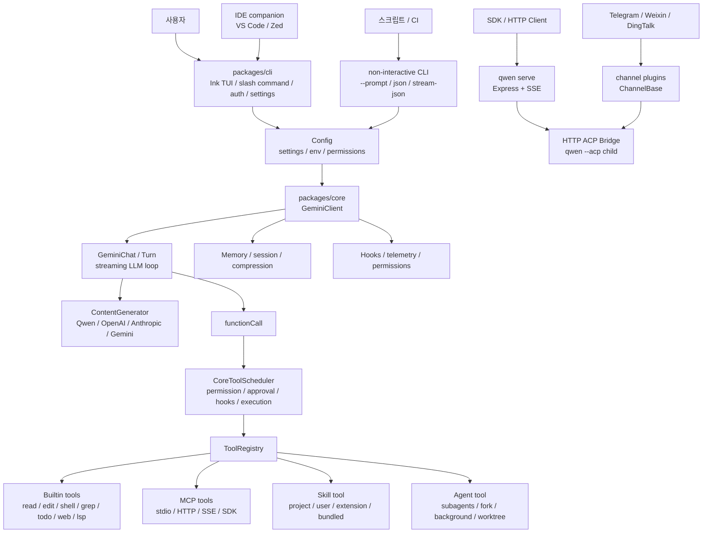
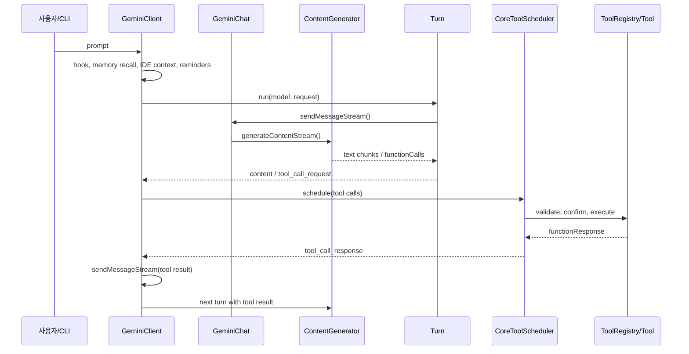
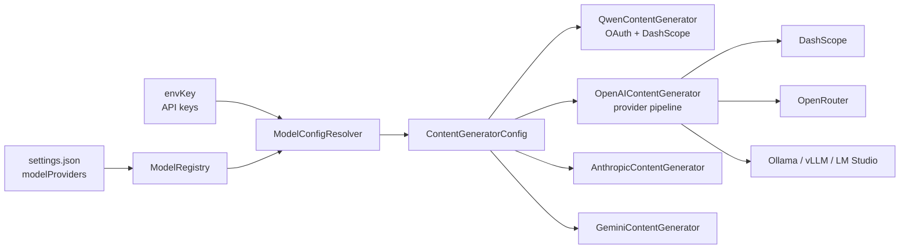
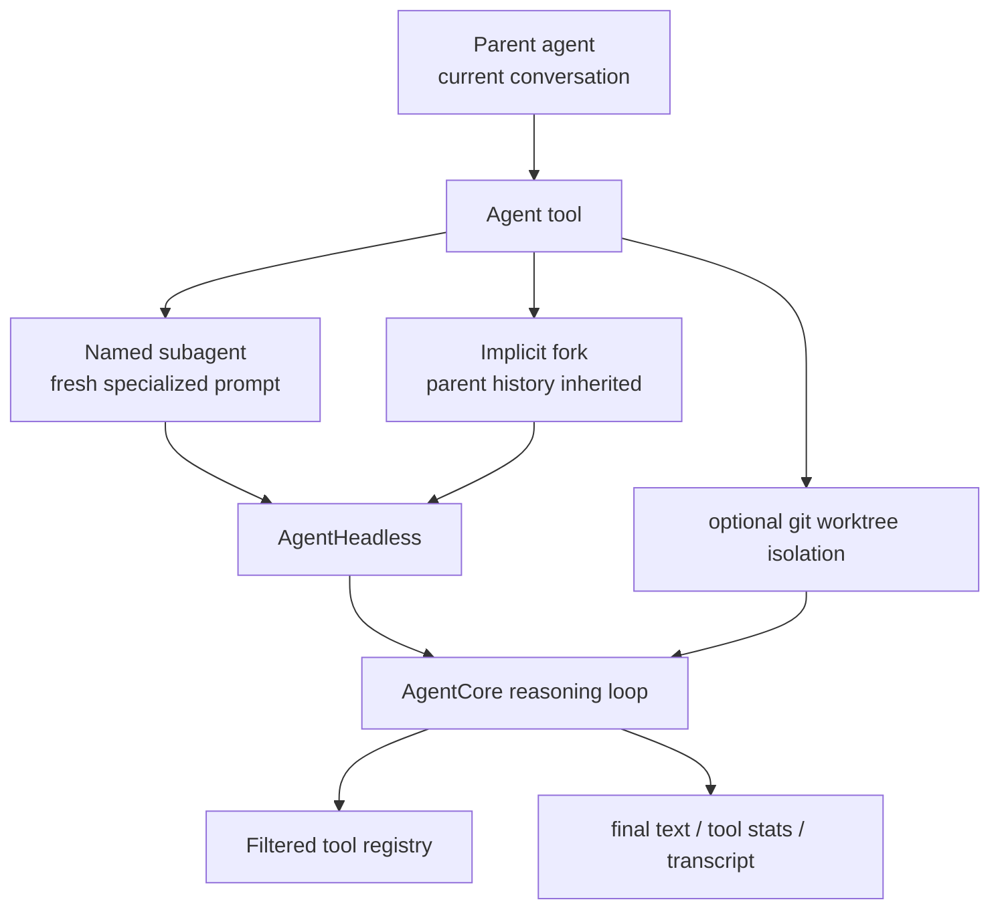
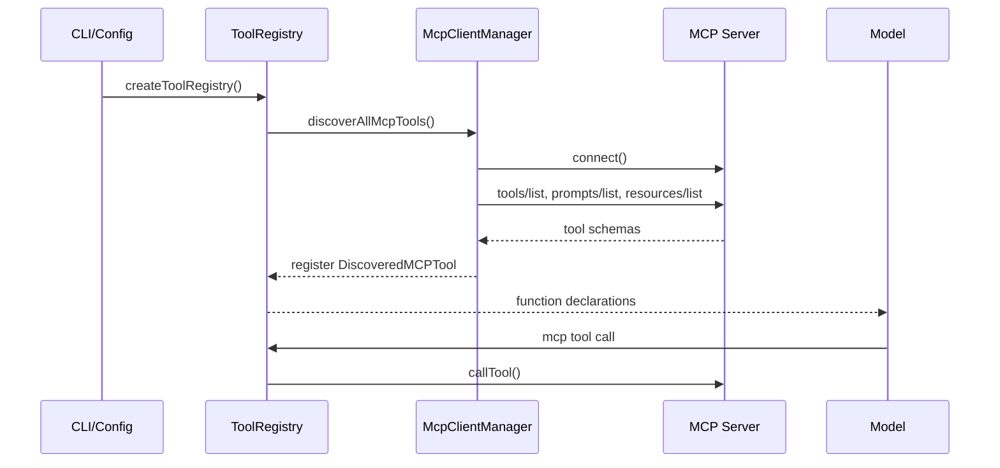
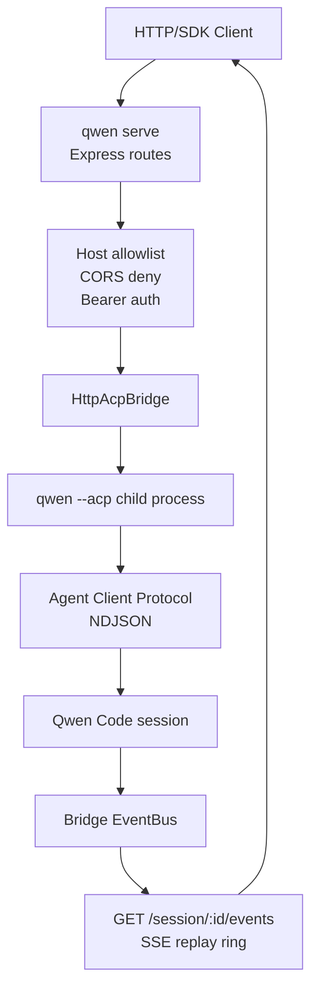

> 분석 일자: 2026-05-17
> 대상 패키지: `@qwen-code/qwen-code` `0.15.11`
> 대상 커밋: `672de88a4742364e5be047aa7bc3f4dc2cec2e21`
> 저장소: https://github.com/QwenLM/qwen-code
> 로컬 분석 경로: `~/workspace/opensources/qwen-code`

---

_This article is partially written by Codex_

## 목차

1. [왜 Qwen Code인가요?](#1-왜-qwen-code인가요)
2. [기존 글들과 어디에 놓이나요?](#2-기존-글들과-어디에-놓이나요)
3. [프로젝트를 한 문장으로 이해하기](#3-프로젝트를-한-문장으로-이해하기)
4. [기술 스택과 규모](#4-기술-스택과-규모)
5. [전체 그림](#5-전체-그림)
6. [코드베이스 지도](#6-코드베이스-지도)
7. [CLI는 제품 경험의 앞문입니다](#7-cli는-제품-경험의-앞문입니다)
8. [Core loop: LLM 응답과 tool call을 왕복시킵니다](#8-core-loop-llm-응답과-tool-call을-왕복시킵니다)
9. [Tool registry와 scheduler: 권한, 병렬성, hook을 한곳에서 처리합니다](#9-tool-registry와-scheduler-권한-병렬성-hook을-한곳에서-처리합니다)
10. [모델 provider: Qwen 전용 CLI가 아니라 다중 provider 런타임입니다](#10-모델-provider-qwen-전용-cli가-아니라-다중-provider-런타임입니다)
11. [Skills: 프롬프트 조각이 아니라 discoverable capability입니다](#11-skills-프롬프트-조각이-아니라-discoverable-capability입니다)
12. [Subagents: 명명 에이전트, implicit fork, worktree isolation](#12-subagents-명명-에이전트-implicit-fork-worktree-isolation)
13. [MCP와 외부 도구 확장](#13-mcp와-외부-도구-확장)
14. [`qwen serve`: CLI를 daemon protocol로 노출합니다](#14-qwen-serve-cli를-daemon-protocol로-노출합니다)
15. [Channel plugins: 터미널 밖으로 나가는 메시지 계층](#15-channel-plugins-터미널-밖으로-나가는-메시지-계층)
16. [Headless, SDK, IDE 연동](#16-headless-sdk-ide-연동)
17. [보안과 운영 지점](#17-보안과-운영-지점)
18. [코드를 읽는 추천 순서](#18-코드를-읽는-추천-순서)
19. [인상적인 설계 포인트](#19-인상적인-설계-포인트)
20. [주의해서 볼 지점](#20-주의해서-볼-지점)
21. [결론](#21-결론)

---

## 1. 왜 Qwen Code인가요?

Qwen Code는 README에서 자신을 "터미널에 사는 오픈소스 AI agent"로 설명합니다. 겉으로 보면 Claude Code나 Gemini CLI와 비슷한 터미널 코딩 에이전트입니다. 하지만 저장소를 열어 보면 단순한 CLI wrapper보다 훨씬 넓습니다.

핵심은 다음 세 가지입니다.

첫째, Qwen Code는 **터미널 UI와 agent runtime을 분리**합니다. `packages/cli`는 입력, slash command, Ink UI, 설정, 인증, serve/channel entrypoint를 맡고, `packages/core`는 LLM 호출, prompt, tool registry, permission, MCP, skills, subagents, memory를 맡습니다.

둘째, Qwen Code는 **Qwen 전용 클라이언트가 아니라 provider-agnostic 코딩 에이전트**입니다. Qwen OAuth와 Alibaba Cloud Coding Plan이 전면에 있지만, 코드상으로는 OpenAI-compatible, Anthropic, Gemini provider를 함께 다룹니다. 2026-04-15 이후 Qwen OAuth free tier가 중단되었다는 문서도 이 방향을 더 분명하게 보여줍니다.

셋째, Qwen Code는 **Claude Code류 기능을 자체 TypeScript runtime 안에 넣으려는 프로젝트**입니다. Skills, Subagents, hooks, MCP, approval mode, plan mode, headless mode, IDE diff, daemon protocol, channel plugin이 모두 같은 monorepo 안에 있습니다.

그래서 Qwen Code는 "Qwen 모델을 쓰는 CLI"라고만 보면 작게 보입니다. 더 정확하게는 **코딩 에이전트를 터미널, daemon, SDK, 메신저 채널까지 확장하는 agent runtime monorepo**입니다.

## 2. 기존 글들과 어디에 놓이나요?

최근 분석한 프로젝트들과 비교하면 Qwen Code의 위치가 꽤 분명합니다.

| 글                                                     | 중심 문제                                     | Qwen Code와의 관계                                                                                                     |
| ------------------------------------------------------ | --------------------------------------------- | ---------------------------------------------------------------------------------------------------------------------- |
| [OpenHands](/kb/2026-05-17-openhands-architecture)     | 코딩 에이전트를 웹 제품과 sandbox로 운영      | OpenHands가 app server/sandbox 제품 경계를 세운다면, Qwen Code는 터미널-first runtime과 daemon protocol에 가깝습니다.  |
| [Dify](/kb/2026-05-17-dify-architecture)               | LLM 앱 개발과 workflow/RAG 제품화             | Dify가 LLM 앱 플랫폼이라면, Qwen Code는 개발자 로컬 작업을 직접 수행하는 코딩 agent runtime입니다.                     |
| [Ruflo](/kb/2026-05-17-ruflo-architecture)             | Claude Code 주변 orchestration 계층           | Ruflo가 Claude Code 외부에 운영 계층을 붙인다면, Qwen Code는 CLI 내부에 skills/subagents/hooks/tool loop를 품습니다.   |
| [Superpowers](/kb/2026-04-18-superpowers-architecture) | agent에게 절차와 skill을 강제하는 문서 시스템 | Qwen Code의 Skills는 Superpowers류 지식을 Qwen runtime 안에서 discoverable capability로 다루는 쪽에 가깝습니다.        |
| [agentmemory](/kb/2026-05-13-agentmemory-architecture) | 장기 memory와 shared context                  | Qwen Code도 auto memory, skill review, session recap이 있지만 별도 memory product보다 agent loop 안의 보조 계층입니다. |

이 연결이 중요한 이유는 Qwen Code가 "모델 provider 교체"만으로 설명되지 않기 때문입니다. Qwen Code의 핵심은 provider보다 **코딩 에이전트 운영 영역**입니다.

OpenHands 글에서는 app server와 sandbox가 제품 경계였습니다. Dify 글에서는 workflow canvas와 plugin daemon이 제품 경계였습니다. Qwen Code에서는 `ToolRegistry`, `CoreToolScheduler`, `AgentTool`, `SkillManager`, `qwen serve`, channel plugin이 그 경계입니다.

## 3. 프로젝트를 한 문장으로 이해하기

**Qwen Code**는 Node.js 22 기반 TypeScript monorepo로, Ink terminal UI, LLM provider abstraction, tool-calling loop, permission scheduler, MCP discovery, Skills, Subagents, headless/SDK mode, daemon HTTP protocol, channel plugins를 묶어서 **Claude Code류 코딩 에이전트 경험을 Qwen/DashScope와 다중 provider 위에서 실행하는 오픈소스 agent runtime**입니다.

질문으로 바꾸면 다음과 같습니다.

| 질문                                  | Qwen Code의 답                                                                                                  |
| ------------------------------------- | --------------------------------------------------------------------------------------------------------------- |
| 사용자는 어디에서 대화하나요?         | `packages/cli`의 Ink 기반 terminal UI, non-interactive CLI, ACP/serve/channel entrypoint를 사용합니다.          |
| 실제 agent loop는 어디에 있나요?      | `packages/core/src/core/client.ts`, `turn.ts`, `geminiChat.ts`가 LLM stream과 tool call loop를 관리합니다.      |
| 도구는 어떻게 등록되나요?             | `Config.createToolRegistry()`가 builtin tool factory를 lazy 등록하고, MCP/command-discovered tool을 추가합니다. |
| 위험한 tool call은 어떻게 처리하나요? | `CoreToolScheduler`가 permission manager, approval mode, hooks, IDE diff, non-interactive deny를 통합합니다.    |
| 모델 provider는 어떻게 바꾸나요?      | `modelProviders` 설정과 `ModelRegistry`, `ModelConfigResolver`, provider별 content generator가 담당합니다.      |
| 팀 지식과 절차는 어디에 두나요?       | `.qwen/skills`, `~/.qwen/skills`, extension/bundled skills를 `SkillManager`가 로딩합니다.                       |
| 복잡한 작업은 어떻게 위임하나요?      | `AgentTool`이 named subagent, implicit fork, background run, optional worktree isolation을 실행합니다.          |
| 터미널 밖에서 쓸 수 있나요?           | `qwen --prompt`, stream-json, SDK, `qwen serve`, ACP, channel plugins, IDE companion을 제공합니다.              |

## 4. 기술 스택과 규모

| 영역          | 기술                                                                 |
| ------------- | -------------------------------------------------------------------- |
| 런타임        | Node.js `>=22`, TypeScript, ESM                                      |
| 패키지 관리   | npm workspaces, root package `@qwen-code/qwen-code`                  |
| Terminal UI   | React, Ink                                                           |
| LLM provider  | OpenAI SDK, Anthropic SDK, Google GenAI SDK, DashScope/Qwen OAuth    |
| Tool protocol | Google GenAI function declarations, OpenAI-compatible converter, MCP |
| 확장          | Skills, Subagents, MCP, hooks, channel plugins, extensions           |
| Daemon/API    | Express, SSE, ACP bridge                                             |
| Sandbox       | macOS Seatbelt, Docker/Podman sandbox image                          |
| IDE           | VS Code companion, Zed extension, IDE diff/context                   |
| 테스트        | Vitest, integration/e2e scripts                                      |

로컬 체크아웃 기준의 대략적인 규모는 다음과 같습니다.

| 항목                                  |    수치 |
| ------------------------------------- | ------: |
| Git 추적 파일 수                      | 2,789개 |
| TypeScript/JavaScript 계열 파일 수    | 2,207개 |
| `packages/core/src` 아래 추적 파일 수 |   710개 |
| `packages/cli/src` 아래 추적 파일 수  | 1,031개 |
| `packages/channels` 아래 추적 파일 수 |    56개 |

파일 수만 보면 Dify나 OpenHands보다 작지만 기능 범위는 상당히 넓습니다. 특히 `packages/core/src` 안에 tool, permissions, models, MCP, skills, subagents, memory, hooks, telemetry, serve bridge와 연결되는 구성 요소가 빽빽하게 들어 있습니다.

## 5. 전체 그림

큰 구조는 아래처럼 볼 수 있습니다.



코드 내부에는 아직 `GeminiClient`, `GeminiChat` 같은 이름이 많이 남아 있습니다. 이름만 보면 Gemini 전용처럼 보이지만, 실제 역할은 Qwen Code의 일반 agent client와 chat loop입니다. provider 선택은 `ContentGenerator`와 model registry 쪽에서 갈라집니다.

## 6. 코드베이스 지도

핵심 디렉터리는 다음과 같습니다.

```text
qwen-code/
├── packages/
│   ├── cli/
│   │   ├── src/gemini.tsx                 # CLI main flow
│   │   ├── src/nonInteractiveCli.ts       # --prompt, json, stream-json
│   │   ├── src/config/                    # yargs, settings, auth, sandbox
│   │   ├── src/ui/                        # Ink UI, commands, dialogs
│   │   ├── src/serve/                     # qwen serve HTTP daemon
│   │   ├── src/acp-integration/           # ACP agent integration
│   │   └── src/commands/                  # auth, mcp, channel, extensions
│   ├── core/
│   │   ├── src/core/                      # GeminiClient, Turn, GeminiChat
│   │   ├── src/config/                    # runtime Config, tool registry assembly
│   │   ├── src/tools/                     # builtin tools, MCP tools, Agent tool
│   │   ├── src/permissions/               # permission rules and shell semantics
│   │   ├── src/models/                    # modelProviders registry/resolver
│   │   ├── src/skills/                    # skill discovery, activation, bundled skills
│   │   ├── src/subagents/                 # subagent config manager
│   │   ├── src/agents/runtime/            # AgentCore, AgentHeadless
│   │   ├── src/mcp/                       # OAuth/token storage for MCP
│   │   ├── src/memory/                    # auto memory, recall, extraction, dream
│   │   ├── src/hooks/                     # hook system
│   │   └── src/telemetry/                 # tracing, metrics, logging
│   ├── sdk-typescript/
│   ├── sdk-python/
│   ├── sdk-java/
│   ├── vscode-ide-companion/
│   ├── zed-extension/
│   ├── webui/
│   └── channels/
│       ├── base/                          # ChannelBase, SessionRouter, gates
│       ├── telegram/
│       ├── weixin/
│       ├── dingtalk/
│       └── plugin-example/
├── docs/
│   ├── developers/                        # architecture, qwen serve, tools, plugins
│   └── users/                             # features and configuration
└── package.json                           # bin: qwen, workspaces, scripts
```

분석할 때 가장 먼저 볼 곳은 `packages/core/src/config/config.ts`의 `createToolRegistry()`입니다. 이 함수가 Qwen Code가 어떤 tool을 기본으로 제공하고, 어떤 tool을 조건부로 열고, MCP discovery를 언제 붙이는지 보여줍니다.

그 다음은 `packages/core/src/core/client.ts`입니다. 사용자의 한 문장이 시스템 reminder, memory recall, IDE context, model request, tool scheduling, stop hook, next speaker check로 흘러가는 전체 루프가 여기에 모여 있습니다.

## 7. CLI는 제품 경험의 앞문입니다

`packages/cli/src/gemini.tsx`는 이름과 달리 Qwen Code CLI의 중심 entrypoint입니다. 여기에서 다음 작업을 조립합니다.

- settings 로딩과 warning 출력
- auth method validation
- sandbox relaunch
- interactive Ink UI 시작
- non-interactive `--prompt` 실행
- stream-json 입출력
- ACP agent 모드
- auto-update와 startup profiling
- terminal redraw / synchronized output 최적화

즉 CLI는 단순히 `core.send(prompt)`를 호출하는 얇은 wrapper가 아닙니다. 사용자가 체감하는 대부분의 제품 경험이 CLI에 있습니다.

| CLI 영역              | 역할                                                                      |
| --------------------- | ------------------------------------------------------------------------- |
| Interactive UI        | Ink 기반 대화, tool confirmation, stats, dialogs, model picker            |
| Slash commands        | `/auth`, `/model`, `/mcp`, `/agents`, `/skills`, `/hooks`, `/resume` 등   |
| Prompt processors     | `@file`, shell injection, markdown command, MCP prompt                    |
| Non-interactive mode  | `qwen -p`, JSON output, stream-json output, structured output             |
| Serve/channel command | `qwen serve`, `qwen channel`, 외부 프로세스나 메신저로 agent runtime 노출 |
| Settings/auth         | `.qwen/settings.json`, `~/.qwen/settings.json`, env, provider setup       |

OpenHands가 browser UI와 FastAPI app server를 앞문으로 둔다면, Qwen Code의 기본 앞문은 terminal입니다. 하지만 CLI 안에 이미 headless, ACP, HTTP daemon, channel command가 들어 있기 때문에 터미널 하나로 끝나지는 않습니다.

## 8. Core loop: LLM 응답과 tool call을 왕복시킵니다

Core의 핵심 흐름은 `GeminiClient.sendMessageStream()`과 `Turn.run()`으로 볼 수 있습니다.



이 루프에서 `Turn`은 모델 stream을 event로 바꿉니다. 텍스트 chunk는 `GeminiEventType.Content`, tool call은 `GeminiEventType.ToolCallRequest`, finish reason은 `GeminiEventType.Finished`로 나옵니다. `GeminiClient`는 이 event를 받아 loop detection, stop hook, tool scheduling, continuation을 처리합니다.

중간에 추가되는 context도 많습니다.

| 추가 context          | 위치                                                                     |
| --------------------- | ------------------------------------------------------------------------ |
| UserPromptSubmit hook | prompt가 모델로 가기 전에 blocking/additional context를 적용합니다.      |
| Auto memory recall    | user prompt와 관련된 memory 문서를 2.5초 deadline 안에서 가져옵니다.     |
| IDE context           | active file, cursor, selection, open files를 system reminder로 넣습니다. |
| Subagent reminder     | 사용 가능한 subagent 목록을 system reminder로 넣습니다.                  |
| Plan mode reminder    | approval mode가 plan이면 non-read-only tool 차단 reminder를 넣습니다.    |
| Arena reminder        | arena session이 있으면 config path를 reminder로 넣습니다.                |
| Stop hook             | 모델이 멈춘 뒤 추가 검증이나 continuation을 강제할 수 있습니다.          |

그래서 Qwen Code의 한 turn은 "사용자 prompt -> LLM"이 아닙니다. 실제로는 **사용자 prompt, local context, memory, hook, IDE state, permission mode, available tools**가 합쳐진 agent turn입니다.

## 9. Tool registry와 scheduler: 권한, 병렬성, hook을 한곳에서 처리합니다

Qwen Code에서 tool layer는 두 부분으로 나뉩니다.

첫째, `ToolRegistry`는 tool definition을 모읍니다. builtin tool은 lazy factory로 등록되고, MCP tool과 command-discovered tool은 discovery 이후 추가됩니다. `shouldDefer`가 붙은 tool은 초기 function declaration에서 빠지고, `tool_search`로 필요할 때 드러납니다. 이 구조는 초기 prompt token을 줄이면서도 tool surface를 넓힐 수 있게 합니다.

둘째, `CoreToolScheduler`는 tool call을 실제 실행합니다. 여기서 중요한 것은 "실행"보다 "실행 전후 정책"입니다.

| 단계            | 핵심 처리                                                                    |
| --------------- | ---------------------------------------------------------------------------- |
| Registry lookup | hallucinated tool name이나 deny된 tool을 먼저 걸러냅니다.                    |
| Parameter build | tool schema와 custom validation으로 invocation을 만듭니다.                   |
| Permission flow | tool intrinsic permission, PermissionManager rule, approval mode를 합칩니다. |
| Confirmation    | edit/shell/MCP/plan confirmation을 UI나 IDE diff로 보냅니다.                 |
| Hook            | `PermissionRequest`, `PreToolUse`, `PostToolUse`, failure hook을 실행합니다. |
| Execution       | safe read-only tool은 병렬 실행하고, unsafe tool은 순차 실행합니다.          |
| Response        | functionResponse를 모델에 다시 넣을 수 있는 형태로 변환합니다.               |

기본 tool set은 다음과 같습니다.

```text
edit
write_file
read_file
grep_search
glob
list_directory
run_shell_command
todo_write
ask_user_question
agent
skill
tool_search
web_fetch
lsp
enter_worktree
exit_worktree
monitor
cron_create / cron_list / cron_delete
structured_output
```

이 구조는 [Superpowers](/kb/2026-04-18-superpowers-architecture) 글에서 봤던 "에이전트가 함부로 행동하지 않게 하는 절차"와 연결됩니다. 다만 Superpowers가 외부 skill 문서로 절차를 주입한다면, Qwen Code는 permission manager와 scheduler를 runtime 정책으로 넣습니다.

## 10. 모델 provider: Qwen 전용 CLI가 아니라 다중 provider 런타임입니다

Qwen Code의 이름은 Qwen이지만 model layer는 꽤 일반화되어 있습니다.

`docs/users/configuration/model-providers.md` 기준으로 지원 auth type은 다음과 같습니다.

| Auth type    | 의미                                                                     |
| ------------ | ------------------------------------------------------------------------ |
| `qwen-oauth` | Qwen OAuth. 문서상 free tier는 2026-04-15에 중단되었습니다.              |
| `openai`     | OpenAI-compatible API. OpenAI, Azure OpenAI, OpenRouter, Ollama, vLLM 등 |
| `anthropic`  | Anthropic Claude API                                                     |
| `gemini`     | Google Gemini API                                                        |

코드상으로는 `ModelRegistry`와 `ModelConfigResolver`가 `modelProviders` 설정을 읽고, `ContentGeneratorConfig`로 해석합니다. OpenAI-compatible provider는 다시 DashScope, DeepSeek, OpenRouter, ModelScope, MiniMax, Mistral, default provider로 나뉩니다.



이 설계는 프로젝트의 생존성 측면에서도 중요합니다. Qwen OAuth free tier 변화처럼 provider 정책이 바뀌어도, runtime 자체는 API key 기반 provider로 계속 사용할 수 있습니다. Qwen Code가 "Qwen 계정으로만 쓰는 CLI"였다면 이런 전환이 훨씬 어려웠을 것입니다.

## 11. Skills: 프롬프트 조각이 아니라 discoverable capability입니다

Qwen Code의 Skill은 `SKILL.md`가 있는 디렉터리입니다. 저장 위치는 네 단계입니다.

| Level     | 경로 또는 출처                      | 용도                  |
| --------- | ----------------------------------- | --------------------- |
| project   | `.qwen/skills/`                     | 팀/프로젝트 공통 절차 |
| user      | `~/.qwen/skills/`                   | 개인 workflow         |
| extension | extension이 제공하는 skills         | 배포 가능한 확장      |
| bundled   | `packages/core/src/skills/bundled/` | 기본 제공 skill       |

`SkillManager`는 이 skill들을 읽고, cache하고, watcher로 변경을 감지합니다. `SkillTool`은 모델에게 사용 가능한 skill 목록과 설명을 제공합니다. skill은 사용자가 `/skills <name>`로 명시 호출할 수도 있지만, 핵심은 모델이 description을 보고 필요할 때 호출할 수 있다는 점입니다.

흥미로운 부분은 path-gated skill입니다. skill frontmatter에 `paths` glob을 넣으면, 그 skill은 처음부터 모델에게 노출되지 않습니다. 대신 `read_file`, `edit`, `write_file` 같은 tool invocation이 해당 path를 건드릴 때 활성화됩니다. 즉 Qwen Code는 skill을 단순한 prompt library가 아니라 **파일 접근 맥락에 따라 열리는 capability**로 봅니다.

이 구조는 [Ruflo](/kb/2026-05-17-ruflo-architecture)의 plugin/skill 영역과도 닮았습니다. 차이는 Ruflo가 Claude Code plugin ecosystem 주변에서 skill을 포장한다면, Qwen Code는 자체 `SkillManager`와 `SkillTool`로 agent loop 안에 직접 넣습니다.

## 12. Subagents: 명명 에이전트, implicit fork, worktree isolation

Qwen Code에서 가장 재미있는 부분은 `AgentTool`입니다. 이 tool 하나가 여러 실행 모드를 품고 있습니다.

| 모드                  | 설명                                                                                     |
| --------------------- | ---------------------------------------------------------------------------------------- |
| Named subagent        | `.qwen/agents/`, `~/.qwen/agents/`, extension, builtin agent config를 로딩합니다.        |
| Implicit fork         | `subagent_type`을 생략하면 부모 conversation context를 이어받는 fork agent를 만듭니다.   |
| Background run        | `run_in_background: true` 또는 agent config의 `background: true`면 비동기로 실행합니다.  |
| Worktree isolation    | `isolation: "worktree"`이면 임시 git worktree를 만들고, 변경이 있으면 보존합니다.        |
| Tool control          | agent별 `tools`, `disallowedTools`, MCP tool allow/deny를 적용합니다.                    |
| Approval mode control | parent mode, agent frontmatter, trusted folder 여부를 합쳐 permission mode를 결정합니다. |

Named subagent는 Markdown frontmatter로 정의됩니다.

```yaml
---
name: test-runner
description: Runs tests after code changes
model: inherit
approvalMode: auto-edit
tools:
  - read_file
  - grep_search
  - run_shell_command
---
You are a test runner...
```

Implicit fork는 더 특이합니다. 부모의 system prompt, tool declarations, conversation history를 최대한 그대로 재사용합니다. 목적은 단순한 context 상속만이 아니라 prompt cache 공유입니다. 문서에서는 fork subagent가 DashScope prompt cache prefix를 공유해 비용을 줄일 수 있다고 설명합니다.



여기서 OpenHands와의 차이도 보입니다. OpenHands는 sandbox 안 agent-server로 제품적으로 격리합니다. Qwen Code는 같은 로컬 runtime 안에서 subagent context와 tool registry를 재구성하고, 필요할 때 git worktree로 파일 변경을 격리합니다. 웹 제품보다 terminal 작업자에게 더 가까운 선택입니다.

## 13. MCP와 외부 도구 확장

Qwen Code는 MCP를 주요 확장 수단으로 봅니다. 설정은 `mcpServers`에 들어가고, transport는 stdio, HTTP, SSE를 다룹니다. MCP discovery는 tool, prompts, resources를 읽어 `ToolRegistry`와 `PromptRegistry`에 붙입니다.

중요한 점은 progressive discovery입니다. 문서 기준으로 interactive mode에서는 UI가 먼저 뜨고 MCP discovery가 background에서 진행됩니다. 준비된 MCP tool은 이후 모델 tool list에 반영됩니다. non-interactive mode에서는 첫 prompt 전에 discovery settle을 기다립니다.



MCP tool permission도 별도로 처리됩니다. server config에 `trust: true`가 있고 workspace가 trusted folder이면 confirmation을 건너뛸 수 있습니다. MCP tool annotation의 `readOnlyHint`도 허용 판단에 쓰입니다. 그렇지 않은 MCP tool은 기본적으로 ask입니다.

이 구조는 [agentmemory](/kb/2026-05-13-agentmemory-architecture)와도 연결됩니다. agentmemory가 MCP로 여러 코딩 에이전트에게 shared memory를 제공했다면, Qwen Code는 MCP를 자신의 tool registry 안으로 끌어와 외부 데이터와 업무 시스템을 호출합니다.

## 14. `qwen serve`: CLI를 daemon protocol로 노출합니다

`qwen serve`는 Qwen Code를 HTTP daemon으로 띄우는 기능입니다. 구현은 `packages/cli/src/serve/*`에 있습니다. Express app이 `/health`, `/capabilities`, `/session`, `/session/:id/prompt`, `/session/:id/events` 같은 route를 제공하고, 내부적으로 ACP bridge로 `qwen --acp` child process와 통신합니다.



serve 설계에서 가장 눈에 띄는 부분은 보안 기본값입니다.

- loopback이 아닌 bind는 bearer token 없이 시작하지 않습니다.
- `--require-auth`를 켜면 loopback에서도 token이 필요합니다.
- `Origin` header가 있는 browser request를 거부합니다.
- loopback bind에서는 Host allowlist로 DNS rebinding을 막습니다.
- `/health`는 loopback 기본에서만 pre-auth로 열리고, non-loopback이나 `--require-auth`에서는 bearer 뒤로 들어갑니다.
- daemon은 한 workspace에 bind되며, 다른 cwd로 session을 만들면 `workspace_mismatch`를 반환합니다.

이 부분은 "CLI를 HTTP로 감싸기"보다 더 운영적인 설계입니다. 나중에 IDE, SDK, web UI, remote automation이 붙어도 같은 daemon protocol 위에서 session과 event를 다룰 수 있게 하려는 방향입니다.

## 15. Channel plugins: 터미널 밖으로 나가는 메시지 계층

Qwen Code에는 Telegram, Weixin, DingTalk channel package와 plugin example이 있습니다. 공통 기반은 `packages/channels/base`입니다.

Channel plugin의 핵심 구조는 간단합니다.

```text
Platform Adapter
  -> Envelope 생성
  -> ChannelBase.handleInbound()
  -> GroupGate / SenderGate
  -> SessionRouter
  -> AcpBridge.prompt()
  -> sendMessage()
```

`Envelope`는 플랫폼 메시지를 Qwen Code가 이해하는 표준 형태로 바꾼 객체입니다. sender, chat, group 여부, mention 여부, reply 여부, attachment를 포함합니다. `ChannelBase`는 access control, slash command, session routing, attachment 처리, concurrent dispatch mode를 공통 처리합니다.

| 구성 요소       | 역할                                                |
| --------------- | --------------------------------------------------- |
| `SenderGate`    | allowlist, pairing, open policy                     |
| `GroupGate`     | group allowlist, mention/reply gating               |
| `SessionRouter` | user/thread/single scope에 따라 ACP session을 매핑  |
| Dispatch mode   | `collect`, `steer`, `followup`으로 동시 메시지 처리 |
| `BlockStreamer` | 긴 응답을 block 단위로 나눠 전송                    |

이 계층은 OpenClaw나 Hermes Agent 글에서 봤던 "메신저에 사는 agent" 방향과 닿아 있습니다. 다만 Qwen Code의 channel은 메신저 자체가 중심이라기보다, terminal agent runtime을 외부 대화 채널로 내보내는 adapter입니다.

## 16. Headless, SDK, IDE 연동

Qwen Code의 기본 경험은 interactive terminal이지만 자동화 영역도 꽤 넓습니다.

| 영역              | 설명                                                                                      |
| ----------------- | ----------------------------------------------------------------------------------------- |
| Headless          | `qwen --prompt`, stdin, `--output-format json`, `--output-format stream-json`             |
| Session resume    | `--continue`, `--resume <sessionId>`로 project-scoped JSONL session을 이어갑니다.         |
| Structured output | `--json-schema` 실행에서 `structured_output` tool을 terminal contract로 사용합니다.       |
| SDK TypeScript    | `mcpServers`, `excludeTools`, `authType`, embedded MCP server helper를 제공합니다.        |
| SDK Python/Java   | 별도 SDK package로 외부 integration을 염두에 둡니다.                                      |
| IDE companion     | VS Code/Zed context, diff accept/reject, active file/cursor/selection context를 다룹니다. |
| ACP integration   | Agent Client Protocol로 외부 host가 Qwen Code session을 만들고 prompt를 보낼 수 있습니다. |

IDE context는 core loop에도 직접 들어갑니다. active file, cursor, selected text, open files가 system reminder로 합쳐지고, edit confirmation은 IDE diff를 열 수 있습니다. 이 덕분에 Qwen Code는 terminal 안에서만 고립된 agent가 아니라, editor 상태를 읽고 editor UI에서 diff 승인까지 받을 수 있는 agent가 됩니다.

## 17. 보안과 운영 지점

Qwen Code의 tool surface가 넓은 만큼 보안 장치도 여러 층입니다.

| 층              | 장치                                                                                               |
| --------------- | -------------------------------------------------------------------------------------------------- |
| Trusted folder  | MCP resource, trusted MCP tool, privileged approval mode의 전제 조건으로 쓰입니다.                 |
| Permission rule | allow/ask/deny rule, shell command semantic extraction, path/domain matching을 합니다.             |
| Approval mode   | `plan`, `default`, `auto-edit`, `yolo` 네 모드를 제공합니다.                                       |
| Sandbox         | macOS Seatbelt, Docker/Podman sandbox를 지원합니다.                                                |
| Shell parsing   | shell-quote와 AST parser로 read-only command, command substitution, compound command를 판단합니다. |
| Serve auth      | bearer token, host allowlist, CORS deny, workspace binding을 둡니다.                               |
| Hook system     | permission request, pre/post tool use, stop/subagent hook으로 정책을 추가할 수 있습니다.           |

특히 `run_shell_command`는 단순히 "shell은 위험하니 ask"로 끝나지 않습니다. permission manager는 compound command를 나누고, shell semantics를 추출해 `cat`, `curl`, file write 같은 의미를 별도 tool rule과 연결합니다. 이 방향은 runtime이 사용자의 설정을 더 세밀하게 해석하려는 시도입니다.

물론 이 장치가 sandbox를 완전히 대체하지는 않습니다. 문서도 sandbox가 위험을 줄이지만 제거하지는 않는다고 설명합니다. 실제 사용에서는 trusted folder, `default`나 `auto-edit`, sandbox를 상황에 맞게 조합하는 편이 좋습니다.

## 18. 코드를 읽는 추천 순서

Qwen Code를 처음 읽는다면 아래 순서를 추천합니다.

1. `docs/developers/architecture.md`

   CLI/Core/Tools의 큰 분리를 먼저 잡습니다.

2. `package.json`

   workspaces, `qwen` bin, sandbox image, scripts, Node version을 봅니다.

3. `packages/cli/src/gemini.tsx`

   interactive/non-interactive/ACP/serve까지 CLI entrypoint에 어떤 분기가 있는지 확인합니다.

4. `packages/core/src/config/config.ts`

   `createToolRegistry()`를 읽으면 builtin tool, MCP discovery, permission gating이 보입니다.

5. `packages/core/src/core/client.ts`

   user prompt가 hook, memory, IDE context, tool loop, stop hook으로 지나가는 흐름을 봅니다.

6. `packages/core/src/core/turn.ts`

   model stream이 content, thought, tool call, finish event로 변환되는 방식을 봅니다.

7. `packages/core/src/core/coreToolScheduler.ts`

   권한 판단, confirmation, hook, 병렬 실행, tool response 변환을 봅니다.

8. `packages/core/src/tools/agent/agent.ts`

   subagent, fork, background, worktree isolation이 같은 tool 안에서 어떻게 분기되는지 봅니다.

9. `packages/core/src/skills/skill-manager.ts`

   project/user/extension/bundled skill discovery와 path-gated activation을 봅니다.

10. `packages/cli/src/serve/*`와 `packages/channels/base/src/*`

    Qwen Code가 terminal 밖으로 확장되는 daemon/channel 경계를 봅니다.

## 19. 인상적인 설계 포인트

### 1. ToolRegistry를 lazy factory로 구성합니다.

모든 tool class를 startup에 import하지 않고, factory를 등록한 뒤 필요할 때 `ensureTool()`로 로딩합니다. MCP tool collision, deferred tool, `tool_search`까지 함께 고려되어 있습니다. CLI startup과 prompt token budget을 동시에 의식한 설계입니다.

### 2. Permission flow가 단일 scheduler에 모여 있습니다.

권한 판단이 각 tool 안에 흩어져 있지 않고 `CoreToolScheduler`와 `PermissionManager`에 집중되어 있습니다. tool은 자신의 기본 permission과 confirmation details를 제공하고, scheduler가 approval mode, PM rule, hook, UI/IDE confirmation을 합칩니다.

### 3. Skills와 Subagents가 "문서"를 넘어 runtime capability가 됩니다.

Skills는 path activation, hooks, model override, disable model invocation 같은 설정을 갖춥니다. Subagents는 tool allowlist, model selection, approval mode, background, worktree isolation을 갖춥니다. 즉 둘 다 prompt 조각이 아니라 runtime policy와 연결됩니다.

### 4. Serve/channel/SDK가 같은 agent core를 향합니다.

터미널, headless, HTTP daemon, ACP, channel plugin이 서로 완전히 다른 제품으로 갈라지지 않습니다. 대부분 core runtime과 ACP/session abstraction을 향합니다. 이 덕분에 Qwen Code는 CLI 도구에서 platform 쪽으로 확장할 여지가 있습니다.

### 5. Provider 변화에 대한 방어가 있습니다.

Qwen OAuth가 전면에 있지만, model provider registry가 OpenAI-compatible, Anthropic, Gemini를 함께 다룹니다. Qwen OAuth free tier 중단 같은 정책 변화가 있어도 사용자는 API key provider로 이동할 수 있습니다.

## 20. 주의해서 볼 지점

### 1. 이름과 실제 역할이 어긋난 파일이 있습니다.

`GeminiClient`, `GeminiChat`, `gemini.tsx` 같은 이름은 처음에 코드를 이해할 때 헷갈리게 합니다. 실제로는 Qwen Code의 일반 LLM client와 CLI main flow입니다. 역사적 이름으로 읽고, 현재 provider abstraction을 따로 확인해야 합니다.

### 2. 기능 범위가 넓어서 설정 조합이 많습니다.

MCP, hooks, skills, subagents, approval mode, sandbox, serve, channel이 모두 설정과 권한에 영향을 줍니다. 이 조합은 강력하지만, 팀 단위로 쓰려면 `.qwen/settings.json`, trusted folder, permission rule, skill/agent 파일을 명확히 관리해야 합니다.

### 3. Fork subagent는 편리하지만 worktree 격리가 기본은 아닙니다.

Implicit fork는 부모 context를 이어받아 병렬 조사에 유리합니다. 그러나 문서가 말하듯 fork는 기본적으로 같은 working directory를 공유합니다. 파일을 고치는 병렬 작업이라면 named subagent와 `isolation: "worktree"`를 검토하는 편이 안전합니다.

### 4. MCP progressive discovery는 UX와 determinism 사이의 trade-off입니다.

Interactive mode는 빠르게 뜨지만, 첫 prompt 시점에 모든 MCP tool이 준비되지 않았을 수 있습니다. non-interactive mode는 settle을 기다려 더 결정적입니다. 자동화 환경에서는 이 차이를 알고 써야 합니다.

### 5. `qwen serve`는 강력하지만 노출 면이 넓습니다.

HTTP daemon은 SDK와 외부 UI에 유용합니다. 하지만 token, host binding, workspace binding을 잘못 설정하면 로컬 agent runtime을 외부에 노출하는 셈입니다. non-loopback bind에서는 token이 필수이고, loopback에서도 민감한 환경이면 `--require-auth`를 켜는 편이 좋습니다.

## 21. 결론

Qwen Code는 "Qwen 모델을 터미널에서 쓰는 CLI"보다 훨씬 큰 프로젝트입니다. 실제 구조는 **터미널-first 코딩 에이전트 플랫폼**에 가깝습니다.

OpenHands가 코딩 에이전트를 웹 제품과 sandbox runtime으로 운영하는 쪽이라면, Qwen Code는 terminal, tool scheduler, skills, subagents, MCP, daemon, channel plugin을 한 runtime 안에 모아 둡니다. Dify가 LLM 앱을 제품화하는 플랫폼이라면, Qwen Code는 개발자의 로컬 repository 안에서 코드를 읽고, 고치고, command를 실행하고, 작업을 위임하는 agent runtime입니다.

Qwen Code를 볼 때 가장 중요한 질문은 "어떤 모델을 쓰나요?"가 아닙니다. 더 중요한 질문은 다음입니다.

> 코딩 에이전트가 로컬 파일, shell, IDE, memory, skills, subagents, MCP, HTTP daemon, 메신저 채널을 모두 만질 때, 그 경계를 어떤 runtime policy로 통제하나요?

Qwen Code의 답은 `Config`, `ToolRegistry`, `CoreToolScheduler`, `SkillManager`, `SubagentManager`, `qwen serve`, channel plugin입니다. 이 경계들을 이해하면 Qwen Code가 단순 CLI가 아니라 agent runtime platform으로 진화하고 있음을 볼 수 있습니다.
