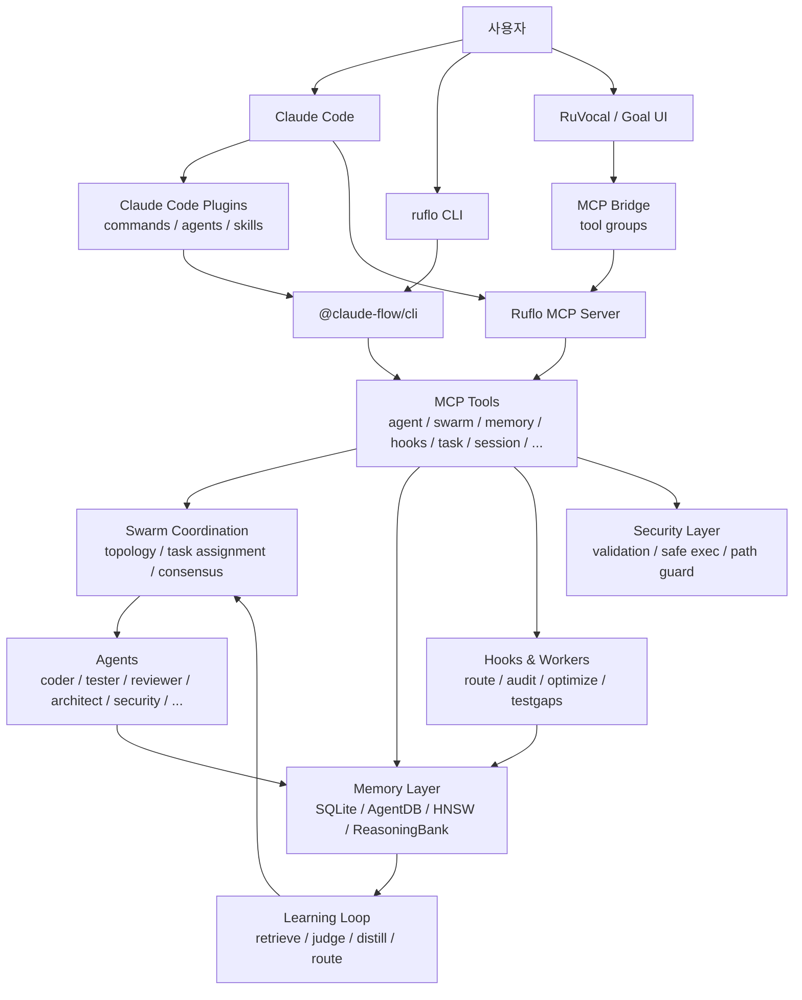
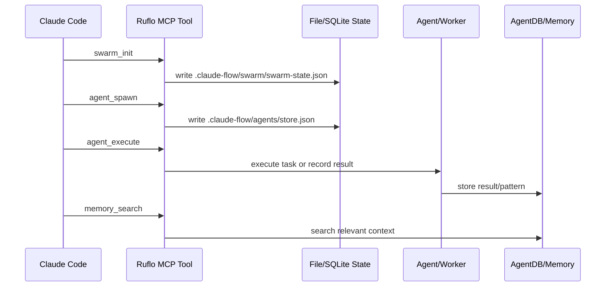
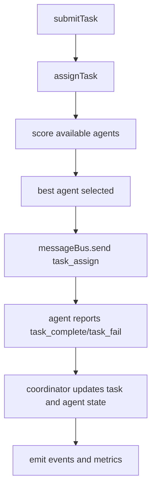
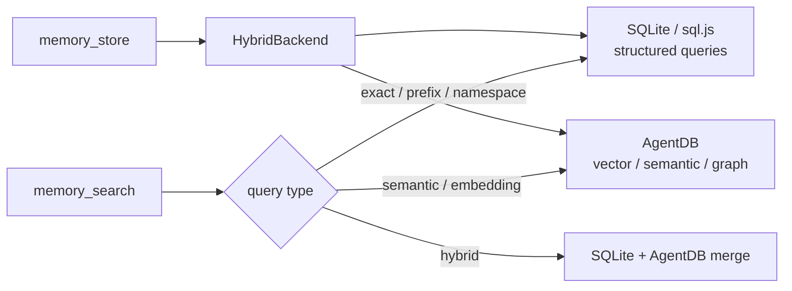

> Analyzed: 2026-05-17
> Package: `ruflo` `3.7.0-alpha.42` / `@claude-flow/cli` `3.7.0-alpha.42`
> Commit: `ca0a6fa5cb1678b5c57c9289bc09a036f7308c61`
> Repository: https://github.com/ruvnet/ruflo
> Local path: `~/workspace/opensources/ruflo`

---

_This article is partially written by Codex_

---

## 1. Why Ruflo, Why Now

Something interesting is happening in the AI coding agent ecosystem. It started with "let the model fix your files from the terminal." Now it is pushing further.

- Spin up multiple agents simultaneously.
- Assign each agent a different role and model.
- Persist task results in long-term memory.
- Observe session starts, tool executions, and task completions via hooks.
- Expose functionality as external tools through an MCP server.
- Install per-team feature bundles as plugins.
- Invoke those same tools from a Web UI.

Ruflo is a project that pushes this evolution hard. The README can feel overreaching at first glance — phrases like "100+ agents," "300+ MCP tools," "self-learning," "federation," "enterprise security," and "plugin marketplace" all appear at once.

But the code tells a different story. Ruflo is a repository that genuinely attempts to weave the following five layers into a single operations tier.

| Layer   | Role                                                                                  |
| ------- | ------------------------------------------------------------------------------------- |
| CLI     | User-facing surface for commands like `ruflo init`, `swarm`, `memory`, `hooks`, `mcp` |
| MCP     | Tool server callable by Claude Code or the Web UI                                     |
| Swarm   | Agent spawn, task assignment, topology, consensus, message bus                        |
| Memory  | SQLite, AgentDB, HNSW, ReasoningBank, pattern learning                                |
| Plugins | Deploy commands, agents, and skills as Claude Code plugin units                       |

Calling Ruflo "an extension plugin for Claude Code" undersells it. More precisely, it is a project that aims to **build a separate agent operating system around Claude Code**.

## 2. Where Does Ruflo Fit in the Broader Picture?

Reading Ruflo alongside the recent AI infrastructure posts on this blog helps clarify its position.

| Post                                                     | Central Problem                                                     | Relationship to Ruflo                                                                                                              |
| -------------------------------------------------------- | ------------------------------------------------------------------- | ---------------------------------------------------------------------------------------------------------------------------------- |
| [Superpowers](/kb/2026-04-18-superpowers-architecture)   | A skill document system that enforces development process on agents | Similar to Ruflo's plugin/skill surface, but Ruflo also includes a much larger execution infrastructure.                           |
| [agentmemory](/kb/2026-05-13-agentmemory-architecture)   | A shared long-term memory layer for multiple agents                 | Ruflo's AgentDB, memory bridge, and hooks-based learning address the same problem within a broader orchestration context.          |
| [Hermes Agent](/kb/2026-05-13-hermes-agent-architecture) | A Python-based tool-calling agent runtime                           | Where Hermes centers on a single agent runtime loop, Ruflo sits closer to a coordination and runtime substrate around Claude Code. |
| [OpenClaw](/kb/2026-03-11-openclaw-architecture)         | A personal AI assistant operating system                            | Where OpenClaw broadens the user-facing channel and app layer, Ruflo broadens coding agent operations and team coordination.       |

My own mental model is that Ruflo is `Superpowers + agentmemory + swarm runtime + MCP gateway + plugin marketplace` in a single repository. That said, maturity and stability vary significantly by area: some parts are close to production-ready, while others have ADRs and plugin contracts that are ahead of the implementation.

## 3. One-Sentence Summary

**Ruflo** is a TypeScript-based orchestration platform that attaches a CLI, MCP tools, an agent swarm, long-term memory, hooks, background workers, and a plugin marketplace to Claude Code in order to **turn a multi-agent development workflow into an operable system**.

To unpack that, here are the questions it answers.

| Question                               | Ruflo's Answer                                                                                      |
| -------------------------------------- | --------------------------------------------------------------------------------------------------- |
| How do you launch agents?              | Mix of `agent_spawn`, `swarm_init`, Claude Code plugin agents, and headless workers.                |
| How do you coordinate multiple agents? | Topologies (hierarchical, mesh, star, adaptive) plus task assignment, a message bus, and consensus. |
| Where does memory live?                | `.swarm/memory.db`, AgentDB, an HNSW vector index, ReasoningBank, and pattern namespaces.           |
| How does it hook into Claude Code?     | `ruflo init` generates `.claude/`, `.claude-flow/`, MCP config, hooks, skills, and agents.          |
| How are tools exposed?                 | Via an MCP server and the tool suite under `v3/@claude-flow/cli/src/mcp-tools/*`.                   |
| Can it be used in a lightweight mode?  | Yes — the Claude Code plugin marketplace path installs only slash commands, agents, and skills.     |
| Is it usable outside the CLI?          | The RuVocal Web UI and Goal Planner UI extend the same MCP/agent concepts into product surfaces.    |

The core insight is not "give the model better prompts." Ruflo is trying to build an **execution environment around the model** — treating as system problems which agent owns which task, where tool calls are routed, where memory is stored, how a failed worker is handled, and what gets installed as a plugin unit.

## 4. Technology Stack

| Area     | Technology                                                                    |
| -------- | ----------------------------------------------------------------------------- |
| Language | TypeScript, JavaScript, some Rust                                             |
| Runtime  | Node.js 20+                                                                   |
| Packages | npm, pnpm workspace                                                           |
| CLI      | `@claude-flow/cli`, `@claude-flow/cli-core`, `ruflo` wrapper                  |
| MCP      | Custom MCP server, stdio/HTTP/WebSocket transports, tool registry             |
| Memory   | SQLite, sql.js, AgentDB, HNSW, RVF, ReasoningBank                             |
| Swarm    | Agent pool, topology manager, message bus, consensus engine                   |
| Hooks    | Claude Code hooks bridge, worker daemon, statusline                           |
| Plugin   | Claude Code plugin spec, `.claude-plugin/plugin.json`, commands/agents/skills |
| Web UI   | SvelteKit-based RuVocal, React/Vite-based Goal UI                             |
| Security | Input validation, path validation, safe executor, token/credential helper     |
| Tests    | Vitest, shell smoke, Docker regression tests, verification witness            |

Rough size metrics based on a local checkout:

| Metric                                        | Count |
| --------------------------------------------- | ----: |
| Git-tracked files                             | 4,256 |
| TypeScript/JavaScript/Rust files              | 1,854 |
| Tracked files under `v3/@claude-flow/*`       | 1,896 |
| Files under `v3/@claude-flow/cli/src`         |   199 |
| Top-level `plugins/ruflo-*` plugin count      |    32 |
| Package directories under `v3/@claude-flow/*` |    24 |
| Test-related tracked files                    |   317 |

This is not a small npm utility. Ruflo already resembles a full monorepo product suite.

## 5. The Big Picture

Here is the high-level flow.



The important point here is that Ruflo is not a "single agent loop." It does not have one central loop — like `AIAgent.run_conversation()` in Hermes Agent — that contains everything. Instead, Ruflo keeps Claude Code as the existing executor and layers the following on top of it.

1. MCP tool surface
2. File-based runtime state
3. Hooks and background workers
4. AgentDB-based memory
5. Plugin-unit deployment
6. Web UI bridge

The center of gravity in Ruflo is therefore not a "conversation loop" but a **coordination substrate**.

## 6. Two Installation Paths: Plugin vs. Full CLI

The first distinction the Ruflo README draws is between installation paths. This distinction also matters architecturally.

| Aspect            | Claude Code Plugin Path            | Full CLI Path                                    |
| ----------------- | ---------------------------------- | ------------------------------------------------ |
| Installation      | `/plugin install ruflo-core@ruflo` | `npx ruflo@latest init`                          |
| Primary output    | Slash commands, agents, skills     | `.claude/`, `.claude-flow/`, MCP, hooks, helpers |
| MCP server        | Not registered by default.         | Registered.                                      |
| Workspace changes | Minimal.                           | Creates config files and runtime directories.    |
| Use case          | Lightweight, feature-level access  | Full loop including hooks, memory, and daemon    |

This design is a practical trade-off. Not every user wants `.claude-flow/`, hooks, MCP, and a daemon from day one. So Ruflo presents the product in two tiers.

```text
Lightweight path:
  Claude Code plugin
    -> commands / agents / skills
    -> try individual features

Heavy path:
  npx ruflo init
    -> .claude/
    -> .claude-flow/
    -> MCP server
    -> hooks
    -> memory
    -> worker daemon
```

Without understanding this distinction, the Ruflo docs become confusing — some features are visible after the plugin install alone, while others only work after a full `init`.

## 7. Codebase Map

The key directories are as follows.

```text
ruflo/
├── bin/
│   └── cli.js                         # Root umbrella CLI; delegates to the v3 CLI
├── ruflo/
│   ├── package.json                    # npm package "ruflo"
│   ├── bin/ruflo.js                    # @claude-flow/cli wrapper
│   └── src/
│       ├── mcp-bridge/                 # MCP bridge for the Web UI
│       ├── ruvocal/                    # SvelteKit Web UI
│       ├── nginx/                      # Container frontend assets
│       └── scripts/                    # Deploy/config/package scripts
├── v3/
│   ├── @claude-flow/
│   │   ├── cli/                        # Largest CLI surface
│   │   ├── cli-core/                   # Lightweight CLI focused on memory/hooks
│   │   ├── mcp/                        # MCP server package
│   │   ├── memory/                     # AgentDB/SQLite/HNSW memory
│   │   ├── swarm/                      # Coordination, consensus, message bus
│   │   ├── hooks/                      # Hooks, workers, statusline
│   │   ├── codex/                      # Codex integration, dual-mode orchestration
│   │   ├── guidance/                   # Guidance control plane
│   │   ├── security/                   # Validation, safe executor, path guard
│   │   └── ...
│   ├── src/                            # V3 public API samples/base modules
│   ├── goal_ui/                        # React/Vite GOAP planner UI
│   ├── crates/ruflo-federation-peer/   # Rust federation peer
│   └── plugins/                        # V3 experimental plugin packages
├── plugins/
│   ├── ruflo-core/
│   ├── ruflo-swarm/
│   ├── ruflo-agentdb/
│   ├── ruflo-rag-memory/
│   ├── ruflo-security-audit/
│   └── ...                             # 32 Claude Code plugins total
├── tests/
│   └── docker-regression/
├── verification/
│   ├── CAPABILITIES.md
│   ├── results.md
│   └── */manifest.md.json
└── docs/
    ├── USERGUIDE.md
    ├── federation/
    └── validation/
```

For newcomers, the four places to look first are `ruflo/bin/ruflo.js`, `v3/@claude-flow/cli/src/index.ts`, `v3/@claude-flow/cli/src/mcp-tools/`, and `plugins/README.md`. Those four files make it clear where user commands go, how tools are exposed, and what a plugin wraps.

## 8. The CLI Is Thin; the Weight Lives in the Packages

The `ruflo` npm package itself is thin. Looking at `ruflo/bin/ruflo.js`, the Ruflo CLI is simply a wrapper that locates `@claude-flow/cli` and delegates to it.

```text
ruflo/bin/ruflo.js
  -> node_modules/@claude-flow/cli/bin/cli.js  or  local v3/@claude-flow/cli
  -> MCP mode: import cli.js directly
  -> Normal CLI mode: run CLI class with ruflo branding
```

In other words, the `ruflo` package is the brand and distribution entry point; most of the actual functionality lives in `v3/@claude-flow/cli`. That package includes:

- Command parser and output formatter
- Core commands: `init`, `agent`, `swarm`, `memory`, `mcp`, `hooks`, `task`, `session`, and others
- Lazy-loaded advanced commands
- MCP tool definitions
- Memory initializer
- Worker daemon
- Model router and RuVector bridge
- Plugin store
- Update checker
- Production helpers

`v3/@claude-flow/cli/src/commands/index.ts` contains the structure for lazy command loading. Interestingly, comments in the file preserve traces of an earlier design — at one point all commands were imported synchronously; now only core commands are loaded eagerly and the rest are imported on demand.

Ruflo's CLI performance concerns have also shaped its architecture. The `@claude-flow/cli-core` package is a lightweight path focused on memory and hooks. Its documented goal is to prevent plugin scripts from being dragged down by the heavier cold-start cost of the full CLI.

To summarize:

| Package                 | Role                                                        |
| ----------------------- | ----------------------------------------------------------- |
| `ruflo`                 | User-facing npm package and binary wrapper                  |
| `@claude-flow/cli`      | Core of the full CLI, MCP tools, init, hooks, memory, swarm |
| `@claude-flow/cli-core` | Lightweight memory/hooks CLI for plugin scripts             |
| `@claude-flow/mcp`      | More generalized MCP server implementation                  |
| `@claude-flow/memory`   | AgentDB/SQLite/HNSW memory module                           |
| `@claude-flow/swarm`    | Standalone swarm coordination module                        |

This structure is less "clean module boundaries from the start" and more an ongoing decomposition of a large CLI product into package units.

## 9. The MCP Server and Tool Surface

One of Ruflo's primary integration points is MCP. Rather than calling Ruflo's internal classes directly, Claude Code and the Web UI invoke MCP tools.

Under `v3/@claude-flow/cli/src/mcp-tools/` you will find tool files organized into these families:

```text
agent-tools.ts
swarm-tools.ts
memory-tools.ts
agentdb-tools.ts
embeddings-tools.ts
hooks-tools.ts
task-tools.ts
session-tools.ts
hive-mind-tools.ts
workflow-tools.ts
security-tools.ts
browser-tools.ts
terminal-tools.ts
...
```

Each tool generally follows this structure:

```text
MCPTool
  name
  description
  category
  inputSchema
  handler(input)
```

For example, `agent_spawn` creates a record in the agent store and performs model routing based on agent type. `swarm_init` writes swarm state to `.claude-flow/swarm/swarm-state.json`. `memory_store` and `memory_search` connect to a memory initializer backed by `.swarm/memory.db`.

The notable design decision here is that **MCP tools are not thin wrappers — they are the entry point to a stateful runtime**.



This approach has both advantages and trade-offs.

The advantage is that Claude Code only needs to know about MCP tools. Whether the underlying implementation uses file storage, AgentDB, or a worker daemon, the calling surface is unified under a single tool name.

The trade-off is that consistency among MCP tool descriptions, file-based state, and the actual package implementation becomes critical. Ruflo manages this through `scripts/audit-tool-descriptions.mjs`, plugin smoke tests, and verification manifests.

## 10. Swarm Coordination and Agent Lifecycle

The most prominent word in Ruflo is "swarm." In the codebase, swarm exists at multiple levels.

| Location                                              | Character                                                                    |
| ----------------------------------------------------- | ---------------------------------------------------------------------------- |
| `v3/@claude-flow/cli/src/mcp-tools/swarm-tools.ts`    | Persistent swarm state exposed as MCP tools                                  |
| `v3/@claude-flow/swarm/src/unified-coordinator.ts`    | Standalone coordinator with topology, message bus, consensus, and agent pool |
| `v3/src/coordination/application/SwarmCoordinator.ts` | A simpler coordinator closer to a public API                                 |
| `plugins/ruflo-swarm/`                                | Swarm workflow packaged as a Claude Code plugin                              |

`UnifiedSwarmCoordinator` is where the architectural intent is most clearly expressed. Its inline comments describe a 15-agent hierarchy as the reference model.

| Domain      | Agent Numbers | Role                                  |
| ----------- | ------------- | ------------------------------------- |
| queen       | 1             | Top-level coordination                |
| security    | 2–4           | Security architecture, audit, testing |
| core        | 5–9           | DDD, memory, swarm, MCP optimization  |
| integration | 10–12         | Integration, CLI, neural, hooks       |
| support     | 13–15         | Testing, performance, deployment      |

The actual coordinator composes these components:

- `TopologyManager`
- `MessageBus`
- `ConsensusEngine`
- `AgentPool`
- Domain-specific task queues
- Background heartbeat, health, and metrics intervals

The task flow looks roughly like this:



What Ruflo cares about here is not merely "how many agents were spawned" but **whether coordination state is persisted**. The agent list, swarm status, task status, health, and metrics must all be queryable on the next call.

One caveat worth noting: some consensus logic in `v3/src/coordination/application/SwarmCoordinator.ts` still reads as a simulation — votes are effectively random approve/reject. On the other hand, `v3/@claude-flow/swarm/src/consensus/` contains more concrete implementations for raft, gossip, and byzantine fault tolerance. The accurate picture is that **multiple coordination layers coexist and are still being consolidated**, rather than that Ruflo has production-grade consensus at every level.

## 11. The Memory Layer: SQLite, AgentDB, HNSW, and Hooks

Ruflo's memory is the part that connects most directly to the [agentmemory post](/kb/2026-05-13-agentmemory-architecture).

`v3/@claude-flow/memory/src/hybrid-backend.ts` makes the design intent clear.

| Backend       | Responsibility                                                        |
| ------------- | --------------------------------------------------------------------- |
| SQLite        | Structured queries: exact match, prefix, namespace, owner, time range |
| AgentDB       | Semantic search, vector similarity, RAG                               |
| HybridBackend | Calls both and either merges results or routes based on query type    |

The default mode is dual-write: every memory entry is written to both SQLite and AgentDB simultaneously. This is a deliberate choice to support both structured queries and semantic search.



The CLI's `memory-tools.ts` carries its own real-world complexity on top of this:

- Migration from legacy `.claude-flow/memory/store.json`
- Consolidating to `.swarm/memory.db` as a single source of truth
- Validation of dangerous characters in keys and namespaces
- Inference of the Claude Code project memory directory
- Bridge functionality like `memory_import_claude`

This is what makes the memory layer interesting. Ruflo does not deal only in abstract "agent memory." It addresses the concrete question of how to pull in memory that Claude Code actually stores under `~/.claude/projects/*/memory/*.md`, which namespace to write it to, and how to sync it back to `MEMORY.md`.

The `plugins/ruflo-agentdb/README.md` reflects the same operational perspective, documenting specifics like namespace conventions, reserved namespaces, fallback responses, and controller availability. Memory here is not a library — it is a **shared substrate that multiple plugins write to together**.

## 12. Hooks and Background Workers

In Ruflo, hooks are what make the system run without the user issuing commands directly.

`v3/@claude-flow/hooks/src/index.ts` exports:

- Hook registry
- Hook executor
- Daemon manager
- Metrics daemon
- Swarm monitor daemon
- Learning daemon
- Statusline
- Official Claude Code hooks bridge
- Worker manager
- Session hook

On the CLI side there is also a separate `WorkerDaemon`. The default workers are:

| Worker        | Default Role             |
| ------------- | ------------------------ |
| `map`         | Codebase mapping         |
| `audit`       | Security analysis        |
| `optimize`    | Performance optimization |
| `consolidate` | Memory consolidation     |
| `testgaps`    | Test coverage analysis   |
| `predict`     | Predictive preloading    |
| `document`    | Auto documentation       |

Some workers can run with a local fallback; others use Claude Code headless mode. `HeadlessWorkerExecutor` manages non-interactive executions via `claude -p` in a process pool, handling prompt templates, context patterns, timeouts, and sandbox mode.

This structure shows that Ruflo does not limit itself to the scenario where a user explicitly spawns agents. The steady state Ruflo is aiming for looks closer to this:

```text
User action
  -> Claude Code hook fires
  -> Ruflo hook handler runs
  -> memory import / pattern store / model route / worker trigger
  -> background workers perform audit, optimize, consolidate
  -> results reflected in memory and statusline
```

This is powerful, but it also carries operational risk. Hooks have a direct impact on the user's Claude Code session — both its performance and its reliability. That is why the Ruflo codebase contains a lot of operational code: timeouts, PID files, orphan process reconciliation, resource thresholds, and crash handlers.

## 13. Plugin Marketplace: Packaging Functionality into Deployable Units

Ruflo's `plugins/` directory contains 32 Claude Code plugins.

```text
ruflo-core
ruflo-swarm
ruflo-agentdb
ruflo-rag-memory
ruflo-rvf
ruflo-ruvector
ruflo-intelligence
ruflo-ddd
ruflo-sparc
ruflo-security-audit
ruflo-aidefence
ruflo-testgen
ruflo-browser
ruflo-federation
...
```

Each plugin generally follows this structure:

```text
ruflo-<name>/
  .claude-plugin/plugin.json
  agents/*.md
  commands/*.md
  skills/*/SKILL.md
  scripts/smoke.sh
  README.md
```

This design resembles Superpowers. It uses a document-based interface — `SKILL.md` and agent definitions — to shape agent behavior. Ruflo plugins go further, bundling MCP tools, smoke scripts, package compatibility requirements, and namespace conventions alongside that document layer.

`ruflo-swarm` is a good illustration. Its README explicitly enumerates the MCP surface it wraps.

| Family    | Tools                                                                                                                         |
| --------- | ----------------------------------------------------------------------------------------------------------------------------- |
| `swarm_*` | `swarm_init`, `swarm_status`, `swarm_shutdown`, `swarm_health`                                                                |
| `agent_*` | `agent_spawn`, `agent_execute`, `agent_terminate`, `agent_status`, `agent_list`, `agent_pool`, `agent_health`, `agent_update` |

It also ships a smoke script as a contract. In this sense, a plugin README is not just usage documentation — it is a **compatibility contract**.

This feels like a meaningful design philosophy in Ruflo.

> Rather than exposing everything through one giant CLI help, Ruflo creates "installable work bundles" as Claude Code plugin units.

This lets users compose purpose-specific stacks like `ruflo-core + ruflo-swarm + ruflo-testgen + ruflo-ddd`. It also lets developers regression-protect each plugin's public surface through its smoke script and README.

## 14. RuVocal and Goal UI: Product Surfaces Beyond the CLI

Ruflo is not just a CLI and plugin system. `ruflo/src/ruvocal/` and `v3/goal_ui/` show that Ruflo intends to extend its product surface onto the Web.

### RuVocal

`ruflo/src/ruvocal/` is a SvelteKit-based Web UI. Its upstream is the Hugging Face chat-ui; Ruflo adds MCP tool calling and a tool gallery on top.

| Area               | Implementation                                         |
| ------------------ | ------------------------------------------------------ |
| Frontend           | SvelteKit 2, Svelte 5, Tailwind                        |
| Persistence        | MongoDB, MongoMemoryServer fallback                    |
| Model API          | OpenAI-compatible endpoint                             |
| MCP                | HTTP/SSE/stdio MCP server connection                   |
| Browser-side tools | WASM gallery via Web Workers                           |
| UI features        | Capabilities modal, tool progress, parallel tool cards |

`ruflo/src/mcp-bridge/index.js` groups multiple backend MCP servers into tool groups — for example core, intelligence, agents, memory, devtools, security, browser, and neural — and filters the exposed tools by prefix.

```text
RuVocal chat
  -> MCP bridge
  -> per-group tool list
  -> Ruflo MCP / external MCP servers
  -> return tool results to the model
```

RuVocal is less "a chat UI for the web" and more a product-grade shell that surfaces the Ruflo MCP substrate to users.

### Goal UI

`v3/goal_ui/` is a React/Vite-based GOAP planner UI, packaged as `@ruflo/research`. The codebase includes `goapPlanner.ts`, agent dashboard components, dependency graphs, quality gates, and an execution monitor.

This UI reveals another direction Ruflo is pursuing: not merely "tell an agent to do work," but decompose goals into states and actions and visualize the execution plan.

To summarize, Ruflo maintains three product surfaces simultaneously.

| Surface            | User Experience                                                     |
| ------------------ | ------------------------------------------------------------------- |
| CLI                | Developers configure commands and MCP from the terminal.            |
| Claude Code plugin | Use slash commands, skills, and agents inside Claude Code.          |
| Web UI             | Interact with MCP/agent capabilities through chat and goal planner. |

## 15. Security, Verification, and Witness

Ruflo places security and verification prominently. Three axes are visible in the code.

First, input validation. Each MCP tool handler includes defensive code: `validateIdentifier`, `validateAgentSpawn`, and checks for dangerous characters in keys and namespaces. The `@claude-flow/security` package separates password hashing, credential generation, a safe executor, a path validator, and a token generator.

Second, plugin and MCP surface verification. `plugins/README.md` states that every MCP tool description must explain "when to use this tool instead of a native tool." This requirement is enforced by `scripts/audit-tool-descriptions.mjs`.

Third, verification witness. The `verification/` directory contains per-platform manifests, capability lists, and results. Plugin documentation and the README repeatedly reference smoke tests and witness manifests. For a project with as wide a surface area as Ruflo, being explicit about what is claimed to work is important — the separate evidence layer is a good call.

That said, this too has a downside. The more witnesses and ADRs accumulate, the harder it becomes to manage drift between documentation and implementation. Ruflo is trying to automate that problem away, but as a reader you still need to check which documents are current and which figures match the current packages.

## 16. Recommended Reading Order

Starting from scratch with `v3/@claude-flow/*` in its entirety is a good way to get lost. Here is the order I recommend.

1. `README.md`

   Start by understanding what the project claims. Read the marketing metrics not at face value, but as pointers to specific code surfaces.

2. `ruflo/bin/ruflo.js`

   Confirm that the `ruflo` binary is simply a wrapper around `@claude-flow/cli`.

3. `v3/@claude-flow/cli/src/index.ts`

   Trace the CLI parser, command dispatch, lazy command loading, update check, and error handling flow.

4. `v3/@claude-flow/cli/src/commands/index.ts`

   See which commands are core and which are lazy-loaded.

5. `v3/@claude-flow/cli/src/mcp-tools/agent-tools.ts`

   Understand the agent store, model routing, and the actual behavior of `agent_spawn`.

6. `v3/@claude-flow/cli/src/mcp-tools/swarm-tools.ts`

   See how swarm state is persisted to `.claude-flow/swarm/swarm-state.json`.

7. `v3/@claude-flow/cli/src/mcp-tools/memory-tools.ts`

   Examine memory migration, `.swarm/memory.db`, and the Claude Code memory bridge.

8. `v3/@claude-flow/memory/src/hybrid-backend.ts`

   Understand how SQLite and AgentDB are split.

9. `v3/@claude-flow/swarm/src/unified-coordinator.ts`

   See which components the actual swarm coordinator assembles.

10. `plugins/README.md`, `plugins/ruflo-swarm/README.md`, `plugins/ruflo-agentdb/README.md`

    Explore the plugin contract and smoke-test-centric documentation structure.

Following this order makes visible what Ruflo really is: not a single monolithic app, but a layered structure in which wrapper, CLI, MCP tools, memory, swarm, and plugins are stacked on top of one another.

## 17. Noteworthy Design Decisions

### 1. Plugin path and full CLI path are separated.

A project like Ruflo can make significant workspace changes at install time. Splitting that into plugin-only and full init is a good call. It cleanly separates users who only want commands and agents from those who want MCP, hooks, and memory too.

### 2. MCP tools serve as the entry point to a stateful runtime.

MCP tools connect to `.claude-flow`, `.swarm`, AgentDB, and the worker daemon — they are not mere wrappers. As a result, Claude Code can manage both swarm and memory through a single "tool call" interface.

### 3. Memory is treated as a substrate, not a feature.

The namespace conventions, reserved namespaces, and fallback response documentation in the `ruflo-agentdb` plugin are impressive. When memory becomes a shared resource across plugins, naming collisions and lifecycle questions arise — and Ruflo addresses these explicitly.

### 4. Operational failures are handled in the code, not glossed over.

Looking at the worker daemon and swarm tools, there is a lot of code for PID liveness checks, orphan reconciliation, timeouts, crash handlers, and stale state cleanup. None of this is glamorous, but it matters greatly in agent systems that run for extended periods.

### 5. The Web UI is not a demo.

RuVocal includes MCP server grouping, parallel tool calls, bring-your-own MCP server support, and MongoDB persistence. It is a genuine product surface that exposes CLI capabilities on the Web.

## 18. Points to Watch

### 1. Documentation version numbers and package version numbers move independently.

The README, USERGUIDE, plugin READMEs, and `package.json` files all change rapidly. For example, some documentation references `3.7.0-alpha.8` as the latest version, while the local `ruflo/package.json` and `@claude-flow/cli/package.json` are both at `3.7.0-alpha.42`. This is natural for an alpha project, but always verify against the current packages when reading documentation or evaluating adoption.

### 2. Some layers are production code; others are architecture intent.

The file-based state in MCP tools, plugin smoke tests, and the memory bridge are practically refined. Meanwhile, some public-API coordinators and simulation-style consensus code are still closer to concept implementations. You need to be clear about which layer you are reading at any given moment.

### 3. The surface area is very large.

CLI commands, MCP tools, plugins, hooks, workers, AgentDB, RuVector, Web UI, federation, and guidance all live in one repository. That is itself a feature, but it presents a high barrier for newcomers. A realistic approach to reading Ruflo is not "understand everything before using it" but "start with the plugin and MCP surface relevant to my use case."

### 4. The responsibility boundary between Claude Code and external agents is complex.

Ruflo deals with the native Claude Code Task tool, Ruflo's MCP `agent_spawn`, headless Claude workers, and Codex dual-mode orchestration — all at the same time. The project tries to document when to use native Tasks versus Ruflo agent tools, but real workflow design still requires judgment.

### 5. Hooks are powerful but carry risk.

Ruflo can automatically trigger memory imports, pattern stores, and worker calls on session start/end and after tool executions. This can increase productivity, but if something goes wrong it can make the user's Claude Code session slow or unpredictable. When adopting Ruflo, starting with the plugin-only path or a minimal init is the prudent approach.

## 19. Conclusion

Ruflo is not a collection of prompts that make Claude Code smarter. It is an attempt to build an **agent operations layer** outside of Claude Code.

On one side are skills and plugins that reshape agent behavior, in the spirit of Superpowers. On another side is a long-term memory and retrieval substrate, in the spirit of agentmemory. On top of both sit swarm coordination, an MCP tool surface, hooks, background workers, and a Web UI.

The shortest way to describe Ruflo is:

> A project that transforms Claude Code from a single coding tool into a multi-agent development platform with multiple agents, memory, hooks, plugins, and UI.

It still has strong alpha characteristics, and the density of documentation versus implementation varies across the project. But it is worth reading. If you want to understand where agent tooling is heading right now, Ruflo is an excellent case study.

The most important trends I see in this project are:

1. Agents will be multiple, not singular.
2. Memory will move out of the model and into an external substrate.
3. Tools will take the form of an MCP surface rather than CLI commands.
4. Workflows will be deployed as plugins and hooks, not documentation.
5. Product surfaces will expand from the terminal into Web UI.

These five patterns are likely to repeat across AI coding infrastructure going forward. Ruflo is pushing them — ambitiously, with some complexity, and at considerable breadth — ahead of the field.
