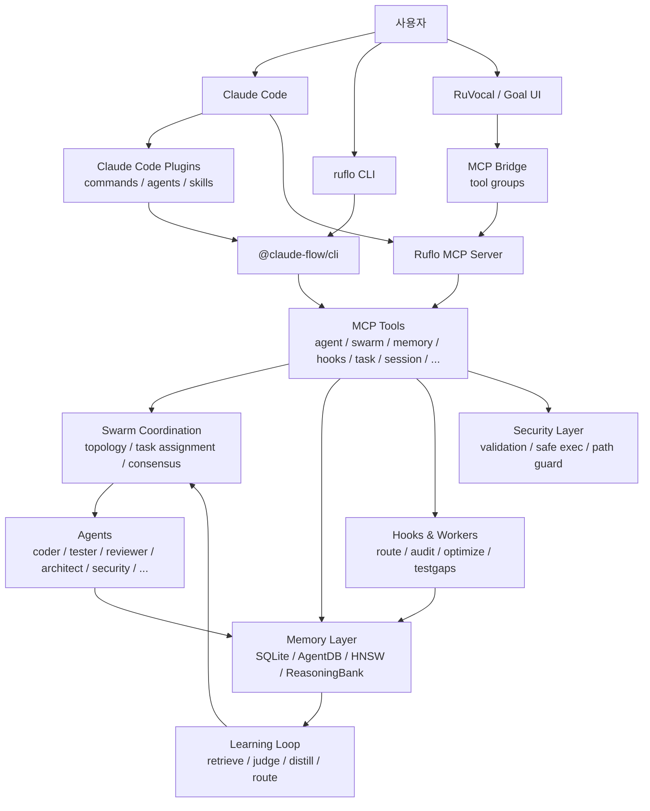
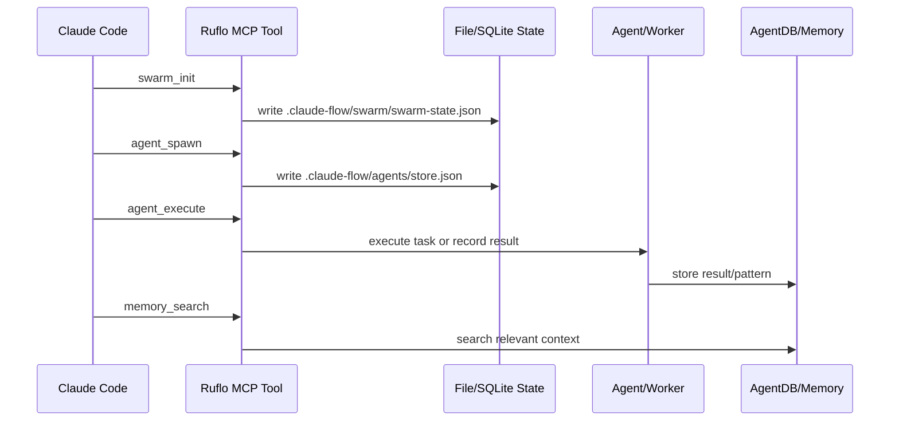
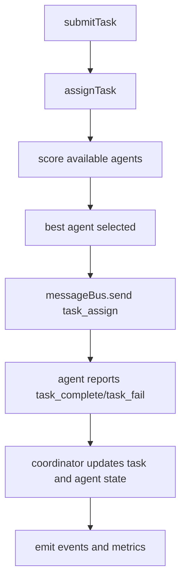
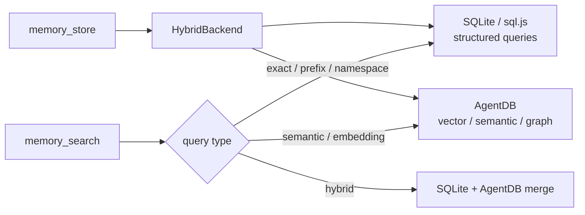

> 분석 일자: 2026-05-17
> 대상 버전: `ruflo` `3.7.0-alpha.42` / `@claude-flow/cli` `3.7.0-alpha.42`
> 대상 커밋: `ca0a6fa5cb1678b5c57c9289bc09a036f7308c61`
> 저장소: https://github.com/ruvnet/ruflo
> 로컬 분석 경로: `~/workspace/opensources/ruflo`

---

_This article is partially written by Codex_

## 목차

1. [왜 지금 Ruflo인가](#1-왜-지금-ruflo인가)
2. [기존 글들과 어디에 놓이나요?](#2-기존-글들과-어디에-놓이나요)
3. [프로젝트를 한 문장으로 이해하기](#3-프로젝트를-한-문장으로-이해하기)
4. [기술 스택](#4-기술-스택)
5. [전체 그림](#5-전체-그림)
6. [두 가지 설치 경로: plugin과 full CLI](#6-두-가지-설치-경로-plugin과-full-cli)
7. [코드베이스 지도](#7-코드베이스-지도)
8. [CLI는 얇고, 실제 무게는 패키지에 있습니다](#8-cli는-얇고-실제-무게는-패키지에-있습니다)
9. [MCP 서버와 도구 표면](#9-mcp-서버와-도구-표면)
10. [Swarm coordination과 agent lifecycle](#10-swarm-coordination과-agent-lifecycle)
11. [메모리 계층: SQLite, AgentDB, HNSW, hooks](#11-메모리-계층-sqlite-agentdb-hnsw-hooks)
12. [Hooks와 background worker](#12-hooks와-background-worker)
13. [Plugin marketplace: 기능을 제품 단위로 쪼개기](#13-plugin-marketplace-기능을-제품-단위로-쪼개기)
14. [RuVocal과 Goal UI: CLI 밖의 제품 표면](#14-ruvocal과-goal-ui-cli-밖의-제품-표면)
15. [보안, 검증, witness](#15-보안-검증-witness)
16. [코드를 읽는 추천 순서](#16-코드를-읽는-추천-순서)
17. [인상적인 설계 포인트](#17-인상적인-설계-포인트)
18. [주의해서 볼 지점](#18-주의해서-볼-지점)
19. [결론](#19-결론)

---

## 1. 왜 지금 Ruflo인가

요즘 AI 코딩 에이전트 생태계를 보면 재미있는 변화가 있습니다. 처음에는 "터미널에서 모델에게 파일을 고치게 한다"가 중심이었습니다. 이제는 한 단계 더 나아가고 있습니다.

- 여러 에이전트를 동시에 띄웁니다.
- 각 에이전트에게 역할과 모델을 다르게 배정합니다.
- 작업 결과를 장기 메모리에 남깁니다.
- hook으로 세션 시작, 도구 실행, 작업 종료를 관찰합니다.
- MCP 서버로 기능을 외부 도구처럼 노출합니다.
- 플러그인으로 팀별 기능 묶음을 설치합니다.
- Web UI에서 같은 도구들을 호출합니다.

Ruflo는 이 변화를 아주 크게 밀어붙이는 프로젝트입니다. README 첫인상은 다소 과장되어 보일 수 있습니다. "100+ agents", "300+ MCP tools", "self-learning", "federation", "enterprise security", "plugin marketplace" 같은 단어가 한꺼번에 등장하기 때문입니다.

그런데 코드를 보면 단순한 랜딩 페이지 문구만은 아닙니다. Ruflo는 실제로 다음 다섯 가지를 하나의 운영 계층으로 엮으려는 저장소입니다.

| 계층    | 역할                                                                  |
| ------- | --------------------------------------------------------------------- |
| CLI     | `ruflo init`, `swarm`, `memory`, `hooks`, `mcp` 같은 사용자 명령 표면 |
| MCP     | Claude Code나 Web UI가 호출할 수 있는 도구 서버                       |
| Swarm   | agent spawn, task assignment, topology, consensus, message bus        |
| Memory  | SQLite, AgentDB, HNSW, ReasoningBank, pattern learning                |
| Plugins | Claude Code plugin 단위로 명령, agent, skill, smoke contract를 배포   |

그래서 Ruflo는 "Claude Code용 확장 플러그인" 정도로 보면 작게 보는 셈입니다. 더 정확하게는 **Claude Code 주변에 별도 에이전트 운영체제를 세우려는 프로젝트**에 가깝습니다.

## 2. 기존 글들과 어디에 놓이나요?

이 블로그의 최근 AI infrastructure 글들과 이어 보면 Ruflo의 위치가 더 잘 보입니다.

| 글                                                       | 중심 문제                                           | Ruflo와의 관계                                                                                                         |
| -------------------------------------------------------- | --------------------------------------------------- | ---------------------------------------------------------------------------------------------------------------------- |
| [Superpowers](/kb/2026-04-18-superpowers-architecture)   | 에이전트에게 개발 절차를 강제하는 skill 문서 시스템 | Ruflo plugin/skill 표면과 비슷하지만, Ruflo는 더 큰 실행 인프라를 포함합니다.                                          |
| [agentmemory](/kb/2026-05-13-agentmemory-architecture)   | 여러 에이전트가 공유하는 장기 메모리 계층           | Ruflo의 AgentDB, memory bridge, hooks learning이 같은 문제를 더 넓은 orchestration 안에 넣습니다.                      |
| [Hermes Agent](/kb/2026-05-13-hermes-agent-architecture) | Python 기반 tool-calling agent runtime              | Hermes가 하나의 에이전트 런타임 중심이라면, Ruflo는 Claude Code 주변의 coordination/runtime substrate 쪽에 가깝습니다. |
| [OpenClaw](/kb/2026-03-11-openclaw-architecture)         | 개인용 AI 비서 운영체제                             | OpenClaw가 사용자 채널과 앱 쪽을 넓힌다면, Ruflo는 코딩 에이전트 운영과 팀 coordination 쪽을 넓힙니다.                 |

개인적으로는 Ruflo를 `Superpowers + agentmemory + swarm runtime + MCP gateway + plugin marketplace`가 한 저장소 안에 들어간 형태로 이해했습니다. 다만 완성도와 안정성은 부분마다 차이가 큽니다. 어떤 부분은 실제 운영 코드에 가깝고, 어떤 부분은 ADR과 plugin contract가 먼저 가 있는 구조입니다.

## 3. 프로젝트를 한 문장으로 이해하기

**Ruflo**는 Claude Code에 CLI, MCP 도구, agent swarm, 장기 메모리, hooks, background worker, plugin marketplace를 붙여서 **다중 에이전트 개발 workflow를 운영 가능한 시스템으로 만들려는 TypeScript 기반 orchestration 플랫폼**입니다.

조금 더 풀어 쓰면 다음 질문들에 대한 답입니다.

| 질문                               | Ruflo의 답                                                                                           |
| ---------------------------------- | ---------------------------------------------------------------------------------------------------- |
| 에이전트는 어떻게 띄우나요?        | `agent_spawn`, `swarm_init`, Claude Code plugin agent, headless worker를 섞습니다.                   |
| 여러 에이전트는 어떻게 조율하나요? | hierarchical, mesh, star, adaptive 같은 topology와 task assignment, message bus, consensus를 둡니다. |
| 기억은 어디에 남기나요?            | `.swarm/memory.db`, AgentDB, HNSW vector index, ReasoningBank, pattern namespace를 사용합니다.       |
| Claude Code에는 어떻게 붙나요?     | `ruflo init`이 `.claude/`, `.claude-flow/`, MCP 설정, hooks, skills, agents를 생성합니다.            |
| 도구는 어떻게 노출하나요?          | MCP server와 `v3/@claude-flow/cli/src/mcp-tools/*` 도구군으로 노출합니다.                            |
| 가볍게만 쓸 수 있나요?             | Claude Code plugin marketplace를 통해 slash command, agent, skill만 설치하는 경로가 있습니다.        |
| CLI 밖에서도 쓰나요?               | RuVocal Web UI와 Goal Planner UI가 같은 MCP/agent 개념을 제품 표면으로 확장합니다.                   |

핵심은 "모델에게 좋은 프롬프트를 주자"가 아닙니다. Ruflo는 **모델 주변의 실행 환경**을 만들려고 합니다. 어떤 에이전트가 어떤 일을 맡는지, 도구 호출은 어디로 가는지, 메모리는 어디에 남는지, 실패한 worker는 어떻게 처리하는지, plugin 단위로 무엇을 설치하는지를 시스템 문제로 다룹니다.

## 4. 기술 스택

| 영역    | 기술                                                                          |
| ------- | ----------------------------------------------------------------------------- |
| 주 언어 | TypeScript, JavaScript, 일부 Rust                                             |
| 런타임  | Node.js 20+                                                                   |
| 패키지  | npm, pnpm workspace                                                           |
| CLI     | `@claude-flow/cli`, `@claude-flow/cli-core`, `ruflo` wrapper                  |
| MCP     | 자체 MCP server, stdio/http/websocket transport, tool registry                |
| 메모리  | SQLite, sql.js, AgentDB, HNSW, RVF, ReasoningBank                             |
| Swarm   | agent pool, topology manager, message bus, consensus engine                   |
| Hooks   | Claude Code hooks bridge, worker daemon, statusline                           |
| Plugin  | Claude Code plugin spec, `.claude-plugin/plugin.json`, commands/agents/skills |
| Web UI  | SvelteKit 기반 RuVocal, React/Vite 기반 Goal UI                               |
| 보안    | input validation, path validation, safe executor, token/credential helper     |
| 테스트  | Vitest, shell smoke, docker regression tests, verification witness            |

로컬 체크아웃 기준의 대략적인 규모는 다음과 같습니다.

| 항목                                    |    수치 |
| --------------------------------------- | ------: |
| Git 추적 파일 수                        | 4,256개 |
| TypeScript/JavaScript/Rust 파일 수      | 1,854개 |
| `v3/@claude-flow/*` 아래 추적 파일 수   | 1,896개 |
| `v3/@claude-flow/cli/src` 아래 파일 수  |   199개 |
| top-level `plugins/ruflo-*` plugin 수   |    32개 |
| `v3/@claude-flow/*` package 디렉토리 수 |    24개 |
| 테스트 관련 추적 파일 수                |   317개 |

작은 npm 유틸리티가 아닙니다. Ruflo는 이미 하나의 monorepo형 제품군에 가깝습니다.

## 5. 전체 그림

큰 흐름은 아래처럼 볼 수 있습니다.



이 그림에서 중요한 점은 Ruflo가 "단일 agent loop"가 아니라는 것입니다. Hermes Agent처럼 `AIAgent.run_conversation()` 같은 하나의 중심 루프가 모든 것을 품는 형태가 아닙니다. Ruflo는 오히려 Claude Code를 기존 실행자로 두고, 그 주변에 다음을 얹습니다.

1. MCP 도구 표면
2. 파일 기반 runtime state
3. hooks와 background worker
4. AgentDB 기반 memory
5. plugin 단위 배포
6. Web UI bridge

그래서 Ruflo의 중심은 "대화 루프"보다 **coordination substrate**에 있습니다.

## 6. 두 가지 설치 경로: plugin과 full CLI

Ruflo README에서 가장 먼저 구분하는 것은 설치 경로입니다. 이 구분은 아키텍처적으로도 중요합니다.

| 구분           | Claude Code Plugin 경로            | Full CLI 경로                                    |
| -------------- | ---------------------------------- | ------------------------------------------------ |
| 설치 방식      | `/plugin install ruflo-core@ruflo` | `npx ruflo@latest init`                          |
| 주된 산출물    | slash command, agent, skill        | `.claude/`, `.claude-flow/`, MCP, hooks, helpers |
| MCP 서버       | 기본 등록되지 않습니다.            | 등록됩니다.                                      |
| workspace 변경 | 거의 없습니다.                     | 설정 파일과 runtime 디렉토리를 만듭니다.         |
| 용도           | 가볍게 기능 단위로 사용            | hooks, memory, daemon까지 포함한 전체 loop       |

이 구조는 현실적인 절충입니다. 모든 사용자가 처음부터 `.claude-flow/`, hooks, MCP, daemon을 원하지는 않습니다. 그래서 Ruflo는 제품 표면을 두 단계로 둡니다.

```text
가벼운 경로:
  Claude Code plugin
    -> commands / agents / skills
    -> 특정 기능만 체험

무거운 경로:
  npx ruflo init
    -> .claude/
    -> .claude-flow/
    -> MCP server
    -> hooks
    -> memory
    -> worker daemon
```

이 차이를 이해하지 못하면 Ruflo 문서를 읽다가 혼란이 생깁니다. README의 어떤 기능은 plugin만 설치해도 보이고, 어떤 기능은 full init을 해야 실제로 동작합니다.

## 7. 코드베이스 지도

핵심 디렉토리는 다음과 같습니다.

```text
ruflo/
├── bin/
│   └── cli.js                         # 루트 umbrella CLI, v3 CLI로 위임
├── ruflo/
│   ├── package.json                    # npm package "ruflo"
│   ├── bin/ruflo.js                    # @claude-flow/cli wrapper
│   └── src/
│       ├── mcp-bridge/                 # Web UI용 MCP bridge
│       ├── ruvocal/                    # SvelteKit Web UI
│       ├── nginx/                      # container frontend assets
│       └── scripts/                    # deploy/config/package scripts
├── v3/
│   ├── @claude-flow/
│   │   ├── cli/                        # 가장 큰 CLI 표면
│   │   ├── cli-core/                   # memory/hooks 중심의 lite CLI
│   │   ├── mcp/                        # MCP server package
│   │   ├── memory/                     # AgentDB/SQLite/HNSW memory
│   │   ├── swarm/                      # coordination, consensus, message bus
│   │   ├── hooks/                      # hooks, workers, statusline
│   │   ├── codex/                      # Codex integration, dual-mode orchestration
│   │   ├── guidance/                   # guidance control plane
│   │   ├── security/                   # validation, safe executor, path guard
│   │   └── ...
│   ├── src/                            # V3 public API 샘플/기본 모듈
│   ├── goal_ui/                        # React/Vite GOAP planner UI
│   ├── crates/ruflo-federation-peer/   # Rust federation peer
│   └── plugins/                        # V3 experimental plugin packages
├── plugins/
│   ├── ruflo-core/
│   ├── ruflo-swarm/
│   ├── ruflo-agentdb/
│   ├── ruflo-rag-memory/
│   ├── ruflo-security-audit/
│   └── ...                             # 총 32개 Claude Code plugin
├── tests/
│   └── docker-regression/
├── verification/
│   ├── CAPABILITIES.md
│   ├── results.md
│   └── */manifest.md.json
└── docs/
    ├── USERGUIDE.md
    ├── federation/
    └── validation/
```

여기서 초심자가 먼저 봐야 할 곳은 `ruflo/bin/ruflo.js`, `v3/@claude-flow/cli/src/index.ts`, `v3/@claude-flow/cli/src/mcp-tools/`, `plugins/README.md`입니다. 이 네 곳을 보면 "사용자 명령이 어디로 가고, 도구가 어떻게 노출되고, plugin은 무엇을 감싸는지"가 잡힙니다.

## 8. CLI는 얇고, 실제 무게는 패키지에 있습니다

`ruflo` npm package 자체는 얇습니다. `ruflo/bin/ruflo.js`를 보면 Ruflo CLI는 `@claude-flow/cli`를 찾아서 위임하는 wrapper입니다.

```text
ruflo/bin/ruflo.js
  -> node_modules/@claude-flow/cli/bin/cli.js 또는 로컬 v3/@claude-flow/cli
  -> MCP mode면 cli.js 직접 import
  -> 일반 CLI mode면 CLI class를 ruflo branding으로 실행
```

즉, `ruflo` package는 브랜드와 배포 진입점이고, 실제 기능의 대부분은 `v3/@claude-flow/cli`에 있습니다. 이 패키지는 다음을 포함합니다.

- command parser와 output formatter
- `init`, `agent`, `swarm`, `memory`, `mcp`, `hooks`, `task`, `session` 같은 core commands
- lazy-loaded advanced commands
- MCP tool definitions
- memory initializer
- worker daemon
- model router와 RuVector bridge
- plugin store
- update checker
- production helpers

`v3/@claude-flow/cli/src/commands/index.ts`에는 command lazy loading을 위한 구조가 있습니다. 재미있는 점은 주석에 과거 구조의 흔적도 남아 있다는 것입니다. 한때 모든 command를 동기 import했지만, 현재는 core command만 먼저 올리고 나머지는 필요할 때 import하는 쪽으로 정리되어 있습니다.

Ruflo의 CLI 성능 문제가 실제 아키텍처 결정으로 이어진 예도 있습니다. `@claude-flow/cli-core` package는 memory/hooks 중심의 가벼운 경로입니다. 문서상 목표는 plugin script가 full CLI의 무거운 cold start에 끌려가지 않도록 하는 것입니다.

정리하면 이렇습니다.

| 패키지                  | 역할                                                  |
| ----------------------- | ----------------------------------------------------- |
| `ruflo`                 | 사용자에게 보이는 npm package와 binary wrapper        |
| `@claude-flow/cli`      | 전체 CLI, MCP tool, init, hooks, memory, swarm의 중심 |
| `@claude-flow/cli-core` | plugin script용 경량 memory/hooks CLI                 |
| `@claude-flow/mcp`      | 더 일반화된 MCP server implementation                 |
| `@claude-flow/memory`   | AgentDB/SQLite/HNSW memory module                     |
| `@claude-flow/swarm`    | standalone swarm coordination module                  |

이런 구조는 "처음부터 완전히 깨끗한 모듈 경계"라기보다는, 큰 CLI 제품을 package 단위로 분해해 가는 과정에 가깝습니다.

## 9. MCP 서버와 도구 표면

Ruflo의 핵심 접점 중 하나는 MCP입니다. Claude Code나 Web UI는 Ruflo 내부 클래스를 직접 부르기보다 MCP tool을 호출합니다.

`v3/@claude-flow/cli/src/mcp-tools/` 아래에는 다음 계열의 도구 파일들이 있습니다.

```text
agent-tools.ts
swarm-tools.ts
memory-tools.ts
agentdb-tools.ts
embeddings-tools.ts
hooks-tools.ts
task-tools.ts
session-tools.ts
hive-mind-tools.ts
workflow-tools.ts
security-tools.ts
browser-tools.ts
terminal-tools.ts
...
```

각 도구는 대체로 다음 구조를 가집니다.

```text
MCPTool
  name
  description
  category
  inputSchema
  handler(input)
```

예를 들어 `agent_spawn`은 agent store에 record를 남기고, agent type에 따라 model routing을 수행합니다. `swarm_init`은 `.claude-flow/swarm/swarm-state.json`에 swarm state를 저장합니다. `memory_store`와 `memory_search`는 `.swarm/memory.db` 계열의 memory initializer로 연결됩니다.

여기서 눈에 띄는 설계는 **MCP tool이 단순한 thin wrapper가 아니라 stateful runtime의 입구**라는 점입니다.



이 방식은 장점과 단점이 모두 있습니다.

장점은 Claude Code가 MCP tool만 알면 된다는 것입니다. 내부가 파일 저장소든 AgentDB든 worker daemon이든 호출 표면은 도구 이름으로 통일됩니다.

단점은 MCP tool description, 파일 기반 state, 실제 package 기능 사이의 일관성이 매우 중요해진다는 것입니다. Ruflo는 이 문제를 `scripts/audit-tool-descriptions.mjs`, plugin smoke, verification manifest 같은 방식으로 관리하려고 합니다.

## 10. Swarm coordination과 agent lifecycle

Ruflo에서 가장 눈에 잘 띄는 단어는 swarm입니다. 코드상 swarm은 여러 층으로 존재합니다.

| 위치                                                  | 성격                                                                       |
| ----------------------------------------------------- | -------------------------------------------------------------------------- |
| `v3/@claude-flow/cli/src/mcp-tools/swarm-tools.ts`    | MCP 도구로 노출되는 persistent swarm state                                 |
| `v3/@claude-flow/swarm/src/unified-coordinator.ts`    | topology, message bus, consensus, agent pool을 가진 standalone coordinator |
| `v3/src/coordination/application/SwarmCoordinator.ts` | public API에 가까운 단순 coordinator                                       |
| `plugins/ruflo-swarm/`                                | Claude Code plugin으로 포장된 swarm workflow                               |

`UnifiedSwarmCoordinator`는 가장 아키텍처 의도가 잘 드러나는 파일입니다. 내부 주석은 15-agent hierarchy를 기준으로 설명합니다.

| Domain      | Agent 번호 | 역할                                  |
| ----------- | ---------- | ------------------------------------- |
| queen       | 1          | top-level coordination                |
| security    | 2-4        | security architecture, audit, testing |
| core        | 5-9        | DDD, memory, swarm, MCP optimization  |
| integration | 10-12      | integration, CLI, neural, hooks       |
| support     | 13-15      | testing, performance, deployment      |

실제 coordinator는 다음 컴포넌트를 조합합니다.

- `TopologyManager`
- `MessageBus`
- `ConsensusEngine`
- `AgentPool`
- domain task queues
- background heartbeat/health/metrics intervals

작업 흐름은 대략 이렇습니다.



여기서 Ruflo가 중요하게 보는 것은 "agent를 몇 개 띄웠다"가 아니라 **coordination state를 남기는 것**입니다. agent 목록, swarm status, task status, health, metrics가 다음 호출에서 다시 조회될 수 있어야 합니다.

다만 주의할 점도 있습니다. `v3/src/coordination/application/SwarmCoordinator.ts`의 일부 consensus 로직은 아직 simulation 성격이 강합니다. 예를 들어 vote가 무작위 approve/reject에 가깝습니다. 반면 `v3/@claude-flow/swarm/src/consensus/` 쪽에는 raft, gossip, byzantine 같은 더 구체적인 구현 파일이 있습니다. 따라서 "Ruflo swarm이 모든 레벨에서 production-grade consensus를 완성했다"기보다는, **여러 coordination layer가 공존하며 정리 중**이라고 보는 편이 정확합니다.

## 11. 메모리 계층: SQLite, AgentDB, HNSW, hooks

Ruflo의 memory는 [agentmemory 글](/kb/2026-05-13-agentmemory-architecture)과 가장 직접적으로 연결되는 부분입니다.

`v3/@claude-flow/memory/src/hybrid-backend.ts`를 보면 설계 의도가 명확합니다.

| Backend       | 맡는 일                                                                       |
| ------------- | ----------------------------------------------------------------------------- |
| SQLite        | exact match, prefix query, namespace, owner, time range 같은 structured query |
| AgentDB       | semantic search, vector similarity, RAG                                       |
| HybridBackend | 둘 다 호출하고 결과를 합치거나 routing합니다.                                 |

기본값은 dual-write입니다. 즉, 같은 memory entry를 SQLite와 AgentDB 양쪽에 씁니다. 구조화 조회와 semantic search를 모두 잡으려는 선택입니다.



CLI의 `memory-tools.ts`는 별도의 현실적인 복잡도를 가지고 있습니다.

- legacy `.claude-flow/memory/store.json` migration
- `.swarm/memory.db`로의 단일 source of truth 정리
- key와 namespace의 위험 문자 검증
- Claude Code project memory directory 추론
- `memory_import_claude` 같은 bridge 기능

이 부분이 흥미롭습니다. Ruflo는 추상적인 "에이전트 메모리"만 말하지 않습니다. 실제 Claude Code가 `~/.claude/projects/*/memory/*.md`에 저장하는 기억을 어떻게 가져오고, 어떤 namespace로 저장하고, 다시 `MEMORY.md`와 동기화할지를 다룹니다.

`plugins/ruflo-agentdb/README.md`도 이 운영 관점이 잘 드러납니다. 여기서는 namespace convention, reserved namespace, fallback response, controller availability 같은 세부 규칙을 문서화합니다. 즉, memory는 라이브러리라기보다 **여러 plugin이 함께 쓰는 공유 substrate**입니다.

## 12. Hooks와 background worker

Ruflo에서 hooks는 사용자가 명령을 직접 치지 않아도 시스템이 돌아가게 만드는 부분입니다.

`v3/@claude-flow/hooks/src/index.ts`는 다음 요소를 export합니다.

- hook registry
- hook executor
- daemon manager
- metrics daemon
- swarm monitor daemon
- learning daemon
- statusline
- official Claude Code hooks bridge
- worker manager
- session hook

CLI 쪽에는 별도 `WorkerDaemon`도 있습니다. 기본 worker는 다음과 같습니다.

| Worker        | 기본 역할                |
| ------------- | ------------------------ |
| `map`         | codebase mapping         |
| `audit`       | security analysis        |
| `optimize`    | performance optimization |
| `consolidate` | memory consolidation     |
| `testgaps`    | test coverage analysis   |
| `predict`     | predictive preloading    |
| `document`    | auto documentation       |

일부 worker는 로컬 fallback으로 돌 수 있고, 일부는 Claude Code headless mode를 사용합니다. `HeadlessWorkerExecutor`는 `claude -p` 같은 비대화형 실행을 process pool로 관리하고, prompt template, context pattern, timeout, sandbox mode를 다룹니다.

이 구조는 Ruflo가 "사용자가 직접 agent를 spawn한다"는 시나리오에만 머물지 않는다는 것을 보여 줍니다. Ruflo가 의도하는 steady-state는 다음에 가깝습니다.

```text
사용자 작업
  -> Claude Code hook 발생
  -> Ruflo hook handler 실행
  -> memory import / pattern store / model route / worker trigger
  -> background worker가 audit, optimize, consolidate 수행
  -> 결과가 memory와 statusline에 반영
```

이런 구조는 강력하지만, 운영 부담도 큽니다. hook은 사용자의 세션 성능과 신뢰도에 직접 영향을 줍니다. 그래서 Ruflo 코드에는 timeout, PID file, orphan process reconciliation, resource threshold, crash handler 같은 운영 코드가 많이 보입니다.

## 13. Plugin marketplace: 기능을 제품 단위로 쪼개기

Ruflo의 `plugins/` 아래에는 32개의 Claude Code plugin이 있습니다.

```text
ruflo-core
ruflo-swarm
ruflo-agentdb
ruflo-rag-memory
ruflo-rvf
ruflo-ruvector
ruflo-intelligence
ruflo-ddd
ruflo-sparc
ruflo-security-audit
ruflo-aidefence
ruflo-testgen
ruflo-browser
ruflo-federation
...
```

각 plugin은 대체로 다음 구조를 따릅니다.

```text
ruflo-<name>/
  .claude-plugin/plugin.json
  agents/*.md
  commands/*.md
  skills/*/SKILL.md
  scripts/smoke.sh
  README.md
```

이 설계는 Superpowers와 닮았습니다. `SKILL.md`와 agent definition을 통해 에이전트 행동을 바꾸는 문서 기반 인터페이스를 사용합니다. 다만 Ruflo plugin은 여기에 MCP tool, smoke script, package compatibility, namespace convention까지 함께 묶습니다.

좋은 예가 `ruflo-swarm`입니다. 이 plugin은 문서에서 자신이 감싸는 MCP surface를 명시합니다.

| Family    | Tools                                                                                                                         |
| --------- | ----------------------------------------------------------------------------------------------------------------------------- |
| `swarm_*` | `swarm_init`, `swarm_status`, `swarm_shutdown`, `swarm_health`                                                                |
| `agent_*` | `agent_spawn`, `agent_execute`, `agent_terminate`, `agent_status`, `agent_list`, `agent_pool`, `agent_health`, `agent_update` |

그리고 smoke script를 contract로 둡니다. 즉, plugin README는 단순 사용 설명서가 아니라 **호환성 계약 문서**에 가깝습니다.

이 점은 Ruflo의 중요한 설계 철학처럼 보입니다.

> 기능을 하나의 거대한 CLI help로만 노출하지 않고, Claude Code plugin 단위로 "설치 가능한 업무 묶음"을 만듭니다.

이렇게 하면 사용자는 `ruflo-core + ruflo-swarm + ruflo-testgen + ruflo-ddd`처럼 목적별 stack을 조합할 수 있습니다. 반대로 개발자는 각 plugin의 smoke script와 README를 통해 표면을 regression-protect할 수 있습니다.

## 14. RuVocal과 Goal UI: CLI 밖의 제품 표면

Ruflo는 CLI와 plugin만 있는 프로젝트가 아닙니다. `ruflo/src/ruvocal/`과 `v3/goal_ui/`는 Ruflo가 제품 표면을 Web으로 넓히려는 흔적입니다.

### RuVocal

`ruflo/src/ruvocal/`은 SvelteKit 기반 Web UI입니다. upstream은 Hugging Face chat-ui이고, Ruflo는 여기에 MCP tool calling과 tool gallery를 얹습니다.

주요 구성은 다음과 같습니다.

| 영역               | 구현                                                   |
| ------------------ | ------------------------------------------------------ |
| Frontend           | SvelteKit 2, Svelte 5, Tailwind                        |
| Persistence        | MongoDB, MongoMemoryServer fallback                    |
| Model API          | OpenAI-compatible endpoint                             |
| MCP                | HTTP/SSE/stdio MCP server 연결                         |
| Browser-side tools | Web Worker 기반 WASM gallery                           |
| UI 기능            | capabilities modal, tool progress, parallel tool cards |

`ruflo/src/mcp-bridge/index.js`는 여러 backend MCP server를 tool group으로 묶습니다. 예를 들어 core, intelligence, agents, memory, devtools, security, browser, neural 같은 group이 있고, prefix 기반으로 노출 도구를 필터링합니다.

```text
RuVocal chat
  -> MCP bridge
  -> group별 tool list
  -> Ruflo MCP / external MCP servers
  -> model에게 tool result 반환
```

즉, RuVocal은 "웹에서 쓰는 채팅 UI"라기보다 Ruflo MCP substrate를 사용자에게 보여 주는 제품형 shell입니다.

### Goal UI

`v3/goal_ui/`는 React/Vite 기반 GOAP planner UI입니다. package 이름은 `@ruflo/research`입니다. 코드에는 `goapPlanner.ts`, agent dashboard components, dependency graph, quality gates, execution monitor 같은 파일들이 있습니다.

이 UI는 Ruflo의 또 다른 방향을 보여 줍니다. 단순히 "agent에게 일 시키기"가 아니라, 목표를 상태와 action으로 분해하고 실행 계획을 시각화하려는 방향입니다.

정리하면 Ruflo는 세 가지 표면을 동시에 갖습니다.

| 표면               | 사용자 경험                                                   |
| ------------------ | ------------------------------------------------------------- |
| CLI                | 개발자가 터미널에서 명령과 MCP를 설정합니다.                  |
| Claude Code plugin | Claude Code 안에서 slash command, skill, agent를 씁니다.      |
| Web UI             | chat과 goal planner에서 MCP/agent 기능을 제품처럼 사용합니다. |

## 15. 보안, 검증, witness

Ruflo는 보안과 검증을 꽤 전면에 둡니다. 코드상 보이는 축은 세 가지입니다.

첫째, 입력 검증입니다. MCP tool handler마다 `validateIdentifier`, `validateAgentSpawn`, key/namespace 위험 문자 검사 같은 방어 코드가 들어갑니다. `@claude-flow/security` package에는 password hashing, credential generation, safe executor, path validator, token generator가 분리되어 있습니다.

둘째, plugin과 MCP surface 검증입니다. `plugins/README.md`는 모든 MCP tool description이 "언제 native tool 대신 이 도구를 써야 하는지"를 설명해야 한다고 말합니다. 이를 `scripts/audit-tool-descriptions.mjs`로 검사합니다.

셋째, verification witness입니다. `verification/` 아래에는 platform별 manifest, capabilities, results가 있습니다. README와 plugin 문서는 smoke test와 witness manifest를 계속 언급합니다. Ruflo처럼 표면이 넓은 프로젝트에서는 "어디까지 실제로 동작한다고 주장할 수 있는가"가 중요하기 때문에, 이런 증거 계층을 따로 둔 점은 좋게 보입니다.

다만 이 역시 양면적입니다. witness와 ADR이 많아질수록 문서와 실제 구현의 drift를 관리해야 합니다. Ruflo는 이 문제를 도구화하려고 하지만, 읽는 사람 입장에서는 어느 문서가 최신이고 어느 수치가 현재 package와 맞는지 확인해야 합니다.

## 16. 코드를 읽는 추천 순서

처음부터 `v3/@claude-flow/*` 전체를 읽으면 길을 잃기 쉽습니다. 저는 다음 순서를 추천합니다.

1. `README.md`

   제품이 무엇을 주장하는지 먼저 봅니다. 단, 마케팅 수치는 그대로 믿기보다 어떤 코드 표면으로 이어지는지 확인하는 용도로 읽는 편이 좋습니다.

2. `ruflo/bin/ruflo.js`

   `ruflo` binary가 실제로는 `@claude-flow/cli` wrapper라는 점을 확인합니다.

3. `v3/@claude-flow/cli/src/index.ts`

   CLI parser, command dispatch, lazy command loading, update check, error handling 흐름을 봅니다.

4. `v3/@claude-flow/cli/src/commands/index.ts`

   어떤 command가 core이고 어떤 command가 lazy-loaded인지 봅니다.

5. `v3/@claude-flow/cli/src/mcp-tools/agent-tools.ts`

   agent store, model routing, `agent_spawn`의 실제 동작을 봅니다.

6. `v3/@claude-flow/cli/src/mcp-tools/swarm-tools.ts`

   swarm state가 `.claude-flow/swarm/swarm-state.json`에 어떻게 남는지 봅니다.

7. `v3/@claude-flow/cli/src/mcp-tools/memory-tools.ts`

   memory migration, `.swarm/memory.db`, Claude Code memory bridge를 봅니다.

8. `v3/@claude-flow/memory/src/hybrid-backend.ts`

   SQLite와 AgentDB를 어떻게 나누는지 봅니다.

9. `v3/@claude-flow/swarm/src/unified-coordinator.ts`

   실제 swarm coordinator가 어떤 구성 요소를 조합하는지 봅니다.

10. `plugins/README.md`, `plugins/ruflo-swarm/README.md`, `plugins/ruflo-agentdb/README.md`

    plugin contract와 smoke 중심의 문서 구조를 봅니다.

이 순서로 보면 Ruflo가 "한 번에 모든 것을 구현한 단일 앱"이 아니라, wrapper, CLI, MCP tools, memory, swarm, plugin이 층층이 쌓인 구조라는 점이 보입니다.

## 17. 인상적인 설계 포인트

### 1. Plugin 경로와 full CLI 경로를 분리했습니다.

Ruflo 같은 프로젝트는 설치 순간 workspace를 많이 건드릴 수 있습니다. 이를 plugin-only와 full init으로 나눈 것은 좋은 선택입니다. 가볍게 명령과 agent만 쓰고 싶은 사용자와, MCP/hooks/memory까지 원하는 사용자를 분리합니다.

### 2. MCP tool을 stateful runtime 입구로 씁니다.

MCP tool이 단순 wrapper가 아니라 `.claude-flow`, `.swarm`, AgentDB, worker daemon과 연결됩니다. 덕분에 Claude Code는 "도구 호출"이라는 단일 인터페이스로 swarm과 memory를 다룰 수 있습니다.

### 3. Memory를 하나의 기능이 아니라 substrate로 봅니다.

`ruflo-agentdb` plugin의 namespace convention, reserved namespace, fallback response 문서는 인상적입니다. memory가 plugin 간 공유 자원이 되면 이름 충돌과 lifecycle 문제가 생기는데, 이를 명시적으로 다룹니다.

### 4. 운영 실패를 코드에서 실제로 다룹니다.

worker daemon과 swarm tool을 보면 PID liveness, orphan reconciliation, timeout, crash handler, stale state cleanup 같은 코드가 많습니다. 이런 코드는 화려하지 않지만, 장시간 돌아가는 agent system에서는 중요합니다.

### 5. Web UI가 단순 demo가 아닙니다.

RuVocal은 MCP server group, parallel tool calls, bring-your-own MCP server, MongoDB persistence를 품고 있습니다. CLI 기능을 그대로 Web에 노출하려는 제품 표면입니다.

## 18. 주의해서 볼 지점

### 1. 문서 수치와 package 수치가 계속 움직입니다.

README, USERGUIDE, plugin README, package.json이 모두 빠르게 변합니다. 예를 들어 문서에는 `3.7.0-alpha.8`이 최신으로 적힌 부분이 있지만, 로컬 `ruflo/package.json`과 `@claude-flow/cli/package.json`은 `3.7.0-alpha.42`입니다. 알파 프로젝트라면 자연스러운 현상이지만, 글을 읽거나 도입할 때는 반드시 현재 package 기준으로 확인해야 합니다.

### 2. 일부 layer는 production code이고, 일부 layer는 architecture intent에 가깝습니다.

MCP tool의 파일 기반 state, plugin smoke, memory bridge처럼 현실적으로 다듬어진 부분이 있습니다. 반면 일부 public API용 coordinator나 simulation성 consensus 코드는 아직 개념 구현에 가깝습니다. 어느 layer를 보고 있는지 구분해야 합니다.

### 3. 표면적이 매우 넓습니다.

CLI command, MCP tool, plugin, hooks, worker, AgentDB, RuVector, Web UI, federation, guidance가 한 저장소에 있습니다. 이 자체가 장점이지만, 신규 기여자에게는 큰 진입 장벽입니다. Ruflo를 읽을 때는 "전체를 이해한 뒤 쓰겠다"보다 "내가 쓸 plugin과 MCP surface부터 보겠다"가 현실적입니다.

### 4. Claude Code와 외부 agent의 책임 경계가 복잡합니다.

Ruflo는 native Claude Code Task tool, Ruflo MCP `agent_spawn`, headless Claude worker, Codex dual-mode orchestrator를 모두 다룹니다. 언제 native Task를 쓰고 언제 Ruflo agent tool을 써야 하는지 문서화하려고 노력하지만, 실제 workflow 설계에서는 여전히 판단이 필요합니다.

### 5. Hook은 강력하지만 위험합니다.

세션 시작과 종료, 도구 호출 이후에 자동으로 memory import, pattern store, worker trigger를 걸 수 있습니다. 이 구조는 생산성을 올릴 수 있지만, 실패하면 사용자의 Claude Code 세션을 느리게 만들거나 예측 불가능하게 만들 수 있습니다. Ruflo를 도입한다면 처음에는 plugin-only 또는 minimal init으로 시작하는 편이 좋습니다.

## 19. 결론

Ruflo는 "Claude Code를 더 똑똑하게 쓰는 prompt 모음"이 아닙니다. 이 프로젝트는 Claude Code 바깥에 **에이전트 운영 계층**을 세우려는 시도입니다.

한쪽에는 Superpowers처럼 agent의 절차를 바꾸는 skill과 plugin이 있습니다. 다른 쪽에는 agentmemory처럼 장기 기억과 검색 substrate가 있습니다. 그 위에는 swarm coordination, MCP tool surface, hooks, background worker, Web UI가 얹힙니다.

그래서 Ruflo를 가장 짧게 표현하면 이렇습니다.

> Claude Code를 단일 코딩 도구로 쓰는 것이 아니라, 여러 agent, memory, hooks, plugins, UI가 붙은 multi-agent development platform으로 확장하려는 프로젝트입니다.

아직 알파 성격이 강하고, 문서와 구현의 밀도가 고르게 정리되어 있지는 않습니다. 하지만 읽을 가치는 충분합니다. 특히 요즘 에이전트 도구들이 어디로 가는지 보고 싶다면, Ruflo는 아주 좋은 관찰 대상입니다.

저는 이 프로젝트에서 가장 중요한 흐름을 이렇게 봅니다.

1. 에이전트는 하나가 아니라 여러 개가 됩니다.
2. 기억은 모델 안이 아니라 외부 substrate로 나옵니다.
3. 도구는 CLI 명령이 아니라 MCP surface가 됩니다.
4. workflow는 문서가 아니라 plugin과 hook으로 배포됩니다.
5. 제품 표면은 terminal에서 Web UI로 확장됩니다.

이 다섯 가지가 앞으로 AI coding infrastructure의 반복되는 패턴이 될 가능성이 높습니다. Ruflo는 그 패턴을 조금 과감하고, 조금 복잡하고, 꽤 넓은 형태로 먼저 밀어붙이고 있는 프로젝트입니다.
