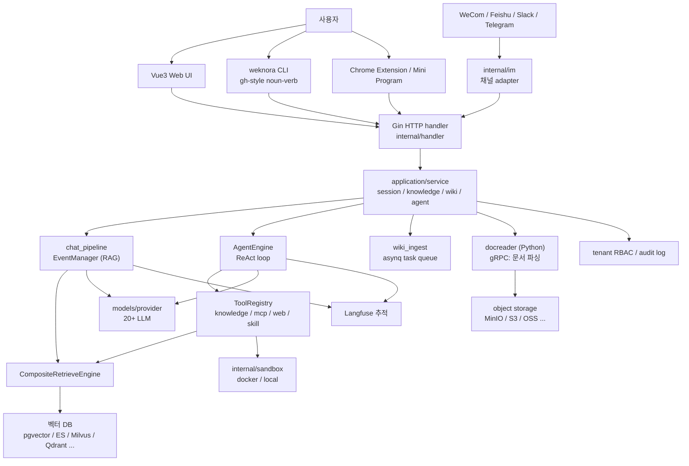
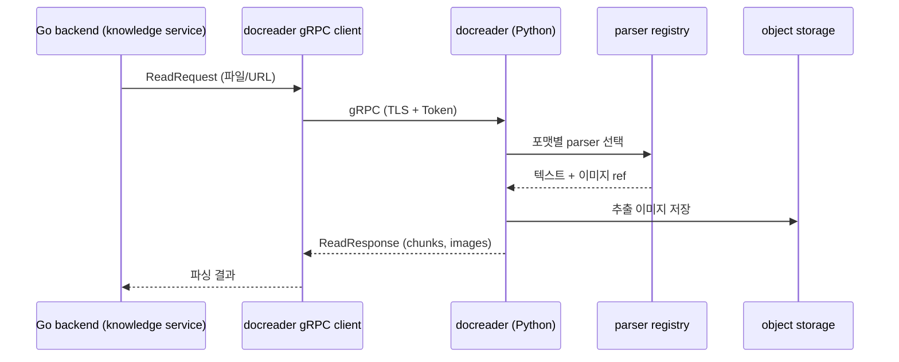
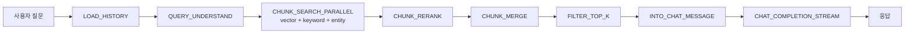
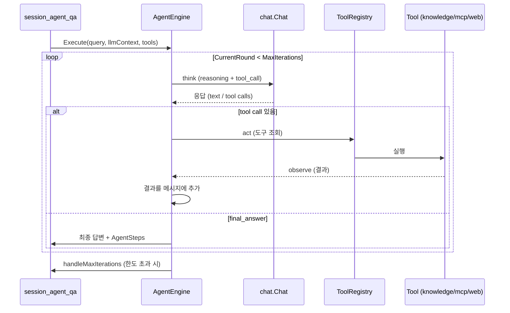
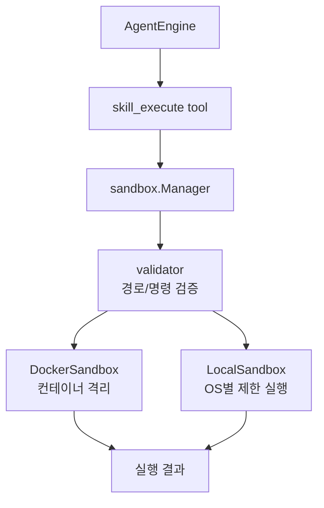
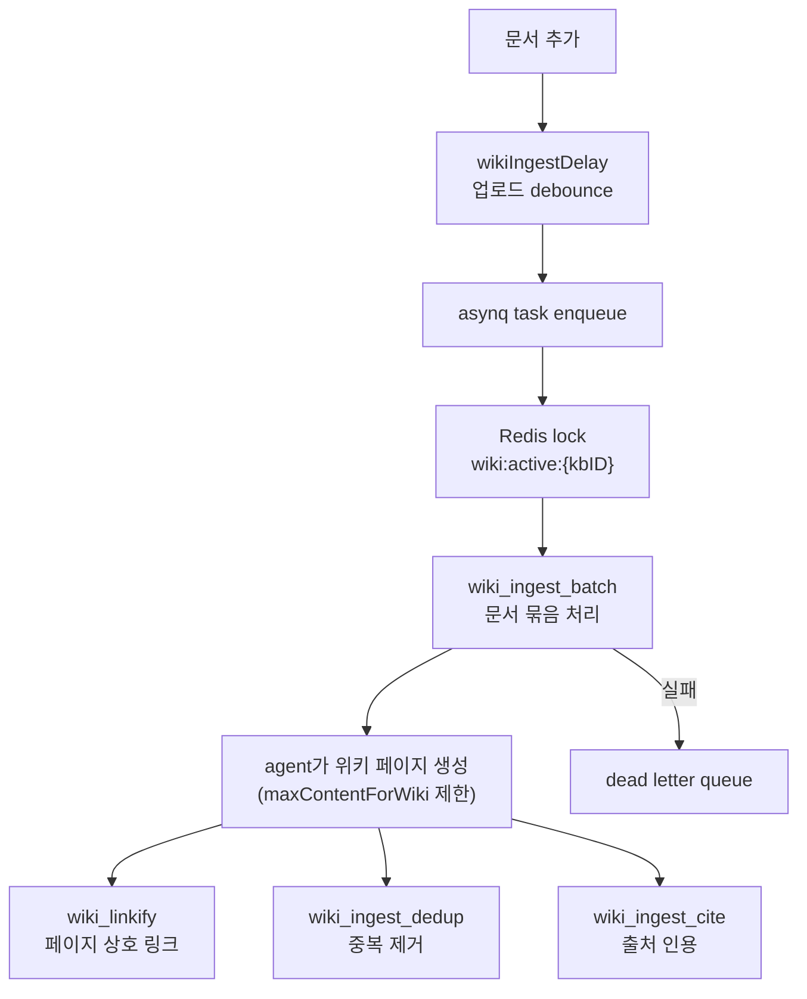

> Analyzed: 2026-05-30
> Package: WeKnora `0.6.0`
> Commit: `cea6ef0ce330083100c994199a21068f42f153c5`
> Repository: https://github.com/Tencent/WeKnora
> Local path: `~/workspace/opensources/WeKnora`

---

_This article is mostly written by Claude Code_

---

## 1. Why WeKnora?

WeKnora is an open-source knowledge framework released by Tencent. The README describes it as "an LLM-powered enterprise framework for document understanding, semantic search, and autonomous reasoning." At first glance it looks like yet another RAG system — but opening the repository reveals something far broader than a simple RAG library.

Three things stand out.

First, WeKnora **packs three distinct usage modes into a single framework**: RAG-based fast Q&A; a **ReAct Agent** that autonomously orchestrates retrieval, MCP tools, and web search; and **Wiki Mode**, which refines source documents into an interlinked markdown knowledge base. These three modes are not separate products — they share the same retrieval and inference infrastructure.

Second, WeKnora is a **modular pipeline where every component is swappable**. The document parser, embedding model, vector DB, object storage, and LLM provider are all interchangeable. The codebase handles 7 vector DBs (pgvector, Elasticsearch, Milvus, Weaviate, Qdrant, Apache Doris, Tencent VectorDB) and 20+ LLM providers simultaneously.

Third, WeKnora is a **framework built for enterprise operation from the ground up**. Multi-tenant RBAC (four-level roles), per-tenant audit logs, AES-256-GCM credential encryption, gRPC TLS, Langfuse observability, and an asynq-based async task queue all live inside a single monorepo.

Calling WeKnora a "RAG chatbot" undersells it considerably. A more accurate description is a **multi-tenant knowledge operations platform that ties together document ingestion through autonomous reasoning as swappable modules**.

## 2. Comparison with Recently Analyzed Projects

| Post                                                   | Core Problem                                         | Relationship to WeKnora                                                                                                                                                         |
| ------------------------------------------------------ | ---------------------------------------------------- | ------------------------------------------------------------------------------------------------------------------------------------------------------------------------------- |
| [Dify](/kb/2026-05-17-dify-architecture)               | Productizing LLM apps with workflow and RAG          | Where Dify is a platform for building LLM apps via a visual workflow canvas, WeKnora is a framework that turns document knowledge itself into an operational asset.             |
| [LangChain](/kb/2026-03-13-langchain-architecture)     | Abstracting the composition of LLM applications      | Where LangChain provides general-purpose building blocks, WeKnora is a pre-assembled framework with RAG, Agent, and Wiki already integrated.                                    |
| [agentmemory](/kb/2026-05-13-agentmemory-architecture) | Long-term memory and shared context                  | Where agentmemory separates memory into its own product, WeKnora embeds memory retrieval/storage as events inside the chat pipeline.                                            |
| [OpenHands](/kb/2026-05-17-openhands-architecture)     | Running a coding agent as a web product with sandbox | Where OpenHands is an agent for coding tasks, WeKnora's Agent is a ReAct agent focused on knowledge retrieval and tool invocation. The sandbox isolation philosophy is similar. |
| [Qwen Code](/kb/2026-05-17-qwen-code-architecture)     | Terminal coding agent runtime                        | Where Qwen Code is a tool loop for editing code, WeKnora is a tool loop for document knowledge. The tool registry/skill pattern is analogous.                                   |

These connections matter because WeKnora cannot be explained by "RAG retrieval quality" alone. Its core is not a retrieval algorithm — it is **the entire surface for operating knowledge**.

In the Dify post, the product boundary was the workflow canvas and the plugin daemon. In WeKnora, the boundaries are the `docreader` gRPC service, the `EventManager` chat pipeline, `CompositeRetrieveEngine`, `AgentEngine`, and the Wiki ingest task queue.

## 3. The Project in One Sentence

**WeKnora** is a Go 1.26 backend monorepo that bundles a Python docreader gRPC service, an event-driven RAG chat pipeline, a composite multi-store retriever, a ReAct agent engine, automated Wiki generation, 20+ LLM provider abstractions, 7 IM channels, and multi-tenant RBAC — a **self-hosted knowledge framework that turns scattered documents into searchable, reasoning-ready knowledge assets**.

In question-and-answer form:

| Question                                   | WeKnora's Answer                                                                                                                                         |
| ------------------------------------------ | -------------------------------------------------------------------------------------------------------------------------------------------------------- |
| How are documents parsed?                  | A separate Python `docreader` service receives PDFs, Word files, images, Excel files, etc. over gRPC and converts them into chunks and image references. |
| How is a RAG query processed?              | The `chat_pipeline`'s `EventManager` triggers events in sequence: query understand → search → rerank → merge → completion.                               |
| How are multiple vector DBs used?          | `CompositeRetrieveEngine` delegates to registered engines by retriever type and merges the results.                                                      |
| How are complex questions handled?         | `AgentEngine` runs a ReAct (think/act/observe) loop, repeatedly calling tools until it invokes `final_answer`.                                           |
| How do you switch model providers?         | Via the 20+ provider implementations and chat/embedding/rerank/asr/vlm interfaces in `internal/models/provider`.                                         |
| How is dangerous code execution contained? | Agent skills are run in isolation inside `internal/sandbox`'s docker or local sandbox.                                                                   |
| How are documents turned into a wiki?      | `wiki_ingest` uses an asynq task queue to batch documents, and the agent generates interlinked wiki pages and a knowledge graph.                         |
| How is it used by teams?                   | Tenant RBAC (Owner/Admin/Contributor/Viewer), per-KB ownership, and per-tenant audit logs are provided.                                                  |

## 4. Tech Stack and Scale

| Area             | Technology                                                                         |
| ---------------- | ---------------------------------------------------------------------------------- |
| Backend          | Go `1.26.0`, uber/dig DI container                                                 |
| Document parsing | Python docreader, gRPC, uv/pyproject                                               |
| Frontend         | Vue 3, Vite, TypeScript, pnpm workspace                                            |
| Desktop          | Wails (`cmd/desktop`)                                                              |
| LLM providers    | OpenAI, Azure, Anthropic, DeepSeek, Qwen, Zhipu, Hunyuan, Gemini, Ollama, and more |
| Vector DBs       | pgvector, Elasticsearch, Milvus, Weaviate, Qdrant, Apache Doris, Tencent VectorDB  |
| Object storage   | Local, MinIO, AWS S3, Volcengine TOS, Alibaba OSS, KS3, Huawei OBS                 |
| Async tasks      | Redis, asynq, MQ, DLQ                                                              |
| IM channels      | WeCom, Feishu, Slack, Telegram, DingTalk, Mattermost, WeChat                       |
| Web search       | DuckDuckGo, Bing, Google, Tavily, Baidu, Ollama, SearXNG                           |
| Observability    | Langfuse, OpenTelemetry, Jaeger                                                    |
| Deployment       | Docker Compose profiles, Kubernetes Helm chart                                     |

Approximate scale based on a local checkout:

| Metric                          | Count |
| ------------------------------- | ----: |
| Git-tracked files               | 1,838 |
| Go files                        | 1,092 |
| Python files (mainly docreader) |    49 |
| Vue files (frontend)            |   114 |
| TypeScript files                |    80 |

By file count this is comparable to Dify or OpenHands. The `internal/` directory is packed with service, repository, agent, models, infrastructure, im, sandbox, and tracing subdirectories — the weight feels less like "a RAG system" and more like a full knowledge-operations backend.

## 5. The Big Picture

The overall architecture looks like this:



The key observation here is that **document parsing (docreader) is a separate Python process, decoupled from the Go backend**. RAG (`chat_pipeline`) and Agent (`AgentEngine`) share the same retriever and LLM provider, but their execution models differ: RAG follows a fixed event sequence, while Agent runs a dynamic ReAct loop.

## 6. Codebase Map

The key directories are:

```text
WeKnora/
├── cmd/
│   ├── server/                          # Go main server entrypoint, bootstrap
│   └── desktop/                         # Wails desktop app
├── internal/
│   ├── handler/                         # Gin HTTP handlers, DTOs
│   ├── application/
│   │   ├── service/                     # Domain services (session, knowledge, wiki, agent ...)
│   │   │   ├── chat_pipeline/           # RAG event-driven pipeline
│   │   │   ├── retriever/               # Composite retrieval engine
│   │   │   ├── memory/                  # Conversation memory
│   │   │   └── metric/                  # Evaluation metrics
│   │   └── repository/                  # DB access layer
│   ├── agent/
│   │   ├── engine.go                    # ReAct AgentEngine
│   │   ├── think.go / act.go / observe.go
│   │   ├── tools/                       # Built-in tools, MCP, skills, final_answer
│   │   ├── skills/                      # Skill manager (progressive disclosure)
│   │   ├── memory/                      # Agent memory consolidator
│   │   └── approval/                    # Human-in-the-loop tool approval
│   ├── models/
│   │   ├── provider/                    # 20+ LLM provider implementations
│   │   ├── chat / embedding / rerank / asr / vlm
│   ├── infrastructure/
│   │   ├── docparser / chunker          # Chunking strategies
│   │   ├── web_search / web_fetch       # Web search engines
│   ├── im/                              # WeCom / Feishu / Slack / Telegram ...
│   ├── sandbox/                         # Docker / local code execution isolation
│   ├── container/                       # uber/dig DI container
│   ├── datasource/                      # Feishu / Notion / Yuque connectors
│   ├── tracing/langfuse/                # Observability
│   └── types/                           # Domain types, event definitions
├── docreader/                           # Python document parsing gRPC service
│   ├── parser/ splitter/ proto/
├── frontend/                            # Vue3 Web UI
├── cli/                                 # weknora CLI (Go, gh-style)
├── mcp-server/                          # Built-in MCP service
├── migrations/                          # DB migrations
└── docker-compose.yml / helm/           # Deployment
```

When first reading the codebase, the best starting point is the `EventType` definitions in `internal/types/chat_manage.go`. It gives an at-a-glance view of every stage a RAG query passes through.

Next, look at `internal/application/service/session_knowledge_qa.go`. This is where you can see the full sequence of events triggered by a single user question.

## 7. docreader: Separating Document Parsing into a Standalone Python gRPC Service

WeKnora's first architectural decision is to **decouple document parsing from the Go backend**. `docreader/` is an independent Python service; `docreader/main.py` starts the gRPC server.



The rationale for this separation is straightforward. The Python ecosystem (PyMuPDF, OCR, VLM) excels at parsing PDFs, Word documents, image OCR, Excel, and PowerPoint. Rather than re-implementing this in Go, WeKnora calls a Python service via gRPC. `docreader/parser/registry.py` registers format-specific parsers, and `splitter/` handles chunking.

Security is also addressed. In v0.6.0, the app-to-docreader communication is authenticated with gRPC TLS and a token. The `AuthInterceptor` in `docreader/auth.py` handles this. In other words, docreader is not treated as a "trusted internal service" — it is a separate security boundary that requires authentication.

This architecture echoes [Dify](/kb/2026-05-17-dify-architecture)'s decision to isolate plugins as a separate daemon. Offloading heavy work or foreign-language ecosystems to a separate process keeps the core backend lean and well-defined.

## 8. Chat Pipeline: Assembling RAG as an Event-Driven Plugin Chain

WeKnora's RAG is not a single monolithic function — it is an **event-driven plugin chain**. The core is the `EventManager` and `Plugin` interface in `internal/application/service/chat_pipeline/chat_pipeline.go`.

```go
type Plugin interface {
    OnEvent(
        ctx context.Context,
        eventType types.EventType,
        chatManage *types.ChatManage,
        next func() *PluginError,
    ) *PluginError
    ActivationEvents() []types.EventType
}
```

Each plugin declares which `EventType`s it handles, and the `EventManager` runs the registered plugins for each event in order. A shared context object called `chatManage` flows between plugins, accumulating state as it goes.

Event types are defined in `internal/types/chat_manage.go`:

| Event                        | Role                                                                  |
| ---------------------------- | --------------------------------------------------------------------- |
| `LOAD_HISTORY`               | Loads previous conversation history.                                  |
| `QUERY_UNDERSTAND`           | Rewrites and expands the query.                                       |
| `CHUNK_SEARCH_PARALLEL`      | Runs multiple search strategies (vector/keyword/entity) in parallel.  |
| `ENTITY_SEARCH`              | Searches knowledge graph entities.                                    |
| `CHUNK_RERANK`               | Re-sorts chunks using a reranking model.                              |
| `WEB_FETCH`                  | Fetches external web documents when needed.                           |
| `CHUNK_MERGE`                | Handles parent-child chunk merging, overlap merging, and FAQ merging. |
| `FILTER_TOP_K`               | Filters chunks by threshold and top-k.                                |
| `INTO_CHAT_MESSAGE`          | Assembles retrieval results into LLM messages.                        |
| `CHAT_COMPLETION(_STREAM)`   | Generates LLM responses (including streaming).                        |
| `MEMORY_RETRIEVAL / STORAGE` | Reads and writes conversation memory.                                 |

The actual invocation happens in `session_knowledge_qa.go`, which builds a list of events and runs them in sequence via `eventManager.Trigger()`. The event list is constructed dynamically based on context — for example, `LOAD_HISTORY` is prepended when history exists.



The benefit of this design is clear: adding a new retrieval strategy or post-processing step means registering one more plugin rather than modifying a large function. This is why each stage has its own file — `merge_overlap.go`, `merge_faq.go`, `wiki_boost.go`, and so on.

## 9. Retriever: Wrapping Multiple Vector DBs in a Composite Engine

The retrieval stage is handled by `CompositeRetrieveEngine` in `internal/application/service/retriever/composite.go`. The core idea is to **delegate to registered engines by retriever type and merge the results**.

```go
type CompositeRetrieveEngine struct {
    engineInfos []*engineInfo
}
```

Each `engineInfo` holds a concrete engine and the list of retriever types it supports. `Retrieve()` finds engines matching the requested retriever types and runs them in parallel via `concurrentRetrieve`.

This pattern lets WeKnora combine multiple search strategies within a single KB:

| Retriever type        | Description                                            |
| --------------------- | ------------------------------------------------------ |
| Dense (vector)        | Embedding-based semantic search                        |
| Sparse (BM25/keyword) | Keyword-based search                                   |
| GraphRAG (entity)     | Knowledge graph entity search (Neo4j)                  |
| Hybrid                | Vector + keyword fusion with normalized fusion scoring |

The vector DB itself is also swappable. `internal/container/engine_factory.go` instantiates one of pgvector, Elasticsearch, Milvus, Weaviate, Qdrant, Apache Doris, or Tencent VectorDB based on configuration. In v0.6.0, KB search can also fan out across multiple vector stores (`knowledgebase_search_fanout.go`).

This shares a goal with [LangChain](/kb/2026-03-13-langchain-architecture)'s retriever abstraction, but where LangChain provides general-purpose building blocks, WeKnora implements an operational retriever that also accounts for multi-tenancy and per-KB ownership (`ownership.go`).

## 10. ReAct Agent: The Think → Act → Observe Loop

WeKnora's second execution model is the Agent. `AgentEngine` in `internal/agent/engine.go` runs the ReAct loop.

An important design comment is attached to the engine: **the engine is stateless between turns**. Conversation history is re-loaded from the database on every turn by `service.LoadAgentHistory` and passed in as `llmContext`. The engine keeps no internal cache or cross-turn buffer. This is a deliberate choice to keep state consistency simple in a multi-tenant, multi-instance environment.



The loop body is executed one step at a time by `runReActIteration` (think → analyze → act → observe). Each iteration guarantees exactly one emission of `EventAgentComplete`, and the thinking and tool-call history accumulates in `AgentSteps`, which is attached to the assistant message. This lets the UI display the intermediate reasoning as a tree.

`MaxIterations` prevents infinite loops, and `handleMaxIterations` provides a graceful exit when the limit is reached. This pattern belongs to the same family as [Qwen Code](/kb/2026-05-17-qwen-code-architecture)'s tool loop and [OpenHands](/kb/2026-05-17-openhands-architecture)'s agent loop — the key difference is that WeKnora's tools center on **knowledge retrieval and external data lookups**, not code editing.

## 11. Agent Tools: Built-in Tools, MCP, Skills, and final_answer

`internal/agent/tools/` holds all the tools the ReAct loop can invoke. `registry.go` registers them, and `definitions.go` generates the schema sent to the LLM.

| Tool                                    | Role                                                                     |
| --------------------------------------- | ------------------------------------------------------------------------ |
| `knowledge_search`                      | Searches chunks from a KB.                                               |
| `query_knowledge_graph`                 | Queries the knowledge graph.                                             |
| `list_knowledge_chunks` / `grep_chunks` | Lists or searches chunks.                                                |
| `get_document_info`                     | Fetches document metadata.                                               |
| `web_search` / `web_fetch`              | Searches and fetches external web content.                               |
| `data_analysis`                         | Analyzes tabular data using DuckDB.                                      |
| `mcp_tool`                              | Invokes tools from external MCP servers.                                 |
| `sequentialthinking`                    | Enforces step-by-step reasoning.                                         |
| `todo_write`                            | Manages task plans.                                                      |
| `skill_read` / `skill_execute`          | Reads and executes skills inside the sandbox.                            |
| `final_answer`                          | Terminates the loop and commits the final answer.                        |
| `wiki_*`                                | Wiki Mode-specific tools for page authoring, editing, and issue tracking |

`final_answer` deserves special attention. WeKnora does not simply let the model respond and call it done — instead, **the loop terminates only when the model explicitly calls the `final_answer` tool**. This is a deliberate contract: loop termination is controlled by an explicit tool invocation, not left to the model's discretion. (This is the same concern seen with `structured_output`/termination control in the Qwen Code analysis.)

MCP is the external extension surface. `mcp_tool.go` invokes tools from external MCP servers, and since v0.5.2, risky MCP tools pass through human-in-the-loop approval (`internal/agent/approval`, `mcp_tool_approval_service.go`). Note the direction here: where [agentmemory](/kb/2026-05-13-agentmemory-architecture) exposed memory _via_ MCP, WeKnora _consumes_ MCP.

## 12. Skills and Sandbox: Isolating Code Execution

WeKnora's Skills are reusable procedures or code snippets that the agent can execute. `Manager` in `internal/agent/skills/manager.go` loads skills and exposes them to the model on demand using **progressive disclosure** — skills are only revealed when needed. This reduces initial prompt token usage while keeping the skill surface broad, the same idea as Qwen Code's path-gated skills.

The difference is execution isolation. When a skill runs code, WeKnora isolates it inside `internal/sandbox`.



The implementation is split across `sandbox.go`, `docker.go`, `local_unix.go`, and `local_windows.go`, with `validator.go` validating inputs before execution. WeKnora thus separates the power of "the agent can execute code" from the risk of "that code cannot be trusted" — the sandbox boundary keeps them apart.

The philosophy here mirrors [OpenHands](/kb/2026-05-17-openhands-architecture)'s approach of running the coding agent inside a sandbox runtime. The scope differs, however: OpenHands runs the entire coding workflow inside the sandbox, while WeKnora only sandboxes knowledge-agent skill execution.

## 13. Wiki Mode: Turning Documents into a Self-Maintaining Knowledge Base

The third mode is Wiki Mode, which reached GA in v0.5.0. The core idea is that **the agent reads source documents and automatically generates interlinked markdown wiki pages and a knowledge graph**.

The implementation is centered on `internal/application/service/wiki_ingest.go`. Because this work is heavy and long-running, it is handled not as a synchronous request but as an **asynq-based async task queue**.



The operational details are remarkably thorough:

- A `wiki:active:{kbID}` Redis lock is acquired per KB to **prevent concurrent batches**. If a batch is already running, `ErrWikiIngestConcurrent` is returned.
- This sentinel error is detected by asynq's `RetryDelayFunc` via `errors.Is`, which applies a **short fixed retry delay** instead of the default exponential backoff. The intent is to prevent newcomers from waiting several minutes if an orphan lock is left behind by a crash.
- Uploads are debounced (`wikiIngestDelay`) so that uploading multiple documents in rapid succession results in a single batch run.
- Document content is capped at `maxContentForWiki` (32 KB) to protect LLM context.
- Failed tasks go to a DLQ, and since v0.5.2 the system scales to KBs with 40,000 documents.

The post-generation pipeline — `wiki_linkify`, `wiki_ingest_dedup`, `wiki_ingest_cite`, `wiki_lint` — is particularly impressive. Rather than leaving agent-generated wiki pages as-is, separate stages verify link integrity, deduplicate, add citations, and enforce quality. The phrase "self-maintaining knowledge base" is not just marketing copy — it is a real pipeline.

## 14. Model Providers: Abstracting 20+ LLMs

`internal/models/provider/` contains 20+ provider implementations: OpenAI, Azure OpenAI, Anthropic, DeepSeek, Qwen (Aliyun), Zhipu, Hunyuan, Volcengine, Gemini, MiniMax, NVIDIA, Novita, SiliconFlow, OpenRouter, Moonshot, Qianfan, Qiniu, ModelScope, GPUStack, Jina, and WeKnora Cloud.

Above the providers, capability-specific interfaces are defined:

| Interface   | Role                            |
| ----------- | ------------------------------- |
| `chat`      | LLM conversation generation     |
| `embedding` | Embedding generation            |
| `rerank`    | Search result re-ranking        |
| `asr`       | Speech recognition (audio docs) |
| `vlm`       | Image description (multimodal)  |

This abstraction lets WeKnora use a different model per KB and share built-in models across tenants (multi-tenant built-in model sharing in v0.6.0). Most providers are absorbed by the OpenAI-compatible implementation in `generic.go`; only providers that require special handling get their own file.

The provider list includes [Ollama](/kb/2026-03-15-ollama-architecture). `internal/models/chat/ollama.go`, `embedding/ollama.go`, and the VLM path all treat Ollama as a first-class provider. This connects directly to WeKnora's emphasis in Section 1 on "local and private-cloud deployment with data sovereignty." Achieving a fully self-hosted scenario — where documents never leave the premises — requires being able to run chat, embeddings, and multimodal inference against a local model server, without any external API calls.

VLM also connects directly to the agent loop. The `ImageDescriberFunc` in `engine.go` passes images found in tool results to a VLM for description, allowing the agent to reason in text about retrieval results that contain images.

## 15. Dependency Injection and the Container

WeKnora does not wire dependencies manually — it uses an **uber/dig DI container**. `internal/container/container.go` registers config, tracer, langfuse, database, file service, redis, and the retrieve engine registry, all via `container.Provide(...)`.

```go
must(container.Provide(config.LoadConfig))
must(container.Provide(initTracer))
must(container.Provide(initLangfuse))
must(container.Provide(initDatabase))
must(container.Provide(initFileService))
must(container.Provide(initRedisClient))
must(container.Provide(initRetrieveEngineRegistry))
```

`cmd/server/bootstrap.go` configures the container and starts the server. With DI, provider functions simply declare their dependencies and dig resolves and injects the graph. In a project with many swappable components — vector DB, storage, LLM — this makes it straightforward to "inject a different implementation based on configuration."

This is distinctly different from Dify wiring services via Flask app context — it is the idiomatic Go approach. Using runtime dig rather than compile-time wire is another notable characteristic.

## 16. IM Channels and External Entry Points

WeKnora does not limit itself to a Web UI as an entry point. `internal/im/` contains adapters for 7 messaging channels:

| Channel    | Directory                |
| ---------- | ------------------------ |
| WeCom      | `internal/im/wecom`      |
| Feishu     | `internal/im/feishu`     |
| Slack      | `internal/im/slack`      |
| Telegram   | `internal/im/telegram`   |
| DingTalk   | `internal/im/dingtalk`   |
| Mattermost | `internal/im/mattermost` |
| WeChat     | `internal/im/wechat`     |

Each channel routes platform messages into WeKnora sessions. Versions v0.3.5–v0.3.6 added IM slash commands, quote-reply context, thread-based sessions, and a QA queue — evolving from a simple webhook into a full channel layer that preserves conversation context.

Beyond messaging, there are several other entry points:

| Entry point         | Description                                                                  |
| ------------------- | ---------------------------------------------------------------------------- |
| Web UI              | Vue3 + Vite SPA, ⌘K command palette, wiki browser and graph visualization    |
| `weknora` CLI       | gh-style noun-verb, `--json` stable envelope, AGENTS.md operational contract |
| Chrome Extension    | Captures web content into a KB                                               |
| WeChat Mini Program | Lightweight mobile client                                                    |
| Desktop (Wails)     | `cmd/desktop`, native desktop app                                            |
| MCP server          | `mcp-server/`, exposes WeKnora as an MCP tool                                |

One particularly interesting detail: `cli/AGENTS.md` exists. The CLI output is designed as a **stable contract that AI agents (Claude Code, Cursor, Aider, etc.) can rely on**. WeKnora is itself an agent, and at the same time it is built to be consumed as a tool by other agents.

## 17. Multi-Tenant RBAC and Security

The most significant addition in v0.6.0 is enterprise access control:

| Layer                   | Mechanism                                                                                       |
| ----------------------- | ----------------------------------------------------------------------------------------------- |
| Tenant RBAC             | Four-tier role matrix: Owner / Admin / Contributor / Viewer                                     |
| Resource ownership      | Per-KB ownership, owner chain (`knowledge_owner_chain`)                                         |
| Audit log               | Per-tenant audit log with retention policy (`audit_log_retention`)                              |
| Credential encryption   | API keys, MCP, and datasource credentials encrypted at rest with AES-256-GCM, with key rotation |
| Service-to-service auth | app ↔ docreader via gRPC TLS + Token                                                           |
| SSRF defense            | SSRF-safe HTTP client for web_fetch                                                             |
| Skill isolation         | Agent skill execution inside sandbox (docker/local)                                             |
| Storage allowlist       | `handler/storage_allowlist.go` restricts allowed storage paths                                  |

Invite-only workspaces, self-service tenant creation, and cross-tenant superuser access all confirm that WeKnora directly addresses the scenario of "one organization distributing knowledge bases across multiple teams."

Observability is equally operationally minded. Langfuse (`internal/tracing/langfuse`) records the ReAct loop, token usage, tool calls, and pipeline traces. The agent engine creates an `agent.execute` span, and long queries are truncated to `langfuseQueryPreview` (2,000 characters) when sent as input. The intent to track costs and reasoning is visible throughout the codebase.

## 18. Recommended Reading Order

For anyone reading WeKnora for the first time, the following order is recommended:

1. `README.md` and `CHANGELOG.md`

   Start by understanding the three modes (RAG/Agent/Wiki) and how features have grown across versions.

2. `internal/types/chat_manage.go`

   Reading `EventType` and `ChatManage` reveals the data flow through the RAG pipeline.

3. `internal/application/service/chat_pipeline/chat_pipeline.go`

   See how `EventManager` and the `Plugin` interface make the plugin chain work.

4. `internal/application/service/session_knowledge_qa.go`

   Confirm the sequence of events triggered by a user question.

5. `internal/application/service/retriever/composite.go`

   See how multiple vector DBs are wrapped in a composite engine.

6. `internal/agent/engine.go` and `act.go` / `think.go` / `observe.go`

   Examine the ReAct loop, the stateless design, and the `MaxIterations` termination condition.

7. `internal/agent/tools/registry.go` and `final_answer.go`

   Understand tool registration and the termination contract.

8. `internal/application/service/wiki_ingest.go`

   See how wiki generation is operationalized with an asynq task queue, Redis lock, debounce, and DLQ.

9. `internal/sandbox/sandbox.go`

   Understand the isolation boundary for agent skill execution.

10. `docreader/main.py` and `internal/container/container.go`

    Examine the document parsing gRPC service boundary and the DI setup.

## 19. Noteworthy Design Decisions

### 1. RAG is implemented as an event-driven plugin chain.

Retrieval, reranking, merging, and completion are separated into plugins per `EventType` rather than a single monolithic function. Adding a new stage means registering one plugin. Specialized stages like `wiki_boost` and `merge_faq` follow the same pattern.

### 2. All three modes share the same infrastructure.

RAG, ReAct Agent, and Wiki Mode are not separate products — they share the same retriever, LLM provider, and KB. Even Wiki generation ultimately has the agent reading documents with tools. Infrastructure reuse is well-realized.

### 3. Document parsing and code execution are isolated at separate boundaries.

docreader is a Python gRPC service; skill execution is isolated in a sandbox. There is a consistent philosophy of keeping "a different language ecosystem" and "untrusted code" separate from the core backend.

### 4. Wiki ingest is a genuine production system.

It has an asynq task queue, per-KB Redis lock, sentinel-error-based retry tuning, debounce, DLQ, and 40k-document scalability. The demo idea of "agent writes a wiki" has been turned into an operational batch pipeline.

### 5. Enterprise operations were considered from the start.

Multi-tenant RBAC, audit logs, credential encryption, gRPC TLS, SSRF defense, storage allowlisting, and Langfuse all live in a single monorepo. This is a framework designed for internal deployment, not a proof of concept.

## 20. Points to Watch Out For

### 1. The number of components makes the deployment surface large.

The `docker-compose.yml` lists dozens of services: frontend, app, sandbox, docreader, postgres, redis, searxng, minio, jaeger, neo4j, qdrant, milvus, weaviate, doris, dex, langfuse, and more. They are split into profiles, but running everything at once creates significant operational overhead. A strategy of enabling only the needed profiles is necessary.

### 2. The docreader dependency is easy to overlook.

Document parsing happens in the Python service, not in Go. If the gRPC TLS/Token configuration is misaligned, the entire ingestion pipeline is blocked. If you're only watching Go backend logs, you can easily miss the root cause.

### 3. The number of mode and configuration combinations is large.

RAG/Agent/Wiki mode, retriever type, vector DB, provider, IM channel, and RBAC role are all gated by configuration. The system is powerful, but teams need to clearly document per-KB model choices, retrieval strategies, and permissions before rolling it out at scale.

### 4. The ReAct agent incurs significant cost and latency.

The think→act→observe loop makes multiple LLM calls to produce a single answer. `MaxIterations` bounds the loop, but it still consumes far more tokens and time than a RAG Quick Q&A. Routing simple queries to RAG mode and only sending complex multi-step tasks to the agent is a sensible strategy.

### 5. Wiki generation is sensitive to LLM quality.

The `maxContentForWiki` limit and post-processing steps (linkify/dedup/cite/lint) provide guardrails, but wiki quality ultimately depends on the generation model. At a 40k-document scale, the combined cost of generation and consistency verification must be planned for.

## 21. Conclusion

WeKnora is a significantly larger project than "yet another RAG chatbot." Its actual architecture is closer to a **multi-tenant knowledge operations platform that ties document ingestion through autonomous reasoning together as swappable modules**.

Where [Dify](/kb/2026-05-17-dify-architecture) productizes LLM apps through a visual workflow, WeKnora makes document knowledge itself into an asset that can be searched, reasoned over, and self-organized. Where [LangChain](/kb/2026-03-13-langchain-architecture) provides general-purpose building blocks, WeKnora is a pre-assembled product with RAG, Agent, and Wiki already integrated along with a full suite of operational tooling.

The most important question when looking at WeKnora is not "how accurate is the retrieval?" The more important questions are:

> When parsing documents, chunking, searching across multiple vector DBs, having an agent reason with tools, auto-generating a wiki, and operating all of this multi-tenant — what modules define each boundary, and what should be swappable?

WeKnora's answer is the `docreader` gRPC service, the `EventManager` chat pipeline, `CompositeRetrieveEngine`, `AgentEngine`, the `wiki_ingest` task queue, `sandbox`, and tenant RBAC. Understanding these boundaries reveals that WeKnora is not a simple RAG system — it is a framework designed to operate knowledge at scale.
