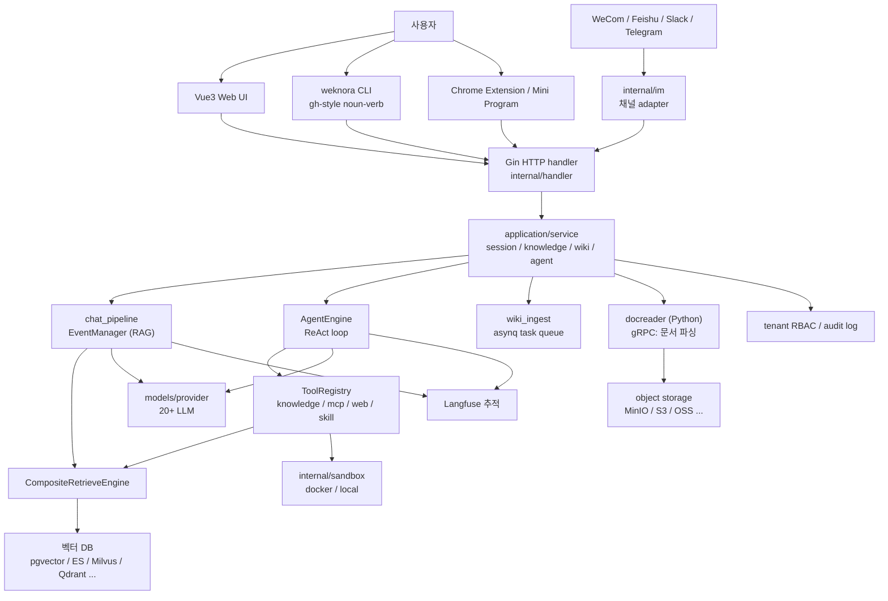
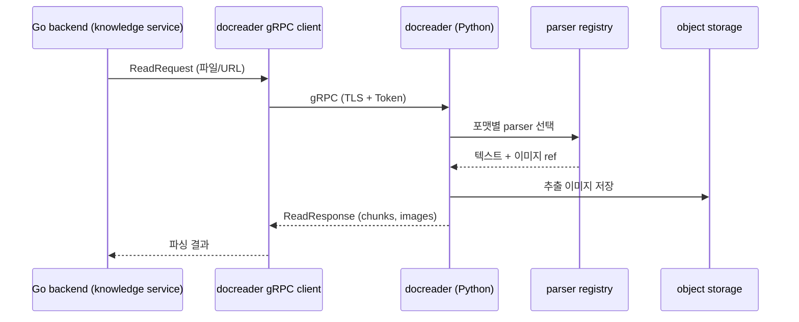
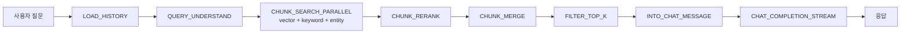
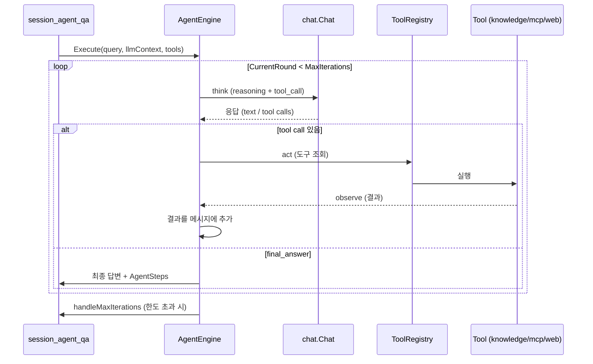
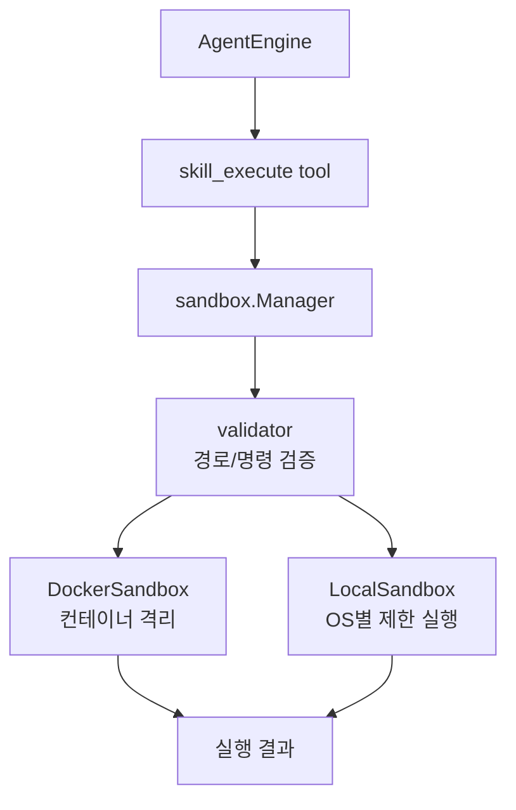
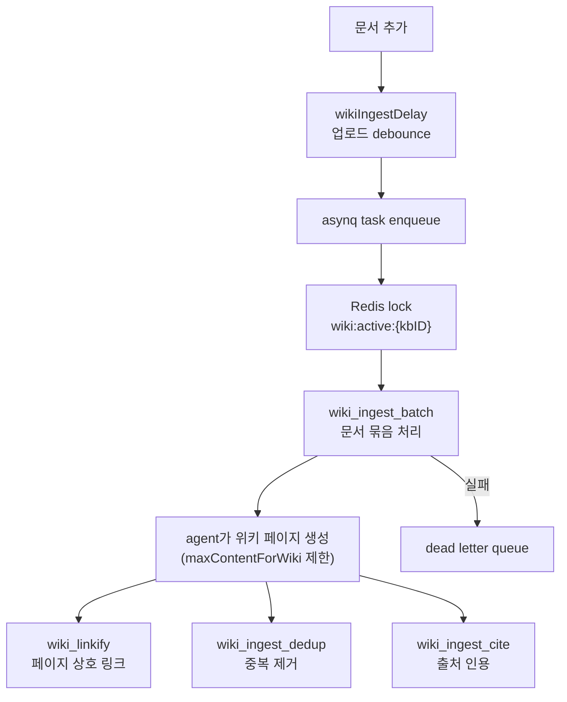

> 분석 일자: 2026-05-30
> 대상 버전: WeKnora `0.6.0`
> 대상 커밋: `cea6ef0ce330083100c994199a21068f42f153c5`
> 저장소: https://github.com/Tencent/WeKnora
> 로컬 분석 경로: `~/workspace/opensources/WeKnora`

---

_This article is mostly written by Claude Code_

## 목차

1. [왜 WeKnora인가요?](#1-왜-weknora인가요)
2. [최근 분석한 프로젝트들과의 비교](#2-최근-분석한-프로젝트들과의-비교)
3. [프로젝트를 한 문장으로 이해하기](#3-프로젝트를-한-문장으로-이해하기)
4. [기술 스택과 규모](#4-기술-스택과-규모)
5. [전체 그림](#5-전체-그림)
6. [코드베이스 지도](#6-코드베이스-지도)
7. [docreader: 문서 파싱을 별도 Python gRPC 서비스로 분리합니다](#7-docreader-문서-파싱을-별도-python-grpc-서비스로-분리합니다)
8. [Chat pipeline: RAG를 event-driven plugin으로 조립합니다](#8-chat-pipeline-rag를-event-driven-plugin으로-조립합니다)
9. [Retriever: 여러 벡터 DB를 composite로 묶습니다](#9-retriever-여러-벡터-db를-composite로-묶습니다)
10. [ReAct Agent: think → act → observe 루프](#10-react-agent-think--act--observe-루프)
11. [Agent tools: 내장 도구, MCP, skill, final_answer](#11-agent-tools-내장-도구-mcp-skill-final_answer)
12. [Skills와 sandbox: 코드 실행을 격리합니다](#12-skills와-sandbox-코드-실행을-격리합니다)
13. [Wiki Mode: 문서를 self-maintaining 지식 베이스로 만듭니다](#13-wiki-mode-문서를-self-maintaining-지식-베이스로-만듭니다)
14. [Model provider: 20여 개 LLM을 추상화합니다](#14-model-provider-20여-개-llm을-추상화합니다)
15. [의존성 주입과 container](#15-의존성-주입과-container)
16. [IM 채널과 외부 진입점](#16-im-채널과-외부-진입점)
17. [Multi-tenant RBAC와 보안](#17-multi-tenant-rbac와-보안)
18. [코드를 읽는 추천 순서](#18-코드를-읽는-추천-순서)
19. [인상적인 설계 포인트](#19-인상적인-설계-포인트)
20. [주의해서 볼 지점](#20-주의해서-볼-지점)
21. [결론](#21-결론)

---

## 1. 왜 WeKnora인가요?

WeKnora는 Tencent가 공개한 오픈소스 지식 프레임워크입니다. README는 자신을 "LLM 기반 엔터프라이즈 문서 이해, 의미 검색, 자율 추론 프레임워크"로 설명합니다. 겉으로 보면 또 하나의 RAG 시스템처럼 보입니다. 하지만 저장소를 열어 보면 단순한 RAG 라이브러리보다 훨씬 넓습니다.

핵심은 세 가지입니다.

첫째, WeKnora는 **세 가지 사용 모드를 한 프레임워크 안에 함께 둡니다**. RAG 기반 빠른 Q&A, retrieval·MCP tool·web search를 스스로 오케스트레이션하는 **ReAct Agent**, 그리고 원문 문서를 상호 링크된 markdown 지식 베이스로 정제하는 **Wiki Mode**입니다. 이 세 모드는 별도 제품이 아니라 같은 검색·추론 인프라를 공유합니다.

둘째, WeKnora는 **모든 구성 요소가 swappable한 모듈형 파이프라인**입니다. 문서 파서, 임베딩 모델, 벡터 DB, object storage, LLM provider가 모두 교체 가능합니다. 코드상으로는 7종 벡터 DB(pgvector, Elasticsearch, Milvus, Weaviate, Qdrant, Apache Doris, Tencent VectorDB)와 20여 개 LLM provider를 동시에 다룹니다.

셋째, WeKnora는 **엔터프라이즈 운영을 전제로 한 프레임워크**입니다. multi-tenant RBAC(4단계 역할), per-tenant audit log, AES-256-GCM credential 암호화, gRPC TLS, Langfuse observability, asynq 기반 비동기 task queue가 모두 한 monorepo 안에 있습니다.

그래서 WeKnora를 "RAG 챗봇"이라고만 보면 작게 보입니다. 더 정확하게는 **문서 ingestion부터 자율 추론까지를 교체 가능한 모듈로 묶은, 멀티테넌트 지식 운영 플랫폼**입니다.

## 2. 최근 분석한 프로젝트들과의 비교

| 글                                                     | 중심 문제                                | WeKnora와의 관계                                                                                                                   |
| ------------------------------------------------------ | ---------------------------------------- | ---------------------------------------------------------------------------------------------------------------------------------- |
| [Dify](/kb/2026-05-17-dify-architecture)               | LLM 앱 개발과 workflow/RAG 제품화        | Dify가 시각적 workflow canvas로 LLM 앱을 만드는 플랫폼이라면, WeKnora는 문서 지식 자체를 운영 자산으로 만드는 프레임워크입니다.    |
| [LangChain](/kb/2026-03-13-langchain-architecture)     | LLM 애플리케이션 구성 추상화             | LangChain이 범용 building block 라이브러리라면, WeKnora는 RAG·Agent·Wiki를 미리 조립해 둔 완제품 프레임워크입니다.                 |
| [agentmemory](/kb/2026-05-13-agentmemory-architecture) | 장기 memory와 shared context             | agentmemory가 memory를 product로 분리한다면, WeKnora는 memory retrieval/storage를 chat pipeline 이벤트로 내장합니다.               |
| [OpenHands](/kb/2026-05-17-openhands-architecture)     | 코딩 에이전트를 웹 제품과 sandbox로 운영 | OpenHands가 코드 작업용 agent라면, WeKnora의 Agent는 지식 검색·도구 호출 중심의 ReAct agent입니다. sandbox 격리 발상은 닮았습니다. |
| [Qwen Code](/kb/2026-05-17-qwen-code-architecture)     | 터미널 코딩 에이전트 runtime             | Qwen Code가 코드 편집을 위한 tool loop라면, WeKnora는 문서 지식을 위한 tool loop입니다. tool registry/skill 패턴이 유사합니다.     |

이 연결이 중요한 이유는 WeKnora가 "RAG 검색 품질"만으로 설명되지 않기 때문입니다. WeKnora의 핵심은 검색 알고리즘보다 **지식을 운영하는 표면 전체**입니다.

Dify 글에서는 workflow canvas와 plugin daemon이 제품 경계였습니다. WeKnora에서는 `docreader` gRPC 서비스, `EventManager` chat pipeline, `CompositeRetrieveEngine`, `AgentEngine`, Wiki ingest task queue가 그 경계입니다.

## 3. 프로젝트를 한 문장으로 이해하기

**WeKnora**는 Go 1.26 기반 backend monorepo로, Python docreader gRPC 서비스, event-driven RAG chat pipeline, composite multi-store retriever, ReAct agent engine, Wiki 자동 생성, 20여 개 LLM provider 추상화, 7개 IM 채널, multi-tenant RBAC를 묶어서 **흩어진 문서를 검색·추론 가능한 지식 자산으로 바꾸는 셀프 호스팅 지식 프레임워크**입니다.

질문으로 바꾸면 다음과 같습니다.

| 질문                              | WeKnora의 답                                                                                                                |
| --------------------------------- | --------------------------------------------------------------------------------------------------------------------------- |
| 문서는 어떻게 파싱되나요?         | 별도 Python `docreader` 서비스가 gRPC로 PDF/Word/이미지/Excel 등을 받아 청크와 이미지로 변환합니다.                         |
| RAG 질의는 어떻게 처리되나요?     | `chat_pipeline`의 `EventManager`가 query understand → search → rerank → merge → completion 이벤트를 순서대로 trigger합니다. |
| 여러 벡터 DB는 어떻게 쓰나요?     | `CompositeRetrieveEngine`이 retriever type별로 등록된 엔진에 위임하고 결과를 병합합니다.                                    |
| 복잡한 질문은 어떻게 푸나요?      | `AgentEngine`이 ReAct(think/act/observe) 루프로 도구를 반복 호출하다 `final_answer`로 마칩니다.                             |
| 모델 provider는 어떻게 바꾸나요?  | `internal/models/provider`의 20여 개 provider 구현과 chat/embedding/rerank/asr/vlm 인터페이스를 씁니다.                     |
| 위험한 코드 실행은 어떻게 막나요? | agent skill은 `internal/sandbox`의 docker/local sandbox에서 격리 실행됩니다.                                                |
| 문서를 위키로 어떻게 바꾸나요?    | `wiki_ingest`가 asynq task queue로 문서를 모아 agent가 상호 링크된 위키 페이지와 knowledge graph를 생성합니다.              |
| 팀 단위로 어떻게 쓰나요?          | tenant RBAC(Owner/Admin/Contributor/Viewer), per-KB ownership, per-tenant audit log를 제공합니다.                           |

## 4. 기술 스택과 규모

| 영역           | 기술                                                                              |
| -------------- | --------------------------------------------------------------------------------- |
| Backend        | Go `1.26.0`, uber/dig DI container                                                |
| 문서 파싱      | Python docreader, gRPC, uv/pyproject                                              |
| Frontend       | Vue 3, Vite, TypeScript, pnpm workspace                                           |
| Desktop        | Wails (`cmd/desktop`)                                                             |
| LLM provider   | OpenAI, Azure, Anthropic, DeepSeek, Qwen, Zhipu, Hunyuan, Gemini, Ollama 외       |
| 벡터 DB        | pgvector, Elasticsearch, Milvus, Weaviate, Qdrant, Apache Doris, Tencent VectorDB |
| Object storage | Local, MinIO, AWS S3, Volcengine TOS, Alibaba OSS, KS3, Huawei OBS                |
| 비동기 task    | Redis, asynq, MQ, DLQ                                                             |
| IM 채널        | WeCom, Feishu, Slack, Telegram, DingTalk, Mattermost, WeChat                      |
| Web search     | DuckDuckGo, Bing, Google, Tavily, Baidu, Ollama, SearXNG                          |
| Observability  | Langfuse, OpenTelemetry, Jaeger                                                   |
| 배포           | Docker Compose profiles, Kubernetes Helm chart                                    |

로컬 체크아웃 기준의 대략적인 규모는 다음과 같습니다.

| 항목                            |    수치 |
| ------------------------------- | ------: |
| Git 추적 파일 수                | 1,838개 |
| Go 파일 수                      | 1,092개 |
| Python 파일 수 (주로 docreader) |    49개 |
| Vue 파일 수 (frontend)          |   114개 |
| TypeScript 파일 수              |    80개 |

파일 수만 보면 Dify나 OpenHands와 비슷한 규모입니다. 특히 `internal/` 아래에 service, repository, agent, models, infrastructure, im, sandbox, tracing이 빽빽하게 들어 있어서, RAG보다 "지식 운영 백엔드"의 무게가 더 큽니다.

## 5. 전체 그림

큰 구조는 아래처럼 볼 수 있습니다.



여기서 눈여겨볼 점은 **문서 파싱(docreader)이 Go backend와 분리된 별도 Python 프로세스**라는 것입니다. 그리고 RAG(chat_pipeline)와 Agent(AgentEngine)는 같은 retriever와 LLM provider를 공유하지만, 실행 모델은 다릅니다. RAG는 고정된 이벤트 순서를 따르고, Agent는 동적인 ReAct 루프를 돌립니다.

## 6. 코드베이스 지도

핵심 디렉터리는 다음과 같습니다.

```text
WeKnora/
├── cmd/
│   ├── server/                          # Go 메인 서버 entrypoint, bootstrap
│   └── desktop/                         # Wails 데스크톱 앱
├── internal/
│   ├── handler/                         # Gin HTTP handler, DTO
│   ├── application/
│   │   ├── service/                     # 도메인 서비스 (session, knowledge, wiki, agent ...)
│   │   │   ├── chat_pipeline/           # RAG event-driven 파이프라인
│   │   │   ├── retriever/               # composite 검색 엔진
│   │   │   ├── memory/                  # 대화 memory
│   │   │   └── metric/                  # 평가 지표
│   │   └── repository/                  # DB 접근 계층
│   ├── agent/
│   │   ├── engine.go                    # ReAct AgentEngine
│   │   ├── think.go / act.go / observe.go
│   │   ├── tools/                       # 내장 tool, MCP, skill, final_answer
│   │   ├── skills/                      # skill manager (progressive disclosure)
│   │   ├── memory/                      # agent memory consolidator
│   │   └── approval/                    # human-in-the-loop tool 승인
│   ├── models/
│   │   ├── provider/                    # 20+ LLM provider 구현
│   │   ├── chat / embedding / rerank / asr / vlm
│   ├── infrastructure/
│   │   ├── docparser / chunker          # 청킹 전략
│   │   ├── web_search / web_fetch       # 웹 검색 엔진
│   ├── im/                              # WeCom / Feishu / Slack / Telegram ...
│   ├── sandbox/                         # docker / local 코드 실행 격리
│   ├── container/                       # uber/dig DI container
│   ├── datasource/                      # Feishu / Notion / Yuque connector
│   ├── tracing/langfuse/                # 관측성
│   └── types/                           # 도메인 타입, 이벤트 정의
├── docreader/                           # Python 문서 파싱 gRPC 서비스
│   ├── parser/ splitter/ proto/
├── frontend/                            # Vue3 Web UI
├── cli/                                 # weknora CLI (Go, gh-style)
├── mcp-server/                          # 내장 MCP 서비스
├── migrations/                          # DB 마이그레이션
└── docker-compose.yml / helm/           # 배포
```

분석할 때 가장 먼저 볼 곳은 `internal/types/chat_manage.go`의 `EventType` 정의입니다. RAG 질의가 어떤 단계를 거치는지 한눈에 보여줍니다.

그 다음은 `internal/application/service/session_knowledge_qa.go`입니다. 사용자의 한 질문이 어떤 이벤트 순서로 trigger되는지가 여기에 모여 있습니다.

## 7. docreader: 문서 파싱을 별도 Python gRPC 서비스로 분리합니다

WeKnora의 첫 번째 설계 결정은 **문서 파싱을 Go backend에서 떼어내는 것**입니다. `docreader/`는 독립적인 Python 서비스이고, `docreader/main.py`가 gRPC 서버를 띄웁니다.



이 분리에는 이유가 있습니다. PDF, Word, 이미지 OCR, Excel, PPT 파싱은 Python 생태계(PyMuPDF, OCR, VLM)가 강합니다. WeKnora는 이 부분을 Go로 재구현하지 않고, Python 서비스를 gRPC로 호출합니다. `docreader/parser/registry.py`가 포맷별 parser를 등록하고, `splitter/`가 청킹을 담당합니다.

보안 측면도 챙깁니다. v0.6.0 기준으로 app과 docreader 사이는 gRPC TLS와 Token으로 인증합니다. `docreader/auth.py`의 `AuthInterceptor`가 이를 처리합니다. 즉 docreader는 "신뢰할 수 있는 내부 서비스"가 아니라, 인증이 필요한 별도 보안 경계로 다뤄집니다.

이 구조는 [Dify](/kb/2026-05-17-dify-architecture)가 plugin을 별도 daemon으로 분리했던 발상과 닮았습니다. 무거운 작업이나 다른 언어 생태계를 별도 프로세스로 떼어 두면, 핵심 backend는 가볍고 명확하게 유지됩니다.

## 8. Chat pipeline: RAG를 event-driven plugin으로 조립합니다

WeKnora의 RAG는 거대한 함수 하나가 아니라 **이벤트 기반 plugin 체인**입니다. 핵심은 `internal/application/service/chat_pipeline/chat_pipeline.go`의 `EventManager`와 `Plugin` 인터페이스입니다.

```go
type Plugin interface {
    OnEvent(
        ctx context.Context,
        eventType types.EventType,
        chatManage *types.ChatManage,
        next func() *PluginError,
    ) *PluginError
    ActivationEvents() []types.EventType
}
```

각 plugin은 자신이 처리할 `EventType`을 선언하고, `EventManager`는 이벤트별로 등록된 plugin을 순서대로 실행합니다. `chatManage`라는 공유 컨텍스트가 plugin 사이를 흐르며 상태를 누적합니다.

이벤트 종류는 `internal/types/chat_manage.go`에 정의되어 있습니다.

| 이벤트                       | 역할                                                      |
| ---------------------------- | --------------------------------------------------------- |
| `LOAD_HISTORY`               | 이전 대화 이력을 불러옵니다.                              |
| `QUERY_UNDERSTAND`           | 질의를 재작성/확장(query expansion)합니다.                |
| `CHUNK_SEARCH_PARALLEL`      | 여러 검색 방식(vector/keyword/entity)을 병렬 실행합니다.  |
| `ENTITY_SEARCH`              | knowledge graph 엔티티를 검색합니다.                      |
| `CHUNK_RERANK`               | rerank 모델로 청크를 재정렬합니다.                        |
| `WEB_FETCH`                  | 필요 시 외부 웹 문서를 가져옵니다.                        |
| `CHUNK_MERGE`                | 부모-자식 청크 병합, overlap 병합, FAQ 병합을 처리합니다. |
| `FILTER_TOP_K`               | 임계값과 top-k로 청크를 거릅니다.                         |
| `INTO_CHAT_MESSAGE`          | 검색 결과를 LLM 메시지로 조립합니다.                      |
| `CHAT_COMPLETION(_STREAM)`   | LLM 응답을 생성합니다(스트리밍 포함).                     |
| `MEMORY_RETRIEVAL / STORAGE` | 대화 memory를 읽고 씁니다.                                |

실제 호출은 `session_knowledge_qa.go`에서 이벤트 리스트를 구성한 뒤 `eventManager.Trigger()`로 순서대로 실행합니다. 이력이 있으면 `LOAD_HISTORY`를 앞에 붙이는 식으로, 상황에 따라 이벤트 목록을 동적으로 만듭니다.



이 구조의 장점은 명확합니다. 새로운 검색 전략이나 후처리 단계를 추가할 때, 거대한 함수를 고치는 대신 plugin을 하나 등록하면 됩니다. `merge_overlap.go`, `merge_faq.go`, `wiki_boost.go`처럼 단계별 파일이 따로 나뉘어 있는 것도 이 덕분입니다.

## 9. Retriever: 여러 벡터 DB를 composite로 묶습니다

검색 단계는 `internal/application/service/retriever/composite.go`의 `CompositeRetrieveEngine`이 담당합니다. 핵심 아이디어는 **retriever type별로 등록된 엔진에 위임하고, 결과를 병합**하는 것입니다.

```go
type CompositeRetrieveEngine struct {
    engineInfos []*engineInfo
}
```

각 `engineInfo`는 실제 엔진과 그 엔진이 지원하는 retriever type 목록을 들고 있습니다. `Retrieve()`는 요청된 retriever type에 맞는 엔진을 찾아 `concurrentRetrieve`로 병렬 실행합니다.

이 패턴 덕분에 WeKnora는 한 KB 안에서도 여러 검색 방식을 조합할 수 있습니다.

| Retriever 종류        | 설명                                          |
| --------------------- | --------------------------------------------- |
| Dense (vector)        | 임베딩 기반 의미 검색                         |
| Sparse (BM25/keyword) | 키워드 기반 검색                              |
| GraphRAG (entity)     | knowledge graph 엔티티 검색 (Neo4j)           |
| Hybrid                | vector + keyword 융합 (fusion 점수 normalize) |

벡터 DB 자체도 교체 가능합니다. `internal/container/engine_factory.go`가 설정에 따라 pgvector, Elasticsearch, Milvus, Weaviate, Qdrant, Apache Doris, Tencent VectorDB 중 하나를 만듭니다. v0.6.0에서는 KB 검색이 여러 vector store에 fan-out되는 기능(`knowledgebase_search_fanout.go`)도 추가되었습니다.

이 부분은 [LangChain](/kb/2026-03-13-langchain-architecture)의 retriever 추상화와 비슷한 목표를 갖습니다. 다만 LangChain이 범용 building block을 제공한다면, WeKnora는 멀티테넌트와 ownership(`ownership.go`)까지 고려한 운영형 retriever를 직접 구현합니다.

## 10. ReAct Agent: think → act → observe 루프

WeKnora의 두 번째 실행 모델은 Agent입니다. `internal/agent/engine.go`의 `AgentEngine`이 ReAct 루프를 돌립니다.

엔진에는 중요한 설계 주석이 달려 있습니다. **engine은 turn 사이에 stateless**입니다. 대화 이력은 매 turn마다 `service.LoadAgentHistory`가 DB에서 다시 쌓아 `llmContext`로 넘깁니다. 엔진은 자체 캐시나 cross-turn 버퍼를 두지 않습니다. 이는 멀티테넌트·다중 인스턴스 환경에서 상태 일관성을 단순하게 유지하려는 선택입니다.



루프 본체는 `runReActIteration`이 한 step씩 실행합니다(think → analyze → act → observe). 각 iteration은 `EventAgentComplete`를 정확히 한 번만 emit하도록 보장하고, thinking과 tool call 이력을 `AgentSteps`에 누적해 assistant message에 붙입니다. 그래서 UI는 "중간 추론 과정"을 트리로 보여줄 수 있습니다.

`MaxIterations`로 무한 루프를 막고, 한도에 도달하면 `handleMaxIterations`로 graceful하게 마칩니다. 이 패턴은 [Qwen Code](/kb/2026-05-17-qwen-code-architecture)의 tool loop, [OpenHands](/kb/2026-05-17-openhands-architecture)의 agent loop와 같은 계열입니다. 다만 WeKnora의 도구는 코드 편집이 아니라 **지식 검색과 외부 데이터 조회**가 중심입니다.

## 11. Agent tools: 내장 도구, MCP, skill, final_answer

`internal/agent/tools/`에는 ReAct 루프가 호출할 수 있는 도구가 모여 있습니다. `registry.go`가 이들을 등록하고, `definitions.go`가 LLM에게 보낼 schema를 만듭니다.

| 도구                                    | 역할                                      |
| --------------------------------------- | ----------------------------------------- |
| `knowledge_search`                      | KB에서 청크를 검색합니다.                 |
| `query_knowledge_graph`                 | knowledge graph를 질의합니다.             |
| `list_knowledge_chunks` / `grep_chunks` | 청크를 나열/검색합니다.                   |
| `get_document_info`                     | 문서 메타데이터를 가져옵니다.             |
| `web_search` / `web_fetch`              | 외부 웹을 검색하고 가져옵니다.            |
| `data_analysis`                         | DuckDB로 표 데이터를 분석합니다.          |
| `mcp_tool`                              | 외부 MCP 서버 도구를 호출합니다.          |
| `sequentialthinking`                    | 단계적 사고를 강제합니다.                 |
| `todo_write`                            | 작업 계획을 관리합니다.                   |
| `skill_read` / `skill_execute`          | skill을 읽고 sandbox에서 실행합니다.      |
| `final_answer`                          | 루프를 종료하고 최종 답을 확정합니다.     |
| `wiki_*`                                | Wiki Mode 전용 페이지 작성/수정/이슈 도구 |

특히 `final_answer`가 중요합니다. WeKnora는 "모델이 그냥 답하면 끝"이 아니라, **명시적으로 `final_answer` 도구를 호출해야 루프가 종료되는 contract**를 씁니다. 이는 ReAct 루프가 언제 멈출지를 모델 자유의지가 아니라 명확한 도구 호출로 제어하려는 설계입니다. (Qwen Code 분석에서 본 `structured_output`/종료 제어와 같은 고민입니다.)

MCP는 외부 확장 표면입니다. `mcp_tool.go`가 외부 MCP 서버 도구를 호출하고, v0.5.2부터는 human-in-the-loop 승인(`internal/agent/approval`, `mcp_tool_approval_service.go`)을 거쳐 위험한 MCP 도구를 사람이 승인하도록 합니다. 이 부분은 [agentmemory](/kb/2026-05-13-agentmemory-architecture)가 MCP로 메모리를 노출했던 방향과 반대로, WeKnora는 MCP를 **소비하는** 쪽입니다.

## 12. Skills와 sandbox: 코드 실행을 격리합니다

WeKnora의 Skill은 agent가 실행할 수 있는 재사용 가능한 절차/코드입니다. `internal/agent/skills/manager.go`의 `Manager`가 skill을 로딩하고, **progressive disclosure** 방식으로 필요할 때만 모델에게 노출합니다. 이는 초기 prompt token을 줄이면서 skill surface를 넓히는, Qwen Code의 path-gated skill과 같은 발상입니다.

차이는 실행 격리입니다. skill이 코드를 실행할 때, WeKnora는 `internal/sandbox`에서 격리합니다.



`sandbox.go`/`docker.go`/`local_unix.go`/`local_windows.go`로 나뉘어 있고, `validator.go`가 실행 전에 입력을 검증합니다. 즉 WeKnora는 "agent가 코드를 실행할 수 있다"는 강력함과 "그 코드를 신뢰할 수 없다"는 위험을 sandbox 경계로 분리합니다.

이 구조는 [OpenHands](/kb/2026-05-17-openhands-architecture)가 코딩 agent를 sandbox runtime으로 격리한 것과 같은 철학입니다. 다만 OpenHands는 코드 작업 전체를 sandbox 안에서 돌리고, WeKnora는 지식 agent의 skill 실행만 sandbox로 격리합니다. 격리 범위가 다릅니다.

## 13. Wiki Mode: 문서를 self-maintaining 지식 베이스로 만듭니다

WeKnora의 세 번째 모드는 v0.5.0에서 GA된 Wiki Mode입니다. 핵심 아이디어는 **agent가 원문 문서를 읽고, 상호 링크된 markdown 위키 페이지와 knowledge graph를 자동 생성**하는 것입니다.

구현은 `internal/application/service/wiki_ingest.go`를 중심으로 합니다. 이 작업은 무겁고 오래 걸리므로, 동기 요청이 아니라 **asynq 기반 비동기 task queue**로 처리합니다.



운영적 디테일이 꽤 촘촘합니다.

- KB별로 `wiki:active:{kbID}` Redis lock을 잡아 **동시 batch를 막습니다**. 이미 실행 중이면 `ErrWikiIngestConcurrent`를 반환합니다.
- 이 sentinel 에러는 asynq의 `RetryDelayFunc`가 `errors.Is`로 감지해, 기본 exponential backoff 대신 **짧은 고정 retry delay**를 적용합니다. 크래시로 orphan lock이 생겨도 newcomer가 몇 분씩 기다리지 않게 하려는 의도입니다.
- 업로드를 debounce(`wikiIngestDelay`)해서, 빠르게 여러 문서를 올려도 batch가 한 번에 묶입니다.
- 문서 내용은 `maxContentForWiki`(32KB)로 제한해 LLM 컨텍스트를 보호합니다.
- 실패한 task는 DLQ로 보내고, v0.5.2부터는 40k 문서 규모 KB까지 확장됩니다.

`wiki_linkify`, `wiki_ingest_dedup`, `wiki_ingest_cite`, `wiki_lint`처럼 위키 후처리가 단계별로 나뉘어 있는 점이 인상적입니다. agent가 생성한 위키를 그대로 두지 않고, 링크 정합성·중복·인용·품질을 별도 단계로 검증합니다. "self-maintaining knowledge base"라는 표현이 단순 슬로건이 아니라 실제 파이프라인으로 구현되어 있습니다.

## 14. Model provider: 20여 개 LLM을 추상화합니다

`internal/models/provider/`에는 provider 구현이 20여 개 있습니다. OpenAI, Azure OpenAI, Anthropic, DeepSeek, Qwen(aliyun), Zhipu, Hunyuan, Volcengine, Gemini, MiniMax, NVIDIA, Novita, SiliconFlow, OpenRouter, Moonshot, Qianfan, Qiniu, ModelScope, GPUStack, Jina, 그리고 WeKnora Cloud까지 있습니다.

provider 위에는 능력별 인터페이스가 있습니다.

| 인터페이스  | 역할                    |
| ----------- | ----------------------- |
| `chat`      | LLM 대화 생성           |
| `embedding` | 임베딩 생성             |
| `rerank`    | 검색 결과 재정렬        |
| `asr`       | 음성 인식 (오디오 문서) |
| `vlm`       | 이미지 설명 (멀티모달)  |

이 추상화 덕분에 WeKnora는 KB마다 다른 모델을 쓸 수 있고, built-in 모델을 테넌트끼리 공유할 수 있습니다(`v0.6.0`의 multi-tenant built-in model sharing). API key는 `generic.go`의 OpenAI-compatible 구현으로 대부분의 provider를 흡수하고, 특수한 provider만 별도 파일로 둡니다.

provider 목록에는 [Ollama](/kb/2026-03-15-ollama-architecture)도 포함됩니다. `internal/models/chat/ollama.go`, `embedding/ollama.go`, vlm 경로에서 모두 Ollama를 1급 provider로 다룹니다. 이는 WeKnora가 1절에서 강조한 "로컬·프라이빗 클라우드 배포와 데이터 주권"과 직접 연결됩니다. 외부 API 없이 로컬 모델 서버 하나로 chat·embedding·멀티모달까지 돌릴 수 있어야, 문서를 외부로 내보내지 않는 셀프 호스팅 시나리오가 성립하기 때문입니다.

vlm은 agent 루프에도 직접 연결됩니다. `engine.go`의 `ImageDescriberFunc`가 tool 결과에 포함된 이미지를 VLM으로 설명하게 해서, agent가 이미지가 담긴 검색 결과도 텍스트로 추론할 수 있습니다.

## 15. 의존성 주입과 container

WeKnora는 의존성을 수동으로 엮지 않고 **uber/dig DI container**를 씁니다. `internal/container/container.go`가 `container.Provide(...)`로 config, tracer, langfuse, database, file service, redis, retrieve engine registry 등을 모두 등록합니다.

```go
must(container.Provide(config.LoadConfig))
must(container.Provide(initTracer))
must(container.Provide(initLangfuse))
must(container.Provide(initDatabase))
must(container.Provide(initFileService))
must(container.Provide(initRedisClient))
must(container.Provide(initRetrieveEngineRegistry))
```

`cmd/server/bootstrap.go`가 container를 구성하고 서버를 띄웁니다. DI를 쓰면 provider 함수가 의존성을 선언만 하면 dig가 그래프를 풀어 주입합니다. 벡터 DB·storage·LLM처럼 교체 가능한 구성 요소가 많은 프로젝트에서, 이 방식은 "설정에 따라 다른 구현을 주입"하기 좋습니다.

이는 Dify가 Flask app context로 서비스를 엮은 것과는 다른, Go다운 선택입니다. 컴파일 타임 wire 대신 런타임 dig를 쓴 점도 특징입니다.

## 16. IM 채널과 외부 진입점

WeKnora는 Web UI만 진입점으로 두지 않습니다. `internal/im/` 아래에 7개 메신저 채널 adapter가 있습니다.

| 채널        | 디렉터리                 |
| ----------- | ------------------------ |
| WeCom(기업) | `internal/im/wecom`      |
| Feishu      | `internal/im/feishu`     |
| Slack       | `internal/im/slack`      |
| Telegram    | `internal/im/telegram`   |
| DingTalk    | `internal/im/dingtalk`   |
| Mattermost  | `internal/im/mattermost` |
| WeChat      | `internal/im/wechat`     |

각 채널은 플랫폼 메시지를 WeKnora 세션으로 라우팅합니다. v0.3.5~v0.3.6에서 IM slash command, quote-reply 컨텍스트, thread 기반 세션, QA queue가 추가되어, 단순 webhook이 아니라 대화 맥락을 유지하는 채널 계층으로 발전했습니다.

이 외에도 진입점이 여럿입니다.

| 진입점              | 설명                                                                |
| ------------------- | ------------------------------------------------------------------- |
| Web UI              | Vue3 + Vite SPA, ⌘K command palette, 위키 브라우저/그래프 시각화    |
| `weknora` CLI       | gh-style noun-verb, `--json` 안정 envelope, AGENTS.md 운영 contract |
| Chrome Extension    | 웹 콘텐츠를 KB로 캡처                                               |
| WeChat Mini Program | 모바일 경량 클라이언트                                              |
| Desktop (Wails)     | `cmd/desktop`, 네이티브 데스크톱 앱                                 |
| MCP server          | `mcp-server/`, WeKnora를 MCP 도구로 노출                            |

특히 `cli/AGENTS.md`가 있다는 점이 흥미롭습니다. CLI 출력을 **AI 에이전트(Claude Code, Cursor, Aider 등)가 의존할 수 있는 contract**로 설계했습니다. WeKnora 자체가 agent이면서, 동시에 다른 agent에게 도구로 소비되도록 만든 것입니다.

## 17. Multi-tenant RBAC와 보안

v0.6.0의 가장 큰 변화는 엔터프라이즈 접근 제어입니다.

| 층                 | 장치                                                                           |
| ------------------ | ------------------------------------------------------------------------------ |
| Tenant RBAC        | Owner / Admin / Contributor / Viewer 4단계 역할 matrix                         |
| Resource ownership | per-KB ownership, owner chain (`knowledge_owner_chain`)                        |
| Audit log          | per-tenant audit log, retention 정책 (`audit_log_retention`)                   |
| Credential 암호화  | API key·MCP·datasource 자격증명을 AES-256-GCM으로 at-rest 암호화, key rotation |
| 서비스 간 인증     | app ↔ docreader gRPC TLS + Token                                              |
| SSRF 방어          | web_fetch에 SSRF-safe HTTP client                                              |
| Skill 격리         | sandbox(docker/local)에서 agent skill 실행                                     |
| Storage allowlist  | `handler/storage_allowlist.go`로 저장 경로 제한                                |

invite-only workspace, self-service tenant 생성, cross-tenant superuser까지 갖춰서, "한 조직이 여러 팀에게 지식 베이스를 나눠 주는" 시나리오를 정면으로 다룹니다.

관측성도 운영 관점입니다. Langfuse(`internal/tracing/langfuse`)가 ReAct 루프, 토큰 사용량, 도구 호출, 파이프라인 추적을 기록합니다. agent engine은 `agent.execute` span을 만들고, 긴 질의는 `langfuseQueryPreview`(2000자)로 잘라 입력으로 보냅니다. 비용과 추론 과정을 추적하려는 의도가 코드 곳곳에 보입니다.

## 18. 코드를 읽는 추천 순서

WeKnora를 처음 읽는다면 아래 순서를 추천합니다.

1. `README.md`와 `CHANGELOG.md`

   세 가지 모드(RAG/Agent/Wiki)와 버전별 기능 증가를 먼저 잡습니다.

2. `internal/types/chat_manage.go`

   `EventType`과 `ChatManage`를 보면 RAG 파이프라인의 데이터 흐름이 보입니다.

3. `internal/application/service/chat_pipeline/chat_pipeline.go`

   `EventManager`와 `Plugin` 인터페이스로 plugin 체인이 어떻게 동작하는지 봅니다.

4. `internal/application/service/session_knowledge_qa.go`

   사용자 질문이 어떤 이벤트 순서로 trigger되는지 확인합니다.

5. `internal/application/service/retriever/composite.go`

   여러 벡터 DB가 composite로 묶이는 방식을 봅니다.

6. `internal/agent/engine.go`와 `act.go` / `think.go` / `observe.go`

   ReAct 루프와 stateless 설계, `MaxIterations` 종료 조건을 봅니다.

7. `internal/agent/tools/registry.go`와 `final_answer.go`

   도구 등록과 종료 contract를 봅니다.

8. `internal/application/service/wiki_ingest.go`

   asynq task queue, Redis lock, debounce, DLQ로 위키 생성이 어떻게 운영되는지 봅니다.

9. `internal/sandbox/sandbox.go`

   agent skill이 어떤 경계에서 격리 실행되는지 봅니다.

10. `docreader/main.py`와 `internal/container/container.go`

    문서 파싱 gRPC 서비스 경계와 DI 구성을 봅니다.

## 19. 인상적인 설계 포인트

### 1. RAG를 event-driven plugin 체인으로 만들었습니다.

검색·rerank·merge·completion이 거대한 함수가 아니라, `EventType`별 plugin으로 분리됩니다. 새 단계를 추가할 때 plugin 하나만 등록하면 됩니다. `wiki_boost`, `merge_faq`처럼 특수 단계도 같은 패턴으로 끼웁니다.

### 2. 세 가지 모드가 같은 인프라를 공유합니다.

RAG, ReAct Agent, Wiki Mode는 별도 제품이 아니라 같은 retriever, LLM provider, KB를 공유합니다. Wiki도 결국 agent가 도구로 문서를 읽어 생성합니다. 인프라 재사용이 잘 되어 있습니다.

### 3. 문서 파싱과 코드 실행을 별도 경계로 격리했습니다.

docreader는 Python gRPC 서비스로, skill 실행은 sandbox로 분리했습니다. "다른 언어 생태계"와 "신뢰할 수 없는 코드"를 backend 본체에서 떼어 내는 일관된 철학이 보입니다.

### 4. Wiki ingest가 진짜 운영 시스템입니다.

asynq task queue, KB별 Redis lock, sentinel 에러 기반 retry 튜닝, debounce, DLQ, 40k 문서 확장까지 갖췄습니다. "agent가 위키를 쓴다"는 데모를 운영 가능한 batch 파이프라인으로 만들었습니다.

### 5. 엔터프라이즈 운영을 처음부터 고려했습니다.

multi-tenant RBAC, audit log, credential 암호화, gRPC TLS, SSRF 방어, storage allowlist, Langfuse가 모두 한 monorepo 안에 있습니다. PoC가 아니라 사내 배포를 전제로 한 프레임워크입니다.

## 20. 주의해서 볼 지점

### 1. 구성 요소가 많아 배포 표면이 큽니다.

docker-compose.yml에는 frontend, app, sandbox, docreader, postgres, redis, searxng, minio, jaeger, neo4j, qdrant, milvus, weaviate, doris, dex, langfuse 등 수십 개 서비스가 있습니다. profile로 나눠 두긴 했지만, 전체를 켜면 운영 부담이 큽니다. 필요한 profile만 켜는 전략이 필요합니다.

### 2. docreader 의존성을 잊기 쉽습니다.

문서 파싱은 Go가 아니라 Python 서비스에서 일어납니다. gRPC TLS/Token 설정이 어긋나면 ingestion 전체가 막힙니다. Go backend 로그만 보면 원인을 놓치기 쉽습니다.

### 3. 모드와 설정 조합이 많습니다.

RAG/Agent/Wiki 모드, retriever 종류, 벡터 DB, provider, IM 채널, RBAC 역할이 모두 설정으로 갈립니다. 강력하지만, 팀 단위로 쓰려면 KB별 모델·검색 전략·권한을 명확히 문서화해야 합니다.

### 4. ReAct agent는 비용과 지연이 큽니다.

think→act→observe 루프는 한 답을 위해 LLM을 여러 번 호출합니다. `MaxIterations`로 한도를 두지만, RAG Quick Q&A보다 토큰과 시간이 많이 듭니다. 단순 질의는 RAG 모드로, 복잡한 multi-step만 agent로 보내는 분기가 합리적입니다.

### 5. Wiki 생성은 LLM 품질에 민감합니다.

`maxContentForWiki` 제한과 후처리(linkify/dedup/cite/lint)가 있지만, 위키 품질은 결국 생성 모델에 달려 있습니다. 40k 문서 규모에서는 생성 비용과 일관성 검증 부담을 함께 고려해야 합니다.

## 21. 결론

WeKnora는 "또 하나의 RAG 챗봇"보다 훨씬 큰 프로젝트입니다. 실제 구조는 **문서 ingestion부터 자율 추론까지를 교체 가능한 모듈로 묶은, 멀티테넌트 지식 운영 플랫폼**에 가깝습니다.

[Dify](/kb/2026-05-17-dify-architecture)가 LLM 앱을 시각적 workflow로 제품화하는 쪽이라면, WeKnora는 문서 지식 자체를 검색·추론·자기 정리가 가능한 자산으로 만드는 쪽입니다. [LangChain](/kb/2026-03-13-langchain-architecture)이 범용 building block을 제공한다면, WeKnora는 RAG·Agent·Wiki를 미리 조립하고 운영 장치까지 붙인 완제품입니다.

WeKnora를 볼 때 가장 중요한 질문은 "검색이 얼마나 정확한가요?"가 아닙니다. 더 중요한 질문은 다음입니다.

> 문서를 파싱하고, 청킹하고, 여러 벡터 DB로 검색하고, agent가 도구로 추론하고, 위키를 자동 생성하고, 이 모든 것을 멀티테넌트로 운영할 때, 각 경계를 어떤 모듈로 나누고 무엇을 교체 가능하게 둘 것인가요?

WeKnora의 답은 `docreader` gRPC 서비스, `EventManager` chat pipeline, `CompositeRetrieveEngine`, `AgentEngine`, `wiki_ingest` task queue, `sandbox`, tenant RBAC입니다. 이 경계들을 이해하면 WeKnora가 단순 RAG가 아니라, 지식을 운영하는 프레임워크로 설계되었음을 볼 수 있습니다.
