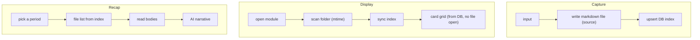
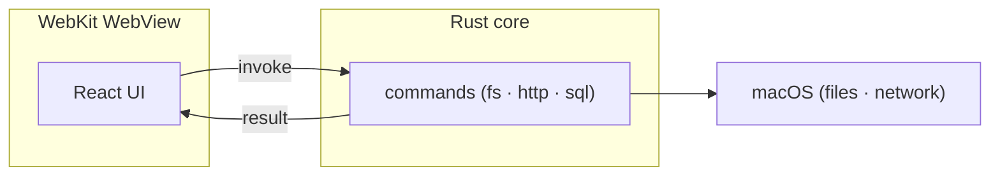

> A retrospective on building a macOS desktop app (Tauri + Rust + React) with an AI agent. It's a story about decisions more than code.


_Modules plug into the sidebar like extensions. The "input log" at the center of this post is one of them._

Working with an AI agent, the suggestions never stop. So a developer's job shifts — from typing code toward deciding which suggestions to take and which to let go. What stayed with me most after a weekend of building this app wasn't the coding. It was that judgment.

For context, this dashboard grew out of an earlier app, [side-project-tracker](https://github.com/MartianLee/side-project-tracker). It started as a small window for viewing the side projects in my `~/workspace`, and turned into today's dashboard as I plugged in one module after another. The code is public.

## How I Directed the AI — Structure First

"Built it with AI" usually sounds like "typed prompts into a chat box." But what I actually did was push every feature through the same procedure.

1. **Brainstorm** — no code gets written until the design is agreed. The agent asks one question at a time, and I narrow the intent as I answer.
2. **Implementation plan** — the agreed design becomes a list of small tasks at the level of "change this file this way and test it this way," saved to `docs/`. The input log came out to 18 tasks.
3. **Per-task execution + two-stage review** — each task goes to a fresh subagent that handles only that task, then gets reviewed twice: first "did it follow the design," then "is the code quality okay."
4. **Wrap-up** — only after every test passes does it get merged.

The key is carving out fresh context each time. So the agent doesn't drag my tangents along, each stage walks in carrying only what it needs. Thanks to this, the design docs and implementation plans piled up alongside the code in `docs/superpowers/`.

## What Should Be the Source of Truth?

The first thing I added was a module to log "the content I read and watched." The reason was simple.

> "I was already keeping notes in Obsidian, but **I kept forgetting to.**"

The first thing I decided wasn't the UI or the schema. It was what should be the source of truth.

The default choice was obvious: make a SQLite table, put the title, rating, and review in columns. Fast and safe. But one thing nagged at me. I'd been writing reviews in Obsidian for years, and the moment the database became the source of truth, those notes would be trapped inside the app and Obsidian would become a dead copy.

So I flipped it.

> "For content logging, what if the **DB keeps only a small slice**, and the details live in a **markdown file so it can be used alongside Obsidian**?"

Markdown files became the source of truth, and the database became an index I could rebuild any time by scanning the folder. That led straight to the idea of using frontmatter as if it were a database row.

```markdown
---
kind: book
title: Sapiens
rating: 4
captured_at: 2026-06-04T12:00:00
note: Strong pull early on # one-line instant memo (mirrored by the DB)
---

(the long review starts here, free markdown…) # the body is review only
```

That one decision organized the whole module.



On conflict, the file always wins. The DB is just a mirror for drawing the card grid without opening files, so even if I wipe it, one scan restores it. The app simply lays a dashboard layer on top of my vault.

There's a synchronization cost, of course. But binding it to "one-way, file-first" instead of two-way consistency made it manageable. "The cache can be thrown away any time" became the invariant.


_The same items live at once as `.md` files inside the Obsidian vault and as cards in the app. The app is just a layer on top. (The UI is in Korean.)_

Looking back, this was less a technical decision than a question of ownership. Should my data stay inside my own tools, or be held hostage by an app?

## Research Before Implementation

The real problem with this module wasn't the tool — it was the habit. So before writing code, I did one thing first.

> "**Research how world-class writers and developers handle their flow of thought**, leave it in docs, and **suggest what's easy to adopt.**"

Zettelkasten, Ryan Holiday, Tiago Forte — different methods, but they converged on one point: capturing and refining are separate acts at separate times. Catch it cheaply, then come back later and rework it in your own words.

| Stage       | What the masters share                              |
| ----------- | --------------------------------------------------- |
| **Capture** | Instant, zero-friction. Format and sorting later.   |
| **Distill** | Later, in your own words.                           |
| **Express** | It only matters if it becomes writing or decisions. |

I took it as-is. I split the one-line instant memo (`note`) from the longer review (`review`), and made capture frictionless. Then I surfaced items that were captured but had no review yet as a "to distill" list.


_Items captured but not yet reviewed surface as "to distill" (정제 대기). It addresses the forgetting problem head-on._

Here I held back the urge to over-build. I could have added a new status field, but a single boolean column for "is the body empty?" was enough.

```sql
-- "to distill" needs no state machine — just this one column
has_review  INTEGER  -- 1 if the body has a long review, else 0
```

Connecting my own problem to a proven method, then dropping it into the cheapest possible implementation — that was the part I enjoyed most.

## The Things I Didn't Build

Removing features turned out to be harder than adding them.

> "Books take a long time to read, so **let's solve that later too.**"

Reading progress for books, real-time file sync, automatic recaps — all tempting, all pushed to the backlog. The fitness card I added later was the same: the source of record stays on one separate server, and the dashboard is a read-only consumer. The moment both sides start writing, you get consistency problems.

That's why every design doc had its own "non-goals (YAGNI)" section. Writing down what you won't build gives you a reference for the next time you waver.

That discipline is also why a new feature dropped cleanly into a single module. Each module only registers itself with the shell, and the shell knows nothing about a module's internals.

```ts
// A new feature = a new module. One line of registration puts it in the sidebar.
registerModule({
  id: 'content-log',
  name: 'Input Log',
  icon: '📥',
  View: ContentLogView,
  order: 30,
})
```

## A Word on the Stack — Why Tauri, Not Electron

A note on the stack, because the next part depends on it. This app is built with [Tauri](https://tauri.app). Where Electron bundles an entire Chromium with every app and balloons to hundreds of MB, Tauri borrows the **WebView already installed on the OS** (WebKit on macOS). The UI is React running inside that WebView, while anything that touches the system — files, HTTP, SQLite — is handled by a **Rust core**.



The result is a small native binary. The catch is one constraint: the WebView can't touch the file system directly — every access goes through a Rust command, and only **within the app's entitlements**. The next bug went off right on that boundary.

## The Bug That Took the Longest

I launched the app, but "to distill" kept coming up empty.

```text
Sync failed: failed to read directory at path:
/Users/dede/Library/Mobile Documents/iCloud~md~obsidian/...
Operation not permitted (os error 1)
```

The vault lived in iCloud, and macOS's access control (TCC) was blocking it.

I was stuck for a while. It turned out that launching the dev server from a sandboxed shell makes it inherit that sandbox, so iCloud access stays blocked for good. It was a permission problem that wouldn't yield to permission settings, so I spent a long time looking in the wrong place.

The fix was to build a proper `.app` and grant it Full Disk Access directly. The grant is keyed to the app's path, so it survives rebuilds.

Only then did years of notes read straight into the app.

> "Oh, it reads now! Amazing."

It was the kind of bug where, without knowing the platform's security model, you could lose days staring only at the code.

## Verify Through the UI, Not Just Unit Tests

Chasing that bug left me with a habit. "Done" isn't a passing unit test — it's **confirming it with my own eyes on the real screen**. After all, the empty sync was a case where every test passed and only the screen was blank. So when I hand work to the agent, I don't say "write tests and stop." I say "launch the app and bring me a screenshot of that screen."

The catch was that a Tauri view is bound to Rust commands (`invoke`), so it won't render in a plain browser. The trick I used: mount just that view in a throwaway HTML file, and swap `window.__TAURI_INTERNALS__`'s `invoke` for a mock that returns dummy data. Then [Playwright](/posts/2026-04-17-playwright-architecture) can bring up that single view and screenshot it. When it's done, the temp file is deleted. Since it uses the real components and real CSS, the pixels match the real app — only the data is dummy.

In fact, the input-log screenshots in this very post were captured that way. Instead of launching and clicking the real app by hand every time, I reproduce and verify the screen view by view.

## Closing Thoughts

The tools have clearly gotten faster. Organizing a design, researching prior art, writing the code — all of it got shorter.

And as it did, deciding the direction grew heavier. What the real problem is, what not to build, which suggestion to let go. That's still a human's job — and I suspect it will be even more so going forward.
