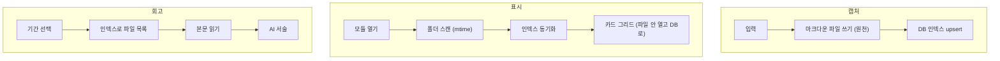
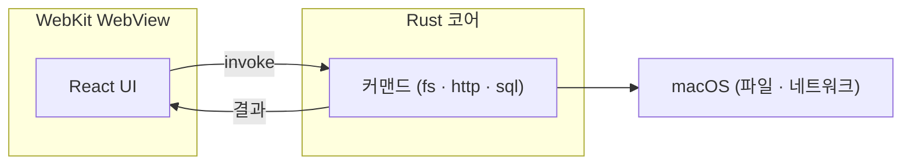

> macOS 데스크톱 앱(Tauri + Rust + React)을 AI 에이전트와 만들면서 남긴 회고입니다. 코드보다 결정에 관한 이야기입니다.


_플러그인처럼 모듈을 사이드바에 끼워 넣는 구조입니다. 이 글의 무대가 된 "인풋 로그"도 그중 하나입니다._

AI 에이전트와 작업하면 제안이 끊이지 않습니다. 그래서 개발자의 일이 코드를 치는 쪽에서, 어떤 제안을 받고 어떤 제안을 흘려보낼지 정하는 쪽으로 옮겨가더군요. 주말 동안 이 앱을 만들며 가장 크게 남은 것도 코딩이 아니라 그 판단 자체였습니다.

참고로 이 대시보드는 예전에 만든 [side-project-tracker](https://github.com/MartianLee/side-project-tracker)에서 출발했습니다. `~/workspace`의 사이드 프로젝트들을 한 창에서 보던 작은 앱이었는데, 거기에 모듈을 하나씩 끼워 넣으며 지금의 대시보드가 됐습니다. 코드는 공개되어 있습니다.

## AI를 어떻게 부렸나 — 구조부터 잡는다

"AI랑 만들었다"는 말은 보통 "채팅창에 시켰다"로 들립니다. 하지만 제가 한 건 기능마다 같은 절차를 통과시키는 일이었습니다.

1. **브레인스토밍** — 설계를 합의하기 전에는 코드를 한 줄도 못 쓰게 막습니다. 에이전트가 한 번에 하나씩 질문하고, 저는 답하며 의도를 좁혀갑니다.
2. **구현 계획** — 합의된 설계를 "이 파일을 이렇게 고치고 이렇게 테스트한다" 수준의 잘게 쪼갠 태스크 목록으로 만들어 `docs/`에 남깁니다. 인풋 로그는 18개 태스크가 나왔습니다.
3. **태스크별 실행 + 2단계 리뷰** — 태스크마다 새 서브에이전트에게 딱 그 태스크만 맡기고, 끝나면 두 번 검토합니다. 먼저 "설계대로 했나", 그다음 "코드 품질이 괜찮나".
4. **마무리** — 테스트가 다 통과하는 걸 확인한 뒤에야 머지합니다.

핵심은 컨텍스트를 매번 새로 추려 준다는 것입니다. 에이전트가 제 잡담까지 끌고 다니지 않도록, 각 단계에 필요한 것만 들려 보냅니다. 이 절차 덕분에 설계 문서와 구현 계획이 코드와 함께 `docs/superpowers/`에 차곡차곡 남았습니다.

## 무엇을 진실의 원천으로 둘 것인가

처음 붙인 것은 "내가 읽고 본 콘텐츠"를 기록하는 모듈이었습니다. 만든 이유는 단순합니다.

> "기존에 obsidian에 적고 있긴 했는데요 **매번 까먹게 되더라구요**"

제일 먼저 정한 것은 화면도 스키마도 아니라, 무엇을 진실의 원천으로 둘 것인가였습니다.

기본 선택지는 분명했습니다. SQLite 테이블을 만들고 제목, 평점, 감상을 컬럼에 넣으면 됩니다. 빠르고 안전한 길이죠. 다만 한 가지가 걸렸습니다. 저는 이미 몇 년째 Obsidian에 감상을 적어왔고, DB를 원천으로 가져가는 순간 그 글들은 앱 안에 갇히고 Obsidian은 죽은 사본이 될 터였습니다.

그래서 방향을 뒤집었습니다.

> "컨텐츠 기록의 경우 **db에는 아주 일부만 유지**하고, 상세 내역은 **markdown file을 만들어서 obsidian과 동시에 사용**할 수 있게 하는 건 어떤가요?"

마크다운 파일을 원천으로 두고, DB는 폴더를 스캔하면 언제든 다시 만들 수 있는 인덱스로 둔 것입니다. 곧이어 frontmatter를 DB 행처럼 쓰자는 생각으로 이어졌습니다.

```markdown
---
kind: book
title: 사피엔스
rating: 4
captured_at: 2026-06-04T12:00:00
note: 초반 흡입력 좋음 # 한 줄 즉석 메모 (DB가 미러링하는 필드)
---

(여기부터 긴 감상, 마크다운 자유…) # 본문은 순수 감상만
```

이 결정 하나가 모듈 전체를 정리해 주었습니다.



충돌이 나면 항상 파일이 이기고, DB는 파일을 열지 않고 카드 그리드를 그리기 위한 미러라 지워도 스캔 한 번으로 복구됩니다. 앱은 제 vault 위에 대시보드 레이어만 얹는 셈이 되었죠.

물론 동기화 비용이 남습니다. 하지만 양방향 일관성 대신 "단방향, 파일 우선"으로 묶으니 감당할 만했습니다. 캐시는 언제 버려도 좋다는 것이 불변식이 되었으니까요.


_같은 항목들이 Obsidian vault 안의 `.md` 파일로도, 앱의 카드 그리드로도 동시에 살아 있습니다. 앱은 그 위에 얹힌 레이어일 뿐입니다._

돌아보면 이건 기술 결정이라기보다 소유권 결정이었습니다. 내 데이터를 내 도구 안에 남길 것인가, 앱에 인질로 내줄 것인가의 문제였죠.

## 구현보다 조사를 먼저

이 모듈의 진짜 문제는 도구가 아니라 습관이었습니다. 그래서 코드를 짜기 전에 한 가지를 먼저 했습니다.

> "컨텐츠 흐름을, **세계적인 작가들, 세계적인 개발자들의 생각 흐름 법을 조사**한 뒤 docs로 남겨 주세요. 그 중 **쉽게 반영할 수 있는 걸** 제안해주세요."

제텔카스텐, 라이언 홀리데이, 티아고 포르테까지, 방식은 달라도 한 곳으로 모였습니다. 기록하는 것과 정제하는 것은 다른 시점의 다른 행위라는 점입니다. 일단 싸게 잡아두고, 시간을 두고 다시 보며 내 말로 다듬는다는 거죠.

| 단계              | 거장들의 공통점                      |
| ----------------- | ------------------------------------ |
| **잡기(Capture)** | 마찰 0으로 즉시. 형식·분류는 나중    |
| **정제(Distill)** | 시간을 두고 다시 보며 _내 말로_ 요약 |
| **표현(Express)** | 모은 게 글·결정으로 나와야 의미      |

이걸 그대로 가져왔습니다. 한 줄짜리 즉석 메모(`note`)와 길게 쓰는 감상(`review`)을 분리하고, 캡처는 마찰 없이 끝내도록 했습니다. 그리고 캡처만 해두고 아직 감상을 안 쓴 항목을 "정제 대기" 목록으로 띄웠습니다.


_캡처만 해두고 아직 감상을 안 쓴 항목이 "정제 대기"로 떠오릅니다. 까먹는다는 문제를 정면으로 겨냥한 장치입니다._

여기서 욕심을 한 번 참았습니다. 진행 상태 같은 새 필드를 만들 수도 있었지만, 본문이 비었는지 여부를 담는 불린 컬럼 하나면 충분했습니다.

```sql
-- '정제 대기'는 새 상태 머신 없이 이 한 컬럼으로 끝난다
has_review  INTEGER  -- 본문에 긴 감상이 있으면 1, 없으면 0
```

자기 문제를 검증된 방식에 연결하고, 가장 값싼 구현으로 풀어내는 것. 이 과정이 개인적으로 가장 만족스러웠습니다.

## 만들지 않은 것들

기능을 더하는 것보다 빼는 결정이 더 어려웠습니다.

> "책같은 경우 오래 읽는데, **이 또한 나중에 해결하시죠**"

책의 진행 상태, 실시간 파일 동기화, 자동 회고는 모두 매력적이었지만 백로그로 미뤘습니다. 나중에 붙인 운동 기록 카드도 마찬가지로, 데이터의 원천은 별도 서버 한 곳에 두고 대시보드는 읽기만 하는 소비자로 한정했습니다. 양쪽에서 쓰기 시작하면 일관성 문제가 생기니까요.

설계 문서마다 "비목표(YAGNI)"를 따로 적어둔 것도 이래서였습니다. 무엇을 안 만들지를 적어두면, 다음에 흔들릴 때 기준이 됩니다.

새 기능이 모듈 하나로 깔끔히 떨어진 것도 이 규율 덕분이었습니다. 각 모듈은 자기 자신을 셸에 등록만 하고, 셸은 모듈 내부를 모릅니다.

```ts
// 새 기능 = 새 모듈. 셸에 한 줄 등록하면 사이드바에 나타난다.
registerModule({
  id: 'content-log',
  name: '인풋 로그',
  icon: '📥',
  View: ContentLogView,
  order: 30,
})
```

## 잠깐, 스택 이야기 — 왜 Electron이 아니라 Tauri였나

여기서 스택을 짚고 가야 다음 이야기가 이어집니다. 이 앱은 [Tauri](https://tauri.app)로 만들었습니다. Electron이 앱마다 크로미움을 통째로 끼워 수백 MB가 되는 것과 달리, Tauri는 **OS에 이미 깔린 WebView(맥에서는 WebKit)**를 빌려 씁니다. UI는 그 WebView 안에서 도는 React이고, 파일·HTTP·SQLite처럼 시스템에 닿는 일은 **Rust 코어**가 맡습니다.



결과는 가벼운 네이티브 바이너리입니다. 대신 한 가지 제약이 생깁니다. WebView는 파일 시스템에 직접 손대지 못하고, 모든 접근이 Rust 커맨드를 거쳐 **앱의 권한(entitlement) 안에서만** 일어납니다. 다음 버그가 바로 그 경계에서 터졌습니다.

## 가장 오래 붙잡은 버그

앱을 띄웠는데 "정제 대기"가 계속 비어 있었습니다.

```text
동기화 실패: failed to read directory at path:
/Users/dede/Library/Mobile Documents/iCloud~md~obsidian/...
Operation not permitted (os error 1)
```

vault가 iCloud에 있어서 macOS의 접근 권한(TCC)이 막고 있었습니다.

한참 헤맸습니다. 알고 보니 개발 서버를 샌드박스 셸에서 띄우면 그 샌드박스를 상속해서 iCloud 접근이 영영 막히더군요. 권한 문제인데 권한 설정으로는 풀리지 않으니 한동안 엉뚱한 곳을 봤습니다.

해결은 앱을 정식 `.app`으로 빌드한 뒤 전체 디스크 접근 권한을 직접 준 것이었습니다. 권한은 앱 경로 기준이라 다시 빌드해도 유지됩니다.

그제야 몇 년치 노트가 앱 안에서 그대로 읽혔습니다.

> "오 잘 읽힙니다! 대박"

플랫폼의 보안 모델을 모르면 코드만 들여다보며 며칠을 보낼 수 있는 종류의 버그였습니다.

## 단위 테스트가 아니라 UI로 검증한다

이 버그를 잡으면서 한 가지 습관이 생겼습니다. "다 됐다"는 단위 테스트 통과가 아니라 **실제 화면에서 눈으로 확인하는 것**이라는 점입니다. 동기화가 비어 있던 것도 테스트는 다 통과하는데 화면만 비어 있던 상황이었으니까요. 그래서 에이전트에게 작업을 시킬 때 "테스트 짜고 끝"이 아니라 "앱을 띄워서 그 화면을 스크린샷으로 가져와"라고 지시했습니다.

문제는 Tauri 뷰가 Rust 커맨드(`invoke`)에 묶여 있어 그냥 브라우저로는 안 뜬다는 것이었습니다. 그래서 쓴 방법은 이렇습니다 — 임시 HTML 하나에 그 뷰만 마운트하고, `window.__TAURI_INTERNALS__`의 `invoke`를 더미 데이터를 돌려주는 목(mock)으로 갈아끼웁니다. 그러면 [Playwright](/ko/posts/2026-04-17-playwright-architecture)로 그 뷰 하나만 띄워 스크린샷을 찍을 수 있습니다. 끝나면 임시 파일은 지웁니다. 실제 컴포넌트와 실제 CSS를 그대로 쓰니 픽셀은 진짜 앱과 같고, 데이터만 더미입니다.

사실 이 글에 실린 인풋 로그 스크린샷도 그렇게 찍은 것입니다. 진짜 앱을 매번 손으로 띄워 클릭하지 않아도, 뷰 단위로 화면을 재현해 검증하는 셈입니다.

## 남은 생각

도구는 확실히 빨라졌습니다. 설계를 정리하고, 선례를 조사하고, 코드를 짜는 일이 모두 짧아졌습니다.

그만큼 방향을 정하는 일의 비중이 커졌습니다. 무엇이 진짜 문제인지, 무엇을 안 만들지, 어떤 제안을 흘려보낼지. 이건 여전히 사람의 몫이고, 앞으로 더 그럴 것 같습니다.
