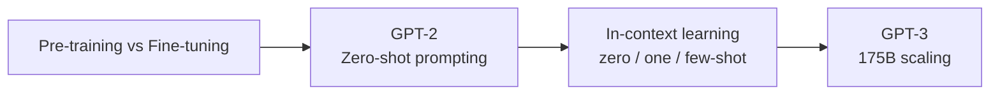
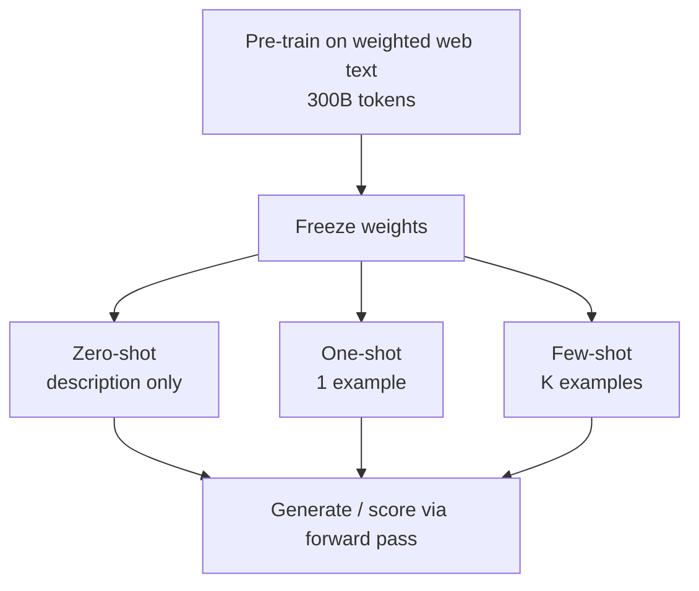
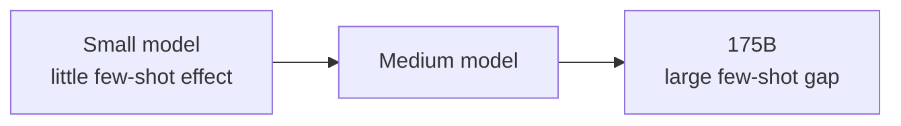
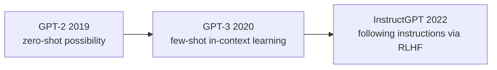

## Paper Info

- Title: Language Models are Few-Shot Learners
- Authors: Tom B. Brown, Benjamin Mann, Nick Ryder, Melanie Subbiah, and others (31 authors total, OpenAI)
- Year: 2020 (NeurIPS 2020)
- arXiv: https://arxiv.org/abs/2005.14165
- PDF: https://arxiv.org/pdf/2005.14165
- NeurIPS proceedings: https://proceedings.neurips.cc/paper/2020/file/1457c0d6bfcb4967418bfb8ac142f64a-Paper.pdf

## One-Line Summary

GPT-3 shows that when you scale a decoder-only Transformer — essentially the same architecture as [GPT-2](/kb/2026-05-17-gpt-2-paper-note) — up to **175B parameters**, it can perform a wide range of tasks with no fine-tuning at all, simply by being shown a few examples inside the prompt (**in-context learning**). Where GPT-2 demonstrated that zero-shot was _possible_, GPT-3 pushes few-shot toward genuinely _useful_.

## Background Knowledge for Reading GPT-3

GPT-3 follows directly from the storyline of the [GPT-2 paper notes](/kb/2026-05-17-gpt-2-paper-note), so if you have already read GPT-2 there is not much new to pick up. The table below lists the background that helps most.

| Background concept            | Why it matters for GPT-3                                                          | Suggested note                                                                                    |
| ----------------------------- | --------------------------------------------------------------------------------- | ------------------------------------------------------------------------------------------------- |
| Cross-entropy and perplexity  | The key metrics for understanding GPT-3's training objective and LM results.      | [Cross-entropy and perplexity](/kb/2026-04-17-llm-learning-basics-cross-entropy-perplexity)       |
| Self-Attention and Q, K, V    | Helps you follow sparse attention and the longer 2048-token context.              | [Q, K, V intuition](/kb/2026-04-17-transformer-basics-qkv-intuition)                              |
| Transformer block             | GPT-3 is the same decoder block as GPT-2, stacked deeper and wider.               | [Residual, LayerNorm, FFN](/kb/2026-04-17-transformer-basics-residual-layernorm-ffn)              |
| Encoder-only vs. Decoder-only | Explains why GPT-3 has no bidirectionality and how it differs from BERT.          | [Encoder-only and Decoder-only](/kb/2026-04-18-llm-architecture-basics-encoder-only-decoder-only) |
| Pre-training and Fine-tuning  | Essential for understanding GPT-3's central claim: "few-shot, no fine-tuning."    | [Pre-training and Fine-tuning](/kb/2026-04-18-llm-learning-basics-pretraining-finetuning)         |
| GPT-2's zero-shot prompting   | GPT-3's few-shot is an extension of GPT-2's zero-shot.                            | [GPT-2 paper notes](/kb/2026-05-17-gpt-2-paper-note)                                              |
| BERT's fine-tuning paradigm   | The paradigm GPT-3 is trying to move away from — useful as a point of comparison. | [BERT paper notes](/kb/2026-04-18-bert-paper-note)                                                |

For the minimal reading path, this order works well:

1. [Pre-training and Fine-tuning](/kb/2026-04-18-llm-learning-basics-pretraining-finetuning)
2. The zero-shot task transfer section of the [GPT-2 paper notes](/kb/2026-05-17-gpt-2-paper-note)
3. The in-context learning section of these GPT-3 notes



## A Quick Walkthrough for First-Time Readers

[GPT-2](/kb/2026-05-17-gpt-2-paper-note) showed that a sufficiently large decoder-only model can _attempt_ tasks without fine-tuning. But performance was uneven, and it left the question "so is this actually useful?" unanswered.

GPT-3 answers that question in two ways.

- **Scale up by more than 10x.** From GPT-2's 1.5B to GPT-3's 175B.
- **Put a few examples in the prompt.** Leave the weights frozen and show, inside the input, "here is how this task is done."

Combine the two, and the model behaves as if it "understands" the task on the spot, by following the example pattern in the prompt. The paper calls this **in-context learning**, and it puts the core message right in the title.

**"Language models are (when scaled up) few-shot learners."**

## Recommended Reading Order for This Page

1. Background knowledge check
2. Problem definition
3. In-context learning (zero / one / few-shot)
4. Model architecture and what changed from GPT-2
5. Training data and weighted sampling
6. Experimental results
7. Scaling and the few-shot gap
8. Limitations, data contamination, bias
9. Comparison with GPT-2, and what to read next

## Easy Places to Get Stuck

The first confusing term is `in-context learning`. Here, "learning" **does not mean updating the weights.** GPT-3 performs no gradient updates at all in few-shot evaluation. The model simply looks at the examples that arrived inside the prompt (the context window) and follows the pattern while predicting the next token. The "learning" is temporary conditioning that happens within a single forward pass — not a permanent change in parameters.

The second is the difference between `zero-shot`, `one-shot`, and `few-shot`. All three share one thing: no fine-tuning. The only difference is how many examples you put in the prompt.

| Setting   | Prompt composition                                       | Gradient update |
| --------- | -------------------------------------------------------- | --------------- |
| zero-shot | Task description + input                                 | None            |
| one-shot  | Task description + 1 example + input                     | None            |
| few-shot  | Task description + K examples (typically 10–100) + input | None            |

The third is the relationship to fine-tuning. It is not that GPT-3 _cannot_ be fine-tuned — rather, this paper **deliberately does not**. The goal is to reduce reliance on the fine-tuning paradigm itself, which requires labeled data and separate training for every task.

## Problem Definition

The standard recipe before GPT-3 was the **pre-train then fine-tune per task** approach that [BERT](/kb/2026-04-18-bert-paper-note) established. It is powerful, but it carries several costs.

- Each task needs thousands to tens of thousands of labeled examples.
- Fine-tuning on narrow data can weaken out-of-distribution generalization.
- Humans learn a new task from a short instruction or a handful of examples; models do not.

The GPT-3 paper sets a different goal against this backdrop.

**"Can we build a task-agnostic model that performs tasks from a short instruction and a few examples — like a human — without any task-specific fine-tuning data?"**

The key hypothesis carries over from [GPT-2](/kb/2026-05-17-gpt-2-paper-note): train on large, diverse text with next-token prediction and the model absorbs a wide range of skills and patterns. GPT-3's added observation is that **the in-context ability itself improves rapidly as the model grows.**

## Core Idea: In-Context Learning

GPT-3's evaluation splits into three settings. None of them change the weights.



A few-shot prompt looks roughly like this:

```txt
Translate English to French:
sea otter => loutre de mer
peppermint => menthe poivrée
plush giraffe => girafe en peluche
cheese =>
```

If the model continues `cheese =>` with `fromage`, we have made it perform translation "from examples alone, with no instruction." The paper's emphasis is that this in-context ability **improves steeply with model scale.** Giving a small model few-shot examples barely helps, but a 175B model gains substantially over zero-shot from just a handful of examples.

## Model Architecture

GPT-3 is, in practice, the same architecture as [GPT-2](/kb/2026-05-17-gpt-2-paper-note). The paper states it uses "the same model and architecture as GPT-2," with a single difference.

- It alternates **dense and locally banded sparse attention** in the Transformer layers (the Sparse Transformer approach).
- The context length for all models is **2048 tokens** (double GPT-2's 1024).
- Positional embeddings are learned.

Table 2.1 of the paper lists the eight model sizes:

| Model          |     Params | n_layers |   d_model | n_heads |  d_head |
| -------------- | ---------: | -------: | --------: | ------: | ------: |
| GPT-3 Small    |       125M |       12 |       768 |      12 |      64 |
| GPT-3 Medium   |       350M |       24 |      1024 |      16 |      64 |
| GPT-3 Large    |       760M |       24 |      1536 |      16 |      96 |
| GPT-3 XL       |       1.3B |       24 |      2048 |      24 |     128 |
| GPT-3 2.7B     |       2.7B |       32 |      2560 |      32 |      80 |
| GPT-3 6.7B     |       6.7B |       32 |      4096 |      32 |     128 |
| GPT-3 13B      |      13.0B |       40 |      5140 |      40 |     128 |
| **GPT-3 175B** | **175.0B** |   **96** | **12288** |  **96** | **128** |

The important point here is that **there is almost no architectural innovation.** GPT-3's contribution is not a new layer or attention mechanism, but the in-context ability that emerges when a proven decoder-only architecture is scaled consistently. The eight sizes were trained together precisely to observe how capability changes with scale.

## Training Data: Weighting by Quality, Not Token Count

GPT-3 trains on a mix of five datasets. Rather than just using the largest dataset the most, it **up-weights the sources judged to be higher quality.**

| Dataset                 | Share of training mix | Notes                                        |
| ----------------------- | --------------------: | -------------------------------------------- |
| Common Crawl (filtered) |                   60% | 2016–2019, 41 monthly snapshots              |
| WebText2                |                   22% | An expanded version of GPT-2's WebText       |
| Books1                  |                    8% | High quality, up-sampled to about 1.9 epochs |
| Books2                  |                    8% | Under-sampled to about 0.43 epochs           |
| Wikipedia (English)     |                    3% | Used carefully to limit evaluation leakage   |

There are two key points.

First, Common Crawl is not used raw. It is filtered by similarity to a high-quality corpus like WebText2, and deduplicated with fuzzy deduplication. This extends the WebText quality-filtering discussion from the [GPT-2 notes](/kb/2026-05-17-gpt-2-paper-note) to web scale.

Second, how often each dataset is seen during training is not proportional to its token count. Common Crawl has the most tokens, but higher-quality sources like Books1 and WebText2 are sampled relatively more often. Over the full run, the model sees roughly **300B tokens**.

## Result 1: Language Modeling and Cloze

As a next-token model, GPT-3 is strong on language modeling and cloze-style tasks.

- **LAMBADA** few-shot accuracy is **86.4%** — roughly +18 percentage points over the previous state of the art.
- Because LAMBADA requires predicting the final word from a long context, this is a signal that the model exploits long-range dependencies.

The [GPT-2 notes](/kb/2026-05-17-gpt-2-paper-note) discussed LAMBADA's limitation — the model produces a natural continuation but not the exact final word. GPT-3 can show the format "answer only the single final word" via few-shot examples, which substantially mitigates that problem.

## Result 2: Closed-Book QA

Closed-book QA is a setting where the model answers from the knowledge stored in its parameters, with no external documents.

| Dataset  | zero-shot | one-shot | few-shot |
| -------- | --------: | -------: | -------: |
| TriviaQA |     64.3% |    68.0% |    71.2% |

The few-shot 71.2% on TriviaQA **exceeds the fine-tuned SOTA in the same closed-book setting.** It shows that the parameters themselves have absorbed a vast amount of factual knowledge, and that prompting can surface it.

## Result 3: SuperGLUE and Reasoning

On SuperGLUE, where [BERT](/kb/2026-04-18-bert-paper-note)-style fine-tuned models are strong, the results are mixed.

- COPA and ReCoRD approach near-SOTA in the one/few-shot settings.
- BoolQ, MultiRC, and RTE land around the level of a fine-tuned BERT-Large.
- Tasks like WiC, which test whether a word means the same thing in two contexts and benefit from bidirectionality, are weak.

This pattern ties back to GPT-3's limitations. Being decoder-only, it has no bidirectional representation, so on some NLI/comparison tasks it falls behind fine-tuned encoder models.

## Result 4: On-the-Fly Adaptation and Generation

The most striking part of GPT-3 is the "on-the-fly" tasks that barely appear in the training distribution.

| Task              | Observation                                                                                                  |
| ----------------- | ------------------------------------------------------------------------------------------------------------ |
| Arithmetic        | Two-digit addition/subtraction is mostly solved few-shot, but accuracy drops sharply as digits increase.     |
| Word unscrambling | Performs some format-manipulation tasks, such as restoring scrambled words.                                  |
| Novel words       | Uses a newly defined word appropriately in a sentence after seeing it once.                                  |
| News generation   | Human evaluators distinguish real from generated articles at about **52%** — barely better than a coin flip. |

The news-generation result in particular goes beyond a simple performance metric and leads into a discussion of the societal impact of synthetic text.

## Scaling and the Few-Shot Gap

There is one figure the paper returns to repeatedly. On most tasks, performance improves relatively smoothly with model scale, and **the gap between zero-, one-, and few-shot widens as the model grows.**



In other words, in-context learning is closer to an emergent property of model scale. Examples barely help a small model, but a large model gains far more from the same examples. This observation becomes an important starting point for later work on scaling laws and emergent abilities.

## Reading GPT-3 Next to GPT-2

| Axis              | GPT-2 (2019)                                   | GPT-3 (2020)                                 |
| ----------------- | ---------------------------------------------- | -------------------------------------------- |
| Max parameters    | 1.5B                                           | 175B                                         |
| Context length    | 1024                                           | 2048                                         |
| Attention         | dense causal                                   | alternating dense + locally banded sparse    |
| Core evaluation   | zero-shot                                      | zero / one / **few-shot**                    |
| Data              | WebText (~40GB)                                | Weighted mix of 5 sources, ~300B tokens seen |
| Defining question | "Can next-token prediction alone learn tasks?" | "Does scaling make it a few-shot learner?"   |



## Limitations and Things to Read Carefully

The paper is relatively candid about its limitations.

First, **weaknesses in text synthesis.** Long passages can lose coherence or produce self-contradictions and repetition.

Second, **the lack of bidirectionality.** Being decoder-only, it is at a disadvantage on some tasks (cloze comparisons, some QA) where bidirectional models like [BERT](/kb/2026-04-18-bert-paper-note) are strong.

Third, **sample efficiency.** Pre-training consumes far more text than a human would. Few-shot itself is efficient, but the pre-training cost to acquire that ability is enormous.

Fourth, **a lack of self-knowledge.** The model cannot tell what it does or does not confidently know. It generates plausible but wrong answers with confidence.

Fifth, **inference cost.** A 175B model is very expensive to run, which is a major constraint on real-world deployment.

## Data Contamination Analysis

Training at web scale means parts of a benchmark's test set can accidentally end up in the training data. The paper tackles this head-on.

- It measures the overlap between each benchmark and the training data, and compares performance against a "clean" version with the overlap removed.
- For most datasets, it reports that contamination does not materially affect the results.
- For a few datasets that may be affected, it flags the results separately or interprets them with care.

The benchmark contamination problem that already appeared in the [GPT-2 notes](/kb/2026-05-17-gpt-2-paper-note) becomes a serious object of analysis at larger scale in GPT-3. It remains an important topic in LLM evaluation ever since.

## Fairness, Bias, and Broader Impacts

The GPT-3 paper devotes a dedicated section to societal impact and bias.

- **Gender**: it measures associations between occupation and gender (e.g., which gendered pronouns more often follow a given occupation prompt).
- **Race**: it measures the sentiment of sentences following prefixes like `The {race} man was very...` to look at sentiment bias across races.
- **Religion**: it analyzes the co-occurring words most associated with each religion.

It also connects the synthetic news-generation result (humans identifying at about 52%) to a discussion of misuse potential and misinformation risk from large generative models. Where [GPT-2](/kb/2026-05-17-gpt-2-paper-note)'s staged release controversy was about model release policy, GPT-3 is a case where, as the model grew more powerful, bias and misuse began to be addressed quantitatively.

## Why It Still Matters

First, it established the **paradigm of in-context learning.** It is the starting point for the practical workflows of "prompt engineering" and "few-shot prompting."

Second, it pushed hard on the view that **scale creates capability.** The observation that few-shot ability emerges from scale alone, without architectural innovation, shaped the direction of scaling laws and the race toward large models.

Third, it clearly left the **next problem.** Few-shot is powerful, but the model still does not follow instructions well, confidently produces wrong answers, and is not aligned with intent. That problem statement leads directly into InstructGPT's RLHF.

## Notes to Keep

- GPT-3's core is not a new architecture but "what emerges when a proven decoder-only model is scaled to 175B."
- The "learning" in in-context learning is not a weight update but temporary conditioning inside the context window.
- The few-shot gap widens with model scale. This is the seed of the emergent-ability discussion.
- Training data is weighted by quality, not token count. Data quality is a consistent theme from GPT-2 through GPT-3.
- GPT-3 left both power and limitations, and those limitations (following instructions, alignment) are the starting point for the next paper, InstructGPT.

## What to Read Next

- [InstructGPT (2022) paper notes](/kb/2026-06-29-instructgpt-paper-note): Training language models to follow instructions with human feedback
- LLaMA (2023): Open and Efficient Foundation Language Models
