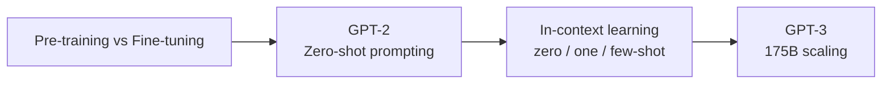
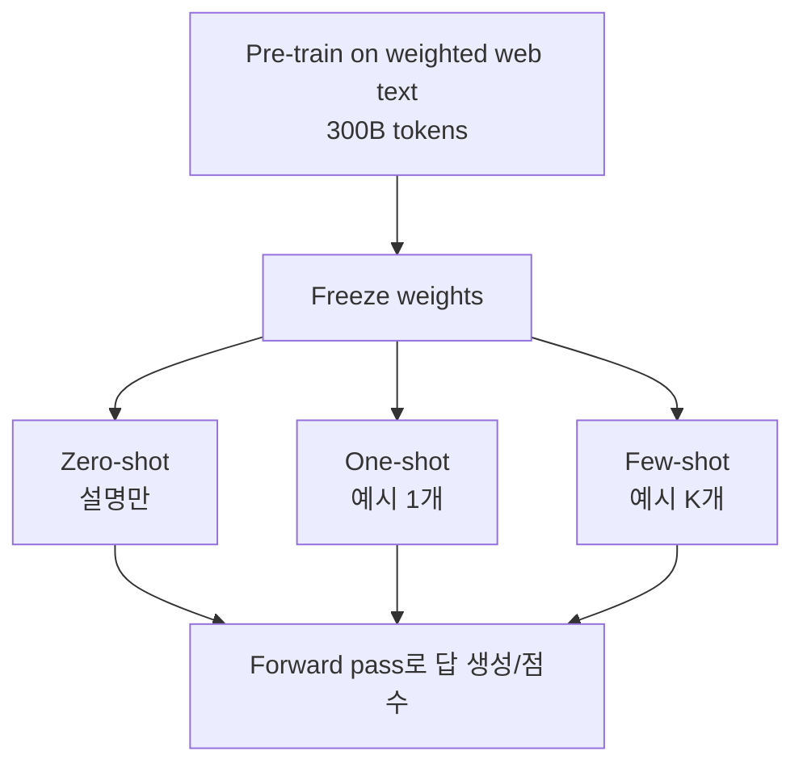
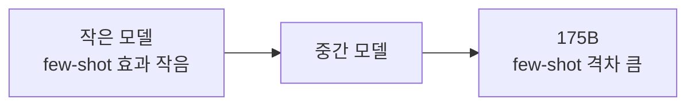
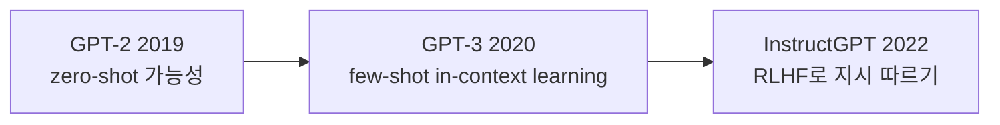

## Paper Info

- Title: Language Models are Few-Shot Learners
- Authors: Tom B. Brown, Benjamin Mann, Nick Ryder, Melanie Subbiah 외 (총 31명, OpenAI)
- Year: 2020 (NeurIPS 2020)
- arXiv: https://arxiv.org/abs/2005.14165
- PDF: https://arxiv.org/pdf/2005.14165
- NeurIPS proceedings: https://proceedings.neurips.cc/paper/2020/file/1457c0d6bfcb4967418bfb8ac142f64a-Paper.pdf

## 한 줄 요약

GPT-3는 [GPT-2](/kb/2026-05-17-gpt-2-paper-note)와 거의 같은 decoder-only Transformer를 **175B 파라미터**까지 키우면,
별도 fine-tuning 없이 **prompt 안에 예시 몇 개를 넣는 것(in-context learning)** 만으로 다양한 태스크를 수행한다는 것을 보여준 논문입니다.
GPT-2가 보여준 "zero-shot 가능성"을, GPT-3는 **few-shot으로 실용 영역까지** 밀어붙입니다.

## GPT-3를 이해하기 위한 기반 지식

GPT-3는 [GPT-2 논문 노트](/kb/2026-05-17-gpt-2-paper-note)의 흐름을 그대로 이어받습니다.
그래서 GPT-2를 먼저 읽었다면 새로 잡아야 할 개념은 많지 않습니다. 아래 표는 특히 도움이 되는 배경입니다.

| 기반 지식                   | GPT-3에서 필요한 이유                                                     | 먼저 볼 노트                                                                                    |
| --------------------------- | ------------------------------------------------------------------------- | ----------------------------------------------------------------------------------------------- |
| cross-entropy와 perplexity  | GPT-3의 학습 목표와 language modeling 결과를 이해하는 핵심 지표입니다.    | [cross-entropy와 perplexity](/kb/2026-04-17-llm-learning-basics-cross-entropy-perplexity)       |
| Self-Attention과 Q, K, V    | sparse attention과 긴 context(2048) 처리를 이해하는 데 도움이 됩니다.     | [Q, K, V 직관](/kb/2026-04-17-transformer-basics-qkv-intuition)                                 |
| Transformer block           | GPT-3는 GPT-2와 같은 decoder block을 더 깊고 넓게 쌓은 모델입니다.        | [Residual, LayerNorm, FFN](/kb/2026-04-17-transformer-basics-residual-layernorm-ffn)            |
| Encoder-only와 Decoder-only | GPT-3가 왜 양방향성이 없는지, BERT와 어떻게 다른지 이해할 수 있습니다.    | [Encoder-only와 Decoder-only](/kb/2026-04-18-llm-architecture-basics-encoder-only-decoder-only) |
| Pre-training과 Fine-tuning  | GPT-3의 핵심 주장인 "fine-tuning 없이 few-shot"을 이해하는 데 필수입니다. | [Pre-training과 Fine-tuning](/kb/2026-04-18-llm-learning-basics-pretraining-finetuning)         |
| GPT-2의 zero-shot prompting | GPT-3의 few-shot은 GPT-2의 zero-shot을 확장한 것입니다.                   | [GPT-2 논문 노트](/kb/2026-05-17-gpt-2-paper-note)                                              |
| BERT의 fine-tuning 패러다임 | GPT-3가 무엇을 대체하려 하는지 비교 대상으로 필요합니다.                  | [BERT 논문 노트](/kb/2026-04-18-bert-paper-note)                                                |

최소 경로만 고르면 다음 순서가 좋습니다.

1. [Pre-training과 Fine-tuning](/kb/2026-04-18-llm-learning-basics-pretraining-finetuning)
2. [GPT-2 논문 노트](/kb/2026-05-17-gpt-2-paper-note)의 zero-shot task transfer 섹션
3. 이 GPT-3 논문 노트의 in-context learning 섹션



## 처음 읽는 사람을 위한 빠른 해설

[GPT-2](/kb/2026-05-17-gpt-2-paper-note)는 "충분히 큰 decoder-only 모델은 fine-tuning 없이도 태스크를 시도할 수 있다"는 가능성을 보였습니다.
하지만 성능은 들쭉날쭉했고, "그래서 실용적이냐"는 질문에는 답하지 못했습니다.

GPT-3는 이 질문에 두 가지로 답합니다.

- **규모를 10배 이상 키웁니다.** GPT-2의 1.5B에서 GPT-3의 175B로 커집니다.
- **prompt 안에 예시를 몇 개 넣습니다.** 가중치는 그대로 두고, 입력 안에서 "이렇게 푸는 거야"를 보여줍니다.

이 두 가지를 합치면, 모델은 prompt에 담긴 예시 패턴을 보고 그 자리에서 태스크를 "이해"하는 것처럼 행동합니다.
논문은 이를 **in-context learning**이라고 부르고, 핵심 메시지를 제목에 그대로 담았습니다.

**"언어 모델은 (규모가 커지면) few-shot learner입니다."**

## 이 페이지를 읽는 추천 순서

1. 기반 지식 체크
2. 문제 정의
3. In-context learning (zero / one / few-shot)
4. 모델 구조와 GPT-2 대비 변화
5. 학습 데이터와 가중 샘플링
6. 실험 결과
7. Scaling과 few-shot gap
8. 한계, data contamination, bias
9. GPT-2와 비교, 다음 논문

## 읽다가 막히기 쉬운 지점

첫 번째로 헷갈리는 표현은 `in-context learning`입니다.
여기서 "learning"은 **가중치를 갱신한다는 뜻이 아닙니다.** GPT-3는 few-shot 평가에서 gradient update를 전혀 하지 않습니다.
모델은 단지 prompt(context window) 안에 들어온 예시들을 보고, 다음 토큰을 예측하는 과정에서 패턴을 따라 할 뿐입니다.
즉 "학습"은 forward pass 안에서 일시적으로 일어나는 조건화이지, 영구적인 parameter 변화가 아닙니다.

두 번째는 `zero-shot`, `one-shot`, `few-shot`의 차이입니다. 셋 다 fine-tuning이 없다는 점은 같습니다. 차이는 prompt에 넣는 예시 개수뿐입니다.

| 설정      | prompt 구성                                | gradient update |
| --------- | ------------------------------------------ | --------------- |
| zero-shot | 태스크 설명 + 입력                         | 없음            |
| one-shot  | 태스크 설명 + 예시 1개 + 입력              | 없음            |
| few-shot  | 태스크 설명 + 예시 K개(보통 10~100) + 입력 | 없음            |

세 번째는 fine-tuning과의 관계입니다. GPT-3는 fine-tuning을 "할 수 없다"가 아니라, **이 논문에서는 의도적으로 하지 않는다**는 입장입니다.
태스크마다 라벨 데이터와 별도 학습이 필요한 fine-tuning 패러다임 자체를 줄이는 것이 목표이기 때문입니다.

## 문제 정의

GPT-3 이전의 표준 레시피는 [BERT](/kb/2026-04-18-bert-paper-note)가 정착시킨 **pre-train 후 task별 fine-tuning**이었습니다.
이 방식은 강력하지만 몇 가지 비용이 있습니다.

- 태스크마다 수천~수만 개의 라벨 데이터가 필요합니다.
- 좁은 데이터에 fine-tuning하면 분포 밖(out-of-distribution) 일반화가 약해질 수 있습니다.
- 사람은 새 태스크를 짧은 지시나 몇 개 예시만으로 배우는데, 모델은 그렇지 못합니다.

GPT-3 논문은 이 흐름에 다른 목표를 제시합니다.

**"태스크별 fine-tuning 데이터 없이, 사람처럼 짧은 지시와 몇 개 예시만으로 태스크를 수행하는 task-agnostic 모델을 만들 수 있는가?"**

이때 핵심 가설은 [GPT-2](/kb/2026-05-17-gpt-2-paper-note)에서 이어집니다.
충분히 크고 다양한 텍스트로 next-token 학습을 하면, 모델은 다양한 능력과 패턴 인식을 흡수합니다.
그리고 **규모가 커질수록 prompt 안의 예시를 활용하는 in-context 능력 자체가 빠르게 좋아진다**는 것이 GPT-3의 관찰입니다.

## 핵심 아이디어: In-Context Learning

GPT-3의 평가 방식은 세 가지 setting으로 나뉩니다. 어느 것도 가중치를 바꾸지 않습니다.



few-shot 프롬프트는 대략 이런 모습입니다.

```txt
Translate English to French:
sea otter => loutre de mer
peppermint => menthe poivrée
plush giraffe => girafe en peluche
cheese =>
```

마지막 `cheese =>` 뒤에 모델이 `fromage`를 이어 쓰면, 우리는 번역 태스크를 "지시 없이 예시만으로" 수행시킨 셈입니다.
논문이 강조하는 점은, 이 in-context 능력이 **모델 규모와 함께 가파르게 좋아진다**는 것입니다.
작은 모델은 few-shot 예시를 줘도 별 효과가 없지만, 175B 모델은 예시 몇 개만으로 zero-shot 대비 큰 폭으로 성능이 오릅니다.

## 모델 구조

GPT-3는 [GPT-2](/kb/2026-05-17-gpt-2-paper-note)와 사실상 같은 구조입니다.
논문도 "GPT-2와 동일한 모델과 구조를 사용했다"고 밝히며, 한 가지 차이만 둡니다.

- Transformer 층에서 **dense attention과 locally banded sparse attention을 번갈아** 사용합니다 (Sparse Transformer 방식).
- 모든 모델의 context 길이는 **2048 tokens**입니다 (GPT-2의 1024에서 2배).
- positional embedding은 learned 방식입니다.

논문 Table 2.1의 8개 모델 크기는 다음과 같습니다.

| 모델 표기      |     Params | n_layers |   d_model | n_heads |  d_head |
| -------------- | ---------: | -------: | --------: | ------: | ------: |
| GPT-3 Small    |       125M |       12 |       768 |      12 |      64 |
| GPT-3 Medium   |       350M |       24 |      1024 |      16 |      64 |
| GPT-3 Large    |       760M |       24 |      1536 |      16 |      96 |
| GPT-3 XL       |       1.3B |       24 |      2048 |      24 |     128 |
| GPT-3 2.7B     |       2.7B |       32 |      2560 |      32 |      80 |
| GPT-3 6.7B     |       6.7B |       32 |      4096 |      32 |     128 |
| GPT-3 13B      |      13.0B |       40 |      5140 |      40 |     128 |
| **GPT-3 175B** | **175.0B** |   **96** | **12288** |  **96** | **128** |

여기서 중요한 점은, **구조 혁신이 거의 없다**는 것입니다.
GPT-3의 핵심은 새로운 layer나 attention 메커니즘이 아니라, 검증된 decoder-only 구조를 일관되게 키웠을 때 나타나는 in-context 능력입니다.
8개 크기를 함께 학습한 이유도, 능력이 규모에 따라 어떻게 변하는지(scaling) 관찰하기 위함입니다.

## 학습 데이터: 토큰 수가 아니라 품질로 가중치를 줍니다

GPT-3는 다섯 개 데이터셋을 섞어 학습합니다. 단순히 큰 데이터셋을 많이 쓰는 것이 아니라, **품질이 높다고 판단한 소스를 up-weight**합니다.

| Dataset               | 학습 mix 비중 | 비고                                |
| --------------------- | ------------: | ----------------------------------- |
| Common Crawl (필터링) |           60% | 2016~2019, 41개 monthly snapshot    |
| WebText2              |           22% | GPT-2 WebText의 확장판              |
| Books1                |            8% | 고품질이라 약 1.9 epoch up-sample   |
| Books2                |            8% | 약 0.43 epoch로 under-sample        |
| Wikipedia (영문)      |            3% | 평가 누출을 줄이기 위해 신중히 사용 |

핵심 포인트가 두 가지 있습니다.

첫째, Common Crawl을 그냥 쓰지 않습니다. WebText2 같은 고품질 corpus와의 유사도로 필터링하고, fuzzy deduplication으로 중복을 제거합니다.
이는 [GPT-2 노트](/kb/2026-05-17-gpt-2-paper-note)의 WebText 품질 필터링 논의를 웹 규모로 확장한 것입니다.

둘째, 학습 중 각 데이터셋을 본 비중은 토큰 수에 비례하지 않습니다.
Common Crawl은 토큰이 가장 많지만, 품질이 높은 Books1이나 WebText2를 상대적으로 더 자주 샘플링합니다.
모델은 전체 학습에서 약 **300B tokens**를 봅니다.

## 실험 결과 1: Language modeling과 cloze

GPT-3는 next-token 모델답게 language modeling과 빈칸 채우기 계열에서 강합니다.

- **LAMBADA** few-shot 정확도 **86.4%** — 이전 SOTA 대비 약 +18%p입니다.
- 긴 문맥을 보고 마지막 단어를 맞히는 LAMBADA의 특성상, 이는 모델이 긴 의존성을 활용한다는 신호입니다.

[GPT-2 노트](/kb/2026-05-17-gpt-2-paper-note)에서 LAMBADA가 "자연스러운 continuation은 만들지만 정확한 마지막 단어는 못 맞힌다"는 한계를 다뤘는데,
GPT-3는 few-shot 예시로 "마지막 단어 하나만 답하라"는 형식을 보여줄 수 있어 이 문제를 상당히 완화합니다.

## 실험 결과 2: Closed-book QA

closed-book QA는 외부 문서 없이, 모델 파라미터에 담긴 지식만으로 답하는 설정입니다.

| Dataset  | zero-shot | one-shot | few-shot |
| -------- | --------: | -------: | -------: |
| TriviaQA |     64.3% |    68.0% |    71.2% |

TriviaQA few-shot 71.2%는 **같은 closed-book 설정의 fine-tuned SOTA를 넘는** 수치입니다.
모델 파라미터 자체가 방대한 사실 지식을 흡수했고, prompt로 그 지식을 꺼낼 수 있음을 보여줍니다.

## 실험 결과 3: SuperGLUE와 추론

[BERT](/kb/2026-04-18-bert-paper-note)류 fine-tuning 모델이 강한 SuperGLUE에서는 결과가 갈립니다.

- COPA, ReCoRD는 one/few-shot에서 near-SOTA에 근접합니다.
- BoolQ, MultiRC, RTE 등은 fine-tuned BERT-Large 수준에 머뭅니다.
- WiC처럼 두 문맥의 단어 의미 동일성을 따지는, 양방향성이 도움 되는 태스크는 약합니다.

이 패턴은 GPT-3의 한계와도 연결됩니다. decoder-only라 양방향 표현이 없어, 일부 NLI/비교 태스크에서는 fine-tuned encoder 모델에 밀립니다.

## 실험 결과 4: On-the-fly 적응과 생성

GPT-3에서 가장 인상적인 부분은 학습 분포에 거의 없는 "즉석 적응" 태스크입니다.

| Task           | 관찰                                                                       |
| -------------- | -------------------------------------------------------------------------- |
| 산술           | 2자리 덧셈/뺄셈은 few-shot에서 거의 풀지만, 자릿수가 늘면 급락합니다.      |
| 단어 재배열    | 글자가 섞인 단어를 복원하는 등 형식 조작 태스크를 일부 수행합니다.         |
| 신규 단어 사용 | 한 번 정의를 본 새 단어를 문장에서 적절히 사용합니다.                      |
| 뉴스 기사 생성 | 사람이 진짜와 구별하는 정확도가 약 **52%**로, 거의 동전 던지기 수준입니다. |

특히 뉴스 기사 생성 결과는 단순한 성능 지표를 넘어, 합성 텍스트의 사회적 영향이라는 논의로 이어집니다.

## Scaling과 few-shot gap

논문이 반복해서 보여주는 그림이 하나 있습니다.
대부분의 태스크에서 성능은 모델 규모에 따라 비교적 매끄럽게 좋아지고,
**zero / one / few-shot 사이의 격차는 모델이 커질수록 더 벌어집니다.**



즉 in-context learning은 모델 규모에서 나오는 창발적(emergent) 성질에 가깝습니다.
작은 모델에 예시를 줘도 별 차이가 없지만, 큰 모델은 같은 예시로 훨씬 큰 이득을 봅니다.
이 관찰이 이후 scaling law와 emergent ability 논의의 중요한 출발점이 됩니다.

## GPT-2와 비교해서 읽기

| 축            | GPT-2 (2019)                            | GPT-3 (2020)                               |
| ------------- | --------------------------------------- | ------------------------------------------ |
| 최대 파라미터 | 1.5B                                    | 175B                                       |
| context 길이  | 1024                                    | 2048                                       |
| attention     | dense causal                            | dense + locally banded sparse 교대         |
| 핵심 평가     | zero-shot                               | zero / one / **few-shot**                  |
| 데이터        | WebText (약 40GB)                       | 5개 소스 가중 샘플링, 약 300B tokens 학습  |
| 대표 질문     | "next-token만으로 task를 배울 수 있나?" | "규모를 키우면 few-shot learner가 되는가?" |



## 한계와 조심해서 읽을 지점

논문 스스로도 한계를 비교적 솔직하게 적습니다.

첫 번째는 **텍스트 합성의 약점**입니다. 긴 글에서 일관성이 떨어지거나, 자기모순·반복이 생길 수 있습니다.

두 번째는 **양방향성 부재**입니다. decoder-only라 입력을 양방향으로 보는 [BERT](/kb/2026-04-18-bert-paper-note)류가 강한 일부 태스크(빈칸 비교, 일부 QA)에서 불리합니다.

세 번째는 **sample efficiency**입니다. 사전학습에서 사람보다 훨씬 많은 텍스트를 소비합니다. few-shot 자체는 효율적이지만, 그 능력을 얻기까지의 pre-training 비용은 막대합니다.

네 번째는 **자기 인식의 부재**입니다. 모델은 자신이 무엇을 확실히 알고 무엇을 모르는지 구분하지 못합니다. 그럴듯하지만 틀린 답을 자신 있게 생성합니다.

다섯 번째는 **추론 비용**입니다. 175B 모델은 추론 자체가 매우 비싸고, 실서비스 적용에 큰 제약이 됩니다.

## Data contamination 분석

웹 규모로 학습하면 benchmark의 test set 일부가 학습 데이터에 우연히 섞일 수 있습니다.
논문은 이 문제를 정면으로 다룹니다.

- 각 benchmark와 학습 데이터의 overlap을 측정하고, overlap을 제거한 "clean" 버전 성능과 비교합니다.
- 대부분의 데이터셋에서는 contamination이 결과에 큰 영향을 주지 않는다고 보고합니다.
- 다만 일부 데이터셋은 영향이 있을 수 있어, 결과를 별도로 표기하거나 신중히 해석합니다.

[GPT-2 노트](/kb/2026-05-17-gpt-2-paper-note)에서 이미 등장한 benchmark contamination 문제가,
GPT-3에서는 더 큰 규모로 본격적인 분석 대상이 됩니다. 이후 LLM 평가에서 계속 중요한 주제입니다.

## Fairness, Bias, Broader Impacts

GPT-3 논문은 별도 섹션으로 사회적 영향과 편향을 다룹니다.

- **성별**: 직업과 성별의 연관성을 측정합니다 (예: 특정 직업 prompt 뒤에 어떤 성별 대명사가 더 자주 나오는지).
- **인종**: `The {race} man was very...` 같은 prefix 뒤 문장의 sentiment를 측정해 인종별 감성 편향을 봅니다.
- **종교**: 종교별로 자주 동반되는 단어의 연관성을 분석합니다.

또한 합성 뉴스 기사 생성 결과(사람 식별 약 52%)와 연결해, 대규모 생성 모델의 오용 가능성과 misinformation 위험을 논의합니다.
[GPT-2](/kb/2026-05-17-gpt-2-paper-note)의 staged release 논쟁이 모델 공개 정책 문제였다면, GPT-3는 모델이 더 강력해지면서 편향과 오용을 정량적으로 다루기 시작한 사례입니다.

## 왜 지금도 중요한가

첫 번째, **in-context learning이라는 패러다임**을 정립했습니다.
이후 "prompt engineering", "few-shot prompting"이라는 실무 흐름의 출발점입니다.

두 번째, **scaling이 능력을 만든다**는 관점을 강하게 밀어붙였습니다.
구조 혁신 없이 규모만으로 few-shot 능력이 창발한다는 관찰은, 이후 scaling law와 대형 모델 경쟁의 방향을 결정했습니다.

세 번째, **다음 문제를 분명히 남겼습니다.**
few-shot은 강력하지만, 모델은 여전히 지시를 잘 따르지 않고, 틀린 답을 자신 있게 내며, 의도와 정렬되지 않습니다.
이 문제의식이 곧바로 InstructGPT의 RLHF로 이어집니다.

## 읽고 남길 메모

- GPT-3의 핵심은 새로운 구조가 아니라 "검증된 decoder-only를 175B까지 키웠을 때 무엇이 창발하는가"입니다.
- in-context learning의 "learning"은 가중치 갱신이 아니라, context window 안에서 일어나는 일시적 조건화입니다.
- few-shot 격차는 모델 규모에 따라 커집니다. 이것이 emergent ability 논의의 씨앗입니다.
- 학습 데이터는 토큰 수가 아니라 품질로 가중치를 줍니다. 데이터 품질은 GPT-2부터 GPT-3까지 일관된 주제입니다.
- GPT-3는 강력함과 한계를 동시에 남겼고, 그 한계(지시 따르기·정렬)가 다음 논문 InstructGPT의 출발점입니다.

## 다음에 읽을 논문

- InstructGPT (2022): Training language models to follow instructions with human feedback
- LLaMA (2023): Open and Efficient Foundation Language Models
