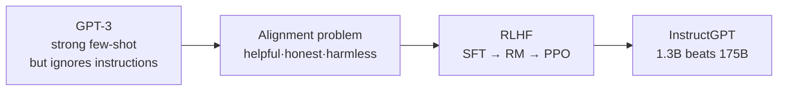
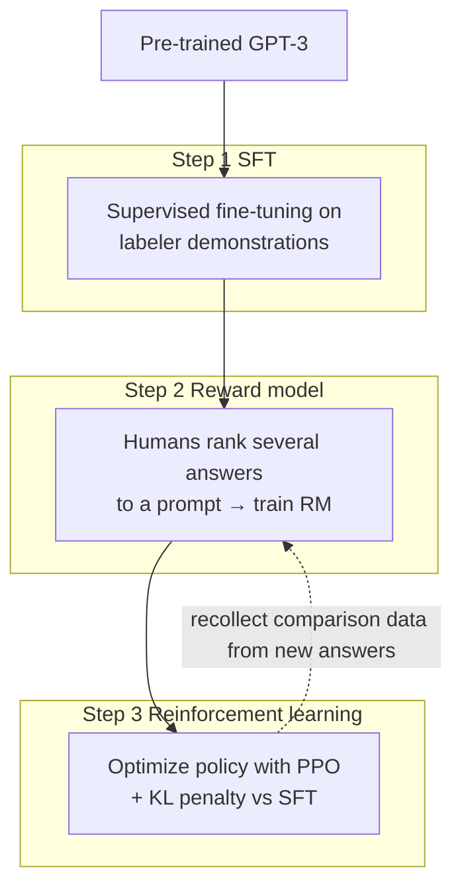
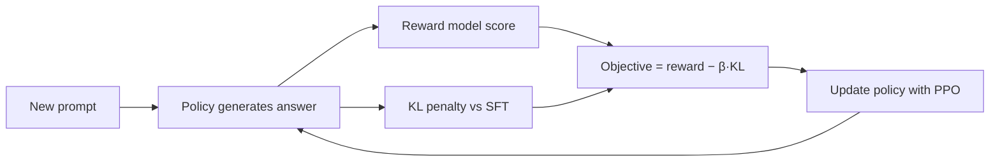
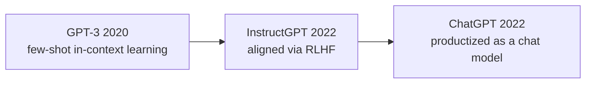

## Paper Info

- Title: Training language models to follow instructions with human feedback
- Authors: Long Ouyang, Jeff Wu, Xu Jiang, Diogo Almeida, Carroll L. Wainwright, and others (OpenAI Alignment team)
- Year: 2022 (arXiv March 2022, NeurIPS 2022)
- arXiv: https://arxiv.org/abs/2203.02155
- PDF: https://arxiv.org/pdf/2203.02155

## One-Line Summary

InstructGPT takes a model that is powerful but "doesn't follow instructions well" — like [GPT-3](/kb/2026-06-21-gpt-3-paper-note) — and aligns it to user intent by training it with **reinforcement learning against a reward model that has learned human preferences (RLHF)**. The headline result is striking: **the 1.3B InstructGPT's answers are preferred by humans over the 175B GPT-3's**, despite being 100x smaller. In other words, **aligning** the capability a model already has to human intent yields a larger felt improvement than scaling that capability up further.

## Background Knowledge for Reading InstructGPT

InstructGPT takes [GPT-3](/kb/2026-06-21-gpt-3-paper-note) as its starting point (the base model). So if you have already read GPT-3, the only new ideas to pick up are a few from the reinforcement-learning side. The table below helps most.

| Background concept           | Why it matters for InstructGPT                                                                 | Suggested note                                                                                    |
| ---------------------------- | ---------------------------------------------------------------------------------------------- | ------------------------------------------------------------------------------------------------- |
| GPT-3's few-shot limitations | The "instruction following" problem InstructGPT tackles follows directly from the GPT-3 notes. | [GPT-3 paper notes](/kb/2026-06-21-gpt-3-paper-note)                                              |
| Pre-training and Fine-tuning | RLHF step 1 (SFT) is exactly supervised fine-tuning.                                           | [Pre-training and Fine-tuning](/kb/2026-04-18-llm-learning-basics-pretraining-finetuning)         |
| Cross-entropy                | The basic metric behind SFT's objective and the reward model's loss.                           | [Cross-entropy and perplexity](/kb/2026-04-17-llm-learning-basics-cross-entropy-perplexity)       |
| Softmax and probability      | Helps you see how the reward model turns "more preferred" into a probability.                  | [Softmax and probability](/kb/2026-04-17-llm-math-basics-softmax)                                 |
| Decoder-only architecture    | Both the policy and the reward model use the same GPT-family decoder.                          | [Encoder-only and Decoder-only](/kb/2026-04-18-llm-architecture-basics-encoder-only-decoder-only) |

Reinforcement learning (PPO) is a new concept this series has not covered yet, so this note explains it inline as much as needed. For the minimal reading path, this order works well:

1. The "Limitations" and "Why It Still Matters" sections of the [GPT-3 paper notes](/kb/2026-06-21-gpt-3-paper-note)
2. [Pre-training and Fine-tuning](/kb/2026-04-18-llm-learning-basics-pretraining-finetuning)
3. The "Core Idea: The Three Steps of RLHF" section of this note

## A Quick Walkthrough for First-Time Readers

[GPT-3](/kb/2026-06-21-gpt-3-paper-note) showed that scaling lets a model perform many tasks from examples in the prompt alone. But using it in practice reveals a clear problem. GPT-3 is optimized to **continue the next token plausibly**, not to do what the user actually _wants_.

So GPT-3 behaves like this:

- Instead of answering, it continues writing a list of similar questions (ignoring the instruction).
- It confidently fabricates incorrect facts (hallucination).
- It reproduces harmful or biased text as-is.

InstructGPT tries to close this gap — not by making the model bigger, but by teaching the model **what people prefer**. People demonstrate good answers (demonstrations) and rank multiple answers (comparisons); those preferences are turned into a reward signal and used to adjust the model with reinforcement learning. This is **RLHF (Reinforcement Learning from Human Feedback)**.

**Increasing capability and aligning that capability to human intent are two different problems.**

## Recommended Reading Order for This Page

1. Background knowledge check
2. Problem definition (the alignment problem; helpful·honest·harmless)
3. Core idea: the three steps of RLHF
4. Step 1 SFT / Step 2 reward model / Step 3 PPO
5. Data and labelers
6. Results (the 1.3B-beats-175B preference)
7. The alignment tax and PPO-ptx
8. Limitations
9. Comparison with GPT-3, and what to read next

## Easy Places to Get Stuck

The first is the word `alignment`. Here, alignment does not mean "make the model smarter," but **"make the model's output match human intent."** The paper summarizes that goal in three words: **helpful**, **honest**, and **harmless**.

The second is the actual form of `human feedback`. People do not grade the model on every step inside the training loop. Human preferences are collected once and trained into a separate model called the **reward model**; in the reinforcement-learning step, this reward model — not a human — assigns the scores. In other words, "human feedback" operates through a **proxy** trained to imitate people.

The third is `PPO`. PPO (Proximal Policy Optimization) is a type of reinforcement-learning algorithm. Even without the equations, for this note it is enough to read it as **"a way to nudge the model toward higher reward-model scores while keeping it from drifting too far from the original model."** That "braking" is the KL penalty introduced later.

| Confusing term    | Precise meaning                                                              |
| ----------------- | ---------------------------------------------------------------------------- |
| policy            | The language model we are training. The agent that "generates" answers.      |
| reward model (RM) | A separate model that learns human preferences and scores answers.           |
| reward            | The score the reward model assigns to an answer; what RL tries to maximize.  |
| KL penalty        | A constraint that keeps the policy from straying too far from the SFT model. |

## Problem Definition

[GPT-3](/kb/2026-06-21-gpt-3-paper-note)'s training objective is to **predict the next token** in internet text. But that objective differs from the user's objective. The user wants "follow my instructions, safely and honestly." The paper calls this mismatch the **alignment problem** and sets three criteria for good output.

- **Helpful**: actually carries out the user's intent and instruction.
- **Honest**: does not fabricate facts, and says "I don't know" when it does not.
- **Harmless**: avoids harmful, biased, or dangerous output.

The goal is clear.

**"Can we align a pre-trained large language model to user intent (helpful·honest·harmless) without scaling it up further?"**

The key insight is in the cost structure. Pre-training takes hundreds of billions of tokens and enormous compute, whereas the human-feedback data needed for alignment is comparatively small. InstructGPT shows that **alignment costs a tiny fraction of pre-training** yet greatly raises the quality people perceive.

## Core Idea: The Three Steps of RLHF

InstructGPT's method runs in three steps. Human involvement concentrates in the data collection of steps 1 and 2; in step 3 the reward model stands in for humans.

In one sentence: **first warm up the model by having humans show good answers (SFT), turn human preference into a scoring model (RM), then use reinforcement learning to push the model toward higher scores (PPO).**

## Step 1: Supervised Fine-Tuning (SFT)

This is the most intuitive step.

- Collect a variety of prompts and have labelers **write a desired answer** for each.
- Use these (prompt, demonstration) pairs to supervised-fine-tune [GPT-3](/kb/2026-06-21-gpt-3-paper-note).

This step alone teaches the model the basic form of "answer the question." But having humans write every answer is expensive and limits how much data you can cover. The SFT dataset is around **13,000** examples. So rather than stop here, the method moves to step 2, which extracts more signal from less human effort.

## Step 2: The Reward Model

The key idea is that **ranking several answers is far easier for humans than writing a good one from scratch.**

- For a single prompt, the SFT model generates several answers (typically 4–9).
- Labelers **rank** these answers from best to worst (relative comparison, not absolute scores).
- This ranking data trains a **reward model**. The reward model takes an answer and outputs a single scalar score, trained so that answers humans preferred receive higher scores.

The reward model is trained with a loss over all pairwise comparisons (the preferred answer should score higher than the less preferred). The comparison data covers about **33,000** prompts, and the reward model is **6B** in size. Interestingly, a 175B reward model was unstable to train, so the smaller 6B model worked better as the scoring source for RL.

## Step 3: Reinforcement Learning (PPO)

Now humans step out and the reward model acts as the grader.

- Starting from the SFT model — now called the **policy** —
- the policy generates an answer to a new prompt, and the reward model scores that answer.
- The policy is updated bit by bit to maximize this score with **PPO**.

A common pitfall here is **reward hacking**. The policy can exploit weaknesses in the reward model, drifting toward answers that look strange to humans but score highly. To prevent this, a per-token **KL penalty against the SFT model** is added. That is: "raise the score, but don't stray too far from the original SFT model's distribution."

The PPO data covers about **31,000** prompts. Steps 2 and 3 are not one-shot: new answers from the new policy are used to collect more comparison data, iteratively improving the reward model and the policy.

## Data and Labelers

InstructGPT's data comes not from academic benchmarks but from the **actual usage distribution.**

- Most prompts come from real requests submitted to the OpenAI API (Playground), after removing sensitive information and deduplicating.
- For the initial bootstrap, labelers also wrote some prompts themselves.
- About **40** contractor labelers participated in writing and evaluating data, screened by criteria such as the ability to identify harmful outputs.

This "train and evaluate on the real API distribution" point matters. What the model gets good at is not a benchmark score, but the requests people actually make.

## Results: A 1.3B Model Beats 175B

The strongest result comes from human preference evaluations.

- On the same API prompt distribution, **the 1.3B InstructGPT's answers are preferred more often than the 175B GPT-3's** — despite having 100x fewer parameters.
- The 175B InstructGPT is preferred about **85%** of the time over 175B GPT-3, and about **71%** over a 175B GPT-3 with few-shot prompting.

Alignment also improves other axes, not just preference.

| Axis                   | Observation                                                                                   |
| ---------------------- | --------------------------------------------------------------------------------------------- |
| Truthfulness           | On TruthfulQA, the rate of truthful and informative answers roughly doubles versus GPT-3.     |
| Toxicity               | When prompted to be respectful, toxicity on RealToxicityPrompts drops about 25% versus GPT-3. |
| Following instructions | It respects constraints (e.g., "at most N words") and stated formats far more often.          |
| Bias                   | On bias benchmarks like Winogender and CrowS-Pairs, there is **no clear improvement**.        |

The core message is clear.
**A smaller, aligned model is more useful to people than a larger, unaligned one.**

## The Alignment Tax and PPO-ptx

Alignment comes at a cost. Raising human preference via RLHF can degrade performance on some public NLP benchmarks (SQuAD, DROP, translation, etc.). The paper calls this the **alignment tax.**

The fix is **PPO-ptx.** It mixes **a portion of the pre-training language-modeling loss** into the PPO objective. This keeps almost all of the alignment gains while greatly reducing the regression on public benchmarks (the tax) — a compromise that "keeps human preference and loses less of the original ability."

## Generalization: Code and Non-English

There is an interesting side observation. Although the training instructions were mostly in English, InstructGPT shows some ability to **follow non-English instructions and answer code-related questions.** This is a signal that alignment as a "mode of behavior" generalizes beyond a specific distribution — a part that raised expectations for later instruction-tuning research.

## Limitations and Things to Read Carefully

The paper is clear about the limits of alignment.

First, **"aligned to whose values?"** The model is tuned to the preferences of about 40 labelers and the researchers, and does not represent all of humanity or every user group.

Second, **it still gets things wrong.** Hallucination remains after alignment; it accepts false premises and makes mistakes on simple instructions.

Third, **the reward model is an imperfect proxy.** It cannot perfectly capture human preference, so over-optimizing it can cause reward hacking.

Fourth, **alignment is not value-neutral.** "Following instructions well" cuts both ways — it can follow harmful instructions better too. The target of alignment and the safety guardrails must be designed together.

## Reading InstructGPT Next to GPT-3

| Axis               | GPT-3 (2020)                            | InstructGPT (2022)                                |
| ------------------ | --------------------------------------- | ------------------------------------------------- |
| Training objective | Next-token prediction (pre-training)    | Align to human preference (SFT → RM → PPO)        |
| Core question      | "Does scaling make a few-shot learner?" | "Can we align to intent without scaling?"         |
| Role of humans     | (no direct involvement)                 | Demonstrate answers + rank answers                |
| Headline result    | 175B few-shot performance               | 1.3B preferred over 175B GPT-3                    |
| Axis of gain       | Capability                              | Alignment (helpful·honest·harmless)               |
| Cost structure     | Pre-training is nearly everything       | Alignment is a tiny fraction of pre-training cost |

## Why It Still Matters

First, it established **RLHF as a standard recipe.** The three steps SFT → reward model → PPO became the starting point for most alignment pipelines that followed.

Second, it is the **direct foundation of ChatGPT.** ChatGPT, which appeared in late 2022, stands on this InstructGPT-line (GPT-3.5) alignment technique. The experience of an "instruction-following conversational LLM" that we use today starts here.

Third, it **shifted the direction of the field.** It moved the center of gravity from "just scale up" to "align to human intent," opening the way for later preference-alignment work like Constitutional AI and DPO.

## Notes to Keep

- InstructGPT's core is not a new architecture but the **alignment procedure (RLHF).** The base model is GPT-3 as-is.
- "Human feedback" does not mean humans grade every step; it works through a **reward model** that has learned human preference.
- Ranking answers is easier for humans than writing them — this asymmetry is the starting point for the reward model.
- The KL penalty is the brake that prevents reward hacking, stopping the policy from drifting away while chasing scores.
- The 1.3B-beats-175B result shows alignment can deliver a larger felt improvement than scale.
- Alignment carries a tax (the alignment tax), and PPO-ptx is the compromise for it.

## What to Read Next

- LLaMA (2023): Open and Efficient Foundation Language Models
- Constitutional AI (2022): Harmlessness from AI Feedback (extends RLHF's human labels to AI feedback)
