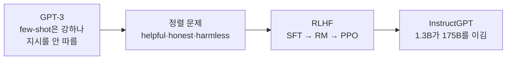
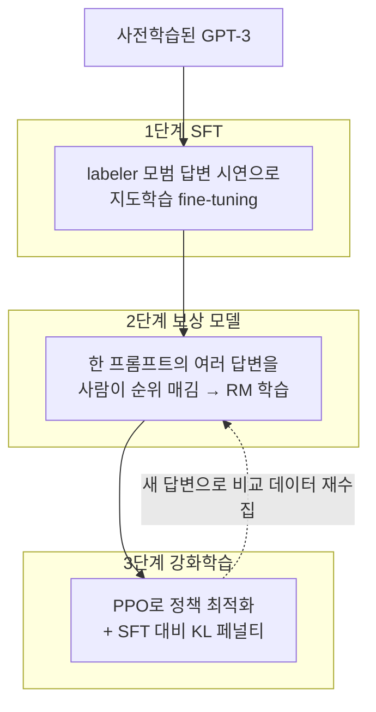
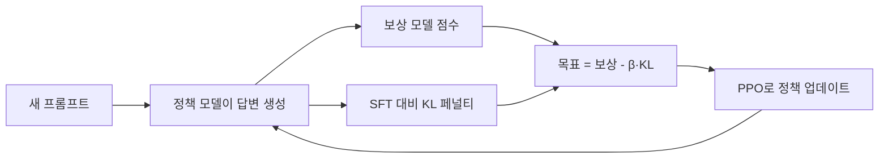
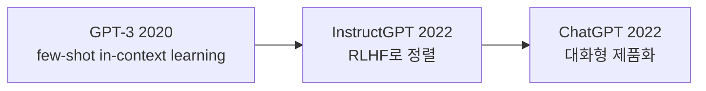

## Paper Info

- Title: Training language models to follow instructions with human feedback
- Authors: Long Ouyang, Jeff Wu, Xu Jiang, Diogo Almeida, Carroll L. Wainwright 외 (OpenAI Alignment team)
- Year: 2022 (arXiv 2022년 3월, NeurIPS 2022)
- arXiv: https://arxiv.org/abs/2203.02155
- PDF: https://arxiv.org/pdf/2203.02155

## 한 줄 요약

InstructGPT는 [GPT-3](/kb/2026-06-21-gpt-3-paper-note)처럼 강력하지만 "지시를 잘 따르지 않는" 모델을,
**사람의 선호를 학습한 보상 모델로 강화학습(RLHF)** 해서 사용자의 의도에 맞게 정렬한 논문입니다.
핵심 결과는 충격적입니다. **1.3B InstructGPT의 답변이, 100배 큰 175B GPT-3의 답변보다 사람에게 더 선호됩니다.**
즉 능력을 더 키우는 것보다, 가진 능력을 사람의 의도에 **정렬(align)** 하는 것이 더 큰 체감 개선을 만든다는 것을 보여줍니다.

## InstructGPT를 이해하기 위한 기반 지식

InstructGPT는 [GPT-3](/kb/2026-06-21-gpt-3-paper-note)를 출발점(base model)으로 삼습니다.
그래서 GPT-3를 먼저 읽었다면 새로 잡아야 할 개념은 강화학습 쪽 몇 가지뿐입니다. 아래 표가 특히 도움이 됩니다.

| 기반 지식                  | InstructGPT에서 필요한 이유                                                   | 먼저 볼 노트                                                                                    |
| -------------------------- | ----------------------------------------------------------------------------- | ----------------------------------------------------------------------------------------------- |
| GPT-3의 few-shot 한계      | InstructGPT가 풀려는 "지시 따르기" 문제의식이 GPT-3 노트에서 직접 이어집니다. | [GPT-3 논문 노트](/kb/2026-06-21-gpt-3-paper-note)                                              |
| Pre-training과 Fine-tuning | RLHF 1단계(SFT)가 곧 지도학습 fine-tuning입니다.                              | [Pre-training과 Fine-tuning](/kb/2026-04-18-llm-learning-basics-pretraining-finetuning)         |
| cross-entropy              | SFT의 학습 목표와 보상 모델의 손실을 이해하는 기본 지표입니다.                | [cross-entropy와 perplexity](/kb/2026-04-17-llm-learning-basics-cross-entropy-perplexity)       |
| softmax와 확률 해석        | 보상 모델이 "더 선호되는 답"의 확률을 만드는 방식을 이해하는 데 쓰입니다.     | [softmax와 확률 해석](/kb/2026-04-17-llm-math-basics-softmax)                                   |
| Decoder-only 구조          | 정책 모델·보상 모델 모두 GPT 계열 decoder를 그대로 씁니다.                    | [Encoder-only와 Decoder-only](/kb/2026-04-18-llm-architecture-basics-encoder-only-decoder-only) |

강화학습(PPO)은 이 시리즈에서 아직 다루지 않은 새 개념이라, 이 노트 안에서 필요한 만큼 풀어서 설명합니다.
최소 경로만 고르면 다음 순서가 좋습니다.

1. [GPT-3 논문 노트](/kb/2026-06-21-gpt-3-paper-note)의 "한계"와 "왜 지금도 중요한가" 섹션
2. [Pre-training과 Fine-tuning](/kb/2026-04-18-llm-learning-basics-pretraining-finetuning)
3. 이 노트의 "핵심 아이디어: RLHF 3단계" 섹션

## 처음 읽는 사람을 위한 빠른 해설

[GPT-3](/kb/2026-06-21-gpt-3-paper-note)는 규모를 키우면 prompt 안의 예시만으로 다양한 태스크를 한다는 것을 보였습니다.
하지만 실제로 써 보면 문제가 분명합니다. GPT-3는 **다음 토큰을 그럴듯하게 잇는 데 최적화**되어 있을 뿐,
사용자가 *원하는 것*을 하도록 최적화된 것이 아닙니다.

그래서 GPT-3는 이런 행동을 보입니다.

- 질문에 답하는 대신, 비슷한 질문을 줄줄이 이어 씁니다(지시 무시).
- 틀린 사실을 자신 있게 만들어냅니다(hallucination).
- 유해하거나 편향된 텍스트를 그대로 생성합니다.

InstructGPT는 이 간극을 좁히려 합니다. 방법은 모델을 더 키우는 것이 아니라,
**사람이 무엇을 더 좋아하는지를 모델에게 학습**시키는 것입니다.
사람이 직접 모범 답변을 보여주고(시연), 여러 답변에 순위를 매기면(비교),
그 선호를 보상 신호로 바꿔 강화학습으로 모델을 조정합니다. 이것이 **RLHF(인간 피드백 기반 강화학습)** 입니다.

**능력(capability)을 키우는 것과, 그 능력을 사람의 의도에 정렬(alignment)하는 것은 서로 다른 문제입니다.**

## 이 페이지를 읽는 추천 순서

1. 기반 지식 체크
2. 문제 정의 (정렬 문제, helpful·honest·harmless)
3. 핵심 아이디어: RLHF 3단계
4. 1단계 SFT / 2단계 보상 모델 / 3단계 PPO
5. 데이터와 labeler
6. 실험 결과 (1.3B가 175B를 이기는 선호도)
7. Alignment tax와 PPO-ptx
8. 한계
9. GPT-3와 비교, 다음 논문

## 읽다가 막히기 쉬운 지점

첫 번째는 `alignment(정렬)`라는 말입니다.
여기서 정렬은 "모델을 더 똑똑하게 만든다"가 아니라, **"모델의 출력을 사람의 의도와 일치시킨다"** 는 뜻입니다.
논문은 그 목표를 세 단어로 요약합니다. **helpful**(도움이 됨), **honest**(정직함), **harmless**(해롭지 않음).

두 번째는 `human feedback(인간 피드백)`의 실제 형태입니다.
사람이 모델 학습 루프 안에서 매번 채점하는 것이 아닙니다.
사람의 선호는 한 번 수집해 **보상 모델(reward model)** 이라는 별도 모델에 학습시키고,
강화학습 단계에서는 사람 대신 이 보상 모델이 점수를 줍니다.
즉 "인간 피드백"은 사람을 흉내 내도록 학습된 **proxy(대리 채점자)** 를 통해 작동합니다.

세 번째는 `PPO`입니다. PPO(Proximal Policy Optimization)는 강화학습 알고리즘의 한 종류입니다.
세부 수식을 몰라도, 이 노트에서는 **"보상 모델 점수를 높이는 방향으로 모델을 조금씩 조정하되, 원래 모델에서 너무 멀어지지 않게 제동을 거는 방법"** 정도로 이해하면 충분합니다.
그 "제동"이 뒤에 나오는 KL 페널티입니다.

| 헷갈리는 용어 | 정확한 의미                                                      |
| ------------- | ---------------------------------------------------------------- |
| 정책(policy)  | 우리가 학습시키는 언어 모델 자체. 답변을 "생성하는 주체"입니다.  |
| 보상 모델(RM) | 사람의 선호를 학습해, 답변에 점수를 매기는 별도 모델입니다.      |
| 보상(reward)  | 보상 모델이 답변에 매기는 점수. 강화학습이 높이려는 목표입니다.  |
| KL 페널티     | 정책이 원래 SFT 모델에서 너무 벗어나지 않도록 누르는 제약입니다. |

## 문제 정의

[GPT-3](/kb/2026-06-21-gpt-3-paper-note)의 학습 목표는 인터넷 텍스트에서 **다음 토큰을 맞히는 것**입니다.
그런데 이 목표는 사용자의 목표와 다릅니다. 사용자는 "내 지시를 안전하고 정직하게 따라 달라"를 원합니다.
논문은 이 불일치를 **정렬 문제(alignment problem)** 라고 부르고, 좋은 출력의 기준을 세 가지로 둡니다.

- **Helpful**: 사용자의 의도와 지시를 실제로 수행해 돕습니다.
- **Honest**: 없는 사실을 지어내지 않고, 모르면 모른다고 합니다.
- **Harmless**: 유해하거나 편향된, 위험한 출력을 피합니다.

목표는 명확합니다.

**"사전학습된 거대 언어 모델을, 별도로 규모를 키우지 않고도 사용자의 의도(helpful·honest·harmless)에 맞게 정렬할 수 있는가?"**

핵심 통찰은 비용 구조에 있습니다.
사전학습은 수천억 토큰과 막대한 연산이 드는 반면, 정렬에 필요한 사람 피드백 데이터는 상대적으로 적습니다.
InstructGPT는 **정렬에 드는 비용이 사전학습의 극히 일부**이면서도, 사람이 체감하는 품질은 크게 끌어올린다는 것을 보입니다.

## 핵심 아이디어: RLHF 3단계

InstructGPT의 방법은 세 단계로 이어집니다. 사람의 개입은 1·2단계의 데이터 수집에 집중되고,
3단계는 보상 모델이 사람을 대신합니다.

한 문장으로 줄이면 이렇습니다.
**먼저 사람이 정답을 보여줘 모델을 데우고(SFT), 사람의 선호를 점수 모델로 바꾼 뒤(RM), 그 점수를 높이도록 모델을 강화학습한다(PPO).**

## 1단계: Supervised Fine-Tuning (SFT)

가장 직관적인 단계입니다.

- 다양한 prompt를 모으고, labeler가 각 prompt에 대해 **바람직한 답변을 직접 작성**합니다.
- 이 (prompt, 모범 답변) 쌍으로 [GPT-3](/kb/2026-06-21-gpt-3-paper-note)를 지도학습 fine-tuning합니다.

이 단계만으로도 모델은 "질문에는 답을 한다"는 기본 형식을 익힙니다.
하지만 사람이 모든 답을 일일이 써 주는 방식은 비싸고, 다룰 수 있는 데이터 양이 제한적입니다.
SFT 데이터는 약 **13,000개** 규모입니다. 그래서 여기서 멈추지 않고, 더 적은 사람 노력으로 더 많은 신호를 얻는 2단계로 넘어갑니다.

## 2단계: 보상 모델 (Reward Model)

핵심 아이디어는 **"좋은 답을 직접 쓰는 것보다, 여러 답에 순위를 매기는 것이 사람에게 훨씬 쉽다"** 는 점입니다.

- 한 prompt에 대해 SFT 모델이 여러 개(보통 4~9개)의 답변을 생성합니다.
- labeler는 이 답변들을 **좋은 순서대로 순위**를 매깁니다(절대 점수가 아니라 상대 비교).
- 이 순위 데이터로 **보상 모델**을 학습합니다. 보상 모델은 답변을 입력받아 스칼라 점수 하나를 출력하고,
  사람이 더 선호한 답변에 더 높은 점수를 주도록 학습됩니다.

보상 모델은 모든 쌍 비교에 대한 손실로 학습됩니다(더 선호된 답의 점수가 덜 선호된 답보다 높도록).
비교 데이터는 약 **33,000개** prompt 규모이며, 보상 모델은 **6B** 크기를 사용했습니다.
흥미롭게도 175B 보상 모델은 학습이 불안정해, 더 작은 6B 모델이 강화학습의 점수원으로 더 적합했습니다.

## 3단계: 강화학습 (PPO)

이제 사람은 빠지고, 보상 모델이 채점자 역할을 합니다.

- SFT 모델을 출발점으로 삼아 **정책(policy)** 이라 부릅니다.
- 정책이 새 prompt에 답변을 생성하면, 보상 모델이 그 답변에 점수를 줍니다.
- 이 점수를 **PPO**로 최대화하도록 정책을 조금씩 업데이트합니다.

여기서 빠지기 쉬운 함정이 **reward hacking**입니다.
정책이 보상 모델의 허점을 파고들어, 사람이 보기엔 이상하지만 점수만 높은 답으로 흘러갈 수 있습니다.
이를 막기 위해 토큰마다 **SFT 모델과의 KL 페널티**를 더합니다.
즉 "점수는 높이되, 원래 SFT 모델의 분포에서 너무 멀어지지 마라"는 제약을 겁니다.

PPO 데이터는 약 **31,000개** prompt 규모입니다.
2·3단계는 한 번으로 끝나지 않고, 새 정책이 만든 답변으로 다시 비교 데이터를 모아 보상 모델과 정책을 반복 개선합니다.

## 데이터와 labeler

InstructGPT의 데이터는 학술 벤치마크가 아니라 **실제 사용 분포**에서 나옵니다.

- prompt 대부분은 OpenAI API(Playground)에 들어온 실제 요청에서 가져왔습니다(민감정보 제거·중복 제거 후).
- 초기 부트스트랩용으로는 labeler가 직접 prompt를 작성하기도 했습니다.
- 데이터 작성·평가에는 약 **40명**의 계약직 labeler가 참여했습니다. 유해 출력을 식별하는 능력 등을 기준으로 선발했습니다.

이 "실제 API 분포에서 학습하고 평가한다"는 점이 중요합니다.
모델이 잘하게 되는 대상이 벤치마크 점수가 아니라, 사람이 실제로 던지는 요청이기 때문입니다.

## 실험 결과: 1.3B가 175B를 이깁니다

가장 강한 결과는 사람 선호 평가에서 나옵니다.

- 같은 API prompt 분포에서, **1.3B InstructGPT의 답변이 175B GPT-3의 답변보다 더 자주 선호**됩니다.
  파라미터가 100배 적은데도 그렇습니다.
- 175B InstructGPT는 175B GPT-3 대비 약 **85%**, few-shot prompting을 적용한 175B GPT-3 대비 약 **71%**의 선호율을 보입니다.

정렬은 선호도뿐 아니라 다른 축에서도 개선을 만듭니다.

| 축           | 관찰                                                                                 |
| ------------ | ------------------------------------------------------------------------------------ |
| Truthfulness | TruthfulQA에서 진실하고 유익한 답변 비율이 GPT-3의 약 2배로 늘어납니다.              |
| Toxicity     | 정중하라는 지시가 있을 때 RealToxicityPrompts 유해도가 GPT-3 대비 약 25% 감소합니다. |
| 지시 따르기  | 제약(예: "최대 N단어")을 지키고, 명시된 형식을 따르는 비율이 크게 오릅니다.          |
| Bias         | Winogender·CrowS-Pairs 같은 편향 벤치마크에서는 **뚜렷한 개선이 없습니다**.          |

핵심 메시지는 명확합니다.
**더 큰 모델이 아니라, 정렬된 작은 모델이 사람에게 더 쓸모 있습니다.**

## Alignment tax와 PPO-ptx

정렬에는 대가가 따릅니다.
RLHF로 사람 선호를 높이면, 일부 공개 NLP 벤치마크(SQuAD, DROP, 번역 등)에서 성능이 떨어질 수 있습니다.
논문은 이를 **alignment tax(정렬 세금)** 라고 부릅니다.

해결책이 **PPO-ptx**입니다.
PPO 목표에 **사전학습 분포의 언어 모델링 손실을 일부 섞어** 업데이트합니다.
이렇게 하면 정렬로 얻은 이득은 거의 유지하면서, 공개 벤치마크의 성능 저하(정렬 세금)는 크게 줄어듭니다.
즉 "사람 선호도 챙기고, 기존 능력도 덜 잃는" 절충안입니다.

## 일반화: 코드와 비영어

흥미로운 부수 관찰이 있습니다.
학습 데이터는 대부분 영어 지시였는데도, InstructGPT는 **비영어 지시를 따르고 코드 관련 질문에 답하는 능력**을 어느 정도 보입니다.
정렬이라는 "행동 양식"이 특정 분포를 넘어 일반화되는 신호로, 이후 instruction tuning 연구의 기대를 키운 부분입니다.

## 한계와 조심해서 읽을 지점

논문 스스로도 정렬의 한계를 분명히 적습니다.

첫 번째, **"누구의 가치에 정렬했는가"** 입니다.
모델은 약 40명의 labeler와 연구진의 선호에 맞춰졌을 뿐, 인류 전체나 모든 사용자 집단을 대표하지 않습니다.

두 번째, **여전히 틀립니다.**
정렬 후에도 hallucination이 남고, 틀린 전제를 그대로 받아들이며, 단순 지시에서 실수합니다.

세 번째, **보상 모델은 불완전한 proxy**입니다.
사람의 선호를 완벽히 담지 못하므로, 과최적화되면 reward hacking이 생길 수 있습니다.

네 번째, **정렬은 가치중립이 아닙니다.**
"지시를 잘 따른다"는 것은, 해로운 지시도 더 잘 따를 수 있다는 양면성을 가집니다. 정렬의 대상과 안전 장치 설계가 함께 가야 합니다.

## GPT-3와 비교해서 읽기

| 축          | GPT-3 (2020)                          | InstructGPT (2022)                   |
| ----------- | ------------------------------------- | ------------------------------------ |
| 학습 목표   | 다음 토큰 예측(사전학습)              | 사람 선호로 정렬(SFT → RM → PPO)     |
| 핵심 질문   | "규모를 키우면 few-shot learner인가?" | "규모 없이 의도에 정렬할 수 있는가?" |
| 사람의 역할 | (직접 개입 없음)                      | 모범 답변 시연 + 답변 순위 매기기    |
| 대표 결과   | 175B few-shot 성능                    | 1.3B가 175B GPT-3보다 선호됨         |
| 개선 축     | 능력(capability)                      | 정렬(helpful·honest·harmless)        |
| 비용 구조   | 사전학습이 거의 전부                  | 정렬은 사전학습의 극히 일부 비용     |

## 왜 지금도 중요한가

첫 번째, **RLHF라는 표준 레시피**를 정립했습니다.
SFT → 보상 모델 → PPO의 3단계는 이후 대부분의 정렬 파이프라인의 출발점이 됩니다.

두 번째, **ChatGPT의 직접적인 토대**입니다.
2022년 말 등장한 ChatGPT는 이 InstructGPT 계열(GPT-3.5)의 정렬 기법 위에 서 있습니다.
오늘날 우리가 쓰는 "지시를 따르는 대화형 LLM"의 경험이 여기서 시작됩니다.

세 번째, **연구의 방향을 바꿨습니다.**
"무조건 더 키운다"에서 "사람의 의도에 정렬한다"로 무게중심을 옮겼고,
이후 Constitutional AI, DPO 같은 선호 정렬 연구의 흐름을 열었습니다.

## 읽고 남길 메모

- InstructGPT의 핵심은 새 구조가 아니라 **정렬 절차(RLHF)** 입니다. base 모델은 GPT-3 그대로입니다.
- "인간 피드백"은 사람이 매번 채점하는 것이 아니라, 사람의 선호를 학습한 **보상 모델**을 통해 작동합니다.
- 사람에게는 정답을 쓰는 것보다 답에 순위를 매기는 것이 쉽다 — 이 비대칭이 보상 모델의 출발점입니다.
- KL 페널티는 reward hacking을 막는 제동 장치입니다. 점수만 좇다 원래 분포에서 멀어지는 것을 막습니다.
- 1.3B가 175B를 이긴다는 결과는, 정렬이 규모보다 큰 체감 개선을 줄 수 있음을 보여줍니다.
- 정렬에는 세금이 따르고(alignment tax), PPO-ptx가 그 절충안입니다.

## 다음에 읽을 논문

- LLaMA (2023): Open and Efficient Foundation Language Models
- Constitutional AI (2022): Harmlessness from AI Feedback (RLHF의 사람 라벨을 AI 피드백으로 확장)
