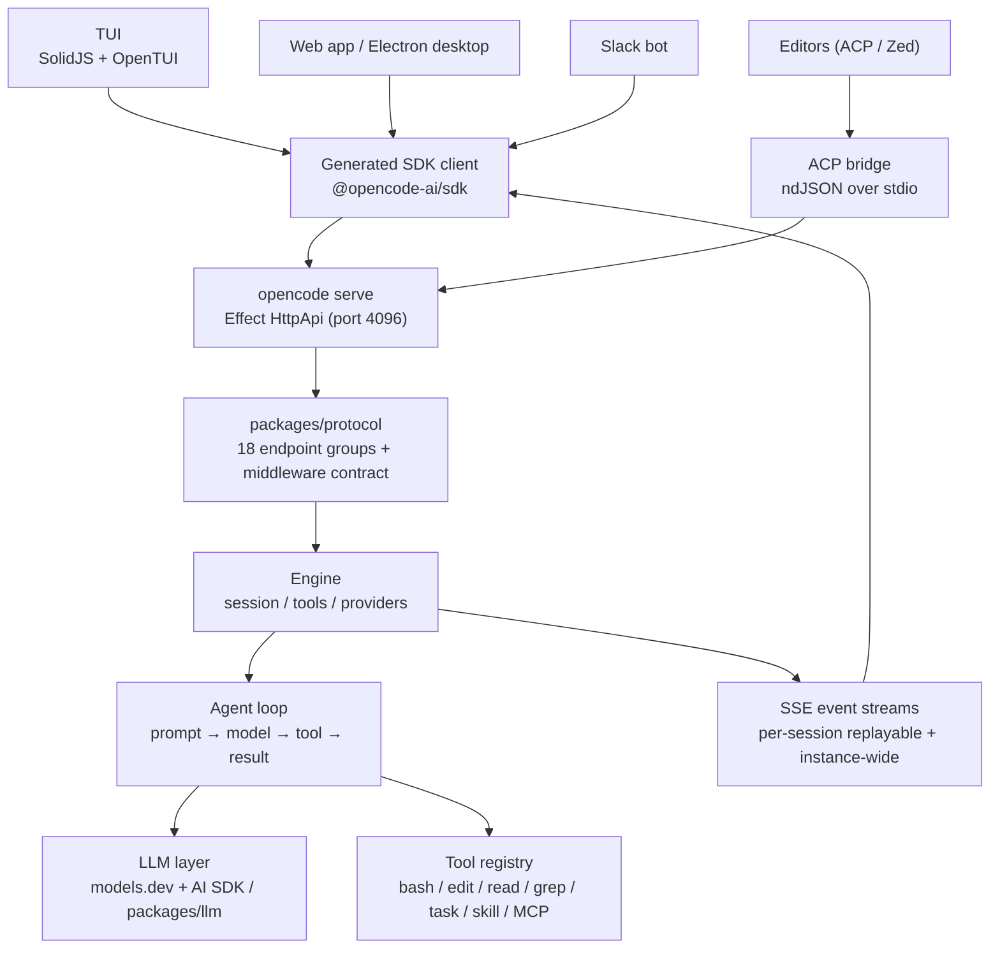
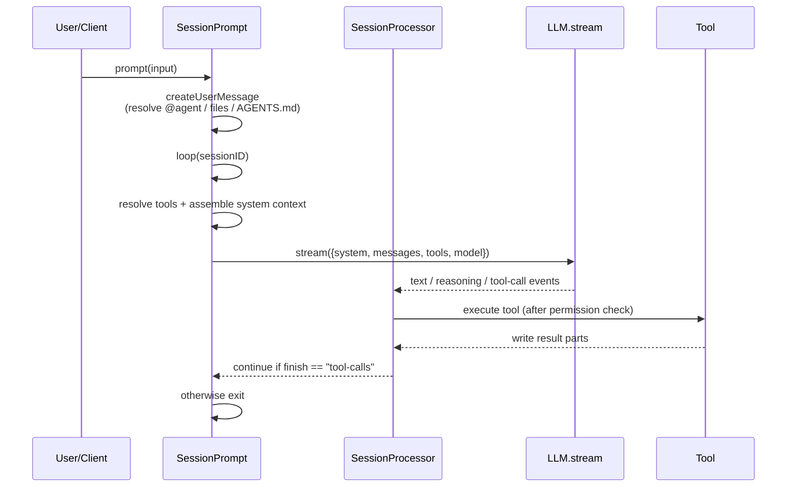
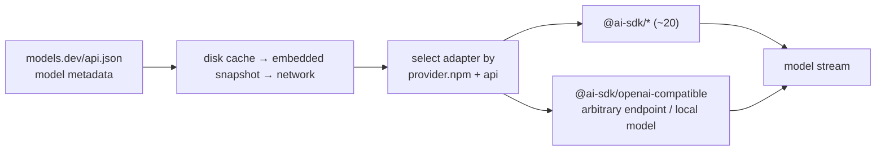
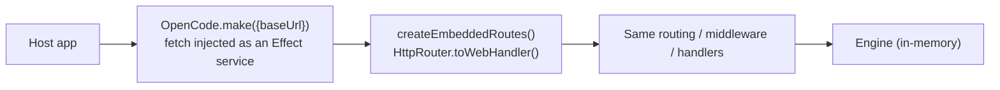

> Analysis date: 2026-06-29
> Target package: `opencode-ai` `1.17.11`
> Target commit: `beaaa174ea9c77984eec91d73f20dc161028bd8f` (`dev` branch)
> Repository: https://github.com/sst/opencode
> Local analysis path: `~/workspace/opensources/opencode`

---

_This article is partially written by Claude Code_

## Table of Contents

1. [Why OpenCode?](#1-why-opencode)
2. [Where Does It Sit Among the Previous Articles?](#2-where-does-it-sit-among-the-previous-articles)
3. [Understanding the Project in One Sentence](#3-understanding-the-project-in-one-sentence)
4. [Tech Stack and Scale](#4-tech-stack-and-scale)
5. [The Big Picture: One Engine, Many Front Doors](#5-the-big-picture-one-engine-many-front-doors)
6. [Codebase Map: Legacy and V2 Coexist](#6-codebase-map-legacy-and-v2-coexist)
7. [The Headless Server: Clients Are Swappable Parts](#7-the-headless-server-clients-are-swappable-parts)
8. [The Agent Loop: Splitting a Prompt Into Admission and Execution](#8-the-agent-loop-splitting-a-prompt-into-admission-and-execution)
9. [Provider Abstraction: Models Are Data, Not Code](#9-provider-abstraction-models-are-data-not-code)
10. [The Hand-Rolled LLM Layer: Removing the AI SDK and Splitting the Protocol Into Four Axes](#10-the-hand-rolled-llm-layer-removing-the-ai-sdk-and-splitting-the-protocol-into-four-axes)
11. [The Tool System and MCP](#11-the-tool-system-and-mcp)
12. [Skills and Subagents](#12-skills-and-subagents)
13. [Embedded OpenCode: The Same Server, Without the Network](#13-embedded-opencode-the-same-server-without-the-network)
14. [Security and Operational Points](#14-security-and-operational-points)
15. [Comparison With Qwen Code: The Value and Cost of Provider-Agnostic](#15-comparison-with-qwen-code-the-value-and-cost-of-provider-agnostic)
16. [A Recommended Reading Order](#16-a-recommended-reading-order)
17. [Notable Design Decisions](#17-notable-design-decisions)
18. [Things to Watch Out For](#18-things-to-watch-out-for)
19. [Conclusion](#19-conclusion)

---

## 1. Why OpenCode?

OpenCode describes itself in one sentence in its README: **"The open source AI coding agent."** The landing page adds a line: "Use any model — Supports 75+ LLM providers through Models.dev, including local models."

On the surface it is yet another terminal coding agent, like [Qwen Code](/kb/2026-05-17-qwen-code-architecture) or Claude Code. But open the repository and two things stand out.

First, OpenCode **pushes provider-agnosticism to the extreme.** It does not bake model metadata into the code; it fetches it from an external registry (`models.dev`). The CONTRIBUTING doc even states: "New providers shouldn't require many if ANY code changes — make a PR to models.dev." Adding a model is a **data change**, not a code change.

Second, OpenCode is **a single headless server that many front-ends attach to.** In the docs' words, "The `opencode serve` command runs a headless HTTP server that exposes an OpenAPI endpoint that an opencode client can use" (default port 4096). The terminal TUI, web app, Electron desktop, Slack bot, and editors (ACP) all attach to the same engine.

So if you see OpenCode only as "a CLI that uses many models," you miss the point. More precisely, it is **an Effect-based headless coding-agent engine built so that both the model and the client are swappable.**

## 2. Where Does It Sit Among the Previous Articles?

Comparing it with the coding-agent / AI-infrastructure articles I've analyzed recently makes OpenCode's coordinates clear.

| Article                                                | Central problem                                       | Relationship to OpenCode                                                                                                                              |
| ------------------------------------------------------ | ----------------------------------------------------- | ----------------------------------------------------------------------------------------------------------------------------------------------------- |
| [Qwen Code](/kb/2026-05-17-qwen-code-architecture)     | Extending a terminal coding agent via plugins/daemon  | Where Qwen Code is a single-vendor runtime with Qwen/DashScope up front, OpenCode is a provider-agnostic engine that decouples both model and client. |
| [OpenHands](/kb/2026-05-17-openhands-architecture)     | Operating a coding agent as a web product + sandbox   | Where OpenHands draws its product boundary with an app server/sandbox, OpenCode draws it with a headless HTTP engine and a generated SDK.             |
| [Dify](/kb/2026-05-17-dify-architecture)               | Productizing LLM app development and workflow/RAG     | Where Dify is an LLM app platform, OpenCode is a coding agent runtime that works directly on the developer's local repo.                              |
| [Ruflo](/kb/2026-05-17-ruflo-architecture)             | An orchestration layer around Claude Code             | Where Ruflo bolts an operations layer onto Claude Code from the outside, OpenCode makes the engine itself headless so outsiders attach to it.         |
| [Superpowers](/kb/2026-04-18-superpowers-architecture) | A doc system that forces process and skills on agents | OpenCode's Skills are `SKILL.md`-based discoverable capabilities, handling Superpowers-style knowledge inside its own runtime.                        |

The key point is that OpenCode is not explained by "swapping the model provider." In the Qwen Code article the product boundaries were `ToolRegistry`, `CoreToolScheduler`, and `qwen serve`. In OpenCode they are **the `models.dev` registry, the hand-rolled `packages/llm` protocol layer, the `packages/protocol` HTTP contract, and the generated SDK.** It's a similar-looking terminal coding agent, but the axis of decoupling is different.

## 3. Understanding the Project in One Sentence

**OpenCode** is a Bun-based TypeScript monorepo that places a SolidJS TUI, web/desktop UIs, a Slack bot, and editor (ACP) integrations on top of a headless HTTP engine written in Effect, and externalizes model metadata to `models.dev` so that **any LLM provider attaches as data** — a provider-agnostic coding agent.

As questions:

| Question                          | OpenCode's answer                                                                                                                  |
| --------------------------------- | ---------------------------------------------------------------------------------------------------------------------------------- |
| Where do users talk to it?        | SolidJS+OpenTUI terminal UI, web app, Electron desktop, Slack, editors (ACP/Zed) — all attach to the server.                       |
| Where is the real agent loop?     | Legacy: `SessionPrompt.loop` in `packages/opencode/src/session/prompt.ts`; V2: `SessionRunner` in `packages/core`.                 |
| How are tools registered?         | Legacy: `tool/registry.ts` filters built-ins per provider; V2: tools self-register as Effect Layers.                               |
| How do you switch model provider? | It fetches model metadata from `models.dev/api.json` and picks the matching `@ai-sdk/*` adapter. Adding one is a PR to models.dev. |
| How does a client attach?         | Via a generated SDK client to the HTTP engine started by `opencode serve` (port 4096).                                             |
| What about dangerous tool calls?  | Wildcard permission rules (allow/deny/ask), a read-only `plan` agent, tool-output caps, and a doom-loop guard.                     |
| Can you use it externally?        | `opencode serve` HTTP + OpenAPI, `@opencode-ai/sdk`, ACP (editors), a Slack bot, and even a network-free embedded mode.            |

## 4. Tech Stack and Scale

| Area           | Technology                                                                                               |
| -------------- | -------------------------------------------------------------------------------------------------------- |
| Runtime        | **Bun 1.3+** (`packageManager: bun@1.3.14`). Node only acts as a shim launching a compiled binary        |
| Language/tools | TypeScript, ESM, **oxlint** (not eslint), prettier (no semicolons, width 120)                            |
| Core framework | **Effect 4** — 618 source files import `effect`. Services, layers, schemas, HTTP, and SQL are all Effect |
| Data           | **Drizzle ORM** + SQLite (`@effect/sql-sqlite-bun`), snake_case columns by convention                    |
| HTTP/API       | Effect `HttpApi`/`HttpRouter` + `OpenApi` (the agent server **does not use Hono**)                       |
| LLM            | **Vercel AI SDK** (`ai@6`) + ~20 `@ai-sdk/*` packages, plus its own `packages/llm`                       |
| TUI            | **SolidJS + OpenTUI** (rendering `.tsx` to the terminal)                                                 |
| Web/Desktop    | SolidJS (`app`/`session-ui`/`ui`), SolidStart, Astro+Starlight (docs), **Electron** desktop              |
| Build/monorepo | **Bun workspaces + Turborepo**                                                                           |
| MCP            | `@modelcontextprotocol/sdk`                                                                              |
| Infra          | **SST v4**, Cloudflare-centric + AWS/Stripe/PlanetScale/Honeycomb                                        |
| Distribution   | `curl … /install \| bash`, npm `opencode-ai`, Homebrew, Scoop/Choco, AUR, Nix, desktop installers        |

The scale of the local checkout:

| Item                             | Count |
| -------------------------------- | ----: |
| Git-tracked files                | 6,020 |
| `packages/opencode/src` (legacy) |   400 |
| `packages/core/src` (V2)         |   322 |
| `packages/llm/src`               |    55 |
| `packages/tui`                   |   237 |

The scale is large, but more striking is **the density of package separation.** There are 30+ packages under `packages/`, many of them the result of cleanly splitting "engine / protocol / client / schema."

## 5. The Big Picture: One Engine, Many Front Doors

OpenCode's big picture is "many clients attach to a single headless engine."

The key here is the direction of the arrows. Every surface a user sees (TUI, web, desktop, Slack, editor) points to the **same HTTP contract.** So adding a new client is not "rewriting the engine" but "attaching via the SDK."

## 6. Codebase Map: Legacy and V2 Coexist

The first thing to know when reading OpenCode is that **this repository is mid-migration.** Two generations exist at once.

- **The legacy generation** — `packages/opencode/src/*` (~400 files). The business logic, server, yargs CLI, ACP, and MCP client of the currently shipped `opencode` binary live here.
- **The V2 (Effect-native) generation** — split across `packages/{core, server, protocol, client, llm, schema, sdk-next, cli}`. It is being rewritten with stricter layer separation in mind.

The key packages:

| Package             | Purpose                                                                                   | Tier          |
| ------------------- | ----------------------------------------------------------------------------------------- | ------------- |
| `packages/opencode` | **Legacy main package + shipped binary**: agent logic + server + CLI + ACP + MCP client   | Core (legacy) |
| `packages/core`     | **V2 Effect engine**: sessions, system-context, tools, providers, catalog, credentials    | Core (V2)     |
| `packages/llm`      | **Hand-rolled provider-agnostic LLM layer** (protocol/route/provider/transport, 4 axes)   | Core (V2)     |
| `packages/schema`   | The Effect `Schema` "leaf" of domain types (Session/Message/Model/Permission/Tool/Event…) | Core (V2)     |
| `packages/protocol` | **Authoritative HTTP API contract** — 18 endpoint groups + middleware placement           | Core (V2)     |
| `packages/server`   | **V2 HTTP server**: hosts the Protocol groups and wires middleware/service layers         | Core (V2)     |
| `packages/client`   | **Generated** HTTP clients from Protocol (a Promise edition + an Effect edition)          | Core (V2)     |
| `packages/sdk`      | The legacy shipped SDK `@opencode-ai/sdk` (OpenAPI-generated)                             | Core          |
| `packages/sdk-next` | **Embedded OpenCode**: runs the server router in-memory (no network)                      | Core (V2)     |
| `packages/tui`      | SolidJS+OpenTUI terminal UI (connects to the server via SDK + SSE)                        | Core          |
| `packages/cli`      | The V2 Effect CLI (`lildax` binary): `serve`, a `service` daemon, `migrate`               | Core (V2)     |
| `packages/plugin`   | The `@opencode-ai/plugin` hook/contract (tool hooks, auth providers, workspace adapters)  | Core          |

Beyond these are **peripheral packages**: `app`/`session-ui`/`ui` (SolidJS web), `desktop` (Electron), `web` (docs), `enterprise`/`console`/`stats` (cloud), `slack`, `containers`, `http-recorder` (VCR-style testing), and `httpapi-codegen` (the SDK generator).

> ⚠️ Analysis caveat: I could not confirm from the repository alone whether the currently shipped `opencode-ai` binary is built from legacy (`packages/opencode`) or V2. Given that version `1.17.11` lives in `packages/opencode/package.json` and CONTRIBUTING points at the legacy `bin/opencode`, it is safest to read **legacy as still the shipped path, with V2 mid-migration.**

## 7. The Headless Server: Clients Are Swappable Parts

Every surface in OpenCode passes through a **headless Effect `HttpApi`.** `opencode serve` starts this engine, and clients attach via the generated SDK.

V2's `packages/protocol` defines 18 endpoint groups (Session, Message, Model, Provider, FileSystem, Pty, Permission, Question, Skill, Event, Command, Reference, Integration, Credential, Project, Location, Health, Agent). `packages/server` hosts this contract while wiring a middleware stack (`handlers → sessionLocation → location → authorization → schemaError → auth`).

Two things matter especially:

- **The layering rule is enforced in code.** Runtime dependencies flow only in the direction `Schema → Core·Protocol → Server`, and the **Client never imports Core/Server.** There are even import-boundary tests so it bundles safely in the browser.
- **The client is generated, not hand-written.** `packages/client`'s `src/generated` (Promise) and `src/generated-effect` (Effect, streaming) are produced from the Protocol via `bun run generate`. The API contract is the single source of truth, and the SDK is derived from it.

Events go out over two SSE streams: a per-session replayable stream (`GET /api/session/:id/event?after=`) and an instance-wide live stream (`GET /api/event`). So a client that attaches midway can replay the events it missed.

Where [OpenHands](/kb/2026-05-17-openhands-architecture) makes its product boundary an app server and a sandbox, OpenCode makes it **the HTTP contract and a generated SDK.** "One server, many clients" is not a slogan but a constraint enforced by the package dependency graph.

## 8. The Agent Loop: Splitting a Prompt Into Admission and Execution

### The legacy loop

The legacy session flow lives in `packages/opencode/src/session/prompt.ts`, all written in Effect.

Per step it: gathers non-compacted messages → creates a new assistant message → resolves tools → assembles system context from skill/environment/instruction/mcp → then streams the model via `LLM.stream()`. The loop runs while the assistant's `finish` is `tool-calls`, and exits otherwise. There is also a **doom-loop guard**: three identical consecutive tool calls force a permission ask. When the context overflows (`isOverflow`), it inserts a summary and truncates history (compaction).

### The V2 loop: admission ≠ execution

V2 (`packages/core`) uses a stricter model, meticulously specified in prose in `CONTEXT.md`. The core idea is **decoupling admitting a prompt from executing it.**

- `SessionV2.prompt(...)` first writes one `session_input` row **durably** (emitting a `PromptAdmitted` event), then wakes execution.
- A process-local, serialized `SessionRunCoordinator` coalesces wakes, and a `SessionRunner` drains them, promoting admitted inputs into visible user messages only at "Safe Provider-Turn Boundaries." It makes **exactly one `llm.stream(request)` per provider turn**, reprojecting history each turn (not an in-memory tool loop).
- The delivery semantics are explicit, too: a prompt **steers** by default (cutting into the current flow), while **queue** waits until idle.

The intent of this design is **crash recovery.** Because the session can be reconstructed from events rather than in-memory state, even if it dies mid-run it can restart from the durable admission record.

Another interesting piece is V2's **System Context algebra** (`core/src/system-context/`). Typed Context Sources are composed into an immutable baseline system context per epoch, and when a source changes, `reconcile()` emits **a single mid-conversation system message** (e.g., an AGENTS.md change, the date, a change in available skills). The first source is `instruction-context.ts`, which walks up the directory tree collecting `AGENTS.md` and global config.

## 9. Provider Abstraction: Models Are Data, Not Code

This is where OpenCode's identity lies. "75+ provider support" is created by two mechanisms working together.

### The models.dev registry (the shipped path)

The docs state: "OpenCode uses the AI SDK and Models.dev to support 75+ LLM providers." The key is that **model metadata is not baked into the code.**

- `core/src/models-dev.ts` fetches `https://models.dev/api.json` (swappable via `OPENCODE_MODELS_URL`, 2 retries / 10s timeout).
- It uses a **disk-cache → embedded-snapshot → network** fallback chain and refreshes in the background every 60 minutes. It works offline from the embedded snapshot.
- Each model entry names its own `provider.npm` package and `api`, which selects the matching `@ai-sdk/*` adapter.

So adding a provider becomes **a PR to models.dev, not a change to OpenCode's code.** The repo bundles about 20 `@ai-sdk/*` packages (anthropic, openai, google, bedrock, azure, groq, mistral, cohere, xai…) plus `@ai-sdk/openai-compatible`, which accepts an arbitrary OpenAI-compatible endpoint. A few of them (`@ai-sdk/provider`, `provider-utils`, `gateway`, `vercel`) are shared utilities/gateways rather than model providers, so the true adapter count is lower still. "75+" is the number created by these adapters + the models.dev catalog + unlimited OpenAI-compatible endpoints.

> ⚠️ "75+" is a marketing figure backed by the models.dev catalog (model entries); the in-repo `@ai-sdk/*` packages number ~20 (a few of them shared utilities rather than providers) plus the hand-rolled `packages/llm` providers plus unlimited OpenAI-compatible endpoints. I did not enumerate the models.dev catalog itself.

## 10. The Hand-Rolled LLM Layer: Removing the AI SDK and Splitting the Protocol Into Four Axes

V2 makes a bolder choice. `packages/llm` is an attempt to **replace the Vercel AI SDK with a hand-rolled multi-protocol layer.** The single entry point is `llm.stream(request)`, and the route is resolved **at configuration time**, not by runtime polymorphic dispatch. It is split into four orthogonal axes.

| Axis             | Content                                                                                                                                                                                                                                                                 |
| ---------------- | ----------------------------------------------------------------------------------------------------------------------------------------------------------------------------------------------------------------------------------------------------------------------- |
| **Protocols**    | Wire-level encoders/stream parsers: `anthropic-messages`, `bedrock-converse` (+ binary event-stream), `gemini`, `openai-chat`, `openai-compatible-chat`, `openai-responses`                                                                                             |
| **Route**        | Composes Protocol + Endpoint (baseURL/query) + **Auth** (API key, bearer, env, AWS **SigV4**, custom headers) + Framing/Transport (SSE / binary EventStream / WebSocket)                                                                                                |
| **Providers**    | `anthropic, amazon-bedrock, azure, cloudflare (AI Gateway + Workers AI), github-copilot, google, openai (chat/responses/WebSocket), openrouter, xai` + a generic OpenAI-compatible profile table (baseten, cerebras, deepinfra, deepseek, fireworks, groq, togetherai…) |
| **Cache policy** | Only `anthropic-messages` and `bedrock-converse` apply inline cache hints; OpenAI/Gemini rely on implicit prefix caching                                                                                                                                                |

What's interesting is **how few dependencies it has.** `packages/llm` depends on roughly only `effect`, `aws4fetch`, and smithy eventstream codecs. That keeps the schema/protocol packages free of databases and native modules. Note, however, that `packages/core` depends on **both** `@opencode-ai/llm` and `@ai-sdk/*` (evidence the migration is in progress).

This layer is the decisive difference from [Qwen Code](/kb/2026-05-17-qwen-code-architecture). Qwen Code also handles OpenAI-compatible/Anthropic/Gemini, but ultimately layers a ContentGenerator on top of a vendor SDK. OpenCode handles the **wire protocols (Anthropic Messages, Bedrock Converse binary framing, OpenAI Responses WebSocket) and heterogeneous auth (SigV4, OAuth/Copilot, bearer) directly.**

## 11. The Tool System and MCP

**Legacy tool definitions** (`tool/tool.ts`) take the form `{id, description, parameters (zod), execute(args, ctx)}`, with a `Context` providing `{sessionID, messageID, agent, abort, ask()}` and more. Built-ins are **filtered per provider/model** in `tool/registry.ts` (e.g., GPT models use `ApplyPatch` instead of `edit`/`write`, and `websearch` is provider-gated). The built-in list is bash/read/write/edit/glob/grep (ripgrep)/webfetch/websearch/todo/**task** (subagent spawn)/skill/patch (directory listing is folded into the `read` tool rather than a separate `ls` tool), and each tool's prompt text lives in a sibling `.txt` file. Execution wraps each tool with the AI SDK's `tool()` and fires the plugin hooks `tool.execute.before/after`.

**V2 tool definitions** (`core/src/tool/tool.ts`) take the form `Tool.make({input: Schema, output: Schema, execute})`, with each tool **self-registering as an Effect Layer** (`Tools.Service`). `ToolRegistry.materialize(permissions?)` returns the set of definitions filtered by permission.

The **tool-output safety mechanism** is especially notable (`core/src/tool-output-store.ts`). It caps results at `MAX_LINES=2000` / `MAX_BYTES=50KB`, truncates with head+tail when they overflow, spills the rest to a managed `tool-output/` directory (7-day retention), and surfaces only the path to the model. It structurally prevents a huge tool output from devouring the entire context.

**MCP** lives mostly in legacy (`packages/opencode/src/mcp/`). It handles stdio (local) and remote (StreamableHTTP→SSE fallback, with OAuth handling) transports via `@modelcontextprotocol/sdk`, injects MCP server instructions into the system prompt (`<mcp_instructions>`), and conditionally registers three resource tools. V2 keeps only the MCP **config** plumbing; the deep client lives in legacy.

> ⚠️ V2's MCP/plugins are not yet at parity with legacy. `CONTEXT.md` explicitly notes that V2 plugins lack equivalents for some legacy hooks. Treat V2 MCP/plugin as not-yet-at-parity.

## 12. Skills and Subagents

A **Skill** is a `SKILL.md` (frontmatter `{name, description}` + body). It is discovered from `{skill,skills}/**/SKILL.md` and `.claude`/`.agents` directories, and the model is exposed to **only the name and description** as `<available_skills>` context. The body is loaded on demand through the permission-checked `skill` tool. There is also a built-in `customize-opencode` skill that injects itself when editing OpenCode config.

This is the same philosophy as [Superpowers](/kb/2026-04-18-superpowers-architecture)'s "lazily loaded skills" — show only name/description first, expand the body when needed.

**Subagents** include the built-in **build** (default, full access), **plan** (read-only, denies edits, asks before bash), and **general** (invoked via `@general`). An agent has `mode (primary|subagent|all)`, a `permission` ruleset, `model`, `prompt`, `temperature`, and `steps`. The **`task`** tool spawns a subagent session with narrowed permissions, and background subagents are gated behind an experimental flag (`OPENCODE_EXPERIMENTAL_BACKGROUND_SUBAGENTS`). The repo dogfoods custom agents/commands under its own `.opencode/`.

## 13. Embedded OpenCode: The Same Server, Without the Network

One of the cleverest designs is **Embedded OpenCode** in `packages/sdk-next`. It wraps the server's `HttpRouter` with `toWebHandler()` into a `fetch` function and feeds that `fetch` straight into the client.

The result is **exactly the same SDK surface as attaching to a remote server**, in-process and with zero network I/O. Push "one server, many clients" to its limit, and even the network becomes optional.

## 14. Security and Operational Points

Matching its broad tool surface, the security layers are several.

| Layer               | Mechanism                                                                                            |
| ------------------- | ---------------------------------------------------------------------------------------------------- |
| Permission          | Wildcard rules decide allow/deny/ask. Rejection yields a `RejectedError`                             |
| Read-only agent     | The `plan` agent denies edits and asks before bash                                                   |
| Subagent permission | Subagents spawned via `task` receive **narrowed (derived) permissions**                              |
| Tool-output cap     | A 2000-line / 50KB cap plus overflow spilled to an expiring disk store                               |
| Doom-loop guard     | Three identical consecutive tool calls force a permission ask                                        |
| Server auth         | HTTP Basic (`OPENCODE_SERVER_PASSWORD`) + an `auth_token` query                                      |
| Ops/culture         | VCR-style `http-recorder` for deterministic LLM tests; a `vouch`/`denounce` contributor-trust system |

The `http-recorder` (HTTP/WebSocket cassette record/replay) is especially worth noting — a mechanism to make tests involving LLM calls deterministic, a good example of taming a nondeterministic external dependency.

## 15. Comparison With Qwen Code: The Value and Cost of Provider-Agnostic

Since this article started from "a contrast with Qwen Code," let me lay it out.

| Axis              | [Qwen Code](/kb/2026-05-17-qwen-code-architecture) (single-vendor) | OpenCode (provider-agnostic)                                                                                           |
| ----------------- | ------------------------------------------------------------------ | ---------------------------------------------------------------------------------------------------------------------- |
| Model coupling    | Qwen/DashScope up front, essentially one endpoint                  | Metadata externalized to models.dev, ~20 providers + arbitrary compatible endpoints                                    |
| Adding a provider | A code task                                                        | **A data PR to models.dev**                                                                                            |
| Interface         | Essentially one terminal app                                       | A headless server + generated SDK that TUI/web/desktop/Slack/editors attach to                                         |
| LLM calls         | A ContentGenerator over a vendor SDK                               | Its own `packages/llm` handling wire protocols and auth directly                                                       |
| What you gain     | Simplicity, deep optimization for one model                        | Vendor independence, price/capability arbitrage, engine reuse, deterministic tests                                     |
| What it costs     | Exposure to vendor policy changes                                  | **High complexity** (two coexisting generations, a 4-axis LLM abstraction, SDK codegen, a steep Effect learning curve) |

The gist: **a single-vendor agent ships simpler and can squeeze one model harder.** OpenCode instead chooses breadth (providers), longevity (vendor independence), and platform-ness (other front-ends can build on top), and pays for it with substantial complexity. Because prompts and tools must work across model families, it papers over the differences with per-model branching (GPT→`apply_patch`, provider-gated websearch) and models.dev metadata.

## 16. A Recommended Reading Order

1. `README.md` / `packages/web/src/content/docs/index.mdx` — how the project defines itself
2. `AGENTS.md` / `CONTEXT.md` — **the layering rules and the V2 domain model** (this repo's design constitution)
3. `packages/protocol/src/api.ts` — "the surface the engine exposes," seen via 18 endpoint groups
4. `core/src/models-dev.ts` — how model metadata is externalized
5. `packages/llm/src/` (`route/`, `protocols/`) — the four axes of the hand-rolled LLM layer
6. The legacy loop, `packages/opencode/src/session/prompt.ts` (`prompt` → `loop` → `runLoop`)
7. The V2 loop, `packages/core/src/session/` (`input.ts` admission, `runner/` drain)
8. `core/src/tool-output-store.ts` — the tool-output cap design
9. `packages/sdk-next/src/opencode.ts` — Embedded OpenCode

## 17. Notable Design Decisions

### 1. Hot-reloading model metadata from an external registry.

It treats `models.dev` as an external model catalog, surviving offline via a disk-cache → embedded-snapshot → network fallback. Provider-agnosticism is implemented not as a slogan but as a **data pipeline.**

### 2. Removing the AI SDK and building the LLM layer by hand.

`packages/llm` is a multi-protocol stack with caching, auth, and framing as orthogonal axes (SigV4 for Bedrock, binary EventStream, OpenAI Responses WebSocket). It minimizes dependencies to keep schema/protocol clean.

### 3. A total commitment to Effect, with a prose-specified domain.

Services, layers, schemas, HTTP, and SQL are all Effect. And `CONTEXT.md` defines concepts like Context Epoch, Safe Provider-Turn Boundary, Admitted Prompt, and Session Drain in prose. It **decouples prompt admission from execution** and recovers from events rather than in-memory state.

### 4. One server, many clients — and an embedded mode.

TUI/CLI/desktop/Slack/ACP reuse identical routing, middleware, codecs, and a generated dual Promise/Effect SDK. Embedded OpenCode runs the same router in-process with no network.

### 5. Enforcing the layering rule with tests.

`Schema → Core/Protocol → Server` and "Client never imports Core/Server" are enforced with import-boundary tests. A browser-safe client bundle is guaranteed by rule.

## 18. Things to Watch Out For

### 1. Two generations coexist.

Legacy (`packages/opencode`) and V2 (`packages/core`+`cli`) exist at once, and both declare an `opencode`-style binary. It's hard to say from the repo alone which one ships today (legacy is likely). When reading the code, first confirm **which generation you're looking at.**

### 2. "75+ providers" is a catalog figure.

The in-repo `@ai-sdk/*` packages number ~20 (a few of them utilities rather than providers) plus the hand-rolled providers plus unlimited OpenAI-compatible endpoints. 75+ is a number the models.dev catalog creates, not 75 in-repo adapters.

### 3. V2's MCP/plugins are not yet at parity.

The deep MCP client lives only in legacy; V2 keeps only the config plumbing. Plugins, too, lack equivalents for some legacy hooks. Don't expect MCP/plugin support on a V2 basis.

### 4. The Effect learning curve is steep.

618 files import Effect. You need to be able to read services/layers/schemas/HTTP/SQL as Effect before the code becomes legible. The entry barrier is clearly higher than Qwen Code's plain async/await code.

### 5. Complexity itself is a cost.

Provider-agnostic + headless + SDK codegen + two coexisting generations is powerful but much heavier than a single-vendor agent. Whether you actually need this breadth depends on your context.

## 19. Conclusion

OpenCode is a far larger project than "yet another terminal coding agent that uses many models." Its actual structure is **an Effect-based headless coding-agent engine that decouples both the model and the client into swappable parts.**

Where [Qwen Code](/kb/2026-05-17-qwen-code-architecture) keeps Qwen/DashScope up front and extends its terminal runtime via plugins/daemon, OpenCode takes its two decouplings further. It separates the model via `models.dev` and the client via an HTTP contract and a generated SDK. As a result, adding a provider becomes a data PR, and adding a new front-end becomes an SDK attach.

When looking at OpenCode, the most important question is not "which model does it use?" The more important question is this:

> To make both the **model** and the **client** of a coding agent swappable parts, how must you design the contracts between them (model metadata, wire protocol, HTTP API, SDK)?

OpenCode's answer is the `models.dev` registry, the four-axis protocol layer in `packages/llm`, the HTTP contract in `packages/protocol`, and a generated SDK. Understand these boundaries and you can see that OpenCode aims to be **a coding-agent platform other tools can build on top of**, not merely a CLI — while remaining, for now, a repository in transition with two coexisting generations.
