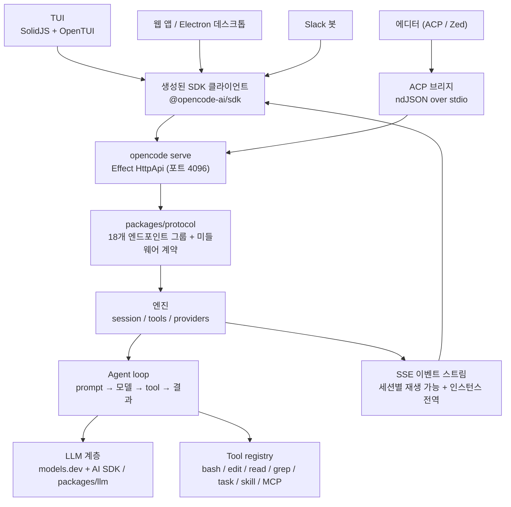
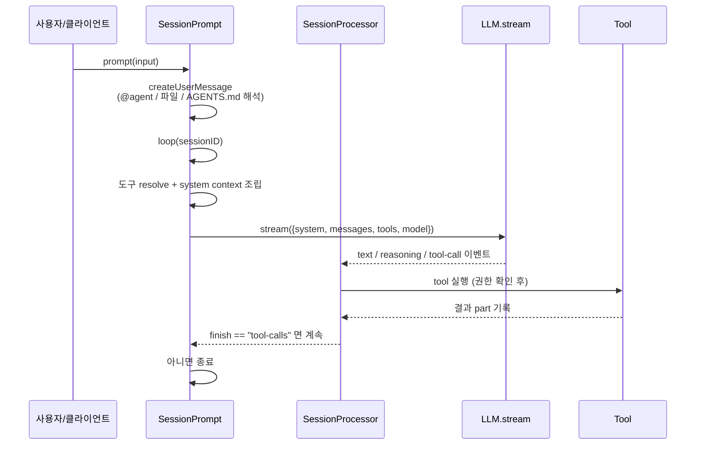
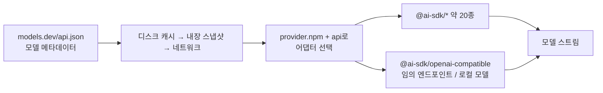
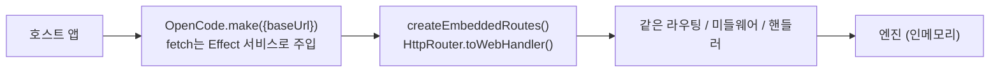

> 분석 일자: 2026-06-29
> 대상 패키지: `opencode-ai` `1.17.11`
> 대상 커밋: `beaaa174ea9c77984eec91d73f20dc161028bd8f` (`dev` 브랜치)
> 저장소: https://github.com/sst/opencode
> 로컬 분석 경로: `~/workspace/opensources/opencode`

---

_This article is partially written by Claude Code_

## 목차

1. [왜 OpenCode인가요?](#1-왜-opencode인가요)
2. [기존 글들과 어디에 놓이나요?](#2-기존-글들과-어디에-놓이나요)
3. [프로젝트를 한 문장으로 이해하기](#3-프로젝트를-한-문장으로-이해하기)
4. [기술 스택과 규모](#4-기술-스택과-규모)
5. [전체 그림: 하나의 엔진, 여러 개의 앞문](#5-전체-그림-하나의-엔진-여러-개의-앞문)
6. [코드베이스 지도: 레거시와 V2가 공존합니다](#6-코드베이스-지도-레거시와-v2가-공존합니다)
7. [헤드리스 서버: 클라이언트는 갈아끼우는 부품입니다](#7-헤드리스-서버-클라이언트는-갈아끼우는-부품입니다)
8. [Agent loop: prompt를 admission과 execution으로 나눕니다](#8-agent-loop-prompt를-admission과-execution으로-나눕니다)
9. [Provider 추상화: 모델은 코드가 아니라 데이터입니다](#9-provider-추상화-모델은-코드가-아니라-데이터입니다)
10. [직접 만든 LLM 계층: AI SDK를 걷어내고 프로토콜을 4축으로 쪼갭니다](#10-직접-만든-llm-계층-ai-sdk를-걷어내고-프로토콜을-4축으로-쪼갭니다)
11. [Tool 시스템과 MCP](#11-tool-시스템과-mcp)
12. [Skills와 Subagents](#12-skills와-subagents)
13. [Embedded OpenCode: 네트워크 없는 같은 서버](#13-embedded-opencode-네트워크-없는-같은-서버)
14. [보안과 운영 지점](#14-보안과-운영-지점)
15. [Qwen Code와 비교: provider-agnostic의 값과 비용](#15-qwen-code와-비교-provider-agnostic의-값과-비용)
16. [코드를 읽는 추천 순서](#16-코드를-읽는-추천-순서)
17. [인상적인 설계 포인트](#17-인상적인-설계-포인트)
18. [주의해서 볼 지점](#18-주의해서-볼-지점)
19. [결론](#19-결론)

---

## 1. 왜 OpenCode인가요?

OpenCode는 README에서 자신을 한 문장으로 설명합니다. **"The open source AI coding agent."** 랜딩 페이지는 여기에 한 줄을 더합니다. "Use any model — Supports 75+ LLM providers through Models.dev, including local models."

겉보기에는 [Qwen Code](/kb/2026-05-17-qwen-code-architecture)나 Claude Code 같은 또 하나의 터미널 코딩 에이전트입니다. 하지만 저장소를 열면 두 가지가 다릅니다.

첫째, OpenCode는 **provider-agnostic을 극단까지 밀어붙입니다.** 모델 메타데이터를 코드에 직접 적어 넣지 않고 외부 레지스트리(`models.dev`)에서 가져오며, CONTRIBUTING 문서는 아예 이렇게 적습니다. "새 provider는 코드 변경이 (있다면) 거의 없어야 한다 — models.dev에 PR을 보내라." 모델을 추가하는 일이 코드 수정이 아니라 **데이터 수정**입니다.

둘째, OpenCode는 **헤드리스 서버 하나에 여러 front-end가 붙는 구조**입니다. 문서의 표현을 빌리면 "`opencode serve`는 OpenAPI 엔드포인트를 노출하는 헤드리스 HTTP 서버를 띄우고, opencode 클라이언트가 거기에 붙는다"입니다(기본 포트 4096). 터미널 TUI, 웹 앱, Electron 데스크톱, Slack 봇, 에디터(ACP)가 모두 같은 엔진에 attach합니다.

그래서 OpenCode를 "여러 모델을 쓰는 CLI"라고만 보면 핵심을 놓칩니다. 더 정확하게는 **모델도 클라이언트도 갈아끼울 수 있게 만든, Effect 기반 헤드리스 코딩 에이전트 엔진**입니다.

## 2. 기존 글들과 어디에 놓이나요?

최근 분석한 코딩 에이전트/AI 인프라 글들과 비교하면 OpenCode가 어디에 놓이는 프로젝트인지 분명해집니다.

| 글                                                     | 중심 문제                                     | OpenCode와의 관계                                                                                                                       |
| ------------------------------------------------------ | --------------------------------------------- | --------------------------------------------------------------------------------------------------------------------------------------- |
| [Qwen Code](/kb/2026-05-17-qwen-code-architecture)     | 터미널 코딩 에이전트를 plugin/daemon으로 확장 | Qwen Code가 Qwen/DashScope를 전면에 둔 단일 vendor 런타임이라면, OpenCode는 모델·클라이언트 양쪽을 분리한 provider-agnostic 엔진입니다. |
| [OpenHands](/kb/2026-05-17-openhands-architecture)     | 코딩 에이전트를 웹 제품과 sandbox로 운영      | OpenHands가 app server/sandbox로 어디까지가 제품인지 가른다면, OpenCode는 헤드리스 HTTP 엔진과 생성된 SDK로 그 선을 긋습니다.           |
| [Dify](/kb/2026-05-17-dify-architecture)               | LLM 앱 개발과 workflow/RAG 제품화             | Dify가 LLM 앱 플랫폼이라면, OpenCode는 개발자의 로컬 저장소에서 코드를 직접 다루는 코딩 agent runtime입니다.                            |
| [Ruflo](/kb/2026-05-17-ruflo-architecture)             | Claude Code 주변 orchestration 계층           | Ruflo가 Claude Code 외부에 운영 계층을 붙인다면, OpenCode는 엔진 자체를 헤드리스로 두어 외부가 attach하게 만듭니다.                     |
| [Superpowers](/kb/2026-04-18-superpowers-architecture) | agent에게 절차와 skill을 강제하는 문서 시스템 | OpenCode의 Skills는 `SKILL.md` 기반 discoverable capability로, Superpowers류 지식을 자체 runtime 안에서 다룹니다.                       |

OpenCode는 "모델 provider 교체"만으로 설명되지 않습니다. Qwen Code 글에서 어디까지가 제품인지 가른 것은 `ToolRegistry`, `CoreToolScheduler`, `qwen serve`였습니다. OpenCode에서 그 선은 **`models.dev` 레지스트리, 자체 `packages/llm` 프로토콜 계층, `packages/protocol` HTTP 계약, 그리고 생성된 SDK**입니다. 이름은 비슷한 터미널 코딩 에이전트지만, 무엇을 떼어내 분리하느냐가 다릅니다.

## 3. 프로젝트를 한 문장으로 이해하기

**OpenCode**는 Bun 기반 TypeScript monorepo로, Effect로 작성된 헤드리스 HTTP 엔진 위에 SolidJS TUI, 웹/데스크톱 UI, Slack 봇, 에디터(ACP) 연동을 올리고, 모델 메타데이터를 `models.dev`로 외부화해 **어떤 LLM provider든 데이터로 붙이는 provider-agnostic 코딩 에이전트**입니다.

질문으로 바꾸면 다음과 같습니다.

| 질문                             | OpenCode의 답                                                                                                                |
| -------------------------------- | ---------------------------------------------------------------------------------------------------------------------------- |
| 사용자는 어디에서 대화하나요?    | SolidJS+OpenTUI 터미널 UI, 웹 앱, Electron 데스크톱, Slack, 에디터(ACP/Zed) — 모두 서버에 attach합니다.                      |
| 실제 agent loop는 어디 있나요?   | 레거시는 `packages/opencode/src/session/prompt.ts`의 `SessionPrompt.loop`, V2는 `packages/core`의 `SessionRunner`입니다.     |
| 도구는 어떻게 등록되나요?        | 레거시는 `tool/registry.ts`가 provider별로 builtin을 필터링하고, V2는 tool이 Effect Layer로 자기 등록합니다.                 |
| 모델 provider는 어떻게 바꾸나요? | `models.dev/api.json`에서 모델 메타데이터를 받아 매칭되는 `@ai-sdk/*` 어댑터를 선택합니다. 추가는 models.dev에 PR입니다.     |
| 클라이언트는 어떻게 붙나요?      | `opencode serve`가 띄운 HTTP 엔진(포트 4096)에 생성된 SDK 클라이언트로 attach합니다.                                         |
| 위험한 tool call은요?            | wildcard permission rule(allow/deny/ask), read-only `plan` 에이전트, tool 출력 상한, doom-loop 가드가 막습니다.              |
| 외부에서 쓸 수 있나요?           | `opencode serve` HTTP + OpenAPI, `@opencode-ai/sdk`, ACP(에디터), Slack 봇, 그리고 네트워크 없는 embedded 모드까지 있습니다. |

## 4. 기술 스택과 규모

| 영역            | 기술                                                                                             |
| --------------- | ------------------------------------------------------------------------------------------------ |
| 런타임          | **Bun 1.3+** (`packageManager: bun@1.3.14`). Node는 컴파일된 바이너리를 띄우는 shim 역할         |
| 언어/도구       | TypeScript, ESM, **oxlint**(eslint 아님), prettier(세미콜론 없음, width 120)                     |
| 핵심 프레임워크 | **Effect 4** — 618개 소스 파일이 `effect`를 import. 서비스·레이어·스키마·HTTP·SQL이 모두 Effect  |
| 데이터          | **Drizzle ORM** + SQLite (`@effect/sql-sqlite-bun`), snake_case 컬럼 규칙                        |
| HTTP/API        | Effect `HttpApi`/`HttpRouter` + `OpenApi` (에이전트 서버는 **Hono를 쓰지 않습니다**)             |
| LLM             | **Vercel AI SDK**(`ai@6`) + 약 20개 `@ai-sdk/*` 패키지, 그리고 자체 `packages/llm`               |
| TUI             | **SolidJS + OpenTUI** (`.tsx`를 터미널에 렌더)                                                   |
| Web/Desktop     | SolidJS(`app`/`session-ui`/`ui`), SolidStart, Astro+Starlight(docs), **Electron** 데스크톱       |
| 빌드/모노레포   | **Bun workspaces + Turborepo**                                                                   |
| MCP             | `@modelcontextprotocol/sdk`                                                                      |
| Infra           | **SST v4**, Cloudflare 중심 + AWS/Stripe/PlanetScale/Honeycomb                                   |
| 배포            | `curl … /install \| bash`, npm `opencode-ai`, Homebrew, Scoop/Choco, AUR, Nix, 데스크톱 인스톨러 |

로컬 체크아웃 기준 규모는 다음과 같습니다.

| 항목                             |    수치 |
| -------------------------------- | ------: |
| Git 추적 파일 수                 | 6,020개 |
| `packages/opencode/src` (레거시) |   400개 |
| `packages/core/src` (V2)         |   322개 |
| `packages/llm/src`               |    55개 |
| `packages/tui`                   |   237개 |

규모도 크지만, 더 인상적인 것은 **패키지 분리의 밀도**입니다. `packages/` 아래에 30개가 넘는 패키지가 있고, 그중 다수가 "엔진 / 프로토콜 / 클라이언트 / 스키마"를 명확히 나눈 결과입니다.

## 5. 전체 그림: 하나의 엔진, 여러 개의 앞문

OpenCode의 큰 그림은 "여러 클라이언트가 하나의 헤드리스 엔진에 붙는다"입니다.

여기서 핵심은 화살표의 방향입니다. 사용자가 마주하는 모든 화면(TUI·웹·데스크톱·Slack·에디터)이 결국 **같은 HTTP 계약 하나**로 모입니다. 그래서 새 클라이언트를 붙이는 일이 "엔진을 다시 짜는" 게 아니라 "SDK로 attach하는" 일이 됩니다.

## 6. 코드베이스 지도: 레거시와 V2가 공존합니다

OpenCode를 읽을 때 가장 먼저 알아야 할 사실은, **이 저장소가 마이그레이션 중**이라는 점입니다. 두 세대가 동시에 존재합니다.

- **레거시 세대** — `packages/opencode/src/*` (약 400개 파일). 현재 배포되는 `opencode` 바이너리의 비즈니스 로직, 서버, yargs CLI, ACP, MCP 클라이언트가 여기 모여 있습니다.
- **V2 (Effect-native) 세대** — `packages/{core, server, protocol, client, llm, schema, sdk-next, cli}`로 쪼개져 있습니다. 더 엄격한 계층 분리를 목표로 다시 쓰는 중입니다.

핵심 패키지를 정리하면 다음과 같습니다.

| 패키지              | 역할                                                                                                                          | 계층          |
| ------------------- | ----------------------------------------------------------------------------------------------------------------------------- | ------------- |
| `packages/opencode` | **레거시 메인 패키지 + 배포 바이너리**: agent 로직 + 서버 + CLI + ACP + MCP 클라이언트                                        | Core (레거시) |
| `packages/core`     | **V2 Effect 엔진**: session, system-context, tools, providers, catalog, credentials                                           | Core (V2)     |
| `packages/llm`      | **직접 만든 provider-agnostic LLM 계층** (protocol/route/provider/transport 4축)                                              | Core (V2)     |
| `packages/schema`   | Effect `Schema`로 정의한 도메인 타입 묶음(Session/Message/Model/Permission/Tool/Event…) — 다른 패키지가 참조하는 맨 아래 계층 | Core (V2)     |
| `packages/protocol` | **권위 있는 HTTP API 계약** — 18개 엔드포인트 그룹 + 미들웨어 배치                                                            | Core (V2)     |
| `packages/server`   | **V2 HTTP 서버**: Protocol 그룹을 호스팅하고 미들웨어/서비스 레이어를 연결                                                    | Core (V2)     |
| `packages/client`   | Protocol에서 **생성된** HTTP 클라이언트(Promise 판 + Effect 판)                                                               | Core (V2)     |
| `packages/sdk`      | 레거시 배포 SDK `@opencode-ai/sdk` (OpenAPI 생성)                                                                             | Core          |
| `packages/sdk-next` | **Embedded OpenCode**: 서버 라우터를 인메모리로 실행(네트워크 없음)                                                           | Core (V2)     |
| `packages/tui`      | SolidJS+OpenTUI 터미널 UI (SDK + SSE로 서버에 연결)                                                                           | Core          |
| `packages/cli`      | V2 Effect CLI(`lildax` 바이너리): `serve`, `service` 데몬, `migrate`                                                          | Core (V2)     |
| `packages/plugin`   | `@opencode-ai/plugin` 훅/계약 (tool hook, auth provider, workspace adapter)                                                   | Core          |

그 밖에 `app`/`session-ui`/`ui`(SolidJS 웹), `desktop`(Electron), `web`(문서), `enterprise`/`console`/`stats`(클라우드), `slack`, `containers`, `http-recorder`(VCR 방식 테스트), `httpapi-codegen`(SDK 생성기) 같은 **주변 패키지**가 있습니다.

> ⚠️ 분석 한계: 현재 배포되는 `opencode-ai` 바이너리가 레거시(`packages/opencode`)에서 빌드되는지 V2에서 빌드되는지는 저장소만으로 100% 확정하지 못했습니다. 버전 `1.17.11`이 `packages/opencode/package.json`에 있고 CONTRIBUTING이 레거시 `bin/opencode`를 가리키는 점으로 보아, **레거시가 아직 배포 경로이고 V2는 이행 중**으로 읽는 것이 안전합니다.

## 7. 헤드리스 서버: 클라이언트는 갈아끼우는 부품입니다

OpenCode의 모든 인터페이스는 **헤드리스 Effect `HttpApi`** 하나를 통과합니다. `opencode serve`가 이 엔진을 띄우고, 클라이언트는 생성된 SDK로 붙습니다.

V2의 `packages/protocol`은 18개 엔드포인트 그룹을 정의합니다(Session, Message, Model, Provider, FileSystem, Pty, Permission, Question, Skill, Event, Command, Reference, Integration, Credential, Project, Location, Health, Agent). `packages/server`가 이 계약을 호스팅하면서 미들웨어 스택을 차례로 연결합니다(`handlers → sessionLocation → location → authorization → schemaError → auth`).

특히 중요한 두 가지가 있습니다.

- **계층 규칙을 코드가 강제합니다.** 런타임 의존성은 `Schema → Core·Protocol → Server` 방향으로만 흐르고, **Client는 Core/Server를 절대 import하지 않습니다.** 브라우저에서 안전하게 번들되도록 import 경계 테스트까지 둡니다.
- **클라이언트는 손으로 쓰지 않고 생성합니다.** `packages/client`의 `src/generated`(Promise)와 `src/generated-effect`(Effect, 스트리밍)는 `bun run generate`로 Protocol에서 뽑아냅니다. 즉 API 계약이 단일 진실의 원천이고, SDK는 거기서 파생됩니다.

이벤트는 두 개의 SSE 스트림으로 나갑니다. 세션별 재생 가능한 스트림(`GET /api/session/:id/event?after=`)과 인스턴스 전역 실시간 스트림(`GET /api/event`)입니다. 덕분에 클라이언트가 중간에 붙어도 놓친 이벤트를 재생할 수 있습니다.

[OpenHands](/kb/2026-05-17-openhands-architecture)가 app server와 sandbox로 제품의 윤곽을 잡는다면, OpenCode는 **HTTP 계약과 생성된 SDK**로 그 윤곽을 잡습니다. "서버 하나, 클라이언트 여럿"이 단순한 구호가 아니라 패키지 의존 그래프가 떠받칩니다.

## 8. Agent loop: prompt를 admission과 execution으로 나눕니다

### 레거시 루프

레거시 세션 흐름은 `packages/opencode/src/session/prompt.ts`에 모여 있고, 전부 Effect로 쓰여 있습니다.

한 step마다: 압축되지 않은 메시지를 모으고 → 새 assistant 메시지를 만들고 → 도구를 resolve하고 → skill·environment·instruction·mcp로 system context를 조립한 뒤 → `LLM.stream()`으로 모델을 스트리밍합니다. assistant의 `finish`가 `tool-calls`인 동안 루프가 돌고, 아니면 종료합니다. **doom-loop 가드**도 있어, 동일한 tool call이 3회 연속이면 강제로 permission을 묻습니다. 컨텍스트가 넘치면(`isOverflow`) 요약을 끼워 넣어 히스토리를 잘라냅니다(compaction).

### V2 루프: admission ≠ execution

V2(`packages/core`)는 `CONTEXT.md`에 줄글로 꼼꼼히 적어 둔 더 엄격한 모델을 씁니다. 핵심은 **"prompt를 받는 것(admission)과 실행하는 것(execution)을 분리"** 한다는 점입니다.

- `SessionV2.prompt(...)`는 먼저 `session_input` 한 줄을 **durable하게 기록**하고(`PromptAdmitted` 이벤트 발행), 그 다음 실행을 깨웁니다.
- 프로세스 로컬의 직렬화된 `SessionRunCoordinator`가 wake를 합치고, `SessionRunner`가 쌓인 입력을 차례로 비워 내면서 admitted input을 "안전한 provider-turn 경계"에서만 사용자 메시지로 승격시킵니다. 그리고 **provider turn마다 정확히 한 번 `llm.stream(request)`** 를 호출하며, 매 turn 히스토리를 처음부터 다시 읽어 들입니다(인메모리 tool 루프가 아님).
- 전달 의미도 명시적입니다. prompt는 기본적으로 **steer**(현재 흐름에 끼어듦)하고, **queue**는 idle이 될 때까지 대기합니다.

이 설계의 의도는 **크래시 복구**입니다. 인메모리 상태가 아니라 이벤트에서 세션을 재구성할 수 있으므로, 도중에 죽어도 durable한 admission 기록에서 다시 시작할 수 있습니다.

또 하나, V2의 **System Context 대수(algebra)** 가 흥미롭습니다(`core/src/system-context/`). 타입이 붙은 Context Source들을 합쳐 epoch마다 불변의 baseline system context를 만들고, 소스가 바뀌면 `reconcile()`이 **하나의 mid-conversation system message** 를 발행합니다(예: AGENTS.md 변경, 날짜, 사용 가능한 skill 변화). 첫 번째 소스는 `instruction-context.ts`로, 상위 디렉터리를 거슬러 올라가며 `AGENTS.md`와 전역 설정을 수집합니다.

## 9. Provider 추상화: 모델은 코드가 아니라 데이터입니다

OpenCode의 정체성은 여기에 있습니다. "75+ provider 지원"은 두 메커니즘이 함께 만듭니다.

### models.dev 레지스트리 (배포되는 경로)

문서는 이렇게 적습니다. "OpenCode는 AI SDK와 Models.dev를 써서 75개 이상의 LLM provider를 지원한다." 여기서 **모델 메타데이터를 코드에 직접 적어 넣지 않는다**는 것이 핵심입니다.

- `core/src/models-dev.ts`가 `https://models.dev/api.json`을 가져옵니다(`OPENCODE_MODELS_URL`로 교체 가능, 2회 재시도/10초 타임아웃).
- **디스크 캐시 → 내장 스냅샷 → 네트워크** 폴백 체인을 두고, 60분마다 백그라운드로 갱신합니다. 오프라인에서도 내장 스냅샷으로 동작합니다.
- 각 모델 엔트리가 자신의 `provider.npm` 패키지와 `api`를 명시하고, 거기에 맞는 `@ai-sdk/*` 어댑터가 선택됩니다.

그래서 provider 추가가 **OpenCode 코드 수정이 아니라 models.dev에 PR**이 됩니다. 저장소에는 약 20개의 `@ai-sdk/*` 패키지(anthropic, openai, google, bedrock, azure, groq, mistral, cohere, xai…)와 임의의 OpenAI 호환 엔드포인트를 받는 `@ai-sdk/openai-compatible`가 들어 있습니다. 다만 이 중 `@ai-sdk/provider`, `provider-utils`, `gateway`, `vercel`는 공통 유틸·게이트웨이라, 실제 모델 provider 어댑터 수는 그보다 적습니다. "75+"는 이 어댑터들 + models.dev 카탈로그 + 무제한 OpenAI 호환 엔드포인트가 함께 만드는 숫자입니다.

> ⚠️ "75+"는 models.dev 카탈로그(모델 엔트리)에 근거한 마케팅 수치이며, 저장소 내 `@ai-sdk/*` 패키지는 약 20개(그중 일부는 provider가 아닌 공통 유틸) + 자체 `packages/llm` provider + 무제한 OpenAI 호환 엔드포인트입니다. models.dev 카탈로그 자체를 일일이 세지는 않았습니다.

## 10. 직접 만든 LLM 계층: AI SDK를 걷어내고 프로토콜을 4축으로 쪼갭니다

V2에는 더 과감한 선택이 있습니다. `packages/llm`은 Vercel AI SDK를 **직접 만든 멀티-프로토콜 계층으로 대체**하려는 시도입니다. 진입점은 `llm.stream(request)` 하나이고, 경로(route)는 실행 중에 그때그때 갈라지는 게 아니라 **설정 시점에 미리 결정**됩니다. 서로 겹치지 않는 네 축으로 쪼개져 있습니다.

| 축               | 내용                                                                                                                                                                                                                                                      |
| ---------------- | --------------------------------------------------------------------------------------------------------------------------------------------------------------------------------------------------------------------------------------------------------- |
| **Protocols**    | wire 수준 인코더/스트림 파서: `anthropic-messages`, `bedrock-converse`(+바이너리 event-stream), `gemini`, `openai-chat`, `openai-compatible-chat`, `openai-responses`                                                                                     |
| **Route**        | Protocol + Endpoint(baseURL/query) + **Auth**(API key, bearer, env, AWS **SigV4**, custom header) + Framing/Transport(SSE / 바이너리 EventStream / WebSocket) 조합                                                                                        |
| **Providers**    | `anthropic, amazon-bedrock, azure, cloudflare(AI Gateway+Workers AI), github-copilot, google, openai(chat/responses/WebSocket), openrouter, xai` + 일반 OpenAI 호환 프로파일 테이블(baseten, cerebras, deepinfra, deepseek, fireworks, groq, togetherai…) |
| **Cache policy** | `anthropic-messages`와 `bedrock-converse`만 inline 캐시 힌트를 적용하고, OpenAI/Gemini는 암묵적 prefix 캐싱에 의존                                                                                                                                        |

흥미로운 점은 **의존성이 거의 없다**는 것입니다. `packages/llm`은 `effect`, `aws4fetch`, smithy eventstream 코덱 정도에만 의존합니다. 덕분에 schema/protocol 패키지가 DB나 네이티브 모듈에 엮이지 않습니다. 단, `packages/core`는 `@opencode-ai/llm`과 `@ai-sdk/*`를 **둘 다** 의존합니다(이행 중이라는 증거입니다).

이 계층이 [Qwen Code](/kb/2026-05-17-qwen-code-architecture)와의 결정적 차이입니다. Qwen Code도 OpenAI 호환/Anthropic/Gemini를 다루지만, 결국 vendor SDK 위에 ContentGenerator를 얹습니다. OpenCode는 **wire 프로토콜(Anthropic Messages, Bedrock Converse 바이너리 프레이밍, OpenAI Responses WebSocket)과 서로 다른 인증 방식(SigV4, OAuth/Copilot, bearer)을 직접** 다룹니다.

## 11. Tool 시스템과 MCP

**레거시 tool 정의**(`tool/tool.ts`)는 `{id, description, parameters(zod), execute(args, ctx)}` 형태이고, `Context`로 `{sessionID, messageID, agent, abort, ask()}` 등을 받습니다. 빌트인은 `tool/registry.ts`에서 **provider/model별로 필터링**됩니다(예: GPT 계열은 `edit`/`write` 대신 `ApplyPatch`를 쓰고, `websearch`는 provider에 따라 막힙니다). 빌트인 목록은 bash/read/write/edit/glob/grep(ripgrep)/webfetch/websearch/todo/**task**(서브에이전트 spawn)/skill/patch이고(디렉터리 나열은 별도 `ls` 도구 없이 `read` 도구가 겸합니다), 각 도구의 프롬프트 텍스트는 옆 `.txt` 파일에 둡니다. 실행은 AI SDK의 `tool()`로 감싸고, 플러그인 훅 `tool.execute.before/after`를 호출합니다.

**V2 tool 정의**(`core/src/tool/tool.ts`)는 `Tool.make({input: Schema, output: Schema, execute})` 형태로, 도구가 Effect **Layer로 자기 등록**합니다(`Tools.Service`). `ToolRegistry.materialize(permissions?)`가 권한으로 필터링한 정의 집합을 돌려줍니다.

**tool 출력 안전장치**가 특히 눈에 띕니다(`core/src/tool-output-store.ts`). 결과를 `MAX_LINES=2000` / `MAX_BYTES=50KB`로 상한을 두고, 넘치면 head+tail로 자른 뒤 나머지는 관리되는 `tool-output/` 디렉터리에 흘려보내고(7일 보존) 그 경로만 모델에게 알려줍니다. 거대한 도구 출력이 컨텍스트를 통째로 잡아먹는 문제를 구조적으로 막습니다.

**MCP**는 주로 레거시(`packages/opencode/src/mcp/`)에 있습니다. `@modelcontextprotocol/sdk`로 stdio(로컬)와 remote(StreamableHTTP→SSE 폴백, OAuth 처리) transport를 다루고, MCP 서버 instruction을 system prompt에 주입하며(`<mcp_instructions>`), 리소스 도구 3종을 조건부로 등록합니다. V2에는 MCP **설정**을 잇는 코드만 있고, 실제 클라이언트 구현은 레거시에 있습니다.

> ⚠️ V2의 MCP/플러그인은 아직 레거시와 동등하지 않습니다. `CONTEXT.md`는 V2 플러그인이 레거시의 일부 훅에 대응물이 없다고 명시합니다. V2 MCP/plugin은 "parity 미달"로 보는 게 맞습니다.

## 12. Skills와 Subagents

**Skill**은 `SKILL.md`(frontmatter `{name, description}` + 본문)입니다. `{skill,skills}/**/SKILL.md`와 `.claude`/`.agents` 디렉터리에서 발견되고, 모델에게는 **이름과 설명만** `<available_skills>` 컨텍스트로 노출됩니다. 본문은 권한이 확인된 `skill` 도구를 통해 필요할 때 로딩됩니다. OpenCode 설정을 편집할 때 자기 자신을 주입하는 빌트인 `customize-opencode` skill도 있습니다.

이 구조는 [Superpowers](/kb/2026-04-18-superpowers-architecture)의 "지연 로딩되는 skill"과 같은 철학입니다. 이름/설명만 먼저 보여주고 본문은 필요할 때 펼치는 방식이 동일합니다.

**Subagent**는 빌트인 **build**(기본, 풀 액세스), **plan**(읽기 전용, 편집 거부, bash 전 확인), **general**(`@general`로 호출)이 있습니다. 에이전트는 `mode(primary|subagent|all)`, `permission` 규칙, `model`, `prompt`, `temperature`, `steps`를 가집니다. **`task`** 도구가 좁혀진 권한으로 서브에이전트 세션을 spawn하고, 백그라운드 서브에이전트는 실험 플래그(`OPENCODE_EXPERIMENTAL_BACKGROUND_SUBAGENTS`)로 열립니다. 저장소 자신도 `.opencode/` 아래 커스텀 에이전트/커맨드를 두고 dogfooding합니다.

## 13. Embedded OpenCode: 네트워크 없는 같은 서버

가장 영리한 설계 중 하나가 `packages/sdk-next`의 **Embedded OpenCode**입니다. 서버의 `HttpRouter`를 `toWebHandler()`로 감싸 `fetch` 함수로 만들고, 그 `fetch`를 그대로 클라이언트에 넘깁니다.

결과적으로 **원격 서버에 attach할 때와 완전히 똑같은 SDK 인터페이스**를, 네트워크 I/O 없이 인프로세스로 쓸 수 있습니다. "서버 하나, 클라이언트 여럿"이라는 원칙을 극단까지 밀면, 네트워크조차 선택 사항이 됩니다.

## 14. 보안과 운영 지점

다루는 도구가 많은 만큼 보안 장치도 여러 층입니다.

| 층                 | 장치                                                                                |
| ------------------ | ----------------------------------------------------------------------------------- |
| Permission         | wildcard 규칙으로 allow/deny/ask 판정. 거부 시 `RejectedError`                      |
| 읽기 전용 에이전트 | `plan` 에이전트는 편집을 거부하고 bash 전 확인합니다                                |
| Subagent 권한      | `task`로 spawn되는 서브에이전트는 **좁혀진(derived) 권한**을 받습니다               |
| Tool 출력 상한     | 2000줄/50KB 상한 + overflow를 만료되는 디스크 store로 흘려보냄                      |
| Doom-loop 가드     | 동일 tool call 3회 연속이면 permission 강제                                         |
| 서버 인증          | HTTP Basic(`OPENCODE_SERVER_PASSWORD`) + `auth_token` 쿼리                          |
| 운영/문화          | VCR 방식 `http-recorder`로 결정적 LLM 테스트, `vouch`/`denounce` 기여자 신뢰 시스템 |

특히 `http-recorder`(HTTP/WebSocket 카세트 record/replay)는 LLM 호출이 들어가는 테스트를 결정적으로 만들기 위한 장치로, 비결정적 외부 의존성을 다루는 좋은 사례입니다.

## 15. Qwen Code와 비교: provider-agnostic의 값과 비용

이 글의 출발점이 "Qwen Code와의 대조"였으니, 정리해 두겠습니다.

| 축            | [Qwen Code](/kb/2026-05-17-qwen-code-architecture) (단일 vendor) | OpenCode (provider-agnostic)                                                      |
| ------------- | ---------------------------------------------------------------- | --------------------------------------------------------------------------------- |
| 모델 결합     | Qwen/DashScope 전면, 사실상 한 엔드포인트 중심                   | models.dev로 메타데이터 외부화, ~20 provider + 임의 호환 엔드포인트               |
| provider 추가 | 코드 작업                                                        | **models.dev에 데이터 PR**                                                        |
| 인터페이스    | 본질적으로 하나의 터미널 앱                                      | 헤드리스 서버 + 생성 SDK에 TUI/웹/데스크톱/Slack/에디터가 attach                  |
| LLM 호출      | vendor SDK 위 ContentGenerator                                   | wire 프로토콜·인증을 직접 다루는 자체 `packages/llm`                              |
| 얻는 것       | 단순함, 한 모델에 깊게 최적화                                    | vendor 독립성, 가격·성능을 골라 쓰는 이점, 엔진 재사용, 결정적 테스트             |
| 치르는 비용   | vendor 정책 변화에 노출                                          | **높은 복잡도**(두 세대 공존, 4축 LLM 추상화, SDK 코드젠, 가파른 Effect 러닝커브) |

요지는 이렇습니다. **단일 vendor 에이전트는 더 단순하게 출시되고 한 모델을 더 세게 쥐어짤 수 있습니다.** OpenCode는 그 대신 폭(provider)·수명(vendor 독립)·플랫폼성(다른 front-end가 위에 올라탈 수 있음)을 택했고, 그 대가로 상당한 복잡도를 짊어집니다. 프롬프트와 도구가 여러 모델 family에 걸쳐 동작해야 하므로, 모델별 분기(GPT→`apply_patch`, provider-gated websearch)와 models.dev 메타데이터로 차이를 메웁니다.

## 16. 코드를 읽는 추천 순서

1. `README.md` / `packages/web/src/content/docs/index.mdx` — 프로젝트가 자신을 어떻게 규정하는지
2. `AGENTS.md` / `CONTEXT.md` — **계층 규칙과 V2 도메인 모델**(이 저장소 설계의 기준이 되는 문서입니다)
3. `packages/protocol/src/api.ts` — 18개 엔드포인트 그룹으로 본 "엔진이 바깥에 드러내는 부분"
4. `core/src/models-dev.ts` — 모델 메타데이터를 외부화하는 방식
5. `packages/llm/src/` (`route/`, `protocols/`) — 직접 만든 LLM 계층의 4축
6. 레거시 루프 `packages/opencode/src/session/prompt.ts` (`prompt` → `loop` → `runLoop`)
7. V2 루프 `packages/core/src/session/` (`input.ts` 입력 받기, `runner/` 처리)
8. `core/src/tool-output-store.ts` — tool 출력 상한 설계
9. `packages/sdk-next/src/opencode.ts` — Embedded OpenCode

## 17. 인상적인 설계 포인트

### 1. 모델 메타데이터를 외부 레지스트리로 hot-reload합니다.

`models.dev`를 외부 모델 카탈로그로 두고, 디스크 캐시→내장 스냅샷→네트워크 폴백으로 오프라인까지 버팁니다. provider-agnostic을 구호가 아니라 **데이터 파이프라인**으로 구현했습니다.

### 2. AI SDK를 걷어내고 LLM 계층을 직접 만듭니다.

`packages/llm`은 캐싱·인증·프레이밍을 서로 독립된 축으로 쪼갠 멀티-프로토콜 스택입니다(Bedrock용 SigV4, 바이너리 EventStream, OpenAI Responses WebSocket). 의존성을 극단적으로 줄여 schema/protocol을 깨끗하게 유지합니다.

### 3. Effect에 전면 투자하고, 도메인을 줄글로 풀어 적습니다.

서비스·레이어·스키마·HTTP·SQL이 모두 Effect입니다. 그리고 `CONTEXT.md`가 Context Epoch, Safe Provider-Turn Boundary, Admitted Prompt, Session Drain 같은 개념을 줄글로 정의합니다. **prompt admission을 execution과 분리**하고, 인메모리 상태가 아니라 이벤트에서 복구합니다.

### 4. 서버 하나에 클라이언트 여럿, 그리고 Embedded 모드.

TUI/CLI/데스크톱/Slack/ACP가 동일한 라우팅·미들웨어·코덱과 생성된 Promise/Effect 이중 SDK를 재사용합니다. Embedded OpenCode는 같은 라우터를 네트워크 없이 인프로세스로 돌립니다.

### 5. 계층 규칙을 테스트로 강제합니다.

`Schema → Core/Protocol → Server`, `Client는 Core/Server를 import하지 않음`을 import 경계 테스트가 강제합니다. 그래서 브라우저에서 안전하게 쓸 수 있는 클라이언트 번들이 규칙으로 보장됩니다.

## 18. 주의해서 볼 지점

### 1. 두 세대가 공존합니다.

레거시(`packages/opencode`)와 V2(`packages/core`+`cli`)가 동시에 존재하고, 둘 다 `opencode` 형태의 바이너리를 선언합니다. 어느 쪽이 지금 배포되는지는 저장소만으로 단정하기 어렵습니다(레거시가 유력). 코드를 읽을 때 **지금 보는 코드가 어느 세대인지** 먼저 확인해야 합니다.

### 2. "75+ provider"는 카탈로그 수치입니다.

저장소 내 `@ai-sdk/*` 패키지는 약 20개(그중 일부는 provider가 아닌 유틸) + 자체 provider + 무제한 OpenAI 호환 엔드포인트입니다. 75+는 models.dev 카탈로그가 만드는 숫자이지, 75개의 in-repo 어댑터가 아닙니다.

### 3. V2의 MCP/플러그인은 아직 parity가 아닙니다.

MCP 클라이언트 구현은 레거시에만 있고, V2에는 설정을 잇는 코드만 있습니다. 플러그인도 레거시 일부 훅에 대응물이 없습니다. V2 기준으로 MCP/plugin을 기대하면 안 됩니다.

### 4. Effect 러닝커브가 높습니다.

618개 파일이 Effect를 import합니다. 서비스/레이어/스키마/HTTP/SQL을 Effect로 읽을 수 있어야 코드가 보입니다. Qwen Code의 평범한 async/await 코드보다 진입 장벽이 분명히 큽니다.

### 5. 복잡도 자체가 비용입니다.

provider-agnostic·헤드리스·SDK 코드젠·두 세대 공존은 강력하지만, 단일 vendor 에이전트보다 훨씬 무겁습니다. 이 폭이 정말 필요한지는 사용 맥락에 달려 있습니다.

## 19. 결론

OpenCode는 "여러 모델을 쓰는 또 하나의 터미널 코딩 에이전트"보다 훨씬 큰 프로젝트입니다. 실제 구조는 **모델도 클라이언트도 갈아끼울 수 있게 분리한, Effect 기반 헤드리스 코딩 에이전트 엔진**입니다.

[Qwen Code](/kb/2026-05-17-qwen-code-architecture)가 Qwen/DashScope를 전면에 두고 터미널 런타임을 plugin/daemon으로 확장하는 쪽이라면, OpenCode는 두 개의 분리를 더 멀리 가져갑니다. 모델은 `models.dev`로, 클라이언트는 HTTP 계약과 생성 SDK로 분리합니다. 그 결과 provider를 추가하는 일이 데이터 PR이 되고, 새 front-end를 붙이는 일이 SDK attach가 됩니다.

OpenCode를 볼 때 가장 중요한 질문은 "어떤 모델을 쓰나요?"가 아닙니다. 더 중요한 질문은 다음입니다.

> 코딩 에이전트의 **모델**과 **클라이언트**를 모두 교체 가능한 부품으로 만들려면, 그 사이의 계약(모델 메타데이터, wire 프로토콜, HTTP API, SDK)을 어떻게 설계해야 하나요?

OpenCode의 답은 `models.dev` 레지스트리, `packages/llm`의 4축 프로토콜 계층, `packages/protocol`의 HTTP 계약, 그리고 생성된 SDK입니다. 이 경계들을 이해하면, OpenCode가 단순한 CLI가 아니라 **다른 도구들이 그 위에 올라탈 수 있는 코딩 에이전트 플랫폼**을 지향한다는 것이 보입니다. 동시에, 아직 두 세대가 공존하는 이행기의 저장소라는 점도 함께 기억해야 합니다.
