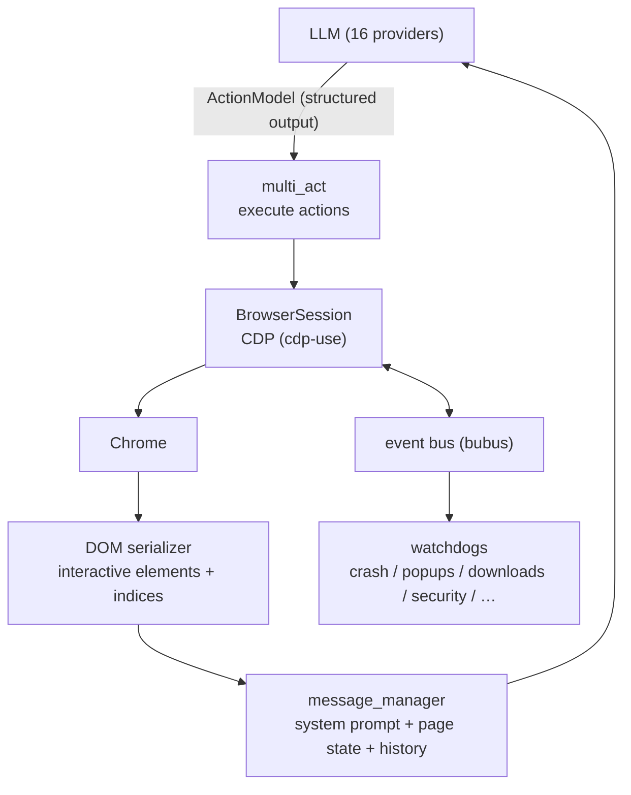
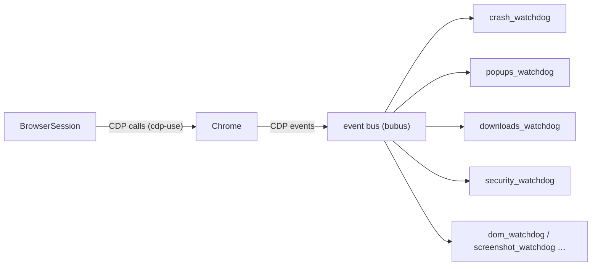
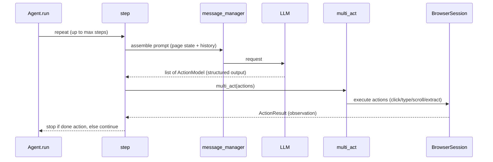

> Analysis date: 2026-06-30
> Target package: `browser-use` `0.13.2` (PyPI)
> Target commit: `2454d3e25` (`main` branch, 2026-06-28)
> Repository: https://github.com/browser-use/browser-use
> Local analysis path: `~/workspace/opensources/browser-use`

---

_This article is partially written by Claude Code_

## Table of Contents

1. [Why Browser Use?](#1-why-browser-use)
2. [Where Does It Sit Among the Previous Articles?](#2-where-does-it-sit-among-the-previous-articles)
3. [Understanding the Project in One Sentence](#3-understanding-the-project-in-one-sentence)
4. [Tech Stack and Scale](#4-tech-stack-and-scale)
5. [The Big Picture](#5-the-big-picture)
6. [Codebase Map](#6-codebase-map)
7. [How to Show a Page to an LLM: Indexed Elements](#7-how-to-show-a-page-to-an-llm-indexed-elements)
8. [The Browser Is CDP, Not Playwright](#8-the-browser-is-cdp-not-playwright)
9. [The Agent Loop and Actions](#9-the-agent-loop-and-actions)
10. [The LLM Provider Layer and Per-Model Prompts](#10-the-llm-provider-layer-and-per-model-prompts)
11. [The Rest of the Surface: MCP, Filesystem, CLI](#11-the-rest-of-the-surface-mcp-filesystem-cli)
12. [Comparison With Playwright: Why Does It Fit LLMs Better?](#12-comparison-with-playwright-why-does-it-fit-llms-better)
13. [A Recommended Reading Order](#13-a-recommended-reading-order)
14. [Notable Design Decisions](#14-notable-design-decisions)
15. [Things to Watch Out For](#15-things-to-watch-out-for)
16. [Conclusion](#16-conclusion)

---

## 1. Why Browser Use?

Browser Use introduces itself in one line under the logo: **"The AI browser agent."** It's a Python library in which an LLM opens a browser directly to click, type, scroll, read the screen, and decide its next move.

This blog earlier analyzed [Playwright](/kb/2026-04-17-playwright-architecture) and pointed out that, while Playwright is excellent for humans writing test code, it's slow and awkward to use with an LLM. The reason is the round trip: the LLM generates a selector, finds the element with it, and regenerates when it fails — and that's expensive.

Browser Use flips this problem head-on. There are three keys.

First, it **pre-chews the page so the LLM can read it easily.** It does not make the LLM write raw HTML or selectors. Instead, it picks only the clickable/typable elements and hands them over as a numbered list. The LLM says "click element 5" rather than authoring a selector.

Second, it **drives the browser via CDP, not Playwright.** It calls the Chrome DevTools Protocol directly and runs the session on top of an event bus and watchdogs. Without going through the Playwright runtime, it's lighter and faster.

Third, it **keeps the action vocabulary small.** It receives a fixed set of actions — click, type, scroll, navigate, extract, done — as structured output. The LLM doesn't write arbitrary code; it chooses among defined actions.

So if you see Browser Use only as "a library to automate a browser with an LLM," you've seen half of it. More precisely, it is **an agent that translates a web page into a form an LLM can handle, and drives the browser with a small action vocabulary on top of that.**

## 2. Where Does It Sit Among the Previous Articles?

This article continues the browser-automation thread.

| Article                                                                                       | Central problem                           | Relationship to Browser Use                                                                                                     |
| --------------------------------------------------------------------------------------------- | ----------------------------------------- | ------------------------------------------------------------------------------------------------------------------------------- |
| [Playwright](/kb/2026-04-17-playwright-architecture)                                          | The standard browser automation for E2E   | Where Playwright is an API for humans to write selectors, Browser Use gives the LLM indexed elements and drives via CDP.        |
| [Browser automation comparison](/kb/2026-04-16-browser-automation-comparison)                 | Comparing browser tools for use with LLMs | To the question that comparison raised — "what do you show the LLM?" — Browser Use is one concrete answer.                      |
| [OpenCode](/kb/2026-06-29-opencode-architecture) · [Cline](/kb/2026-06-30-cline-architecture) | Coding agents                             | Different domain (coding vs browser), but the skeleton — agent loop, action registry, multi-provider abstraction — is the same. |

The key is that Browser Use is not explained as "just another browser automation tool." In the Playwright article, the difficulty was "the round trip of the LLM authoring selectors." What fills that spot in Browser Use is **the DOM serializer (indexed interactive elements), direct CDP control, and a small action vocabulary.**

## 3. Understanding the Project in One Sentence

**Browser Use** is a Python agent library that serializes a web page into a form where clickable elements are numbered and hands it to an LLM, executes the actions the LLM picks via the Chrome DevTools Protocol, and runs the browser session with an event bus and watchdogs — an **AI browser agent.**

As questions:

| Question                       | Browser Use's answer                                                                                  |
| ------------------------------ | ----------------------------------------------------------------------------------------------------- |
| How does the LLM see the page? | `dom/serializer` picks only the interactive elements and serializes them into a numbered list.        |
| How does the LLM act?          | It emits defined actions (click/type/scroll/extract/done) as a structured `ActionModel`.              |
| What drives the browser?       | It calls **CDP** (`cdp-use`) directly. Not Playwright.                                                |
| How is browser state managed?  | 14 watchdogs attach to the event bus (`bubus`) and monitor crashes, popups, downloads, security, etc. |
| Where is the agent loop?       | `Agent.run()` → `step()` → `multi_act()` in `agent/service.py`.                                       |
| Which models does it use?      | It abstracts 16 providers under `llm/` (anthropic, openai, google, groq, ollama, …).                  |
| Can other agents use it?       | Via `mcp/` it becomes an MCP server, so other LLM agents can borrow its browser capability.           |

## 4. Tech Stack and Scale

| Area            | Technology                                                               |
| --------------- | ------------------------------------------------------------------------ |
| Language        | **Python** (`py.typed`, Pydantic models)                                 |
| Browser control | **Chrome DevTools Protocol** (`cdp-use`) — no Playwright                 |
| Events          | **`bubus`** event bus + 14 **watchdogs**                                 |
| DOM             | `dom/serializer` — interactive-element extraction, paint order, indexing |
| LLM             | `llm/` — 16-provider abstraction (`base.py`), per-model system prompts   |
| Actions         | `tools/registry` — a structured action registry                          |
| Extensions      | MCP, filesystem, skills, CLI, cloud/sync                                 |
| Ops             | token/cost tracking, observability, GIF recording, LLM judge             |
| Distribution    | PyPI `browser-use`, Docker, CLI                                          |

The scale of the local checkout:

| Item                     |  Count |
| ------------------------ | -----: |
| Git-tracked files        |    501 |
| Python files             |    387 |
| LLM provider directories |     16 |
| Browser watchdogs        |     14 |
| `agent/service.py` lines | ~4,100 |

## 5. The Big Picture

One Browser Use step is a cycle of "turn the page into a form the LLM can read → the LLM picks actions → the browser executes → read the new page again."

The heart of the cycle is the top two arrows. The LLM looks at the prompt that message_manager builds (including the indexed element list), emits an `ActionModel`, and `multi_act` executes it in the browser. Down below, the CDP session exchanges signals with the watchdogs through the event bus.

## 6. Codebase Map

The heart of the `browser_use/` package:

| Module                                        | Purpose                                                                       |
| --------------------------------------------- | ----------------------------------------------------------------------------- |
| `agent/service.py`                            | **The agent body.** The `Agent.run`/`step`/`multi_act` loop (~4,100 lines)    |
| `agent/message_manager`                       | Prompt assembly — system prompt + page state + history                        |
| `agent/system_prompts`                        | Per-model-class system prompt variants (flash / no-thinking / anthropic …)    |
| `dom/serializer`                              | **Page serialization** — `clickable_elements`, `paint_order`, `serializer`    |
| `dom/service.py`                              | DOM tree extraction and enhanced snapshot                                     |
| `browser/session.py`                          | **The CDP browser session** and events                                        |
| `browser/watchdogs`                           | 14 watchdogs (crash·popups·downloads·captcha·security·screenshot·dom·…)       |
| `tools/`                                      | **The action registry** and action implementations (click·type·extract, etc.) |
| `llm/`                                        | 16-provider abstraction (`base.py`, `messages.py`, `models.py`)               |
| `mcp/`                                        | MCP server/client                                                             |
| `filesystem/` · `skills/` · `cli.py`          | File access, skills, terminal entry point                                     |
| `tokens/` · `telemetry/` · `observability.py` | Cost tracking and observability                                               |

The first place to look is `dom/serializer/clickable_elements.py`. It decides "what to show the LLM as a clickable element," and that decision defines Browser Use's identity.

## 7. How to Show a Page to an LLM: Indexed Elements

This is the most important decision in Browser Use. The LLM does not see raw HTML. Instead it receives the page as **a numbered list of interactive elements.**

The flow:

1. **DOM tree extraction** — it fetches the page's DOM as an `EnhancedDOMTreeNode` tree via CDP (`dom/service.py`).
2. **Interactivity scoring** — `is_interactive(node)` in `clickable_elements.py` scores whether each node is clickable/typable. Buttons, links, and form controls of course, but also large enough iframes, invisible click overlays, and span wrappers used as UI components — it picks them by their signals.
3. **Paint-order computation** — `paint_order.py` works out the z-order and filters down to elements actually visible on top. Occluded elements are dropped.
4. **Indexing + serialization** — the surviving interactive elements get numbers, becoming a compact list like `[5]<button>Submit</button>`.

So what the LLM receives is not thousands of lines of HTML, but a short menu of what can be pressed right now. The LLM just picks an index — "click 5," "type into 12." No need to author a selector.

This one thing is the decisive difference from Playwright. Playwright is an API where a human writes a selector like `page.click('button.submit')`. Make an LLM do that and you get a round trip of wrong selector, rewrite, wrong again. Browser Use eliminates that round trip by pre-translating the page into a form the LLM can directly choose from.

## 8. The Browser Is CDP, Not Playwright

The second key decision is how the browser is controlled. Browser Use barely uses Playwright. In the dependencies, Playwright is commented out ("not actually needed I think"), and instead it **calls the Chrome DevTools Protocol directly via `cdp-use`.** In the code, `cdp_use` is touched by 26 files while Playwright is touched by effectively one.

On top of that it adds two devices.

- **An event bus (`bubus`)** — it streams what happens in the browser (navigation, downloads, popups, crashes) as events. Instead of calling everything imperatively, it reacts to events.
- **14 watchdogs** — they attach to the event bus, each taking one concern: `crash_watchdog` (crash recovery), `popups_watchdog`, `downloads_watchdog`, `captcha_watchdog`, `security_watchdog`, `screenshot_watchdog`, `dom_watchdog` (DOM updates), `permissions_watchdog`, `storage_state_watchdog`, `har_recording_watchdog`, and more.

This makes the browser session a **system that reacts to events** rather than a sequence of commands. When a popup appears, a watchdog handles it; when a crash happens, a watchdog attempts recovery. Using CDP directly avoids the Playwright runtime, so it's lighter and gives finer control.

## 9. The Agent Loop and Actions

The agent body is the `Agent` class in `agent/service.py`. It runs to 4,100 lines, but the skeleton is simple.

What stands out here is `multi_act`. In a single step the LLM can emit **multiple actions at once** (e.g., type then click). Actions are not free text but validated as Pydantic-based `ActionModel`s, and results return to the model as `ActionResult`. Because it moves only within a defined action vocabulary, there's less room for the LLM to run rogue code.

## 10. The LLM Provider Layer and Per-Model Prompts

Browser Use is not tied to a particular model. Under `llm/` there are **16 provider** directories — anthropic, openai, google, aws (Bedrock), azure, groq, deepseek, cerebras, mistral, ollama, openrouter, vercel, oci, litellm, and Browser Use's own provider. `base.py` provides the common interface, and `messages.py` normalizes the message format.

What's interesting is that it **keeps separate system prompts per model class.** In `agent/system_prompts`, alongside the base prompt there are variants like `system_prompt_flash` (for fast lightweight models), `system_prompt_no_thinking` (for models without a thinking trace), and `system_prompt_anthropic_flash`. Different models follow instructions differently, so rather than satisfying all of them with one prompt, it tailors them per class.

## 11. The Rest of the Surface: MCP, Filesystem, CLI

Browser Use's surface doesn't stop at the browser.

- **MCP** (`mcp/`) — Browser Use can run as an MCP server. Then other LLM agents (say, a coding agent) can call "use the browser" and borrow its web navigation/manipulation capability.
- **Filesystem** (`filesystem/`) — the agent reads and writes files. Useful when handling downloaded materials or extracted data.
- **Extraction** (`tools/extraction`) — an action that pulls structured data out of a page. Beyond simple manipulation, it does work like "read this table."
- **CLI / skills** (`cli.py`, `skills/`) — run a task straight from the terminal, or define reusable skills.
- **Ops tools** — `tokens/` (cost tracking), `observability.py`, `agent/gif.py` (records the run as a GIF), and `agent/judge.py` (LLM-as-judge to evaluate results).

## 12. Comparison With Playwright: Why Does It Fit LLMs Better?

Since this article started as "a follow-up to the [Playwright](/kb/2026-04-17-playwright-architecture) analysis," let me lay it out.

| Axis            | Playwright                                                 | Browser Use                                                           |
| --------------- | ---------------------------------------------------------- | --------------------------------------------------------------------- |
| Primary user    | Humans (test-code authors)                                 | LLMs (agents)                                                         |
| Page access     | Specify elements directly via selectors                    | Receives a **numbered list of interactive elements** in advance       |
| How it acts     | Writes arbitrary API-call code                             | Selects from a defined action vocabulary as structured output         |
| Browser control | The Playwright runtime (high-level API)                    | **Direct CDP calls** + event bus + watchdogs                          |
| Fit with LLMs   | The selector generate/fail/regenerate round trip is costly | Pre-translates the page to remove the round trip                      |
| Strengths       | Precise control, a mature ecosystem, the test standard     | Token efficiency, fast iteration, an LLM-friendly page representation |

The gist: Playwright was designed on the premise that **a human knows exactly what to do.** It's powerful for someone who can write a precise selector. Browser Use starts from the opposite premise — that **the LLM looks at the page and judges on the fly.** So it pre-chews the page into indices, narrows actions into a small vocabulary, and drives the browser lightly over CDP. If an LLM browser agent feels faster and more token-efficient than Playwright for E2E automation in practice, the structural reasons for that feeling are exactly these three decisions.

## 13. A Recommended Reading Order

1. `README.md` / `agent/system_prompts/system_prompt.md` — how the agent is shown the page
2. `dom/serializer/clickable_elements.py` — what counts as an interactive element
3. `dom/serializer/serializer.py` and `paint_order.py` — indexing and visibility handling
4. `step`/`multi_act` in `agent/service.py` — the loop and action execution
5. `tools/service.py` and `tools/registry` — the action vocabulary
6. `browser/session.py` — the CDP session
7. `browser/watchdogs/` — running the session via events
8. `llm/base.py` — the provider abstraction

## 14. Notable Design Decisions

### 1. Pre-translating the page into an LLM-friendly form.

Instead of raw HTML or selectors, it gives only the interactive elements as indices. Turning the LLM's job from "write a selector" into "pick a number" is the essence of Browser Use.

### 2. Stripping out Playwright and dropping down to CDP.

It calls the Chrome DevTools Protocol directly via `cdp-use` and runs the session with an event bus and watchdogs. Removing one runtime layer makes it lighter and finer-grained.

### 3. Treating the browser as an event system.

14 watchdogs each take a concern — crashes, popups, downloads, security. It absorbs the surprises of the messy real web with event subscriptions instead of imperative branching.

### 4. Tailoring prompts per model class.

flash, no-thinking, and anthropic prompt variants give instructions tailored to the model rather than one-size-fits-all. It's the detail that makes 16 providers actually usable.

### 5. Becoming an MCP server to lend its capability.

Browser Use becomes a supplier of browser capability that coding agents can call. It doesn't lock browser control inside one agent but opens it outward as a tool.

## 15. Things to Watch Out For

### 1. Interactivity detection is a heuristic.

`is_interactive` is a score-based heuristic. It casts a wide net (even including invisible overlays), but it can miss or mis-tag complex custom widgets. The quality of the page representation directly drives the agent's performance.

### 2. Direct CDP control means coupling to Chrome.

It's a choice that gives up some of the cross-browser abstraction Playwright provided. Tuned to the Chromium family, support for other engines is a separate concern.

### 3. `agent/service.py` is bloated.

The core loop sits in one 4,100-line file. Powerful, but a heavy read. To follow the flow, trace the three methods `run`/`step`/`multi_act` as your axis.

### 4. There's a lot of fast-moving, beta surface.

`beta/`, `actor/`, `cloud/`, `sync/` and the like mix experimental and commercial-integration surfaces. It's safer to read them while distinguishing where the stable core ends and the volatile zone begins.

## 16. Conclusion

Browser Use is a project with a sharper claim than "a library to automate a browser with an LLM." Its actual structure is **an agent that translates a web page into a form an LLM can handle, with a small action vocabulary, and drives the browser through CDP.**

Where [Playwright](/kb/2026-04-17-playwright-architecture) was powerful on the premise that a human writes precise selectors, Browser Use redesigns from the premise that the LLM looks at the page and judges. So it pre-chews the page into indices, narrows actions into a vocabulary, and drives the browser lightly over CDP.

When looking at Browser Use, the most important question is not "which model does it use?" The more important question is this:

> How do you reduce a complex, unpredictable real web page into a form an LLM can judge in one shot?

Browser Use's answer is the interactivity scoring in `clickable_elements`, the visibility cleanup in `paint_order`, and indexed serialization. Understand this translation layer and you can see that Browser Use is not merely an automation tool but **a translator that renders the web into the LLM's language.**
