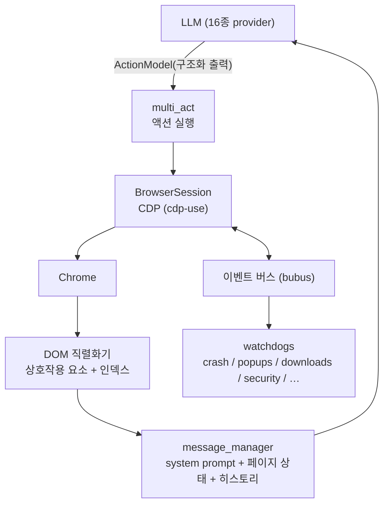
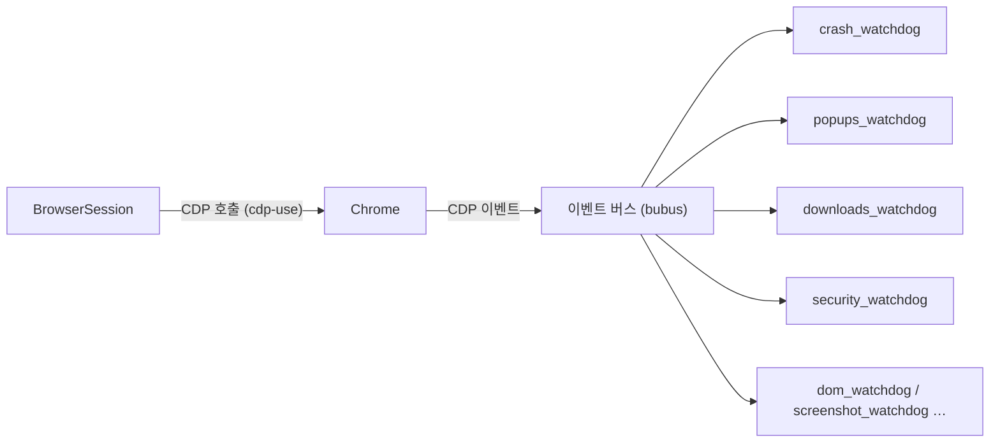
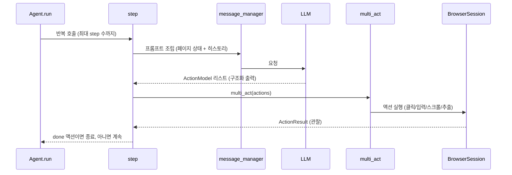

> 분석 일자: 2026-06-30
> 대상 패키지: `browser-use` `0.13.2` (PyPI)
> 대상 커밋: `2454d3e25` (`main` 브랜치, 2026-06-28)
> 저장소: https://github.com/browser-use/browser-use
> 로컬 분석 경로: `~/workspace/opensources/browser-use`

---

_This article is partially written by Claude Code_

## 목차

1. [왜 Browser Use인가요?](#1-왜-browser-use인가요)
2. [기존 글들과 어디에 놓이나요?](#2-기존-글들과-어디에-놓이나요)
3. [프로젝트를 한 문장으로 이해하기](#3-프로젝트를-한-문장으로-이해하기)
4. [기술 스택과 규모](#4-기술-스택과-규모)
5. [전체 그림](#5-전체-그림)
6. [코드베이스 지도](#6-코드베이스-지도)
7. [페이지를 LLM에게 보여 주는 법: 인덱스 붙은 요소](#7-페이지를-llm에게-보여-주는-법-인덱스-붙은-요소)
8. [브라우저는 Playwright가 아니라 CDP입니다](#8-브라우저는-playwright가-아니라-cdp입니다)
9. [에이전트 루프와 액션](#9-에이전트-루프와-액션)
10. [LLM provider 계층과 모델별 프롬프트](#10-llm-provider-계층과-모델별-프롬프트)
11. [그 밖의 갈래: MCP, 파일시스템, CLI](#11-그-밖의-갈래-mcp-파일시스템-cli)
12. [Playwright와 비교: 왜 LLM에게 더 맞나요?](#12-playwright와-비교-왜-llm에게-더-맞나요)
13. [코드를 읽는 추천 순서](#13-코드를-읽는-추천-순서)
14. [인상적인 설계 포인트](#14-인상적인-설계-포인트)
15. [주의해서 볼 지점](#15-주의해서-볼-지점)
16. [결론](#16-결론)

---

## 1. 왜 Browser Use인가요?

Browser Use는 로고 아래 자신을 한 줄로 소개합니다. **"The AI browser agent."** LLM이 직접 브라우저를 열어 클릭하고, 입력하고, 스크롤하고, 화면을 읽어 다음 행동을 정하는 Python 라이브러리입니다.

이 블로그는 앞서 [Playwright](/kb/2026-04-17-playwright-architecture)를 분석하면서 Playwright가 사람이 테스트 코드를 짜기엔 훌륭하지만 LLM과 함께 쓸 때는 느리고 어색하다는 점을 짚었습니다. LLM이 셀렉터를 생성하고, 그 셀렉터로 요소를 찾고, 실패하면 다시 생성하는 왕복이 비싸기 때문입니다.

Browser Use는 이 문제를 정면으로 뒤집습니다. 핵심은 세 가지입니다.

첫째, **페이지를 LLM이 읽기 좋게 미리 씹어서 줍니다.** LLM에게 날 HTML이나 셀렉터를 쓰게 하지 않습니다. 대신 페이지에서 클릭·입력이 가능한 요소만 골라 번호를 붙인 목록으로 만들어 건넵니다. LLM은 셀렉터를 짜는 대신 "5번 요소를 클릭"이라고 말합니다.

둘째, **브라우저를 Playwright가 아니라 CDP로 직접 몹니다.** Chrome DevTools Protocol을 직접 호출하고, 그 위에 이벤트 버스와 watchdog를 얹어 세션을 운영합니다. Playwright 런타임을 거치지 않아 더 가볍고 빠릅니다.

셋째, **행동 어휘를 작게 유지합니다.** 클릭·입력·스크롤·이동·추출·완료 같은 정해진 액션을 구조화된 출력으로 받습니다. LLM이 임의의 코드를 쓰는 게 아니라, 정의된 액션 중에서 고릅니다.

그래서 Browser Use를 "LLM으로 브라우저 자동화하는 라이브러리"라고만 보면 절반만 본 셈입니다. 더 정확하게는 **웹페이지를 LLM이 다루기 좋은 형태로 번역하고, 그 위에서 작은 액션 어휘로 브라우저를 모는 에이전트**입니다.

## 2. 기존 글들과 어디에 놓이나요?

이 글은 브라우저 자동화 갈래의 연장선에 있습니다.

| 글                                                                                            | 중심 문제                         | Browser Use와의 관계                                                                                         |
| --------------------------------------------------------------------------------------------- | --------------------------------- | ------------------------------------------------------------------------------------------------------------ |
| [Playwright](/kb/2026-04-17-playwright-architecture)                                          | E2E 테스트의 표준 브라우저 자동화 | Playwright가 사람이 셀렉터를 짜는 API라면, Browser Use는 LLM에게 인덱스 붙은 요소를 주고 CDP로 직접 몹니다.  |
| [브라우저 자동화 비교](/kb/2026-04-16-browser-automation-comparison)                          | LLM과 함께 쓸 브라우저 도구 비교  | 그 비교에서 던진 "LLM에게 무엇을 보여 줄 것인가"라는 질문에, Browser Use가 내놓은 한 가지 답입니다.          |
| [OpenCode](/kb/2026-06-29-opencode-architecture) · [Cline](/kb/2026-06-30-cline-architecture) | 코딩 에이전트                     | 도메인은 다르지만(코딩 vs 브라우저), 에이전트 루프·액션 레지스트리·다중 provider 추상화라는 뼈대는 같습니다. |

핵심은 Browser Use가 "또 하나의 브라우저 자동화 도구"로 설명되지 않는다는 점입니다. Playwright 글에서 어려움은 "LLM이 셀렉터를 짜는 왕복"이었습니다. Browser Use에서 그 자리를 채우는 것은 **DOM 직렬화기(인덱스 붙은 상호작용 요소), CDP 직접 제어, 작은 액션 어휘**입니다.

## 3. 프로젝트를 한 문장으로 이해하기

**Browser Use**는 Python 에이전트 라이브러리로, 웹페이지를 클릭 가능한 요소에 번호를 붙인 형태로 직렬화해 LLM에 주고, LLM이 고른 액션을 Chrome DevTools Protocol로 실행하며, 이벤트 버스와 watchdog로 브라우저 세션을 운영하는 **AI 브라우저 에이전트**입니다.

질문으로 바꾸면 이렇습니다.

| 질문                               | Browser Use의 답                                                                         |
| ---------------------------------- | ---------------------------------------------------------------------------------------- |
| LLM은 페이지를 어떻게 보나요?      | `dom/serializer`가 상호작용 가능한 요소만 골라 인덱스를 붙인 목록으로 직렬화합니다.      |
| LLM은 어떻게 행동하나요?           | 정의된 액션(클릭·입력·스크롤·추출·완료 등)을 구조화된 `ActionModel`로 내놓습니다.        |
| 브라우저는 무엇으로 모나요?        | **CDP**(`cdp-use`)를 직접 호출합니다. Playwright가 아닙니다.                             |
| 브라우저 상태는 어떻게 관리하나요? | 이벤트 버스(`bubus`)에 14개의 watchdog가 붙어 크래시·팝업·다운로드·보안 등을 감시합니다. |
| 에이전트 루프는 어디 있나요?       | `agent/service.py`의 `Agent.run()` → `step()` → `multi_act()`입니다.                     |
| 모델은 무엇을 쓰나요?              | `llm/` 아래 16종 provider(anthropic·openai·google·groq·ollama·…)를 추상화합니다.         |
| 다른 에이전트가 쓸 수 있나요?      | `mcp/`로 MCP 서버가 되어, 다른 LLM 에이전트가 브라우저 능력을 빌려 쓸 수 있습니다.       |

## 4. 기술 스택과 규모

| 영역          | 기술                                                                |
| ------------- | ------------------------------------------------------------------- |
| 언어          | **Python** (`py.typed`, Pydantic 모델 기반)                         |
| 브라우저 제어 | **Chrome DevTools Protocol** (`cdp-use`) — Playwright 미사용        |
| 이벤트        | **`bubus`** 이벤트 버스 + 14개 **watchdog**                         |
| DOM           | `dom/serializer` — 상호작용 요소 추출, paint order, 인덱스 부여     |
| LLM           | `llm/` — 16종 provider 추상화(`base.py`), 모델별 system prompt 변형 |
| 액션          | `tools/registry` — 구조화된 액션 레지스트리                         |
| 확장          | MCP, 파일시스템, skills, CLI, cloud/sync                            |
| 운영          | 토큰/비용 추적, observability, GIF 녹화, LLM judge                  |
| 배포          | PyPI `browser-use`, Docker, CLI                                     |

로컬 체크아웃 기준 규모는 이렇습니다.

| 항목                     |       수치 |
| ------------------------ | ---------: |
| Git 추적 파일 수         |      501개 |
| Python 파일 수           |      387개 |
| LLM provider 디렉터리    |       16개 |
| 브라우저 watchdog        |       14개 |
| `agent/service.py` 줄 수 | 약 4,100줄 |

## 5. 전체 그림

Browser Use의 한 step은 "페이지를 LLM이 읽을 형태로 바꾸고 → LLM이 액션을 고르고 → 브라우저가 실행하고 → 새 페이지를 다시 읽는" 순환입니다.

순환의 핵심은 위쪽 두 화살표입니다. LLM은 message_manager가 만든 프롬프트(인덱스 붙은 요소 목록 포함)를 보고 `ActionModel`을 내놓고, `multi_act`가 그것을 브라우저에서 실행합니다. 아래쪽에서는 CDP 세션이 이벤트 버스로 watchdog와 신호를 주고받습니다.

## 6. 코드베이스 지도

`browser_use/` 패키지의 핵심은 다음과 같습니다.

| 모듈                                          | 역할                                                                    |
| --------------------------------------------- | ----------------------------------------------------------------------- |
| `agent/service.py`                            | **에이전트 본체**. `Agent.run`/`step`/`multi_act` 루프(약 4,100줄)      |
| `agent/message_manager`                       | 프롬프트 조립 — system prompt + 페이지 상태 + 히스토리                  |
| `agent/system_prompts`                        | 모델 계열별 system prompt 변형(flash / no-thinking / anthropic …)       |
| `dom/serializer`                              | **페이지 직렬화** — `clickable_elements`, `paint_order`, `serializer`   |
| `dom/service.py`                              | DOM 트리 추출과 enhanced snapshot                                       |
| `browser/session.py`                          | **CDP 브라우저 세션**과 이벤트                                          |
| `browser/watchdogs`                           | 14개 watchdog(crash·popups·downloads·captcha·security·screenshot·dom·…) |
| `tools/`                                      | **액션 레지스트리**와 액션 구현(클릭·입력·추출 등)                      |
| `llm/`                                        | 16종 provider 추상화(`base.py`, `messages.py`, `models.py`)             |
| `mcp/`                                        | MCP 서버/클라이언트                                                     |
| `filesystem/` · `skills/` · `cli.py`          | 파일 접근, 스킬, 터미널 진입점                                          |
| `tokens/` · `telemetry/` · `observability.py` | 비용 추적·관측                                                          |

가장 먼저 볼 곳은 `dom/serializer/clickable_elements.py`입니다. "무엇을 LLM에게 클릭 가능한 요소로 보여 줄 것인가"를 정하는 곳이고, 이 결정이 Browser Use의 정체성을 만듭니다.

## 7. 페이지를 LLM에게 보여 주는 법: 인덱스 붙은 요소

Browser Use에서 가장 중요한 결정이 여기 있습니다. LLM은 날 HTML을 보지 않습니다. 대신 페이지를 **상호작용 가능한 요소의 번호 목록**으로 받습니다.

흐름은 이렇습니다.

1. **DOM 트리 추출** — CDP로 페이지의 DOM을 `EnhancedDOMTreeNode` 트리로 가져옵니다(`dom/service.py`).
2. **상호작용 판정** — `clickable_elements.py`의 `is_interactive(node)`가 각 노드가 클릭·입력 가능한지 점수로 판단합니다. 버튼·링크·폼 컨트롤은 물론, 충분히 큰 iframe, 보이지 않는 클릭 오버레이, UI 컴포넌트로 쓰이는 span 래퍼까지 신호를 보고 골라냅니다.
3. **paint order 계산** — `paint_order.py`가 z-순서를 따져 실제로 화면 위에 보이는 요소를 가립니다. 가려진 요소는 제외합니다.
4. **인덱스 부여 + 직렬화** — 살아남은 상호작용 요소에 번호를 붙여, `[5]<button>Submit</button>` 같은 압축된 목록으로 만듭니다.

그래서 LLM이 받는 것은 수천 줄의 HTML이 아니라, 지금 누를 수 있는 것들의 짧은 메뉴입니다. LLM은 "5번을 클릭", "12번에 입력" 식으로 인덱스만 고르면 됩니다. 셀렉터를 짤 필요가 없습니다.

이 한 가지가 Playwright와의 결정적 차이입니다. Playwright는 사람이 `page.click('button.submit')`처럼 셀렉터를 짜는 API입니다. LLM에게 그 일을 시키면 셀렉터가 틀리고, 다시 짜고, 또 틀리는 왕복이 생깁니다. Browser Use는 그 왕복을 없애려고, 페이지를 LLM이 곧바로 고를 수 있는 형태로 미리 번역해 둡니다.

## 8. 브라우저는 Playwright가 아니라 CDP입니다

두 번째 핵심 결정은 브라우저 제어 방식입니다. Browser Use는 Playwright를 거의 쓰지 않습니다. 의존성에서 Playwright는 주석으로 빠져 있고("not actually needed I think"), 대신 **`cdp-use`로 Chrome DevTools Protocol을 직접 호출**합니다. 코드에서도 `cdp_use`는 26개 파일이, Playwright는 사실상 1개 파일만 건드립니다.

그 위에 두 가지 장치를 얹습니다.

- **이벤트 버스(`bubus`)** — 브라우저에서 일어나는 일(페이지 이동, 다운로드, 팝업, 크래시)을 이벤트로 흘립니다. 명령형으로 일일이 호출하는 대신, 이벤트에 반응하는 구조입니다.
- **watchdog 14종** — 이벤트 버스에 붙어 각자 한 가지 걱정을 맡습니다. `crash_watchdog`(크래시 복구), `popups_watchdog`(팝업), `downloads_watchdog`(다운로드), `captcha_watchdog`(캡차), `security_watchdog`(보안), `screenshot_watchdog`(스크린샷), `dom_watchdog`(DOM 갱신), `permissions_watchdog`, `storage_state_watchdog`, `har_recording_watchdog` 등입니다.

이렇게 하면 브라우저 세션이 명령의 나열이 아니라 **이벤트에 반응하는 시스템**이 됩니다. 팝업이 뜨면 watchdog가 처리하고, 크래시가 나면 watchdog가 복구를 시도합니다. CDP를 직접 쓰는 덕분에 Playwright 런타임을 거치지 않아 더 가볍고, 더 세밀하게 제어할 수 있습니다.

## 9. 에이전트 루프와 액션

에이전트 본체는 `agent/service.py`의 `Agent` 클래스입니다. 4,100줄에 달하지만 뼈대는 단순합니다.

여기서 눈여겨볼 대목은 `multi_act`입니다. LLM은 한 step에서 **여러 액션을 한꺼번에** 내놓을 수 있습니다(예: 입력 후 클릭). 액션은 자유 텍스트가 아니라 Pydantic 기반 `ActionModel`로 검증되고, 결과는 `ActionResult`로 모델에 다시 들어갑니다. 정해진 액션 어휘 안에서만 움직이므로, LLM이 엉뚱한 코드를 실행할 여지가 줄어듭니다.

## 10. LLM provider 계층과 모델별 프롬프트

Browser Use는 특정 모델에 묶이지 않습니다. `llm/` 아래에 **16종 provider** 디렉터리가 있습니다 — anthropic, openai, google, aws(Bedrock), azure, groq, deepseek, cerebras, mistral, ollama, openrouter, vercel, oci, litellm, 그밖에 Browser Use 자체 provider까지입니다. `base.py`가 공통 인터페이스를, `messages.py`가 메시지 형식을 맞춥니다.

흥미로운 점은 **모델 계열별로 system prompt를 따로 둔다**는 것입니다. `agent/system_prompts`에는 기본 프롬프트 외에 `system_prompt_flash`(빠른 경량 모델용), `system_prompt_no_thinking`(사고 과정 없는 모델용), `system_prompt_anthropic_flash` 같은 변형이 있습니다. 모델마다 지시를 알아듣는 방식이 달라서 한 벌의 프롬프트로 모두를 만족시키지 않고 계열별로 맞춰 줍니다.

## 11. 그 밖의 갈래: MCP, 파일시스템, CLI

Browser Use가 다루는 영역은 브라우저 하나에 그치지 않습니다.

- **MCP** (`mcp/`) — Browser Use를 MCP 서버로 띄울 수 있습니다. 그러면 다른 LLM 에이전트(예: 코딩 에이전트)가 "브라우저를 써라"라고 호출해, 웹 탐색·조작 능력을 빌려 쓸 수 있습니다.
- **파일시스템** (`filesystem/`) — 에이전트가 파일을 읽고 씁니다. 다운로드한 자료나 추출한 데이터를 다룰 때 쓰입니다.
- **추출(extraction)** (`tools/extraction`) — 페이지에서 구조화된 데이터를 뽑아내는 액션입니다. 단순 조작을 넘어 "이 표를 읽어 와" 같은 작업을 합니다.
- **CLI / skills** (`cli.py`, `skills/`) — 터미널에서 바로 작업을 돌리거나, 재사용 가능한 스킬을 정의합니다.
- **운영 도구** — `tokens/`(비용 추적), `observability.py`(관측), `agent/gif.py`(실행 과정을 GIF로 녹화), `agent/judge.py`(LLM-as-judge로 결과 평가)까지 갖췄습니다.

## 12. Playwright와 비교: 왜 LLM에게 더 맞나요?

이 글의 출발점이 "[Playwright](/kb/2026-04-17-playwright-architecture) 분석의 후속"이었으니 정리해 두겠습니다.

| 축            | Playwright                              | Browser Use                                    |
| ------------- | --------------------------------------- | ---------------------------------------------- |
| 주 사용자     | 사람(테스트 코드 작성자)                | LLM(에이전트)                                  |
| 페이지 접근   | 셀렉터로 직접 요소 지정                 | **인덱스 붙은 상호작용 요소 목록**을 미리 받음 |
| 행동 방식     | 임의의 API 호출 코드 작성               | 정해진 액션 어휘에서 구조화 출력으로 선택      |
| 브라우저 제어 | Playwright 런타임(고수준 API)           | **CDP 직접 호출** + 이벤트 버스 + watchdog     |
| LLM과의 궁합  | 셀렉터 생성·실패·재생성 왕복이 비쌈     | 왕복을 없애도록 페이지를 미리 번역             |
| 장점          | 정밀한 제어, 성숙한 생태계, 테스트 표준 | 토큰 효율, 빠른 반복, LLM 친화적 페이지 표현   |

요지는 이렇습니다. Playwright는 **사람이 무엇을 할지 정확히 안다**는 전제로 설계됐습니다. 셀렉터를 정확히 짤 수 있는 사람에게는 강력합니다. Browser Use는 반대 전제에서 출발합니다. **LLM은 페이지를 보고 그때그때 판단한다**는 것입니다. 그래서 페이지를 미리 씹어 인덱스로 주고, 행동을 작은 어휘로 좁히고, 브라우저는 CDP로 가볍게 몹니다. 사내에서 E2E 자동화에 LLM 브라우저 에이전트가 Playwright보다 빠르고 토큰 효율적이라고 느껴진다면, 그 체감의 구조적 이유가 바로 이 세 가지 결정입니다.

## 13. 코드를 읽는 추천 순서

1. `README.md` / `agent/system_prompts/system_prompt.md` — 에이전트가 페이지를 어떻게 설명받는지
2. `dom/serializer/clickable_elements.py` — 무엇을 상호작용 요소로 보는지
3. `dom/serializer/serializer.py` · `paint_order.py` — 인덱스와 가시성 처리
4. `agent/service.py`의 `step`/`multi_act` — 루프와 액션 실행
5. `tools/service.py` · `tools/registry` — 액션 어휘
6. `browser/session.py` — CDP 세션
7. `browser/watchdogs/` — 이벤트 기반 세션 운영
8. `llm/base.py` — provider 추상화

## 14. 인상적인 설계 포인트

### 1. 페이지를 LLM 친화적 형태로 미리 번역합니다.

날 HTML이나 셀렉터 대신, 상호작용 가능한 요소만 골라 인덱스로 줍니다. LLM의 일을 "셀렉터 작성"에서 "번호 선택"으로 바꾼 것이 Browser Use의 본질입니다.

### 2. Playwright를 걷어내고 CDP로 내려갔습니다.

`cdp-use`로 Chrome DevTools Protocol을 직접 호출하고, 이벤트 버스와 watchdog로 세션을 운영합니다. 런타임 한 겹을 덜어 더 가볍고 세밀합니다.

### 3. 브라우저를 이벤트 시스템으로 다룹니다.

14개 watchdog가 크래시·팝업·다운로드·보안을 각자 맡습니다. 복잡한 실제 웹의 돌발 상황을 명령형 분기 대신 이벤트 구독으로 흡수합니다.

### 4. 모델 계열별로 프롬프트를 맞춥니다.

flash·no-thinking·anthropic 변형 프롬프트로, 한 벌이 아니라 모델에 맞춘 지시를 줍니다. 16종 provider를 실제로 쓰게 하는 디테일입니다.

### 5. MCP 서버가 되어 능력을 빌려줍니다.

Browser Use는 코딩 에이전트가 호출할 수 있는 브라우저 능력의 공급원이 됩니다. 브라우저 조작을 한 에이전트 안에 가두지 않고 도구로 외부에 엽니다.

## 15. 주의해서 볼 지점

### 1. 상호작용 판정은 휴리스틱입니다.

`is_interactive`는 점수 기반 휴리스틱입니다. 보이지 않는 오버레이까지 포함하는 등 폭넓게 잡지만 복잡한 커스텀 위젯에서는 놓치거나 잘못 잡을 수 있습니다. 페이지 표현의 품질이 곧 에이전트 성능을 좌우합니다.

### 2. CDP 직접 제어는 Chrome 결합을 뜻합니다.

Playwright가 주던 크로스 브라우저 추상화를 일부 포기한 선택입니다. Chromium 계열에 맞춰진 만큼, 다른 엔진 지원은 별도 고민거리입니다.

### 3. `agent/service.py`가 비대합니다.

핵심 루프가 4,100줄 한 파일에 모여 있습니다. 강력하지만 읽기 부담이 큽니다. 흐름을 잡으려면 `run`/`step`/`multi_act` 세 메서드를 축으로 따라가야 합니다.

### 4. 빠른 변화와 베타 기능이 많습니다.

`beta/`, `actor/`, `cloud/`, `sync/` 등 실험적·상용 연동 기능이 섞여 있습니다. 어디까지가 안정된 코어이고 어디부터가 변동 구역인지 구분해서 읽는 편이 안전합니다.

## 16. 결론

Browser Use는 "LLM으로 브라우저를 자동화하는 라이브러리"보다 더 분명한 주장을 담은 프로젝트입니다. 실제 구조는 **웹페이지를 LLM이 다루기 좋은 형태로 번역하고, 작은 액션 어휘로 CDP를 거쳐 브라우저를 모는 에이전트**입니다.

[Playwright](/kb/2026-04-17-playwright-architecture)가 사람이 셀렉터를 정확히 짠다는 전제에서 강력했다면, Browser Use는 LLM이 페이지를 보고 판단한다는 전제에서 설계를 새로 짭니다. 그래서 페이지를 인덱스로 미리 씹고, 행동을 어휘로 좁히고, 브라우저를 CDP로 가볍게 몹니다.

Browser Use를 볼 때 가장 중요한 질문은 "어떤 모델을 쓰나요?"가 아닙니다. 더 중요한 질문은 이것입니다.

> 복잡하고 예측 불가능한 실제 웹페이지를, LLM이 한 번에 판단할 수 있는 형태로 어떻게 줄여서 보여 줄 것인가요?

Browser Use의 답은 `clickable_elements`의 상호작용 판정, `paint_order`의 가시성 정리, 인덱스 붙은 직렬화입니다. 이 번역 계층을 이해하면, Browser Use가 단순한 자동화 도구가 아니라 **웹을 LLM의 언어로 옮기는 번역기**라는 것이 보입니다.
