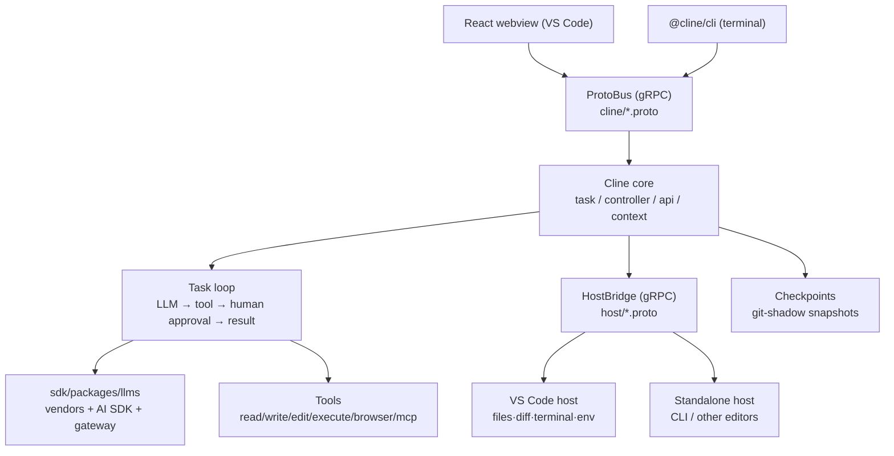
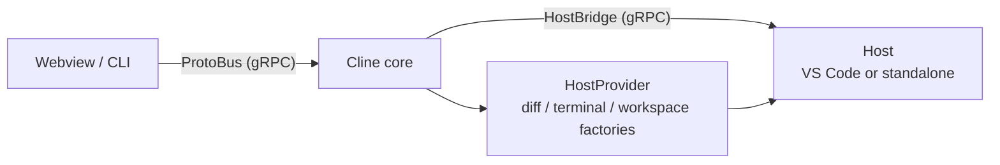

> Analysis date: 2026-06-30
> Target packages: `claude-dev` (Cline VS Code extension) `4.0.0`, `@cline/cli` `3.0.33`
> Target commit: `64fc3f372e9d1f8eaffd636b8cf00d64d9d83d95` (`main` branch)
> Repository: https://github.com/cline/cline
> Local analysis path: `~/workspace/opensources/cline`

---

_This article is partially written by Claude Code_

## Table of Contents

1. [Why Cline?](#1-why-cline)
2. [Where Does It Sit Among the Previous Articles?](#2-where-does-it-sit-among-the-previous-articles)
3. [Understanding the Project in One Sentence](#3-understanding-the-project-in-one-sentence)
4. [Tech Stack and Scale](#4-tech-stack-and-scale)
5. [The Big Picture: One Core, Two Hosts](#5-the-big-picture-one-core-two-hosts)
6. [Codebase Map](#6-codebase-map)
7. [Host Abstraction: Detaching the Core From the Editor](#7-host-abstraction-detaching-the-core-from-the-editor)
8. [The Task Loop and Tools](#8-the-task-loop-and-tools)
9. [Plan/Act and Human Approval: Cline's Identity](#9-planact-and-human-approval-clines-identity)
10. [Checkpoints: An Agent You Can Roll Back](#10-checkpoints-an-agent-you-can-roll-back)
11. [The LLM Provider Layer](#11-the-llm-provider-layer)
12. [MCP, Browser, Skills, Subagents](#12-mcp-browser-skills-subagents)
13. [CLI and Kanban: Out of the Editor](#13-cli-and-kanban-out-of-the-editor)
14. [Comparison With OpenCode: Same Separation, Different Center of Gravity](#14-comparison-with-opencode-same-separation-different-center-of-gravity)
15. [A Recommended Reading Order](#15-a-recommended-reading-order)
16. [Notable Design Decisions](#16-notable-design-decisions)
17. [Things to Watch Out For](#17-things-to-watch-out-for)
18. [Conclusion](#18-conclusion)

---

## 1. Why Cline?

Cline introduces itself in the README like this: **"The open source coding agent in your IDE and terminal."** Its starting point is a VS Code extension — an agent that reads, edits, runs commands, and drives a browser inside your editor.

On the surface it looks like yet another coding agent, like [Qwen Code](/kb/2026-05-17-qwen-code-architecture) or [OpenCode](/kb/2026-06-29-opencode-architecture). But open the repository and two things set Cline apart.

First, Cline **keeps a human in the loop.** Before the agent edits a file or runs a command, by default a human approves that action. It splits a **Plan mode** (which only plans) from an **Act mode** (which executes), turning "agree first, then act" into structure. On top of that, it snapshots every step as a **checkpoint**, so if you don't like where things went you can restore the working tree at any time.

Second, Cline **detached its core from the host.** The agent's body (LLM calls, tool execution, state management) is not tied directly to the VS Code API. Between them sits a **service boundary defined in protobuf/gRPC.** As a result, the same core runs inside VS Code, in a terminal CLI, and in other editors alike.

So if you see Cline only as "an AI coding extension for VS Code," you've seen half of it. More precisely, it is **a coding agent that makes human approval and rollback first-class features, with its core separated from the host.**

## 2. Where Does It Sit Among the Previous Articles?

Placed next to the coding agents I've analyzed recently, Cline's position comes into focus.

| Article                                                | Central problem                                     | Relationship to Cline                                                                                                                                                           |
| ------------------------------------------------------ | --------------------------------------------------- | ------------------------------------------------------------------------------------------------------------------------------------------------------------------------------- |
| [OpenCode](/kb/2026-06-29-opencode-architecture)       | A provider-agnostic headless engine                 | Where OpenCode exposes its core over HTTP/OpenAPI for clients to attach, Cline detaches its core from the host over a gRPC/protobuf boundary. Same separation, different tools. |
| [Qwen Code](/kb/2026-05-17-qwen-code-architecture)     | Extending a terminal coding agent via plugin/daemon | Where Qwen Code is a single-vendor terminal runtime, Cline is an editor-first agent with human approval and rollback layered on.                                                |
| [OpenHands](/kb/2026-05-17-openhands-architecture)     | Operating a coding agent as a web product + sandbox | Where OpenHands secures safety with a sandbox, Cline secures it with human-approval gates and checkpoints.                                                                      |
| [Superpowers](/kb/2026-04-18-superpowers-architecture) | Injecting process and skills into agents            | Cline also handles skills and subagents via `use_skill`/`use_subagents`, but adds approval and checkpoints as safety on top.                                                    |

The key is that Cline is not explained as "just another coding agent that runs in VS Code." In the OpenCode article the boundary was `models.dev` and an HTTP contract. In Cline that boundary is **23 `.proto` service definitions, the `HostProvider` abstraction, and a Plan/Act flow that enforces human approval.**

## 3. Understanding the Project in One Sentence

**Cline** is a TypeScript coding agent that starts from a VS Code extension, detaches its core (LLM calls, tool execution, state management) from the host via a protobuf/gRPC boundary (**ProtoBus** + **HostBridge**), and layers **Plan/Act human approval** and **checkpoint rollback** as first-class features on top. The same core runs in VS Code, a terminal CLI, and other editors.

As questions:

| Question                                 | Cline's answer                                                                                                         |
| ---------------------------------------- | ---------------------------------------------------------------------------------------------------------------------- |
| Where do users talk to it?               | A React webview in the VS Code side panel, or `@cline/cli` in the terminal (interactive/headless).                     |
| How do the core and UI communicate?      | The webview/CLI call the core via **ProtoBus** (gRPC) services. The protos live in `apps/vscode/proto/cline/*`.        |
| How does the core touch files/terminals? | `HostProvider` hands out host-specific factories like `createDiffViewProvider()`, `workspace`, `terminal`.             |
| How are dangerous actions prevented?     | By default a human approves tool execution. Plan mode defers edits; only Act mode actually changes things.             |
| Can you roll back if it goes wrong?      | Every step is saved as a git-shadow **checkpoint**, so the working tree can be restored to an earlier state.           |
| How do you pick a model?                 | A model registry in `sdk/packages/llms` handles vendor adapters (anthropic, bedrock, google, …) and the Cline gateway. |
| Can you use it outside the editor?       | Via `@cline/cli` in the terminal/CI, and a separate Kanban board to run many agents in parallel.                       |

## 4. Tech Stack and Scale

| Area             | Technology                                                                                               |
| ---------------- | -------------------------------------------------------------------------------------------------------- |
| Runtime          | Node.js + **Bun** (workspaces). VS Code extension host and a standalone (CLI/JetBrains) build            |
| Language/tools   | TypeScript, **Biome** (lint/format), Vitest                                                              |
| Extension body   | **VS Code Extension API** (`apps/vscode`, extension name `claude-dev`)                                   |
| Service boundary | **protobuf + gRPC** — core↔webview is **ProtoBus**, core↔host is **HostBridge** (23 `.proto`)          |
| UI               | **React 18 + Vite 7** webview (`apps/vscode/webview-ui`)                                                 |
| LLM              | `sdk/packages/llms` — **Vercel AI SDK**-based + vendor adapters + a Cline **gateway** + a model registry |
| Tools            | files, shell, browser, web search, MCP, skill, subagent                                                  |
| Safety           | Plan/Act approval, git-shadow **checkpoints**, `.clineignore`                                            |
| Distribution     | VS Code Marketplace (`claude-dev`), npm `cline` (CLI), a separate Kanban                                 |

The scale of the local checkout:

| Item                  | Count |
| --------------------- | ----: |
| Git-tracked files     | 3,186 |
| TypeScript/TSX files  | 2,397 |
| `.proto` service defs |    23 |
| LLM vendor adapters   |     9 |

## 5. The Big Picture: One Core, Two Hosts

Cline's big picture is "one core running on two kinds of host."

Read the arrows in two directions. **At the top**, the webview and CLI call into the core over ProtoBus; **at the bottom**, the core drives the host environment (files, diff, terminal) over HostBridge. The core doesn't need to know whether it's inside VS Code or a CLI. That difference hides behind HostBridge.

## 6. Codebase Map

Cline is a Bun-workspace monorepo. The heart is `apps/` and `sdk/`.

| Location                                | Purpose                                                                              | Tier       |
| --------------------------------------- | ------------------------------------------------------------------------------------ | ---------- |
| `apps/vscode`                           | **The VS Code extension body + core** (`claude-dev`). All the agent logic lives here | Core       |
| `apps/vscode/src/core`                  | task, controller, api, context, prompts, mentions, storage, webview                  | Core       |
| `apps/vscode/src/hosts`                 | **Host abstraction** (`HostProvider`) and the VS Code/standalone implementations     | Core       |
| `apps/vscode/src/standalone`            | **Host-agnostic entry point** (`cline-core.ts`) + ProtoBus/HostBridge clients        | Core       |
| `apps/vscode/proto`                     | **23 `.proto`** — `cline/*` (ProtoBus services), `host/*` (HostBridge)               | Core       |
| `apps/vscode/webview-ui`                | React 18 + Vite chat UI                                                              | Core       |
| `apps/cli`                              | **`@cline/cli`** terminal client (interactive/headless)                              | Core       |
| `sdk/packages/llms`                     | The LLM provider layer — vendor adapters, AI SDK, gateway, model registry            | Core       |
| `sdk/packages/{agents,core,sdk,shared}` | SDK packages for external integration                                                | Peripheral |
| `apps/cline-hub`                        | A hub app (account/integration)                                                      | Peripheral |
| `evals` / `docs`                        | Evaluation harness / docs                                                            | Peripheral |

The first place to read is `apps/vscode/src/standalone/cline-core.ts`. How the core boots without VS Code, and where ProtoBus and HostBridge attach, is all visible there.

## 7. Host Abstraction: Detaching the Core From the Editor

This is the most important decision in Cline's structure. The core does not call the VS Code API directly. Instead it goes through the **`HostProvider`** singleton in `apps/vscode/src/hosts/host-provider.ts`. A comment spells out the intent: "the rest of the codebase can use the host provider interface to access platform-specific" features.

`HostProvider` hands out host-specific factories:

- `createDiffViewProvider()` — how to show changes as a diff
- `workspace` / `window` / `env` — workspace, window, and environment access
- a terminal manager — VS Code's `TerminalManager` or the standalone `StandaloneTerminalManager`

On top of this abstraction, communication splits into two gRPC directions.

- **ProtoBus** — the direction in which the webview (or CLI) calls into the core. `apps/vscode/proto/cline/*.proto` defines services like task, state, ui, mcp, browser, checkpoints, models, web, and worktree. The React webview calls these services to send messages and subscribe to state.
- **HostBridge** — the direction in which the core calls out to the host environment. `apps/vscode/proto/host/*.proto` (diff, env, etc.) requests platform operations like file diffs and environment info.

`apps/vscode/src/standalone/cline-core.ts` assembles the standalone side of this picture. In the `IS_STANDALONE === "true"` build it plugs in `ExternalDiffViewProvider`, `ExternalWebviewProvider`, and `StandaloneTerminalManager`, starts the ProtoBus service, then waits for HostBridge to become ready. In other words, there is one set of core code; swap the host implementation and it becomes either a VS Code extension or a CLI.

## 8. The Task Loop and Tools

A single user message becomes one **Task**. The core receives the model response as a stream, parses it into text and tool calls (`presentAssistantMessage`), executes the tools (`ToolExecutor`), and feeds the results back to the model — looping. The loop continues while the assistant keeps calling tools, and finishes when `attempt_completion` appears.

The tool list lives in `apps/vscode/src/shared/tools.ts`. Grouped by nature:

| Group     | Tools                                                                                                                      |
| --------- | -------------------------------------------------------------------------------------------------------------------------- |
| Files     | `read_file`, `write_to_file`, `replace_in_file`, `apply_patch`, `list_files`, `search_files`, `list_code_definition_names` |
| Execute   | `execute_command`                                                                                                          |
| Browser   | `browser_action`                                                                                                           |
| Web       | `web_fetch`, `web_search`                                                                                                  |
| MCP       | `use_mcp_tool`, `access_mcp_resource`, `load_mcp_documentation`                                                            |
| Modes     | `plan_mode_respond`, `act_mode_respond`                                                                                    |
| Flow      | `ask_followup_question`, `attempt_completion`, `new_task`, `condense`, `summarize_task`, `focus_chain`                     |
| Extension | `use_skill`, `use_subagents`, `new_rule`                                                                                   |

What stands out is that `plan_mode_respond` and `act_mode_respond` are included **as tools.** Mode switching is a tool-level contract, not a prompt convention. `condense`, `summarize_task`, and `focus_chain` are devices for shrinking context and keeping focus on long tasks.

## 9. Plan/Act and Human Approval: Cline's Identity

What most clearly separates Cline from other coding agents is human approval.

- **Plan mode**: the agent does not edit code right away. It explains what it intends to do and agrees with the user (`plan_mode_respond`). It reads and explores, but defers edits.
- **Act mode**: it actually carries out the agreed plan (`act_mode_respond`). File edits and command execution happen here.

And even in Act mode, dangerous tools (file writes, shell commands, browser actions) go through human approval by default. The user can widen the auto-approval scope in settings, but the starting point is "the agent does not act recklessly."

This design contrasts with the way [OpenHands](/kb/2026-05-17-openhands-architecture) cages risk in a sandbox. OpenHands lets the agent roam freely in an isolated environment, while Cline runs in the user's real workspace but routes every action through human hands. Both prevent "the agent breaking things" — one with isolation, the other with approval and rollback.

## 10. Checkpoints: An Agent You Can Roll Back

If approval is the device that "stops things before they happen," checkpoints are the device that "undoes things afterward."

As Cline works, it snapshots the working tree at every step into a **git-shadow repository** (`apps/vscode/src/core/controller/checkpoints`). It tracks the agent's changes separately without touching the user's real git history. So if a state a few steps ago was better, you can restore the working tree to that checkpoint.

This matters because it lowers the cost of trust. When rollback is guaranteed, the user can hand the agent a little more boldly. If approval is the front door of trust, checkpoints are the safety net.

## 11. The LLM Provider Layer

Cline's model layer is split out into `sdk/packages/llms`. It has three layers.

- **Vendor adapters** (`src/providers/vendors/`) — anthropic, bedrock, google, vertex, mistral, openai, openai-compatible, minimax, and community, for **nine** in total. `openai-compatible` accepts any OpenAI-compatible endpoint (including local models).
- **AI SDK + gateway** — `ai-sdk.ts` uses the Vercel AI SDK, and `gateway.ts` handles the gateway provider that Cline operates. Users can plug in their own API keys directly or go through a Cline account.
- **Model registry / catalog** — `model-registry.ts` and `catalog/` manage model metadata (context length, price, capabilities).

Where [OpenCode](/kb/2026-06-29-opencode-architecture) externalizes model metadata entirely to `models.dev`, Cline does the same job with an in-repo model registry and catalog. Both treat "models as data," but OpenCode keeps that data outside while Cline keeps it inside.

## 12. MCP, Browser, Skills, Subagents

Cline's extension surface is broad.

- **MCP** — `use_mcp_tool`/`access_mcp_resource` pull in tools and resources from external MCP servers. There's also a marketplace flow (`controller/marketplace`) to find and install MCP servers.
- **Browser** — `browser_action` launches a headless browser to click, type, and screenshot. The agent can verify its own changes directly on the web.
- **Skills** — `use_skill` invokes reusable procedures. It's the same vein as the "lazily loaded skills" seen in [Superpowers](/kb/2026-04-18-superpowers-architecture).
- **Subagents** — `use_subagents` spawns subagents (`core/task/tools/subagent`). It delegates large tasks to narrowly scoped helper agents.

## 13. CLI and Kanban: Out of the Editor

Cline no longer lives only inside VS Code.

- **CLI** (`@cline/cli`, `npm i -g cline`) — "Run Cline in your terminal. Interactive chat or fully headless for CI/CD and scripting." This is possible thanks to the host abstraction from §7. The CLI boots the standalone core and talks to it over ProtoBus.
- **Kanban** (a separate repo, `npm i -g kanban`) — runs many agents in parallel from a web task board. Each card gets its own worktree, auto-commit, and dependency chains.

So the same core appears in three guises: a sidekick inside the editor, a headless worker in the terminal, and parallel workers on a board.

## 14. Comparison With OpenCode: Same Separation, Different Center of Gravity

Since this article started from "a contrast with [OpenCode](/kb/2026-06-29-opencode-architecture)," let me lay it out. Interestingly, the two projects start from the **same idea**: detach the core (engine) from the frontend and host. They just differ in tools and center of gravity.

| Axis              | [OpenCode](/kb/2026-06-29-opencode-architecture)     | Cline                                                      |
| ----------------- | ---------------------------------------------------- | ---------------------------------------------------------- |
| Core separation   | **HTTP/OpenAPI** + a generated SDK (clients attach)  | **gRPC/protobuf** (ProtoBus + HostBridge)                  |
| Starting point    | A headless server (terminal-first)                   | A VS Code extension (editor-first)                         |
| Human involvement | permission rules, a `plan` agent                     | **Plan/Act approval + checkpoint rollback as first-class** |
| Model metadata    | Fully externalized to `models.dev`                   | An in-repo model registry/catalog                          |
| Core appeal       | The breadth of swapping both provider and client     | Editor integration + human trust (approval, rollback)      |
| What it costs     | Two coexisting generations, an Effect learning curve | A gRPC/proto build pipeline, traces of VS Code coupling    |

The gist: **OpenCode leans on "attach the engine anywhere," while Cline leans on "let a human trust it inside the editor."** Both put a typed boundary between core and shell, but OpenCode draws it with a network standard (HTTP) and Cline with a schema-first approach (protobuf).

## 15. A Recommended Reading Order

1. `README.md` — the whole-product picture including CLI and Kanban
2. `apps/vscode/src/standalone/cline-core.ts` — how the core boots without a host
3. `apps/vscode/src/hosts/host-provider.ts` — the entry point of the host abstraction
4. `apps/vscode/proto/cline/task.proto` and `state.proto` — the ProtoBus service contracts
5. `apps/vscode/src/shared/tools.ts` — the tool list and the Plan/Act tools
6. `apps/vscode/src/core/controller/checkpoints` — the checkpoint implementation
7. `sdk/packages/llms/src/providers/vendors/` — the provider adapters
8. `apps/cli` — how the terminal attaches to the core

## 16. Notable Design Decisions

### 1. A schema boundary between core and host.

23 `.proto` files define ProtoBus (core↔UI) and HostBridge (core↔host). As a result the core need not know VS Code, and adding a new host (CLI, another editor) comes down to "add one host implementation."

### 2. Human approval as a mode, not a prompt.

Plan/Act are baked in as the tools `plan_mode_respond`/`act_mode_respond`. "Agree first, act later" is an execution path, not a suggestion.

### 3. Rollback as a first-class feature.

git-shadow checkpoints snapshot every step. Without touching the user's real git, they give a safety net to safely undo the agent's experiments.

### 4. Models as data.

Vendor adapters plus a model registry manage providers like data. Where OpenCode does the same job outside (`models.dev`), Cline does it inside.

## 17. Things to Watch Out For

### 1. "IDE-only" is an outdated impression.

The name and the marketplace make it look VS Code-only, but the host abstraction, CLI, and Kanban show it has already moved out of the editor. When reading the code, first distinguish "is what I'm looking at the core, or a host implementation?"

### 2. The gRPC/proto pipeline is a barrier to entry.

23 protos, the generated code, and the two ProtoBus/HostBridge channels are powerful, but harder to follow than plain function calls. To read the flow, you have to start from the proto definitions.

### 3. Approval is safe but is friction.

Approving every action grants trust but breaks flow. How you set the auto-approval scope greatly shapes the real-world experience. The user has to find their own balance between safety and speed.

### 4. Traces of VS Code remain throughout the repo.

It claims to have detached the core, but the core lives under `apps/vscode` and the extension is named `claude-dev`. It's safer to read host separation as an in-progress direction, not a finished state.

## 18. Conclusion

Cline is a far larger project than "an AI coding extension for VS Code." Its actual structure is **a coding agent that detaches its core from the host and layers human approval and rollback as first-class features on top.**

Where [OpenCode](/kb/2026-06-29-opencode-architecture) exposes its core over HTTP so it can attach anywhere, Cline performs the same separation over protobuf/gRPC while placing its center of gravity elsewhere. Inside the editor a human approves every action, and if they don't like it, they roll back to a checkpoint.

When looking at Cline, the most important question is not "which model does it use?" The more important questions are these:

> When a coding agent works in the user's real workspace, by what structure does it earn that trust? And how must you detach the core from the host so that one set of it can cover the editor, the terminal, and the board?

Cline's answer is `HostProvider` and 23 protos, plus Plan/Act approval and git-shadow checkpoints. Understand these boundaries and you can see that Cline is not merely an editor extension but **a coding agent that designs human trust into its structure.**
