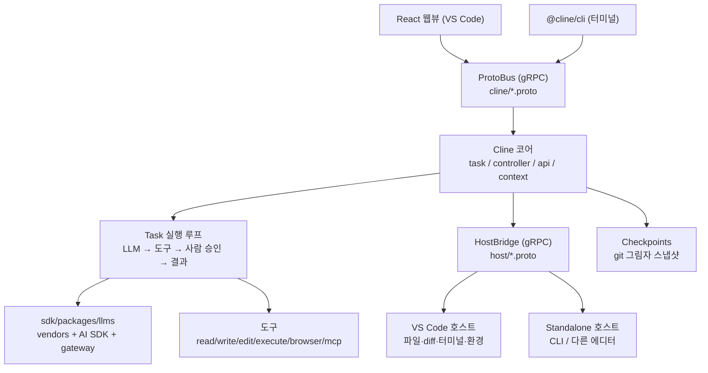
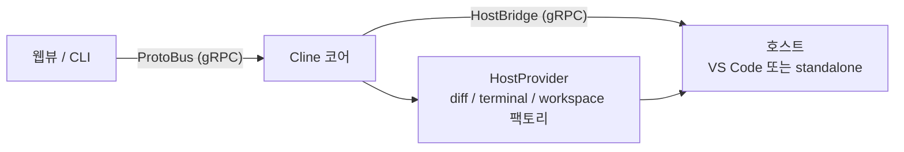

> 분석 일자: 2026-06-30
> 대상 패키지: `claude-dev`(Cline VS Code 확장) `4.0.0`, `@cline/cli` `3.0.33`
> 대상 커밋: `64fc3f372e9d1f8eaffd636b8cf00d64d9d83d95` (`main` 브랜치)
> 저장소: https://github.com/cline/cline
> 로컬 분석 경로: `~/workspace/opensources/cline`

---

_This article is partially written by Claude Code_

## 목차

1. [왜 Cline인가요?](#1-왜-cline인가요)
2. [기존 글들과 어디에 놓이나요?](#2-기존-글들과-어디에-놓이나요)
3. [프로젝트를 한 문장으로 이해하기](#3-프로젝트를-한-문장으로-이해하기)
4. [기술 스택과 규모](#4-기술-스택과-규모)
5. [전체 그림: 코어 하나, 호스트 둘](#5-전체-그림-코어-하나-호스트-둘)
6. [코드베이스 지도](#6-코드베이스-지도)
7. [호스트 추상화: 코어를 에디터에서 떼어냅니다](#7-호스트-추상화-코어를-에디터에서-떼어냅니다)
8. [Task 실행 루프와 도구](#8-task-실행-루프와-도구)
9. [Plan/Act와 사람 승인: Cline의 정체성](#9-planact와-사람-승인-cline의-정체성)
10. [Checkpoints: 되돌릴 수 있는 에이전트](#10-checkpoints-되돌릴-수-있는-에이전트)
11. [LLM provider 계층](#11-llm-provider-계층)
12. [MCP, 브라우저, Skills, Subagents](#12-mcp-브라우저-skills-subagents)
13. [CLI와 Kanban: 에디터 밖으로](#13-cli와-kanban-에디터-밖으로)
14. [OpenCode와 비교: 같은 분리, 다른 무게중심](#14-opencode와-비교-같은-분리-다른-무게중심)
15. [코드를 읽는 추천 순서](#15-코드를-읽는-추천-순서)
16. [인상적인 설계 포인트](#16-인상적인-설계-포인트)
17. [주의해서 볼 지점](#17-주의해서-볼-지점)
18. [결론](#18-결론)

---

## 1. 왜 Cline인가요?

Cline은 README에서 자신을 이렇게 소개합니다. **"The open source coding agent in your IDE and terminal."** 출발점은 VS Code 확장입니다. 에디터 안에서 코드를 읽고, 고치고, 명령을 실행하고, 브라우저를 조작하는 에이전트입니다.

겉으로는 [Qwen Code](/kb/2026-05-17-qwen-code-architecture)나 [OpenCode](/kb/2026-06-29-opencode-architecture) 같은 또 하나의 코딩 에이전트로 보입니다. 하지만 저장소를 열면 Cline을 다른 프로젝트와 구별 짓는 두 가지가 보입니다.

첫째, Cline은 **사람을 루프 안에 둡니다.** 에이전트가 파일을 고치거나 명령을 실행하기 전에, 기본적으로 사람이 그 행동을 승인합니다. 계획만 세우는 **Plan 모드**와 실행하는 **Act 모드**를 나눠, "먼저 합의하고 그다음 실행한다"를 구조로 만들었습니다. 게다가 매 단계를 **체크포인트**로 스냅샷해 두어 마음에 들지 않으면 작업 트리를 언제든 되돌릴 수 있습니다.

둘째, Cline은 **코어를 호스트에서 떼어냈습니다.** 에이전트의 본체(LLM 호출, 도구 실행, 상태 관리)는 VS Code API에 직접 묶여 있지 않습니다. 그 사이에 **protobuf/gRPC로 정의한 서비스 경계**가 있습니다. 덕분에 같은 코어가 VS Code 안에서도, 터미널 CLI에서도, 다른 에디터에서도 똑같이 돕니다.

그래서 Cline을 "VS Code용 AI 코딩 확장"이라고만 보면 절반만 본 셈입니다. 더 정확하게는 **사람의 승인과 되돌리기를 1급 기능으로 두고, 코어를 호스트에서 분리한 코딩 에이전트**입니다.

## 2. 기존 글들과 어디에 놓이나요?

최근 분석한 코딩 에이전트 글들과 나란히 놓으면 Cline의 위치가 또렷해집니다.

| 글                                                     | 중심 문제                                 | Cline과의 관계                                                                                                                                  |
| ------------------------------------------------------ | ----------------------------------------- | ----------------------------------------------------------------------------------------------------------------------------------------------- |
| [OpenCode](/kb/2026-06-29-opencode-architecture)       | provider-agnostic 헤드리스 엔진           | OpenCode가 HTTP/OpenAPI로 코어를 노출해 클라이언트가 붙는다면, Cline은 gRPC/protobuf 경계로 코어를 호스트에서 떼어냅니다. 같은 분리, 다른 도구. |
| [Qwen Code](/kb/2026-05-17-qwen-code-architecture)     | 터미널 코딩 에이전트의 plugin/daemon 확장 | Qwen Code가 단일 vendor 터미널 런타임이라면, Cline은 에디터-first에 사람 승인·되돌리기를 얹은 에이전트입니다.                                   |
| [OpenHands](/kb/2026-05-17-openhands-architecture)     | 코딩 에이전트를 웹 제품과 sandbox로 운영  | OpenHands가 sandbox로 안전을 확보한다면, Cline은 사람 승인 게이트와 체크포인트로 안전을 확보합니다.                                             |
| [Superpowers](/kb/2026-04-18-superpowers-architecture) | 에이전트에게 절차와 skill을 주입          | Cline도 `use_skill`·`use_subagents` 도구로 skill과 서브에이전트를 다루지만, 그 위에 승인·체크포인트라는 안전장치를 둡니다.                      |

핵심은 Cline이 "VS Code에서 돌아가는 또 하나의 코딩 에이전트"로 설명되지 않는다는 점입니다. OpenCode 글에서 경계는 `models.dev`와 HTTP 계약이었습니다. Cline에서 그 경계는 **23개의 `.proto` 서비스 정의, `HostProvider` 추상화, 사람 승인을 강제하는 Plan/Act 흐름**입니다.

## 3. 프로젝트를 한 문장으로 이해하기

**Cline**은 VS Code 확장을 출발점으로 삼는 TypeScript 코딩 에이전트로, LLM 호출·도구 실행·상태 관리를 담은 코어를 protobuf/gRPC 경계(**ProtoBus** + **HostBridge**)로 호스트에서 떼어내고, 그 위에 **Plan/Act 사람 승인**과 **체크포인트 되돌리기**를 1급 기능으로 올린 에이전트입니다. 같은 코어가 VS Code·터미널 CLI·다른 에디터에서 돕니다.

질문으로 바꾸면 이렇습니다.

| 질문                                  | Cline의 답                                                                                                   |
| ------------------------------------- | ------------------------------------------------------------------------------------------------------------ |
| 사용자는 어디에서 대화하나요?         | VS Code 사이드패널의 React 웹뷰, 또는 터미널의 `@cline/cli`(대화형/헤드리스)입니다.                          |
| 코어와 UI는 어떻게 통신하나요?        | 웹뷰·CLI가 **ProtoBus**(gRPC) 서비스로 코어를 호출합니다. proto는 `apps/vscode/proto/cline/*`에 있습니다.    |
| 코어가 파일·터미널을 어떻게 만지나요? | `HostProvider`가 `createDiffViewProvider()`·`workspace`·`terminal` 같은 호스트별 팩토리를 내줍니다.          |
| 위험한 행동은 어떻게 막나요?          | 기본적으로 사람이 도구 실행을 승인합니다. Plan 모드는 편집을 미루고, Act 모드만 실제로 바꿉니다.             |
| 잘못되면 되돌릴 수 있나요?            | 매 단계가 git 그림자(shadow) **체크포인트**로 저장돼, 작업 트리를 이전 상태로 복원할 수 있습니다.            |
| 모델은 어떻게 고르나요?               | `sdk/packages/llms`의 model registry가 vendor 어댑터(anthropic·bedrock·google·…)와 Cline gateway를 다룹니다. |
| 에디터 밖에서 쓸 수 있나요?           | `@cline/cli`로 터미널/CI에서, 별도 Kanban 보드로 여러 에이전트를 병렬로 돌립니다.                            |

## 4. 기술 스택과 규모

| 영역        | 기술                                                                                              |
| ----------- | ------------------------------------------------------------------------------------------------- |
| 런타임      | Node.js + **Bun**(워크스페이스). VS Code 확장 호스트와 standalone(CLI/JetBrains) 빌드             |
| 언어/도구   | TypeScript, **Biome**(lint/format), Vitest                                                        |
| 확장 본체   | **VS Code Extension API** (`apps/vscode`, 확장 이름 `claude-dev`)                                 |
| 서비스 경계 | **protobuf + gRPC** — 코어↔웹뷰는 **ProtoBus**, 코어↔호스트는 **HostBridge** (23개 `.proto`)    |
| UI          | **React 18 + Vite 7** 웹뷰(`apps/vscode/webview-ui`)                                              |
| LLM         | `sdk/packages/llms` — **Vercel AI SDK** 기반 + vendor 어댑터 + Cline **gateway** + model registry |
| 도구        | 파일·셸·브라우저·웹검색·MCP·skill·subagent                                                        |
| 안전장치    | Plan/Act 승인, git 그림자 **체크포인트**, `.clineignore`                                          |
| 배포        | VS Code 마켓플레이스(`claude-dev`), npm `cline`(CLI), 별도 Kanban                                 |

로컬 체크아웃 기준 규모는 이렇습니다.

| 항목                   |    수치 |
| ---------------------- | ------: |
| Git 추적 파일 수       | 3,186개 |
| TypeScript/TSX 파일 수 | 2,397개 |
| `.proto` 서비스 정의   |    23개 |
| LLM vendor 어댑터      |     9종 |

## 5. 전체 그림: 코어 하나, 호스트 둘

Cline의 큰 그림은 "하나의 코어가 두 종류의 호스트 위에서 돈다"입니다.

화살표를 두 방향으로 보면 됩니다. **위쪽**에서 웹뷰와 CLI가 ProtoBus로 코어를 호출하고, **아래쪽**에서 코어가 HostBridge로 호스트 환경(파일·diff·터미널)을 부립니다. 코어는 자신이 VS Code 안에 있는지 CLI 안에 있는지 알 필요가 없습니다. 그 차이는 HostBridge 너머에 숨습니다.

## 6. 코드베이스 지도

Cline은 Bun 워크스페이스 모노레포입니다. 핵심은 `apps/`와 `sdk/`입니다.

| 위치                                    | 역할                                                                                | 계층 |
| --------------------------------------- | ----------------------------------------------------------------------------------- | ---- |
| `apps/vscode`                           | **VS Code 확장 본체 + 코어**(`claude-dev`). 에이전트 로직 전체가 여기 모여 있습니다 | Core |
| `apps/vscode/src/core`                  | task, controller, api, context, prompts, mentions, storage, webview                 | Core |
| `apps/vscode/src/hosts`                 | **호스트 추상화**(`HostProvider`)와 VS Code/standalone 구현                         | Core |
| `apps/vscode/src/standalone`            | **호스트 비의존 진입점**(`cline-core.ts`) + ProtoBus·HostBridge 클라이언트          | Core |
| `apps/vscode/proto`                     | **23개 `.proto`** — `cline/*`(ProtoBus 서비스), `host/*`(HostBridge)                | Core |
| `apps/vscode/webview-ui`                | React 18 + Vite 채팅 UI                                                             | Core |
| `apps/cli`                              | **`@cline/cli`** 터미널 클라이언트(대화형/헤드리스)                                 | Core |
| `sdk/packages/llms`                     | LLM provider 계층 — vendor 어댑터, AI SDK, gateway, model registry                  | Core |
| `sdk/packages/{agents,core,sdk,shared}` | 외부 통합을 위한 SDK 패키지                                                         | 주변 |
| `apps/cline-hub`                        | 허브 앱(계정/연동)                                                                  | 주변 |
| `evals` / `docs`                        | 평가 하네스 / 문서                                                                  | 주변 |

가장 먼저 읽을 곳은 `apps/vscode/src/standalone/cline-core.ts`입니다. 코어가 VS Code 없이 어떻게 기동하는지, ProtoBus와 HostBridge가 어디서 붙는지가 여기 다 보입니다.

## 7. 호스트 추상화: 코어를 에디터에서 떼어냅니다

Cline의 구조에서 가장 중요한 결정이 여기 있습니다. 코어는 VS Code API를 직접 호출하지 않습니다. 대신 `apps/vscode/src/hosts/host-provider.ts`의 **`HostProvider`** 싱글턴을 거칩니다. 주석이 의도를 그대로 적어 둡니다. "나머지 코드는 host provider 인터페이스로 플랫폼별 기능에 접근한다."

`HostProvider`는 호스트별 팩토리를 내줍니다.

- `createDiffViewProvider()` — 변경을 diff로 보여주는 방법
- `workspace` / `window` / `env` — 작업 공간·창·환경 접근
- 터미널 매니저 — VS Code의 `TerminalManager` 또는 standalone의 `StandaloneTerminalManager`

이 추상화 위에서 통신은 두 갈래의 gRPC로 갈립니다.

- **ProtoBus** — 웹뷰(또는 CLI)가 코어를 호출하는 방향입니다. `apps/vscode/proto/cline/*.proto`에 task, state, ui, mcp, browser, checkpoints, models, web, worktree 같은 서비스가 정의돼 있습니다. React 웹뷰는 이 서비스를 호출해 메시지를 보내고 상태를 구독합니다.
- **HostBridge** — 코어가 호스트 환경을 호출하는 방향입니다. `apps/vscode/proto/host/*.proto`(diff, env 등)로 파일 diff·환경 정보 같은 플랫폼 작업을 요청합니다.

`apps/vscode/src/standalone/cline-core.ts`가 이 그림의 standalone 쪽을 조립합니다. `IS_STANDALONE === "true"` 빌드에서 `ExternalDiffViewProvider`·`ExternalWebviewProvider`·`StandaloneTerminalManager`를 끼우고, ProtoBus 서비스를 띄운 뒤 HostBridge가 준비되기를 기다립니다. 즉 코어 코드는 한 벌인데, 호스트 구현만 갈아끼우면 VS Code 확장도 되고 CLI도 됩니다.

## 8. Task 실행 루프와 도구

사용자의 한 메시지는 하나의 **Task**가 됩니다. 코어는 모델 응답을 스트리밍으로 받아 텍스트와 도구 호출로 파싱하고(`presentAssistantMessage`), 도구를 실행한 뒤(`ToolExecutor`), 결과를 다시 모델에 돌려주는 식으로 루프를 돕니다. assistant가 도구를 더 부르는 동안 루프가 이어지고 `attempt_completion`이 나오면 마무리합니다.

도구 목록은 `apps/vscode/src/shared/tools.ts`에 모여 있습니다. 성격별로 묶으면 이렇습니다.

| 묶음     | 도구                                                                                                                       |
| -------- | -------------------------------------------------------------------------------------------------------------------------- |
| 파일     | `read_file`, `write_to_file`, `replace_in_file`, `apply_patch`, `list_files`, `search_files`, `list_code_definition_names` |
| 실행     | `execute_command`                                                                                                          |
| 브라우저 | `browser_action`                                                                                                           |
| 웹       | `web_fetch`, `web_search`                                                                                                  |
| MCP      | `use_mcp_tool`, `access_mcp_resource`, `load_mcp_documentation`                                                            |
| 모드     | `plan_mode_respond`, `act_mode_respond`                                                                                    |
| 흐름     | `ask_followup_question`, `attempt_completion`, `new_task`, `condense`, `summarize_task`, `focus_chain`                     |
| 확장     | `use_skill`, `use_subagents`, `new_rule`                                                                                   |

여기서 눈여겨볼 대목은 `plan_mode_respond`와 `act_mode_respond`가 **도구로** 들어 있다는 사실입니다. 모드 전환이 프롬프트 관례가 아니라 도구 수준의 계약입니다. `condense`·`summarize_task`·`focus_chain`은 긴 작업에서 컨텍스트를 줄이고 초점을 유지하는 장치입니다.

## 9. Plan/Act와 사람 승인: Cline의 정체성

Cline을 다른 코딩 에이전트와 가장 분명히 가르는 지점이 사람 승인입니다.

- **Plan 모드**: 에이전트는 코드를 바로 고치지 않습니다. 무엇을 할지 설명하고 사용자와 합의합니다(`plan_mode_respond`). 읽기와 탐색은 하되, 편집은 미룹니다.
- **Act 모드**: 합의된 계획을 실제로 실행합니다(`act_mode_respond`). 파일 편집·명령 실행이 일어납니다.

그리고 Act 모드에서도 위험한 도구(파일 쓰기, 셸 명령, 브라우저 조작)는 기본적으로 사람의 승인을 거칩니다. 사용자는 자동 승인 범위를 설정으로 넓힐 수 있지만, 출발점은 "에이전트가 함부로 행동하지 않는다"입니다.

이 설계는 [OpenHands](/kb/2026-05-17-openhands-architecture)가 sandbox로 위험을 가두는 방향과 대비됩니다. OpenHands는 격리된 환경에서 에이전트를 자유롭게 두고, Cline은 사용자의 실제 작업 공간에서 돌되 매 행동을 사람의 손을 거치게 합니다. 둘 다 "에이전트가 망치는 것"을 막지만, 한쪽은 격리로, 다른 쪽은 승인과 되돌리기로 막습니다.

## 10. Checkpoints: 되돌릴 수 있는 에이전트

승인이 "하기 전에 막는" 장치라면, 체크포인트는 "한 뒤에 되돌리는" 장치입니다.

Cline은 작업을 진행하면서 단계마다 작업 트리를 **git 그림자(shadow) 저장소**에 스냅샷합니다(`apps/vscode/src/core/controller/checkpoints`). 사용자의 실제 git 히스토리를 건드리지 않으면서, 에이전트가 만든 변경을 별도로 추적합니다. 그래서 몇 단계 전 상태가 더 나았다면 그 체크포인트로 작업 트리를 복원할 수 있습니다.

이 기능이 중요한 이유는 신뢰 비용을 낮추기 때문입니다. 되돌리기가 보장되면, 사용자는 에이전트에게 조금 더 과감하게 일을 맡길 수 있습니다. 승인이 신뢰의 앞문이라면, 체크포인트는 안전망입니다.

## 11. LLM provider 계층

Cline의 모델 계층은 `sdk/packages/llms`에 따로 빠져 있습니다. 구성은 세 겹입니다.

- **vendor 어댑터** (`src/providers/vendors/`) — anthropic, bedrock, google, vertex, mistral, openai, openai-compatible, minimax, community까지 **9종**입니다. `openai-compatible`은 임의의 OpenAI 호환 엔드포인트(로컬 모델 포함)를 받습니다.
- **AI SDK + gateway** — `ai-sdk.ts`는 Vercel AI SDK를 쓰고, `gateway.ts`는 Cline이 운영하는 gateway provider를 다룹니다. 사용자는 자기 API 키를 직접 넣거나 Cline 계정을 거칠 수 있습니다.
- **model registry / catalog** — `model-registry.ts`·`catalog/`가 모델 메타데이터(컨텍스트 길이, 가격, 능력)를 관리합니다.

[OpenCode](/kb/2026-06-29-opencode-architecture)가 모델 메타데이터를 외부 `models.dev`로 완전히 빼냈다면, Cline은 같은 일을 저장소 안의 model registry와 catalog로 처리합니다. 둘 다 "모델을 데이터로 다룬다"는 방향은 같지만, OpenCode는 그 데이터를 바깥에 두고 Cline은 안에 둡니다.

## 12. MCP, 브라우저, Skills, Subagents

Cline은 확장할 수 있는 갈래가 넓습니다.

- **MCP** — `use_mcp_tool`·`access_mcp_resource`로 외부 MCP 서버의 도구·리소스를 끌어옵니다. 마켓플레이스(`controller/marketplace`)로 MCP 서버를 찾아 설치하는 흐름도 있습니다.
- **브라우저** — `browser_action`으로 헤드리스 브라우저를 띄워 클릭·입력·스크린샷을 합니다. 에이전트가 자기 변경을 웹에서 직접 확인할 수 있습니다.
- **Skills** — `use_skill`로 재사용 가능한 절차를 호출합니다. [Superpowers](/kb/2026-04-18-superpowers-architecture)에서 본 "지연 로딩되는 skill"과 같은 결입니다.
- **Subagents** — `use_subagents`로 서브에이전트를 띄웁니다(`core/task/tools/subagent`). 큰 작업을 좁은 권한의 보조 에이전트에 위임합니다.

## 13. CLI와 Kanban: 에디터 밖으로

Cline은 더 이상 VS Code 안에만 있지 않습니다.

- **CLI** (`@cline/cli`, `npm i -g cline`) — "터미널에서 Cline을 돌린다. 대화형 채팅 또는 CI/CD·스크립트용 완전 헤드리스." 7번에서 본 호스트 추상화 덕분에 가능합니다. CLI는 standalone 코어를 띄우고 ProtoBus로 대화합니다.
- **Kanban** (별도 저장소, `npm i -g kanban`) — 웹 작업 보드에서 여러 에이전트를 병렬로 돌립니다. 카드마다 자체 worktree, 자동 커밋, 의존성 체인을 갖춥니다.

즉 같은 코어가 세 가지 모습으로 나타납니다. 에디터 안의 짝꿍, 터미널의 헤드리스 일꾼, 보드 위의 병렬 일꾼입니다.

## 14. OpenCode와 비교: 같은 분리, 다른 무게중심

이 글의 출발점이 "[OpenCode](/kb/2026-06-29-opencode-architecture)와의 대조"였으니 정리해 두겠습니다. 흥미롭게도 두 프로젝트는 **같은 발상**에서 출발합니다. 코어(엔진)를 프런트엔드·호스트에서 떼어내자는 것입니다. 다만 도구와 무게중심이 다릅니다.

| 축              | [OpenCode](/kb/2026-06-29-opencode-architecture)   | Cline                                                  |
| --------------- | -------------------------------------------------- | ------------------------------------------------------ |
| 코어 분리 방식  | **HTTP/OpenAPI** + 생성된 SDK(클라이언트가 attach) | **gRPC/protobuf**(ProtoBus + HostBridge)               |
| 출발점          | 헤드리스 서버(터미널-first)                        | VS Code 확장(에디터-first)                             |
| 사람의 개입     | permission 규칙·`plan` 에이전트                    | **Plan/Act 승인 + 체크포인트 되돌리기를 1급 기능으로** |
| 모델 메타데이터 | 외부 `models.dev`로 완전 외부화                    | 저장소 안 model registry/catalog                       |
| 핵심 매력       | provider·클라이언트 양쪽을 갈아끼우는 폭           | 에디터 통합 + 사람 신뢰(승인·되돌리기)                 |
| 치르는 비용     | 두 세대 공존·Effect 러닝커브                       | gRPC/proto 빌드 파이프라인·VS Code 결합의 흔적         |

요지는 이렇습니다. **OpenCode는 "엔진을 어디에든 붙일 수 있게"에 무게를 싣고, Cline은 "사람이 에디터 안에서 믿고 맡길 수 있게"에 무게를 싣습니다.** 둘 다 코어와 껍데기 사이에 타입이 있는 경계를 두지만, OpenCode는 그 경계를 네트워크 표준(HTTP)으로, Cline은 스키마 우선(protobuf)으로 그었습니다.

## 15. 코드를 읽는 추천 순서

1. `README.md` — CLI·Kanban까지 포함한 제품 전체 그림
2. `apps/vscode/src/standalone/cline-core.ts` — 코어가 호스트 없이 기동하는 방식
3. `apps/vscode/src/hosts/host-provider.ts` — 호스트 추상화의 진입점
4. `apps/vscode/proto/cline/task.proto`·`state.proto` — ProtoBus 서비스 계약
5. `apps/vscode/src/shared/tools.ts` — 도구 목록과 Plan/Act 도구
6. `apps/vscode/src/core/controller/checkpoints` — 체크포인트 구현
7. `sdk/packages/llms/src/providers/vendors/` — provider 어댑터
8. `apps/cli` — 터미널에서 코어에 붙는 방식

## 16. 인상적인 설계 포인트

### 1. 코어와 호스트 사이에 스키마 경계를 둡니다.

23개의 `.proto`로 ProtoBus(코어↔UI)와 HostBridge(코어↔호스트)를 정의했습니다. 덕분에 코어는 VS Code를 몰라도 되고 새 호스트(CLI·다른 에디터)를 붙이는 일이 "호스트 구현 한 벌 추가"로 끝납니다.

### 2. 사람 승인을 프롬프트가 아니라 모드로 만듭니다.

Plan/Act가 `plan_mode_respond`·`act_mode_respond`라는 도구로 박혀 있습니다. "합의 먼저, 실행 나중"이 권고가 아니라 실행 경로입니다.

### 3. 되돌리기를 1급 기능으로 둡니다.

git 그림자 체크포인트로 매 단계를 스냅샷합니다. 사용자의 진짜 git을 건드리지 않으면서, 에이전트의 실험을 안전하게 되돌릴 안전망을 줍니다.

### 4. 모델을 데이터로 다룹니다.

vendor 어댑터 + model registry로 provider를 데이터처럼 관리합니다. OpenCode가 같은 일을 바깥(`models.dev`)에서 한다면, Cline은 안에서 합니다.

## 17. 주의해서 볼 지점

### 1. "IDE 전용"이라는 인상은 옛말입니다.

이름과 마켓플레이스 때문에 VS Code 전용으로 보이지만, 호스트 추상화·CLI·Kanban까지 보면 이미 에디터 밖으로 나왔습니다. 코드를 읽을 때 "지금 보는 게 코어인지 호스트 구현인지"를 먼저 구분해야 합니다.

### 2. gRPC/proto 파이프라인이 진입 장벽입니다.

23개 proto와 생성 코드, ProtoBus·HostBridge 두 채널은 강력하지만, 단순한 함수 호출보다 따라가기 어렵습니다. 흐름을 읽으려면 proto 정의부터 잡아야 합니다.

### 3. 승인은 안전하지만 마찰입니다.

매 행동 승인은 신뢰를 주는 대신 흐름을 끊습니다. 자동 승인 범위를 어떻게 설정하느냐가 실사용 경험을 크게 좌우합니다. 안전과 속도의 균형점을 사용자가 직접 정해야 합니다.

### 4. 저장소 곳곳에 VS Code의 흔적이 남아 있습니다.

코어를 떼어냈다지만, `apps/vscode` 아래에 코어가 있고 확장 이름도 `claude-dev`입니다. 호스트 분리는 진행 중인 방향이지 완결된 상태는 아니라고 읽는 편이 안전합니다.

## 18. 결론

Cline은 "VS Code용 AI 코딩 확장"보다 훨씬 큰 프로젝트입니다. 실제 구조는 **코어를 호스트에서 떼어내고, 그 위에 사람의 승인과 되돌리기를 1급으로 올린 코딩 에이전트**입니다.

[OpenCode](/kb/2026-06-29-opencode-architecture)가 코어를 HTTP로 노출해 어디에든 붙일 수 있게 만든다면, Cline은 같은 분리를 protobuf/gRPC로 하면서 무게중심을 다른 곳에 둡니다. 에디터 안에서 사람이 매 행동을 승인하고, 마음에 들지 않으면 체크포인트로 되돌립니다.

Cline을 볼 때 가장 중요한 질문은 "어떤 모델을 쓰나요?"가 아닙니다. 더 중요한 질문은 이것입니다.

> 코딩 에이전트가 사용자의 진짜 작업 공간에서 일할 때, 그 신뢰를 어떤 구조로 만들어 내나요? 그리고 그 코어를 호스트에서 어떻게 떼어내야 한 벌로 에디터·터미널·보드를 다 덮을 수 있나요?

Cline의 답은 `HostProvider`와 23개의 proto, Plan/Act 승인과 git 그림자 체크포인트입니다. 이 경계들을 이해하면, Cline이 단순한 에디터 확장이 아니라 **사람의 신뢰를 구조로 설계한 코딩 에이전트**임을 알 수 있습니다.
