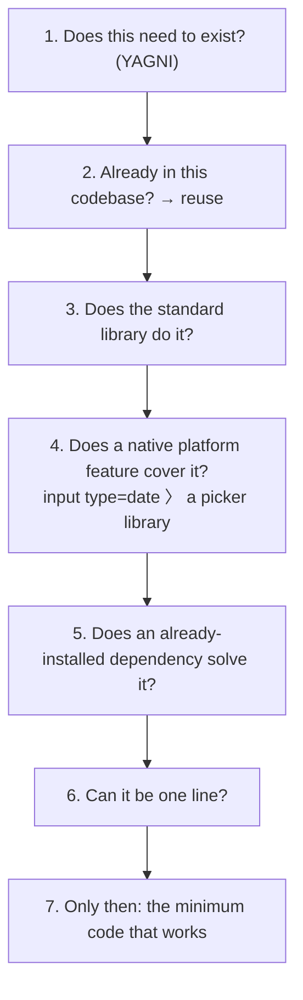

> Analysis date: 2026-06-30
> Target package: `@dietrichgebert/ponytail`, plugin `v4.8.4`
> Target commit: `16f6cbf` (`main` branch, 2026-06-30)
> Repository: https://github.com/DietrichGebert/ponytail
> Local analysis path: `~/workspace/opensources/ponytail`

---

_This article is partially written by Claude Code_

## Table of Contents

1. [Why ponytail?](#1-why-ponytail)
2. [Where Does It Sit Among the Previous Articles?](#2-where-does-it-sit-among-the-previous-articles)
3. [Understanding the Project in One Sentence](#3-understanding-the-project-in-one-sentence)
4. [Scale and Makeup: It's Prose, Not Code](#4-scale-and-makeup-its-prose-not-code)
5. [The Core: The Laziness Ladder](#5-the-core-the-laziness-ladder)
6. [One Discipline, 16 Agents](#6-one-discipline-16-agents)
7. [Per-Mode Injection: lite / full / ultra](#7-per-mode-injection-lite--full--ultra)
8. [The Six Sub-Skills](#8-the-six-sub-skills)
9. [Measurement: An Agentic Benchmark](#9-measurement-an-agentic-benchmark)
10. [Comparison With Superpowers: Process vs Philosophy](#10-comparison-with-superpowers-process-vs-philosophy)
11. [Notable Design Decisions](#11-notable-design-decisions)
12. [Things to Watch Out For](#12-things-to-watch-out-for)
13. [Conclusion](#13-conclusion)

---

## 1. Why ponytail?

ponytail introduces itself in one line in the README: **"He says nothing. He writes one line. It works."** It evokes a senior developer with a long ponytail and oval glasses who has been at the company longer than version control. You show him fifty lines; he says nothing and replaces them with one.

ponytail **puts that senior developer inside your AI agent.** It's a skill that suppresses the agent's instinct to write more code and makes it pick the "laziest solution that actually works."

On the surface it looks like yet another agent skill, like [Superpowers](/kb/2026-04-18-superpowers-architecture). But open the repository and three things set ponytail apart.

First, ponytail injects **a single philosophy, not a process.** "Write less code." It concretizes that philosophy into a 7-rung **laziness ladder** and makes the agent climb it on every response.

Second, ponytail **ships one discipline to 16 agents.** It packages a single SKILL.md via every available mechanism — skill, hook, slash command, MCP server, plugin — so it injects the same rules in Claude Code, opencode, Gemini, Copilot, Codex, Cursor, Cline, Pi, Hermes, Zed, and more.

Third, ponytail **measures its own effect.** With an agentic benchmark that edits a real open-source repo, it proves "~54% less code, 100% safety preserved," and is candid about its measurement method.

So if you see ponytail only as "a prompt that says write less code," you miss the point. More precisely, it is **a system that ships a single discipline, to every agent, in a measurable form.**

## 2. Where Does It Sit Among the Previous Articles?

Placed next to the skill/agent articles I've analyzed recently, ponytail's position comes into focus.

| Article                                                                                       | Central problem                        | Relationship to ponytail                                                                         |
| --------------------------------------------------------------------------------------------- | -------------------------------------- | ------------------------------------------------------------------------------------------------ |
| [Superpowers](/kb/2026-04-18-superpowers-architecture)                                        | Injecting dev process (TDD, debugging) | Where Superpowers injects "how to work," ponytail injects one philosophy: "how little to build." |
| [OpenCode](/kb/2026-06-29-opencode-architecture) · [Cline](/kb/2026-06-30-cline-architecture) | The skill system of coding agents      | Both handle `SKILL.md`-based skills. ponytail ports one such skill to 16 agents.                 |
| [Hermes Agent](/kb/2026-05-13-hermes-agent-architecture)                                      | An agent with tools, skills, plugins   | ponytail's `plugin.yaml` attaches directly to Hermes's hook (`pre_llm_call`).                    |

The key is that ponytail is not explained as "a prompt that reduces code." In the Superpowers article the boundary was "lazily loaded process docs." What fills that spot in ponytail is **the laziness ladder (SKILL.md), the distribution adapters for 16 agents, and the benchmark harness that proves the effect.**

## 3. Understanding the Project in One Sentence

**ponytail** packs a "lazy senior developer" discipline into a single `SKILL.md`, packages it as skill/hook/command/MCP/plugin to inject the same rules into 16 AI agents, and measures its effect with an agentic benchmark that edits a real repo — a **code-reduction discipline for agents.**

As questions:

| Question                      | ponytail's answer                                                                                                  |
| ----------------------------- | ------------------------------------------------------------------------------------------------------------------ |
| What does it inject?          | The "laziness ladder" and rules of `skills/ponytail/SKILL.md`, applied on the agent's every response.              |
| How does it stay always-on?   | A `pre_llm_call` hook in `hooks/` injects the rules into the system context right before the LLM call.             |
| Which agents does it support? | Claude Code, opencode, Gemini, Copilot, Codex, Cursor, Cline, Pi, Hermes, Zed, Aider, and more — 16.               |
| Can it run over MCP?          | `ponytail-mcp` exposes the same rules as a prompt and a tool (for hosts whose only injection point is the prompt). |
| Can you tune the intensity?   | Three modes: `lite` / `full` (default) / `ultra`. The hook picks only the matching mode's lines from SKILL.md.     |
| How is the effect guaranteed? | The agentic measurement in `benchmarks/` — scored on the `git diff` left after editing a real FastAPI+React repo.  |

## 4. Scale and Makeup: It's Prose, Not Code

ponytail's scale is different in character from the other subjects.

| Item                |                       Count |
| ------------------- | --------------------------: |
| Git-tracked files   |                         149 |
| Markdown files      |                          55 |
| JavaScript/py code  | small (hooks, MCP, scripts) |
| Skills (`SKILL.md`) |                           6 |
| Slash commands      |                           6 |

The key is that **the body is prose, not code.** ponytail's value isn't an algorithm but a well-honed discipline (SKILL.md) and the thin adapters that carry it to every agent. Those adapters are `hooks/` (injection), `commands/` (slash commands), `ponytail-mcp/` (MCP), `plugin.yaml`/`opencode.json`/`gemini-extension.json` (platform manifests), and `benchmarks/` (measurement).

## 5. The Core: The Laziness Ladder

ponytail's body is `skills/ponytail/SKILL.md`. The first sentence nails the philosophy: **"You are a lazy senior developer. Lazy means efficient, not careless. The best code is the code never written."**

It then concretizes that philosophy into a **laziness ladder.** The agent descends from the top and stops at the first rung that holds.

There are two important caveats.

- **The ladder is a reflex, not a research project.** But you must understand the problem _before_ climbing it. The SKILL.md insists "laziness shortens the solution, never the reading." Read the code fully and trace the flow, then be lazy.
- **A bug fix is the root cause, not a symptom.** Before editing, grep every caller of the function and fix the one shared function. That is both the smallest diff and the root-cause fix.

The rules are clear too: no unrequested abstractions (no interface with one implementation, no factory for one product), deletion over addition, fewest files, and deliberate simplifications marked with a `ponytail:` comment — naming the ceiling and the upgrade path (`# ponytail: global lock, per-account locks if throughput matters`).

The output format is lazy too: **code first, then at most three short lines** (what was skipped, when to add it). The pattern is `[code] → skipped: [X], add when [Y]`. If the explanation is longer than the code, delete the explanation.

## 6. One Discipline, 16 Agents

The most striking part of ponytail is the distribution. It packages one SKILL.md via every possible injection mechanism.

| Mechanism          | Files                                                    | Where it attaches                                |
| ------------------ | -------------------------------------------------------- | ------------------------------------------------ |
| Skill              | `skills/*/SKILL.md`                                      | Skill-supporting agents (Claude Code, opencode…) |
| Hook (always-on)   | `hooks/*.js`, `claude-codex-hooks.json`                  | Injects into system context before the LLM call  |
| Slash command      | `commands/*.toml`                                        | `/ponytail`, `/ponytail-review`, etc.            |
| MCP server         | `ponytail-mcp/`                                          | Exposes the rules as a prompt/tool (MCP hosts)   |
| Plugin             | `plugin.yaml`                                            | Hermes Agent (the `pre_llm_call` hook)           |
| Extension manifest | `opencode.json`, `gemini-extension.json`, `pi-extension` | opencode, Gemini, Pi                             |

The support list is broad — Aider, Claude Code, Cline, Codex, Copilot, Cursor, Gemini, Hermes, opencode, Pi, Roo, Windsurf, Zed. The key insight is this: **the discipline lives in exactly one place (SKILL.md), and everything else is a thin adapter that plugs it into each agent's injection point.** So fixing the rules once changes all 16 agents at once.

The MCP adapter's design note is especially candid. `ponytail-mcp/README` states that "MCP has no portable primitive for 'inject this every turn,' so MCP is the fallback for hosts whose only injection point is the prompt menu." The hook handles always-on; MCP is a backup for hosts where that isn't possible.

## 7. Per-Mode Injection: lite / full / ultra

ponytail offers three intensity levels.

- **lite** — build what's asked, but name the lazier alternative in one line. The user picks.
- **full** (default) — enforce the ladder. Standard library and native features first, the shortest diff.
- **ultra** — YAGNI extremist. Deletion over addition; ship the one-liner and question the requirement itself in the same breath.

The implementation is clever. `hooks/ponytail-instructions.js` reads SKILL.md, strips the frontmatter, and **filters only the intensity table and example lines per mode.** Lines labeled lite/full/ultra keep only the current mode's; every other rule line stays. So one SKILL.md mutates into three intensities at injection time.

## 8. The Six Sub-Skills

Beyond the main skill, ponytail has five sub-skills, all variations on the same philosophy.

| Skill             | Purpose                                                              |
| ----------------- | -------------------------------------------------------------------- |
| `ponytail`        | The always-on main discipline (the laziness ladder)                  |
| `ponytail-review` | Code review focused exclusively on over-engineering — what to delete |
| `ponytail-audit`  | Scans the whole repo (not a diff) and ranks the over-engineering     |
| `ponytail-debt`   | Harvests the `ponytail:` comments in the codebase into a debt ledger |
| `ponytail-gain`   | Shows the measured savings as a scoreboard, from benchmark medians   |
| `ponytail-help`   | A quick-reference card for modes, skills, and commands               |

`ponytail-debt` is especially clever. It harvests the `ponytail:` comments (the ceilings and upgrade paths of deliberate simplifications) into a list of debt to pay later. It's a device to keep the "lazy choices" from being forgotten.

## 9. Measurement: An Agentic Benchmark

What most distinguishes ponytail from other skills is that it **measures itself** — and the measurement is honest.

The method: a headless Claude Code session edits a real open-source repo ([tiangolo's full-stack-fastapi-template](https://github.com/fastapi/full-stack-fastapi-template), a genuine FastAPI+React), scored on the `git diff` it leaves. Twelve feature tickets, the same agent with and without the skill (n=4, Haiku 4.5).

| vs no-skill baseline          |      LOC |   tokens |     cost |     time | safe |
| ----------------------------- | -------: | -------: | -------: | -------: | ---: |
| **ponytail**                  | **-54%** | **-22%** | **-20%** | **-27%** | 100% |
| caveman (terse-prose control) |     -20% |      +7% |      +3% |      +2% | 100% |
| "YAGNI + one-liners" prompt   |     -33% |     -14% |     -21% |     -30% |  95% |

ponytail is **the only arm that cuts every metric while staying 100% safe.** A bare "write one-liners" prompt drops a safety guard, landing at 95%. The cut is biggest at over-build traps (a date picker, 404 lines → 23, because it reaches for a native `<input>`) and near zero on code that's already minimal.

The honesty stands out. The README corrects itself, noting that the 80–94% an earlier single-shot benchmark reported is "the per-task ceiling, not the average, against a fair agentic baseline." It declines to inflate the marketing figure and discloses the measurement context.

## 10. Comparison With Superpowers: Process vs Philosophy

Since this article started from "a contrast with [Superpowers](/kb/2026-04-18-superpowers-architecture)," let me lay it out.

| Axis              | Superpowers                                     | ponytail                                              |
| ----------------- | ----------------------------------------------- | ----------------------------------------------------- |
| What it injects   | Dev **process** (TDD, debugging, brainstorming) | One **philosophy** (write less — the laziness ladder) |
| Form              | A bundle of process docs                        | One SKILL.md + five sub-skills                        |
| Distribution      | Mostly the Claude Code/Codex ecosystem          | **16 agents** (skill, hook, MCP, plugin — everywhere) |
| Validation        | Justified by design philosophy                  | **Quantitatively proven with an agentic benchmark**   |
| Intensity control | Per-process on/off                              | lite/full/ultra mode filtering                        |

The gist: **where Superpowers addresses "how the agent works," ponytail addresses "how little the agent builds."** ponytail is obsessive about carrying that one thing to every agent and proving its effect in numbers.

So the two aren't rivals but different axes, and they stack: Superpowers for the process, ponytail for the size of the output. ponytail's SKILL.md in fact states that it "governs what you build, not how you talk (pair with Caveman for terse prose)" — designed to layer with other skills. Neither repo references the other, though, and ponytail's view that "trivial code needs no test (YAGNI applies to tests too)" can rub slightly against Superpowers' TDD rigor.

## 11. Notable Design Decisions

### 1. The discipline in one place, the adapters thin.

One SKILL.md is the single source of truth, and the manifests/hooks/MCP for 16 agents are thin adapters that plug it in. Fix the rules once and every agent changes.

### 2. Filtering one document per mode.

lite/full/ultra are not separate prompts but lines selected by mode label from the same SKILL.md. Three intensities derive from one truth.

### 3. "Don't be lazy about reading" baked in as a rule.

So that laziness shortens the code but not the understanding, it spells out "trace the flow to the end before climbing the ladder." A small diff in the wrong place, it warns, is not laziness but a second bug.

### 4. It measures itself honestly.

It gauges the effect with an agentic benchmark that edits a real repo, and corrects its own inflated older numbers. A skill that ships with a benchmark is rare in itself.

### 5. It tracks debt.

It marks deliberate simplifications with `ponytail:` comments, and `ponytail-debt` harvests them into a ledger. It keeps laziness from becoming amnesia.

## 12. Things to Watch Out For

### 1. The effect depends heavily on model and task.

-54% is the mean over 12 tasks; it reaches 94% at over-build traps and near zero on already-minimal code. Don't take the number as a single constant.

### 2. "Laziness" cuts both ways.

As the SKILL.md warns at length, a small diff that skips understanding is dangerous. ponytail's safety relies on the "don't be lazy about reading" rule — which may play out differently on weaker models.

### 3. The body is a prompt, not code.

ponytail's essence is the SKILL.md. So its performance depends on how well the LLM follows that instruction, and it's sensitive to model changes.

### 4. Many distribution adapters mean a broad surface.

16 agents × several mechanisms is powerful, but the manifests, hooks, and MCP each differ slightly. You have to track which injection point is used on which agent.

## 13. Conclusion

ponytail is a far larger project than "a prompt that reduces code." Its actual structure is **a system that ships a single discipline (the laziness ladder), to 16 agents, in a measurable form.**

Where [Superpowers](/kb/2026-04-18-superpowers-architecture) gives an agent a process to work by, ponytail gives it a single philosophy: write less code. And it carries that one thing to every agent and proves its effect with a benchmark that edits a real repo.

When looking at ponytail, the most important question is not "which prompt does it use?" The more important question is this:

> To inject one sheet of discipline identically into every agent, and prove its effect in numbers, what do you have to build?

ponytail's answer is one `SKILL.md`, thin adapters for 16 agents, and an honest agentic benchmark. Understand this bundle and you can see that ponytail is not merely a prompt but **a small system that ships and measures a discipline like a product.**
