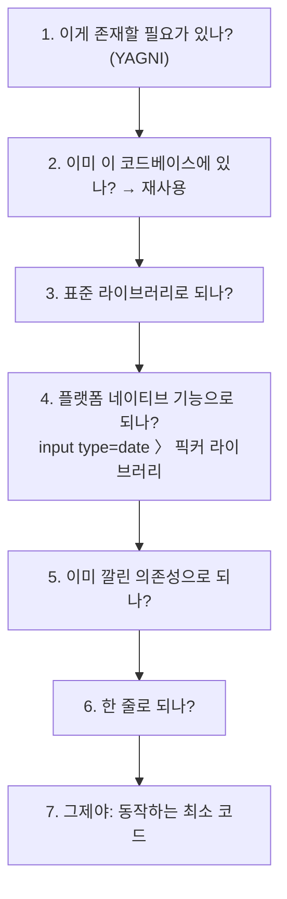

> 분석 일자: 2026-06-30
> 대상 패키지: `@dietrichgebert/ponytail`, 플러그인 `v4.8.4`
> 대상 커밋: `16f6cbf` (`main` 브랜치, 2026-06-30)
> 저장소: https://github.com/DietrichGebert/ponytail
> 로컬 분석 경로: `~/workspace/opensources/ponytail`

---

_This article is partially written by Claude Code_

## 목차

1. [왜 ponytail인가요?](#1-왜-ponytail인가요)
2. [기존 글들과 어디에 놓이나요?](#2-기존-글들과-어디에-놓이나요)
3. [프로젝트를 한 문장으로 이해하기](#3-프로젝트를-한-문장으로-이해하기)
4. [규모와 구성: 코드가 아니라 글입니다](#4-규모와-구성-코드가-아니라-글입니다)
5. [핵심: 게으름 사다리](#5-핵심-게으름-사다리)
6. [같은 규율, 16개 에이전트](#6-같은-규율-16개-에이전트)
7. [모드별 주입: lite / full / ultra](#7-모드별-주입-lite--full--ultra)
8. [보조 스킬 6종](#8-보조-스킬-6종)
9. [측정: agentic 벤치마크](#9-측정-agentic-벤치마크)
10. [Superpowers와 비교: 절차 vs 철학](#10-superpowers와-비교-절차-vs-철학)
11. [인상적인 설계 포인트](#11-인상적인-설계-포인트)
12. [주의해서 볼 지점](#12-주의해서-볼-지점)
13. [결론](#13-결론)

---

## 1. 왜 ponytail인가요?

ponytail은 README에서 자신을 한 줄로 소개합니다. **"He says nothing. He writes one line. It works."** 회사에 버전 관리 시스템보다 오래 있었던, 긴 머리에 둥근 안경을 쓴 시니어 개발자를 떠올리게 합니다. 50줄을 보여 주면, 그는 아무 말 없이 한 줄로 바꿔 놓습니다.

ponytail은 그 시니어 개발자를 **여러분의 AI 에이전트 안에 넣습니다.** 에이전트가 코드를 더 많이 짜려는 본능을 누르고, "가장 게으르지만 실제로 동작하는" 해법을 고르게 만드는 스킬입니다.

겉으로는 [Superpowers](/kb/2026-04-18-superpowers-architecture) 같은 또 하나의 에이전트 스킬로 보입니다. 하지만 저장소를 열면 ponytail을 구별 짓는 세 가지가 보입니다.

첫째, ponytail은 **절차가 아니라 한 가지 철학을 주입합니다.** "코드를 덜 써라." 그 철학을 7단계의 **게으름 사다리**로 구체화해, 에이전트가 매 응답마다 그 사다리를 오르게 합니다.

둘째, ponytail은 **하나의 규율을 16개 에이전트에 배포합니다.** SKILL.md 한 벌을 스킬·훅·슬래시 커맨드·MCP 서버·플러그인 등 가능한 모든 메커니즘으로 포장해, Claude Code·opencode·Gemini·Copilot·Codex·Cursor·Cline·Pi·Hermes·Zed 등 어디서든 같은 규칙을 주입합니다.

셋째, ponytail은 **자신의 효과를 측정합니다.** 실제 오픈소스 저장소를 고치는 agentic 벤치마크로 "코드 약 54% 감소, 안전성 100% 유지"를 입증하고, 측정 방법까지 솔직하게 공개합니다.

그래서 ponytail을 "코드 줄이라는 프롬프트"라고만 보면 핵심을 놓칩니다. 더 정확하게는 **한 가지 규율을, 모든 에이전트에, 측정 가능한 형태로 배포하는 시스템**입니다.

## 2. 기존 글들과 어디에 놓이나요?

최근 분석한 스킬·에이전트 글들과 나란히 놓으면 ponytail의 위치가 또렷해집니다.

| 글                                                                                            | 중심 문제                                 | ponytail과의 관계                                                                                             |
| --------------------------------------------------------------------------------------------- | ----------------------------------------- | ------------------------------------------------------------------------------------------------------------- |
| [Superpowers](/kb/2026-04-18-superpowers-architecture)                                        | 에이전트에게 개발 절차(TDD·디버깅)를 주입 | Superpowers가 "어떻게 일할지"를 주입한다면, ponytail은 "얼마나 적게 만들지"라는 한 가지 철학을 주입합니다.    |
| [OpenCode](/kb/2026-06-29-opencode-architecture) · [Cline](/kb/2026-06-30-cline-architecture) | 코딩 에이전트의 skill 시스템              | OpenCode·Cline 모두 `SKILL.md` 기반 skill을 다룹니다. ponytail은 그 skill 한 장을 16개 에이전트로 이식합니다. |
| [Hermes Agent](/kb/2026-05-13-hermes-agent-architecture)                                      | 도구·스킬·플러그인을 갖춘 에이전트        | ponytail의 `plugin.yaml`은 Hermes의 hook(`pre_llm_call`)으로 직접 붙습니다.                                   |

핵심은 ponytail이 "코드 줄이는 프롬프트"로 설명되지 않는다는 점입니다. Superpowers 글에서 경계는 "지연 로딩되는 절차 문서"였습니다. ponytail에서 그 자리를 채우는 것은 **게으름 사다리(SKILL.md), 16개 에이전트용 배포 어댑터, 효과를 증명하는 벤치마크 하네스**입니다.

## 3. 프로젝트를 한 문장으로 이해하기

**ponytail**은 "게으른 시니어 개발자" 규율을 `SKILL.md` 한 장에 담고, 이를 스킬·훅·커맨드·MCP·플러그인으로 포장해 16개 AI 에이전트에 동일하게 주입하며, 실제 저장소를 고치는 agentic 벤치마크로 효과를 측정하는 **에이전트용 코드 절감 규율**입니다.

질문으로 바꾸면 이렇습니다.

| 질문                        | ponytail의 답                                                                              |
| --------------------------- | ------------------------------------------------------------------------------------------ |
| 무엇을 주입하나요?          | `skills/ponytail/SKILL.md`의 "게으름 사다리"와 규칙을, 에이전트의 매 응답에 적용합니다.    |
| 어떻게 항상 켜 두나요?      | `hooks/`의 `pre_llm_call` 훅이 LLM 호출 직전에 규칙을 system context로 주입합니다.         |
| 어떤 에이전트를 지원하나요? | Claude Code·opencode·Gemini·Copilot·Codex·Cursor·Cline·Pi·Hermes·Zed·Aider 등 16종입니다.  |
| MCP로도 쓸 수 있나요?       | `ponytail-mcp`가 같은 규칙을 prompt와 tool로 노출합니다(주입점이 prompt뿐인 호스트용).     |
| 강도를 조절할 수 있나요?    | `lite` / `full`(기본) / `ultra` 세 모드. 훅이 SKILL.md에서 해당 모드 줄만 골라 주입합니다. |
| 효과는 어떻게 보장하나요?   | `benchmarks/`의 agentic 측정 — 실제 FastAPI+React 저장소를 고친 `git diff`로 채점합니다.   |

## 4. 규모와 구성: 코드가 아니라 글입니다

ponytail의 규모는 다른 분석 대상과 성격이 다릅니다.

| 항목               |                  수치 |
| ------------------ | --------------------: |
| Git 추적 파일 수   |                 149개 |
| Markdown 파일 수   |                  55개 |
| JavaScript/py 코드 | 적음(훅·MCP·스크립트) |
| 스킬(`SKILL.md`)   |                   6종 |
| 슬래시 커맨드      |                   6개 |

핵심은 **코드가 아니라 글이 본체**라는 점입니다. ponytail의 가치는 알고리즘이 아니라 잘 벼린 규율(SKILL.md)과, 그것을 모든 에이전트로 옮기는 얇은 어댑터들입니다. `hooks/`(주입), `commands/`(슬래시 커맨드), `ponytail-mcp/`(MCP), `plugin.yaml`·`opencode.json`·`gemini-extension.json`(플랫폼 매니페스트), `benchmarks/`(측정)가 그 어댑터입니다.

## 5. 핵심: 게으름 사다리

ponytail의 본체는 `skills/ponytail/SKILL.md`입니다. 첫 문장이 철학을 못 박습니다. **"You are a lazy senior developer. Lazy means efficient, not careless. The best code is the code never written."**

이어서 그 철학을 **게으름 사다리(the ladder)** 로 구체화합니다. 에이전트는 위에서부터 내려오며, 처음으로 성립하는 단(rung)에서 멈춥니다.

중요한 단서가 둘 있습니다.

- **사다리는 반사 신경이지 연구 과제가 아닙니다.** 다만 사다리를 오르기 _전에_ 문제를 먼저 이해해야 합니다. SKILL.md는 "게으름은 해법을 줄이지, 읽기를 줄이지 않는다"고 못 박습니다. 코드를 다 읽고 흐름을 추적한 뒤에 게을러지라는 것입니다.
- **버그 수정은 증상이 아니라 근본 원인입니다.** 고치기 전에 해당 함수의 모든 호출부를 grep하고, 공유 함수 한 곳을 고칩니다. 그게 곧 가장 작은 diff이자 근본 수정입니다.

규칙도 분명합니다. 요청하지 않은 추상화 금지(구현이 하나뿐인 인터페이스, 제품이 하나뿐인 팩토리), 추가보다 삭제, 파일 수 최소화. 의도적 단순화는 `ponytail:` 주석으로 표시합니다 — 천장과 업그레이드 경로까지 적어서요(`# ponytail: global lock, per-account locks if throughput matters`).

출력 형식도 게으릅니다. **코드 먼저, 그다음 최대 세 줄**(무엇을 건너뛰었고 언제 추가할지). 패턴은 `[코드] → skipped: [X], add when [Y]`입니다. 설명이 코드보다 길면 설명을 지웁니다.

## 6. 같은 규율, 16개 에이전트

ponytail에서 가장 인상적인 부분은 배포입니다. 하나의 SKILL.md를 가능한 모든 주입 메커니즘으로 포장합니다.

| 메커니즘        | 파일                                                     | 어디에 붙나                                 |
| --------------- | -------------------------------------------------------- | ------------------------------------------- |
| 스킬            | `skills/*/SKILL.md`                                      | Claude Code·opencode 등 skill 지원 에이전트 |
| 훅(항상 켜짐)   | `hooks/*.js`, `claude-codex-hooks.json`                  | LLM 호출 직전 system context 주입           |
| 슬래시 커맨드   | `commands/*.toml`                                        | `/ponytail`, `/ponytail-review` 등          |
| MCP 서버        | `ponytail-mcp/`                                          | prompt·tool로 규칙 노출(MCP 호스트)         |
| 플러그인        | `plugin.yaml`                                            | Hermes Agent(`pre_llm_call` 훅)             |
| 확장 매니페스트 | `opencode.json`, `gemini-extension.json`, `pi-extension` | opencode·Gemini·Pi                          |

지원 목록은 넓습니다 — Aider, Claude Code, Cline, Codex, Copilot, Cursor, Gemini, Hermes, opencode, Pi, Roo, Windsurf, Zed. 핵심 통찰은 이것입니다. **규율은 한 곳(SKILL.md)에만 있고, 나머지는 그것을 각 에이전트의 주입점에 꽂는 얇은 어댑터입니다.** 그래서 규칙을 한 번 고치면 16개 에이전트가 동시에 바뀝니다.

MCP 어댑터의 설계 노트가 특히 솔직합니다. `ponytail-mcp/README`는 "MCP에는 '매 턴 주입' 같은 이식 가능한 원시 기능이 없어서, MCP는 주입점이 prompt 메뉴뿐인 호스트를 위한 차선책"이라고 적습니다. 항상-켜짐은 훅이 맡고, MCP는 그게 불가능한 호스트를 위한 보조라는 것입니다.

## 7. 모드별 주입: lite / full / ultra

ponytail은 강도를 세 단계로 둡니다.

- **lite** — 요청대로 만들되, 더 게으른 대안을 한 줄로 알려 줍니다. 선택은 사용자 몫.
- **full**(기본) — 사다리를 강제합니다. 표준 라이브러리·네이티브 우선, 가장 짧은 diff.
- **ultra** — YAGNI 극단주의. 추가보다 삭제, 한 줄을 내놓고 요구사항 자체를 그 자리에서 되묻습니다.

구현이 영리합니다. `hooks/ponytail-instructions.js`는 SKILL.md를 읽어 frontmatter를 떼고, **강도 표와 예시 줄만 모드별로 필터링**합니다. lite/full/ultra라는 라벨이 붙은 줄은 현재 모드의 것만 남기고, 그 외 규칙 줄은 그대로 둡니다. 즉 한 장의 SKILL.md가 세 가지 강도로 변형되어 주입됩니다.

## 8. 보조 스킬 6종

ponytail은 메인 스킬 외에 다섯 개의 보조 스킬을 둡니다. 모두 같은 철학의 변주입니다.

| 스킬              | 역할                                                         |
| ----------------- | ------------------------------------------------------------ |
| `ponytail`        | 항상-켜짐 메인 규율(게으름 사다리)                           |
| `ponytail-review` | 오직 과잉 설계만 보는 코드 리뷰 — 무엇을 지울지 찾습니다     |
| `ponytail-audit`  | diff가 아니라 저장소 전체를 훑어 과잉 설계를 순위로 매깁니다 |
| `ponytail-debt`   | 코드베이스의 `ponytail:` 주석을 모아 부채 장부로 만듭니다    |
| `ponytail-gain`   | 벤치마크 중앙값으로 절감 효과를 점수판처럼 보여 줍니다       |
| `ponytail-help`   | 모드·스킬·커맨드 빠른 참조 카드                              |

특히 `ponytail-debt`가 영리합니다. ponytail이 남긴 `ponytail:` 주석(의도적 단순화의 천장과 업그레이드 경로)을 수확해, 나중에 갚을 부채 목록으로 만듭니다. "게으른 선택"을 잊지 않게 추적하는 장치입니다.

## 9. 측정: agentic 벤치마크

ponytail이 다른 스킬과 가장 다른 점은 **자신을 측정한다**는 것입니다. 그리고 그 측정이 정직합니다.

방법은 이렇습니다. 헤드리스 Claude Code 세션이 실제 오픈소스 저장소([tiangolo의 full-stack-fastapi-template](https://github.com/fastapi/full-stack-fastapi-template), 진짜 FastAPI+React)를 고치게 하고, 남긴 `git diff`로 채점합니다. 12개 기능 티켓, 스킬 있을 때와 없을 때를 비교(n=4, Haiku 4.5).

| no-skill 대비               |      LOC |     토큰 |     비용 |     시간 | 안전 |
| --------------------------- | -------: | -------: | -------: | -------: | ---: |
| **ponytail**                | **-54%** | **-22%** | **-20%** | **-27%** | 100% |
| caveman(간결 프롬프트 대조) |     -20% |      +7% |      +3% |      +2% | 100% |
| "YAGNI+한 줄" 프롬프트      |     -33% |     -14% |     -21% |     -30% |  95% |

ponytail은 **모든 지표를 줄이면서 안전성을 100% 유지하는 유일한 방식**입니다. 단순한 "한 줄로 써라" 프롬프트는 안전 가드 하나를 떨어뜨려 95%가 됩니다. 절감은 과잉 설계 함정에서 가장 큽니다(날짜 픽커 404줄 → 23줄, 네이티브 `<input>`을 쓰기 때문) — 이미 최소인 코드에서는 거의 0입니다.

정직성이 돋보입니다. README는 예전 단발(single-shot) 벤치마크가 보고한 80~94%가 "공정한 agentic 기준선 대비로는 평균이 아니라 과제별 천장"이라고 스스로 정정합니다. 마케팅 수치를 부풀리지 않고 측정 맥락을 밝히는 태도입니다.

## 10. Superpowers와 비교: 절차 vs 철학

이 글의 출발점이 "[Superpowers](/kb/2026-04-18-superpowers-architecture)와의 대조"였으니 정리해 두겠습니다.

| 축          | Superpowers                              | ponytail                                         |
| ----------- | ---------------------------------------- | ------------------------------------------------ |
| 주입하는 것 | 개발 **절차**(TDD, 디버깅, 브레인스토밍) | 한 가지 **철학**(코드를 덜 써라 — 게으름 사다리) |
| 형태        | 여러 절차 문서의 묶음                    | 한 장의 SKILL.md + 보조 5종                      |
| 배포 범위   | 주로 Claude Code/Codex 생태계            | **16개 에이전트**(스킬·훅·MCP·플러그인 전방위)   |
| 검증        | 설계 철학으로 정당화                     | **agentic 벤치마크로 정량 입증**                 |
| 강도 조절   | 절차별 on/off                            | lite/full/ultra 모드 필터링                      |

요지는 이렇습니다. **Superpowers가 "에이전트가 어떻게 일하는가"를 다룬다면, ponytail은 "에이전트가 얼마나 적게 만드는가"를 다룹니다.** ponytail은 그 한 가지를 모든 에이전트로 옮기고, 그 효과를 숫자로 증명하는 데 집착합니다.

그래서 둘은 대립이 아니라 서로 다른 축이라 함께 쓸 수 있습니다. 절차는 Superpowers로, 산출물의 크기는 ponytail로 다스리는 식입니다. 실제로 ponytail의 SKILL.md는 "무엇을 만들지를 다스리되 말투는 다스리지 않는다 — 말투는 Caveman에 맡긴다"고 명시해, 다른 스킬과 겹쳐 쓰도록 설계됐습니다. 다만 두 저장소가 서로를 직접 언급하지는 않으며, ponytail이 "사소한 코드엔 테스트도 YAGNI"로 보는 지점은 Superpowers의 TDD 엄격함과 살짝 부딪힐 수 있습니다.

## 11. 인상적인 설계 포인트

### 1. 규율은 한 곳, 어댑터는 얇게.

SKILL.md 한 장이 단일 진실의 원천이고, 16개 에이전트용 매니페스트·훅·MCP는 이를 꽂는 얇은 어댑터입니다. 규칙을 한 번 고치면 모든 에이전트가 바뀝니다.

### 2. 한 문서를 모드별로 필터링합니다.

lite/full/ultra가 별도 프롬프트가 아니라, 같은 SKILL.md에서 모드 라벨이 붙은 줄만 골라 주입됩니다. 한 진실에서 세 강도가 파생됩니다.

### 3. "읽기는 게을리하지 마라"를 규칙으로 박았습니다.

게으름이 코드를 줄이되 이해를 줄이지 않게, "사다리를 오르기 전에 흐름을 끝까지 추적하라"를 명시합니다. 작은 diff를 엉뚱한 곳에 넣는 것은 게으름이 아니라 두 번째 버그라고 못 박습니다.

### 4. 스스로를 정직하게 측정합니다.

실제 저장소를 고치는 agentic 벤치마크로 효과를 재고, 과장된 옛 수치를 스스로 정정합니다. "스킬에 벤치마크가 딸려 있다"는 점 자체가 드뭅니다.

### 5. 부채를 추적합니다.

`ponytail:` 주석으로 의도적 단순화를 표시하고, `ponytail-debt`가 그것을 장부로 수확합니다. 게으름이 망각이 되지 않게 합니다.

## 12. 주의해서 볼 지점

### 1. 효과는 모델·작업에 크게 좌우됩니다.

-54%는 12개 과제의 평균이고, 과잉 설계 함정에서는 94%까지, 이미 최소인 코드에서는 0에 가깝습니다. 숫자를 단일 상수로 받아들이면 안 됩니다.

### 2. "게으름"은 양날입니다.

SKILL.md가 길게 경고하듯, 이해를 건너뛴 작은 diff는 위험합니다. ponytail의 안전성은 "읽기는 게을리하지 마라"라는 규칙에 의존합니다. 그 규칙이 약한 모델에서는 효과가 다를 수 있습니다.

### 3. 본체가 코드가 아니라 프롬프트입니다.

ponytail의 정수는 SKILL.md입니다. 즉 성능은 LLM이 그 지시를 얼마나 따르느냐에 달려 있고, 모델 변화에 민감합니다.

### 4. 배포 어댑터가 많아 관리 범위가 넓습니다.

16개 에이전트 × 여러 메커니즘은 강력하지만, 매니페스트·훅·MCP가 각자 약간씩 다릅니다. 어떤 에이전트에서 어떤 주입점이 쓰이는지 구분해서 봐야 합니다.

## 13. 결론

ponytail은 "코드 줄이라는 프롬프트"보다 훨씬 큰 프로젝트입니다. 실제 구조는 **한 가지 규율(게으름 사다리)을, 16개 에이전트에, 측정 가능한 형태로 배포하는 시스템**입니다.

[Superpowers](/kb/2026-04-18-superpowers-architecture)가 에이전트에게 일하는 절차를 준다면, ponytail은 단 하나의 철학을 줍니다. 코드를 덜 써라. 그리고 그 한 가지를 모든 에이전트로 옮기고, 실제 저장소를 고치는 벤치마크로 효과를 증명합니다.

ponytail을 볼 때 가장 중요한 질문은 "어떤 프롬프트를 쓰나요?"가 아닙니다. 더 중요한 질문은 이것입니다.

> 한 장의 규율을 모든 에이전트에 똑같이 주입하고, 그 효과를 숫자로 증명하려면 무엇을 만들어야 하나요?

ponytail의 답은 `SKILL.md` 한 장, 16개 에이전트용 얇은 어댑터, 정직한 agentic 벤치마크입니다. 이 묶음을 이해하면, ponytail이 단순한 프롬프트가 아니라 **규율을 제품처럼 배포하고 측정하는 작은 시스템**이라는 것이 보입니다.
