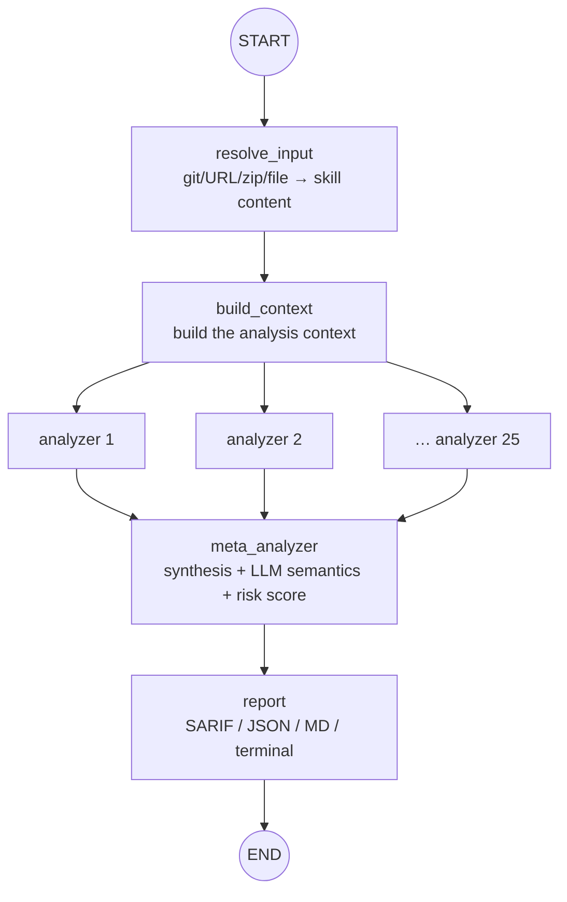

> Analysis date: 2026-07-03
> Target package: `skillspector` (NVIDIA, Python 3.12+, Apache-2.0)
> Target commit: `5df93c5` (`main` branch, 2026-06-30)
> Repository: https://github.com/NVIDIA/skillspector
> Local analysis path: `~/workspace/opensources/SkillSpector`

---

_This article is partially written by Claude Code_

## Table of Contents

1. [Why SkillSpector?](#1-why-skillspector)
2. [Where Does It Sit Among the Previous Articles?](#2-where-does-it-sit-among-the-previous-articles)
3. [Understanding the Project in One Sentence](#3-understanding-the-project-in-one-sentence)
4. [Tech Stack and Scale](#4-tech-stack-and-scale)
5. [The Big Picture: A LangGraph Map-Reduce](#5-the-big-picture-a-langgraph-map-reduce)
6. [Codebase Map](#6-codebase-map)
7. [25 Analyzers: Combing the Skill in Five Families](#7-25-analyzers-combing-the-skill-in-five-families)
8. [Two Stages: Fast Static Analysis + Optional LLM Semantics](#8-two-stages-fast-static-analysis--optional-llm-semantics)
9. [meta_analyzer: Synthesis and a Risk Score](#9-meta_analyzer-synthesis-and-a-risk-score)
10. [Output: SARIF, Baseline, OSV.dev](#10-output-sarif-baseline-osvdev)
11. [Auditing Agents With an Agent](#11-auditing-agents-with-an-agent)
12. [Notable Design Decisions](#12-notable-design-decisions)
13. [Things to Watch Out For](#13-things-to-watch-out-for)
14. [Conclusion](#14-conclusion)

---

## 1. Why SkillSpector?

SkillSpector describes itself in one line in the README: **"Security scanner for AI agent skills."** It's a tool that vets an agent skill before you install it, finding vulnerabilities and malicious patterns.

The reason it's needed lies in the risk structure of skills. The agent skills used by Claude Code, Codex, and Gemini CLI **run with implicit trust and almost no vetting.** Install someone else's `SKILL.md` and its instructions immediately become the agent's behavior. Per research SkillSpector cites, **26.1% of skills in the wild contain vulnerabilities and 5.2% show likely malicious intent.**

SkillSpector tries to answer one question: **"Is this skill safe to install?"**

On the surface it looks like yet another security scanner. But open the repository and two things set it apart.

First, SkillSpector **is built as a LangGraph graph.** That is, it uses an AI agent framework to audit AI agent skills. It's a map-reduce pipeline that resolves the input, fans it out in parallel to 25 specialized analyzers, then merges the results into one.

Second, SkillSpector **uses rules and an LLM together.** Fast static analysis (patterns, AST, taint, YARA) combs first, and an LLM evaluates meaning on top. It fills the "intent" that rules miss, and the cost and instability that an LLM-only approach would carry.

So if you see SkillSpector only as a "skill linter," you've seen half of it. More precisely, it is **a security pipeline that weaves many specialized analyzers into an agent graph to audit a skill before install.**

## 2. Where Does It Sit Among the Previous Articles?

This blog has recently covered the "skills ecosystem" from several angles. SkillSpector stands on the **defense** side of that ecosystem.

| Article                                                                                           | Central problem                      | Relationship to SkillSpector                                                                                       |
| ------------------------------------------------------------------------------------------------- | ------------------------------------ | ------------------------------------------------------------------------------------------------------------------ |
| [ponytail](/kb/2026-06-30-ponytail-architecture)                                                  | Shipping one skill to 16 agents      | Where ponytail **injects** a skill, SkillSpector **vets** a skill before install. Same target, opposite direction. |
| [Superpowers](/kb/2026-04-18-superpowers-architecture)                                            | Injecting process/skills into agents | Where Superpowers loads skills on a premise of trust, SkillSpector verifies that trust.                            |
| [CodeGraph](/kb/2026-06-04-codegraph-architecture) · [Semble](/kb/2026-06-04-semble-architecture) | Code intelligence (graph/search)     | Where those understand code to build **capability**, SkillSpector understands code to find **risk**.               |

The key is that SkillSpector is not explained as a "skill linter." In the skills-ecosystem articles, the boundary was always "how do we get skills used well?" What fills that spot in SkillSpector is **a LangGraph audit graph, 25 analyzers, and a 0–100 risk score.**

## 3. Understanding the Project in One Sentence

**SkillSpector** is a Python security scanner for AI agent skills that takes a git repo, URL, zip, directory, or file as input, runs 25 analyzers (static patterns, behavioral, signatures, MCP, LLM semantics) in parallel inside a LangGraph graph, and has an LLM meta-analyzer synthesize the results into **a 0–100 risk score with recommendations.**

As questions:

| Question                        | SkillSpector's answer                                                                                                                   |
| ------------------------------- | --------------------------------------------------------------------------------------------------------------------------------------- |
| What does it scan?              | Agent skills as git repos, URLs, zips, directories, or single files.                                                                    |
| What does it look for?          | 68 patterns across 17 categories — prompt injection, data exfiltration, privilege escalation, supply chain, memory poisoning, and more. |
| How does it scan?               | A LangGraph graph fans out to 25 analyzers in parallel, and a meta-analyzer merges them.                                                |
| Rules or an LLM?                | Both. Fast static analysis first, then optional LLM semantic evaluation (turn it off with `--no-llm`).                                  |
| What does the output look like? | Terminal, JSON, Markdown, and SARIF, with a 0–100 score, severity labels, and recommendations.                                          |
| Can it run inside an agent?     | Via `skillspector mcp` it becomes an MCP server, so an agent can scan a skill inside a session.                                         |

## 4. Tech Stack and Scale

| Area            | Technology                                                                                   |
| --------------- | -------------------------------------------------------------------------------------------- |
| Language        | **Python 3.12+**, Pydantic models, Typer CLI, Rich output                                    |
| Orchestration   | **LangGraph** (`StateGraph`) — the analysis pipeline as a graph                              |
| LLM             | LangChain (anthropic/aws/core) + OpenAI SDK, per-model token budgets (`model_registry.yaml`) |
| Static analysis | Regex patterns, **AST**, **taint tracking**, **YARA** signatures, semgrep                    |
| Vuln lookups    | **OSV.dev** live CVE queries (offline fallback)                                              |
| Output          | Terminal, JSON, Markdown, **SARIF**, baseline suppression                                    |
| Distribution    | `uv tool install`, an MCP server (`skillspector mcp`), a Pi extension                        |

The scale of the local checkout:

| Item                     | Count |
| ------------------------ | ----: |
| Git-tracked files        |   208 |
| Python files             |   143 |
| Analyzers                |    25 |
| YARA rule files          |     5 |
| Vulnerability categories |    17 |

## 5. The Big Picture: A LangGraph Map-Reduce

SkillSpector's skeleton is a single LangGraph `StateGraph` in `src/skillspector/graph.py`. The flow is map-reduce, plainly.

The code says the same. From `build_context`, an edge branches to each analyzer (`add_edge("build_context", analyzer_id)`), and every analyzer converges back on `meta_analyzer` (`add_edge(analyzer_id, "meta_analyzer")`). So the tool's structure is: **build the context once, scatter it across 25 branches, and gather it in one place.**

## 6. Codebase Map

The heart is `src/skillspector/`.

| Location                   | Purpose                                                                      |
| -------------------------- | ---------------------------------------------------------------------------- |
| `graph.py`                 | **Assembles the LangGraph graph** (nodes, edges, compile)                    |
| `nodes/resolve_input.py`   | Resolves the input (git/URL/zip/dir/file) into skill content                 |
| `nodes/build_context.py`   | Builds the context the analyzers share                                       |
| `nodes/analyzers/`         | **The 25 analyzers** — static patterns, behavioral, YARA, MCP, LLM semantics |
| `nodes/meta_analyzer.py`   | Synthesizes findings, re-evaluates with an LLM, computes the risk score      |
| `nodes/deduplicate.py`     | Removes duplicate findings                                                   |
| `nodes/report.py`          | Generates the report (SARIF/JSON/MD/terminal)                                |
| `llm_analyzer_base.py`     | The shared base for LLM analyzers (prompt, call, parse)                      |
| `providers/`               | LLM provider abstraction                                                     |
| `yara_rules/`              | `agent_skills`, `malware`, `webshells`, `cryptominers`, `hacktools` rules    |
| `cli.py` · `mcp_server.py` | The Typer CLI and MCP server entry points                                    |

The first place to look is `graph.py`. The whole pipeline is visible in a dozen-odd lines.

## 7. 25 Analyzers: Combing the Skill in Five Families

The 25 analyzers under `nodes/analyzers/` group into five families by nature.

| Family              | Example analyzers                                                                                                                                                                                                                                                                           | What it looks at                                    |
| ------------------- | ------------------------------------------------------------------------------------------------------------------------------------------------------------------------------------------------------------------------------------------------------------------------------------------- | --------------------------------------------------- |
| **Static patterns** | `static_patterns_prompt_injection`, `_data_exfiltration`, `_privilege_escalation`, `_memory_poisoning`, `_supply_chain`, `_ssrf`, `_tool_misuse`, `_rogue_agent`, `_system_prompt_leakage`, `_anti_refusal`, `_excessive_agency`, `_output_handling`, `_agent_snooping`, `_harmful_content` | Regex/rule matching per threat category             |
| **Behavioral**      | `behavioral_ast`, `behavioral_taint_tracking`                                                                                                                                                                                                                                               | Dangerous code via AST, data flow via taint         |
| **Signatures**      | `static_yara`, `static_runner`, `osv_client`                                                                                                                                                                                                                                                | YARA malware signatures, semgrep, OSV.dev CVEs      |
| **MCP-specific**    | `mcp_least_privilege`, `mcp_tool_poisoning`, `mcp_rug_pull`                                                                                                                                                                                                                                 | MCP server over-privilege, tool poisoning, rug-pull |
| **LLM semantics**   | `semantic_developer_intent`, `semantic_quality_policy`, `semantic_security_discovery`                                                                                                                                                                                                       | The "intent" rules can't catch, judged by an LLM    |

This taxonomy shows SkillSpector's view. A skill's risk isn't one kind of thing. Some is caught by string patterns (prompt-injection phrasing), some is only visible in code structure (AST, taint), some is a known malware signature (YARA), some is an MCP-specific trap, and some is an "intent" that only surfaces when a human reads it (the LLM). SkillSpector doesn't bet on one technique; it runs all five families at once inside a single graph.

## 8. Two Stages: Fast Static Analysis + Optional LLM Semantics

The 25 analyzers differ greatly in cost. SkillSpector splits them into two stages.

- **Stage 1 — static analysis (fast and cheap).** Patterns, AST, taint, and YARA run locally without an LLM. Most of the obvious risk is caught here.
- **Stage 2 — LLM semantic evaluation (optional).** The `semantic_*` analyzers and the meta-analyzer use an LLM to judge "is this skill's developer intent suspicious?" and "does it violate policy?" Turn on `--no-llm` and this stage is disabled, falling back to heuristics.

This matters because it balances cost and accuracy. Rules alone miss cleverly hidden malice; an LLM alone makes every scan expensive and its results wobbly. Filter with fast rules first, then hand judgment to the LLM, and each covers the other's weakness.

## 9. meta_analyzer: Synthesis and a Risk Score

Findings scattered across 25 branches aren't very useful raw. They overlap, their severities vary, and false positives are mixed in. `meta_analyzer` tidies this up.

- First, `deduplicate` merges duplicate findings.
- The meta-analyzer inherits `LLMAnalyzerBase` and feeds the remaining findings to an LLM to **re-evaluate their meaning and adjust severity.** The response is validated as a `MetaAnalyzerResponse`.
- Finally it produces a **0–100 risk score.** When some models answer on a 0–1 scale, it clamps to match.
- In `--no-llm` mode, a heuristic filter fills the same slot instead of the LLM.

So the meta-analyzer is the "reduce" stage that gathers the voices of many analyzers into a single judgment. What the user ultimately sees is not 25 scattered warnings but one line: a score and a recommendation.

## 10. Output: SARIF, Baseline, OSV.dev

SkillSpector produces results that plug into real workflows.

- **Output formats** — terminal (Rich), JSON, Markdown, and **SARIF.** SARIF is the format standard security tools (GitHub code scanning, etc.) read, so you can wire it straight into CI.
- **Baseline suppression** — accept known findings by a glob rule or a fingerprint, so a re-scan surfaces only _new_ issues. It keeps you from drowning in false positives.
- **Live OSV.dev lookups** — the supply-chain analyzer (SC4) asks [OSV.dev](https://osv.dev) about CVEs in real time. With no network, it drops automatically to an offline fallback.

## 11. Auditing Agents With an Agent

The most interesting point in SkillSpector is the tool's identity. **It uses an AI agent framework (LangGraph) to audit the skills that AI agents use.**

On top of that, SkillSpector itself becomes an **MCP server** via `skillspector mcp`. Then a coding agent can call SkillSpector as a tool inside a session — "check whether this skill is safe." An agent about to install a skill hands the inspection to another agent (SkillSpector) right before install.

This shape is a sign the skills ecosystem is maturing. Where [ponytail](/kb/2026-06-30-ponytail-architecture) is the side that spreads skills smoothly, SkillSpector is the side that builds a checkpoint on that distribution network. The faster capability spreads, the more the layer that verifies it grows alongside.

## 12. Notable Design Decisions

### 1. Building the security pipeline as an agent graph.

SkillSpector is not a procedural script but a LangGraph `StateGraph`. When a new threat category appears, you add one analyzer node and slot it into the fan-out. Because the pipeline is a graph rather than data, extending it ends at adding a node.

### 2. Splitting rules and the LLM by role.

Fast static analysis catches the obvious; the LLM judges what rules can't see, like "intent." And `--no-llm` disables the LLM entirely, so the core checks still run in offline, low-cost settings.

### 3. Reducing 25 branches to one score.

It dedups the scattered warnings from many analyzers and re-evaluates them with an LLM down to a 0–100 score. The user gets not just "what triggered" but the decision "should I install this?"

### 4. Treating MCP as a first-class threat.

With `mcp_least_privilege`, `mcp_tool_poisoning`, and `mcp_rug_pull`, it puts MCP-specific attacks (over-privilege, poisoned tool descriptions, a rug-pull that turns malicious later) in dedicated analyzers. Not just skills but MCP is subject to inspection.

### 5. Plugging into workflows via standard formats.

SARIF output and baseline suppression let it be a gate that lives in CI, not a one-off scanner.

## 13. Things to Watch Out For

### 1. LLM semantic evaluation carries cost and nondeterminism.

The `semantic_*` analyzers and the meta-analyzer depend on an LLM, so each scan costs money and results can wobble. The `--no-llm` heuristic avoids that, but its grasp of "intent" weakens. What to enable has to match the situation.

### 2. Patterns and signatures can be evaded.

Static patterns and YARA catch known shapes. Novel evasions or obfuscation can slip through, and conversely normal code can be flagged. That's why baseline suppression exists — to tame false positives.

### 3. Don't over-trust the "safety score."

The 0–100 score is a summary that aids a decision, not a guarantee. As figures like 26.1% and 5.2% suggest, skill security is a matter of probability. The score is the start of the inspection, not the end.

### 4. The scanner itself uses an LLM.

SkillSpector is a tool for finding prompt injection, yet it hands that judgment to an LLM. That is, the scanner's own LLM call is exposed to the content of the very skill under inspection. This recursive trust boundary is a shared homework problem for tools like this.

## 14. Conclusion

SkillSpector is a larger project than a "skill linter." Its actual structure is **a security pipeline that weaves many specialized analyzers into a LangGraph graph to audit a skill before install.**

Where [Superpowers](/kb/2026-04-18-superpowers-architecture) and [ponytail](/kb/2026-06-30-ponytail-architecture) inject skills into agents, SkillSpector is the side that asks back whether that skill is safe. NVIDIA tries to contain the risk that skills run with implicit trust using a map-reduce audit graph that pairs rules with an LLM.

When looking at SkillSpector, the most important question is not "which rules does it use?" The more important question is this:

> In a world where skills run with implicit trust, how do you inspect different kinds of risk at once inside one graph, and merge them into a single decision?

SkillSpector's answer is the map-reduce graph in `graph.py`, 25 analyzers in five families, and the meta-analyzer's risk score. Understand these boundaries and you can see that SkillSpector is not merely a scanner but **a checkpoint built on a fast-growing skills ecosystem.**
